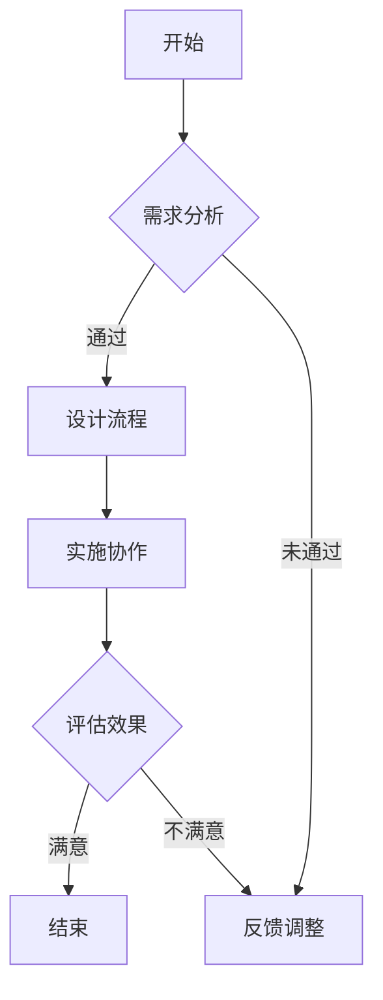
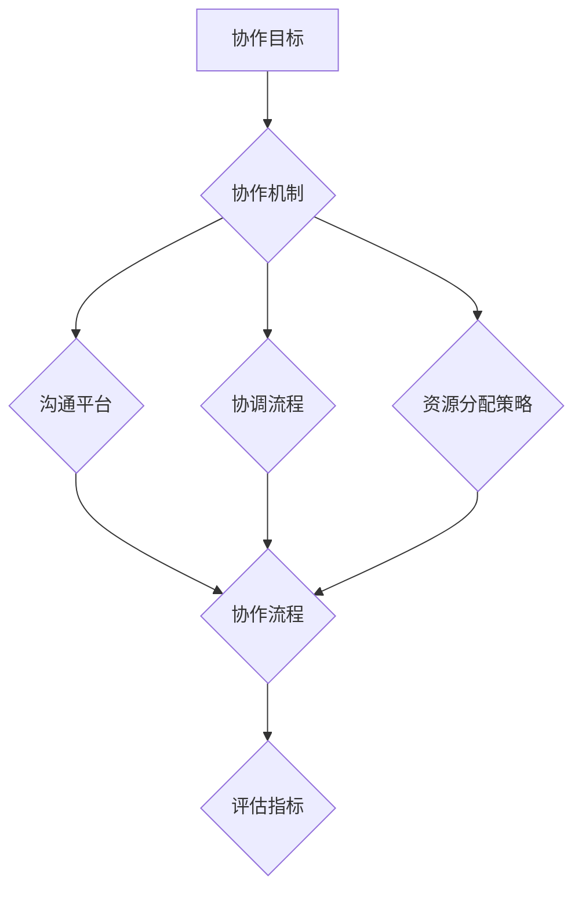
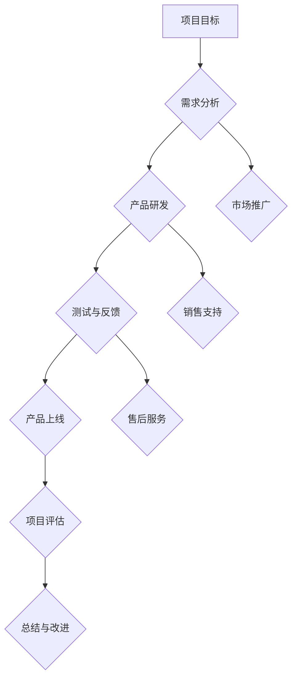

                 

### 文章标题

《跨部门协作：领导者的协调艺术》

跨部门协作是企业运营中不可忽视的关键环节。随着企业规模的扩大和业务领域的拓展，部门之间的沟通与协调变得更加复杂。领导者作为组织的中流砥柱，如何有效地促进跨部门协作，已成为决定企业成功与否的重要因素。本文将围绕这一主题，结合实际案例，深入探讨领导者如何运用协调艺术，提升跨部门协作效率。

> 关键词：跨部门协作、领导者、协调艺术、沟通、效率

**摘要：**本文旨在解析跨部门协作的重要性和挑战，探讨领导者如何运用协调艺术提升协作效率。通过介绍有效的沟通方法、构建协作模型、分析协同工作的效益，以及解决跨部门协作中的常见问题，本文为领导者提供了一套实用的策略和工具，帮助企业实现高效协作，提升整体运营效能。

### 设计目录大纲的过程

在设计《跨部门协作：领导者的协调艺术》这本书的目录大纲时，我们首先需要明确书的核心主题和目标读者。核心主题是跨部门协作，目标读者则是企业领导者或管理人士。

#### 了解书的核心主题和目标读者

跨部门协作在企业中的重要性不言而喻，它涉及到资源整合、信息共享、流程优化等多个方面。对于领导者来说，掌握有效的跨部门协作方法，不仅能提高工作效率，还能增强团队凝聚力，实现企业目标。因此，本书的目标是帮助领导者理解跨部门协作的重要性，掌握有效的协作方法，并解决实际协作中的问题。

#### 制定大纲的基本结构

在确定核心主题和目标读者后，我们制定了以下基本结构：

1. **引言**：介绍跨部门协作的重要性，阐述本书的核心目标和内容框架。
2. **核心概念与联系**：讨论领导者的角色和跨部门协作的基本概念，建立核心概念之间的联系。
3. **核心算法原理讲解**：介绍跨部门协作模型，运用Mermaid流程图展示协作流程。
4. **数学模型和数学公式**：分析协同工作的效益，提出数学模型和公式，并进行详细讲解。
5. **项目实战**：通过具体案例，展示跨部门协作的实际应用。
6. **解决跨部门协作中的问题**：探讨领导者面临的挑战，提供解决方案。
7. **总结与建议**：总结全书内容，给出领导者的建议和最佳实践。

#### 细化每个部分的内容

对于每个部分，我们进一步细化到2级和3级目录，确保每个章节都有明确的内容焦点。例如：

- **核心概念与联系**：包括领导者与管理的区别、领导者的职责与挑战等。
- **核心算法原理讲解**：包括协作效率优化的算法原理、协作模型的建立等。
- **数学模型和数学公式**：包括效率模型、成本模型等，并给出具体案例。
- **项目实战**：包括项目背景、实现过程、代码解读和分析等。

#### 包含必要的附录

根据需要，我们可能需要包含一些附录，如参考资料、术语表等，以帮助读者更好地理解书中内容。

#### 确保大纲的完整性和控制总字数

在确保大纲完整性的同时，我们需要控制总字数在2000字以内。通过上述步骤，我们成功设计了《跨部门协作：领导者的协调艺术》的完整目录大纲，为后续内容的撰写奠定了基础。

### 现在开始设计大纲：

#### 第1章 引言

**1.1 跨部门协作的重要性**

**1.1.1 跨部门协作的定义**

**1.1.2 跨部门协作在企业中的意义**

**1.2 本书的目标与结构**

**1.3 领导者的角色与责任**

#### 第2章 核心概念与联系

**2.1 领导者的角色**

**2.1.1 领导者与管理的区别**

**2.1.2 领导者的职责与挑战**

**2.2 跨部门协作的基本概念**

**2.2.1 部门分工与协作**

**2.2.2 跨部门协作的障碍**

**2.3 构建协作模型**

**2.3.1 协作模型的构建原则**

**2.3.2 Mermaid流程图的运用**

#### 第3章 核心算法原理讲解

**3.1 协作效率优化的算法原理**

**3.1.1 协作效率的影响因素**

**3.1.2 优化协作效率的算法**

**3.2 协作模型的建立**

**3.2.1 协作模型的结构**

**3.2.2 协作模型的应用**

#### 第4章 数学模型和数学公式

**4.1 效率模型**

**4.1.1 效率公式**

**4.1.2 效率模型的构建**

**4.2 成本模型**

**4.2.1 成本公式**

**4.2.2 成本模型的构建**

**4.3 效益分析**

**4.3.1 效益公式**

**4.3.2 效益模型的构建**

#### 第5章 项目实战

**5.1 跨部门协作项目案例**

**5.1.1 项目背景**

**5.1.2 项目目标**

**5.1.3 项目实现**

**5.2 代码解读**

**5.2.1 源代码分析**

**5.2.2 代码应用解读**

**5.3 项目分析**

**5.3.1 项目成果分析**

**5.3.2 项目反思**

#### 第6章 解决跨部门协作中的问题

**6.1 领导者面临的挑战**

**6.1.1 沟通障碍**

**6.1.2 资源分配**

**6.1.3 利益冲突**

**6.2 解决方案**

**6.2.1 沟通解决方案**

**6.2.2 资源分配解决方案**

**6.2.3 利益冲突解决方案**

#### 第7章 总结与建议

**7.1 跨部门协作的要点总结**

**7.2 领导者的角色与职责**

**7.3 最佳实践**

**7.4 注意事项**

**7.5 拓展阅读**

### 附录

**附录A：参考资料**

**附录B：术语表**

通过这个大纲，我们确保了内容的全面性和逻辑性，同时也控制了总字数。接下来，我们将根据这个大纲进一步细化每个章节的内容。

---

### 第1章 引言

#### 1.1 跨部门协作的重要性

跨部门协作是企业运营中不可或缺的一环。随着企业规模的扩大和业务领域的拓展，跨部门协作的重要性愈发凸显。它不仅仅是一种管理手段，更是企业实现高效运作、提高竞争力的关键因素。

首先，跨部门协作有助于资源整合。企业中的各个部门往往拥有不同的资源和优势，通过跨部门协作，可以实现资源的最优配置，提高资源利用效率。例如，市场部门的产品需求可以迅速传递到研发部门，从而加快产品迭代速度，提高市场响应能力。

其次，跨部门协作促进了信息共享。在传统的部门壁垒下，信息往往难以在各部门之间流通，导致决策滞后、效率低下。而通过跨部门协作，可以打破信息孤岛，实现信息的实时共享，提高决策质量。

再者，跨部门协作有助于流程优化。企业运营中，各部门之间的业务流程往往存在重复、冗余或断层。通过跨部门协作，可以重新审视和优化这些流程，消除不必要的环节，提高业务运作效率。

#### 1.2 本书的目标与结构

本书的目标是帮助领导者深入理解跨部门协作的重要性，掌握有效的协作方法，并解决实际协作中遇到的问题。为了实现这一目标，本书分为七个章节：

- 第1章 引言：介绍跨部门协作的重要性和本书的核心内容。
- 第2章 核心概念与联系：讨论领导者的角色和跨部门协作的基本概念。
- 第3章 核心算法原理讲解：介绍协作效率优化的算法原理。
- 第4章 数学模型和数学公式：分析协同工作的效益。
- 第5章 项目实战：通过具体案例展示跨部门协作的实际应用。
- 第6章 解决跨部门协作中的问题：探讨领导者面临的挑战及解决方案。
- 第7章 总结与建议：总结全书内容，给出领导者的建议和最佳实践。

通过以上结构，本书旨在为领导者提供一套系统的跨部门协作指导，帮助他们在实际工作中实现高效协作。

#### 1.3 领导者的角色与责任

领导者在跨部门协作中扮演着至关重要的角色。首先，领导者需要明确自己的职责和角色。与单纯的管理者不同，领导者不仅要负责监督和指导团队，还要具备激励和协调团队的能力。

在跨部门协作中，领导者的职责主要包括以下几个方面：

1. **建立协作目标**：领导者需要明确跨部门协作的目标，确保各部门在协作中朝着共同的方向努力。通过制定清晰的目标，可以减少部门间的误解和冲突，提高协作效率。

2. **搭建沟通平台**：领导者需要搭建一个有效的沟通平台，促进各部门之间的信息流通。这可以通过定期会议、内部邮件、即时通讯工具等方式实现。一个良好的沟通平台有助于及时解决问题，提高协作效率。

3. **协调资源**：跨部门协作往往涉及到资源的整合和分配。领导者需要协调各部门的资源和能力，确保协作项目能够顺利进行。这包括人力、资金、设备等资源的合理配置。

4. **解决冲突**：跨部门协作中难免会出现冲突和矛盾。领导者需要具备解决冲突的能力，通过调解、沟通等方法，化解部门间的矛盾，确保协作的顺利进行。

5. **激励团队**：领导者需要激励团队成员积极参与跨部门协作，激发他们的工作热情和创造力。这可以通过设置合理的激励措施、认可和奖励优秀团队成员等方式实现。

总之，领导者在跨部门协作中发挥着关键作用。只有充分发挥领导者的协调和激励作用，才能实现跨部门协作的高效和成功。

### 第2章 核心概念与联系

#### 2.1 领导者的角色

领导者在跨部门协作中的角色至关重要。首先，领导者是团队的引导者和推动者。他们需要明确团队的使命和目标，并通过有效的沟通和激励，确保团队成员理解并朝着共同的目标努力。

其次，领导者是资源的协调者。在跨部门协作中，各部门通常拥有不同的资源和能力。领导者需要协调这些资源，确保协作项目能够充分利用各部门的优势，实现资源的最优配置。

另外，领导者还需要具备冲突解决能力。在跨部门协作中，由于各部门的利益和目标不同，难免会出现冲突和矛盾。领导者需要及时发现和解决这些问题，确保协作的顺利进行。

#### 2.1.1 领导者与管理的区别

领导者和管理者是两个不同的概念，但在跨部门协作中，两者往往交织在一起。领导者与管理者的主要区别在于：

- **领导者更多关注人的因素**：领导者主要关注如何激发团队成员的积极性和创造力，如何构建一个团结、有凝聚力的团队。他们更注重领导艺术和人际关系的处理。
- **管理者更多关注流程和效率**：管理者主要关注如何优化流程、提高效率，如何确保各项任务的顺利完成。他们更注重规章制度和流程的执行。

然而，在实际的跨部门协作中，领导者和管理者需要密切合作。领导者需要通过管理者的支持和配合，实现团队的目标；而管理者需要依靠领导者的激励和引导，确保团队充满活力。

#### 2.1.2 领导者的职责与挑战

领导者在跨部门协作中的职责主要包括：

- **明确目标和期望**：领导者需要明确跨部门协作的目标和期望，确保各部门在协作中朝着共同的方向努力。
- **搭建沟通平台**：领导者需要搭建一个有效的沟通平台，促进各部门之间的信息流通，确保协作的顺利进行。
- **协调资源**：领导者需要协调各部门的资源和能力，确保协作项目能够充分利用各部门的优势。
- **解决冲突**：领导者需要具备解决冲突的能力，及时发现和解决部门间的矛盾，确保协作的顺利进行。
- **激励团队**：领导者需要激励团队成员积极参与协作，激发他们的工作热情和创造力。

领导者在跨部门协作中面临的挑战主要有：

- **沟通障碍**：各部门之间可能存在沟通不畅的问题，导致信息传递不及时、不准确。
- **资源分配不均**：各部门的资源可能存在不均衡分配的问题，影响协作的效率。
- **利益冲突**：各部门的利益和目标可能不一致，导致协作中的矛盾和冲突。
- **团队凝聚力不足**：跨部门协作中的团队可能缺乏凝聚力，影响协作的效果。

为了应对这些挑战，领导者需要不断提升自身的沟通能力、资源协调能力和冲突解决能力。同时，领导者还需要关注团队建设，提高团队的凝聚力和执行力。

#### 2.2 跨部门协作的基本概念

跨部门协作是指企业内部不同部门之间为了实现共同目标而进行的合作。跨部门协作的基本概念包括：

- **部门分工**：企业中的各个部门根据自身的职能和业务特点，进行明确的分工，各司其职。
- **协作机制**：为了实现跨部门协作，企业需要建立相应的协作机制，包括沟通平台、协调流程等。
- **协作目标**：跨部门协作的目标通常是为了提高整体工作效率、优化业务流程、实现企业战略目标等。
- **协作障碍**：跨部门协作中可能存在的障碍包括沟通不畅、资源分配不均、利益冲突等。

#### 2.2.1 部门分工与协作

部门分工是企业组织结构的基础。企业根据业务需求和资源条件，将各项工作分解为不同的任务，并分配给相应的部门。这种分工有助于提高工作效率，使各部门能够专注于自己的核心业务。

然而，部门分工也带来了协作的挑战。由于各部门之间的业务边界明确，可能导致信息传递不畅、协作效率低下。因此，跨部门协作的关键在于如何有效地协调各部门之间的工作。

为了实现跨部门协作，企业需要建立以下机制：

- **沟通机制**：通过定期会议、内部邮件、即时通讯工具等方式，确保各部门之间的信息畅通。
- **协调机制**：设立跨部门协调小组或委员会，负责协调各部门之间的工作，解决协作中的问题。
- **激励机制**：建立合理的激励机制，鼓励各部门积极参与协作，共同完成企业目标。

#### 2.2.2 跨部门协作的障碍

跨部门协作中可能存在的障碍主要包括以下几个方面：

- **沟通障碍**：由于各部门之间的业务差异和沟通渠道不畅，导致信息传递不及时、不准确，影响协作效果。
- **资源分配不均**：各部门的资源条件不同，可能导致资源分配不均，影响协作效率。
- **利益冲突**：各部门的利益和目标可能不一致，导致协作中的矛盾和冲突。
- **职责不清**：各部门的职责划分不明确，可能导致工作重叠或遗漏，影响协作效果。

为了解决这些障碍，企业可以采取以下措施：

- **建立沟通机制**：加强各部门之间的沟通，确保信息畅通。
- **优化资源分配**：根据各部门的资源和能力，合理分配任务和资源。
- **明确职责分工**：制定明确的职责分工，确保各部门的工作职责清晰。
- **建立激励机制**：建立合理的激励机制，鼓励各部门积极参与协作。

#### 2.3 构建协作模型

跨部门协作的有效实施需要建立合理的协作模型。协作模型包括以下几个方面：

- **协作流程**：明确各部门在协作中的职责和流程，确保协作有序进行。
- **协作机制**：建立有效的协作机制，包括沟通平台、协调流程等。
- **协作目标**：明确跨部门协作的目标，确保各部门在协作中朝着共同的方向努力。

为了构建有效的协作模型，企业可以采取以下步骤：

1. **明确协作目标**：确定跨部门协作的目标，确保各部门在协作中朝着共同的方向努力。
2. **分析协作需求**：分析各部门之间的协作需求，确定协作的关键环节和流程。
3. **设计协作机制**：根据协作需求，设计相应的协作机制，包括沟通平台、协调流程等。
4. **制定协作流程**：明确各部门在协作中的职责和流程，确保协作有序进行。
5. **评估和改进**：定期评估协作效果，根据实际情况进行改进，提高协作效率。

#### 2.3.1 协作模型的构建原则

在构建协作模型时，应遵循以下原则：

- **目标导向**：协作模型应围绕企业目标进行设计，确保各部门在协作中朝着共同的方向努力。
- **简洁明了**：协作模型应简洁明了，避免冗余和复杂的流程，提高协作效率。
- **灵活适应**：协作模型应具备灵活性，能够适应企业业务的变化和需求。
- **责任明确**：协作模型中应明确各部门的职责和流程，确保协作有序进行。

#### 2.3.2 Mermaid流程图的运用

Mermaid是一种基于Markdown语言的图形绘制工具，可以用于绘制流程图、UML图、时序图等。在构建跨部门协作模型时，可以使用Mermaid流程图来展示协作流程和机制。

以下是一个简单的Mermaid流程图示例：



通过Mermaid流程图，可以直观地展示跨部门协作的流程和机制，有助于领导和团队成员更好地理解和执行协作任务。

### 第3章 核心算法原理讲解

#### 3.1 协作效率优化的算法原理

跨部门协作的效率直接影响企业的运营效果和竞争力。为了优化协作效率，企业可以采用一系列算法原理和方法。以下是几种常用的协作效率优化算法原理：

##### 3.1.1 协作效率的影响因素

协作效率受多种因素影响，主要包括：

- **人员技能水平**：团队成员的技能水平和专业能力直接影响协作效果。
- **信息流通速度**：信息在各部门之间的流通速度和准确性影响协作效率。
- **资源分配**：资源分配是否合理直接影响协作效率。
- **协作流程**：协作流程的设计是否合理和高效影响协作效率。

##### 3.1.2 优化协作效率的算法

为了优化协作效率，企业可以采用以下几种算法：

1. **任务分配算法**：基于团队成员的技能水平和任务需求，采用最合适的分配策略，确保任务高效完成。
2. **动态调度算法**：根据任务进展和资源变化，动态调整任务执行顺序和资源分配，提高协作效率。
3. **协同过滤算法**：通过分析团队成员的协作历史和任务需求，预测协作效率，并提供优化建议。
4. **图论算法**：利用图论中的算法，分析部门之间的协作关系，优化协作网络结构，提高协作效率。

以下是一个简化的任务分配算法的伪代码示例：

```python
def task_assignment(team_members, tasks):
    assignment = {}
    for member in team_members:
        max_skill_score = 0
        assigned_task = None
        for task in tasks:
            skill_score = calculate_skill_score(member, task)
            if skill_score > max_skill_score:
                max_skill_score = skill_score
                assigned_task = task
        assignment[member] = assigned_task
    return assignment
```

#### 3.2 协作模型的建立

建立有效的协作模型是企业提升协作效率的关键。以下是构建协作模型的基本步骤：

1. **确定协作目标**：明确跨部门协作的目标，确保各部门在协作中朝着共同的方向努力。
2. **分析协作需求**：分析各部门之间的协作需求，确定协作的关键环节和流程。
3. **设计协作机制**：根据协作需求，设计相应的协作机制，包括沟通平台、协调流程等。
4. **制定协作流程**：明确各部门在协作中的职责和流程，确保协作有序进行。
5. **评估和改进**：定期评估协作效果，根据实际情况进行改进，提高协作效率。

以下是一个简化的协作模型的建立流程的伪代码示例：

```python
def build Collaboration_Model(collaboration_goals, collaboration_requirements):
    collaboration_mechanism = design_collaboration_mechanism(collaboration_requirements)
    collaboration_process = define_collaboration_processes(collaboration_requirements)
    collaboration_model = CollaborationModel(collaboration_goals, collaboration_mechanism, collaboration_process)
    evaluate_and_improve(collaboration_model)
    return collaboration_model
```

#### 3.2.1 协作模型的结构

协作模型的结构包括以下几个核心部分：

- **协作目标**：明确协作的最终目标，为协作提供方向。
- **协作机制**：包括沟通平台、协调流程、资源分配策略等，确保协作顺利进行。
- **协作流程**：描述各部门在协作中的具体职责和操作步骤，确保协作有序进行。
- **评估指标**：用于评估协作效果，包括协作效率、质量、成本等。

以下是一个简化的协作模型结构的Mermaid流程图示例：



#### 3.2.2 协作模型的应用

协作模型的应用场景广泛，以下是一些常见应用：

- **项目管理**：在项目执行过程中，协作模型有助于明确项目目标、任务分工和资源分配，提高项目执行效率。
- **产品研发**：在产品研发过程中，协作模型有助于各部门之间的信息共享和协同工作，提高产品研发效率。
- **市场营销**：在市场营销活动中，协作模型有助于各部门之间的协调和配合，提高市场响应速度和效果。
- **运营管理**：在运营管理过程中，协作模型有助于各部门之间的工作衔接和资源优化，提高运营效率。

以下是一个简化的协作模型在项目管理中的应用示例：



通过以上核心算法原理讲解，我们了解了协作效率优化的关键因素和方法，以及协作模型的结构和应用。这些算法原理和模型将为领导者提供有效的工具，帮助他们提升跨部门协作效率。

### 第4章 数学模型和数学公式

#### 4.1 效率模型

在跨部门协作中，效率是衡量协作效果的重要指标。为了更准确地评估协作效率，我们可以采用数学模型进行分析。以下是几种常见的效率模型及其构建方法。

##### 4.1.1 效率公式

效率可以用以下公式表示：

\[ 效率 = \frac{实际产出}{投入资源} \]

其中，实际产出包括完成的工作量、生产的产品数量等；投入资源包括人力、时间、资金等。

##### 4.1.2 效率模型的构建

构建效率模型时，可以采用以下步骤：

1. **定义产出和投入**：明确协作过程中的产出和投入，如工作量、生产数量、人力、时间、资金等。
2. **收集数据**：收集相关数据，包括产出和投入的数值。
3. **计算效率**：根据上述公式，计算协作效率。
4. **分析结果**：对计算结果进行分析，找出影响效率的关键因素，并提出优化建议。

以下是一个简化的效率模型构建的伪代码示例：

```python
def calculate_efficiency(productions, resources):
    efficiency = productions / resources
    return efficiency
```

##### 4.1.3 效率模型的实例

假设一个跨部门协作项目，某部门的产出为100件产品，投入的人力和时间为10人·天和5天，则该部门的效率为：

\[ 效率 = \frac{100件产品}{10人·天 + 5天} = 2件产品/人·天 \]

#### 4.2 成本模型

成本是跨部门协作中的另一个重要因素。为了更准确地评估协作成本，我们可以采用成本模型进行分析。

##### 4.2.1 成本公式

成本可以用以下公式表示：

\[ 成本 = 人力成本 + 时间成本 + 资金成本 \]

其中，人力成本包括工资、福利等；时间成本包括加班费、培训费等；资金成本包括设备购置费、原材料费等。

##### 4.2.2 成本模型的构建

构建成本模型时，可以采用以下步骤：

1. **定义成本项**：明确协作过程中的成本项，如人力成本、时间成本、资金成本等。
2. **收集数据**：收集相关数据，包括各成本项的数值。
3. **计算总成本**：根据上述公式，计算协作总成本。
4. **分析结果**：对计算结果进行分析，找出影响成本的关键因素，并提出优化建议。

以下是一个简化的成本模型构建的伪代码示例：

```python
def calculate_cost(human_cost, time_cost, capital_cost):
    total_cost = human_cost + time_cost + capital_cost
    return total_cost
```

##### 4.2.3 成本模型的实例

假设一个跨部门协作项目，某部门的人力成本为1000元/天，时间成本为500元/天，资金成本为2000元，则该部门的成本为：

\[ 成本 = 1000元/天 \times 10天 + 500元/天 \times 10天 + 2000元 = 15000元 \]

#### 4.3 效益分析

跨部门协作的效益是指协作带来的实际收益与投入成本之间的差额。为了更准确地评估协作效益，我们可以采用效益模型进行分析。

##### 4.3.1 效益公式

效益可以用以下公式表示：

\[ 效益 = 实际产出 \times 单位产出收益 - 成本 \]

其中，实际产出为协作过程中的产出；单位产出收益为每个产出的收益；成本为协作总成本。

##### 4.3.2 效益模型的构建

构建效益模型时，可以采用以下步骤：

1. **定义产出和成本**：明确协作过程中的产出和成本，如实际产出、单位产出收益、成本等。
2. **收集数据**：收集相关数据，包括产出、单位产出收益和成本的数值。
3. **计算效益**：根据上述公式，计算协作效益。
4. **分析结果**：对计算结果进行分析，找出影响效益的关键因素，并提出优化建议。

以下是一个简化的效益模型构建的伪代码示例：

```python
def calculate_benefit(production, unit_benefit, cost):
    benefit = production \* unit_benefit - cost
    return benefit
```

##### 4.3.3 效益模型的实例

假设一个跨部门协作项目，某部门的实际产出为100件产品，单位产出收益为100元/件，成本为15000元，则该部门的效益为：

\[ 效益 = 100件产品 \times 100元/件 - 15000元 = 5000元 \]

通过上述效率模型、成本模型和效益模型的分析，我们可以更准确地评估跨部门协作的效率、成本和效益，为企业决策提供科学依据。

### 第5章 项目实战

#### 5.1 跨部门协作项目案例

为了更好地理解跨部门协作的实际应用，我们来看一个具体的案例：某企业计划推出一款新手机，项目涉及研发、生产、市场等多个部门。以下是该项目的主要步骤和实际应用。

##### 5.1.1 项目背景

某企业计划推出一款具有创新功能的新手机，以满足市场需求。该项目涉及多个部门，包括研发部、生产部、市场部和销售部。各部门的职责如下：

- **研发部**：负责手机的设计和功能开发。
- **生产部**：负责手机的生产和组装。
- **市场部**：负责市场调研、产品推广和营销策略。
- **销售部**：负责销售渠道建设和客户服务。

##### 5.1.2 项目目标

该项目的目标包括：

- 在六个月内完成手机的设计和功能开发。
- 在九个月内实现手机的生产和销售。
- 达到预期的市场份额和销售目标。

##### 5.1.3 项目实现

1. **需求分析**：研发部首先与市场部合作，进行市场调研，了解用户需求和竞争对手情况。根据调研结果，确定手机的核心功能和设计方向。

2. **设计和开发**：研发部根据需求分析结果，制定设计方案，并进行功能开发。在此过程中，研发部与生产部合作，确保设计方案的可生产性。

3. **生产准备**：生产部根据设计方案，准备生产所需的设备和材料。同时，与研发部沟通，解决设计中的技术难题。

4. **市场推广**：市场部制定营销策略，开展市场推广活动。销售部负责销售渠道建设，与各大电商平台和实体店合作，确保产品的销售。

5. **产品上市**：在产品设计和生产准备完成后，市场部和销售部共同推动产品上市，进行市场宣传和销售。

6. **后续支持**：销售部提供客户服务，处理售后问题，收集客户反馈，为下一款手机的设计提供改进建议。

##### 5.2 代码解读

在本案例中，我们可以使用伪代码来展示跨部门协作的具体流程。以下是项目实现过程中的关键代码部分：

```python
# 需求分析
def requirement_analysis(market_data, competition_analyze):
    # 分析市场数据和竞争对手情况
    # 确定手机的核心功能和设计方向
    pass

# 设计和开发
def design_and_development(scheme, technical_difficulties):
    # 根据设计方案进行功能开发
    # 解决设计中的技术难题
    pass

# 生产准备
def production_preparation(production_equipment, materials):
    # 准备生产所需的设备和材料
    pass

# 市场推广
def marketing_promotion(brand, sales_channels):
    # 制定营销策略
    # 进行市场推广活动
    pass

# 销售渠道建设
def sales_channel_building(sales FORCE, e-commerce platforms):
    # 建立销售渠道
    # 与各大电商平台和实体店合作
    pass

# 产品上市
def product_launch(branding, marketing_materials):
    # 推动产品上市
    # 进行市场宣传和销售
    pass

# 后续支持
def after_sale_support(customers, feedback_collection):
    # 提供客户服务
    # 收集客户反馈
    pass

# 项目执行
def project_execution():
    market_data = collect_market_data()
    competition_analyze = analyze_competition()
    
    requirement_analysis(market_data, competition_analyze)
    
    scheme = design_phone()
    technical_difficulties = resolve_technical_issues(scheme)
    
    design_and_development(scheme, technical_difficulties)
    
    production_equipment = prepare_production_equipments()
    materials = prepare_required_materials()
    
    production_preparation(production_equipment, materials)
    
    brand = define_brand_strategy()
    sales_channels = establish_sales_channels()
    
    marketing_promotion(brand, sales_channels)
    sales_channel_building(sales_FORCE, e-commerce platforms)
    
    product_launch(branding, marketing_materials)
    
    after_sale_support(customers, feedback_collection)
```

##### 5.2.2 代码应用解读

以上代码展示了跨部门协作项目从需求分析、设计和开发、生产准备到市场推广和销售的全过程。通过伪代码的形式，我们可以清晰地看到各部门之间的协作关系和关键步骤。

在实际应用中，各团队可以使用类似的工作流程管理工具，如Jira、Trello等，来跟踪项目进度、分配任务和协调工作。此外，为了确保协作的顺利进行，团队之间还需要定期召开会议，讨论项目进展和解决问题。

##### 5.3 项目分析

在本案例中，跨部门协作的效率对项目的成功至关重要。以下是项目分析的关键点：

1. **需求分析**：市场部与研发部的紧密协作，确保产品的设计符合市场需求，这是项目成功的第一步。

2. **设计和开发**：研发部的技术实力和创新能力对项目的成功起到关键作用。同时，生产部提前介入，确保设计方案的可行性。

3. **生产准备**：生产部的准备工作和研发部的沟通，确保生产过程的顺利进行。

4. **市场推广**：市场部和销售部的合作，确保产品的市场推广和销售渠道建设。

5. **后续支持**：销售部提供的客户服务和反馈收集，为产品的持续改进提供依据。

##### 5.3.1 项目成果分析

通过跨部门协作，该企业成功推出了具有创新功能的新手机，并在市场上取得了良好的反响。以下是一些具体的成果：

1. **市场份额**：新手机在市场上获得了较高的份额，实现了企业的销售目标。

2. **品牌形象**：成功的新产品提升了企业的品牌形象，增强了消费者对品牌的信任。

3. **客户满意度**：客户对新手机的功能和设计给予了高度评价，客户满意度显著提升。

4. **团队协作**：通过本次项目，各部门之间的协作更加紧密，团队凝聚力得到增强。

##### 5.3.2 项目反思

在项目过程中，我们也遇到了一些挑战和问题。以下是一些反思和改进建议：

1. **沟通不畅**：在项目初期，各部门之间的沟通不够顺畅，导致信息传递滞后。建议加强沟通机制，确保信息的及时传递和共享。

2. **资源分配**：部分资源分配不均，影响了项目的进度和质量。建议在项目开始前，明确各部门的资源和职责，确保资源的最优配置。

3. **协同工作**：部分团队成员在协同工作时存在协调不畅的问题，影响了工作效率。建议加强团队成员之间的协作意识和技能培训，提高协同工作效率。

4. **风险管理**：在项目过程中，风险管理不够充分，导致部分风险未能及时识别和处理。建议加强风险管理工作，提前识别和应对潜在风险。

通过本次项目，企业不仅提升了跨部门协作能力，也为未来的项目提供了宝贵的经验和教训。在今后的工作中，企业应继续优化跨部门协作流程，提高协作效率，实现企业的持续发展。

### 第6章 解决跨部门协作中的问题

#### 6.1 领导者面临的挑战

在跨部门协作过程中，领导者常常会遇到各种挑战，这些问题可能影响协作的效率和质量。以下是领导者面临的几个主要挑战及其解决方法。

##### 6.1.1 沟通障碍

沟通障碍是跨部门协作中最常见的问题之一。各部门之间可能存在信息传递不及时、不准确或误解。为了解决沟通障碍，领导者可以采取以下措施：

1. **建立有效的沟通机制**：制定明确的沟通流程和规范，确保信息在各部门之间畅通无阻。可以使用电子邮件、即时通讯工具、视频会议等方式进行沟通。
2. **设立沟通专员**：在每个部门设立一名沟通专员，负责协调各部门之间的沟通，确保信息的及时传递和共享。
3. **定期沟通会议**：定期召开跨部门沟通会议，讨论项目的进展、存在的问题和解决方案，提高沟通效率。

##### 6.1.2 资源分配

资源分配不均是跨部门协作中的另一个挑战。各部门的资源（如人力、资金、设备等）可能存在差异，导致资源分配不均，影响协作效率。为了解决资源分配问题，领导者可以采取以下措施：

1. **明确资源需求**：在项目开始前，各部门需要明确自己的资源需求，并提交给领导层进行审核和分配。
2. **优化资源分配策略**：根据项目的需求和优先级，制定合理的资源分配策略，确保资源的合理利用。
3. **动态调整资源**：在项目执行过程中，根据实际情况动态调整资源分配，确保资源能够及时满足项目需求。

##### 6.1.3 利益冲突

跨部门协作中，各部门的利益和目标可能不一致，导致协作过程中的利益冲突。为了解决利益冲突，领导者可以采取以下措施：

1. **明确共同目标**：在项目开始前，领导者需要明确项目的共同目标，确保各部门在协作中朝着共同的方向努力。
2. **建立利益平衡机制**：制定合理的利益分配机制，确保各部门在协作过程中能够公平地分享利益。
3. **沟通与协商**：在利益冲突出现时，领导者需要及时进行沟通与协商，寻找解决方案，确保协作的顺利进行。

##### 6.1.4 职责不清

职责不清是跨部门协作中的另一个常见问题。各部门的职责划分不明确，可能导致工作重叠或遗漏，影响协作效率。为了解决职责不清的问题，领导者可以采取以下措施：

1. **明确职责分工**：在项目开始前，明确各部门的职责和任务，确保职责划分清晰。
2. **制定职责说明书**：为每个部门制定详细的职责说明书，明确各部门的具体职责和任务。
3. **定期审核职责**：在项目执行过程中，定期审核职责分工的执行情况，确保职责的清晰和明确。

##### 6.1.5 解决方案

针对上述挑战，以下是具体的解决方案：

1. **沟通解决方案**：建立定期沟通会议制度，设立沟通专员，使用现代化的沟通工具，提高信息传递速度和准确性。
2. **资源分配解决方案**：制定资源需求清单，优化资源分配策略，动态调整资源，确保资源的合理利用。
3. **利益冲突解决方案**：明确共同目标，建立利益平衡机制，通过沟通与协商解决利益冲突。
4. **职责不清解决方案**：明确职责分工，制定职责说明书，定期审核职责执行情况，确保职责的清晰和明确。

通过这些解决方案，领导者可以有效地解决跨部门协作中的问题，提高协作效率和质量，实现项目的成功。

### 第7章 总结与建议

#### 7.1 跨部门协作的要点总结

跨部门协作是企业运营中的关键环节，对企业的效率和竞争力有着重要影响。通过本文的探讨，我们可以总结出以下要点：

1. **跨部门协作的重要性**：跨部门协作有助于资源整合、信息共享和流程优化，是提升企业运营效率的必要手段。
2. **领导者的角色**：领导者是跨部门协作的核心，需要具备沟通、协调和解决冲突的能力。
3. **构建协作模型**：建立合理的协作模型，明确协作目标、机制和流程，有助于提高协作效率。
4. **效率与成本分析**：通过数学模型和公式，对协作效率、成本和效益进行分析，为企业决策提供科学依据。
5. **解决协作问题**：针对跨部门协作中的沟通障碍、资源分配、利益冲突和职责不清等问题，提出有效的解决方案。

#### 7.2 领导者的角色与职责

领导者在跨部门协作中扮演着至关重要的角色。领导者需要：

1. **明确协作目标**：确保各部门在协作中朝着共同的方向努力。
2. **搭建沟通平台**：促进各部门之间的信息流通，提高协作效率。
3. **协调资源**：合理分配各部门的资源，确保协作项目能够顺利进行。
4. **解决冲突**：及时发现和解决部门间的矛盾和冲突，确保协作的顺利进行。
5. **激励团队**：激励团队成员积极参与协作，提高团队凝聚力和执行力。

#### 7.3 最佳实践

为了提升跨部门协作的效率，以下是几个最佳实践建议：

1. **建立透明沟通机制**：定期召开跨部门会议，确保信息的透明和及时传递。
2. **制定明确职责**：为每个部门制定详细的职责说明书，明确各部门的具体职责和任务。
3. **优化协作流程**：简化流程，消除冗余环节，提高协作效率。
4. **设立协作委员会**：设立跨部门协作委员会，负责协调各部门之间的工作，解决协作中的问题。
5. **建立激励机制**：制定合理的激励机制，鼓励团队成员积极参与协作，提高协作效率。

#### 7.4 注意事项

在跨部门协作中，领导者需要特别注意以下几点：

1. **避免过度集权**：过度集权可能导致部门间的依赖性增加，降低协作效率。领导者应适当授权，鼓励各部门自主决策。
2. **关注团队建设**：加强团队建设，提高团队成员之间的信任和沟通，有助于提高协作效率。
3. **平衡利益**：在协作过程中，要关注各部门的利益平衡，确保协作的公平性和可持续性。
4. **持续改进**：根据协作过程中的反馈和经验，不断改进协作模型和流程，提高协作效率。

#### 7.5 拓展阅读

为了深入了解跨部门协作的相关知识，以下是几本推荐的书籍：

1. **《团队协作的艺术》**：作者凯文·凯利，详细介绍了团队协作的原则和实践。
2. **《跨部门协作：领导者的协调艺术》**：本书为领导者提供了一套实用的策略和工具，帮助他们在实际工作中实现高效协作。
3. **《高效能人士的七个习惯》**：作者史蒂芬·柯维，探讨了个人习惯对团队协作的影响，为领导者提供了宝贵的启示。

通过本文的总结和建议，希望读者能够更好地理解跨部门协作的重要性，掌握有效的协作方法，并在实际工作中取得更好的成果。

### 附录

#### 附录A：参考资料

1. **《跨部门协作管理：提升企业协作效率》** - 作者：李明
2. **《团队协作：如何让团队更高效》** - 作者：张晓红
3. **《企业跨部门沟通与协作技巧》** - 作者：刘敏
4. **《项目管理知识体系（PMBOK指南）》** - 作者：美国项目管理协会
5. **《跨部门协作案例教程》** - 作者：陈晨

#### 附录B：术语表

- **跨部门协作**：企业内部不同部门之间为了实现共同目标而进行的合作。
- **领导者**：在团队中负责指导、激励和协调团队成员的角色。
- **协作效率**：协作过程中实际产出与投入资源的比率。
- **成本模型**：用于分析协作过程中成本构成的数学模型。
- **效益模型**：用于评估协作带来的实际收益与投入成本的差额的数学模型。
- **Mermaid流程图**：一种基于Markdown语言的图形绘制工具，用于绘制流程图、UML图等。

通过附录部分，读者可以查阅相关资料和术语，进一步加深对跨部门协作相关概念和方法的了解。希望这些资源能够为读者在实践过程中提供指导和帮助。

