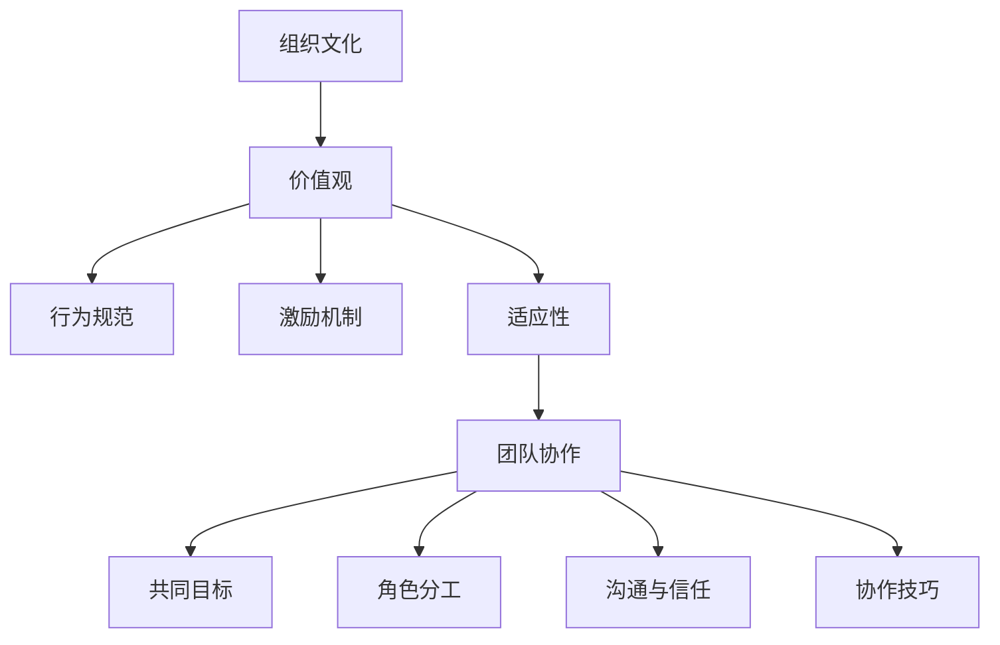
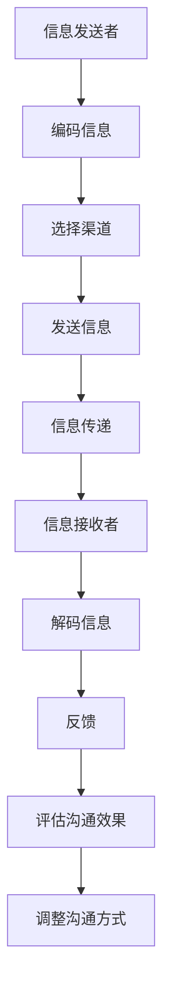
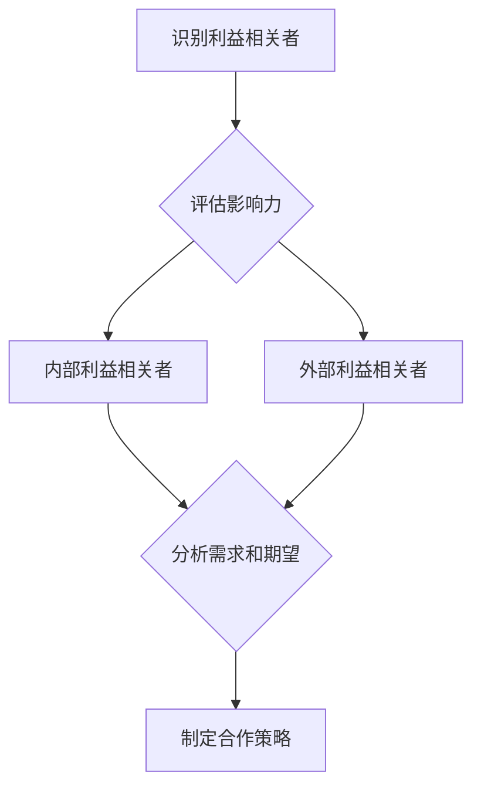
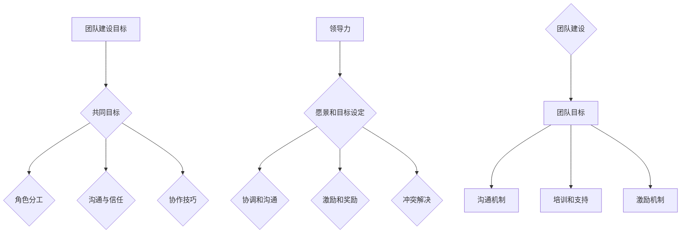
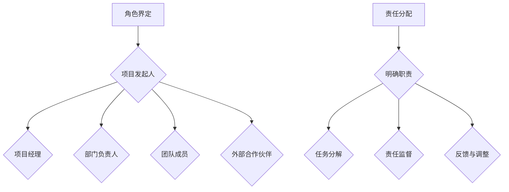
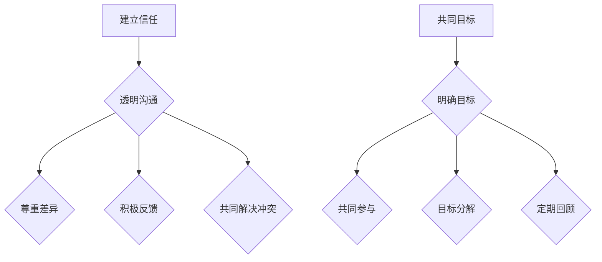
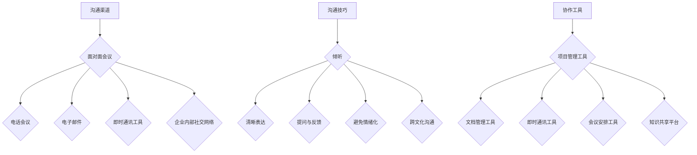
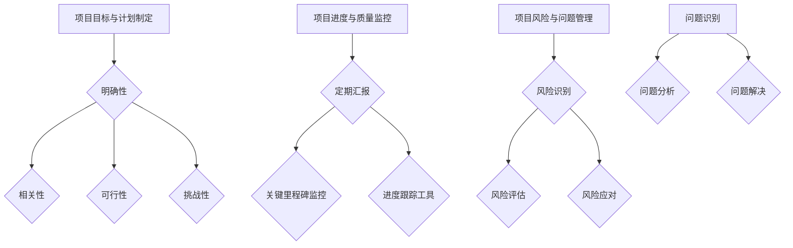

                 

### 引言

#### 跨部门合作的重要性

在当今快速变化和高度复杂的商业环境中，跨部门合作已经成为企业成功的关键因素。随着组织规模的扩大和业务种类的多样化，各个部门之间的依赖性和交互性日益增强。跨部门合作不仅能够整合资源、优化流程，还能够促进创新、提高效率，从而增强企业的竞争力。

跨部门合作的重要性体现在以下几个方面：

1. **资源整合**：通过跨部门合作，企业可以将不同部门的专业知识、技能和资源整合在一起，实现资源的最大化利用。例如，市场营销部门与研发部门合作，可以更好地理解市场需求，从而开发出更符合客户期望的产品。

2. **流程优化**：跨部门合作有助于打破信息孤岛，实现流程的无缝对接。例如，销售部门与物流部门之间的紧密协作，可以缩短产品的交付周期，提高客户满意度。

3. **创新促进**：跨部门合作鼓励不同背景和思维的碰撞，从而激发创新的火花。通过跨部门的项目合作，企业可以更好地发现和解决问题，推动技术和产品的创新。

4. **协同效应**：跨部门合作可以实现1+1>2的效果。不同的部门在合作中可以相互补充，发挥各自的优势，从而实现整体绩效的提升。

然而，尽管跨部门合作的重要性显而易见，但在实际操作中，许多企业往往面临诸多挑战。这些挑战包括部门之间的利益冲突、沟通障碍、资源分配不均等。因此，如何有效地推动跨部门合作，实现无缝协作，成为企业管理者亟需解决的重要问题。

#### 为什么跨部门合作如此困难

跨部门合作之所以困难，主要是因为以下几个方面的原因：

1. **文化差异**：不同的部门往往有着不同的工作文化、价值观和行为规范。这些差异可能导致部门之间的误解和隔阂，影响合作的顺利进行。

2. **利益冲突**：不同部门往往有自己的利益诉求，这些利益可能与其他部门产生冲突。例如，研发部门希望投入更多资源进行创新，而财务部门则希望控制成本。

3. **沟通障碍**：跨部门之间的沟通往往受到信息不对称、沟通渠道不畅等问题的影响。这可能导致信息的误解、遗漏或延迟，从而影响合作的效率和质量。

4. **资源分配不均**：在资源有限的情况下，不同部门之间的资源分配可能不均衡，导致某些部门感到资源不足，从而影响合作的效果。

5. **缺乏领导力**：跨部门合作往往需要强有力的领导力来推动和协调。然而，许多企业在跨部门合作中的领导力不足，无法有效地解决合作中的问题和冲突。

为了解决这些问题，企业需要从组织文化、管理机制、沟通渠道等方面进行改革和创新。接下来，我们将进一步探讨如何构建一个支持跨部门合作的无缝协作团队。

#### 本书的目标和结构

本书的目标是帮助企业和组织构建一个支持跨部门合作的无缝协作团队，提升组织的整体效能和竞争力。为了实现这一目标，本书将从以下几个方面展开讨论：

1. **跨部门合作的基础理论**：介绍团队协作与组织文化、跨部门沟通的理论基础以及跨部门合作的利益相关者分析，为读者提供跨部门合作的理论支撑。

2. **跨部门合作的挑战与机遇**：分析跨部门合作面临的挑战，探讨跨部门合作带来的机遇，并通过案例研究展示成功跨部门合作的实际效果。

3. **打造无缝协作的团队**：介绍团队建设与领导力、角色界定与责任分配、建立信任与共同目标等方面，提供具体的实践指南。

4. **跨部门沟通与协作工具**：探讨沟通渠道的选择、沟通技巧的提升以及协作工具的运用，帮助读者提升跨部门沟通和协作的效率。

5. **跨部门项目管理的最佳实践**：介绍项目目标与计划的制定、项目进度与质量的监控以及项目风险与问题的管理，为跨部门项目的成功提供保障。

6. **跨部门合作的成功案例分析**：通过国内外企业成功跨部门合作的实例，为读者提供实践经验和借鉴。

7. **总结与展望**：总结跨部门合作的关键要素，探讨跨部门合作的未来趋势，并提出提升跨部门合作能力的建议。

通过本书的阅读，读者将能够深入理解跨部门合作的重要性，掌握有效的跨部门合作方法和技巧，从而在各自的岗位上为组织的无缝协作贡献力量。

---

### 关键词

- **跨部门合作**
- **无缝协作团队**
- **团队建设**
- **领导力**
- **沟通障碍**
- **资源整合**
- **案例研究**
- **项目管理**

### 摘要

本文旨在探讨跨部门合作在当今商业环境中的重要性，分析其面临的挑战与机遇，并提供一套完整的跨部门合作方法和实践指南。文章首先介绍了跨部门合作的基础理论，包括团队协作与组织文化、跨部门沟通的理论基础以及利益相关者分析。接着，文章探讨了跨部门合作在实际操作中面临的挑战，如文化差异、利益冲突、沟通障碍和资源分配不均，并通过案例研究展示了成功跨部门合作的实际效果。随后，文章介绍了如何通过团队建设与领导力、角色界定与责任分配、建立信任与共同目标等方面来打造无缝协作的团队。此外，文章还探讨了跨部门沟通与协作工具的运用，以及跨部门项目管理的最佳实践。最后，文章通过国内外成功跨部门合作的案例，为读者提供了实践经验和借鉴，并对跨部门合作的未来趋势进行了展望。通过本文的阅读，读者将能够更好地理解和实施跨部门合作，提升组织的整体效能和竞争力。

---

## 第1章 引言

### 1.1 跨部门合作的重要性

跨部门合作在当今商业环境中具有重要的战略意义。随着企业规模的扩大和业务复杂性的增加，不同部门之间的协同作用变得至关重要。跨部门合作不仅能够整合资源、优化流程，还能够促进创新、提高效率，从而增强企业的竞争力。以下是跨部门合作的一些关键重要性：

1. **资源整合**：跨部门合作能够将不同部门的专业知识、技能和资源整合在一起，实现资源的最大化利用。例如，市场营销部门与研发部门合作，可以更好地理解市场需求，从而开发出更符合客户期望的产品。同样，研发部门与生产部门合作，可以确保新产品的生产效率和质量。

2. **流程优化**：跨部门合作有助于打破信息孤岛，实现流程的无缝对接。通过跨部门协作，企业可以缩短产品的交付周期，提高客户满意度。例如，销售部门与物流部门之间的紧密协作，可以确保客户订单的及时交付，从而提升客户体验。

3. **创新促进**：跨部门合作鼓励不同背景和思维的碰撞，从而激发创新的火花。通过跨部门的项目合作，企业可以更好地发现和解决问题，推动技术和产品的创新。例如，一个涉及市场、研发和供应链的项目团队，可以共同探索新的市场机会和商业模式。

4. **协同效应**：跨部门合作可以实现1+1>2的效果。不同的部门在合作中可以相互补充，发挥各自的优势，从而实现整体绩效的提升。例如，财务部门可以提供精准的财务分析，帮助市场营销部门制定更有效的营销策略。

5. **风险管理**：跨部门合作有助于识别和应对潜在的风险。通过不同部门的协作，企业可以更全面地了解项目的各个方面，从而提前预防和解决潜在的问题。例如，在大型项目开发中，技术部门可以提前识别技术风险，而市场部门可以评估市场风险。

总之，跨部门合作是现代企业实现高效运营和持续创新的重要手段。通过有效的跨部门合作，企业可以优化资源利用、提升流程效率、促进创新、降低风险，从而在激烈的市场竞争中脱颖而出。

### 1.2 为什么跨部门合作如此困难

尽管跨部门合作具有诸多优势，但在实际操作中，许多企业往往面临诸多挑战，使得跨部门合作变得困难重重。以下是跨部门合作中常见的一些困难及其原因：

1. **文化差异**：不同的部门往往有着不同的工作文化、价值观和行为规范。这些差异可能导致部门之间的误解和隔阂，影响合作的顺利进行。例如，研发部门可能更注重创新和实验，而销售部门则更看重业绩和销售目标。

2. **利益冲突**：不同部门往往有自己的利益诉求，这些利益可能与其他部门产生冲突。例如，研发部门希望投入更多资源进行创新，而财务部门则希望控制成本。这些利益冲突会导致部门之间的对立和摩擦，阻碍合作的进展。

3. **沟通障碍**：跨部门之间的沟通往往受到信息不对称、沟通渠道不畅等问题的影响。这可能导致信息的误解、遗漏或延迟，从而影响合作的效率和质量。例如，一个重要的市场信息没有及时传达给研发部门，可能导致新产品开发方向错误。

4. **资源分配不均**：在资源有限的情况下，不同部门之间的资源分配可能不均衡，导致某些部门感到资源不足，从而影响合作的效果。例如，人力资源部门可能无法提供足够的招聘资源，导致其他部门的人才短缺。

5. **缺乏领导力**：跨部门合作往往需要强有力的领导力来推动和协调。然而，许多企业在跨部门合作中的领导力不足，无法有效地解决合作中的问题和冲突。缺乏有效的领导可能导致跨部门合作的效率低下，甚至失败。

6. **缺乏共同目标**：跨部门合作需要各部门明确共同的目标和愿景。然而，在实际操作中，各部门可能缺乏对整体目标的认同感，导致合作动力不足。例如，不同部门可能只关注自己部门的短期目标，而忽视了企业的长期发展。

这些困难不仅会影响跨部门合作的效率和质量，还可能导致部门之间的不信任和矛盾。因此，企业需要识别并解决这些困难，才能实现有效的跨部门合作。

### 1.3 本书的目标和结构

本书的目标是帮助企业和组织构建一个支持跨部门合作的无缝协作团队，提升组织的整体效能和竞争力。为了实现这一目标，本书将从以下几个方面展开讨论：

1. **跨部门合作的基础理论**：介绍团队协作与组织文化、跨部门沟通的理论基础以及跨部门合作的利益相关者分析，为读者提供跨部门合作的理论支撑。

2. **跨部门合作的挑战与机遇**：分析跨部门合作面临的挑战，探讨跨部门合作带来的机遇，并通过案例研究展示成功跨部门合作的实际效果。

3. **打造无缝协作的团队**：介绍团队建设与领导力、角色界定与责任分配、建立信任与共同目标等方面，提供具体的实践指南。

4. **跨部门沟通与协作工具**：探讨沟通渠道的选择、沟通技巧的提升以及协作工具的运用，帮助读者提升跨部门沟通和协作的效率。

5. **跨部门项目管理的最佳实践**：介绍项目目标与计划的制定、项目进度与质量的监控以及项目风险与问题的管理，为跨部门项目的成功提供保障。

6. **跨部门合作的成功案例分析**：通过国内外企业成功跨部门合作的实例，为读者提供实践经验和借鉴。

7. **总结与展望**：总结跨部门合作的关键要素，探讨跨部门合作的未来趋势，并提出提升跨部门合作能力的建议。

通过本书的阅读，读者将能够深入理解跨部门合作的重要性，掌握有效的跨部门合作方法和技巧，从而在各自的岗位上为组织的无缝协作贡献力量。本书结构清晰，内容丰富，旨在为读者提供全面而实用的跨部门合作指南。

---

## 第2章 跨部门合作的基础理论

### 2.1 团队协作与组织文化

跨部门合作的核心在于团队协作。团队协作不仅仅是简单的人员组合，更是组织文化的一部分，它影响着团队的工作效率和创新能力。在探讨跨部门合作之前，我们需要了解团队协作与组织文化的紧密关系。

#### 团队协作的概念

团队协作是指团队成员为了实现共同目标而相互配合、共同努力的过程。成功的团队协作需要以下几个关键要素：

1. **共同目标**：团队成员需要明确共同的目标和愿景，这有助于形成团队共识，提高团队的凝聚力。

2. **角色分工**：每个团队成员都应明确自己的角色和责任，这有助于提高工作效率和避免重复劳动。

3. **沟通与信任**：有效的沟通和信任是团队协作的基础。团队成员之间需要保持开放和透明的沟通，建立互信的关系。

4. **协作技巧**：团队成员需要具备良好的协作技巧，如协调能力、冲突解决能力和团队合作精神。

#### 组织文化的角色

组织文化是指企业在长期经营过程中形成的共同价值观、行为准则和工作方式。组织文化对团队协作有着深远的影响：

1. **价值观一致**：一个具有共同价值观的组织文化有助于团队成员形成共识，提高团队协作的效率。

2. **行为规范**：组织文化提供了行为规范，帮助团队成员明确什么是可接受的行为，什么是不可接受的行为。

3. **激励机制**：组织文化中的激励机制可以激发团队成员的积极性和创造力，从而促进团队协作。

4. **适应性**：一个开放、包容的组织文化有助于团队适应变化，应对外部挑战。

#### 组织文化与团队协作的关系架构

为了更好地理解组织文化与团队协作的关系，我们可以使用Mermaid流程图来展示它们之间的互动关系。

#### 示例

在一个高科技企业中，组织文化鼓励创新和开放沟通。这种文化使得团队成员能够自由地分享想法，并迅速地响应市场需求。研发团队和市场团队之间的紧密协作，使得新产品能够更快地推向市场，赢得了客户的认可。

### 2.2 跨部门沟通的理论基础

跨部门沟通是跨部门合作的核心环节。有效的跨部门沟通不仅能够确保信息的准确传递，还能够促进部门之间的理解和信任。以下是几个关键的跨部门沟通理论基础：

1. **沟通模型**：沟通模型是描述信息传递和处理过程的框架。最经典的沟通模型是香农-韦弗模型，它包括发送者、信息、渠道、接收者和反馈五个部分。跨部门沟通中的信息传递过程可以视为这个模型的实际应用。

2. **沟通障碍**：沟通障碍是指影响信息传递的各种因素，包括语言障碍、文化差异、信息过滤、选择性知觉和情绪因素等。了解沟通障碍有助于预防和解决跨部门沟通中的问题。

3. **沟通渠道**：沟通渠道是指信息传递的路径和方式。跨部门沟通可以采用多种渠道，如面对面会议、电子邮件、即时通讯工具、企业内部社交网络等。选择合适的沟通渠道可以提升沟通的效率和质量。

4. **沟通技巧**：有效的沟通技巧包括倾听、提问、清晰表达、反馈和冲突解决等。跨部门沟通需要团队成员具备良好的沟通技巧，以克服沟通障碍，建立良好的合作关系。

#### 跨部门沟通的Mermaid流程图

#### 示例

在一个国际化的企业中，不同国家和地区的团队成员需要使用英语进行跨部门沟通。由于文化差异，团队成员在沟通时可能会遇到语言障碍和理解偏差。通过培训提高团队成员的跨文化沟通技巧，可以有效地解决这些问题，促进团队协作。

### 2.3 跨部门合作的利益相关者分析

跨部门合作的成功离不开利益相关者的参与和支持。利益相关者是指那些在跨部门合作中具有重要影响力的个人或团体。对利益相关者进行分析有助于识别关键参与者，明确他们的需求和期望，从而制定有效的合作策略。

1. **内部利益相关者**：包括各部门的领导者、团队成员、人力资源部门和行政部门。内部利益相关者对跨部门合作的实施具有直接的影响。

2. **外部利益相关者**：包括客户、供应商、合作伙伴和监管机构等。外部利益相关者的需求和期望对企业的跨部门合作具有重要影响。

3. **分析步骤**：
   - **识别利益相关者**：通过问卷调查、访谈和文献分析等方法，识别跨部门合作中的所有利益相关者。
   - **评估影响力**：对每个利益相关者的影响力进行评估，确定他们在跨部门合作中的关键作用。
   - **分析需求和期望**：了解每个利益相关者的需求和期望，明确他们希望从跨部门合作中获得什么。
   - **制定合作策略**：根据利益相关者的需求和期望，制定相应的合作策略，确保他们的利益得到满足。

#### 利益相关者分析Mermaid流程图

#### 示例

在一个制造企业中，生产部门、采购部门和销售部门需要进行紧密合作。通过利益相关者分析，企业识别出这些部门的领导者和关键员工为内部利益相关者，而供应商和客户为外部利益相关者。企业通过定期的沟通和协作会议，确保所有利益相关者的需求和期望得到满足，从而实现跨部门合作的成功。

通过本章的讨论，我们了解了团队协作与组织文化、跨部门沟通的理论基础以及跨部门合作的利益相关者分析。这些基础理论为跨部门合作提供了重要的指导，有助于企业构建一个支持无缝协作的团队。在接下来的章节中，我们将进一步探讨跨部门合作的具体实践和方法。

---

## 第3章 跨部门合作的挑战与机遇

### 3.1 跨部门合作面临的挑战

跨部门合作虽然在理论上具有许多优势，但在实际操作中，企业往往会面临一系列挑战，这些问题不仅影响了跨部门合作的效果，还可能导致团队合作的不和谐。以下是一些常见的跨部门合作挑战及其影响：

1. **文化差异**：不同的部门有着不同的工作文化、价值观和行为规范。例如，研发部门可能更注重创新和实验，而销售部门则更看重业绩和销售目标。文化差异可能导致部门之间的误解和隔阂，影响合作的顺利进行。

2. **利益冲突**：跨部门合作往往涉及到多个部门的资源和目标。不同部门可能有不同的利益诉求，如研发部门希望投入更多资源进行创新，而财务部门则希望控制成本。这些利益冲突可能会导致部门之间的对立和摩擦。

3. **沟通障碍**：跨部门之间的沟通往往受到信息不对称、沟通渠道不畅等问题的影响。例如，一个重要的市场信息可能没有及时传达给研发部门，导致新产品开发方向错误。沟通障碍会影响合作的效率和质量。

4. **资源分配不均**：在资源有限的情况下，不同部门之间的资源分配可能不均衡，导致某些部门感到资源不足。例如，人力资源部门可能无法提供足够的招聘资源，导致其他部门的人才短缺。

5. **缺乏领导力**：跨部门合作往往需要强有力的领导力来推动和协调。然而，许多企业在跨部门合作中的领导力不足，无法有效地解决合作中的问题和冲突。缺乏有效的领导可能导致跨部门合作的效率低下，甚至失败。

6. **责任界定不清**：在跨部门合作中，责任界定不清可能会导致责任推卸和协作效率低下。例如，当项目出现问题时，各部门可能会相互指责，而不是共同寻找解决方案。

7. **时间管理困难**：跨部门合作通常涉及多个部门的时间和任务安排。如果时间管理不当，可能导致项目进度延误，影响整体合作效果。

#### 案例分析

为了更具体地了解跨部门合作面临的挑战，我们可以通过以下两个案例进行分析：

1. **案例一**：一家大型制造企业的生产部门与采购部门之间的合作问题。由于生产部门需要及时获取原材料，而采购部门则面临供应商交付延迟的问题，双方之间的沟通不畅和利益冲突导致了生产延误。最终，企业通过增加沟通渠道和明确责任分配，解决了这些问题，实现了部门之间的无缝协作。

2. **案例二**：一家互联网公司的产品开发团队与市场团队之间的合作问题。产品开发团队在开发新产品时，缺乏市场团队的充分参与和反馈，导致产品与市场需求脱节。通过引入跨部门合作会议和明确的角色分工，企业成功解决了这一问题，使产品开发过程更加高效和符合市场需求。

### 3.2 跨部门合作的机遇

尽管跨部门合作面临诸多挑战，但它也带来了许多机遇，这些机遇有助于企业实现资源整合、流程优化和创新能力提升。以下是跨部门合作的主要机遇：

1. **资源整合**：跨部门合作可以将不同部门的专业知识、技能和资源整合在一起，实现资源的最大化利用。例如，市场营销部门与研发部门的合作，可以更好地理解市场需求，从而开发出更符合客户期望的产品。

2. **流程优化**：跨部门合作有助于打破信息孤岛，实现流程的无缝对接。通过跨部门协作，企业可以缩短产品的交付周期，提高客户满意度。例如，销售部门与物流部门之间的紧密协作，可以确保客户订单的及时交付。

3. **创新促进**：跨部门合作鼓励不同背景和思维的碰撞，从而激发创新的火花。通过跨部门的项目合作，企业可以更好地发现和解决问题，推动技术和产品的创新。例如，一个涉及市场、研发和供应链的项目团队，可以共同探索新的市场机会和商业模式。

4. **协同效应**：跨部门合作可以实现1+1>2的效果。不同的部门在合作中可以相互补充，发挥各自的优势，从而实现整体绩效的提升。例如，财务部门可以提供精准的财务分析，帮助市场营销部门制定更有效的营销策略。

5. **风险管理**：跨部门合作有助于识别和应对潜在的风险。通过不同部门的协作，企业可以更全面地了解项目的各个方面，从而提前预防和解决潜在的问题。例如，在大型项目开发中，技术部门可以提前识别技术风险，而市场部门可以评估市场风险。

6. **知识共享**：跨部门合作促进了知识的交流和共享。不同部门的专业知识和经验可以在合作中相互学习，提高整个组织的知识水平。

#### 案例分析

为了更具体地了解跨部门合作带来的机遇，我们可以通过以下两个案例进行分析：

1. **案例一**：一家全球知名科技公司通过跨部门合作，成功开发了一款智能手表。研发部门提供了先进的技术支持，市场部门则负责市场需求分析，设计部门则负责用户界面和用户体验设计。通过跨部门合作，这款产品在市场上取得了巨大成功，为公司创造了巨大的经济价值。

2. **案例二**：一家大型银行通过跨部门合作，成功实施了客户关系管理系统。客户服务部门与信息技术部门合作，开发了集成了客户数据和分析功能的系统，使客户服务更加个性化。这一项目不仅提高了客户满意度，还大幅提升了银行的业绩。

通过以上案例分析，我们可以看到，跨部门合作既面临挑战，也带来机遇。企业需要识别并克服挑战，把握机遇，才能实现跨部门合作的最大化价值。

### 3.3 成功跨部门合作的案例研究

跨部门合作的成功不仅能够提升企业的运营效率，还能促进创新和竞争优势。以下是一些成功跨部门合作的案例研究，以展示不同企业在跨部门合作中的最佳实践。

#### 案例一：华为公司的跨部门合作

华为公司作为全球领先的通信技术解决方案提供商，其跨部门合作的成功是其核心竞争力之一。以下是其几个成功的跨部门合作案例：

1. **研发与市场合作**：华为的研发部门与市场部门紧密合作，通过定期举办跨部门会议和头脑风暴活动，确保新产品的研发方向与市场需求保持一致。这种合作机制使得华为能够迅速响应市场变化，推出符合客户需求的产品。

2. **供应链与生产合作**：华为的供应链部门与生产部门合作，优化供应链流程，确保原材料和组件的及时供应。通过采用先进的供应链管理系统，华为能够有效降低库存成本，提高生产效率。

3. **财务与运营合作**：华为的财务部门与运营部门合作，通过数据分析优化运营决策。例如，通过分析销售数据和市场趋势，财务部门可以提供有针对性的财务支持，帮助运营部门实现最佳业务运营。

#### 案例二：特斯拉公司的跨部门合作

特斯拉作为全球领先的电动汽车制造商，其跨部门合作的成功也是其快速发展的重要原因。以下是其几个成功的跨部门合作案例：

1. **研发与制造合作**：特斯拉的研发部门与制造部门紧密合作，通过共享资源和信息，确保新技术的快速落地和大规模生产。例如，特斯拉的自动驾驶技术团队与制造部门合作，确保自动驾驶硬件和软件的同步开发与生产。

2. **销售与客服合作**：特斯拉的销售部门与客服部门合作，通过客户反馈机制，不断优化销售流程和客户体验。例如，销售团队在客户购车后，会与客服团队保持密切联系，了解客户的使用体验，并根据反馈进行调整。

3. **市场与公关合作**：特斯拉的市场部门与公关部门合作，通过统一的品牌传播策略，提高品牌知名度和市场占有率。例如，在重大市场活动或新产品发布时，市场团队会与公关团队紧密合作，确保活动的高效组织和媒体传播。

#### 案例三：阿里巴巴集团的跨部门合作

阿里巴巴集团作为全球领先的电子商务平台，其跨部门合作的成功是其持续发展的关键。以下是其几个成功的跨部门合作案例：

1. **技术与应用合作**：阿里巴巴的技术部门与各业务部门（如电商、金融、物流等）合作，开发了一系列基于云计算、大数据和人工智能的技术应用，提升了业务效率和用户体验。例如，阿里巴巴的阿里云部门与电商部门合作，推出了基于大数据分析的电商运营工具。

2. **市场与研发合作**：阿里巴巴的市场部门与研发部门合作，通过市场需求驱动产品创新。例如，在电商节日（如“双十一”）期间，市场团队会与研发团队共同策划和实施一系列促销活动，确保活动效果最大化。

3. **物流与供应链合作**：阿里巴巴的物流部门与供应链部门合作，通过优化物流和供应链管理，提升了整体运营效率。例如，通过引入智能物流系统和大数据分析，物流部门能够更精确地预测和安排配送计划，减少物流成本。

通过以上案例，我们可以看到，成功的跨部门合作需要建立明确的合作机制、有效的沟通渠道和共同的目标。企业应从这些成功案例中学习，结合自身实际情况，构建一个支持无缝协作的跨部门合作体系，从而实现组织的整体效能提升。

### 总结与启示

跨部门合作是企业实现高效运营和持续创新的重要手段。尽管面临诸多挑战，如文化差异、利益冲突和沟通障碍，但通过有效的跨部门合作，企业可以实现资源整合、流程优化和协同创新。成功跨部门合作的案例表明，建立明确的合作机制、优化沟通渠道和建立共同目标至关重要。企业应从中汲取经验，结合自身实际情况，构建一个支持无缝协作的跨部门合作体系。通过有效的跨部门合作，企业可以提升整体效能，增强市场竞争力，实现可持续发展。

---

## 第4章 打造无缝协作的团队

### 4.1 团队建设与领导力

在跨部门合作中，团队建设和领导力是成功的关键因素。一个高效的团队需要明确的团队建设目标和强有力的领导力来推动和协调。以下是如何通过团队建设和领导力来打造无缝协作的团队：

#### 团队建设的目标

1. **共同目标**：团队建设的目标是确保团队成员对共同目标有清晰的认识。共同目标可以是项目的成功、团队绩效的提升或企业愿景的实现。明确的目标有助于团队成员保持一致，减少冲突。

2. **角色分工**：团队建设的目标还包括明确每个成员的角色和责任。通过角色分工，可以确保每个成员都清楚自己的职责，减少职责重叠和责任推卸。

3. **沟通与信任**：建立良好的沟通机制和信任关系是团队建设的重要目标。团队成员需要通过有效沟通来解决问题、分享信息和协同工作。

4. **协作技巧**：团队建设的目标还包括提升团队成员的协作技巧，如冲突解决能力、团队合作精神和跨文化沟通能力。

#### 领导力的角色

1. **愿景和目标设定**：领导者需要为团队设定清晰的愿景和目标，并确保这些目标与企业的整体战略相一致。这有助于团队聚焦关键任务，提高工作效率。

2. **协调和沟通**：领导者需要协调不同部门之间的合作，确保团队内部和跨部门之间的沟通畅通。通过定期的会议、报告和沟通工具，领导者可以确保信息传递准确无误。

3. **激励和奖励**：领导者需要通过激励机制来激发团队成员的积极性和创造力。这可以包括绩效考核、奖金、晋升机会等。

4. **冲突解决**：领导者需要具备有效的冲突解决能力，及时解决团队内部和跨部门之间的冲突。通过中立、公正的调解，领导者可以维护团队和谐，促进合作。

#### 实践指导

1. **设立明确的团队目标**：领导者应与团队成员共同制定团队目标，并确保这些目标与企业的整体战略相一致。目标应具体、可衡量，并具有挑战性。

2. **培养良好的沟通机制**：建立定期的团队会议和沟通渠道，确保团队成员能够及时分享信息、讨论问题和协调工作。可以使用企业内部的沟通工具，如邮件、即时通讯、企业社交网络等。

3. **提供培训和支持**：为团队成员提供必要的培训和支持，以提升他们的协作技巧和领导力。这可以包括团队建设培训、领导力发展课程、跨文化沟通培训等。

4. **建立激励机制**：设计合理的激励机制，如绩效考核、奖金、晋升机会等，以激励团队成员为实现共同目标而努力。

5. **鼓励开放和透明的沟通**：领导者应鼓励团队成员之间进行开放和透明的沟通，建立互信的关系。通过定期的反馈和评估，领导者可以及时发现并解决问题。

通过团队建设和领导力的有效实施，企业可以打造一个高效、协作的团队，从而实现跨部门合作的无缝协作。以下是团队建设与领导力关系的Mermaid流程图：

#### 示例

在一个跨国企业中，CEO通过设立明确的团队目标和提供持续培训，成功打造了一个高效协作的团队。通过定期的团队会议和跨部门沟通，团队之间的信息传递更加畅通，协作效率显著提高。此外，CEO通过建立合理的激励机制，激发了团队成员的积极性和创造力，使企业能够迅速响应市场变化，取得了显著的业务增长。

### 4.2 角色界定与责任分配

在跨部门合作中，角色界定与责任分配是确保项目顺利进行的关键。明确的角色和责任有助于避免职责重叠和责任推卸，提高团队的工作效率和协作效果。

#### 角色界定

1. **项目发起人**：负责项目的总体规划和决策，确保项目目标与企业的战略目标一致。

2. **项目经理**：负责项目的日常管理，包括进度控制、资源调配、风险管理等。

3. **部门负责人**：负责协调本部门的工作，确保部门资源和支持项目的顺利进行。

4. **团队成员**：根据各自的专业技能和职责，参与项目的具体工作。

5. **外部合作伙伴**：如供应商、客户等，参与项目的特定环节或提供必要的支持。

#### 责任分配

1. **明确职责**：为每个角色分配明确的职责，确保每个成员都清楚自己的任务和责任。

2. **任务分解**：将项目任务分解为具体的子任务，为每个子任务分配负责人。

3. **责任监督**：建立责任监督机制，确保每个任务都有明确的执行和监督责任人。

4. **反馈与调整**：定期收集团队成员的反馈，根据实际情况调整角色和责任分配，确保项目的顺利进行。

#### 实践指导

1. **制定角色和责任说明书**：为每个角色和责任制定详细的说明书，明确职责和任务要求。

2. **召开角色界定会议**：组织跨部门会议，让各部门负责人和团队成员共同讨论和确认角色和责任分配。

3. **使用项目管理工具**：利用项目管理工具（如Jira、Trello等）记录和跟踪角色和责任，确保每个任务都有明确的负责人和进度。

4. **定期评估和调整**：定期对角色和责任进行评估，根据项目进展和实际情况进行调整。

通过角色界定与责任分配，企业可以确保跨部门合作的有序进行，提高项目的成功率和协作效率。以下是角色界定与责任分配关系的Mermaid流程图：

#### 示例

在一个软件开发项目中，项目经理与各部门负责人共同制定了角色和责任说明书，明确了每个成员的职责和任务。通过定期的项目会议和任务跟踪，项目进展顺利，各团队成员之间的协作高效，最终项目按时交付并得到客户的高度评价。

### 4.3 建立信任与共同目标

建立信任和共同目标是跨部门合作成功的关键。信任是团队合作的基础，共同的愿景和目标则能激发团队成员的积极性和创造力。

#### 建立信任

1. **透明沟通**：保持沟通的透明度，及时分享信息，避免信息不对称。

2. **尊重差异**：尊重不同部门和成员的文化、价值观和工作方式，建立平等、包容的工作环境。

3. **积极反馈**：给予团队成员积极的反馈，认可他们的工作成果，增强他们的自信心和信任感。

4. **共同解决冲突**：鼓励团队成员在遇到冲突时，通过开放、诚实的沟通共同寻找解决方案，避免不必要的对立和误解。

#### 共同目标

1. **明确目标**：与团队成员共同制定明确的项目目标和愿景，确保每个成员都清楚自己的努力方向。

2. **共同参与**：鼓励团队成员参与目标的制定和项目决策过程，增强他们的归属感和责任感。

3. **目标分解**：将共同目标分解为具体的、可衡量的子目标，为每个子目标分配责任人。

4. **定期回顾**：定期回顾项目进展和目标实现情况，及时调整策略和资源分配，确保目标的实现。

#### 实践指导

1. **建立跨部门沟通机制**：定期召开跨部门会议，分享项目进展和面临的挑战，促进信息交流。

2. **设立共同目标**：与团队成员共同讨论并设立项目目标和愿景，确保每个成员都认同并愿意为之努力。

3. **使用目标管理工具**：利用目标管理工具（如OKR、KPI等），明确每个成员的目标和任务，并定期跟踪进展。

4. **提供培训和支持**：为团队成员提供跨文化沟通和团队建设培训，提升他们的协作能力和信任水平。

通过建立信任和共同目标，企业可以打造一个高度协作的团队，实现跨部门合作的无缝协作。以下是建立信任与共同目标关系的Mermaid流程图：

#### 示例

在一个跨部门合作的项目中，团队通过定期沟通和共同设立项目目标，建立了高度的信任和协作。在项目进展中，团队成员相互支持和帮助，共同解决了多个挑战，最终项目成功交付，并得到了客户的高度认可。

通过团队建设与领导力、角色界定与责任分配以及建立信任与共同目标，企业可以打造一个高效、协作的跨部门团队，实现无缝协作。这些实践指导为企业的跨部门合作提供了具体的操作方法，有助于提升团队的协作效率和项目成功率。

---

## 第5章 跨部门沟通与协作工具

### 5.1 沟通渠道的选择

在跨部门合作中，选择合适的沟通渠道至关重要。不同的沟通渠道适用于不同的情境和需求，企业应根据具体情况灵活选择。以下是一些常见的沟通渠道及其适用性：

1. **面对面会议**：面对面会议是最直接的沟通方式，适用于需要深入讨论、复杂决策或团队合作的情况。它有助于建立信任、增进理解和快速解决问题。

2. **电话会议**：电话会议适用于需要实时讨论、迅速决策的情境，尤其是在团队成员分布在不同的地理位置时。它能够快速传达信息，减少沟通成本。

3. **电子邮件**：电子邮件适用于正式、详细的沟通，适用于需要记录和归档的信息传递。它有助于确保信息的准确性和完整性，但沟通速度相对较慢。

4. **即时通讯工具**：如微信、Slack、钉钉等，适用于日常沟通、快速答疑和协作。它们能够实时传递信息，提高沟通效率，但可能缺乏正式性和记录。

5. **企业内部社交网络**：如企业微信、LinkedIn等，适用于建立团队关系、分享信息和知识。它有助于增强团队凝聚力和知识共享，但需要有效管理以避免信息过载。

#### 实践指导

1. **制定沟通策略**：根据项目的特点和需求，制定明确的沟通策略，选择最合适的沟通渠道。例如，对于需要深入讨论的项目决策，应优先选择面对面会议。

2. **多样化沟通工具**：结合多种沟通工具，满足不同情境的需求。例如，在项目启动时使用面对面会议进行项目介绍和讨论，在日常沟通中使用即时通讯工具。

3. **沟通规范**：制定沟通规范，明确不同情境下应使用的沟通渠道和最佳实践。例如，重要决策应通过正式会议讨论，日常沟通可以通过即时通讯工具。

### 5.2 沟通技巧的提升

有效的沟通技巧是跨部门合作成功的关键。提升沟通技巧有助于减少误解、增强协作效率和建立信任关系。以下是一些提升沟通技巧的方法：

1. **倾听**：倾听是有效沟通的基础。在沟通中，不仅要听对方说什么，还要理解对方的意图和感受。通过积极倾听，可以更好地理解对方，减少误解。

2. **清晰表达**：清晰表达是有效沟通的关键。在沟通时，要使用简单、明确的语言，避免使用专业术语或模糊的表述，确保信息准确传达。

3. **提问与反馈**：通过提问和反馈，可以确认对方是否理解了你的意图。在提问时，要具体、开放，鼓励对方分享观点和意见。在反馈时，要诚恳、建设性，避免批评和指责。

4. **避免情绪化**：情绪化的沟通可能导致冲突和误解。在沟通中，要保持冷静、理性，避免情绪化。如果情绪激动，可以先暂时停下来，冷静思考后再继续沟通。

5. **跨文化沟通**：在跨部门合作中，可能涉及到不同文化和背景的团队成员。通过了解和尊重不同文化的沟通习惯，可以避免误解和冲突。例如，西方文化中强调直接和坦率的沟通，而东方文化中则更注重间接和委婉的沟通。

#### 实践指导

1. **培训与练习**：为团队成员提供沟通技巧培训，并通过角色扮演、模拟演练等方式进行练习，提升他们的沟通能力。

2. **定期反馈**：建立定期的反馈机制，让团队成员相互反馈沟通中的优点和改进点，不断优化沟通技巧。

3. **建立沟通指南**：制定沟通指南，明确沟通的最佳实践和注意事项，帮助团队成员遵循。

4. **鼓励跨部门交流**：鼓励团队成员参与跨部门的交流和协作，通过实际操作提升沟通技巧。

### 5.3 协作工具的运用

在现代企业中，协作工具的使用已经成为跨部门合作不可或缺的一部分。合适的协作工具可以提高工作效率，促进团队协作，减少信息孤岛。以下是一些常用的协作工具及其应用：

1. **项目管理工具**：如Trello、Jira、Asana等，适用于项目计划、任务分配和进度跟踪。通过这些工具，项目经理可以清晰地了解项目的进展情况，确保任务按时完成。

2. **文档管理工具**：如Google Docs、Microsoft Teams、Confluence等，适用于文档共享、编辑和版本控制。这些工具可以方便团队成员实时编辑文档，避免版本混乱。

3. **即时通讯工具**：如Slack、微信、钉钉等，适用于日常沟通、快速问答和协作。这些工具提供了即时通讯功能，方便团队成员随时交流和协作。

4. **会议安排工具**：如Calendly、Zoom、Microsoft Teams等，适用于会议安排、视频会议和远程协作。这些工具可以帮助团队成员方便地安排会议，并确保会议顺利进行。

5. **知识共享平台**：如SharePoint、Wiki、企业微博等，适用于知识共享、文档存储和搜索。这些工具可以帮助团队成员快速找到所需的信息，促进知识共享和团队协作。

#### 实践指导

1. **选择合适的工具**：根据企业的需求和实际情况，选择合适的协作工具。例如，对于需要严格项目管理的企业，可以选择Trello或Jira。

2. **培训与支持**：为团队成员提供协作工具的培训和支持，确保他们能够熟练使用这些工具。

3. **制定使用规范**：制定协作工具的使用规范，明确如何使用这些工具，确保工具的高效使用。

4. **整合工具**：将不同的协作工具整合在一起，建立统一的协作平台，方便团队成员进行协作。

通过选择合适的沟通渠道、提升沟通技巧和运用协作工具，企业可以大大提高跨部门合作的效率和质量，实现无缝协作。以下是沟通技巧与协作工具关系的Mermaid流程图：

通过有效的跨部门沟通和协作工具的运用，企业可以打造一个高效、协作的团队，实现跨部门合作的无缝协作，从而提升整体运营效率和市场竞争力。

---

## 第6章 跨部门项目管理的最佳实践

### 6.1 项目目标与计划的制定

项目目标与计划的制定是跨部门项目管理的基础，它决定了项目的方向和实施策略。以下是如何制定明确的项目目标和详细的计划：

#### 制定项目目标

1. **明确性**：项目目标应具体、可衡量，并具有明确的时间限制。例如，“在2023年底前，推出一款满足市场需求的新产品。”

2. **相关性**：项目目标应与企业的整体战略和部门目标保持一致。确保项目的成功对企业的长期发展有积极影响。

3. **可行性**：项目目标应具备可行性，考虑资源的可用性和技术实现的可能性。

4. **挑战性**：项目目标应具有一定的挑战性，激发团队成员的积极性和创造力。

#### 制定项目计划

1. **任务分解**：将项目任务分解为具体的子任务，明确每个子任务的负责人和时间节点。

2. **资源分配**：根据任务需求，合理分配资源，包括人力、资金、设备等。

3. **风险识别**：识别项目可能面临的风险，并制定相应的风险应对措施。

4. **时间表**：制定详细的时间表，明确每个阶段的关键里程碑和交付物。

#### 实践指导

1. **召开项目启动会议**：在项目启动时，召集相关部门负责人和关键人员，共同讨论和确认项目目标和计划。

2. **使用项目管理工具**：使用项目管理工具（如Jira、Trello、Microsoft Project等），记录和跟踪项目任务和进度，确保计划的执行。

3. **定期评审**：定期召开项目评审会议，评估项目进展和计划执行情况，根据实际情况进行调整。

### 6.2 项目进度与质量的监控

项目进度与质量的监控是确保项目按计划进行和达到预期目标的关键。以下是如何有效监控项目进度和质量：

#### 监控项目进度

1. **定期汇报**：建立定期的项目进度汇报机制，各部门负责人和项目经理定期汇报任务进展和遇到的问题。

2. **关键里程碑监控**：关注关键里程碑的实现情况，确保项目按计划推进。

3. **进度跟踪工具**：使用项目管理工具（如Jira、Trello等）实时跟踪项目进度，及时发现和解决进度偏差。

#### 监控项目质量

1. **质量标准**：制定明确的质量标准，确保项目交付物符合预期要求。

2. **质量检查**：定期进行质量检查，包括自检、互检和第三方审核，确保项目质量。

3. **问题反馈机制**：建立问题反馈机制，及时发现和解决项目中的质量问题。

#### 实践指导

1. **使用质量控制工具**：如QMS（质量管理系统）、 defect tracking工具等，帮助团队监控项目质量。

2. **质量评审会议**：定期召开质量评审会议，评估项目质量状况，讨论改进措施。

3. **持续改进**：鼓励团队成员持续改进工作方法和流程，提高项目质量。

### 6.3 项目风险与问题的管理

项目风险和问题的管理是跨部门项目管理中的重要环节。以下是如何有效管理项目风险和解决遇到的问题：

#### 管理项目风险

1. **风险识别**：在项目初期，识别可能面临的风险，包括技术风险、市场风险、资源风险等。

2. **风险评估**：对识别出的风险进行评估，确定风险的概率和影响。

3. **风险应对**：根据风险评估结果，制定相应的风险应对策略，包括风险回避、风险减轻和风险接受。

#### 解决项目问题

1. **问题识别**：及时发现和识别项目中出现的问题，包括进度延误、质量缺陷、资源短缺等。

2. **问题分析**：对问题进行深入分析，找出问题的根本原因。

3. **问题解决**：制定解决方案，并实施解决措施，确保问题得到有效解决。

#### 实践指导

1. **风险和问题日志**：记录项目中的风险和问题，包括问题描述、原因分析和解决方案。

2. **风险评审会议**：定期召开风险评审会议，评估风险管理的有效性，调整风险应对策略。

3. **问题跟踪工具**：使用项目管理工具（如Jira、Trello等）跟踪问题的解决进度。

通过有效的项目目标与计划制定、项目进度与质量的监控以及项目风险与问题的管理，企业可以确保跨部门项目的顺利进行，提高项目的成功率。以下是项目管理的最佳实践关系图：

通过以上最佳实践，企业可以构建一个高效、有序的跨部门项目管理流程，提升项目的成功率，实现跨部门合作的无缝协作。

---

## 第7章 跨部门合作的成功案例分析

### 7.1 国内企业成功跨部门合作的实例

在国内企业中，跨部门合作的成功案例屡见不鲜。以下是几个典型的成功案例，展示如何通过有效的跨部门合作实现企业的整体目标。

#### 案例一：阿里巴巴集团的“双十一”购物节

阿里巴巴集团的“双十一”购物节是全球最大的在线购物狂欢节。每年，阿里巴巴的多个部门（如电商、物流、客服、技术等）紧密协作，确保购物节的成功。以下是其成功跨部门合作的关键要素：

1. **明确目标**：阿里巴巴在“双十一”购物节前明确年度销售额和客户满意度等目标，确保所有部门都清楚自己的职责和贡献。

2. **高效沟通**：通过定期的跨部门会议和即时通讯工具，各部门实时共享信息和反馈，确保信息传递准确无误。

3. **资源整合**：技术部门确保系统的稳定性和高性能，物流部门优化配送流程，客服部门提升服务质量。各部门在资源分配上相互配合，确保活动顺利进行。

4. **风险管理**：提前识别潜在的技术风险、物流风险等，并制定相应的应对措施，确保风险在可控范围内。

5. **激励机制**：为各部门设定明确的绩效目标，并根据目标的完成情况给予奖励，激励团队成员全力以赴。

通过以上措施，阿里巴巴成功地将跨部门合作转化为强大的竞争力，连续多年实现了销售额的显著增长，并赢得了客户的高度认可。

#### 案例二：华为公司的全球市场拓展

华为公司在全球市场拓展过程中，跨部门合作起到了关键作用。以下是其成功跨部门合作的关键要素：

1. **共同愿景**：华为明确了全球市场拓展的愿景和目标，各部门（如研发、销售、市场、供应链等）在共同目标下协同工作。

2. **团队建设**：华为注重团队建设，通过定期的培训和团队建设活动，提升团队成员的协作能力和跨文化沟通能力。

3. **高效沟通**：华为建立了全球统一的沟通平台，确保各部门之间的信息共享和快速响应。同时，通过定期的跨部门会议，确保所有团队成员对项目的进展和目标有清晰的认识。

4. **资源整合**：华为通过资源整合，确保在不同市场和区域实现资源的最优配置。例如，在新兴市场，研发部门与市场部门合作，开发符合当地需求的产品。

5. **激励机制**：华为为全球市场拓展项目设立了明确的激励机制，激励团队成员为实现共同目标而努力。

通过这些措施，华为成功地在全球市场拓展中取得了显著成果，增强了企业的国际竞争力。

#### 案例三：小米公司的产品研发与市场推广

小米公司通过跨部门合作，实现了快速的产品研发和高效的市场推广。以下是其成功跨部门合作的关键要素：

1. **紧密协作**：小米的研发部门、市场部门和供应链部门紧密协作，确保产品从研发到市场的无缝衔接。

2. **共同目标**：小米在产品研发和市场推广中设立了共同的目标，各部门在共同目标下协同工作，确保资源的最优利用。

3. **高效沟通**：小米通过定期的项目会议和即时通讯工具，确保各部门之间的信息传递和协作高效。

4. **快速迭代**：小米采用敏捷开发方法，快速迭代产品，确保产品能够快速响应市场需求。

5. **激励机制**：小米为研发和市场部门设立了明确的绩效目标，并根据目标的完成情况给予奖励，激励团队成员的创新和努力。

通过这些措施，小米成功地将跨部门合作转化为产品的快速迭代和市场的快速扩展，取得了显著的市场份额。

这些国内企业的成功跨部门合作案例表明，通过明确目标、高效沟通、资源整合和激励机制，企业可以有效地实现跨部门合作，提升整体运营效率和竞争力。国内企业通过这些成功经验，为其他企业提供有益的借鉴。

### 7.2 国际企业成功跨部门合作的实例

国际企业在全球市场中运营，面临着更复杂的跨部门合作需求。以下是一些国际企业的成功跨部门合作实例，展示如何通过跨部门合作实现全球业务的协同效应。

#### 案例一：IBM的全球化研发合作

IBM作为全球领先的科技公司，其全球化研发合作是其成功的关键之一。以下是其成功跨部门合作的关键要素：

1. **全球化团队建设**：IBM建立了全球化团队，由来自不同国家和地区的团队成员组成，共同参与研发项目。

2. **跨文化沟通**：IBM注重跨文化沟通，通过定期的跨文化培训和团队建设活动，提升团队成员的跨文化沟通能力。

3. **共享研发平台**：IBM建立了共享的研发平台，确保不同地区的研发团队能够共享资源和知识，提高研发效率。

4. **全球资源整合**：IBM通过全球资源整合，将各地的研发资源进行优化配置，确保全球范围内的研发项目能够高效推进。

5. **风险管理**：IBM在全球化研发合作中，建立了完善的风险管理机制，确保项目的顺利进行。

通过这些措施，IBM成功地在全球范围内实现了高效的研发合作，推动了公司的技术进步和市场竞争力的提升。

#### 案例二：可口可乐的市场营销全球合作

可口可乐作为全球领先的饮料公司，其市场营销全球合作是其成功的关键之一。以下是其成功跨部门合作的关键要素：

1. **全球市场策略**：可口可乐制定了统一的全球市场策略，各部门（如市场部、销售部等）在共同策略下协同工作。

2. **本地化营销**：可口可乐在全球化策略的基础上，结合各地区的市场需求和消费习惯，进行本地化营销。

3. **跨部门沟通**：可口可乐建立了全球统一的沟通平台，确保各部门之间的信息共享和协同工作。

4. **共享营销资源**：可口可乐通过共享营销资源，如广告素材、促销活动等，提高全球营销的效率和效果。

5. **绩效考核**：可口可乐为各部门设立了明确的绩效考核指标，并根据绩效考核结果进行激励。

通过这些措施，可口可乐成功地在全球市场中实现了营销协同效应，提升了品牌的全球影响力。

#### 案例三：亚马逊的全球供应链管理

亚马逊作为全球领先的电子商务公司，其全球供应链管理是其成功的关键之一。以下是其成功跨部门合作的关键要素：

1. **全球化供应链策略**：亚马逊制定了全球化的供应链策略，确保供应链的灵活性和高效性。

2. **跨部门协作**：亚马逊的采购部门、仓储部门、物流部门等紧密协作，确保供应链的顺畅运作。

3. **信息技术支持**：亚马逊利用先进的信息技术，如ERP系统、供应链管理软件等，提高供应链的透明度和效率。

4. **全球资源整合**：亚马逊通过全球资源整合，将全球范围内的采购、仓储、物流等资源进行优化配置。

5. **风险管理**：亚马逊建立了完善的风险管理机制，确保供应链的稳定性和安全性。

通过这些措施，亚马逊成功地在全球范围内实现了高效的供应链管理，提升了客户满意度和服务质量。

这些国际企业的成功跨部门合作案例表明，通过全球化团队建设、跨文化沟通、全球资源整合和风险管理，企业可以在全球市场中实现协同效应，提升整体运营效率和竞争力。国际企业的成功经验为其他企业提供宝贵的借鉴。

### 7.3 跨部门合作失败的案例分析与教训

尽管跨部门合作具有显著的优势，但在实际操作中，也存在着失败的案例。以下是一些典型的跨部门合作失败案例及其分析，以供读者借鉴和反思。

#### 案例一：某科技公司的产品开发失败

某科技公司试图开发一款集成了最新技术的新产品，但由于跨部门合作不力，导致项目失败。以下是其失败原因及分析：

1. **沟通不畅**：项目开发过程中，各部门之间的沟通不畅，导致信息传递不及时、不准确。例如，研发部门与市场部门在需求分析上存在分歧，未能及时达成一致。

2. **角色不清**：项目中的角色和职责分配不明确，导致职责重叠和责任推卸。例如，项目经理对各部门的任务分工和进度控制不够严格，导致项目延误。

3. **缺乏共同目标**：各部门缺乏共同的目标和愿景，导致各自为政。例如，研发部门追求技术领先，而市场部门关注市场推广，双方未能统一目标。

4. **资源不足**：在项目资源分配上，各部门未能充分协调，导致资源不足。例如，研发部门在技术投入上过度，而市场部门在推广资源上不足。

**教训**：企业应加强跨部门沟通，明确角色和职责，建立共同的目标和愿景。同时，确保资源合理分配，避免资源浪费。

#### 案例二：某制造公司的生产延误

某制造公司在生产新项目时，由于跨部门合作不力，导致生产延误，影响了订单交付。以下是其失败原因及分析：

1. **文化差异**：公司内部不同部门存在文化差异，导致协作困难。例如，生产部门注重效率，而采购部门注重成本控制，双方在资源调度上存在冲突。

2. **利益冲突**：各部门在资源分配和任务执行上存在利益冲突，导致合作不力。例如，生产部门要求增加人力和设备投入，而财务部门希望控制成本，双方未能达成一致。

3. **缺乏领导力**：项目缺乏强有力的领导，导致协调不力。项目经理对各部门的协调和沟通不够，未能及时解决冲突和问题。

4. **沟通渠道不畅**：公司内部沟通渠道不畅，信息传递不及时、不全面。例如，生产部门和生产计划部门之间的沟通不畅，导致生产计划无法及时调整。

**教训**：企业应重视跨部门文化的融合，建立有效的沟通渠道，确保信息的及时传递。同时，强化领导力，确保项目经理能够有效地协调和沟通。

#### 案例三：某金融机构的项目延误

某金融机构在实施一个重要项目时，由于跨部门合作不力，导致项目延误，影响了客户体验。以下是其失败原因及分析：

1. **角色不清**：项目中的角色和职责分配不明确，导致各部门之间的职责推卸和协作不力。例如，技术部门与业务部门在需求分析和系统设计上的职责不清，导致项目推进受阻。

2. **缺乏共同目标**：各部门缺乏共同的目标和愿景，导致各自为政。例如，技术部门关注系统的稳定性，而业务部门关注功能实现，双方未能统一目标。

3. **沟通不畅**：公司内部沟通不畅，导致信息传递不及时、不准确。例如，业务部门的需求变更未能及时传达给技术部门，导致系统开发方向错误。

4. **风险管理不足**：项目缺乏有效的风险管理，未能提前识别和应对潜在的风险。例如，项目中的技术风险和资源风险未能得到有效控制。

**教训**：企业应明确角色和职责，建立共同的目标和愿景。同时，加强沟通，确保信息的及时传递。此外，加强风险管理，提前识别和应对潜在风险。

通过分析这些跨部门合作失败的案例，我们可以看到，跨部门合作的成功并非一蹴而就，需要企业在沟通、角色分工、目标设定和风险管理等方面进行持续优化。企业应从这些失败案例中吸取教训，改进跨部门合作的方法，提升跨部门合作的效率和效果。

---

### 总结与展望

通过本章的讨论，我们深入探讨了跨部门合作的重要性和实践方法。无论是国内企业还是国际企业，成功的跨部门合作都离不开明确的团队建设与领导力、清晰的角色界定与责任分配、有效的沟通渠道与技巧，以及高效的协作工具应用。跨部门合作不仅是企业优化流程、提高效率、促进创新的重要手段，更是提升企业整体竞争力和实现可持续发展的重要保障。

#### 跨部门合作的关键要素

1. **共同目标**：确保各部门对项目目标有清晰的认识，形成团队共识。
2. **角色分工**：明确每个部门及成员的角色和责任，避免职责重叠和责任推卸。
3. **沟通与协作**：建立高效的沟通渠道和协作工具，确保信息传递准确无误。
4. **领导力**：强有力的领导力是跨部门合作成功的保障，确保协调和冲突解决。
5. **激励机制**：通过激励机制激发团队成员的积极性和创造力。

#### 未来趋势

随着科技的进步和全球化的加速，跨部门合作将呈现以下趋势：

1. **数字化转型**：越来越多的企业将采用数字化转型工具，如人工智能、大数据分析等，提升跨部门协作的效率和效果。
2. **全球化协作**：跨国企业的跨部门合作将更加普遍，要求更高的跨文化沟通能力和全球资源整合能力。
3. **灵活办公**：远程工作和远程协作工具的普及，将使跨部门合作更加灵活和高效。

#### 提升跨部门合作能力的建议

1. **建立跨部门沟通机制**：制定明确的沟通策略，确保信息的及时传递和共享。
2. **加强领导力培训**：提升领导者的跨部门合作能力，确保能够有效协调和解决问题。
3. **优化协作工具**：选择适合企业的协作工具，提高协作效率和效果。
4. **建立激励机制**：设计合理的激励机制，激励团队成员为实现共同目标而努力。

通过不断优化跨部门合作的方法和策略，企业可以构建一个高效、协作的团队，实现跨部门合作的无缝协作，从而在激烈的市场竞争中脱颖而出，实现可持续发展。

---

## 第8章 总结与展望

### 8.1 跨部门合作的关键要素

跨部门合作的成功离不开以下几个关键要素：

1. **共同目标**：确保各部门对项目目标有清晰的认识，形成团队共识。共同目标是跨部门合作的核心，有助于提高团队的凝聚力和执行力。

2. **角色分工**：明确每个部门及成员的角色和责任，避免职责重叠和责任推卸。角色分工有助于提高工作效率和协作效果，确保每个成员都能发挥自己的专长。

3. **沟通与协作**：建立高效的沟通渠道和协作工具，确保信息传递准确无误。有效的沟通和协作是跨部门合作成功的重要保障，有助于减少误解和冲突，提高工作效率。

4. **领导力**：强有力的领导力是跨部门合作成功的保障，确保协调和冲突解决。领导者需要具备跨部门协调和管理的技能，能够及时解决合作中的问题。

5. **激励机制**：通过激励机制激发团队成员的积极性和创造力。合理的激励机制可以激励团队成员为实现共同目标而努力，提高整体绩效。

### 8.2 跨部门合作的未来趋势

随着科技的进步和商业环境的变迁，跨部门合作将呈现以下趋势：

1. **数字化转型**：越来越多的企业将采用数字化转型工具，如人工智能、大数据分析等，提升跨部门协作的效率和效果。数字化转型将使信息传递更加迅速、准确，有助于打破部门壁垒，实现资源共享。

2. **全球化协作**：跨国企业的跨部门合作将更加普遍，要求更高的跨文化沟通能力和全球资源整合能力。全球化协作将使企业能够更好地应对全球市场的变化，实现全球业务的一体化管理。

3. **灵活办公**：远程工作和远程协作工具的普及，将使跨部门合作更加灵活和高效。灵活办公将使员工能够更好地平衡工作与生活，提高工作满意度和生产效率。

4. **扁平化管理**：随着企业结构的调整和扁平化管理的推进，跨部门合作的层次将更加扁平，沟通和协作的渠道将更加畅通，有助于提高决策效率和响应速度。

### 8.3 提升跨部门合作能力的建议

为了提升跨部门合作能力，企业可以采取以下措施：

1. **建立跨部门沟通机制**：制定明确的沟通策略，确保信息的及时传递和共享。通过定期的跨部门会议、企业内部社交网络和即时通讯工具，建立高效的沟通渠道。

2. **加强领导力培训**：提升领导者的跨部门合作能力，确保能够有效协调和解决问题。通过领导力培训，提高领导者的跨部门沟通、冲突解决和团队管理技能。

3. **优化协作工具**：选择适合企业的协作工具，提高协作效率和效果。例如，使用项目管理工具、文档共享工具和即时通讯工具，提升团队的协作效率。

4. **建立激励机制**：设计合理的激励机制，激励团队成员为实现共同目标而努力。通过绩效考核、奖励和晋升机会等，激发团队成员的积极性和创造力。

5. **推动跨文化融合**：在全球化背景下，推动跨文化融合，提高跨部门合作的效能。通过跨文化培训和文化交流，增强团队成员之间的理解和信任。

6. **建立共同价值观**：培养企业共同价值观，增强团队凝聚力。共同价值观有助于统一团队成员的思想和行动，提高跨部门合作的协同效应。

通过采取上述措施，企业可以不断提升跨部门合作能力，实现高效、协同的工作环境，从而在激烈的市场竞争中脱颖而出，实现可持续发展。

---

## 附录：拓展阅读与参考资料

为了帮助读者深入了解跨部门合作的相关理论和实践，我们推荐以下拓展阅读和参考资料：

1. **书籍**：
   - 《跨部门协同工作：提升企业协作效能》（作者：约翰·P·科特）
   - 《团队协作的艺术：如何实现高效沟通与协作》（作者：凯瑟琳·柯林斯）
   - 《团队的智慧：如何打造高效协作团队》（作者：唐·泰平）

2. **学术论文**：
   - “The Impact of Cross-functional Collaboration on Product Development Performance”（作者：杨青等）
   - “The Role of Leadership in Cross-functional Team Performance”（作者：克里斯·贝利等）
   - “Effective Cross-functional Communication in Organizations”（作者：玛丽·库克等）

3. **在线资源**：
   - **哈佛商业评论**：https://hbr.org
   - **麦肯锡公司**：https://www.mckinsey.com
   - **谷歌开发者社区**：https://developers.google.com

4. **培训课程**：
   - **跨文化沟通与协作**：Coursera上的“跨文化沟通与领导力”（作者：多伦多大学）
   - **项目管理**：LinkedIn Learning上的“项目管理基础”（作者：理查德·凯利）

这些拓展阅读和参考资料将帮助读者进一步深化对跨部门合作的理解，掌握更有效的跨部门合作方法和技巧，从而在实际工作中取得更好的成果。

---

### 作者信息

作者：AI天才研究院/AI Genius Institute & 禅与计算机程序设计艺术 /Zen And The Art of Computer Programming

AI天才研究院（AI Genius Institute）致力于推动人工智能技术的发展和应用，通过研究、开发和培训，助力企业和个人在人工智能领域取得突破。研究院的核心团队由世界顶级的人工智能专家、计算机科学家和程序员组成，他们拥有丰富的实践经验和高水平的研究成果。

《禅与计算机程序设计艺术》（Zen And The Art of Computer Programming）由AI天才研究院的创始人之一撰写，是一部关于计算机编程和人工智能领域的经典著作。该书以独特的视角和深入的分析，探讨了编程艺术的哲学和科学基础，为读者提供了宝贵的编程心得和实践经验。

通过本书，《AI天才研究院》希望与广大读者分享跨部门合作的最佳实践和成功经验，帮助读者在实际工作中更好地应对跨部门合作的挑战，实现高效的团队合作和项目成功。研究院将继续致力于推动人工智能和计算机科学的发展，为全球科技创新和社会进步贡献力量。

