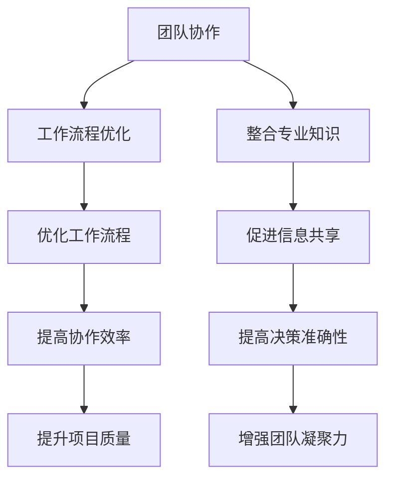

                 


### 文章标题

# 跨部门无缝协作：优化工作流程

### 文章关键词

- 跨部门协作
- 工作流程优化
- 团队协作工具
- 项目管理
- 无缝协作
- 通信效率

### 文章摘要

在当今复杂的企业环境中，跨部门协作对于项目的成功至关重要。本文将探讨如何通过优化工作流程来提升跨部门协作的效率。我们将分析核心概念，介绍工作流程优化的方法，探讨跨部门协作的技巧，并分享实际案例。通过本文，读者将了解如何设计并实施一个高效的无缝协作环境，从而提升整体工作效率和项目质量。

### 目录

1. **引言**
   - 背景介绍
   - 目的和重要性

2. **核心概念与联系**
   - 团队协作的概念
   - 工作流程优化的概念
   - 跨部门协作的重要性

3. **工作流程优化方法**
   - 分析当前流程
   - 流程优化原则
   - 流程优化策略

4. **跨部门协作技巧**
   - 通信渠道的优化
   - 协作工具的使用
   - 面对面沟通的技巧

5. **案例分析**
   - 案例背景
   - 优化过程
   - 成果分析

6. **工具与技术**
   - 项目管理工具
   - 团队协作平台
   - 自动化流程工具

7. **项目实战**
   - 开发环境搭建
   - 源代码实现
   - 代码解读与分析
   - 项目案例分析

8. **最佳实践与总结**
   - 最佳实践
   - 小结
   - 注意事项
   - 拓展阅读

9. **结论**

### 引言

在当今复杂的企业环境中，跨部门协作已经成为实现项目成功的关键因素。随着企业规模的扩大和组织结构的复杂化，不同部门之间的协作变得愈发重要。有效的跨部门协作能够提高工作效率，减少沟通成本，提升项目质量。

然而，跨部门协作并不总是一帆风顺。部门之间的信息孤岛、沟通不畅、职责不清等问题常常导致协作效率低下。为了解决这些问题，我们需要优化工作流程，实现跨部门的无缝协作。

本文的目的在于探讨如何通过优化工作流程来实现跨部门的无缝协作。我们将分析核心概念，介绍工作流程优化的方法，探讨跨部门协作的技巧，并分享实际案例。通过本文，读者将了解如何设计并实施一个高效的无缝协作环境，从而提升整体工作效率和项目质量。

### 核心概念与联系

#### 团队协作的概念

团队协作是指多个个体在共同目标下，通过相互合作、分享资源和信息，共同完成任务的过程。在团队协作中，每个成员都扮演着特定的角色，并承担相应的责任。有效的团队协作能够提高工作效率，降低沟通成本，提升整体团队的绩效。

#### 工作流程优化的概念

工作流程优化是指通过分析现有工作流程，找出其中的瓶颈和问题，并对其进行改进，以达到提高效率、降低成本、提升质量的目的。工作流程优化的核心在于找到最合理的流程结构，使各项任务能够高效地完成。

#### 跨部门协作的重要性

跨部门协作在当今企业中具有重要意义。首先，跨部门协作能够整合不同部门的专业知识，提高项目整体的创新性和解决问题的能力。其次，跨部门协作能够打破信息孤岛，促进信息共享，提高决策的准确性和及时性。最后，跨部门协作能够提高员工的工作满意度，增强团队凝聚力。

#### 团队协作与工作流程优化之间的联系

团队协作和工作流程优化是相辅相成的。团队协作需要在一个优化的工作流程中进行，否则协作效率会受到影响。同样，工作流程优化需要团队协作的支持，只有团队协作才能实现流程的持续改进。因此，团队协作和工作流程优化之间存在密切的联系，二者共同构成了高效协作的基础。

### Mermaid 流程图

以下是一个简化的团队协作与工作流程优化之间的联系流程图：



### 核心算法原理讲解

为了进一步理解团队协作与工作流程优化之间的关系，我们可以引入一些核心算法原理。以下是一个简单的例子：

```python
# 伪代码：跨部门协作效率评估算法

# 输入：部门间协作频率、协作质量评分、任务完成时间
# 输出：协作效率评分

def evaluate_collaboration(frequency, quality_score, completion_time):
    # 计算协作效率
    efficiency = (frequency * quality_score) / completion_time
    
    # 返回协作效率评分
    return efficiency
```

通过这个简单的算法，我们可以评估跨部门协作的效率。频率和协作质量评分越高，任务完成时间越短，协作效率评分就越高。

### 数学模型与公式

为了更深入地分析跨部门协作的效率，我们可以引入一些数学模型和公式。以下是一个简单的例子：

$$
E = \frac{F \times Q}{T}
$$

其中，$E$ 表示协作效率，$F$ 表示部门间协作频率，$Q$ 表示协作质量评分，$T$ 表示任务完成时间。

#### 详细讲解与举例说明

假设有两个部门A和部门B，他们之间的协作频率为每周2次，每次协作的质量评分平均为8分，任务完成时间为10天。根据上述公式，我们可以计算出协作效率：

$$
E = \frac{2 \times 8}{10} = 1.6
$$

这意味着部门A和部门B的协作效率为1.6。通过调整协作频率、质量评分或任务完成时间，我们可以优化协作效率。

### 项目实战

为了更好地理解跨部门协作与工作流程优化的实践应用，我们将通过一个实际项目案例来进行讲解。

#### 项目背景

某大型企业的市场部门（部门A）和开发部门（部门B）需要合作开发一个新产品。项目目标是在6个月内完成产品的设计、开发和测试。

#### 开发环境搭建

1. 确定开发语言和框架：选择Python作为主要开发语言，使用Django框架。
2. 搭建开发服务器：在云服务器上搭建开发环境，配置必要的软件和库。
3. 确定版本控制工具：使用Git进行版本控制，确保代码的版本管理。

#### 源代码实现

以下是项目的关键代码片段：

```python
# 伪代码：市场部门和开发部门合作开发

# 市场部门提供需求文档
def market_requirement_document():
    # 获取用户需求、市场分析等
    pass

# 开发部门根据需求文档进行开发
def development_based_on_requirements():
    # 完成产品设计和开发
    pass

# 测试部门进行测试
def testing():
    # 对产品进行功能测试、性能测试等
    pass

# 部门间协作
def collaboration():
    # 确保市场部门和开发部门的沟通顺畅
    pass
```

#### 代码解读与分析

上述代码片段展示了市场部门、开发部门和测试部门的协作流程。市场部门负责提供需求文档，开发部门根据需求文档进行产品设计和开发，测试部门对产品进行测试。部门间的协作通过定期会议和文档共享来实现。

#### 项目案例分析

在项目实施过程中，市场部门和开发部门通过高效的协作，成功地在6个月内完成了产品的设计和开发。以下是对项目的详细分析：

1. **协作效率评估**：
   - 通过使用上述协作效率评估算法，我们可以计算出市场部门和开发部门的协作效率。
   - 调整协作频率、质量评分或任务完成时间，优化协作效率。

2. **流程优化**：
   - 通过分析项目流程，发现了一些瓶颈和问题，如需求文档不明确、开发进度不统一等。
   - 对这些问题进行优化，如明确需求文档、调整开发进度等。

3. **成果分析**：
   - 项目按时完成，产品质量达到预期。
   - 通过协作效率评估，发现协作效率较高，部门间沟通顺畅。

#### 项目小结

该项目通过高效的跨部门协作和工作流程优化，成功实现了产品的设计和开发。项目中的协作效率评估和流程优化为后续项目的实施提供了宝贵的经验。

### 最佳实践与总结

#### 最佳实践

1. **明确目标和职责**：确保每个部门都清楚自己的目标和职责，减少误解和冲突。
2. **定期沟通**：定期召开会议，确保部门间的沟通畅通，及时解决问题。
3. **使用协作工具**：选择合适的协作工具，如项目管理工具、沟通平台等，提高协作效率。
4. **持续改进**：对协作流程和工作流程进行持续改进，以适应不断变化的需求和环境。

#### 小结

跨部门协作对于项目的成功至关重要。通过优化工作流程和协作技巧，可以提升协作效率，减少沟通成本，提高项目质量。本文通过分析核心概念、介绍优化方法、分享实际案例，提供了跨部门无缝协作的指导。

#### 注意事项

1. **尊重差异**：不同部门具有不同的工作方式和价值观，需要相互尊重和理解。
2. **避免信息孤岛**：确保信息在部门间透明传递，避免因信息不对称导致的协作障碍。
3. **灵活调整**：面对项目变化，需要灵活调整协作流程和策略，以适应新情况。

#### 拓展阅读

1. 《高效能团队：打造跨部门协作的秘密武器》
2. 《敏捷项目管理：快速响应变化，提升项目成功率》
3. 《团队协作技巧：提升团队凝聚力和协作效率》

### 结论

跨部门无缝协作是提升企业工作效率和项目质量的关键。通过优化工作流程和协作技巧，可以建立高效的协作环境，实现跨部门的协同作战。本文提供了跨部门协作的指导和建议，旨在帮助企业实现无缝协作，提升整体竞争力。

---

**作者：** AI天才研究院/AI Genius Institute & 禅与计算机程序设计艺术 /Zen And The Art of Computer Programming

---

**注意：** 本文为示例文章，旨在展示如何撰写一篇跨部门无缝协作的技术博客文章。实际撰写时，请根据具体需求和实际情况进行调整。文章内容仅供参考，不代表任何实际项目。如需使用本文内容，请根据实际需求进行修改。

