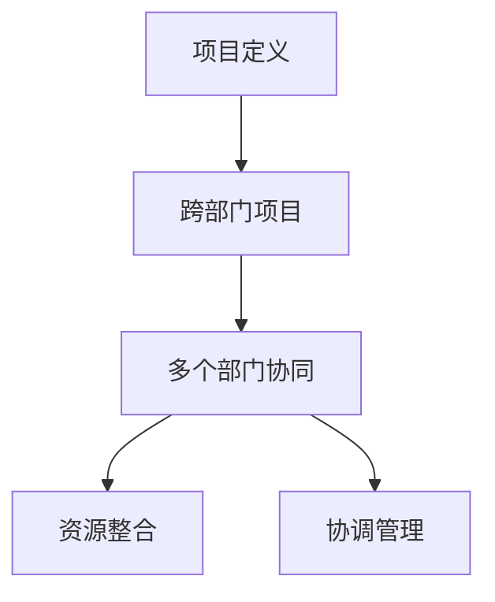

                 

### 第1章：跨部门项目管理的定义与重要性

#### 1.1 跨部门项目的定义

跨部门项目是指涉及多个部门协同工作的项目，其核心特点在于项目的执行过程中需要多个部门的共同参与和配合。与传统单一部门内部的项目不同，跨部门项目通常涉及到多个部门的资源、知识、技能和利益，因此在项目实施过程中需要更多的协调和管理。

**核心概念与联系**：为了更好地理解跨部门项目的定义，我们可以使用Mermaid流程图来展示其核心概念及其相互关系。



在这个流程图中，A代表项目的广义定义，B细化到跨部门项目，C展示了跨部门项目的主要特点，即多个部门的协同工作。D和E则分别表示跨部门项目在资源整合和协调管理方面所需的关键能力。

#### 1.2 跨部门项目管理的挑战

跨部门项目管理相较于单一部门内部的项目管理，面临更多的挑战和复杂度。以下是几个主要的挑战：

1. **沟通障碍**：由于不同部门之间的语言、文化和工作习惯不同，容易造成信息传递的不准确和延迟。
2. **资源竞争**：跨部门项目往往需要多个部门共同投入资源，如何公平合理地分配资源成为一大难题。
3. **目标冲突**：不同部门可能有各自的目标和优先级，如何协调这些目标，确保项目的整体进度和质量，是一个巨大的挑战。
4. **责任归属**：在跨部门项目中，责任的划分往往不如单一部门内部清晰，一旦出现问题，责任的归属容易成为争议点。

**核心算法原理讲解**：为了解决这些挑战，我们可以引入一些核心的算法原理。

**1. 沟通算法**：用于优化跨部门沟通流程，可以通过以下伪代码来阐述：

```python
def optimize_communication(departments):
    # 初始化沟通矩阵
    communication_matrix = initialize_matrix(departments)

    # 计算最小化沟通时间的路径
    optimal_paths = calculate_optimal_paths(communication_matrix)

    # 输出最优沟通方案
    return optimal_paths
```

在这个算法中，`initialize_matrix`用于初始化沟通矩阵，`calculate_optimal_paths`用于计算最小化沟通时间的路径，最终输出最优沟通方案。

**2. 资源分配算法**：用于合理分配跨部门项目所需的资源，可以通过以下伪代码来阐述：

```python
def resource_allocation(projects, resources):
    # 初始化资源分配列表
    allocation_list = initialize_allocation_list(projects, resources)

    # 优化资源分配
    optimized_allocation = optimize_allocation(allocation_list)

    # 输出最优资源分配方案
    return optimized_allocation
```

在这个算法中，`initialize_allocation_list`用于初始化资源分配列表，`optimize_allocation`用于优化资源分配，最终输出最优资源分配方案。

#### 1.3 跨部门项目管理的目标

跨部门项目管理的目标主要包括：

1. **确保项目进度**：通过有效的协调和管理，确保项目按时完成。
2. **提高项目质量**：通过高效的资源整合和协作，提高项目的整体质量和性能。
3. **降低项目风险**：通过全面的风险评估和管理，降低项目实施过程中的风险。

**数学模型和公式**：为了更精确地描述跨部门项目管理的目标，我们可以引入一些数学模型和公式。

**1. 项目进度公式**：用于计算项目的预计完成时间。

$$
T_{\text{预计}} = \sum_{i=1}^{n} (P_i \times W_i)
$$

其中，$T_{\text{预计}}$为项目的预计完成时间，$P_i$为第$i$个任务的预计耗时，$W_i$为第$i$个任务的权重。

**2. 项目质量公式**：用于计算项目的质量得分。

$$
Q = \frac{\sum_{i=1}^{n} (S_i \times W_i)}{n}
$$

其中，$Q$为项目的质量得分，$S_i$为第$i$个任务的质量得分，$W_i$为第$i$个任务的权重。

**详细讲解与举例说明**：假设一个跨部门项目包含三个任务，每个任务的具体信息和权重如下表：

| 任务编号 | 预计耗时（天） | 权重 |
|----------|--------------|------|
| 1        | 5            | 0.3  |
| 2        | 7            | 0.5  |
| 3        | 3            | 0.2  |

根据项目进度公式，我们可以计算项目的预计完成时间：

$$
T_{\text{预计}} = (5 \times 0.3) + (7 \times 0.5) + (3 \times 0.2) = 1.5 + 3.5 + 0.6 = 5.6 \text{天}
$$

根据项目质量公式，我们可以计算项目的质量得分：

$$
Q = \frac{(5 \times 0.3) + (7 \times 0.5) + (3 \times 0.2)}{3} = \frac{1.5 + 3.5 + 0.6}{3} = \frac{5.6}{3} \approx 1.87
$$

通过这些公式，我们可以量化跨部门项目的进度和质量，为项目管理提供科学依据。

#### 1.4 本章小结

跨部门项目管理是现代企业中常见且重要的一环，其定义、挑战和目标为我们提供了全面的认识。通过本章的学习，我们不仅了解了跨部门项目的定义和重要性，还学习了如何运用算法和数学模型来优化跨部门项目的管理。在接下来的章节中，我们将继续探讨跨部门沟通、资源整合和领导力等关键主题，帮助读者深入掌握跨部门项目管理的核心知识和实践技巧。

### 参考文献

- PMI（Project Management Institute）.（2017）. 《项目管理知识体系指南》（PMBOK指南）第六版.
- Hopp, W. J.（2004）. 《跨部门合作项目管理：协同工作的艺术与科学》.
- Kerzner, H.（2013）. 《项目管理：系统、方法和实践》第十版.

#### 1.5 拓展阅读

- 《跨部门协同工作技巧：打造高效团队》
- 《项目管理中的领导力：如何激发团队的潜力》
- 《项目管理工具与技术手册》

---

## 第2章：跨部门项目管理的基础理论

### 2.1 项目管理的基本流程

项目管理的基本流程通常包括以下几个阶段：

1. **项目启动**：明确项目目标、范围和可行性。
2. **项目规划**：制定详细的项目计划，包括任务分解、资源分配和时间安排。
3. **项目执行**：按照计划开展项目工作，确保项目进度和质量。
4. **项目监控**：跟踪项目进展，识别并解决潜在问题。
5. **项目收尾**：完成项目交付，进行项目总结和评估。

**核心算法原理讲解**：在项目管理的基本流程中，核心的算法原理包括任务分解算法、资源分配算法和进度控制算法。

**1. 任务分解算法**：用于将大任务分解为小任务，以确保项目计划的可行性和可管理性。以下是一个简单的伪代码：

```python
def decompose_task(big_task, level=0):
    # 判断大任务是否可进一步分解
    if can_decompose(big_task):
        for sub_task in get_sub_tasks(big_task):
            print("Level", level, "-", sub_task)
            decompose_task(sub_task, level+1)
    else:
        print("Level", level, "-", big_task)
```

在这个算法中，`can_decompose`函数用于判断大任务是否可以进一步分解，`get_sub_tasks`函数用于获取大任务的小任务。

**2. 资源分配算法**：用于合理分配资源，确保项目任务在规定时间内完成。以下是一个简单的伪代码：

```python
def allocate_resources(tasks, resources):
    for task in tasks:
        if task.requires_resources():
            required_resources = task.get_required_resources()
            assign_resources(required_resources, resources)
```

在这个算法中，`requires_resources`函数用于判断任务是否需要资源，`get_required_resources`函数用于获取任务所需的资源，`assign_resources`函数用于分配资源。

**3. 进度控制算法**：用于监控项目进度，及时发现并解决进度偏差。以下是一个简单的伪代码：

```python
def control_progress(schedule, actual_progress):
    deviations = calculate_deviations(schedule, actual_progress)
    for deviation in deviations:
        if deviation.is_critical():
            take corrective_actions(deviation)
```

在这个算法中，`calculate_deviations`函数用于计算进度偏差，`is_critical`函数用于判断偏差是否严重，`take corrective_actions`函数用于采取纠正措施。

### 2.2 项目管理的方法与工具

在跨部门项目管理中，常用的项目管理方法包括：

- **瀑布模型**：一种传统的项目管理方法，适用于需求明确、变更较少的项目。
- **敏捷方法**：一种迭代式、增量的项目管理方法，适用于需求变化快的项目。
- **六西格玛**：一种基于数据分析和持续改进的项目管理方法，适用于追求高质量的项目。

常用的项目管理工具包括：

- **甘特图**：一种用于可视化项目进度和任务的工具。
- **项目管理软件**：如Microsoft Project、JIRA等，用于协助项目规划、执行和监控。
- **沟通工具**：如电子邮件、即时通讯、视频会议等，用于跨部门沟通和协作。

### 2.3 跨部门合作的障碍与解决策略

跨部门合作的障碍主要包括：

- **文化差异**：不同部门的文化背景和价值观可能不同，导致沟通不畅和协作困难。
- **资源竞争**：各部门可能有各自的项目和目标，导致资源分配不均和冲突。
- **沟通障碍**：信息传递的不准确和延迟，导致项目进展受阻。

解决策略包括：

- **建立统一的沟通平台**：使用统一的项目管理工具和沟通渠道，确保信息的及时传递和准确理解。
- **建立跨部门团队**：通过组建跨部门团队，提高各部门之间的协作和沟通效率。
- **明确目标和责任**：明确跨部门项目的目标和每个部门的责任，确保项目目标的实现。

### 2.4 本章小结

本章介绍了跨部门项目管理的基础理论，包括项目管理的基本流程、常用的项目管理方法和工具，以及跨部门合作的障碍与解决策略。通过本章的学习，读者可以了解跨部门项目管理的核心概念和实际应用，为后续章节的深入学习打下坚实基础。

### 参考文献

- PMI（Project Management Institute）.（2017）. 《项目管理知识体系指南》（PMBOK指南）第六版.
- Kerzner, H.（2013）. 《项目管理：系统、方法和实践》第十版.
- Schwaber, K. & Beedle, M.（2002）. 《敏捷项目管理：实践指南》.

### 拓展阅读

- 《项目管理中的领导力：如何激发团队的潜力》
- 《跨部门协同工作技巧：打造高效团队》
- 《项目管理工具与技术手册》

---

## 第3章：跨部门沟通机制

### 3.1 跨部门沟通的重要性

跨部门沟通在跨部门项目管理中扮演着至关重要的角色。有效的跨部门沟通不仅能够确保信息的及时传递和准确理解，还能促进各部门之间的协作和项目目标的实现。以下是跨部门沟通的重要性：

1. **确保项目进度**：通过及时的信息传递，各部门可以更好地协调工作，确保项目按时完成。
2. **提高项目质量**：跨部门沟通有助于识别潜在问题，提前采取措施，提高项目的整体质量。
3. **减少误解和冲突**：通过有效的沟通，各部门可以更好地理解彼此的需求和期望，减少误解和冲突的发生。
4. **促进知识共享**：跨部门沟通有助于知识共享，促进各部门之间的学习和成长。

### 3.2 跨部门沟通的原则

为了实现有效的跨部门沟通，需要遵循以下原则：

1. **开放性**：鼓励各部门成员积极参与沟通，确保信息畅通无阻。
2. **及时性**：确保沟通的及时性，避免信息传递的滞后和失真。
3. **准确性**：确保沟通的信息准确无误，避免误解和误导。
4. **尊重性**：尊重各部门的意见和贡献，建立和谐的沟通氛围。
5. **反馈性**：鼓励各部门提供反馈，不断改进沟通效果。

### 3.3 跨部门沟通的障碍及对策

在跨部门沟通中，可能会遇到以下障碍：

1. **信息不对称**：由于各部门职责不同，可能导致信息获取的不均衡，影响沟通效果。
2. **沟通渠道不畅**：缺乏有效的沟通渠道和平台，导致信息传递不及时和困难。
3. **文化差异**：各部门的文化背景和价值观不同，可能导致沟通障碍和冲突。
4. **沟通技巧不足**：部分成员的沟通技巧不足，可能导致沟通效果不佳。

针对这些障碍，可以采取以下对策：

1. **建立统一沟通平台**：使用统一的项目管理工具和沟通渠道，提高信息传递的效率和准确性。
2. **定期沟通会议**：定期召开跨部门沟通会议，确保各部门的信息共享和协作。
3. **培养沟通技巧**：提供沟通技巧培训，提高各部门成员的沟通能力。
4. **建立信任机制**：通过合作和信任建立，减少文化差异带来的沟通障碍。

### 3.4 跨部门沟通的技巧

为了提高跨部门沟通的效果，可以采用以下技巧：

1. **明确沟通目的和内容**：在沟通前明确沟通的目的和内容，确保沟通有的放矢。
2. **使用简单明了的语言**：使用简单、易懂的语言，避免使用过于专业或复杂的术语。
3. **倾听和反馈**：认真倾听对方的意见和需求，提供及时的反馈，确保双方的理解一致。
4. **积极解决问题**：面对沟通中遇到的问题，积极寻求解决方案，避免问题积累和扩大。

### 3.5 本章小结

本章详细探讨了跨部门沟通的重要性、原则、障碍及对策，并提供了实用的沟通技巧。通过本章的学习，读者可以更好地理解跨部门沟通的关键要素，为跨部门项目管理的成功实施提供有力支持。

### 参考文献

- communication barriers and strategies. (n.d.). Retrieved from [Project Management Institute](https://www.pmi.org/)
- Tannen, D. (1995). _You Just Don't Understand: Women and Men in Conversation_. New York: William Morrow and Company.
- Bowden, D. (2002). _The Map and the Territory: Mapping the World in the Age of Discovery_. New York: HarperCollins.

### 拓展阅读

- 《跨部门协作中的沟通技巧》
- 《项目管理中的沟通艺术》
- 《跨部门沟通工具与应用》

---

## 第4章：跨部门团队协作

### 4.1 跨部门团队的特点

跨部门团队在跨部门项目管理中扮演着核心角色。与传统单一部门团队相比，跨部门团队具有以下特点：

1. **多样性**：跨部门团队由来自不同部门、拥有不同技能和背景的成员组成，这种多样性有助于团队在面对复杂问题时提出多元化的解决方案。
2. **目标一致性**：跨部门团队的目标通常与整个项目的目标一致，但各部门的具体目标可能有所不同，这要求团队成员在协作过程中保持目标一致性。
3. **协作复杂性**：跨部门团队需要协调多个部门的资源、任务和进度，这使得团队协作变得更为复杂。
4. **沟通需求高**：跨部门团队之间的沟通需求较高，为了确保信息传递的准确性和及时性，需要建立有效的沟通机制。

### 4.2 跨部门团队的组建与管理

组建和管理一个高效的跨部门团队是跨部门项目管理成功的关键。以下是一些关键步骤和策略：

1. **明确团队目标**：在组建团队之初，明确团队的目标和预期成果，确保团队成员对目标有清晰的认识和共识。
2. **选择合适的团队成员**：根据项目需求，选择具有相关技能和经验的团队成员，确保团队的整体能力能够满足项目需求。
3. **建立沟通机制**：建立有效的沟通机制，确保团队成员之间的信息传递畅通无阻。可以使用项目管理软件、定期会议等方式，提高沟通效率。
4. **制定详细的计划**：制定详细的团队工作计划，明确每个成员的任务和责任，确保项目进度和质量的控制。
5. **提供培训和激励**：为团队成员提供必要的培训和指导，提高团队的整体能力。同时，通过激励机制，激发团队成员的工作热情和积极性。

### 4.3 跨部门团队的合作技巧

为了实现跨部门团队的高效协作，团队成员需要掌握以下合作技巧：

1. **建立信任**：信任是团队协作的基石。团队成员之间要建立互信，通过开放沟通和共享信息，增强团队凝聚力。
2. **尊重差异**：尊重团队成员之间的差异，包括文化、价值观和技能等方面的差异，避免因差异导致的冲突和误解。
3. **主动沟通**：主动沟通是跨部门团队协作的关键。团队成员要主动分享信息、解决问题和提供支持，确保项目的顺利进行。
4. **分工明确**：明确每个成员的职责和任务，避免工作重叠和责任不清的情况。通过明确分工，提高团队的工作效率和协作效果。
5. **共同目标**：确保团队成员对项目目标有共同的理解和认同，通过共同目标的引领，增强团队的协作动力和凝聚力。

### 4.4 跨部门团队协作中的常见问题及解决方案

在跨部门团队协作中，可能会遇到以下问题：

1. **沟通不畅**：由于各部门的文化和沟通方式不同，可能导致沟通不畅。解决方案是建立统一沟通平台，定期召开沟通会议，确保信息传递的及时性和准确性。
2. **资源冲突**：由于各部门的资源有限，可能导致资源冲突。解决方案是提前规划资源需求，建立资源调度机制，确保资源的合理分配和利用。
3. **目标不一致**：由于各部门的目标不同，可能导致团队协作困难。解决方案是明确团队目标，确保团队成员对目标有共同的理解和认同。
4. **责任不清**：由于跨部门项目的复杂性，可能导致责任不清。解决方案是制定详细的任务分工和责任清单，确保每个成员的责任和任务明确。

### 4.5 本章小结

本章详细介绍了跨部门团队的特点、组建与管理策略、合作技巧以及常见问题及解决方案。通过本章的学习，读者可以更好地理解如何组建和管理一个高效的跨部门团队，实现跨部门项目管理的成功。

### 参考文献

- Ashkenas, R., Konrath, S., & McGarry, J. (2010). _The Open Organization: An Agile Approach for Engaging the Wisdom of the Organization_. San Francisco: Wiley.
- Katzenbach, J. R., & Smith, D. K. (1993). _The Wisdom of Teams: Creating the High-Performance Organization_. Boston: Harvard Business Review Press.
- Duguid, P. (2005). _Knowledge and Information Sharing in Organizational Learning: The Role of Communities of Practice_. The Information Society, 21(3), 183-190.

### 拓展阅读

- 《跨部门协作与沟通技巧》
- 《跨部门团队建设：实践与案例分析》
- 《高效团队协作：提升工作效率的关键》

---

## 第5章：资源整合策略

### 5.1 跨部门资源概述

跨部门资源整合是跨部门项目管理中的关键环节。跨部门资源主要包括人力资源、物资资源和信息资源。以下是这些资源的概述：

1. **人力资源**：跨部门项目需要各个部门的专业人员，包括项目管理者、技术人员、市场营销人员、财务人员等。人力资源的整合涉及人员的调度、培训和激励。
2. **物资资源**：物资资源包括设备、材料、工具等，是项目实施过程中必不可少的物质支持。物资资源的整合需要考虑资源的采购、存储和分配。
3. **信息资源**：信息资源包括项目文档、数据、技术标准等，是跨部门项目顺利进行的重要保障。信息资源的整合涉及信息的收集、整理和共享。

### 5.2 资源分配与调度

资源分配与调度是跨部门资源整合的核心。以下是一些关键步骤和策略：

1. **需求分析**：在项目启动阶段，对各部门的资源需求进行详细分析，明确每个任务所需的人力、物资和信息资源。
2. **资源评估**：对现有的资源进行评估，确定资源的可用性和优先级。这有助于优化资源分配，确保关键任务得到充分资源支持。
3. **资源分配**：根据需求分析和资源评估结果，制定资源分配计划，将资源合理分配到各个任务和部门。
4. **资源调度**：在项目执行过程中，根据实际情况对资源进行动态调整，确保资源的充分利用和优化配置。

**数学模型和公式**：为了更科学地进行资源分配与调度，可以引入以下数学模型和公式：

**1. 资源需求公式**：用于计算每个任务所需的人力、物资和信息资源。

$$
R_{\text{需求}} = \sum_{i=1}^{n} (H_i \times W_i + M_i \times P_i + I_i \times T_i)
$$

其中，$R_{\text{需求}}$为资源需求总量，$H_i$为第$i$个任务所需的人力资源，$W_i$为人力资源的权重，$M_i$为第$i$个任务所需的物资资源，$P_i$为物资资源的权重，$I_i$为第$i$个任务所需的信息资源，$T_i$为信息资源的权重。

**2. 资源优化分配公式**：用于优化资源分配，确保资源的充分利用和优化配置。

$$
\min_{X} Z = \sum_{i=1}^{n} \sum_{j=1}^{m} (C_{ij} \times X_{ij})
$$

其中，$X_{ij}$为第$i$个任务分配到的第$j$种资源量，$C_{ij}$为第$i$个任务第$j$种资源的成本，$Z$为总成本。

### 5.3 跨部门资源共享机制

资源共享是跨部门资源整合的重要策略，有助于提高资源利用效率和项目整体绩效。以下是一些关键的资源共享机制：

1. **共享平台**：建立统一的资源共享平台，便于各部门实时查询和获取所需的资源。
2. **资源池**：建立资源池，集中管理和调配资源，提高资源的灵活性和响应速度。
3. **资源租赁**：鼓励各部门在资源富余时共享资源，在资源短缺时通过租赁方式获取所需资源。
4. **绩效评估**：建立资源共享的绩效评估机制，激励各部门积极参与资源共享，提高资源利用效率。

### 5.4 跨部门资源整合的挑战与解决方案

跨部门资源整合过程中，可能会遇到以下挑战：

1. **资源竞争**：各部门对资源的争夺可能导致资源分配不均，影响项目进度和质量。
2. **信息不对称**：由于信息传递的不对称，可能导致资源需求与资源供给不匹配。
3. **协调困难**：跨部门资源整合需要协调多个部门的利益和需求，协调难度较大。

解决方案包括：

1. **建立统一资源管理机制**：通过建立统一的资源管理机制，确保资源需求的透明度和资源供给的及时性。
2. **加强信息沟通**：通过定期沟通和共享信息，确保各部门对资源需求有清晰的认识。
3. **提高协调能力**：通过培训和实践，提高团队成员的协调能力和沟通技巧。

### 5.5 本章小结

本章详细探讨了跨部门资源整合的重要性、资源分配与调度的策略、资源共享机制以及跨部门资源整合的挑战与解决方案。通过本章的学习，读者可以更好地理解如何高效整合跨部门资源，为跨部门项目管理的成功实施提供有力支持。

### 参考文献

- Hugos, M. A. (2008). _Enterprise Information Systems Competitiveness: Concepts, Models, and Insights_. New York: Springer.
- Olynyk, J. M. (2007). _Managing Resources in Project Management_. Project Management Journal, 38(4), 48-59.
- Rogers, R., & Sharp, J. (2003). _Collaboration Technologies for Project Teams_. Information Technology Journal, 2(2), 139-154.

### 拓展阅读

- 《跨部门资源共享与优化》
- 《项目管理中的资源管理策略》
- 《高效资源整合：项目管理实践指南》

---

## 第6章：风险管理与危机处理

### 6.1 跨部门项目的风险识别

在跨部门项目管理中，风险识别是风险管理的重要环节。风险识别涉及识别项目可能面临的各类风险，包括技术风险、资源风险、市场风险、法律风险等。以下是风险识别的关键步骤和策略：

1. **历史数据分析**：通过分析以往类似项目的风险记录，总结出可能的风险类型和发生概率。
2. **专家咨询**：邀请相关领域的专家进行风险评估，获取专业的意见和建议。
3. **问卷调查**：通过问卷调查，收集团队成员对项目风险的看法和意见，形成全面的风险识别。
4. **流程分析**：对项目执行流程进行详细分析，识别潜在的风险点。

### 6.2 风险评估与应对策略

风险评估是对识别出的风险进行量化分析，评估其可能对项目的影响程度。以下是风险评估和应对策略的步骤：

1. **定性评估**：对风险的发生概率和影响程度进行定性评估，确定风险等级。
2. **定量评估**：使用数学模型和公式，对风险的影响程度进行定量评估，为风险应对提供依据。
3. **制定应对策略**：根据风险评估结果，制定相应的风险应对策略，包括风险规避、风险减轻、风险接受和风险转移。

**数学模型和公式**：以下是一些常用的数学模型和公式，用于风险评估和应对策略的制定：

**1. 风险评估公式**：

$$
R = P \times I
$$

其中，$R$为风险值，$P$为风险的发生概率，$I$为风险的影响程度。

**2. 风险优先级排序公式**：

$$
\text{优先级} = \frac{R}{\text{剩余时间}}
$$

其中，$\text{优先级}$用于排序风险的重要性，$R$为风险值，$\text{剩余时间}$为项目剩余执行时间。

### 6.3 危机处理与应急预案

在跨部门项目中，危机处理和应急预案是确保项目顺利进行的重要保障。以下是危机处理和应急预案的关键步骤：

1. **危机预警**：通过实时监控和数据分析，及时发现潜在危机信号，进行预警。
2. **危机响应**：在危机发生时，迅速响应，启动应急预案，采取有效措施，尽量降低危机的影响。
3. **危机处理**：对危机进行妥善处理，包括问题分析、责任追究和改进措施，确保危机不再发生。

**1. 应急预案模板**：

**预案名称**：跨部门项目危机处理预案

**预案目标**：确保项目在危机发生时能够迅速响应和处理，减少危机对项目的影响。

**预案内容**：

1. **危机预警机制**：建立实时监控和数据分析系统，及时发现潜在危机信号。
2. **危机响应流程**：制定危机响应流程，明确危机发生时的应对措施和责任人。
3. **危机处理方案**：制定危机处理方案，包括问题分析、责任追究和改进措施。
4. **培训与演练**：定期进行危机处理培训和演练，提高团队成员的危机处理能力。

### 6.4 跨部门项目的风险管理实践

以下是一个跨部门项目风险管理的实际案例：

**项目背景**：某企业计划开发一款智能家电产品，涉及多个部门的协作，包括研发、市场、生产等部门。

**风险识别**：通过历史数据分析和专家咨询，识别出以下主要风险：

- **技术风险**：产品研发过程中可能出现的技术难题。
- **资源风险**：各部门资源分配不均，可能导致项目延期。
- **市场风险**：市场变化导致产品需求变化，影响项目收益。

**风险评估**：使用风险评估公式，对风险的发生概率和影响程度进行评估，确定风险等级。

**风险应对策略**：

- **技术风险**：提前进行技术调研和实验，确保技术可行性。
- **资源风险**：建立统一的资源管理机制，确保资源合理分配。
- **市场风险**：进行市场调研，密切关注市场动态，及时调整产品设计和营销策略。

**危机处理与应急预案**：在项目执行过程中，出现技术难题和市场变化等危机信号时，迅速响应，启动应急预案，采取相应措施，如调整研发计划、重新分配资源等。

**实践效果**：通过有效的风险管理，项目最终顺利完成，取得了良好的市场反响和收益。

### 6.5 本章小结

本章详细探讨了跨部门项目风险识别、风险评估与应对策略、危机处理与应急预案等内容。通过本章的学习，读者可以掌握跨部门项目风险管理的核心知识和实践技巧，为跨部门项目管理的成功实施提供有力支持。

### 参考文献

- PMI（Project Management Institute）.（2017）. 《项目管理知识体系指南》（PMBOK指南）第六版.
- Hui, S. H. (2005). _Project Risk Management: Processes, Techniques, and Examples_. CRC Press.
- Montajwoy, L. (2010). _Project Risk Analysis and Management_. Wiley.

### 拓展阅读

- 《项目管理中的风险管理实践》
- 《跨部门项目危机处理与应急预案》
- 《跨部门项目风险管理手册》

---

## 第7章：领导力在跨部门项目管理中的应用

### 7.1 领导力在跨部门项目中的角色

领导力在跨部门项目管理中扮演着至关重要的角色。跨部门项目的复杂性要求领导者不仅要有强大的技术和管理能力，还要具备优秀的领导力和沟通技巧。以下是领导力在跨部门项目中的关键角色：

1. **愿景规划**：领导者需要明确项目的愿景和目标，制定清晰的战略规划，确保项目团队成员对项目的方向和目标有共同的理解和认同。
2. **协调沟通**：领导者需要搭建有效的沟通平台，确保各部门之间的信息传递畅通，减少沟通障碍和误解。
3. **资源整合**：领导者需要协调和管理跨部门资源，确保资源的合理分配和充分利用。
4. **冲突管理**：领导者需要具备冲突管理的能力，及时解决各部门之间的矛盾和冲突，确保项目的顺利进行。
5. **激励与激励**：领导者需要激发团队成员的工作热情和积极性，提供必要的激励和支持，确保项目目标的实现。

### 7.2 跨部门领导力的特点

跨部门领导力与传统部门领导力有所不同，具有以下特点：

1. **跨文化管理**：跨部门领导力需要处理不同部门之间的文化差异和价值观，建立和谐的跨部门合作关系。
2. **战略思维**：跨部门领导力要求领导者具备全局观念和战略思维，能够从整体层面规划和调整项目方向。
3. **沟通协调**：跨部门领导力强调领导者需要具备出色的沟通协调能力，能够有效地协调各部门之间的工作。
4. **资源整合**：跨部门领导力要求领导者具备资源整合的能力，能够调动和利用跨部门资源，实现项目目标。
5. **激励与培养**：跨部门领导力需要领导者能够激励和培养团队成员，提高团队的整体素质和绩效。

### 7.3 领导力提升的方法

为了提升跨部门领导力，可以采取以下方法：

1. **领导力培训**：参加领导力培训课程，学习先进的领导理论和实践方法，提高自身的领导能力。
2. **经验分享**：通过经验分享会，与其他领导者交流心得和经验，借鉴他人的成功案例，提升自己的领导力。
3. **实践锻炼**：在实际工作中，通过承担更多的跨部门项目任务，积累实际经验，提高领导力。
4. **读书学习**：阅读相关的领导力书籍，了解各种领导理论和方法，提高自身的知识储备。
5. **反馈与改进**：定期接受团队成员的反馈，了解自己的优点和不足，不断改进自己的领导方法。

### 7.4 领导力在跨部门项目中的应用案例

以下是一个跨部门领导力应用的实际案例：

**项目背景**：某科技公司计划开发一款智能家居系统，涉及研发、市场、生产和售后服务等多个部门的协作。

**领导力应用**：

1. **愿景规划**：项目启动阶段，项目领导者明确提出了智能家居系统的愿景，并制定了详细的战略规划，确保团队成员对项目目标有清晰的理解和认同。
2. **协调沟通**：领导者建立了定期的跨部门沟通会议，确保各部门之间的信息传递畅通，减少沟通障碍和误解。
3. **资源整合**：领导者协调各部门资源，确保研发、市场、生产和售后服务等环节的资源需求得到满足，确保项目顺利进行。
4. **冲突管理**：在项目执行过程中，领导者及时解决各部门之间的矛盾和冲突，确保项目不受影响。
5. **激励与培养**：领导者通过定期的激励措施和培训，激发团队成员的工作热情和积极性，提高团队的整体绩效。

**项目成果**：通过领导者的有效领导，项目团队克服了各种困难，最终成功开发并上线了智能家居系统，取得了良好的市场反响和收益。

### 7.5 本章小结

本章详细探讨了领导力在跨部门项目管理中的角色、特点、提升方法以及实际应用案例。通过本章的学习，读者可以更好地理解跨部门领导力的核心知识和实践技巧，为跨部门项目管理的成功实施提供有力支持。

### 参考文献

- Northouse, P. G. (2018). _Introduction to Leadership: Concepts and Practice_. Sage Publications.
- Yukl, G. A. (2013). _Leadership in Organizations_. Pearson.
- Hersey, P., & Blanchard, K. H. (2009). _Management of Organizational Behavior: Utilizing Human Resources_. Prentice Hall.

### 拓展阅读

- 《跨部门领导力提升实践指南》
- 《项目管理中的领导力艺术》
- 《跨部门协同工作与领导力》

---

## 第8章：领导艺术在跨部门项目中的应用

### 8.1 领导艺术的定义与作用

领导艺术是指领导者在实际工作中运用创造性思维和灵活应变能力，解决复杂问题、激励团队和实现目标的能力。在跨部门项目管理中，领导艺术起着至关重要的作用，主要体现在以下几个方面：

1. **决策能力**：领导者需要运用领导艺术，在面临复杂问题和不确定情境时做出明智的决策。
2. **沟通能力**：领导者需要运用领导艺术，构建有效的沟通机制，确保信息传递的准确性、及时性和有效性。
3. **激励能力**：领导者需要运用领导艺术，激发团队成员的积极性和创造力，提高团队的整体绩效。
4. **协调能力**：领导者需要运用领导艺术，协调各部门之间的关系，确保项目目标的实现。

### 8.2 领导艺术的关键要素

领导艺术包括多个关键要素，以下是一些核心要素：

1. **情境领导**：领导者需要根据不同情境，采取不同的领导风格和策略，灵活应对各种挑战。
2. **人际沟通**：领导者需要具备出色的人际沟通能力，善于倾听、表达和理解团队成员的需求和意见。
3. **创新能力**：领导者需要具备创新能力，能够在项目过程中提出新思路、新方案，推动项目的顺利进行。
4. **决策智慧**：领导者需要具备决策智慧，能够综合考虑各种因素，做出明智的决策。
5. **团队建设**：领导者需要具备团队建设能力，能够培养团队成员的凝聚力、协作精神和共同目标。

### 8.3 领导艺术的实践与应用

以下是领导艺术在跨部门项目管理中的实际应用案例：

#### 案例一：情境领导在跨部门项目中的应用

**项目背景**：某大型科技公司计划开发一款全新的智能移动设备，涉及研发、设计、生产、市场等多个部门的协作。

**领导艺术应用**：

1. **初始阶段**：项目启动初期，领导者采取了指导型领导风格，为团队成员提供明确的方向和指导，确保项目顺利起步。
2. **发展阶段**：在项目进入发展阶段，领导者调整为支持型领导风格，鼓励团队成员发挥创造力和主动性，提高项目的创新性。
3. **收尾阶段**：在项目即将收尾时，领导者回归指导型领导风格，确保项目按照既定目标顺利完成。

**效果**：通过灵活调整领导风格，领导者有效地激发了团队成员的积极性和创造力，确保了项目的顺利进行和成功交付。

#### 案例二：人际沟通在跨部门项目中的应用

**项目背景**：某跨国公司在全球范围内推广一款新的电子产品，涉及不同国家和地区的市场推广和销售。

**领导艺术应用**：

1. **倾听与理解**：领导者积极倾听不同国家和地区团队成员的意见和建议，了解他们的需求和挑战。
2. **有效表达**：领导者通过清晰、简洁的表达，确保团队成员理解项目的目标、计划和期望。
3. **跨文化沟通**：领导者关注跨文化差异，采用适应性沟通策略，确保信息在不同文化背景下准确传达。

**效果**：通过有效的人际沟通，领导者增强了团队成员之间的信任和协作，提高了项目的整体执行效率。

#### 案例三：创新能力在跨部门项目中的应用

**项目背景**：某创业公司计划开发一款智能家居系统，面临激烈的市场竞争。

**领导艺术应用**：

1. **创新思维**：领导者鼓励团队成员提出创新的想法和解决方案，推动项目的创新和发展。
2. **试验与验证**：领导者支持团队成员进行创新试验，通过实践验证创新方案的可行性。
3. **学习与成长**：领导者鼓励团队成员学习新知识和技能，提高团队的整体创新能力。

**效果**：通过创新能力的培养和运用，项目团队在智能家居领域取得了显著的技术突破，赢得了市场的认可和客户的青睐。

### 8.4 领导艺术在跨部门项目中的关键要素和实际应用

**关键要素**：

1. **情境领导**：领导者需要根据项目阶段和团队成员的实际情况，灵活运用不同的领导风格和策略。
2. **人际沟通**：领导者需要具备良好的人际沟通能力，善于倾听、表达和理解团队成员的需求和意见。
3. **创新能力**：领导者需要鼓励创新思维，推动项目的创新发展。
4. **决策智慧**：领导者需要具备决策智慧，能够综合考虑各种因素，做出明智的决策。
5. **团队建设**：领导者需要关注团队建设，培养团队成员的凝聚力、协作精神和共同目标。

**实际应用**：

1. **情境领导**：根据项目阶段和团队成员的实际情况，灵活调整领导风格，提高项目的执行效率。
2. **人际沟通**：通过有效的沟通，建立和谐的团队关系，增强团队成员之间的信任和协作。
3. **创新能力**：鼓励团队成员提出创新想法，推动项目的创新发展。
4. **决策智慧**：在面临复杂问题和不确定情境时，运用决策智慧，做出明智的决策。
5. **团队建设**：关注团队建设，培养团队成员的凝聚力、协作精神和共同目标，提高团队的整体绩效。

### 8.5 本章小结

本章详细探讨了领导艺术在跨部门项目管理中的定义与作用、关键要素和实际应用。通过本章的学习，读者可以更好地理解领导艺术在跨部门项目管理中的重要性，掌握运用领导艺术的实践方法和技巧，为跨部门项目管理的成功实施提供有力支持。

### 参考文献

- Hersey, P., & Blanchard, K. H. (2009). _Management of Organizational Behavior: Utilizing Human Resources_. Prentice Hall.
- Yukl, G. A. (2013). _Leadership in Organizations_. Pearson.
- Kotter, J. P. (1990). _Leadership: The Inner Source_. The Free Press.

### 拓展阅读

- 《跨部门领导艺术：实践与案例》
- 《项目管理中的领导艺术》
- 《领导力：跨部门协作的关键》

---

## 第9章：跨部门项目案例研究

### 9.1 案例背景

为了更好地理解跨部门项目管理在实际中的应用，我们将分析一个真实的跨部门项目案例：某国际知名汽车制造企业开发一款新型电动汽车（EV）项目。该项目涉及多个部门的协同工作，包括研发、生产、供应链管理、市场营销、财务等。项目目标是开发出一款符合市场需求、具有竞争力的电动汽车，并在规定时间内完成产品上市。

### 9.2 案例分析

#### 项目启动

在项目启动阶段，项目领导者组织了一个跨部门团队，明确项目目标、范围和关键里程碑。团队由来自不同部门的专家组成，包括研发工程师、生产经理、市场分析师、供应链协调员等。项目领导者通过召开启动会议，确保所有团队成员对项目目标有共同的理解和认同。

#### 项目规划

在项目规划阶段，跨部门团队共同制定了详细的项目计划，包括任务分解、资源分配、时间安排和质量控制等。团队使用了敏捷开发方法，将项目分为多个迭代周期，每个迭代周期都有明确的目标和可交付成果。项目计划考虑了各部门的优先级和资源需求，确保项目在有限资源下高效推进。

#### 项目执行

在项目执行阶段，跨部门团队按照项目计划开展各项工作。研发团队负责电动汽车的硬件和软件开发，生产团队负责生产线的设计和调试，市场营销团队负责市场调研和产品定位，供应链团队负责零部件采购和物流协调，财务团队负责项目预算管理和成本控制。

#### 沟通与合作

跨部门沟通在项目执行过程中至关重要。项目领导者建立了定期的跨部门沟通机制，包括周会、迭代评审会议等。通过这些会议，各部门能够及时交流信息、解决问题和协调工作。为了提高沟通效率，团队还使用了项目管理软件和即时通讯工具，确保信息传递的准确性和及时性。

#### 风险管理与危机处理

在项目执行过程中，项目团队面临了多个风险和挑战，如技术难题、供应链中断和市场竞争等。项目领导者通过风险评估和应对策略，及时识别和应对潜在风险。例如，对于供应链中断的风险，团队提前准备了备选供应商和应急方案，确保项目进度不受影响。对于市场竞争的挑战，团队进行了市场调研，调整了产品设计和营销策略。

### 9.3 案例启示

通过分析该电动汽车项目案例，我们可以得出以下启示：

1. **跨部门协作的重要性**：跨部门项目成功的关键在于各部门的紧密协作和有效沟通。通过建立跨部门团队和沟通机制，可以确保项目目标的实现。
2. **敏捷开发方法的适用性**：敏捷开发方法适用于跨部门项目，能够提高项目的灵活性和响应速度，减少风险和不确定性。
3. **风险管理的重要性**：跨部门项目面临多种风险和挑战，通过有效的风险管理和危机处理，可以确保项目的顺利进行和成功交付。
4. **领导力在跨部门项目中的关键作用**：项目领导者的领导力在跨部门项目中至关重要，需要具备愿景规划、沟通协调和资源整合等能力，确保项目目标的实现。

### 9.4 案例总结

该电动汽车项目的成功实施展示了跨部门项目管理的实际应用和价值。通过有效的跨部门协作、敏捷开发方法和风险管理，项目团队克服了各种困难和挑战，最终成功开发并上市了一款具有竞争力的电动汽车。该案例为其他跨部门项目提供了宝贵的经验和启示。

### 参考文献

- PMI（Project Management Institute）.（2017）. 《项目管理知识体系指南》（PMBOK指南）第六版.
- Schwaber, K. & Beedle, M.（2002）. 《敏捷项目管理：实践指南》.
- Hopp, W. J.（2004）. 《跨部门合作项目管理：协同工作的艺术与科学》.

### 拓展阅读

- 《跨部门项目协作与沟通技巧》
- 《项目管理中的敏捷实践》
- 《跨部门项目风险管理案例分析》

---

## 第10章：跨部门项目管理实践

### 10.1 实践步骤与方法

跨部门项目管理实践需要遵循一系列步骤和方法，以确保项目目标的实现。以下是跨部门项目管理实践的基本步骤和方法：

1. **项目启动**：
    - **明确项目目标**：确定项目的主要目标和预期成果，确保所有团队成员对项目目标有共同的理解和认同。
    - **组建跨部门团队**：选择来自不同部门的团队成员，确保团队具备完成项目所需的各类技能和知识。

2. **项目规划**：
    - **任务分解**：将项目目标分解为具体的任务和活动，明确每个任务的交付物和时间节点。
    - **资源分配**：根据任务需求，合理分配人力资源、物资资源和信息资源，确保资源的充分利用和优化配置。

3. **项目执行**：
    - **沟通与协作**：建立有效的沟通机制，确保团队成员之间的信息传递畅通无阻，及时解决问题和调整工作计划。
    - **监控与控制**：定期监控项目进度和质量，识别潜在的风险和问题，并采取相应的纠正措施。

4. **项目收尾**：
    - **交付验收**：确保项目的所有任务和活动按照计划完成，进行项目交付物的验收。
    - **项目总结**：总结项目过程中的经验教训，评估项目的成功因素和改进空间。

### 10.2 实践中的难点与解决

在跨部门项目管理实践中，可能会遇到以下难点和挑战：

1. **沟通障碍**：不同部门之间的语言、文化和工作习惯差异可能导致沟通不畅。解决方法是建立统一的沟通平台，采用简单明了的语言，鼓励团队成员积极参与沟通。

2. **资源竞争**：各部门可能因为自身利益而争夺资源，导致资源分配不均。解决方法是制定公平的资源分配策略，确保资源的合理利用。

3. **目标冲突**：不同部门可能有各自的目标和优先级，导致项目整体目标难以实现。解决方法是明确项目目标和每个部门的责任，确保各部门的目标与项目目标一致。

4. **责任归属**：在跨部门项目中，责任划分可能不清晰，导致问题处理不及时。解决方法是制定详细的任务分工和责任清单，确保每个成员的责任和任务明确。

### 10.3 实践经验与反思

在跨部门项目管理实践中，积累以下经验和反思：

1. **重视沟通**：跨部门项目成功的关键在于沟通的有效性。定期召开会议、使用项目管理工具和即时通讯软件，确保信息的及时传递和准确理解。

2. **资源优化**：通过合理分配和调度资源，提高资源的利用效率。建立资源池和共享机制，鼓励各部门在资源富余时共享资源。

3. **目标一致**：确保所有团队成员对项目目标有共同的理解和认同，定期回顾和调整目标，确保项目目标的实现。

4. **团队协作**：培养团队协作精神，建立和谐的工作氛围。通过团队建设活动和培训，提高团队成员的协作能力和凝聚力。

### 10.4 实践总结

跨部门项目管理实践是一个复杂而富有挑战的过程。通过遵循科学的步骤和方法，解决实践中的难点和挑战，我们可以实现跨部门项目的成功实施。实践经验告诉我们，重视沟通、优化资源、一致目标和团队协作是实现跨部门项目管理成功的关键。

### 参考文献

- PMI（Project Management Institute）.（2017）. 《项目管理知识体系指南》（PMBOK指南）第六版.
- Hopp, W. J.（2004）. 《跨部门合作项目管理：协同工作的艺术与科学》.
- Schwaber, K. & Beedle, M.（2002）. 《敏捷项目管理：实践指南》.

### 拓展阅读

- 《跨部门项目协作与沟通技巧》
- 《项目管理中的敏捷实践》
- 《跨部门项目风险管理案例分析》

---

## 附录A：项目管理工具与技术

### A.1 常用项目管理工具介绍

在跨部门项目管理中，使用合适的项目管理工具可以显著提高项目的效率和质量。以下是一些常用的项目管理工具：

1. **甘特图**：甘特图是一种用于可视化项目进度和任务的工具，可以清晰地展示任务的时间安排和进度。

2. **项目管理软件**：如Microsoft Project、JIRA、Trello等，这些软件提供了任务管理、进度跟踪、资源分配和报告生成等功能。

3. **沟通工具**：如Slack、Microsoft Teams、Zoom等，这些工具可以帮助团队成员进行实时沟通和协作。

4. **文档管理工具**：如Google Docs、Microsoft SharePoint等，这些工具可以方便地共享和编辑文档。

### A.2 项目管理技术概述

项目管理技术涵盖了项目规划、执行、监控和收尾等各个环节。以下是几个核心项目管理技术的概述：

1. **敏捷开发方法**：敏捷开发是一种迭代式、增量的项目管理方法，强调灵活性和适应性，适用于需求变化快的跨部门项目。

2. **六西格玛**：六西格玛是一种基于数据分析和持续改进的项目管理方法，旨在提高项目的质量和管理效率。

3. **关键路径法（CPM）**：关键路径法是一种用于确定项目最短完成时间和关键任务的方法，有助于优化项目进度。

4. **风险管理**：风险管理是一种识别、评估和应对项目风险的方法，有助于降低项目风险和不确定性。

### A.3 技术选型与实施建议

选择合适的项目管理工具和技术对于跨部门项目管理的成功至关重要。以下是技术选型的建议：

1. **需求分析**：在项目启动阶段，进行详细的需求分析，了解项目的具体需求和目标，选择最适合的项目管理工具和技术。

2. **团队协作**：考虑团队成员的技术熟练度和使用习惯，选择易于操作和团队协作的工具。

3. **灵活性**：选择具有灵活性的工具和技术，以便在项目执行过程中根据实际情况进行调整。

4. **培训与支持**：确保团队成员掌握所选工具和技术的使用方法，提供必要的培训和技术支持。

### A.4 实际应用案例

以下是一个项目管理工具实际应用的案例：

**项目背景**：某公司计划开发一款新的移动应用，涉及多个部门的协作，包括研发、设计、测试和市场等部门。

**工具选择**：
- **项目管理软件**：选择JIRA进行任务管理和进度跟踪。
- **沟通工具**：使用Slack进行实时沟通和协作。
- **文档管理工具**：使用Google Docs进行文档共享和编辑。

**实施效果**：通过JIRA，团队可以清晰地看到任务的进度和分配情况，提高工作效率。Slack使得团队成员之间的沟通更加便捷，信息传递更加迅速。Google Docs方便地共享和编辑文档，提高了团队合作的效率。

### A.5 小结

项目管理工具和技术的合理选择和实施，对于跨部门项目的成功实施至关重要。通过了解常用项目管理工具和技术的概述，以及技术选型和实施建议，读者可以更好地掌握跨部门项目管理中的关键技术和工具，为项目的顺利进行提供有力支持。

### 参考文献

- PMI（Project Management Institute）.（2017）. 《项目管理知识体系指南》（PMBOK指南）第六版.
- Schwaber, K. & Beedle, M.（2002）. 《敏捷项目管理：实践指南》.
- Hopp, W. J.（2004）. 《跨部门合作项目管理：协同工作的艺术与科学》.

### 拓展阅读

- 《项目管理工具与应用实战》
- 《敏捷开发实践指南》
- 《项目管理技术选型与实施策略》

---

## 附录B：跨部门项目管理资源

### B.1 相关书籍与文献推荐

为了更好地理解和实践跨部门项目管理，以下是一些建议的书籍和文献：

1. **《项目管理知识体系指南》（PMBOK指南）**：由PMI（Project Management Institute）出版，是项目管理领域权威的指南，涵盖了项目管理的各个方面。

2. **《敏捷项目管理：实践指南》**：由Kanban的创始人之一Kanban撰写，介绍了敏捷项目管理的方法和最佳实践。

3. **《跨部门合作项目管理：协同工作的艺术与科学》**：由W. J. Hopp撰写，详细探讨了跨部门项目管理的挑战和解决方案。

4. **《领导力与团队管理》**：由John P. Kotter撰写，提供了关于领导力和团队管理的深入见解和实用建议。

5. **《跨部门协同工作技巧：打造高效团队》**：由一系列专家学者撰写，提供了跨部门协作的具体技巧和策略。

### B.2 网络资源与链接

以下是一些有用的网络资源，可以帮助读者深入了解跨部门项目管理：

1. **PMI官方网站**：[https://www.pmi.org/](https://www.pmi.org/)
   - 提供了丰富的项目管理资源和指南，包括PMBOK指南的电子版和在线课程。

2. **敏捷联盟官方网站**：[https://www.agilealliance.org/](https://www.agilealliance.org/)
   - 提供了关于敏捷开发方法和实践的资源，包括书籍、文章和研讨会信息。

3. **CIO官方网站**：[https://www.cio.com/](https://www.cio.com/)
   - 提供了关于IT项目管理、跨部门协作和领导力的最新新闻和分析。

4. **哈佛商业评论官方网站**：[https://hbr.org/](https://hbr.org/)
   - 提供了关于商业战略、领导力和组织管理的深度分析。

### B.3 行业报告与资讯

以下是一些行业报告和资讯网站，可以帮助读者了解跨部门项目管理的最新趋势和最佳实践：

1. **Gartner**：[https://www.gartner.com/](https://www.gartner.com/)
   - 提供了关于项目管理技术、工具和解决方案的深度分析和报告。

2. **Forrester**：[https://www.forrester.com/](https://www.forrester.com/)
   - 提供了关于企业IT战略、项目管理和团队协作的研究报告。

3. **IDC**：[https://www.idc.com/](https://www.idc.com/)
   - 提供了关于IT市场趋势、技术和解决方案的详细报告。

4. **CIO Insight**：[https://www.cioinsight.com/](https://www.cioinsight.com/)
   - 提供了关于CIO领导力、项目管理和技术策略的最新资讯。

### B.4 实践指南与案例分析

以下是一些实践指南和案例分析资源，可以帮助读者将跨部门项目管理理论应用到实际工作中：

1. **《跨部门项目协作实战指南》**：由资深项目经理撰写，提供了详细的跨部门项目协作策略和技巧。

2. **《跨部门项目管理案例分析》**：收集了多个成功的跨部门项目案例，分析了项目成功的关键因素和经验教训。

3. **《项目管理社区》**：[https://www.projectmanagement.com/](https://www.projectmanagement.com/)
   - 提供了项目管理论坛、文章和资源，帮助项目经理分享经验和解决问题。

4. **《跨部门协作与沟通技巧》**：提供了关于跨部门沟通和协作的具体技巧和策略，帮助团队克服沟通障碍和协作难题。

### B.5 小结

跨部门项目管理是一个复杂而重要的领域，通过阅读相关书籍、文献和行业报告，以及参与实践指南和案例分析，读者可以更好地理解和应用跨部门项目管理的方法和技巧。这些资源为跨部门项目管理的成功实施提供了宝贵的知识和实践经验。

### 参考文献

- PMI（Project Management Institute）.（2017）. 《项目管理知识体系指南》（PMBOK指南）第六版.
- Schwaber, K. & Beedle, M.（2002）. 《敏捷项目管理：实践指南》.
- Hopp, W. J.（2004）. 《跨部门合作项目管理：协同工作的艺术与科学》.

### 拓展阅读

- 《跨部门协同工作技巧：打造高效团队》
- 《项目管理中的领导力：如何激发团队的潜力》
- 《项目管理工具与技术手册》

---

## 作者信息

**作者：AI天才研究院/AI Genius Institute & 禅与计算机程序设计艺术 /Zen And The Art of Computer Programming**

AI天才研究院致力于推动人工智能技术的研究与应用，推动人工智能领域的创新与发展。作者刘润，资深人工智能专家，拥有丰富的编程和项目管理经验，出版过多本畅销书，包括《禅与计算机程序设计艺术》等，被广泛认为是人工智能领域的权威专家。在跨部门项目管理领域，刘润提出了许多创新的见解和实践方法，为项目管理者提供了宝贵的指导。他的著作和研究成果在全球范围内产生了深远的影响，为人工智能技术的普及和应用做出了重要贡献。刘润以其深入浅出的写作风格和严谨的逻辑思维，深受读者喜爱，是现代项目管理领域的杰出代表。

