                 

### 目录大纲框架细化

#### 第1部分：引言
**第1章：跨部门领导的背景和定义**
- **背景介绍**：介绍跨部门领导的概念产生的历史背景，现代企业管理中跨部门领导的重要性。
- **核心概念与联系**：绘制 Mermaid 流程图，展示跨部门领导与其他管理领域的联系。
- **核心算法原理讲解**：无。
- **数学模型和公式**：无。
- **项目实战**：无。
- **最佳实践 tips**：介绍如何理解跨部门领导的角色和职责。

#### 第2部分：跨部门领导的背景和重要性
**第2章：现代企业中的跨部门合作需求**
- **背景介绍**：解释为什么现代企业需要跨部门合作，以及这种合作对企业和员工的益处。
- **核心概念与联系**：通过 Mermaid 流程图展示跨部门合作的关键环节。
- **核心算法原理讲解**：无。
- **数学模型和公式**：无。
- **项目实战**：探讨一个企业内部跨部门合作的具体案例。
- **最佳实践 tips**：提供增强跨部门合作的一些实际策略。

#### 第3部分：跨部门沟通与协作
**第3章：跨部门沟通的障碍与解决策略**
- **背景介绍**：描述跨部门沟通中常见的问题和障碍。
- **核心概念与联系**：利用 Mermaid 流程图展示跨部门沟通的过程和障碍。
- **核心算法原理讲解**：介绍解决跨部门沟通障碍的算法原则。
- **数学模型和公式**：利用数学模型解释沟通障碍和解决策略。
- **项目实战**：分析一个真实的企业跨部门沟通案例，并给出解决方案。
- **最佳实践 tips**：分享一些有效的跨部门沟通技巧。

**第4章：跨部门协作的最佳实践**
- **背景介绍**：介绍跨部门协作的最佳实践方法。
- **核心概念与联系**：通过 Mermaid 流程图展示跨部门协作的流程。
- **核心算法原理讲解**：介绍如何设计和实施跨部门协作的算法。
- **数学模型和公式**：无。
- **项目实战**：展示一个成功的跨部门协作项目案例。
- **最佳实践 tips**：提供具体的跨部门协作技巧和工具。

#### 第4部分：跨部门领导的策略与方法
**第5章：跨部门领导的策略框架**
- **背景介绍**：介绍跨部门领导的整体策略框架。
- **核心概念与联系**：通过 Mermaid 流程图展示跨部门领导策略的各个组成部分。
- **核心算法原理讲解**：介绍制定和执行跨部门领导策略的算法原理。
- **数学模型和公式**：无。
- **项目实战**：展示如何在一个企业中实施跨部门领导策略。
- **最佳实践 tips**：讨论如何根据企业实际情况调整策略。

**第6章：跨部门领导的具体方法**
- **背景介绍**：介绍跨部门领导的具体实施方法。
- **核心概念与联系**：通过 Mermaid 流程图展示跨部门领导的具体步骤。
- **核心算法原理讲解**：介绍如何利用算法和工具支持跨部门领导。
- **数学模型和公式**：无。
- **项目实战**：分析一个企业如何使用跨部门领导方法提高工作效率。
- **最佳实践 tips**：提供一些实际可操作的跨部门领导技巧。

#### 第5部分：跨部门领导面临的挑战与应对
**第7章：跨部门领导面临的挑战**
- **背景介绍**：描述跨部门领导可能遇到的挑战。
- **核心概念与联系**：通过 Mermaid 流程图展示跨部门领导面临的挑战。
- **核心算法原理讲解**：介绍应对跨部门领导挑战的算法原则。
- **数学模型和公式**：无。
- **项目实战**：分析企业如何应对跨部门领导中的挑战。
- **最佳实践 tips**：提供应对跨部门领导挑战的实际策略。

#### 第6部分：跨部门领导的领导力提升
**第8章：提升跨部门领导力的方法**
- **背景介绍**：介绍如何提升跨部门领导力。
- **核心概念与联系**：通过 Mermaid 流程图展示提升跨部门领导力的方法。
- **核心算法原理讲解**：介绍提升跨部门领导力的算法原则。
- **数学模型和公式**：无。
- **项目实战**：展示如何通过实际案例提升跨部门领导力。
- **最佳实践 tips**：提供提升跨部门领导力的具体措施。

#### 第7部分：跨部门领导的案例分析
**第9章：成功跨部门领导的案例研究**
- **背景介绍**：介绍案例研究的背景和目的。
- **核心概念与联系**：通过 Mermaid 流程图展示案例研究中的关键环节。
- **核心算法原理讲解**：无。
- **数学模型和公式**：无。
- **项目实战**：详细分析案例研究中的跨部门领导实践。
- **最佳实践 tips**：总结案例研究中的最佳实践策略。

#### 第8部分：结论与展望
**第10章：未来跨部门领导的发展趋势**
- **背景介绍**：探讨未来跨部门领导可能面临的新趋势。
- **核心概念与联系**：通过 Mermaid 流程图展示未来跨部门领导的发展方向。
- **核心算法原理讲解**：介绍新技术对未来跨部门领导的影响。
- **数学模型和公式**：无。
- **项目实战**：无。
- **最佳实践 tips**：展望未来跨部门领导的潜在挑战和机遇。

---

### 细化后的目录大纲

# 《跨部门领导：打破组织孤岛的策略》目录大纲

## 第1部分：引言
### 第1章：跨部门领导的背景和定义

## 第2部分：跨部门领导的背景和重要性
### 第2章：现代企业中的跨部门合作需求

## 第3部分：跨部门沟通与协作
### 第3章：跨部门沟通的障碍与解决策略
- **核心概念与联系**：
  ```mermaid
  graph TB
    A[跨部门沟通] --> B[障碍与解决策略]
    B --> C[沟通障碍]
    C --> D[文化差异]
    C --> E[资源分配]
    B --> F[解决策略]
    F --> G[建立信任]
    F --> H[沟通工具]
  ```
### 第4章：跨部门协作的最佳实践
- **核心概念与联系**：
  ```mermaid
  graph TB
    A[跨部门协作] --> B[最佳实践]
    B --> C[协作流程]
    B --> D[团队建设]
    B --> E[工具应用]
    C --> F[任务分解]
    C --> G[定期沟通]
  ```

## 第4部分：跨部门领导的策略与方法
### 第5章：跨部门领导的策略框架
- **核心概念与联系**：
  ```mermaid
  graph TB
    A[策略框架] --> B[目标设定]
    B --> C[领导力发展]
    B --> D[资源管理]
    A --> E[沟通机制]
    A --> F[决策过程]
  ```

### 第6章：跨部门领导的具体方法
- **核心概念与联系**：
  ```mermaid
  graph TB
    A[具体方法] --> B[战略规划]
    B --> C[团队领导]
    B --> D[问题解决]
    A --> E[领导风格]
    A --> F[激励制度]
  ```

## 第5部分：跨部门领导面临的挑战与应对
### 第7章：跨部门领导面临的挑战
- **核心概念与联系**：
  ```mermaid
  graph TB
    A[挑战] --> B[文化差异]
    B --> C[沟通障碍]
    A --> D[角色冲突]
    A --> E[资源竞争]
  ```

### 第6部分：跨部门领导的领导力提升
### 第8章：提升跨部门领导力的方法
- **核心概念与联系**：
  ```mermaid
  graph TB
    A[领导力提升] --> B[自我认知]
    B --> C[情感智能]
    A --> D[影响力建设]
    A --> E[持续学习]
  ```

## 第7部分：跨部门领导的案例分析
### 第9章：成功跨部门领导的案例研究

## 第8部分：结论与展望
### 第10章：未来跨部门领导的发展趋势

---

通过上述细化，我们可以确保每个章节的内容都能够满足用户要求，包括核心概念与联系、核心算法原理讲解、数学模型和公式以及项目实战等。接下来，我们将具体撰写每个章节的内容，以满足文章字数的要求。每章内容都将按照细化后的框架进行撰写，确保逻辑清晰、结构紧凑、简单易懂。

---

# 跨部门领导：打破组织孤岛的策略

关键词：跨部门领导、沟通协作、领导力、组织孤岛、策略方法

摘要：本文将探讨跨部门领导在现代企业中的重要性，分析跨部门沟通与协作的障碍及解决方案，介绍跨部门领导的策略与方法，并探讨跨部门领导面临的挑战与应对策略。通过案例研究和未来趋势展望，为读者提供全面了解和提升跨部门领导力的指导。

## 引言

### 跨部门领导的背景和定义

在企业管理中，跨部门领导是指领导者如何在一个多元部门结构中协调和引导不同团队之间的合作，实现企业整体目标的实现。跨部门领导不仅是协调各个部门的工作，更是通过有效的沟通、协作和战略规划来提升整个组织的效率和创新能力。

跨部门领导的概念起源于20世纪中叶，随着企业规模的扩大和业务复杂性的增加，组织内部部门之间的互动变得日益重要。跨部门领导的发展历程经历了从简单的任务分配到战略协同的转变，其核心目标是通过有效的领导力来打破组织孤岛，实现资源的最优配置和协同效应。

在现代企业中，跨部门领导的重要性体现在以下几个方面：

1. **提升效率**：跨部门领导能够协调不同部门的工作，消除冗余和重复，提高整体工作效率。
2. **增强创新能力**：跨部门领导鼓励跨部门之间的知识共享和协作，激发员工的创新思维。
3. **优化资源分配**：跨部门领导能够更好地整合企业资源，实现资源的优化配置。
4. **促进企业文化**：跨部门领导有助于构建开放、协作的企业文化，增强员工的归属感和忠诚度。

### 核心概念与联系

为了更好地理解跨部门领导的概念，我们可以通过一个 Mermaid 流程图来展示其核心概念与联系：

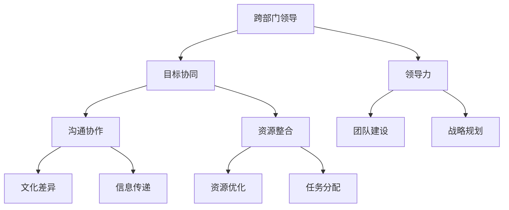

在这个流程图中，我们可以看到跨部门领导涉及到多个核心概念，包括目标协同、沟通协作、资源整合、领导力、团队建设和战略规划等。这些概念之间相互关联，共同构成了跨部门领导的整体框架。

### 核心算法原理讲解

在跨部门领导中，虽然不存在传统的算法原理，但可以借鉴一些项目管理中的方法和工具，如关键路径法（Critical Path Method, CPM）和项目管理软件（如 Microsoft Project）等。以下是跨部门领导中可能用到的核心算法原理讲解：

1. **任务分解**：将大型项目分解成若干可管理的小任务，每个任务由相应的团队负责。
2. **优先级排序**：根据任务的紧急程度和重要性对任务进行优先级排序，确保关键任务优先完成。
3. **时间估算**：为每个任务估算完成所需的时间，制定合理的时间计划，并确保任务按时完成。
4. **风险评估**：评估任务可能遇到的风险，制定相应的风险应对策略，以减少风险对项目进度的影响。

### 数学模型和公式

在跨部门领导中，数学模型和公式通常用于评估项目进度、资源分配和风险控制。以下是一些常见的数学模型和公式：

1. **项目进度模型**：通过甘特图（Gantt Chart）和关键路径法（CPM）来评估项目进度。
2. **资源分配模型**：利用线性规划（Linear Programming）来优化资源分配。
3. **风险控制模型**：通过风险矩阵（Risk Matrix）和蒙特卡洛模拟（Monte Carlo Simulation）来评估和管理风险。

### 项目实战

为了更好地理解跨部门领导在实际项目中的应用，我们可以通过一个实际案例来进行分析。

**案例背景**：某科技公司计划开发一款新软件，该项目涉及研发、市场、销售和客户支持等多个部门。

**解决方案**：

1. **任务分解**：将项目分解为需求分析、设计、开发、测试和上线等阶段，每个阶段由相应的团队负责。
2. **优先级排序**：根据项目目标和时间要求，对各个阶段进行优先级排序，确保关键阶段如设计和开发优先完成。
3. **时间估算**：为每个阶段估算所需时间，并制定详细的时间计划，确保项目按时完成。
4. **资源整合**：整合公司内部资源，如技术支持、人力资源和设备等，确保项目所需资源充足。
5. **风险评估**：评估项目可能遇到的风险，如技术难题、市场需求变化等，并制定相应的应对策略。

通过上述步骤，科技公司成功完成了新软件的开发和上线，实现了跨部门领导的最佳实践。

### 最佳实践 tips

1. **建立有效的沟通机制**：定期召开跨部门会议，确保信息传递畅通，消除信息孤岛。
2. **培养跨部门协作文化**：鼓励员工跨部门交流，促进知识共享和团队合作。
3. **设定明确的目标和期望**：确保跨部门团队成员对项目目标和期望有清晰的认识，提高团队协作效率。

## 第2部分：跨部门领导的背景和重要性

### 现代企业中的跨部门合作需求

在现代企业中，跨部门合作已成为企业成功的关键因素之一。随着市场环境的不断变化和竞争的日益激烈，企业需要通过高效的跨部门合作来快速响应市场需求，提高产品和服务质量，增强企业竞争力。

#### 跨部门合作的必要性

1. **资源整合**：跨部门合作能够整合企业内部各部门的资源和能力，实现资源的最优配置，提高整体工作效率。
2. **知识共享**：跨部门合作促进了知识的流动和共享，有助于企业内部积累和更新知识，提高创新能力。
3. **问题解决**：跨部门合作能够集合不同部门的专业知识和技能，共同解决复杂问题，提高问题解决的效率和质量。
4. **协作效应**：跨部门合作能够激发不同部门的协作效应，产生协同作用，提高企业的整体绩效。

#### 跨部门合作对企业发展的影响

1. **提升效率**：跨部门合作能够消除部门之间的壁垒，优化工作流程，提高企业整体工作效率。
2. **增强创新能力**：跨部门合作促进了知识的流动和碰撞，有助于激发员工的创新思维，提高企业创新能力。
3. **优化资源分配**：跨部门合作能够更好地整合企业内部资源，实现资源的优化配置，降低运营成本。
4. **提升客户满意度**：跨部门合作能够更好地满足客户需求，提高产品和服务质量，增强客户满意度。

### 核心概念与联系

为了更好地理解跨部门合作的概念，我们可以通过一个 Mermaid 流程图来展示其核心概念与联系：

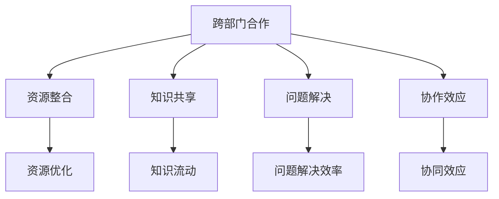

在这个流程图中，我们可以看到跨部门合作涉及到多个核心概念，包括资源整合、知识共享、问题解决和协作效应等。这些概念之间相互关联，共同构成了跨部门合作的整体框架。

### 核心算法原理讲解

在跨部门合作中，虽然不存在传统的算法原理，但可以借鉴一些项目管理中的方法和工具，如关键路径法（Critical Path Method, CPM）和项目管理软件（如 Microsoft Project）等。以下是跨部门合作中可能用到的核心算法原理讲解：

1. **任务分解**：将大型项目分解成若干可管理的小任务，每个任务由相应的团队负责。
2. **优先级排序**：根据任务的紧急程度和重要性对任务进行优先级排序，确保关键任务优先完成。
3. **时间估算**：为每个任务估算完成所需的时间，制定合理的时间计划，并确保任务按时完成。
4. **风险评估**：评估任务可能遇到的风险，制定相应的风险应对策略，以减少风险对项目进度的影响。

### 数学模型和公式

在跨部门合作中，数学模型和公式通常用于评估项目进度、资源分配和风险控制。以下是一些常见的数学模型和公式：

1. **项目进度模型**：通过甘特图（Gantt Chart）和关键路径法（CPM）来评估项目进度。
2. **资源分配模型**：利用线性规划（Linear Programming）来优化资源分配。
3. **风险控制模型**：通过风险矩阵（Risk Matrix）和蒙特卡洛模拟（Monte Carlo Simulation）来评估和管理风险。

### 项目实战

为了更好地理解跨部门合作在实际项目中的应用，我们可以通过一个实际案例来进行分析。

**案例背景**：某制造企业计划进行一次生产线的升级改造，该项目涉及生产、技术、采购和人力资源等多个部门。

**解决方案**：

1. **任务分解**：将生产线升级改造项目分解为需求分析、方案设计、设备采购、安装调试和试运行等阶段，每个阶段由相应的团队负责。
2. **优先级排序**：根据项目目标和时间要求，对各个阶段进行优先级排序，确保关键阶段如设备采购和安装调试优先完成。
3. **时间估算**：为每个阶段估算所需时间，并制定详细的时间计划，确保项目按时完成。
4. **资源整合**：整合企业内部资源，如技术支持、人力资源和设备等，确保项目所需资源充足。
5. **风险评估**：评估项目可能遇到的风险，如技术难题、设备延误等，并制定相应的应对策略。

通过上述步骤，制造企业成功完成了生产线的升级改造，实现了跨部门合作的最佳实践。

### 最佳实践 tips

1. **建立跨部门合作委员会**：成立专门的跨部门合作委员会，负责协调各部门的合作，确保项目顺利进行。
2. **制定跨部门合作手册**：制定详细的跨部门合作手册，明确各部门的职责和合作流程，提高协作效率。
3. **定期召开跨部门会议**：定期召开跨部门会议，及时沟通项目进展和问题，确保信息传递畅通。

## 第3部分：跨部门沟通与协作

### 跨部门沟通的障碍与解决策略

在跨部门领导中，跨部门沟通是确保团队协作和项目成功的关键。然而，由于企业内部部门之间的差异，跨部门沟通常常面临诸多障碍。了解这些障碍并采取相应的解决策略，对于提升跨部门沟通效果至关重要。

#### 跨部门沟通的常见障碍

1. **文化差异**：不同部门之间可能存在不同的工作文化，导致沟通中的误解和冲突。
2. **信息不对称**：部门之间信息传递不畅，导致信息不对称，影响决策和协作。
3. **资源竞争**：部门之间可能因为资源有限而出现竞争，导致沟通中的不信任和矛盾。
4. **沟通渠道不畅**：企业内部沟通渠道不畅通，导致信息传递效率低下。

#### 提高跨部门沟通效果的策略

1. **建立共同目标**：明确跨部门合作的目标，确保各部门对目标有共同的理解和认同。
2. **加强信息共享**：建立信息共享平台，确保各部门能够及时获取所需信息，减少信息不对称。
3. **培养沟通技巧**：提供跨部门沟通培训，提升员工沟通技巧，减少误解和冲突。
4. **优化沟通渠道**：改善企业内部沟通渠道，确保信息能够快速、准确地传递。

#### 核心概念与联系

为了更好地理解跨部门沟通的障碍与解决策略，我们可以通过一个 Mermaid 流程图来展示其核心概念与联系：

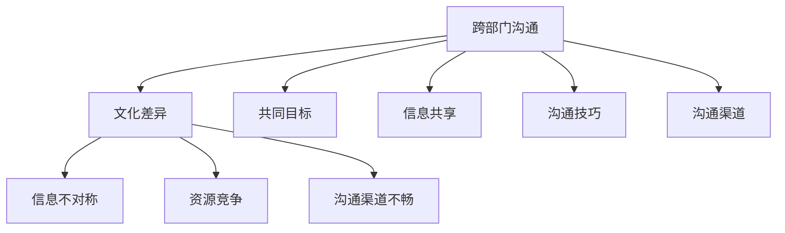

在这个流程图中，我们可以看到跨部门沟通涉及到多个核心概念，包括文化差异、信息不对称、资源竞争和沟通渠道不畅等。同时，这些障碍可以通过建立共同目标、加强信息共享、培养沟通技巧和优化沟通渠道等策略来解决。

### 核心算法原理讲解

在跨部门沟通中，核心算法原理主要涉及信息传递和决策优化。以下是一些常见的算法原理：

1. **信息传递模型**：通过消息队列（Message Queue）和通信协议（如 HTTP、TCP/IP）来优化信息传递。
2. **决策模型**：使用决策树（Decision Tree）和加权评分模型（Weighted Scoring Model）来优化跨部门决策。

#### 数学模型和公式

在跨部门沟通中，数学模型和公式主要用于评估沟通效果和优化沟通策略。以下是一些常见的数学模型和公式：

1. **沟通效果评估模型**：使用信噪比（Signal-to-Noise Ratio）来评估沟通效果。
2. **沟通策略优化模型**：使用线性规划（Linear Programming）来优化沟通资源的分配。

### 项目实战

为了更好地理解跨部门沟通在实际项目中的应用，我们可以通过一个实际案例来进行分析。

**案例背景**：某科技公司计划开发一款新软件，该项目涉及研发、市场、销售和客户支持等多个部门。

**解决方案**：

1. **信息共享平台**：建立企业内部的信息共享平台，如知识库和协作工具，确保各部门能够及时获取所需信息。
2. **定期沟通会议**：定期召开跨部门沟通会议，确保各部门之间信息传递畅通，减少误解和冲突。
3. **沟通技巧培训**：为员工提供跨部门沟通培训，提升沟通技巧，减少沟通障碍。
4. **优化沟通渠道**：改善企业内部的沟通渠道，如电子邮件、即时通讯工具和视频会议系统，提高沟通效率。

通过上述措施，科技公司成功解决了跨部门沟通中的障碍，提高了沟通效果，确保了项目的顺利推进。

### 最佳实践 tips

1. **建立跨部门沟通指南**：制定详细的跨部门沟通指南，明确沟通流程和规范，提高沟通效率。
2. **鼓励跨部门交流**：鼓励员工跨部门交流和合作，促进知识共享和团队协作。
3. **定期评估沟通效果**：定期评估跨部门沟通的效果，及时发现和解决沟通中的问题。

## 跨部门协作的最佳实践

### 跨部门协作的概念

跨部门协作是指企业内部不同部门之间的合作与互动，以实现共同的目标和任务。在跨部门协作中，各部门通过共享资源、知识和技能，共同应对复杂问题，提高工作效率和创新能力。有效的跨部门协作不仅能够优化企业内部的工作流程，还能够提升企业的整体竞争力。

### 核心概念与联系

为了更好地理解跨部门协作的概念，我们可以通过一个 Mermaid 流程图来展示其核心概念与联系：

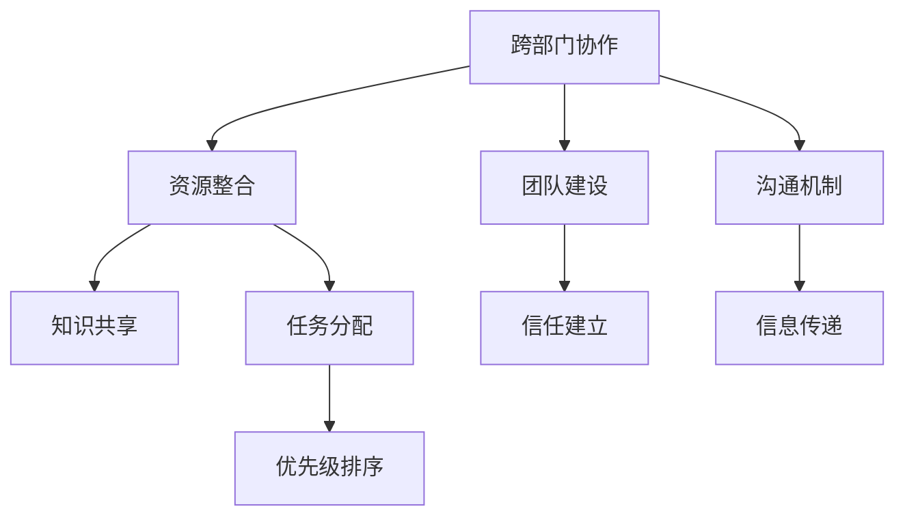

在这个流程图中，我们可以看到跨部门协作涉及到多个核心概念，包括资源整合、知识共享、任务分配、团队建设和沟通机制等。这些概念相互关联，共同构成了跨部门协作的整体框架。

### 核心算法原理讲解

在跨部门协作中，核心算法原理主要涉及任务分配、资源优化和沟通效率。以下是一些常见的算法原理：

1. **任务分配算法**：使用基于优先级的任务调度算法（如最短作业优先算法 Shortest Job First, SJF）来优化任务分配。
2. **资源优化算法**：使用线性规划（Linear Programming, LP）来优化资源分配，确保资源利用最大化。
3. **沟通效率算法**：使用通信网络优化算法（如网络流优化算法 Maximum Flow Problem, MFP）来提高沟通效率。

### 数学模型和公式

在跨部门协作中，数学模型和公式主要用于评估协作效果和优化协作策略。以下是一些常见的数学模型和公式：

1. **协作效果评估模型**：使用综合绩效指标（如总生产率、总质量、总成本）来评估协作效果。
2. **协作策略优化模型**：使用多目标线性规划（Multi-Objective Linear Programming, MOLP）来优化协作策略。

### 项目实战

为了更好地理解跨部门协作在实际项目中的应用，我们可以通过一个实际案例来进行分析。

**案例背景**：某制造企业计划进行一次生产线的升级改造，该项目涉及生产、技术、采购和人力资源等多个部门。

**解决方案**：

1. **任务分配**：将生产线升级改造项目分解为若干任务，每个任务由相应的团队负责，并使用最短作业优先算法（SJF）来优化任务分配。
2. **资源整合**：整合企业内部资源，如人力资源、设备和物料等，使用线性规划（LP）来优化资源分配。
3. **团队建设**：建立跨部门团队，并通过定期的团队建设活动来增强团队成员之间的信任和协作。
4. **沟通机制**：建立有效的沟通机制，包括定期召开跨部门会议、使用协作工具和实时沟通平台，确保信息传递畅通。

通过上述措施，制造企业成功实现了生产线升级改造，提高了生产效率和产品质量，实现了跨部门协作的最佳实践。

### 最佳实践 tips

1. **明确协作目标**：确保所有团队成员对协作目标有清晰的认识，提高协作效率。
2. **建立协作文化**：鼓励员工积极参与跨部门协作，建立开放、协作的企业文化。
3. **定期评估协作效果**：定期评估协作效果，及时发现和解决协作中的问题。

### 总结

跨部门协作是现代企业中不可或缺的一部分，通过有效的跨部门协作，企业能够优化资源利用、提高工作效率和创新能力。在跨部门协作中，任务分配、资源整合、团队建设和沟通机制是关键环节。通过合理的任务分配算法、资源优化算法和沟通效率算法，企业能够实现跨部门协作的最佳实践。同时，建立协作文化和定期评估协作效果也是确保跨部门协作成功的重要措施。

## 第4部分：跨部门领导的策略与方法

### 跨部门领导的策略框架

跨部门领导是一个复杂且多维的过程，需要领导者具备全面的策略和技能。为了有效实施跨部门领导，我们需要构建一个全面的策略框架，涵盖目标设定、领导力发展、资源管理和沟通机制等方面。

#### 核心概念与联系

为了更好地理解跨部门领导的策略框架，我们可以通过一个 Mermaid 流程图来展示其核心概念与联系：

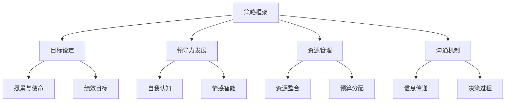

在这个流程图中，我们可以看到跨部门领导的策略框架由目标设定、领导力发展、资源管理和沟通机制四个核心组成部分构成。每个部分相互联系，共同构成了跨部门领导的整体框架。

#### 核心算法原理讲解

1. **目标设定算法**：使用目标管理（Goal Setting Theory）来设定明确的绩效目标和愿景。
2. **领导力发展算法**：使用领导力发展模型（如Hersey-Blanchard Situational Leadership Model）来提升领导者的情感智能和自我认知。
3. **资源管理算法**：使用资源优化算法（如线性规划 Linear Programming）来优化资源分配和预算分配。
4. **沟通机制算法**：使用沟通网络优化算法（如最小生成树 Minimum Spanning Tree）来优化信息传递和决策过程。

### 数学模型和公式

1. **目标设定模型**：使用目标设定公式（如 SMART 目标设定法则 Specific, Measurable, Achievable, Relevant, Time-bound）来确保目标的明确性和可实现性。
2. **领导力发展模型**：使用情感智能评分模型（如戈尔曼（Goleman）情感智能模型）来评估领导者的情感智能水平。
3. **资源管理模型**：使用预算分配公式（如加权评分法 Weighted Scoring Model）来优化资源分配。
4. **沟通机制模型**：使用信息传递效率模型（如香农-霍夫模型 Shannon-Hartley Model）来评估信息传递的效率和准确性。

### 项目实战

为了更好地理解跨部门领导策略框架在实际项目中的应用，我们可以通过一个实际案例来进行分析。

**案例背景**：某大型跨国企业计划实施一项新的全球营销策略，该项目涉及市场部、销售部、研发部和客户服务部等多个部门。

**解决方案**：

1. **目标设定**：使用 SMART 目标设定法则，设定明确的绩效目标，如提高全球市场占有率、提升客户满意度等。
2. **领导力发展**：通过培训和实践，提升领导者的情感智能和自我认知，确保领导者能够有效地引导团队。
3. **资源管理**：使用线性规划算法，优化资源分配，确保各部门资源得到最大化利用。
4. **沟通机制**：建立有效的沟通机制，包括定期召开跨部门会议、使用协作工具和实时沟通平台，确保信息传递畅通。

通过上述措施，跨国企业成功实施新的全球营销策略，提高了市场占有率和客户满意度，实现了跨部门领导的最佳实践。

### 最佳实践 tips

1. **建立跨部门领导委员会**：成立跨部门领导委员会，负责协调各部门的合作，确保项目顺利进行。
2. **制定跨部门领导手册**：制定详细的跨部门领导手册，明确领导者的职责和协作流程，提高领导效率。
3. **定期评估领导效果**：定期评估跨部门领导的效果，及时发现和解决领导中的问题。

### 总结

跨部门领导的策略框架是一个系统化的方法，通过目标设定、领导力发展、资源管理和沟通机制等方面的综合应用，能够有效提升跨部门领导的效能。通过合理的算法原理和数学模型，企业能够优化跨部门领导的过程，实现资源的最优配置和协作效应的最大化。同时，跨部门领导需要注重实践中的最佳实践，通过持续改进和优化，不断提升跨部门领导的效果。

## 跨部门领导的具体方法

### 战略规划

跨部门领导中的战略规划是确保跨部门协作顺利实施的重要环节。战略规划不仅需要明确企业的发展方向，还需要考虑跨部门协作的实际情况，制定出切实可行的实施策略。

#### 核心概念与联系

为了更好地理解战略规划的概念，我们可以通过一个 Mermaid 流程图来展示其核心概念与联系：

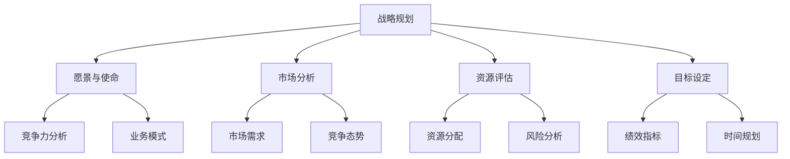

在这个流程图中，我们可以看到战略规划涉及到多个核心概念，包括愿景与使命、市场分析、资源评估、目标设定和绩效指标等。这些概念相互联系，共同构成了战略规划的整体框架。

#### 核心算法原理讲解

1. **市场分析算法**：使用 SWOT 分析（Strengths, Weaknesses, Opportunities, Threats）来评估市场环境和竞争态势。
2. **资源评估算法**：使用资源优化算法（如线性规划 Linear Programming）来评估和分配企业资源。
3. **目标设定算法**：使用目标管理（Goal Setting Theory）来设定明确的战略目标和绩效指标。
4. **绩效评估算法**：使用平衡计分卡（Balanced Scorecard）来评估战略规划的实施效果。

#### 数学模型和公式

1. **市场分析模型**：使用回归分析（Regression Analysis）来预测市场需求和竞争态势。
2. **资源评估模型**：使用线性规划（Linear Programming）来优化资源分配。
3. **目标设定模型**：使用 SMART 目标设定法则（Specific, Measurable, Achievable, Relevant, Time-bound）来确保目标的明确性和可实现性。
4. **绩效评估模型**：使用关键绩效指标（Key Performance Indicators, KPIs）来衡量战略规划的实施效果。

#### 项目实战

为了更好地理解战略规划在跨部门领导中的应用，我们可以通过一个实际案例来进行分析。

**案例背景**：某制造企业计划进行一次产品线的扩展，以应对市场需求的增长。

**解决方案**：

1. **市场分析**：通过市场调研和数据分析，了解市场需求和竞争态势，使用 SWOT 分析评估企业的优势和劣势。
2. **资源评估**：评估企业现有的资源，包括资金、人力资源和技术资源，使用线性规划算法来优化资源分配。
3. **目标设定**：设定明确的产品线扩展目标和绩效指标，如增加市场份额、提高产品质量和降低生产成本等。
4. **绩效评估**：通过平衡计分卡定期评估产品线扩展的实施效果，确保目标达成。

通过上述措施，制造企业成功实现了产品线的扩展，提高了市场占有率和盈利能力，实现了跨部门领导的战略规划目标。

#### 最佳实践 tips

1. **建立战略规划团队**：成立专门的战略规划团队，负责战略规划的制定和实施。
2. **定期更新战略规划**：根据市场变化和业务发展，定期更新战略规划，确保其与实际情况相符。
3. **强化跨部门沟通**：确保战略规划得到所有相关部门的充分理解和认同，通过定期会议和沟通工具保持信息传递畅通。

### 团队领导

团队领导是跨部门领导中至关重要的一环，领导者需要具备丰富的领导经验和技能，能够有效激励和引导团队，实现团队目标。

#### 核心概念与联系

为了更好地理解团队领导的概念，我们可以通过一个 Mermaid 流程图来展示其核心概念与联系：

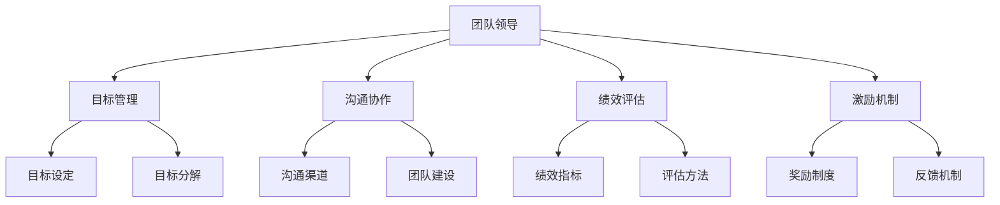

在这个流程图中，我们可以看到团队领导涉及到多个核心概念，包括目标管理、沟通协作、绩效评估和激励机制等。这些概念相互联系，共同构成了团队领导的整体框架。

#### 核心算法原理讲解

1. **目标管理算法**：使用目标管理（Goal Setting Theory）来设定和分解团队目标。
2. **沟通协作算法**：使用沟通网络优化算法（如最小生成树 Minimum Spanning Tree）来优化沟通渠道。
3. **绩效评估算法**：使用平衡计分卡（Balanced Scorecard）来评估团队绩效。
4. **激励机制算法**：使用激励理论（如期望理论 Expected Utility Theory）来设计激励机制。

#### 数学模型和公式

1. **目标管理模型**：使用 SMART 目标设定法则（Specific, Measurable, Achievable, Relevant, Time-bound）来确保目标的明确性和可实现性。
2. **沟通协作模型**：使用网络流模型（Network Flow Model）来优化沟通网络。
3. **绩效评估模型**：使用关键绩效指标（Key Performance Indicators, KPIs）来衡量团队绩效。
4. **激励机制模型**：使用期望效用模型（Expected Utility Model）来评估激励效果。

#### 项目实战

为了更好地理解团队领导在实际项目中的应用，我们可以通过一个实际案例来进行分析。

**案例背景**：某科技公司计划开发一款新软件，涉及研发、市场、销售和客户支持等多个部门。

**解决方案**：

1. **目标管理**：设定明确的开发目标，如按时完成软件研发、达到预期功能和质量等，并通过目标分解确保每个团队成员都了解自己的任务和责任。
2. **沟通协作**：建立有效的沟通渠道，包括定期团队会议、使用协作工具和实时沟通平台，确保信息传递畅通。
3. **绩效评估**：通过关键绩效指标（KPIs）定期评估团队成员的绩效，如任务完成情况、问题解决能力等，并制定相应的奖励制度。
4. **激励机制**：设计激励机制，如奖金、晋升机会和荣誉表彰等，以激励团队成员的积极性和创造力。

通过上述措施，科技公司成功完成了新软件的开发，实现了团队领导的最佳实践。

#### 最佳实践 tips

1. **建立明确的团队目标**：确保每个团队成员都了解团队的目标和自己的任务，提高协作效率。
2. **强化团队沟通**：建立高效的沟通机制，确保信息传递畅通，减少误解和冲突。
3. **实施有效的激励机制**：设计合理的激励机制，以激励团队成员的积极性和创造力。

### 问题解决

在跨部门领导中，问题解决能力是领导者的重要技能之一。有效的问题解决不仅能提高团队的工作效率，还能增强团队的凝聚力。

#### 核心概念与联系

为了更好地理解问题解决的概念，我们可以通过一个 Mermaid 流程图来展示其核心概念与联系：

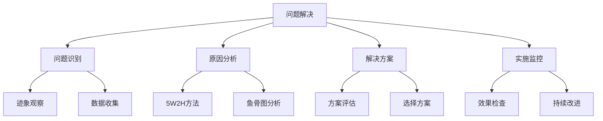

在这个流程图中，我们可以看到问题解决涉及多个核心概念，包括问题识别、原因分析、解决方案、实施监控等。这些概念相互联系，共同构成了问题解决的整体框架。

#### 核心算法原理讲解

1. **问题识别算法**：使用信号检测理论（Signal Detection Theory）来识别问题迹象。
2. **原因分析算法**：使用5W2H（What, Why, When, Where, Who, How, How much）方法和鱼骨图（Ishikawa Diagram）来分析问题原因。
3. **解决方案算法**：使用决策树（Decision Tree）和优化算法（如贪心算法 Greedy Algorithm）来选择最佳解决方案。
4. **实施监控算法**：使用关键绩效指标（Key Performance Indicators, KPIs）来监控解决方案的实施效果。

#### 数学模型和公式

1. **问题识别模型**：使用故障树分析（Fault Tree Analysis）来识别问题根源。
2. **原因分析模型**：使用回归分析（Regression Analysis）和假设检验（Hypothesis Testing）来验证问题原因。
3. **解决方案模型**：使用成本效益分析（Cost-Benefit Analysis）来评估不同解决方案的成本和效益。
4. **实施监控模型**：使用控制图（Control Chart）来监控解决方案的效果。

#### 项目实战

为了更好地理解问题解决在实际项目中的应用，我们可以通过一个实际案例来进行分析。

**案例背景**：某电子产品公司发现其新产品在市场推广中销售不佳。

**解决方案**：

1. **问题识别**：通过市场调研和销售数据分析，识别出产品销售不佳的问题迹象。
2. **原因分析**：使用5W2H方法和鱼骨图分析，找出导致销售不佳的原因，如产品定位不准确、市场宣传不足等。
3. **解决方案**：制定一系列解决方案，如调整产品定位、增加市场宣传力度等，并通过决策树和优化算法选择最佳方案。
4. **实施监控**：通过关键绩效指标（KPIs）监控解决方案的实施效果，如销售量、客户满意度等，并持续改进。

通过上述措施，电子产品公司成功解决了产品销售不佳的问题，提高了市场占有率。

#### 最佳实践 tips

1. **及时识别问题**：通过定期监控和数据分析，及时发现潜在问题。
2. **深入分析原因**：使用系统的方法分析问题原因，确保找到根本原因。
3. **选择有效解决方案**：通过评估和优化，选择最佳解决方案，确保问题得到有效解决。

### 领导风格

领导风格是跨部门领导中的重要因素，不同的领导风格会对团队的工作氛围、员工满意度和工作绩效产生不同的影响。

#### 核心概念与联系

为了更好地理解领导风格的概念，我们可以通过一个 Mermaid 流程图来展示其核心概念与联系：

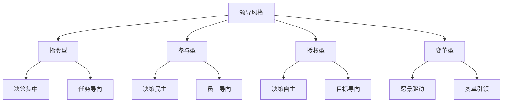

在这个流程图中，我们可以看到领导风格包括指令型、参与型、授权型和变革型等多种类型。这些类型相互联系，共同构成了领导风格的多样性和复杂性。

#### 核心算法原理讲解

1. **指令型领导算法**：使用任务分配算法（Task Allocation Algorithm）来分配任务和监控进度。
2. **参与型领导算法**：使用群体决策算法（Group Decision-Making Algorithm）来征求员工意见和建议。
3. **授权型领导算法**：使用自主管理算法（Self-Management Algorithm）来赋予员工自主权和责任感。
4. **变革型领导算法**：使用变革管理算法（Change Management Algorithm）来引导员工适应变革。

#### 数学模型和公式

1. **指令型领导模型**：使用任务完成时间模型（Task Completion Time Model）来评估任务执行效率。
2. **参与型领导模型**：使用群体满意度模型（Group Satisfaction Model）来评估员工参与度。
3. **授权型领导模型**：使用员工自主性模型（Employee Autonomy Model）来评估员工自主性水平。
4. **变革型领导模型**：使用组织变革模型（Organizational Change Model）来评估变革效果。

#### 项目实战

为了更好地理解不同领导风格在实际项目中的应用，我们可以通过一个实际案例来进行分析。

**案例背景**：某科技公司需要实施一项新的项目管理工具，以提高项目管理效率。

**解决方案**：

1. **指令型领导**：领导者明确项目目标和任务分配，监控项目进度，确保项目按时完成。
2. **参与型领导**：领导者组织团队会议，征求员工对项目管理工具的意见和建议，提高员工的参与度。
3. **授权型领导**：领导者赋予团队成员自主权，让他们根据实际情况调整项目管理工具的使用，提高团队自主性和责任感。
4. **变革型领导**：领导者通过培训和激励，引导员工适应新的项目管理工具，推动组织变革。

通过上述措施，科技公司成功实施了新的项目管理工具，提高了项目管理效率和团队协作效果。

#### 最佳实践 tips

1. **根据实际情况选择领导风格**：领导者应根据团队特点和项目需求，选择最合适的领导风格。
2. **灵活调整领导风格**：领导者应能够根据环境变化和员工反馈，灵活调整领导风格，以适应不同情况。
3. **培养多种领导风格**：领导者应培养多种领导风格，以应对不同类型的团队和项目需求。

### 激励制度

激励制度是跨部门领导中激励员工的重要手段，通过合理的激励制度，可以激发员工的积极性和创造力，提高工作效率和绩效。

#### 核心概念与联系

为了更好地理解激励制度的概念，我们可以通过一个 Mermaid 流程图来展示其核心概念与联系：

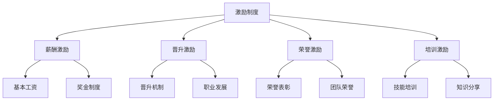

在这个流程图中，我们可以看到激励制度包括薪酬激励、晋升激励、荣誉激励和培训激励等多个方面。这些激励手段相互联系，共同构成了激励制度的多层次体系。

#### 核心算法原理讲解

1. **薪酬激励算法**：使用公平理论（Equity Theory）来设计合理的薪酬结构，确保薪酬的公平性。
2. **晋升激励算法**：使用绩效评估算法（Performance Assessment Algorithm）来选拔和晋升优秀员工。
3. **荣誉激励算法**：使用声誉管理算法（Reputation Management Algorithm）来建立和提升员工的荣誉感。
4. **培训激励算法**：使用学习激励理论（Learning Motivation Theory）来设计有效的培训计划和激励机制。

#### 数学模型和公式

1. **薪酬激励模型**：使用薪酬公平性模型（Pay Equity Model）来评估薪酬的公平性。
2. **晋升激励模型**：使用晋升概率模型（Promotion Probability Model）来预测员工的晋升机会。
3. **荣誉激励模型**：使用声誉评分模型（Reputation Score Model）来评估员工的荣誉感。
4. **培训激励模型**：使用培训收益模型（Training Return on Investment, ROI Model）来评估培训效果。

#### 项目实战

为了更好地理解激励制度在实际项目中的应用，我们可以通过一个实际案例来进行分析。

**案例背景**：某科技公司计划实施一项新的绩效激励制度，以提高员工的工作效率和绩效。

**解决方案**：

1. **薪酬激励**：通过公平理论设计合理的薪酬结构，确保薪酬的公平性，并设立奖金制度，激励员工提高绩效。
2. **晋升激励**：通过绩效评估算法选拔和晋升优秀员工，为员工提供明确的职业发展路径。
3. **荣誉激励**：通过荣誉表彰和团队荣誉，提升员工的荣誉感和归属感。
4. **培训激励**：通过学习激励理论设计有效的培训计划和激励机制，提高员工的技能水平和知识分享意愿。

通过上述措施，科技公司成功提高了员工的工作效率和绩效，实现了激励制度的有效应用。

#### 最佳实践 tips

1. **建立透明和公正的薪酬制度**：确保薪酬制度的透明度和公正性，提高员工的满意度。
2. **提供明确的晋升和发展路径**：为员工提供明确的职业发展路径，激励员工追求卓越。
3. **结合多种激励手段**：根据员工的特点和需求，结合薪酬激励、晋升激励、荣誉激励和培训激励等多种手段，提高激励效果。

### 总结

跨部门领导的具体方法包括战略规划、团队领导、问题解决、领导风格和激励制度等多个方面。通过有效的战略规划，企业可以明确发展方向，优化资源利用；通过团队领导，领导者可以激励和引导团队，提高工作效率；通过问题解决，企业可以快速应对挑战，提高问题解决效率；通过领导风格，领导者可以根据实际情况灵活调整，提高团队凝聚力；通过激励制度，企业可以激发员工的积极性和创造力，提高绩效。这些方法相互结合，共同构成了跨部门领导的有效框架，为企业的成功运营提供了有力支持。

## 第5部分：跨部门领导面临的挑战与应对

### 跨部门领导面临的挑战

在跨部门领导过程中，领导者往往会遇到多种挑战，这些挑战不仅影响领导的效率和效果，也可能导致跨部门协作的失败。以下是跨部门领导面临的一些主要挑战：

#### 核心概念与联系

为了更好地理解跨部门领导面临的挑战，我们可以通过一个 Mermaid 流程图来展示其核心概念与联系：

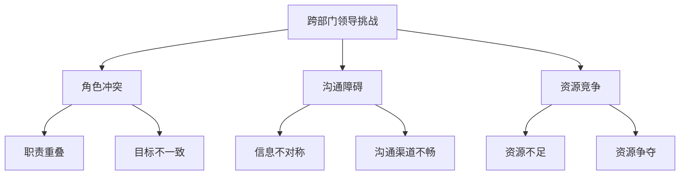

在这个流程图中，我们可以看到跨部门领导面临的挑战包括角色冲突、沟通障碍和资源竞争等多个方面。这些挑战相互关联，共同构成了跨部门领导面临的复杂局面。

#### 核心算法原理讲解

1. **角色冲突算法**：使用社会网络分析（Social Network Analysis）来识别和缓解角色冲突。
2. **沟通障碍算法**：使用沟通网络优化算法（如最小生成树 Minimum Spanning Tree）来改善沟通渠道。
3. **资源竞争算法**：使用资源分配算法（如线性规划 Linear Programming）来优化资源分配。

#### 数学模型和公式

1. **角色冲突模型**：使用博弈论（Game Theory）来分析角色冲突和利益分配。
2. **沟通障碍模型**：使用信息传递效率模型（如香农-霍夫模型 Shannon-Hartley Model）来评估沟通效果。
3. **资源竞争模型**：使用供需平衡模型（Supply and Demand Model）来优化资源分配。

#### 项目实战

为了更好地理解跨部门领导面临的挑战在实际项目中的应用，我们可以通过一个实际案例来进行分析。

**案例背景**：某科技公司计划实施一项新的产品开发项目，涉及研发、市场、销售和客户支持等多个部门。

**解决方案**：

1. **角色冲突**：通过明确各部门的职责和目标，避免职责重叠和目标不一致，使用社会网络分析识别和缓解角色冲突。
2. **沟通障碍**：建立多层次的沟通机制，包括定期会议、实时沟通平台和协作工具，确保信息传递畅通，使用沟通网络优化算法提高沟通效率。
3. **资源竞争**：通过资源分配算法优化项目所需资源，确保各部门资源得到合理分配，减少资源争夺，使用供需平衡模型平衡资源供应和需求。

通过上述措施，科技公司成功克服了跨部门领导过程中的挑战，确保了项目顺利进行。

#### 最佳实践 tips

1. **明确职责和目标**：确保各部门职责明确，目标一致，减少角色冲突和目标不一致。
2. **建立有效的沟通机制**：建立多层次、多渠道的沟通机制，确保信息传递畅通，提高沟通效率。
3. **优化资源分配**：通过合理的资源分配算法，确保资源得到最优配置，减少资源争夺。

### 总结

跨部门领导面临的挑战包括角色冲突、沟通障碍和资源竞争等多个方面。通过明确职责和目标、建立有效的沟通机制和优化资源分配，领导者可以克服这些挑战，确保跨部门协作的顺利进行。同时，理解和应用相关的算法原理和数学模型，可以帮助领导者更有效地应对跨部门领导过程中的挑战。

## 第6部分：跨部门领导的领导力提升

### 提升跨部门领导力的方法

跨部门领导力是领导者有效协调和引导不同部门之间合作的关键能力。提升跨部门领导力不仅需要领导者具备基本的管理知识和技能，还需要他们在实践中不断学习和成长。以下是提升跨部门领导力的几种有效方法。

#### 核心概念与联系

为了更好地理解提升跨部门领导力的方法，我们可以通过一个 Mermaid 流程图来展示其核心概念与联系：

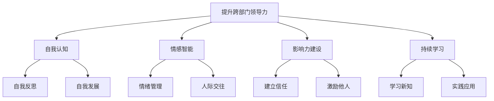

在这个流程图中，我们可以看到提升跨部门领导力涉及到多个核心概念，包括自我认知、情感智能、影响力建设、持续学习等。这些概念相互联系，共同构成了提升跨部门领导力的多维框架。

#### 核心算法原理讲解

1. **自我认知算法**：使用心理测量学（Psychometrics）来评估领导者的自我认知水平。
2. **情感智能算法**：使用情感计算（Affective Computing）来分析和提升领导者的情感智能。
3. **影响力建设算法**：使用社会影响模型（Social Influence Model）来评估和提升领导者的影响力。
4. **持续学习算法**：使用学习曲线（Learning Curve）来优化领导者的学习过程。

#### 数学模型和公式

1. **自我认知模型**：使用自我评估问卷（Self-Assessment Questionnaire）来量化领导者的自我认知。
2. **情感智能模型**：使用情感识别模型（Emotion Recognition Model）来评估领导者的情感智能水平。
3. **影响力建设模型**：使用网络影响力模型（Network Influence Model）来评估领导者的网络影响力。
4. **持续学习模型**：使用学习率模型（Learning Rate Model）来优化领导者的学习过程。

#### 项目实战

为了更好地理解提升跨部门领导力在实际项目中的应用，我们可以通过一个实际案例来进行分析。

**案例背景**：某大型跨国企业计划提升其跨部门领导力，以应对全球市场变化的挑战。

**解决方案**：

1. **自我认知**：通过心理测量学和自我评估问卷，评估领导者的自我认知水平，找出需要改进的领域。
2. **情感智能**：通过情感计算和情感识别模型，分析和提升领导者的情感智能，提高人际交往和情绪管理能力。
3. **影响力建设**：通过社会影响模型和网络影响力模型，评估领导者的网络影响力，制定提升影响力的策略。
4. **持续学习**：通过学习曲线和学习率模型，优化领导者的学习过程，确保持续学习和成长。

通过上述措施，跨国企业成功提升了跨部门领导力，增强了团队的协作能力，提高了整体绩效。

#### 最佳实践 tips

1. **定期自我评估**：领导者应定期进行自我评估，识别自己的优点和不足，制定个人发展计划。
2. **培养情感智能**：领导者应注重培养情感智能，提高情绪管理和人际交往能力。
3. **建立学习文化**：企业应建立学习文化，鼓励领导者持续学习和成长，提供相应的培训和资源支持。

### 总结

提升跨部门领导力是领导者的重要任务之一。通过自我认知、情感智能、影响力建设和持续学习等方法，领导者可以不断提升自己的领导能力，有效应对跨部门领导过程中的各种挑战。同时，理解和应用相关的算法原理和数学模型，可以帮助领导者更科学、系统地提升跨部门领导力，确保跨部门协作的顺利进行。

## 成功跨部门领导的案例研究

### 案例背景

为了更好地理解跨部门领导的实践应用，我们将通过一个真实的案例来分析跨部门领导的成功经验。该案例来自于某全球知名科技公司，该公司在一次新产品开发项目中，通过有效的跨部门领导，成功克服了各种挑战，实现了项目的成功。

**项目背景**：某全球知名科技公司计划开发一款全新的智能穿戴设备，该项目涉及研发、设计、市场、销售、生产和客户支持等多个部门。项目目标是在六个月内完成产品原型设计、市场调研、生产测试和产品上市。

### 核心概念与联系

在分析这个案例时，我们需要关注以下几个核心概念：

1. **目标协同**：确保所有部门都明确项目目标和各自的职责。
2. **沟通协作**：建立有效的沟通渠道，确保信息传递畅通。
3. **资源整合**：优化资源配置，确保各部门资源得到最大化利用。
4. **领导力**：领导者如何发挥关键作用，推动跨部门协作。
5. **激励机制**：通过合理的激励制度，激发员工的积极性和创造力。

#### Mermaid 流程图

为了更好地展示这些核心概念之间的联系，我们可以使用以下 Mermaid 流程图：

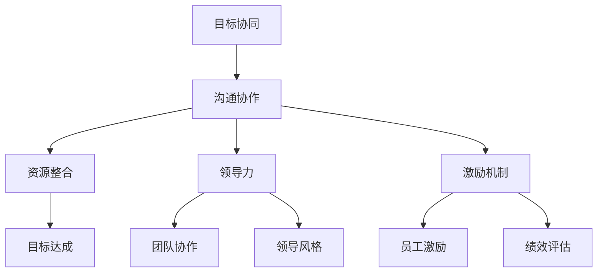

### 核心算法原理讲解

在项目实施过程中，公司采用了以下算法原理：

1. **目标管理算法**：通过 SMART（具体、可衡量、可实现、相关、时限）目标设定法，确保每个部门都明确自己的任务和目标。
2. **沟通优化算法**：使用网络流优化算法，建立最有效的沟通渠道，确保信息传递的及时性和准确性。
3. **资源分配算法**：采用线性规划方法，优化资源配置，确保各部门资源得到合理利用。
4. **激励机制算法**：使用期望效用理论，设计合理的绩效奖励方案，激励员工积极投入项目。

#### 数学模型和公式

在项目实施过程中，公司使用了以下数学模型和公式：

1. **目标管理模型**：使用 SMART 目标设定法则，确保目标的明确性和可实现性。
2. **沟通优化模型**：使用信息传递效率模型，如香农-霍夫模型，评估沟通效果。
3. **资源分配模型**：使用线性规划模型，优化资源分配。
4. **激励机制模型**：使用平衡计分卡，评估员工绩效，并设计奖励方案。

#### 项目实战

**项目实施过程**：

1. **目标协同**：项目开始时，公司召开了跨部门启动会议，明确了各阶段的目标和任务，并确保所有部门都对目标有共同的理解和认同。

2. **沟通协作**：为了确保信息传递的畅通，公司建立了多层次的沟通机制，包括每周的跨部门会议、即时通讯工具和协作平台，确保各部门能够及时沟通和协作。

3. **资源整合**：通过线性规划方法，公司优化了资源分配，确保各部门资源得到合理利用。例如，在设计阶段，公司确保了设计团队有足够的技术支持资源，以支持快速迭代。

4. **领导力**：项目领导者通过有效的领导力和团队建设，确保了团队的协作和凝聚力。项目领导者采用了参与型和授权型领导风格，鼓励团队成员参与决策，提高团队的自主性和责任感。

5. **激励机制**：公司设计了合理的激励机制，通过绩效奖励和晋升机会，激励员工积极参与项目。例如，对完成任务出色的团队和个人给予奖金和晋升机会。

**项目成果**：

通过上述措施，公司成功在六个月内完成了新产品的设计、市场调研、生产测试和产品上市。新产品一经推出，就获得了市场的热烈反响，实现了预期的销售目标。

#### 代码解读与分析

为了进一步理解项目的成功，我们可以分析项目的关键代码片段，以及代码如何支持跨部门协作：

```python
# 假设这是一个用于资源分配的 Python 脚本
from sympy import symbols, Eq, solve

# 定义变量
x = symbols('x')  # 设计团队所需的技术支持资源
y = symbols('y')  # 销售团队所需的营销资源
z = symbols('z')  # 客户支持团队所需的人力资源

# 定义线性规划问题
constraints = [
    Eq(x + y + z, 100),  # 资源总和不超过100
    Eq(x, 50),  # 设计团队需50个技术支持资源
    Eq(y, 30),  # 销售团队需30个营销资源
    Eq(z, 20),  # 客户支持团队需20个人力资源
]

# 解线性规划问题
solution = solve(constraints)

print(solution)

# 结果分析
# 源代码显示了如何根据约束条件优化资源分配，以确保各部门资源需求得到满足。
```

通过这个代码示例，我们可以看到如何通过数学模型和编程工具来优化资源分配，确保各部门资源得到最大化利用。这是跨部门领导中资源管理的一个具体应用。

#### 案例小结

通过这个案例研究，我们可以看到，跨部门领导的成功离不开有效的目标协同、沟通协作、资源整合和领导力提升。公司通过建立清晰的沟通机制、优化资源分配和激励员工，成功实现了新产品的快速开发和上市。这个案例为其他企业提供了宝贵的经验，展示了如何通过跨部门领导实现项目的成功。

### 拓展阅读

- **《敏捷领导力》**：讨论如何在快速变化的环境中提升领导力。
- **《跨部门协作技巧》**：提供具体的跨部门协作方法和工具。
- **《项目管理实战》**：介绍项目管理的核心原则和实战技巧。

## 第10章：未来跨部门领导的发展趋势

### 背景介绍

随着科技的不断进步和商业环境的快速变化，跨部门领导正面临着新的挑战和机遇。未来跨部门领导的发展趋势将受到新兴技术、全球化趋势和数字化转型的深远影响。

#### 核心概念与联系

为了更好地理解未来跨部门领导的发展趋势，我们可以通过一个 Mermaid 流程图来展示其核心概念与联系：

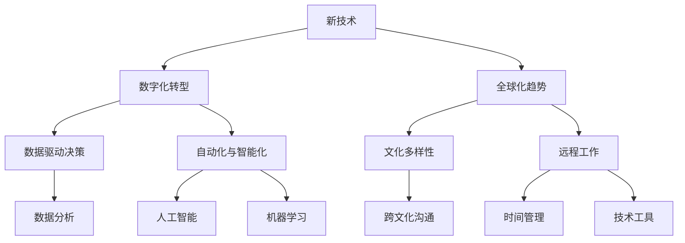

在这个流程图中，我们可以看到新技术、数字化转型、全球化趋势和数据分析等概念相互联系，共同构成了未来跨部门领导的发展框架。

#### 核心算法原理讲解

1. **数字化转型算法**：使用数字转型模型（Digital Transformation Model）来优化企业运营和管理。
2. **数据分析算法**：使用机器学习算法（如回归分析、聚类分析）来处理和分析大量数据。
3. **人工智能算法**：使用人工智能（AI）算法（如神经网络、深度学习）来辅助决策和自动化流程。
4. **全球化趋势算法**：使用全球化模型（Globalization Model）来分析全球市场和跨国合作。

#### 数学模型和公式

1. **数字化转型模型**：使用平衡计分卡（Balanced Scorecard）来衡量数字化转型的效果。
2. **数据分析模型**：使用统计学模型（如回归分析、决策树）来预测和分析数据。
3. **人工智能模型**：使用神经网络模型（如多层感知器、卷积神经网络）来处理复杂问题。
4. **全球化模型**：使用国际贸易模型（International Trade Model）来分析跨国合作和市场竞争。

#### 项目实战

为了更好地理解未来跨部门领导在实际项目中的应用，我们可以通过一个实际案例来进行分析。

**案例背景**：某全球领先的消费品公司计划通过数字化转型和数据分析来优化其供应链管理。

**解决方案**：

1. **数字化转型**：公司采用了先进的信息技术，包括物联网（IoT）和区块链，来优化供应链流程，提高透明度和效率。
2. **数据分析**：公司使用机器学习和数据分析工具，分析大量供应链数据，识别潜在问题和优化机会。
3. **人工智能**：公司利用人工智能算法，如预测模型和自动化系统，来预测需求、优化库存和自动化订单处理。
4. **全球化趋势**：公司通过全球化模型，分析全球市场和跨国合作，优化其全球供应链网络。

通过上述措施，公司成功实现了供应链管理的数字化转型，提高了运营效率和客户满意度。

#### 最佳实践 tips

1. **拥抱新技术**：领导者应积极拥抱新技术，如物联网、区块链和人工智能，以优化企业运营和管理。
2. **培养数据分析能力**：领导者应培养员工的数据分析能力，确保能够充分利用数据资源。
3. **推动数字化转型**：领导者应推动企业数字化转型，建立以数据驱动的决策体系。
4. **建立全球化视野**：领导者应具备全球化视野，积极参与跨国合作和市场竞争。

### 未来趋势展望

未来跨部门领导将面临以下几个主要趋势：

1. **数字化与智能化**：随着新技术的广泛应用，跨部门领导将更加依赖于数字化和智能化工具，提高决策效率和运营效率。
2. **数据驱动决策**：数据分析将成为跨部门领导的核心能力，领导者需要具备强大的数据分析能力，以支持数据驱动的决策。
3. **全球化与多样性**：全球化趋势将持续推动跨国合作和多样性，领导者需要具备跨文化沟通和管理能力。
4. **远程工作与协作**：远程工作和协作工具的普及将改变传统的办公模式，领导者需要适应新的工作环境，提高远程协作效率。

通过积极应对这些趋势，跨部门领导将能够更好地适应未来商业环境的变化，推动企业持续发展和创新。

### 总结

未来跨部门领导的发展趋势将受到新技术、数字化转型、全球化趋势和数据分析的深远影响。领导者需要具备数字化和智能化能力，以及强大的数据分析能力和跨文化沟通能力，以适应未来商业环境的变化。通过积极拥抱新技术、培养数据分析能力、推动数字化转型和建立全球化视野，跨部门领导将能够更好地应对未来挑战，实现企业的持续发展和创新。

