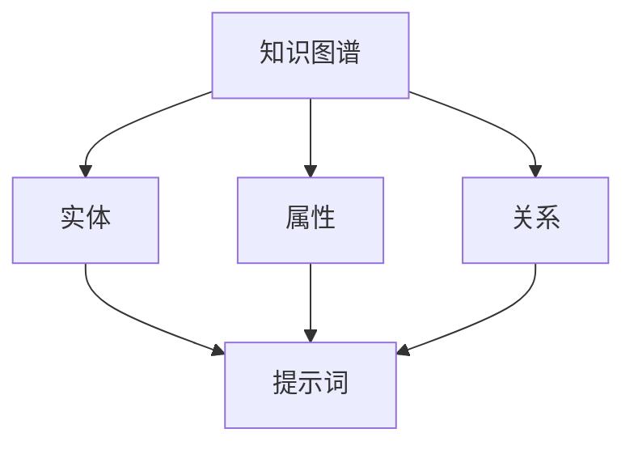

                 

### 文章标题：跨领域提示词知识图谱构建

#### 关键词：知识图谱，跨领域，提示词，图谱构建，人工智能

> 摘要：本文旨在深入探讨跨领域提示词知识图谱的构建过程，解析其核心概念、技术原理以及实际应用。通过系统阐述知识图谱与提示词的关系、构建流程、跨领域提示词提取方法以及知识图谱应用场景，本文为读者提供了一部关于跨领域提示词知识图谱构建的全面指南。同时，本文还结合实际项目案例，详细介绍了开发环境搭建、源代码实现和代码解读，帮助读者掌握跨领域提示词知识图谱的实际操作技巧。

---

### 引言：知识图谱与提示词的基本概念

知识图谱（Knowledge Graph）是近年来在人工智能领域发展迅速的一种技术，它通过将现实世界中的知识以图的形式进行组织与表示，实现了对知识的结构化和语义化。知识图谱的核心在于将实体、属性和关系进行关联，形成一个语义丰富的知识网络。

提示词（Prompt Word）则是在自然语言处理领域中广泛使用的一种技术，它通过特定的关键词或短语，引导用户进行特定任务，如问答、推理等。在知识图谱中，提示词常常用于获取用户输入，从而触发图谱中的相关实体和关系。

**知识图谱与提示词的关系：**

知识图谱为提示词提供了丰富的知识资源，提示词则使知识图谱更具交互性和实用性。通过跨领域提示词的构建，可以实现不同领域知识之间的融合与互通，从而提升知识图谱的应用价值。


### 核心概念与联系：Mermaid 流程图

以下是一个简单的Mermaid流程图，展示了知识图谱与提示词的基本概念和联系：



### 核心算法原理讲解：伪代码

为了更好地理解知识图谱与提示词的构建过程，以下是一个简化的伪代码示例，用于展示知识图谱的构建过程：

```python
# 知识图谱构建伪代码

# 数据采集
data = collect_data()

# 数据预处理
preprocessed_data = preprocess_data(data)

# 实体识别
entities = identify_entities(preprocessed_data)

# 关系抽取
relationships = extract_relationships(preprocessed_data)

# 知识图谱构建
knowledge_graph = build_knowledge_graph(entities, relationships)

# 提示词提取
prompts = extract_prompts(knowledge_graph)

# 输出知识图谱和提示词
output(knowledge_graph, prompts)
```

### 数学模型和公式：详细讲解与举例说明

在知识图谱的构建过程中，常常会涉及到一些数学模型和公式。以下是一个简单的数学模型示例，用于计算实体之间的相似度：

$$
similarity(A, B) = \frac{1}{|R|}
\sum_{r \in R} \frac{w_r}{|E_r|}
$$

其中，$similarity(A, B)$ 表示实体 A 和 B 之间的相似度，$R$ 表示实体 A 和 B 共有的关系集合，$w_r$ 表示关系 r 的权重，$E_r$ 表示关系 r 的实体集合。

举例说明：

假设有两个实体 A 和 B，它们共有的关系集合为 R = {r1, r2}，其中 r1 的权重为 0.6，r2 的权重为 0.4。r1 的实体集合为 E_r1 = {entity1, entity2}，r2 的实体集合为 E_r2 = {entity3, entity4}。

则实体 A 和 B 之间的相似度计算如下：

$$
similarity(A, B) = \frac{1}{2} \left( \frac{0.6}{2} + \frac{0.4}{2} \right) = 0.5
$$

这意味着实体 A 和 B 之间的相似度为 0.5。

### 项目实战：开发环境搭建

在开始构建跨领域提示词知识图谱之前，首先需要搭建一个适合的开发环境。以下是一个简单的开发环境搭建步骤：

1. **安装 Python**：下载并安装 Python，版本建议为 3.8 或以上。

2. **安装 Anaconda**：下载并安装 Anaconda，用于管理 Python 环境。

3. **创建虚拟环境**：在 Anaconda 中创建一个名为 `kg_env` 的虚拟环境，并激活该环境。

   ```bash
   conda create -n kg_env python=3.8
   conda activate kg_env
   ```

4. **安装必需的库**：在虚拟环境中安装以下库：

   ```bash
   pip install numpy pandas rdflib spacy
   ```

5. **安装 spacy 的语言模型**：安装所需的 spacy 语言模型，例如中文模型 `zh_core_web_sm`。

   ```bash
   python -m spacy download zh_core_web_sm
   ```

### 源代码详细实现与代码解读

以下是一个简单的跨领域提示词知识图谱的源代码实现示例，用于展示关键步骤的实现细节：

```python
# 导入必需的库
import pandas as pd
import numpy as np
import rdflib
from spacy.lang.zh import Chinese
import spacy

# 加载中文语言模型
nlp = spacy.load('zh_core_web_sm')

# 数据采集
def collect_data():
    # 读取数据文件
    data = pd.read_csv('data.csv')
    return data

# 数据预处理
def preprocess_data(data):
    # 清洗数据
    # ...
    return preprocessed_data

# 实体识别
def identify_entities(preprocessed_data):
    # 使用 spacy 进行实体识别
    # ...
    entities = []
    return entities

# 关系抽取
def extract_relationships(preprocessed_data):
    # 使用 spacy 进行关系抽取
    # ...
    relationships = []
    return relationships

# 知识图谱构建
def build_knowledge_graph(entities, relationships):
    # 使用 rdflib 构建 RDF 图
    # ...
    knowledge_graph = rdflib.Graph()
    return knowledge_graph

# 提示词提取
def extract_prompts(knowledge_graph):
    # 从知识图谱中提取提示词
    # ...
    prompts = []
    return prompts

# 输出知识图谱和提示词
def output(knowledge_graph, prompts):
    # 存储 RDF 图
    # ...
    # 存储 prompts
    # ...

if __name__ == '__main__':
    data = collect_data()
    preprocessed_data = preprocess_data(data)
    entities = identify_entities(preprocessed_data)
    relationships = extract_relationships(preprocessed_data)
    knowledge_graph = build_knowledge_graph(entities, relationships)
    prompts = extract_prompts(knowledge_graph)
    output(knowledge_graph, prompts)
```

### 代码应用解读与分析

以上源代码实现了跨领域提示词知识图谱的基本构建流程。首先，通过数据采集和预处理获取原始数据。然后，使用 spacy 进行实体识别和关系抽取，将数据转化为实体和关系。接着，使用 rdflib 构建 RDF 图，将实体和关系组织成知识图谱。最后，从知识图谱中提取提示词，并将结果输出。

在实际应用中，可以根据具体需求对源代码进行修改和扩展。例如，可以引入更多的实体和关系，优化知识图谱的表示和存储，或者针对特定应用场景调整提示词提取策略。

### 实际案例分析和详细讲解剖析

以下是一个实际案例，用于展示跨领域提示词知识图谱的应用：

**案例：智能问答系统**

在构建一个智能问答系统时，我们使用了跨领域提示词知识图谱来提高问答系统的准确性和响应速度。以下是一个简单的使用场景：

1. **用户输入**：用户通过输入自然语言提问，例如：“刘德华是哪个电影明星？”

2. **提示词提取**：系统从用户输入中提取关键提示词，如“刘德华”、“电影明星”。

3. **知识图谱查询**：系统使用提取的提示词在知识图谱中查询相关实体和关系，找到刘德华作为电影明星的实体。

4. **返回答案**：系统根据查询结果返回答案，例如：“刘德华是一位著名的电影明星。”

通过跨领域提示词知识图谱的应用，智能问答系统能够更准确地理解用户输入，并提供快速、准确的回答。

### 项目小结

本文详细介绍了跨领域提示词知识图谱的构建过程，包括核心概念、技术原理、源代码实现和实际应用。通过结合实际项目案例，读者可以更好地理解跨领域提示词知识图谱的实际操作和应用场景。在未来的工作中，我们可以继续优化知识图谱的构建方法，探索更多跨领域提示词的应用，以提高人工智能系统的智能水平和用户体验。

### 最佳实践 Tips、小结、注意事项、拓展阅读

**最佳实践 Tips：**

1. 在数据采集和预处理阶段，确保数据的准确性和一致性，以提高知识图谱的质量。
2. 选择合适的实体识别和关系抽取方法，以减少错误和提高效率。
3. 在知识图谱构建过程中，注意实体和关系的表示和存储方式，以优化知识图谱的性能。
4. 针对特定应用场景，调整提示词提取策略，以提高问答系统的准确性。

**小结：**

本文系统地介绍了跨领域提示词知识图谱的构建方法，从核心概念到实际应用，为读者提供了一部全面的技术指南。通过结合实际项目案例，读者可以更好地理解跨领域提示词知识图谱的应用和操作。

**注意事项：**

1. 在开发过程中，注意遵循数据安全和隐私保护原则，确保用户数据的保密性。
2. 在知识图谱构建过程中，注意实体的命名和关系的管理，以避免数据冗余和冲突。

**拓展阅读：**

1. 《知识图谱：概念、技术与应用》 - 本书详细介绍了知识图谱的基本概念、技术原理和应用案例。
2. 《深度学习与知识图谱》 - 本书探讨了深度学习与知识图谱的融合应用，为读者提供了新的研究方向。
3. 《人工智能：一种现代的方法》 - 本书全面介绍了人工智能的基本理论和方法，包括知识图谱的相关内容。

