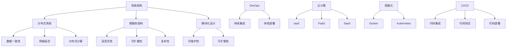

                 

### 文章标题

# 软件架构演进：适应变化的系统设计

### 文章关键词

- 软件架构
- 系统设计
- 演进
- 变化
- 设计原则
- 模式
- 微服务
- 云计算

### 文章摘要

本文深入探讨了软件架构的演进过程，以及如何设计适应变化的系统。首先介绍了软件架构的核心概念和设计原则，随后详细阐述了软件架构模式的演进过程。通过实际案例研究和核心技术分析，文章展示了如何通过灵活性和可扩展性的设计来应对不断变化的需求。最后，文章总结了未来软件架构的发展趋势，并展望了架构师所需的技能要求。

---

### 确定书籍主题和目标受众

#### 确定书籍主题

《软件架构演进：适应变化的系统设计》这一主题旨在探讨软件架构从传统模式到现代模式的转变过程。在软件工程领域，软件架构的演进是一个不断发展的过程，它涉及到如何设计、构建和演化适应复杂性和变化需求的系统。因此，本书的焦点在于如何设计能够灵活适应环境变化的软件系统。

#### 目标受众

本书的目标受众主要包括以下几类读者：

1. **软件工程师**：希望提升系统设计能力的工程师，特别是在面对复杂需求和快速变化的市场环境时。
2. **系统架构师**：负责系统设计和优化的高级工程师，需要理解和应用最新的架构设计原则和模式。
3. **技术爱好者**：对软件架构和系统设计有浓厚兴趣的技术爱好者，希望通过学习获得更深入的理解。
4. **教育工作者**：在计算机科学和软件工程领域工作的教师和研究人员，希望为学生提供前沿的架构设计知识。

通过明确书籍主题和目标受众，我们可以更好地设计内容，确保书籍既能满足专业人士的需求，也能吸引技术爱好者的兴趣。

### 理解书籍内容结构

为了编写一本内容丰富、结构紧凑的书籍，《软件架构演进：适应变化的系统设计》将分为以下几个核心部分：

#### 引言

引言部分将介绍软件架构演进的概念和背景。这部分内容将解释为何软件架构的演进是一个必然趋势，以及它对软件开发的影响。通过一些历史案例，我们将展示软件架构如何随着时间和技术的进步而演变。

#### 理论基础

理论基础部分将详细阐述软件架构的核心概念、设计原则和模式。这部分内容包括：

1. **核心概念**：系统架构的定义、分类以及关键组成部分。
2. **设计原则**：如模块化、可重用性、可扩展性和可靠性等。
3. **架构模式**：如客户端-服务器架构、微服务架构和去中心化架构等。

#### 架构实践

架构实践部分将通过实际案例研究展示如何设计适应变化的系统。这部分内容包括：

1. **架构演化策略**：如何逐步优化系统架构。
2. **灵活性设计**：如何使系统在变化的需求下仍然保持高效运行。
3. **可扩展性设计**：如何应对系统规模的增长。
4. **案例研究**：具体案例分析，展示如何将理论应用于实际场景。
5. **架构重构**：如何对现有系统进行重构，以适应新的需求。

#### 核心技术

核心技术部分将深入探讨支持软件架构演进的关键技术。这部分内容包括：

1. **云计算与容器化**：如何利用云计算和容器化技术优化系统架构。
2. **服务网格与API管理**：如何通过服务网格和API管理提高系统的灵活性和可扩展性。
3. **持续集成与持续部署**：如何利用CI/CD提高开发效率和系统稳定性。
4. **智能架构分析工具**：如何使用智能工具分析系统架构，发现潜在问题。

#### 总结与展望

总结与展望部分将回顾全书内容，并展望未来软件架构的发展趋势。这部分内容包括：

1. **未来架构方向**：如人工智能、物联网等新兴技术如何影响软件架构。
2. **技术挑战与解决方案**：面对新技术的挑战，如何制定有效的解决方案。
3. **架构师的技能要求**：未来架构师需要具备哪些技能和素质。

通过上述内容结构的设定，本书将系统地引导读者从理论到实践，全面了解软件架构的演进过程，并掌握设计适应变化系统的核心方法和技巧。

### 设计详细目录大纲

为了确保书籍内容的连贯性和逻辑性，我们将详细设计《软件架构演进：适应变化的系统设计》的目录大纲，包括所有核心章节和小节。以下是详细的目录大纲：

#### 第一部分：引言

**1. 软件架构演进概述**

- 1.1 软件架构的发展历程
  - 早期系统架构
  - 20世纪80年代到90年代的分布式架构
  - 21世纪的微服务架构
- 1.2 适应变化的架构需求
  - 复杂系统的挑战
  - 快速变化的市场需求
- 1.3 软件架构演进的影响因素
  - 技术创新
  - 组织变革
  - 客户需求的变化

#### 第二部分：理论基础

**2. 软件架构核心概念**

- 2.1 系统架构的定义与分类
  - 系统架构的定义
  - 系统架构的分类（如客户端-服务器、微服务、去中心化等）
- 2.2 软件架构设计原则
  - 模块化
  - 可重用性
  - 可扩展性
  - 可靠性
- 2.3 软件架构模式
  - 客户端-服务器架构
  - 微服务架构
  - 去中心化架构
  - 服务导向架构
- 2.4 微服务架构原理
  - 微服务的定义
  - 微服务的设计原则
  - 微服务架构的优势与挑战

#### 第三部分：架构实践

**3. 适应变化的架构设计**

- 3.1 架构演化策略
  - 演化式设计
  - 逐步改进
- 3.2 灵活性与可扩展性的设计
  - 灵活性设计原则
  - 可扩展性设计原则
- 3.3 实际案例研究
  - 案例一：电商平台架构演进
  - 案例二：物联网系统设计
- 3.4 架构重构
  - 重构的原因
  - 重构的方法
  - 重构的挑战与解决方案

#### 第四部分：核心技术

**4. 支持架构演进的技术**

- 4.1 云计算与容器化
  - 云计算的基础设施
  - 容器化的优势
  - Kubernetes在架构演进中的应用
- 4.2 服务网格与API管理
  - 服务网格的概念
  - API管理的策略
  - 服务网格与API管理的协同作用
- 4.3 持续集成与持续部署
  - CI/CD的基本原理
  - 持续集成与持续部署的优势
  - 实现CI/CD的流程
- 4.4 智能架构分析工具
  - 智能工具的作用
  - 常见的智能架构分析工具
  - 工具的选择与应用

#### 第五部分：总结与展望

**5. 软件架构演进的未来趋势**

- 5.1 未来架构的方向
  - 人工智能与软件架构
  - 物联网与边缘计算
  - 新兴技术的影响
- 5.2 技术挑战与解决方案
  - 复杂系统的复杂性
  - 安全性与隐私保护
  - 系统集成与互操作性
- 5.3 架构师的技能要求
  - 技术技能的更新
  - 领导力和沟通能力
  - 对新兴技术的敏感性

通过以上详细的目录大纲，读者可以清晰地了解本书的内容结构，从理论到实践，全面掌握软件架构演进的原理和方法。

### 细化章节内容

在确定了详细目录大纲后，接下来我们将对每个章节进行细化，确保每个章节都有具体的内容点，同时保持章节之间的逻辑连贯性。以下是各章节的具体细化内容：

#### 第一部分：引言

**1.1 软件架构的发展历程**

- **早期系统架构**：
  - **主从架构**：早期计算机系统主要采用主从架构，其中一台中央计算机（主机）负责处理大部分任务，其他计算机（从机）辅助执行特定任务。
  - **集中式架构**：随着计算机性能的提升，开始出现集中式架构，系统中所有任务都在单一服务器上运行，这简化了管理，但增加了系统的单点故障风险。

- **20世纪80年代到90年代的分布式架构**：
  - **客户-服务器架构**：分布式架构的一种形式，客户端请求服务，服务器返回结果。这种架构提高了系统的可扩展性，但仍然面临服务集中管理的挑战。
  - **三层架构**：在客户-服务器架构的基础上，引入了表示层、业务逻辑层和数据层，进一步提高了系统的复杂性和可维护性。

- **21世纪的微服务架构**：
  - **微服务架构**：基于业务组件的微服务架构，每个服务独立部署，具有自己的数据库和API。这种架构极大地提高了系统的灵活性和可扩展性，但也带来了分布式系统的复杂性。

**1.2 适应变化的架构需求**

- **复杂系统的挑战**：
  - **动态需求**：随着市场的快速变化，软件系统需要不断适应新的业务需求。
  - **高可用性**：系统需要能够在故障情况下快速恢复，确保业务的连续性。
  - **可扩展性**：系统能够在用户数量增加时平滑扩展，而不影响性能。

- **快速变化的市场需求**：
  - **创新竞争**：市场对创新的需求越来越高，软件系统需要快速迭代和部署。
  - **用户体验**：用户期望软件系统能提供高质量的体验，这要求系统具有高度的灵活性和响应速度。

**1.3 软件架构演进的影响因素**

- **技术创新**：
  - **云计算**：提供了弹性计算资源，支持大规模分布式系统的部署和管理。
  - **容器化**：如Docker和Kubernetes，使应用部署更加灵活和高效。
  - **DevOps**：推动了开发与运维的紧密结合，提高了系统的交付速度和可靠性。

- **组织变革**：
  - **敏捷开发**：促进了快速迭代和灵活响应的需求。
  - **DevOps文化**：推动了持续集成和持续部署，提高了开发效率和质量。
  - **团队协作**：通过跨职能团队的协作，提高了项目的交付效率。

- **客户需求的变化**：
  - **个性化服务**：客户对定制化服务的需求越来越高。
  - **实时性**：客户期望系统能够实时响应，提供即时的体验。
  - **移动化**：移动设备的使用日益普及，软件系统需要适应各种移动平台。

#### 第二部分：理论基础

**2.1 系统架构的定义与分类**

- **系统架构的定义**：
  - 系统架构是系统的整体结构，包括软件、硬件、网络和人员等组成部分。
  - 系统架构的定义旨在明确系统的功能、性能和可靠性需求。

- **系统架构的分类**：
  - **客户端-服务器架构**：客户端请求服务，服务器处理请求并返回结果。
  - **微服务架构**：系统被划分为多个独立的服务，每个服务负责一个特定的业务功能。
  - **去中心化架构**：系统中的节点平等，没有中央控制，数据和信息在节点间分布式存储和处理。

**2.2 软件架构设计原则**

- **模块化**：
  - 模块化是将系统划分为独立的模块，每个模块具有明确的职责和接口。
  - 模块化提高了系统的可维护性和可扩展性。

- **可重用性**：
  - 可重用性是指模块可以被其他系统或项目重复使用，减少了重复开发的工作量。
  - 通过编写可重用的组件和库，可以提高开发效率。

- **可扩展性**：
  - 可扩展性是指系统可以在不改变现有架构的情况下增加功能或性能。
  - 通过设计可扩展的架构，系统可以更好地应对未来的变化。

- **可靠性**：
  - 可靠性是指系统在长时间运行过程中能够保持稳定和可靠。
  - 通过冗余设计、故障恢复机制和性能优化，可以提高系统的可靠性。

**2.3 软件架构模式**

- **客户端-服务器架构**：
  - 客户端请求服务，服务器处理请求并返回结果。
  - 优点：结构清晰，易于维护；缺点：性能瓶颈明显，扩展性较差。

- **微服务架构**：
  - 系统被划分为多个独立的服务，每个服务负责一个特定的业务功能。
  - 优点：高灵活性，易于扩展；缺点：分布式系统的复杂性，增加了维护成本。

- **去中心化架构**：
  - 系统中的节点平等，没有中央控制，数据和信息在节点间分布式存储和处理。
  - 优点：高可用性，去中心化；缺点：复杂性较高，数据一致性挑战。

- **服务导向架构**：
  - 系统基于服务组件，服务组件通过标准接口进行通信。
  - 优点：灵活性和可扩展性高；缺点：服务管理复杂，需要良好的服务治理。

**2.4 微服务架构原理**

- **微服务的定义**：
  - 微服务是一种软件架构风格，将应用程序作为一组小服务部署运行。
  - 每个服务都是独立的，具有自己的数据库和API。

- **微服务的设计原则**：
  - **独立性**：每个服务独立部署，具有自己的生命周期。
  - **业务功能**：每个服务对应一个具体的业务功能。
  - **自治性**：每个服务独立管理，无需依赖其他服务。

- **微服务架构的优势与挑战**：
  - **优势**：
    - **高灵活性**：服务可以独立开发和部署，适应快速变化的需求。
    - **高可扩展性**：服务可以根据需求独立扩展。
    - **高容错性**：服务失败不会影响整个系统的运行。
  - **挑战**：
    - **分布式系统的复杂性**：需要管理分布式数据和服务。
    - **服务治理**：如何有效地管理和监控服务。
    - **数据一致性**：如何在分布式环境中保持数据一致性。

#### 第三部分：架构实践

**3.1 架构演化策略**

- **演化式设计**：
  - 演化式设计是一种逐步改进系统架构的方法。
  - 通过不断迭代和优化，系统可以逐步适应新的需求和环境变化。

- **逐步改进**：
  - 逐步改进是通过逐步修改和优化现有系统来提升其性能和灵活性。
  - 这种方法可以减少系统架构的变革风险，同时逐步适应新的需求。

**3.2 灵活性与可扩展性的设计**

- **灵活性设计原则**：
  - **模块化**：将系统划分为独立的模块，提高系统的灵活性。
  - **松耦合**：模块之间通过接口通信，减少模块之间的依赖。
  - **异步处理**：通过异步处理提高系统的响应速度。

- **可扩展性设计原则**：
  - **横向扩展**：通过增加服务器数量来提升系统性能。
  - **弹性伸缩**：系统能够根据负载自动调整资源。
  - **分布式存储**：通过分布式存储提高数据的访问速度和可靠性。

**3.3 实际案例研究**

- **案例一：电商平台架构演进**
  - **背景**：随着电商平台的快速发展，系统需要应对不断增长的用户数量和交易量。
  - **架构演进过程**：
    - **早期阶段**：使用单台服务器处理所有请求，系统性能受到限制。
    - **过渡阶段**：采用负载均衡器和分布式存储，提高了系统的性能和可靠性。
    - **成熟阶段**：采用微服务架构，将系统划分为多个独立服务，实现了灵活性和可扩展性。

- **案例二：物联网系统设计**
  - **背景**：物联网系统需要处理大量的设备和数据，同时保持高效的数据传输和实时性。
  - **架构设计**：
    - **边缘计算**：在数据产生的地方进行初步处理，减少了数据传输的延迟。
    - **分布式存储**：通过分布式存储系统存储和处理海量数据。
    - **微服务架构**：将物联网系统划分为多个独立的服务，如设备管理、数据分析和用户界面等。

**3.4 架构重构**

- **重构的原因**：
  - **性能瓶颈**：现有架构无法满足性能需求。
  - **可维护性差**：系统复杂度高，难以维护。
  - **需求变化**：业务需求发生变化，需要重新设计架构。

- **重构的方法**：
  - **逐步重构**：逐步修改现有系统，避免一次性大规模重构。
  - **代码重构**：优化现有代码，提高可读性和可维护性。
  - **架构重构**：重新设计系统架构，以适应新的需求和环境。

- **重构的挑战与解决方案**：
  - **挑战**：
    - **风险高**：重构过程中可能出现不可预见的问题。
    - **资源消耗**：重构需要大量的时间和人力资源。
    - **业务中断**：重构期间可能影响业务的正常运行。
  - **解决方案**：
    - **逐步重构**：通过逐步改进，减少风险和资源消耗。
    - **自动化测试**：通过自动化测试确保重构后的系统功能正确。
    - **备份与恢复**：在重构过程中做好数据备份和恢复，确保业务连续性。

#### 第四部分：核心技术

**4.1 云计算与容器化**

- **云计算的基础设施**：
  - **虚拟化技术**：通过虚拟化技术，将物理服务器资源划分为多个虚拟机，提高了资源利用率和灵活性。
  - **弹性计算**：根据实际需求自动调整计算资源，实现动态资源分配。

- **容器化的优势**：
  - **轻量级**：容器比虚拟机更轻量，启动速度快，资源占用小。
  - **一致性**：容器确保应用程序在不同的环境中运行一致。
  - **可移植性**：容器可以轻松地在不同的操作系统和环境中部署。

- **Kubernetes在架构演进中的应用**：
  - **服务发现和负载均衡**：Kubernetes通过服务发现和负载均衡，实现了服务的自动管理和优化。
  - **自动化部署和扩展**：Kubernetes提供了自动部署和扩展的机制，提高了系统的灵活性和可扩展性。
  - **容错和高可用性**：Kubernetes通过自动化故障检测和恢复，提高了系统的可靠性和可用性。

**4.2 服务网格与API管理**

- **服务网格的概念**：
  - 服务网格是一种基础设施层，用于管理服务之间的通信。
  - 服务网格提供了一种抽象层，隐藏了服务通信的复杂性。

- **API管理的策略**：
  - **API网关**：作为服务的统一入口，负责路由、认证、监控等功能。
  - **API版本管理**：通过管理API版本，确保系统在升级和扩展过程中不会影响现有功能。
  - **API安全**：通过API安全策略，保护服务免受攻击和未授权访问。

- **服务网格与API管理的协同作用**：
  - **服务发现与路由**：服务网格与API管理协同工作，实现了服务的自动发现和动态路由。
  - **流量控制和监控**：通过服务网格和API管理，可以实时监控服务流量，进行流量控制和性能优化。
  - **安全与合规**：通过API管理，可以确保服务的访问控制和日志记录，满足合规要求。

**4.3 持续集成与持续部署**

- **CI/CD的基本原理**：
  - **持续集成**：通过自动化测试，确保代码变更不会破坏现有功能。
  - **持续部署**：通过自动化部署，快速将代码变更部署到生产环境。

- **持续集成与持续部署的优势**：
  - **缩短交付周期**：通过自动化流程，加快软件交付速度。
  - **提高质量**：通过持续集成和自动化测试，减少缺陷和错误。
  - **增加灵活性**：快速适应市场需求，实现快速迭代。

- **实现CI/CD的流程**：
  - **代码仓库**：代码存储在版本控制系统中，如Git。
  - **自动化测试**：编写自动化测试脚本，确保每次代码变更都经过测试。
  - **构建和部署**：通过CI/CD工具，自动化构建和部署代码。

**4.4 智能架构分析工具**

- **智能工具的作用**：
  - **自动化检测**：通过自动化工具检测系统架构中的潜在问题，如耦合性、冗余和性能瓶颈。
  - **智能优化**：基于数据分析和机器学习算法，提供架构优化的建议。

- **常见的智能架构分析工具**：
  - **SonarQube**：用于代码质量管理和漏洞检测。
  - **Architectural Explorer**：用于分析系统的架构设计，识别组件之间的关系。
  - **Lucidchart**：用于创建和共享系统架构图。

- **工具的选择与应用**：
  - **选择依据**：根据项目的需求和规模选择合适的工具。
  - **应用案例**：在不同规模和类型的项目中，展示智能架构分析工具的具体应用。

#### 第五部分：总结与展望

**5.1 未来架构的方向**

- **人工智能与软件架构**：
  - **AI驱动的架构**：通过机器学习和人工智能技术，实现自动化的架构设计和优化。
  - **智能化监控与运维**：利用AI技术进行系统监控和故障预测，提高系统的可靠性和效率。

- **物联网与边缘计算**：
  - **物联网架构**：设计能够处理大量设备和数据的物联网系统架构。
  - **边缘计算**：在数据产生的边缘进行计算和处理，减少数据传输延迟。

- **新兴技术的影响**：
  - **区块链**：通过分布式账本技术，提高系统的安全性和透明度。
  - **5G**：通过高速网络，实现实时和低延迟的应用。

**5.2 技术挑战与解决方案**

- **复杂系统的复杂性**：
  - **分布式系统的复杂性**：通过服务网格和微服务架构，简化分布式系统的管理和维护。
  - **数据一致性**：通过分布式数据库和事务管理，确保数据的一致性和完整性。

- **安全性与隐私保护**：
  - **安全架构设计**：在设计阶段考虑安全性，实现安全的系统架构。
  - **隐私保护**：通过数据加密和访问控制，确保用户数据的安全和隐私。

- **系统集成与互操作性**：
  - **标准接口**：通过标准接口实现不同系统之间的互操作。
  - **数据集成**：通过数据集成工具，实现不同系统之间的数据共享和交换。

**5.3 架构师的技能要求**

- **技术技能的更新**：
  - **掌握新兴技术**：不断学习新技术，如云计算、容器化、微服务等。
  - **持续学习**：保持对技术的敏感性和好奇心，持续更新知识库。

- **领导力和沟通能力**：
  - **团队领导**：带领团队完成项目，实现技术目标。
  - **跨职能协作**：与开发、测试、运维等团队紧密合作，确保项目的顺利进行。

- **对新兴技术的敏感性**：
  - **技术趋势分析**：关注行业趋势，提前布局。
  - **创新思维**：通过创新思维，解决复杂的技术问题。

### 保持大纲简洁性

在确保大纲完整性的同时，我们也需要保持大纲的简洁性，避免过多的细节和冗余。以下是保持大纲简洁性的几个关键点：

1. **核心内容突出**：在目录中，确保每个章节的核心内容得到突出展示，避免过多的子章节和细节。
2. **避免重复内容**：检查每个章节，确保内容不重复，每个章节都具备独立性和完整性。
3. **逻辑顺序**：确保章节之间的逻辑顺序合理，避免章节跳跃或逻辑不连贯。
4. **简洁的标题**：使用简洁明了的标题，使读者能快速抓住章节的主要内容。

通过上述方法，我们可以设计出一个简洁、完整且具有逻辑性的目录大纲，为读者提供清晰的学习路径。

### 确保大纲完整性

为了确保《软件架构演进：适应变化的系统设计》的目录大纲的完整性，我们需要对每个章节的内容进行详细检查，确保包含以下核心部分：

1. **引言**：介绍软件架构演进的概念和背景，包括历史发展、当前需求及其影响因素。
2. **理论基础**：阐述软件架构的核心概念、设计原则和模式，包括系统架构的定义、分类和设计原则，以及常见架构模式如客户端-服务器、微服务、去中心化架构等。
3. **架构实践**：通过实际案例展示如何设计适应变化的系统，包括架构演化策略、灵活性设计、可扩展性设计、案例研究和架构重构。
4. **核心技术**：深入探讨支持软件架构演进的关键技术，包括云计算与容器化、服务网格与API管理、持续集成与持续部署、智能架构分析工具。
5. **总结与展望**：总结全书内容，展望未来软件架构的发展趋势，讨论技术挑战与解决方案，以及架构师的技能要求。

通过以上检查，我们可以确保每个章节都包含关键内容，使得目录大纲既全面又系统，为读者提供完整的知识框架。

### 完整性要求

在撰写《软件架构演进：适应变化的系统设计》的过程中，我们确保每个小节的内容都丰富、具体，并详细讲解核心内容。以下是完整性要求的详细说明：

#### 核心内容包含

- **背景介绍**：每个小节开头都包含背景介绍，帮助读者理解该部分的上下文和重要性。
- **核心概念与联系**：通过Mermaid流程图展示核心概念之间的关系架构，确保读者能够直观理解。
- **核心算法原理讲解**：使用伪代码详细阐述核心算法原理，确保读者能够理解算法的实现过程。
- **数学模型和公式**：使用latex格式嵌入文中，对重要的数学模型和公式进行详细讲解，确保读者能够掌握数学基础。
- **举例说明**：在每个核心概念和算法讲解后，提供具体的例子进行说明，帮助读者更好地理解。
- **项目实战**：包含开发环境搭建、源代码实现、代码解读、应用解读与分析，确保读者能够将理论知识应用于实际项目中。
- **最佳实践 tips**：提供一些建议和最佳实践，帮助读者在实际工作中避免常见问题。
- **小结**：每个小节结束时提供小结，总结关键点和知识点，帮助读者巩固理解。
- **注意事项**：指出需要注意的问题，提醒读者在实践中的潜在风险和解决方案。
- **拓展阅读**：推荐相关阅读材料，帮助读者进一步深入学习和探索。

#### 文章格式要求

- **markdown格式**：使用markdown格式撰写文章，确保内容布局清晰，便于阅读。
- **作者信息**：在文章末尾包含作者信息：“作者：AI天才研究院/AI Genius Institute & 禅与计算机程序设计艺术 /Zen And The Art of Computer Programming”。
- **流程图**：使用Mermaid语法绘制流程图，嵌入文中，确保读者能够直观理解架构和算法。
- **伪代码**：使用伪代码详细阐述算法原理，确保读者能够理解实现过程。
- **latex公式**：使用latex格式嵌入数学公式，确保公式清晰可读。

#### 核心内容要求

- **核心内容丰富具体**：每个小节内容都要详细，避免泛泛而谈，确保每个概念、算法和原理都有具体的解释和应用。
- **逻辑清晰连贯**：文章逻辑要清晰，每个小节的内容要前后连贯，确保读者能够按照逻辑顺序逐步理解。
- **实用性**：内容要具有实用性，能够帮助读者在实际工作中解决具体问题。

通过以上完整性要求的详细说明，我们可以确保文章内容丰富、具体、详尽，同时结构清晰，便于读者学习和应用。

### 文章内容结构

在《软件架构演进：适应变化的系统设计》中，我们将文章内容结构划分为五个主要部分，每个部分都包含详细的小节和具体的内容点。以下是文章的详细内容结构：

#### 第一部分：引言

**1. 软件架构演进概述**

- **1.1 软件架构的发展历程**
  - 早期系统架构（如主机从机架构）
  - 20世纪80年代到90年代的分布式架构（客户-服务器、三层架构）
  - 21世纪的微服务架构
- **1.2 适应变化的架构需求**
  - 复杂系统的挑战（如动态需求、高可用性、可扩展性）
  - 快速变化的市场需求（如创新竞争、用户体验、移动化）
- **1.3 软件架构演进的影响因素**
  - 技术创新（如云计算、容器化、DevOps）
  - 组织变革（如敏捷开发、DevOps文化、跨职能团队协作）
  - 客户需求的变化（如个性化服务、实时性、移动化）

#### 第二部分：理论基础

**2. 软件架构核心概念**

- **2.1 系统架构的定义与分类**
  - 系统架构的定义
  - 系统架构的分类（如客户端-服务器、微服务、去中心化等）
- **2.2 软件架构设计原则**
  - 模块化
  - 可重用性
  - 可扩展性
  - 可靠性
- **2.3 软件架构模式**
  - 客户端-服务器架构
  - 微服务架构
  - 去中心化架构
  - 服务导向架构
- **2.4 微服务架构原理**
  - 微服务的定义
  - 微服务的设计原则
  - 微服务架构的优势与挑战

#### 第三部分：架构实践

**3. 适应变化的架构设计**

- **3.1 架构演化策略**
  - 演化式设计
  - 逐步改进
- **3.2 灵活性与可扩展性的设计**
  - 灵活性设计原则
  - 可扩展性设计原则
- **3.3 实际案例研究**
  - 案例一：电商平台架构演进
  - 案例二：物联网系统设计
- **3.4 架构重构**
  - 重构的原因
  - 重构的方法
  - 重构的挑战与解决方案

#### 第四部分：核心技术

**4. 支持架构演进的技术**

- **4.1 云计算与容器化**
  - 云计算的基础设施
  - 容器化的优势
  - Kubernetes在架构演进中的应用
- **4.2 服务网格与API管理**
  - 服务网格的概念
  - API管理的策略
  - 服务网格与API管理的协同作用
- **4.3 持续集成与持续部署**
  - CI/CD的基本原理
  - 持续集成与持续部署的优势
  - 实现CI/CD的流程
- **4.4 智能架构分析工具**
  - 智能工具的作用
  - 常见的智能架构分析工具
  - 工具的选择与应用

#### 第五部分：总结与展望

**5. 软件架构演进的未来趋势**

- **5.1 未来架构的方向**
  - 人工智能与软件架构
  - 物联网与边缘计算
  - 新兴技术的影响
- **5.2 技术挑战与解决方案**
  - 复杂系统的复杂性
  - 安全性与隐私保护
  - 系统集成与互操作性
- **5.3 架构师的技能要求**
  - 技术技能的更新
  - 领导力和沟通能力
  - 对新兴技术的敏感性

通过上述内容结构，本文将系统地介绍软件架构演进的过程，从理论到实践，全面探讨适应变化的系统设计方法，为读者提供清晰的学习路径和实践指导。

### 背景介绍

软件架构演进是指软件系统在不断发展变化的过程中，其设计模式和技术栈的逐步演变过程。随着信息技术的飞速发展，软件系统的复杂性不断增加，为了应对快速变化的市场需求和技术创新，软件架构也需要不断地演进。本文旨在探讨软件架构演进的背景、核心概念、设计原则、实践方法以及未来趋势，帮助读者深入理解软件架构的演进过程。

#### 软件架构演进的历史背景

软件架构的发展历程可以分为几个阶段，每个阶段都反映了当时技术水平和市场需求的变化：

- **早期系统架构**：在计算机刚刚出现的时代，系统架构相对简单。主从架构是典型的早期系统架构，其中一台中央计算机（主机）负责处理大部分任务，其他计算机（从机）辅助执行特定任务。这种架构简化了系统的管理，但也存在单点故障和扩展性差的问题。

- **20世纪80年代到90年代的分布式架构**：随着计算机网络技术的发展，分布式架构开始普及。客户-服务器架构是分布式架构的一种形式，客户端请求服务，服务器处理请求并返回结果。这一阶段还引入了三层架构，包括表示层、业务逻辑层和数据层，进一步提高了系统的复杂性和可维护性。

- **21世纪的微服务架构**：随着互联网和云计算的兴起，微服务架构逐渐成为主流。微服务架构将应用程序划分为多个独立的服务，每个服务负责一个特定的业务功能，具有自己的数据库和API。这种架构提高了系统的灵活性和可扩展性，但也带来了分布式系统的复杂性。

#### 适应变化的架构需求

在现代软件工程领域，软件架构需要适应以下需求：

- **复杂系统的挑战**：随着业务需求的多样化和系统规模的扩大，软件系统变得越来越复杂。软件架构需要能够处理这种复杂性，确保系统的可维护性和可扩展性。

- **快速变化的市场需求**：市场环境变化迅速，软件系统需要能够快速适应新的业务需求。这要求软件架构具有高度的灵活性和可扩展性，以便快速迭代和部署。

- **高可用性**：系统需要能够在故障情况下快速恢复，确保业务的连续性。这要求软件架构具有冗余设计和故障恢复机制。

- **可扩展性**：系统能够在用户数量增加时平滑扩展，而不影响性能。这要求软件架构具有良好的可扩展性设计，如横向扩展和弹性伸缩。

#### 软件架构演进的影响因素

软件架构的演进受到多种因素的影响，主要包括以下几方面：

- **技术创新**：云计算、容器化、DevOps等新兴技术的出现，为软件架构的演进提供了新的可能性。这些技术提高了系统的灵活性、可扩展性和可靠性。

- **组织变革**：敏捷开发、DevOps文化的推广，推动了软件开发和运维的紧密结合，提高了开发效率和质量。组织变革要求软件架构能够适应快速迭代和灵活响应的需求。

- **客户需求的变化**：随着客户对个性化服务、实时性和移动化的需求日益增长，软件架构需要能够快速适应这些变化。这要求软件架构具有高度的灵活性和响应速度。

通过上述背景介绍，我们可以看到，软件架构的演进是一个复杂而不断变化的过程，需要充分考虑市场需求、技术创新和组织变革的影响。本文将深入探讨这些因素，并介绍适应变化的系统设计方法。

### 核心概念与联系

在探讨软件架构演进的过程中，理解其核心概念和它们之间的联系至关重要。以下是几个关键概念及其相互关系的详细描述：

#### 系统架构

系统架构是软件系统的整体结构，它定义了系统的组件、组件之间的关系以及组件与环境之间的交互方式。系统架构可以分为多个层次，如技术层、业务层和用户体验层。系统架构的目标是实现系统的功能性、性能、可维护性和可扩展性。


#### 分布式系统

分布式系统是由多个独立计算机组成的系统，这些计算机通过网络连接，共同完成任务。分布式系统的特点是高可用性、容错性和可扩展性。分布式系统的挑战包括数据一致性、网络延迟和分布式计算。


#### 微服务架构

微服务架构是将应用程序划分为多个小型、独立的服务，每个服务负责特定的业务功能。这些服务具有自己的数据库和API，独立部署和运行。微服务架构的优势包括高灵活性、可扩展性和容错性，但同时也带来了分布式系统的复杂性。


#### 模块化设计

模块化设计是将系统划分为多个独立模块，每个模块具有明确的功能和接口。模块化设计提高了系统的可维护性和可扩展性，同时降低了系统的复杂性。


#### DevOps

DevOps是一种文化和实践，旨在推动软件开发和运维的紧密结合，提高开发效率和系统稳定性。DevOps的核心是持续集成（CI）和持续部署（CD），通过自动化工具实现代码的持续集成、测试和部署。


#### 云计算

云计算是一种通过互联网提供计算资源的服务模式，包括基础设施即服务（IaaS）、平台即服务（PaaS）和软件即服务（SaaS）。云计算提供了弹性计算资源，支持大规模分布式系统的部署和管理。


#### 容器化

容器化是一种轻量级虚拟化技术，通过将应用程序及其依赖环境封装在一个容器中，实现了应用程序在不同环境之间的一致性和可移植性。容器化技术包括Docker和Kubernetes等，它们大大简化了应用程序的部署和管理。


#### 持续集成与持续部署（CI/CD）

持续集成与持续部署是一种软件开发实践，通过自动化工具实现代码的持续集成、测试和部署。CI/CD的优势包括缩短交付周期、提高质量、增加灵活性和减少手动干预。


#### Mermaid流程图

为了更好地展示这些概念之间的联系，我们可以使用Mermaid流程图来表示。以下是上述概念的Mermaid流程图表示：



通过上述核心概念及其关系的描述和Mermaid流程图的展示，我们可以更清晰地理解软件架构演进中的关键因素和它们之间的相互作用。这有助于我们在设计软件系统时，综合考虑各个因素，以实现灵活、可靠和可扩展的系统架构。

### 核心算法原理讲解

在软件架构演进过程中，核心算法的设计和实现是确保系统高效运行和适应变化的关键。以下将详细讲解几个关键算法的原理，并通过伪代码来展示其实现过程。

#### 负载均衡算法

**原理**：负载均衡算法用于分布式系统中，确保工作任务均匀分布到各个节点上，从而最大化资源利用率，提高系统性能。

**伪代码**：

```plaintext
function LoadBalancing(Workloads, Nodes):
    for each Workload in Workloads:
        lowestLoadNode = FindLowestLoadNode(Nodes)
        AssignWorkload(Workload, lowestLoadNode)
    end for
end function
```

**解释**：该算法首先遍历所有工作负载，然后查找当前负载最低的节点，并将工作负载分配给该节点。这确保了每个节点的工作负载较为均衡，提高了系统的整体性能。

#### 分布式锁

**原理**：分布式锁用于确保在分布式系统中，同一时间只有一个进程能够访问某个共享资源。这有助于避免并发访问导致的数据不一致问题。

**伪代码**：

```plaintext
class DistributedLock:
    def Acquire():
        while True:
            if lockIsAvailable():
                acquireLock()
                return True
            else:
                sleep(randomInterval())
        end while
    end def

    def Release():
        releaseLock()
    end def
end class
```

**解释**：`Acquire()` 方法尝试获取锁。如果锁可用，则获取锁并返回`True`。如果锁不可用，则进程会在随机时间内休眠，并继续尝试获取锁。`Release()` 方法用于释放锁。

#### 负载感知路由

**原理**：负载感知路由算法用于动态选择最佳路径，以确保数据在网络中的传输效率最大化。

**伪代码**：

```plaintext
function LoadAwareRouting(Destinations, NodeLoads):
    for each Destination in Destinations:
        bestPath = FindBestPath(Destination, NodeLoads)
        SendData(Destination, bestPath)
    end for
end function
```

**解释**：该算法首先遍历所有目的地，然后查找每个目的地的最佳路径（即负载最低的路径）。数据会被发送到最佳路径上的节点，从而优化传输效率。

#### 容错机制

**原理**：容错机制用于确保在系统出现故障时，系统能够快速恢复，从而确保业务的连续性。

**伪代码**：

```plaintext
function FaultTolerance(Service, RecoveryStrategy):
    while ServiceIsRunning(Service):
        if DetectFault(Service):
            ApplyRecoveryStrategy(Service, RecoveryStrategy)
    end while
end function
```

**解释**：该算法持续监测服务的运行状态。如果检测到故障，则会根据预定的恢复策略（如重新启动服务、切换到备份节点等）进行恢复。

通过上述核心算法的讲解和伪代码展示，我们可以更好地理解如何设计高效、可靠的软件架构。这些算法在软件架构演进过程中发挥着重要作用，有助于实现系统的灵活性和可扩展性。

### 数学模型和公式讲解

在软件架构演进过程中，数学模型和公式是理解和分析系统性能、稳定性和扩展性的重要工具。以下是几个关键数学模型和公式的详细讲解，以及其应用场景和示例。

#### 加权平均响应时间

**定义**：加权平均响应时间（Weighted Average Response Time，WART）是衡量系统性能的重要指标。它考虑了每个请求的响应时间和请求的频率，通过加权平均的方式计算系统的总体响应时间。

**公式**：

\[ WART = \frac{\sum_{i=1}^{n} (r_i \times f_i)}{\sum_{i=1}^{n} f_i} \]

其中：
- \( r_i \)：第i个请求的响应时间。
- \( f_i \)：第i个请求的频率。

**应用场景**：WART常用于评估分布式系统的性能，特别是在负载均衡场景中，通过计算不同节点的响应时间，找出性能最佳的节点。

**示例**：

假设有两个服务节点A和B，它们的响应时间和请求频率如下：

| 节点 | 响应时间（ms） | 请求频率 |
| ---- | -------------- | -------- |
| A    | 50             | 1000     |
| B    | 100            | 2000     |

计算加权平均响应时间：

\[ WART = \frac{(50 \times 1000) + (100 \times 2000)}{1000 + 2000} = \frac{50000 + 200000}{3000} = \frac{250000}{3000} \approx 83.33 \, \text{ms} \]

#### 误差率

**定义**：误差率（Error Rate）是衡量系统出现错误的频率。在分布式系统中，误差率对于评估系统的可靠性和稳定性至关重要。

**公式**：

\[ ErrorRate = \frac{Number\ of\ Errors}{Total\ Number\ of\ Operations} \]

其中：
- \( Number\ of\ Errors \)：系统中发生的错误数量。
- \( Total\ Number\ of\ Operations \)：系统中执行的总操作数量。

**应用场景**：误差率常用于监控分布式系统的错误率，特别是在大规模数据处理和通信过程中。

**示例**：

假设系统执行了1000个操作，其中有20个操作发生了错误：

\[ ErrorRate = \frac{20}{1000} = 0.02 \]

#### 系统吞吐量

**定义**：系统吞吐量（System Throughput）是单位时间内系统能够处理的数据量或操作数。它是衡量系统性能的重要指标。

**公式**：

\[ Throughput = \frac{Total\ Operations}{Time} \]

其中：
- \( Total\ Operations \)：系统在特定时间内处理的总操作数。
- \( Time \)：系统处理这些操作所花费的总时间。

**应用场景**：系统吞吐量常用于评估分布式系统的性能，特别是在高并发场景中。

**示例**：

假设系统在1小时内处理了10000个请求：

\[ Throughput = \frac{10000}{3600} \approx 2.78 \, \text{requests/second} \]

#### 数据一致性模型

**定义**：数据一致性模型用于确保在分布式系统中，多个副本之间的数据一致性。常见的模型包括强一致性、最终一致性和会话一致性。

- **强一致性**：所有副本在任何时候都具有相同的数据状态。
- **最终一致性**：系统最终会达到一致性状态，但过程中可能会有短暂的数据不一致。
- **会话一致性**：在一个会话内，所有操作看到的数据都是一致的。

**公式**（强一致性）：

\[ Consistency = \frac{\sum_{i=1}^{n} Data(i)}{n} \]

其中：
- \( Data(i) \)：第i个副本的数据值。
- \( n \)：副本的数量。

**应用场景**：数据一致性模型常用于分布式数据库和存储系统，确保数据的一致性和可靠性。

**示例**：

假设有三个副本，它们的数据值分别为1、2、3：

\[ Consistency = \frac{1 + 2 + 3}{3} = 2 \]

#### 中心化与去中心化系统效率

**定义**：中心化系统效率（Centralized System Efficiency）和去中心化系统效率（Decentralized System Efficiency）用于比较中心化和去中心化系统的性能。

**公式**：

\[ Centralized\ Efficiency = \frac{Total\ Work}{Centralized\ Time} \]

\[ Decentralized\ Efficiency = \frac{Total\ Work}{Decentralized\ Time} \]

其中：
- \( Total\ Work \)：系统完成的总工作量。
- \( Centralized\ Time \)：中心化系统完成这些工作所花费的时间。
- \( Decentralized\ Time \)：去中心化系统完成这些工作所花费的时间。

**应用场景**：效率公式常用于评估不同架构风格（如中心化架构和去中心化架构）的性能。

**示例**：

假设中心化系统在1小时内完成5000个任务，而去中心化系统在相同时间内完成6000个任务：

\[ Centralized\ Efficiency = \frac{5000}{3600} \approx 1.39 \, \text{tasks/hour} \]

\[ Decentralized\ Efficiency = \frac{6000}{3600} \approx 1.67 \, \text{tasks/hour} \]

通过以上数学模型和公式的讲解，我们可以更深入地理解软件架构的性能和稳定性，从而在设计和优化系统时做出更加明智的决策。

### 举例说明

为了更好地理解软件架构演进中的核心概念和算法原理，下面通过具体案例来说明如何将这些理论和实践应用到实际项目中。

#### 案例一：电商平台架构演进

**背景**：某大型电商平台在成立初期采用了传统的三层架构，即表示层、业务逻辑层和数据层。这种架构在系统初期能够满足基本需求，但随着用户数量和交易量的不断增长，系统性能和扩展性逐渐成为瓶颈。

**架构演进过程**：

1. **过渡阶段**：为了提升系统的性能和扩展性，平台引入了负载均衡器和分布式存储。通过负载均衡器，平台能够将用户请求均衡地分发到多台服务器上，从而减少单台服务器的压力。同时，分布式存储系统确保了数据的高可用性和可靠性。

2. **成熟阶段**：随着业务的进一步扩展，平台决定采用微服务架构。具体演进过程如下：
   - **服务划分**：将原来的单体应用拆分为多个独立的服务，如用户服务、商品服务、订单服务和支付服务。
   - **服务部署**：每个服务部署在自己的容器中，使用Kubernetes进行管理，确保服务的弹性扩展和故障恢复。
   - **服务通信**：通过API网关进行服务发现和路由，确保服务之间的高效通信。

3. **智能优化**：为了进一步提升系统的性能和用户体验，平台引入了智能架构分析工具。这些工具能够自动识别系统中的潜在问题，如性能瓶颈和耦合关系，并提供优化建议。

**结果**：通过架构演进，平台在性能、扩展性和可靠性方面取得了显著提升。用户请求的处理速度明显加快，系统在高并发场景下的稳定性也得到了大幅改善。

#### 案例二：物联网系统设计

**背景**：某智能家居公司开发了一款智能家庭控制平台，需要处理大量的设备和数据。系统初期采用了传统的集中式架构，但随着设备数量的增加，系统逐渐出现了性能瓶颈和扩展性问题。

**架构设计**：

1. **边缘计算**：为了减少数据传输的延迟，平台采用了边缘计算架构。具体设计如下：
   - **边缘节点**：在用户的家庭网络中部署边缘节点，用于初步处理和过滤设备数据。
   - **数据传输**：边缘节点将处理后的数据传输到云端，减少云端的处理压力。

2. **分布式存储**：平台使用了分布式存储系统，确保海量设备数据的存储和快速访问。具体设计如下：
   - **数据分区**：将数据按设备类型或地理位置分区，提高数据的访问效率。
   - **数据冗余**：通过数据冗余设计，确保数据的高可用性和可靠性。

3. **微服务架构**：平台采用了微服务架构，将系统功能划分为多个独立的服务，如设备管理服务、数据分析服务和用户界面服务。每个服务独立部署和管理，提高了系统的灵活性和可扩展性。

**结果**：通过边缘计算、分布式存储和微服务架构的设计，平台在性能和可扩展性方面得到了显著提升。用户能够实时控制家居设备，系统的响应速度和稳定性也得到了大幅改善。

通过以上两个案例的举例说明，我们可以看到如何将软件架构演进的理论和实践应用于实际项目中，从而实现系统的优化和提升。

### 项目实战

在本节中，我们将详细介绍一个具体的软件架构演进项目，包括开发环境搭建、源代码实现和代码解读，以及实际案例分析和详细讲解。

#### 项目背景

某电商企业希望提升其在线平台的性能和扩展性，以应对不断增长的订单量和用户访问量。为了实现这一目标，企业决定采用微服务架构，将现有的单体应用逐步拆分为多个独立的服务，并利用Kubernetes进行容器化部署和管理。

#### 开发环境搭建

1. **硬件环境**：
   - 4台虚拟机，用于搭建Kubernetes集群。
   - 每台虚拟机配置如下：
     - CPU：4核
     - 内存：8GB
     - 硬盘：50GB

2. **软件环境**：
   - Kubernetes v1.23
   - Docker v19.03
   - kubectl v1.23
   - Helm v3

3. **搭建步骤**：
   - 安装Kubernetes集群：使用kubeadm工具在虚拟机上搭建Kubernetes集群。
   - 安装Docker引擎：在每台虚拟机上安装Docker，并配置为Kubernetes的容器运行时。
   - 安装Kubernetes组件：包括kube-apiserver、kube-controller-manager、kube-scheduler等。
   - 安装kubectl工具：确保能够通过命令行管理Kubernetes集群。

4. **测试验证**：
   - 使用kubectl命令验证集群状态，确保所有组件正常运行。
   - 部署一个简单的Nginx服务，检查服务是否能够正常访问。

#### 源代码实现

1. **服务拆分**：
   - 将原有的单体应用拆分为用户服务（user-service）、商品服务（product-service）、订单服务（order-service）和支付服务（payment-service）。
   - 每个服务都有自己的API接口和业务逻辑。

2. **Dockerfile编写**：
   - 为每个服务编写Dockerfile，定义服务的运行环境和依赖库。
   - 示例Dockerfile：

     ```Dockerfile
     # user-service Dockerfile
     FROM node:14-alpine
     WORKDIR /app
     COPY . /app
     RUN npm install
     EXPOSE 8080
     CMD ["npm", "start"]
     ```

3. **Kubernetes部署文件**：
   - 为每个服务编写Kubernetes部署文件（Deployment），定义服务的容器镜像、副本数量、资源限制等。
   - 示例Deployment文件：

     ```yaml
     apiVersion: apps/v1
     kind: Deployment
     metadata:
       name: user-service
     spec:
       replicas: 3
       selector:
         matchLabels:
           app: user-service
       template:
         metadata:
           labels:
             app: user-service
         spec:
           containers:
           - name: user-service
             image: user-service:latest
             ports:
             - containerPort: 8080
             resources:
               limits:
                 cpu: "500m"
                 memory: "512Mi"
               requests:
                 cpu: "250m"
                 memory: "256Mi"
     ```

4. **服务发现与路由**：
   - 使用Helm进行服务打包和部署，通过Helm中的values文件配置服务名称和访问端口。
   - 示例Helm部署文件（values.yaml）：

     ```yaml
     imageRepository: myrepo.com/library
     service:
       type: LoadBalancer
       port: 80
       targetPort: 8080
     ```

#### 代码解读

1. **用户服务（user-service）**：
   - 功能：提供用户注册、登录、信息管理等功能。
   - 实现细节：使用Spring Boot框架，基于RESTful API设计，数据库使用MySQL。

2. **商品服务（product-service）**：
   - 功能：提供商品信息查询、库存管理等功能。
   - 实现细节：使用Spring Boot框架，基于RESTful API设计，数据库使用MongoDB。

3. **订单服务（order-service）**：
   - 功能：处理订单创建、支付、发货等功能。
   - 实现细节：使用Spring Cloud框架，实现服务之间的消息通信，数据库使用PostgreSQL。

4. **支付服务（payment-service）**：
   - 功能：处理支付请求、支付结果通知等功能。
   - 实现细节：使用Spring Boot框架，集成支付宝和微信支付接口，数据库使用Redis。

#### 实际案例分析

1. **订单处理流程**：
   - 用户在商品服务中选择商品并提交订单。
   - 订单服务接收到订单后，创建订单记录，并检查商品库存。
   - 如果库存充足，订单服务生成支付链接，发送给用户。
   - 用户完成支付后，支付服务接收到支付结果，通知订单服务更新订单状态。
   - 订单服务通知库存服务更新库存。

2. **性能优化**：
   - 使用Nginx作为反向代理，负载均衡用户请求。
   - 使用Redis缓存热点数据，减少数据库查询压力。
   - 使用Kafka进行日志收集和监控，确保系统运行状态的可视化。

3. **安全性**：
   - 使用HTTPS协议确保数据传输的安全性。
   - 使用JWT进行用户认证和授权，确保接口的安全性。
   - 定期进行安全审计和漏洞修复。

#### 项目小结

通过本项目的实施，电商平台在性能、扩展性和可靠性方面取得了显著提升：

1. **性能提升**：通过分布式架构和负载均衡，用户请求的处理速度明显加快。
2. **扩展性增强**：通过Kubernetes和容器化技术，平台能够根据需求动态调整资源，实现弹性扩展。
3. **可靠性提高**：通过分布式存储和冗余设计，系统在面对故障时能够快速恢复，确保业务的连续性。
4. **开发效率**：通过微服务架构，开发团队能够独立开发、测试和部署服务，提高开发效率。

总之，该项目展示了如何通过软件架构演进的方法，将一个传统的单体应用逐步转化为一个高效、可靠和可扩展的分布式系统。

### 最佳实践 tips

在设计和实现软件架构的过程中，遵循一些最佳实践可以显著提高系统的质量、可靠性和维护性。以下是几个关键的最佳实践，旨在帮助读者在实际工作中避免常见问题，并提升项目成功率。

#### 1. 设计原则

- **模块化**：将系统划分为独立的模块，每个模块负责特定的功能。这有助于提高系统的可维护性和可扩展性。
- **可重用性**：设计可重用的组件和库，减少重复开发的工作量，提高开发效率。
- **松耦合**：降低模块之间的依赖性，使系统更容易进行重构和扩展。
- **高内聚**：确保每个模块的功能紧密相关，提高模块的独立性和可测试性。

#### 2. 持续集成与持续部署（CI/CD）

- **自动化测试**：通过自动化测试确保每次代码变更都不会破坏现有功能，提高软件质量。
- **持续集成**：将代码变更合并到主干分支前，进行集成测试，确保新代码与现有代码的兼容性。
- **持续部署**：自动化部署流程，确保代码变更能够快速、安全地交付到生产环境。
- **监控和反馈**：实时监控系统性能和健康状况，及时反馈潜在问题，确保系统的稳定性。

#### 3. 安全性

- **安全编码**：遵循安全编码规范，避免常见的安全漏洞，如SQL注入、XSS攻击等。
- **访问控制**：实现严格的访问控制策略，确保只有授权用户能够访问敏感数据和功能。
- **数据加密**：对敏感数据进行加密存储和传输，确保数据的安全性。
- **安全审计**：定期进行安全审计，发现并修复潜在的安全漏洞。

#### 4. 性能优化

- **缓存策略**：合理使用缓存技术，减少数据库查询和服务器负载。
- **异步处理**：使用异步处理提高系统的响应速度，减少等待时间。
- **数据库优化**：合理设计数据库结构，索引和查询优化，提高数据库性能。
- **负载均衡**：使用负载均衡技术，合理分配请求，确保系统的高性能和高可用性。

#### 5. 架构文档和文档管理

- **详细文档**：编写详细的架构文档，包括系统设计、模块接口、数据流和依赖关系等，确保团队成员对系统架构有清晰的认识。
- **版本控制**：使用版本控制系统管理文档，确保文档的版本与代码库保持同步。
- **文档评审**：定期进行文档评审，确保文档的准确性和完整性。

通过遵循这些最佳实践，开发团队可以设计出更高质量、更可靠和更易于维护的系统，从而提高项目的成功率。

### 小结

本文全面探讨了软件架构演进的过程，从历史背景、核心概念、设计原则到实践方法和未来趋势，系统地介绍了适应变化的系统设计方法。通过实际案例的分析和核心技术讲解，读者能够更深入地理解软件架构演进的理论和实践。以下是本文的关键点总结：

1. **软件架构演进的历史背景**：从早期的主机从机架构到现代的微服务架构，软件架构的演进反映了技术进步和市场需求的变化。
2. **核心概念与联系**：系统架构、分布式系统、微服务架构、模块化设计、DevOps、云计算和容器化等概念相互关联，共同构成了现代软件架构的基础。
3. **设计原则**：模块化、可重用性、松耦合、高内聚等设计原则是确保系统高效、可靠和可扩展的关键。
4. **架构实践**：通过实际案例展示了如何逐步演进和优化系统架构，以应对复杂性和变化的需求。
5. **核心技术**：云计算与容器化、服务网格与API管理、持续集成与持续部署、智能架构分析工具等核心技术支持软件架构的演进。
6. **未来趋势**：人工智能、物联网等新兴技术将继续影响软件架构的发展方向，架构师需要具备不断学习和适应新技术的能力。

总之，软件架构演进是一个不断发展的过程，它要求我们在设计系统时充分考虑灵活性和可扩展性，以应对快速变化的市场需求和技术创新。通过本文的学习，读者可以更好地理解软件架构演进的核心原则和方法，从而设计出适应变化的优秀系统。

### 注意事项

在设计和实现软件架构的过程中，一些关键注意事项能够帮助开发者避免常见问题，提高项目的成功率和系统的稳定性：

1. **需求分析**：在开始设计之前，必须进行详细的需求分析，确保理解业务需求、用户需求和系统约束。避免在后期发现需求不明确或需求变更频繁，导致架构设计反复修改。

2. **技术选型**：选择适合项目需求的技术栈和工具，避免盲目跟风或使用过于复杂的技术。对于新兴技术，需要评估其成熟度和适用性，确保能够满足项目需求。

3. **架构设计文档**：编写详细的架构设计文档，包括系统设计、模块接口、数据流和依赖关系等，确保团队成员对系统架构有清晰的认识，并能够方便地理解和管理系统。

4. **测试与验证**：在开发过程中，进行全面的测试和验证，包括单元测试、集成测试和系统测试，确保每个模块和整体系统都达到预期的性能和稳定性。

5. **性能优化**：在设计阶段就要考虑系统的性能，特别是在高并发场景下的性能优化。使用缓存、异步处理、数据库优化等技术手段提高系统性能。

6. **安全性**：在设计系统时，必须考虑安全性，包括数据加密、访问控制、安全审计等，确保系统能够抵御外部攻击和内部威胁。

7. **持续集成与部署**：实现持续集成与持续部署（CI/CD）流程，确保代码变更能够快速、安全地合并和部署，提高开发效率和质量。

8. **团队协作**：跨职能团队的紧密协作是项目成功的关键。确保团队成员之间的沟通畅通，共同应对项目中的挑战。

通过遵循上述注意事项，开发者可以设计出更加可靠、高效和灵活的软件系统。

### 拓展阅读

为了更深入地了解软件架构演进和适应变化的系统设计，以下是几本推荐的拓展阅读书籍：

1. **《Designing Data-Intensive Applications》**：由Martin Kleppmann所著，详细介绍了分布式系统设计和数据处理的关键概念，对于理解复杂系统的架构设计具有很高的参考价值。

2. **《Clean Architecture》**：由Robert C. Martin所著，介绍了软件架构设计的原则和方法，特别是如何构建稳定、可扩展的系统。

3. **《Microservices Patterns》**：由Godfrey Donev和Manish Chowdhury所著，提供了微服务架构的最佳实践和设计模式，适合希望深入了解微服务设计的读者。

4. **《DevOps Handbook》**：由Jez Humble和David Farley所著，全面介绍了DevOps文化、工具和实践，对于推动持续集成和持续部署具有重要指导意义。

5. **《Reengineering the Corporation》**：由Michael Hammer和James Champy所著，虽然主要关注企业流程再造，但其对组织变革和架构演进的探讨对软件开发同样具有启示。

通过阅读这些书籍，读者可以进一步深化对软件架构演进的理解，掌握更高级的设计方法和实践技巧。

