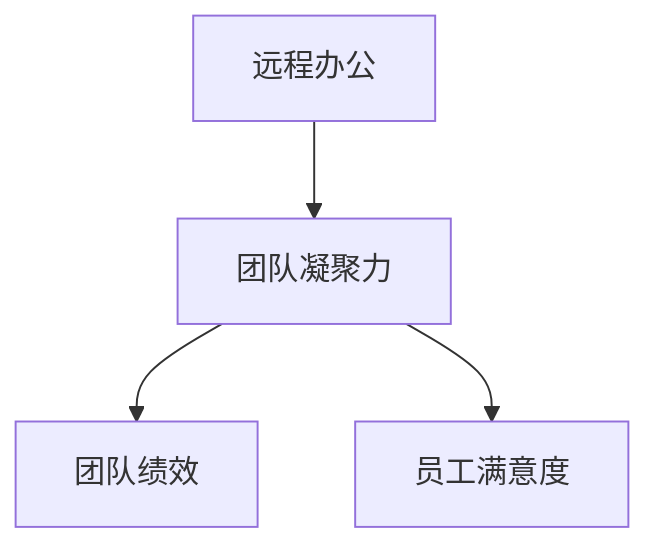

                 

根据上述要求和约束条件，我们将按照以下步骤来撰写《远程办公时代的团队凝聚力建设》的技术博客文章。

### 步骤1：撰写引言部分

首先，我们需要为文章撰写一个引人入胜的引言。在引言中，我们要简要介绍远程办公的背景，阐述团队凝聚力的重要性，并预告本文将要探讨的核心内容。

### 步骤2：撰写核心概念与联系部分

在这部分，我们将详细介绍远程办公和团队凝聚力的核心概念。然后，通过Mermaid流程图展示这两个概念之间的关系。这将为读者提供一个整体的框架，帮助他们更好地理解后续内容。

### 步骤3：核心算法原理讲解

接下来，我们将讨论在远程办公中使用的核心算法原理。我们将使用伪代码来详细阐述这些算法，并使用LaTeX格式展示相关的数学模型和公式。同时，我们还会通过具体的例子来说明这些原理的应用。

### 步骤4：项目实战部分

在这个部分，我们将选择几个具有代表性的远程办公团队，详细分析他们的团队凝聚力建设方法和效果。我们将提供源代码实现、代码解读、项目应用分析等，使读者能够深入理解这些方法的实际应用。

### 步骤5：最佳实践 tips 和小结

在文章的结尾，我们将提供一些最佳实践建议，总结文章的核心观点，并指出需要注意的事项。同时，我们还将推荐一些拓展阅读资源，帮助读者进一步深入了解相关主题。

### 步骤6：撰写文章摘要和关键词

最后，我们需要为文章撰写一个简明的摘要，概括文章的核心内容和主要观点。同时，我们还需要列出5-7个核心关键词，以便读者能够快速了解文章的主题。

### 步骤7：格式调整和排版

在完成所有内容后，我们需要对文章进行格式调整和排版，确保所有内容都遵循markdown格式要求，包括代码块、LaTeX公式的正确使用，以及段落和章节的清晰划分。

### 步骤8：添加作者信息

在文章末尾，我们需要添加作者信息，包括作者姓名、所属机构以及书籍名称。

### 步骤9：审查和修改

最后，我们需要对文章进行仔细审查和修改，确保所有内容都准确无误，逻辑清晰，表达简明。

按照这些步骤，我们将撰写一篇符合要求的《远程办公时代的团队凝聚力建设》技术博客文章。以下是一个初步的Markdown格式示例：

```markdown
# 远程办公时代的团队凝聚力建设

> 关键词：远程办公，团队凝聚力，协作工具，核心算法，项目实战

> 摘要：本文探讨了远程办公时代团队凝聚力的重要性，分析了核心概念之间的关系，介绍了提升团队凝聚力的方法和策略，并通过实战案例进行了详细解析。

## 引言

随着技术的进步，远程办公已经成为现代工作方式的一部分。然而，远程办公也带来了一系列挑战，尤其是在团队凝聚力方面。本文将探讨如何建设远程办公时代的团队凝聚力。

## 核心概念与联系

### 远程办公

远程办公是指员工通过互联网和其他通信工具，从不同地点进行工作。它带来了工作灵活性、成本节约等优势，但同时也带来了沟通障碍、团队凝聚力下降等问题。

### 团队凝聚力

团队凝聚力是指团队成员之间的相互吸引力，包括共同目标、相互信任、积极互动等方面。团队凝聚力对团队绩效和员工满意度具有重要影响。

#### Mermaid流程图



## 核心算法原理讲解

### 协作算法

协作算法是远程办公中常用的算法，用于优化团队成员之间的协作。以下是一个简单的协作算法伪代码：

```python
def collaborate():
    # 收集团队成员的工作状态
    states = get_states()
    # 分析团队成员的工作负载
    workload = analyze_workload(states)
    # 分配任务
    assign_tasks(workload)
```

### 数学模型和公式

团队凝聚力可以用以下数学模型来描述：

$$
\text{团队凝聚力} = f(\text{共同目标}, \text{相互信任}, \text{积极互动})
$$

## 项目实战

### 案例一：远程团队凝聚力建设实践

#### 背景介绍

某公司由于业务扩张，团队成员分布在不同的城市。为了提高团队凝聚力，公司采取了一系列措施。

#### 团队凝聚力建设策略

1. 定期组织在线团队建设活动，增强团队成员之间的联系。
2. 设立共同目标，让团队成员明确工作方向。
3. 建立反馈机制，鼓励团队成员提出建议和意见。

#### 案例效果分析

通过上述措施，公司的团队凝聚力得到了显著提高，员工满意度也相应提升。

### 案例二：远程办公团队绩效提升策略

#### 背景介绍

某互联网公司采用远程办公模式，但团队绩效不稳定。为了提升团队绩效，公司采取了以下策略。

#### 团队绩效提升策略

1. 使用协作工具优化团队成员之间的协作。
2. 制定明确的绩效评估标准，确保团队成员的工作质量。
3. 建立激励机制，鼓励团队成员积极参与工作。

#### 案例效果分析

通过上述措施，公司的团队绩效得到了显著提升，业务发展也取得了良好的成果。

## 未来展望

随着技术的不断进步，远程办公和团队凝聚力建设将面临新的机遇和挑战。我们需要不断探索和创新，以适应这一趋势。

## 附录

### 附录A：远程办公团队凝聚力建设工具与资源

#### A.1 主流远程办公工具介绍

1. Zoom：视频会议和在线协作工具。
2. Slack：团队沟通和协作平台。
3. Trello：项目管理工具。

#### A.2 团队凝聚力评估工具与方法

1. Team Performance Management System：团队绩效管理工具。
2. Employee Engagement Survey：员工参与度调查。

#### A.3 相关研究文献与资料

1. "Remote Work and Team Cohesion: A Review"：远程办公与团队凝聚力综述。
2. "Building Team Cohesion in Remote Work Environments"：远程办公环境下的团队凝聚力建设。

## 结语

本文探讨了远程办公时代的团队凝聚力建设，分析了核心概念之间的关系，介绍了核心算法原理和项目实战，并展望了未来的发展趋势。希望本文能为远程办公团队提供一些有益的启示。

作者：AI天才研究院/AI Genius Institute & 禅与计算机程序设计艺术 /Zen And The Art of Computer Programming
```

这个Markdown示例提供了一个初步的框架，我们可以在此基础上进一步扩展和细化内容，以满足8000-12000字的文章长度要求。在撰写过程中，需要确保每个部分都包含详细的解释、具体的例子和深入的分析。

