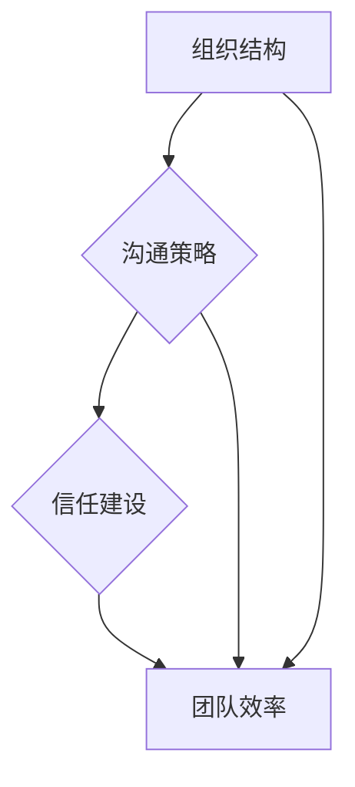

                 

## 文章标题

### 远程团队凝聚力：跨越距离的团队建设

### 关键词

- 远程工作
- 团队建设
- 沟通
- 信任
- 领导力
- 协作工具
- 个人效能

### 摘要

在数字化时代，远程工作成为了一种主流的工作方式。然而，距离的隔阂给团队凝聚力带来了新的挑战。本文将探讨如何通过有效的团队建设策略，提升远程团队的凝聚力，使其能够在跨越物理距离的同时，保持高效的协作和良好的沟通。文章将分为多个部分，详细分析远程团队的组织结构、沟通技巧、信任与关系建设、目标设定与激励机制、领导力与团队发展、协作工具与个人效能提升等方面的内容。通过案例分析，提供具体的实践经验，并展望远程团队建设的未来趋势。

## 引言

### 远程工作的兴起与发展

远程工作并非一个全新的概念。然而，随着互联网和通信技术的飞速发展，远程工作逐渐从边缘走向主流。尤其是在过去几年中，受到新冠疫情的推动，远程工作成为了一种普遍现象。根据全球远程工作调查报告，超过70%的受访员工表示，他们希望能够继续采用远程工作的方式。这种工作模式的兴起，不仅带来了工作方式的变革，也对团队建设提出了新的挑战。

远程工作的优点显而易见。首先，它提供了更高的灵活性，员工可以在更舒适的环境中工作，提高了工作效率。其次，远程工作打破了地理位置的限制，企业能够招聘到全球范围内的人才。然而，远程工作也带来了一系列的挑战，尤其是在团队凝聚力和沟通方面。物理距离的存在，容易导致团队成员之间的疏离感，影响团队的协作效率。

### 团队建设的重要性

团队建设是确保远程团队高效运作的关键。一个凝聚力强的团队，能够更好地应对远程工作带来的挑战，提高整体的工作效率。团队建设不仅关系到团队成员之间的互动和协作，也影响着团队成员的工作满意度和忠诚度。有效的团队建设，能够建立起信任和共同的目标，促进团队成员之间的沟通和合作，从而实现团队的目标。

本文旨在探讨如何通过有效的团队建设策略，提升远程团队的凝聚力。文章将首先分析远程团队的组织结构和沟通挑战，然后探讨信任与关系建设、目标设定与激励机制、领导力与团队发展等方面的内容。最后，通过具体的案例分析，提供实践经验，并展望远程团队建设的未来趋势。

## 远程团队的组织结构与沟通

### 远程团队的组织结构

远程团队的组织结构设计是确保团队高效运作的基础。与传统团队相比，远程团队的组织结构更加灵活，需要考虑到地理位置、时间差异和文化背景等因素。以下是几种常见的远程团队组织结构：

1. **职能型组织结构**：按照职能划分团队，例如开发团队、市场团队等。每个团队都有自己的负责人，团队成员可以根据自己的专长进行任务分配。这种结构有利于发挥团队成员的专业技能，但可能存在跨部门沟通不畅的问题。

2. **项目型组织结构**：按照项目进行任务分配，团队成员根据项目的需求进行动态调整。项目型组织结构具有高度的灵活性和响应速度，适合需要快速迭代的远程项目。然而，由于团队成员频繁变动，可能影响团队的稳定性和信任建设。

3. **混合型组织结构**：结合职能型和项目型的特点，将团队成员按照职能划分，同时根据项目需求进行任务分配。这种结构在保持职能专业化的同时，能够更好地适应项目需求，提高团队的整体效率。

### 远程团队沟通的挑战与策略

远程团队沟通面临的挑战主要包括信息不对称、沟通效率低下和文化差异等。以下是一些应对策略：

1. **选择合适的沟通工具**：远程团队需要选择合适的沟通工具，如即时通讯软件、视频会议工具和项目管理平台等。根据团队的规模和需求，可以选择不同的工具，以提高沟通效率。

   ```mermaid
   graph TD
   A[即时通讯软件] --> B{视频会议工具}
   B --> C[项目管理平台]
   ```

2. **定期举行会议**：定期举行团队会议，确保团队成员能够及时了解项目进展和团队动态。会议可以分为全体会议和小组会议，根据需要灵活调整。

   ```mermaid
   graph TD
   A[全体会议] --> B[小组会议]
   ```

3. **建立沟通规范**：制定明确的沟通规范，包括沟通渠道、沟通频率和沟通格式等，以确保团队成员能够高效地进行沟通。

   ```mermaid
   graph TD
   A[沟通渠道] --> B[沟通频率]
   B --> C[沟通格式]
   ```

4. **促进跨文化沟通**：远程团队往往涉及不同文化背景的成员，需要特别关注跨文化沟通。通过培训和文化交流活动，增强团队成员之间的文化理解和认同。

   ```mermaid
   graph TD
   A[文化培训] --> B[文化活动]
   ```

### 跨文化沟通的技巧

跨文化沟通的技巧对于远程团队的建设至关重要。以下是一些有效的跨文化沟通技巧：

1. **了解文化差异**：通过学习和了解不同文化背景，增强对团队成员的理解和尊重。文化差异包括语言、价值观、沟通风格等。

   ```mermaid
   graph TD
   A[语言差异] --> B[价值观差异]
   B --> C[沟通风格差异]
   ```

2. **尊重差异**：在沟通中，尊重不同文化背景的成员，避免使用可能引起误解的言辞和行为。

3. **积极倾听**：在跨文化沟通中，积极倾听对方意见，避免做出假设和偏见。

4. **使用明确的语言**：使用明确、简洁的语言，避免使用含糊不清的表达，确保信息的准确性。

   ```mermaid
   graph TD
   A[明确语言] --> B[简洁语言]
   ```

通过上述策略和技巧，远程团队可以有效克服沟通挑战，提高团队凝聚力，实现高效协作。

### 核心概念与联系：组织结构、沟通与信任

在远程团队建设中，组织结构、沟通和信任是三个核心概念，它们相互联系，共同构成团队凝聚力的基石。

首先，组织结构是远程团队运作的基础。一个合理的组织结构能够明确团队成员的角色和职责，确保任务分配和流程管理的有效性。例如，职能型组织结构能够发挥团队成员的专业技能，项目型组织结构则能够快速响应项目需求。不同的组织结构设计，决定了团队成员之间的互动方式和沟通模式。

其次，沟通是团队运作的纽带。远程团队依赖于高效、及时的沟通来传递信息、协调任务和解决问题。选择合适的沟通工具、建立沟通规范和促进跨文化沟通，是确保沟通顺畅的关键。有效的沟通能够减少误解和冲突，增强团队成员之间的信任感和凝聚力。

最后，信任是团队凝聚力的核心。在远程团队中，信任尤为重要，因为团队成员之间的互动更多依赖于虚拟空间。信任的建立需要时间，需要通过透明、诚信和积极的互动来实现。信任不仅能够促进团队成员之间的合作，还能够提高团队的整体效率和满意度。

这三者之间的联系可以形象地用Mermaid流程图表示：



在图中，组织结构通过明确的任务分配和职责划分，为沟通提供了基础；沟通策略通过有效的信息传递和协调，加强了团队内部的互动；信任建设通过建立相互信任和尊重，提升了团队的整体效率和满意度。这三个核心概念相互交织，共同作用，构成了远程团队的凝聚力。

### 远程团队信任与关系建设

#### 信任的重要性

在远程团队中，信任是团队凝聚力的基石。信任不仅影响团队成员之间的合作意愿，也直接关系到团队的效率和工作质量。远程工作环境下，团队成员之间的互动主要依赖于虚拟沟通，这使得信任的建立变得更加复杂和重要。

首先，信任能够减少信息不对称。在远程团队中，由于地理位置、时间差和文化差异，团队成员之间的信息获取和传递可能存在障碍。信任可以降低团队成员对信息不透明的担忧，促进信息的自由流动，确保项目顺利进行。

其次，信任能够增强团队成员的归属感和责任感。在一个信任度高的团队中，成员更愿意承担责任，愿意分享自己的知识和经验，这有助于提升团队的整体能力和士气。

#### 建立信任的步骤与策略

建立信任是一个持续的过程，需要团队成员共同努力。以下是一些有效的步骤和策略：

1. **透明沟通**：透明沟通是建立信任的基础。团队成员应该尽可能公开讨论项目进展、问题和决策，避免隐瞒或遗漏重要信息。

2. **相互尊重**：尊重团队成员的个性和观点，避免歧视和偏见。在沟通中，采用积极倾听和反馈，确保每个成员的声音都能被听到。

3. **诚实守信**：诚实守信是信任的核心。团队成员应该遵守承诺，诚实面对问题和挑战，避免虚假信息和欺骗行为。

4. **建立共同目标**：共同的目标是团队成员团结一致的动力。通过设定明确的目标和愿景，团队成员可以共同奋斗，增强团队的凝聚力和信任感。

5. **积极的反馈与支持**：积极的反馈和支持有助于建立信任。团队成员应该互相鼓励，及时反馈工作成果，并提供必要的帮助。

#### 远程团队关系建设的实践

在远程团队中，关系建设同样重要。以下是一些实践方法，可以帮助团队建立和维护良好的关系：

1. **定期的团队活动**：通过定期的线上团队活动，如团队建设游戏、主题讨论会等，增强团队成员之间的互动和了解。

2. **共享经验与知识**：鼓励团队成员分享自己的工作经验和专业知识，通过线上培训、研讨会等形式，提升团队的整体技能水平。

3. **建立信任圈**：在团队中建立信任圈，通过小团队的合作和互动，增强团队内部的信任和凝聚力。

4. **及时解决冲突**：在团队中，冲突难以避免。重要的是要及时解决冲突，避免其扩大化。通过积极的沟通和协商，找到解决问题的方法。

通过上述步骤和策略，远程团队可以逐步建立起信任，形成紧密的关系，从而提高团队的整体效率和绩效。

### 目标设定与激励机制

#### 远程团队的目标设定

在远程团队中，目标设定是确保团队朝着共同方向努力的关键步骤。明确的目标能够帮助团队成员聚焦工作重点，提升工作效率，并确保团队目标的实现。以下是设定远程团队目标的几个关键步骤：

1. **明确愿景和使命**：首先，团队需要明确其愿景和使命，这是团队长远发展的方向和目标。愿景和使命应具有指导性和激励性，能够激发团队成员的积极性和归属感。

2. **分解目标**：将大目标分解为可操作的小目标，这样团队成员可以更加明确自己的任务和责任。分解目标时应考虑目标的难度、时间和资源等因素。

3. **制定具体的行动计划**：为每个目标制定具体的行动计划，明确每个阶段的任务和时间节点，确保目标的可执行性。

4. **定期回顾和调整**：目标设定后，团队应定期回顾目标进展，并根据实际情况进行调整。这有助于保持目标的灵活性，同时确保团队成员能够及时适应变化。

#### 激励机制的构建与实施

激励机制是提高团队工作积极性和效率的重要手段。在远程团队中，有效的激励机制能够激发团队成员的潜力，促进团队的整体发展。以下是构建和实施激励机制的几个关键点：

1. **个性化奖励**：根据团队成员的不同需求和贡献，设计个性化的奖励机制。奖励可以是金钱、荣誉、培训机会等多种形式。

2. **及时反馈**：及时的反馈能够帮助团队成员了解自己的工作表现，并提供改进的机会。反馈应具有建设性和鼓励性，避免负面批评。

3. **竞争与合作相结合**：适当的竞争可以激发团队成员的积极性，但过度的竞争可能导致内部冲突。因此，应将竞争与合作相结合，确保团队的整体利益。

4. **长期激励**：除了短期激励，长期激励也是提升团队凝聚力的重要手段。例如，提供职业发展机会、股权激励等，可以帮助团队成员看到长期的价值和回报。

#### 绩效评估与反馈

绩效评估是确保激励机制有效性的关键步骤。以下是一些绩效评估和反馈的实践方法：

1. **多维度的评估**：绩效评估应考虑多个维度，如工作质量、工作效率、团队合作等。这样可以全面了解团队成员的表现。

2. **定期的评估**：定期进行绩效评估，确保团队成员能够及时了解自己的工作表现，并根据评估结果进行调整。

3. **建设性的反馈**：反馈应具有建设性，关注团队成员的长处和改进点。通过积极的沟通，帮助团队成员提升工作能力。

4. **透明和公开**：确保绩效评估和反馈的透明和公开，避免主观偏见和误解。

通过有效的目标设定和激励机制，远程团队可以更好地实现团队目标，提高工作效率和凝聚力。

### 领导力与团队发展

#### 远程领导者的角色与责任

在远程团队中，领导者的角色至关重要。远程领导者不仅需要具备传统领导者的能力，还需要适应远程工作的特殊环境。以下是远程领导者应承担的主要角色和责任：

1. **沟通桥梁**：远程领导者需要成为团队沟通的桥梁，确保信息在团队成员之间畅通无阻。他们需要选择合适的沟通工具，制定明确的沟通策略，并鼓励团队成员积极参与沟通。

2. **信任建设者**：信任是远程团队成功的关键。领导者需要通过透明、诚信和积极的互动，建立和维护团队内部的信任。他们应在团队中倡导信任文化，鼓励团队成员相互支持和协作。

3. **激励者**：领导者需要激发团队成员的潜力，提供积极的工作环境。他们可以通过设定明确的目标、提供奖励和认可来激励团队成员，并帮助他们克服工作中的困难和挑战。

4. **团队发展推动者**：领导者应关注团队的整体发展，提供培训和成长机会，帮助团队成员提升技能和知识。他们还应鼓励团队成员参与跨部门的项目，促进团队成员的全面发展。

#### 领导力在远程团队中的实践

远程领导力在实践中面临许多挑战，如文化差异、时区差异和缺乏面对面的互动。以下是一些有效的领导力实践方法，可以帮助远程领导者克服这些挑战：

1. **建立明确的期望和目标**：领导者应明确团队的期望和目标，确保每个成员都清楚自己的任务和责任。通过定期的会议和沟通，领导者可以检查目标的实现情况，并提供必要的支持和指导。

2. **利用技术工具**：远程领导者应熟练使用各种技术工具，如即时通讯软件、视频会议工具和项目管理平台，以提高沟通效率和工作效率。

3. **促进跨文化沟通**：领导者应重视跨文化沟通，通过培训和文化交流活动，增强团队成员之间的文化理解和认同。他们应鼓励团队成员尊重不同的文化背景，促进团队的融合和协作。

4. **建立反馈机制**：领导者应建立有效的反馈机制，鼓励团队成员提供反馈和建议。通过定期的反馈会议和评估，领导者可以及时了解团队成员的工作情况，并采取相应的措施。

#### 团队发展的方法论

团队发展是一个持续的过程，远程领导者需要采取一系列方法论来推动团队的发展。以下是几个关键步骤：

1. **评估当前状况**：领导者应定期评估团队的发展状况，识别团队的优势和不足。这可以通过团队会议、问卷调查和个别访谈等方式进行。

2. **制定发展计划**：根据评估结果，领导者应制定具体的发展计划，明确团队的目标和改进措施。发展计划应包括培训计划、技能提升计划和时间管理计划等。

3. **实施和监控**：领导者应确保发展计划的实施，并监控团队的发展进度。他们可以通过定期的团队会议、项目评审和绩效评估来跟踪团队的发展情况。

4. **持续优化**：团队发展是一个持续的过程，领导者需要不断优化发展计划，并根据实际情况进行调整。通过不断的改进和优化，团队可以不断提高其整体能力和效率。

通过上述方法，远程领导者可以有效地推动团队的发展，提升团队的整体绩效。

### 远程团队的协作工具与平台

#### 常见的远程协作工具

远程团队协作工具的选择至关重要，它直接影响到团队的沟通效率和协作效果。以下是几种常见的远程协作工具：

1. **即时通讯工具**：如Slack、Microsoft Teams和WhatsApp等，这些工具允许团队成员实时沟通和交流，提高工作效率。

2. **视频会议工具**：如Zoom、Microsoft Teams和Google Meet等，这些工具提供了高质量的音视频会议功能，支持多人参与和实时互动。

3. **项目管理工具**：如Trello、Jira和Asana等，这些工具可以帮助团队管理项目进度、任务分配和团队协作，确保项目按时完成。

4. **文档协作工具**：如Google Docs、Microsoft Office 365和Notion等，这些工具允许团队成员实时编辑和共享文档，提高文档管理和协作效率。

#### 选择合适的协作平台

选择合适的协作平台是远程团队成功的关键。以下是一些选择协作平台的考虑因素：

1. **功能需求**：根据团队的具体需求，选择具备所需功能的协作平台。例如，如果团队需要大量的文档协作，可以选择Google Docs或Notion。

2. **用户体验**：用户体验是选择协作平台的重要因素。一个友好且易于使用的平台可以降低团队成员的学习成本，提高工作效率。

3. **集成能力**：选择具有良好集成能力的平台，可以方便地将不同工具和服务整合到一起，实现数据共享和流程自动化。

4. **安全性和隐私保护**：确保协作平台提供足够的安全性和隐私保护措施，以保护团队的敏感信息和数据。

#### 协作工具的最佳实践

为了确保协作工具的有效使用，以下是一些最佳实践：

1. **制定使用规范**：为团队成员制定明确的协作工具使用规范，包括沟通格式、文件命名规则和操作流程等。

2. **定期培训和指导**：定期为团队成员提供协作工具的培训和指导，确保每个人都能熟练使用这些工具。

3. **优化工作流程**：通过优化工作流程，减少不必要的沟通和重复工作，提高团队的协作效率。

4. **定期评估和调整**：定期评估协作工具的使用效果，根据团队的需求和反馈，调整和优化工具的使用策略。

通过上述最佳实践，远程团队可以最大限度地利用协作工具，提高团队协作效率和工作质量。

### 远程工作的个人效能

#### 远程工作者的心态调整

在远程工作中，心态调整是提高个人效能的关键。以下是一些帮助远程工作者调整心态的建议：

1. **设定明确的目标和计划**：远程工作者应设定明确的工作目标和计划，确保每天都有具体的任务和目标。这有助于提高工作效率和避免拖延。

2. **保持积极的工作态度**：积极的工作态度有助于提升工作效率和应对挑战。即使遇到困难，也应保持乐观和积极的心态，相信问题总能得到解决。

3. **保持健康的生活习惯**：健康的身体是高效工作的重要保障。远程工作者应保持良好的作息规律，注意饮食和锻炼，以保持身心健康。

#### 时间管理与效率提升

时间管理和效率提升是远程工作者的核心能力。以下是一些有效的时间管理和效率提升策略：

1. **制定日程安排**：每天早上制定详细的日程安排，包括工作任务、休息时间和个人时间，确保时间的有效利用。

2. **避免多任务处理**：多任务处理会降低工作效率。远程工作者应专注于一项任务，直到完成后再进行下一项任务。

3. **使用时间管理工具**：利用时间管理工具，如Trello、Asana和Google Calendar等，帮助管理工作任务和时间。

4. **设定优先级**：根据任务的重要性和紧急程度，设定任务的优先级，确保关键任务得到优先处理。

#### 远程工作者的自我管理策略

远程工作者需要具备良好的自我管理能力，以保持高效的工作状态。以下是一些自我管理策略：

1. **设定工作环境**：建立一个安静、舒适的工作环境，避免干扰和诱惑。良好的工作环境有助于提高工作效率和集中精力。

2. **定期自我评估**：定期对自己的工作表现进行评估，了解自己的优点和不足，并制定改进计划。

3. **寻求反馈和建议**：定期向同事和领导寻求反馈和建议，了解自己的工作表现，并根据反馈进行调整。

4. **培养自我驱动力**：培养自我驱动力，保持对工作的热情和动力，即使在没有外部压力的情况下也能保持高效的工作状态。

通过上述心态调整、时间管理和自我管理策略，远程工作者可以显著提高个人效能，保持高效的工作状态。

### 案例分析

#### 案例一：某跨国公司远程团队的成功经验

某跨国公司在疫情期间迅速转型为远程工作模式，通过一系列有效的团队建设策略，成功保持了团队的高效运作和凝聚力。以下是该公司的成功经验：

1. **明确的组织结构**：公司采用了项目型组织结构，根据项目需求灵活调整团队成员，确保每个项目都有明确的负责人和责任分工。

2. **高效的沟通机制**：公司采用多种沟通工具，包括Slack、Zoom和Microsoft Teams等，确保团队成员能够实时沟通和协作。公司制定了详细的沟通规范，包括沟通频率、格式和渠道等。

3. **信任建设**：公司通过定期的团队活动和在线培训，增强团队成员之间的信任和理解。公司还鼓励团队成员分享自己的经验和知识，促进团队内部的协作和互动。

4. **激励机制**：公司根据团队成员的表现和贡献，提供个性化的奖励和职业发展机会。通过定期的绩效评估和反馈，公司确保激励机制的有效性。

5. **个人效能提升**：公司为远程工作者提供了一系列自我管理和时间管理的培训，帮助团队成员提高个人效能。

#### 案例二：小型远程团队的实践探索

某小型远程团队由五名成员组成，他们在项目管理和团队协作方面进行了一系列实践探索，取得了显著成效。以下是他们的实践方法：

1. **灵活的团队结构**：团队成员根据项目的需求进行动态调整，确保每个项目都有合适的团队成员。团队成员之间建立了紧密的合作关系，确保项目的顺利进行。

2. **高效的沟通**：团队成员通过Trello和Zoom等工具进行项目管理和沟通。他们制定了详细的任务分配和进度跟踪计划，确保项目进度透明和可控。

3. **信任和文化建设**：团队成员通过定期的视频会议和线上聚会，加强团队内部的信任和文化建设。他们还通过共享经验和知识，促进团队的专业发展和合作。

4. **激励机制**：团队成员根据项目的完成情况和个人的贡献，获得相应的奖励和认可。这种激励机制增强了团队成员的工作动力和团队合作精神。

#### 案例分析与启示

通过上述案例分析，我们可以得出以下启示：

1. **明确的组织结构和灵活的团队调整**：组织结构的设计对远程团队的高效运作至关重要。灵活的团队结构能够根据项目需求进行调整，确保每个项目都有合适的团队成员。

2. **高效的沟通和信任建设**：高效的沟通和信任建设是确保远程团队凝聚力的重要手段。通过多种沟通工具和定期的团队活动，可以增强团队成员之间的互动和信任。

3. **激励机制和个人效能提升**：有效的激励机制和个人效能提升策略能够提高团队成员的工作动力和效能，确保团队目标的实现。

通过借鉴这些成功经验，远程团队可以不断提升其运作效率和凝聚力，实现团队目标。

### 远程团队建设的未来趋势

#### 远程工作的发展趋势

随着技术的不断进步，远程工作将继续发展，并可能成为未来工作方式的主流。以下是远程工作发展的一些趋势：

1. **技术工具的不断创新**：远程工作的工具将变得更加智能化和自动化，提高沟通效率和协作效果。例如，人工智能助手和自动化流程将帮助团队成员更高效地完成任务。

2. **工作地点的灵活性**：远程工作将不再局限于家庭办公，更多企业将提供混合办公模式，允许员工在办公室和远程工作之间灵活切换。

3. **全球招聘的普及**：远程工作将打破地理位置的限制，企业可以招聘全球范围内的优秀人才，提高团队的多样性和创新能力。

#### 远程团队建设的未来挑战与机遇

未来，远程团队建设将面临以下挑战和机遇：

1. **挑战**：
   - **文化差异**：全球团队的文化差异可能影响团队的协作和沟通。
   - **隐私和安全问题**：远程工作增加了数据泄露和网络攻击的风险。
   - **平衡工作和生活**：远程工作可能导致工作和生活的界限模糊，影响员工的身心健康。

2. **机遇**：
   - **更高的工作灵活性**：远程工作将提高员工的工作满意度和生产力。
   - **全球人才库**：企业可以招聘全球范围内的优秀人才，提高团队的竞争力。
   - **持续的学习和发展**：远程工作提供了更多学习和发展的机会，有助于提升团队成员的技能和知识。

#### 远程团队建设的建议与展望

为了应对未来的挑战和抓住机遇，以下是一些建议：

1. **加强文化融合**：通过培训和文化交流活动，增强团队成员之间的文化理解和认同，促进团队的融合和协作。

2. **提升安全意识**：加强网络安全培训，提高团队成员的安全意识，确保远程工作的安全性和隐私保护。

3. **倡导工作与生活的平衡**：鼓励团队成员设定合理的工作时间，提供灵活的工作安排，帮助员工实现工作与生活的平衡。

4. **持续学习和创新**：鼓励团队成员不断学习和创新，提供职业发展机会和培训资源，提升团队的整体能力和竞争力。

通过上述措施，远程团队可以更好地应对未来的挑战，抓住机遇，实现持续的发展。

### 结论

本文通过逐步分析推理，探讨了远程团队凝聚力的重要性以及如何通过有效的团队建设策略提升远程团队的凝聚力。我们从远程工作的现状与挑战出发，详细分析了远程团队的组织结构、沟通技巧、信任与关系建设、目标设定与激励机制、领导力与团队发展、协作工具与个人效能提升等方面的内容。通过案例分析，我们提供了具体的实践经验，并对远程团队建设的未来趋势进行了展望。总之，通过持续的努力和创新，远程团队可以克服地理距离带来的挑战，实现高效协作和良好的团队凝聚力。

### 作者信息

作者：AI天才研究院/AI Genius Institute & 禅与计算机程序设计艺术 /Zen And The Art of Computer Programming

### 拓展阅读

- 《远程工作的艺术：如何高效地远程协作》（作者：Jason Fried & David Heinemeier Hansson）
- 《团队合作的秘密：如何创建高效团队》（作者：Patrick Lencioni）
- 《敏捷团队实践指南》（作者：Jeff Sutherland）
- 《远程工作：未来的工作模式》（作者：Brian Grazer & Charles Fishman）
- 《远程团队管理：如何管理虚拟团队》（作者：Kathy Harris）

