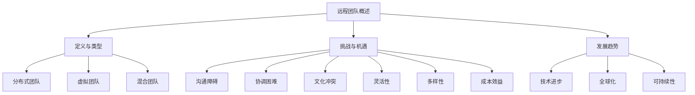

                 

### 文章标题：远程团队凝聚：克服物理距离的策略

> 关键词：远程团队、物理距离、团队凝聚力、协作策略、工具与技巧

> 摘要：本文探讨了在物理距离的挑战下，远程团队如何通过有效的策略和工具来保持团队凝聚力和高效协作。文章从远程团队概述、协作工具与技术、沟通策略、项目管理、文化建设、效能评估与改进等方面，逐步深入分析并提供了实际案例和最佳实践，以帮助读者理解和掌握远程团队管理的方法和技巧。

---

### 引言

在当今信息时代，远程工作已成为一种普遍现象。无论是跨国公司、初创企业，还是独立工作者，远程团队都成为了组织运作的重要形式。然而，物理距离所带来的沟通障碍、协调困难和文化冲突等问题，使得远程团队的凝聚力和工作效率成为了一大挑战。

本文旨在探讨远程团队在物理距离带来的挑战下，如何通过有效的策略和工具来保持团队凝聚力和高效协作。文章将依次从远程团队概述、协作工具与技术、沟通策略、项目管理、文化建设、效能评估与改进等方面，逐步深入分析并提供了实际案例和最佳实践。

---

### 第1章：远程团队概述

#### 1.1 远程团队的定义与类型

**定义**：远程团队是指团队成员分布在不同的地理位置，通过信息技术进行协作和沟通，共同完成项目或任务的工作组。

**类型**：

1. **分布式团队**：团队成员分布在不同城市或国家，但位于同一组织内部。
2. **虚拟团队**：团队成员分布在不同的组织或公司，但共同为一个目标或项目工作。
3. **混合团队**：结合了分布式团队和虚拟团队的特点，团队成员部分分布在同一地点，部分分布在不同地点。

#### 1.2 远程团队的挑战与机遇

**挑战**：

1. **沟通障碍**：物理距离导致沟通不畅，信息传递延迟。
2. **协调困难**：团队成员地理位置分散，协调工作复杂。
3. **文化冲突**：不同地区和文化背景的团队成员可能存在价值观和行为方式的差异。

**机遇**：

1. **灵活性**：远程工作提供了更大的灵活性，适应不同的工作和生活节奏。
2. **多样性**：远程团队能够吸引来自不同地区和文化背景的成员，增加团队的多样性和创新性。
3. **成本效益**：减少办公场所和通勤成本，提高组织效率和资源利用。

#### 1.3 远程团队的发展趋势

1. **技术进步**：云计算、人工智能、物联网等技术的不断发展，为远程团队提供了更高效、更便捷的协作工具。
2. **全球化**：全球化趋势下，组织需要更多的远程团队成员来满足业务需求。
3. **可持续性**：远程工作有助于减少碳排放，推动可持续发展。

---

### 第2章：远程团队协作工具与技术

#### 2.1 远程协作工具概述

**工具分类**：

1. **即时通讯工具**：如Slack、Telegram、WhatsApp等，用于实时沟通和协作。
2. **文档共享与协作工具**：如Google Drive、Dropbox、OneDrive等，用于文档共享和协同编辑。
3. **远程会议与视频会议工具**：如Zoom、Microsoft Teams、Cisco Webex等，用于远程会议和视频交流。

**工具选择**：

1. **考虑团队成员的偏好**：选择团队成员熟悉的工具，提高使用效率。
2. **考虑功能需求**：根据团队的工作需求和项目特点，选择适合的工具。
3. **考虑安全性**：确保工具具备数据加密和安全防护功能，保护团队数据安全。

#### 2.2 即时通讯工具

**常用即时通讯工具**：

1. **Slack**：提供丰富的功能，如频道聊天、直接消息、文件共享、集成第三方应用等。
2. **Telegram**：支持群聊、语音通话、文件传输等功能，适用于大团队。
3. **WhatsApp**：广泛使用的即时通讯工具，适用于个人和团队沟通。

**使用技巧**：

1. **建立清晰的组织结构**：设置不同的频道和群组，明确沟通范围和目的。
2. **规范沟通礼仪**：避免过度使用表情符号、避免闲聊，保持沟通高效。
3. **充分利用插件和集成应用**：利用插件和集成应用，如Trello、JIRA等，实现任务管理和协同工作。

#### 2.3 文档共享与协作工具

**常用文档共享与协作工具**：

1. **Google Drive**：提供云存储和文档编辑功能，支持多人实时协作。
2. **Dropbox**：提供可靠的云存储和同步服务，适用于个人和企业。
3. **OneDrive**：微软提供的云存储和协作工具，与Office 365集成。

**使用技巧**：

1. **组织文件结构**：合理规划文件目录，方便团队成员查找和访问。
2. **版本控制**：使用版本控制功能，避免文档冲突和丢失。
3. **设置共享权限**：根据团队成员的角色和职责，设置不同的共享权限。

#### 2.4 远程会议与视频会议工具

**常用远程会议与视频会议工具**：

1. **Zoom**：提供高清视频会议、屏幕共享、实时聊天等功能，适用于大规模会议。
2. **Microsoft Teams**：集成Office 365功能，支持视频会议、在线协作、任务管理等。
3. **Cisco Webex**：提供多种会议模式，支持远程协作和互动。

**使用技巧**：

1. **提前准备**：确保设备正常运行，网络稳定，提前通知参会人员。
2. **规范会议流程**：制定会议议程，明确会议目的和议程，提高会议效率。
3. **保持参与度**：积极提问、发表观点，避免会议变得单调和无聊。

---

### 第3章：远程沟通策略

#### 3.1 远程沟通的重要性

**远程沟通的核心要素**：

1. **明确沟通目的**：确保沟通内容有明确的目标和目的。
2. **有效传递信息**：确保信息准确、清晰、及时地传递。
3. **建立信任关系**：通过沟通建立团队成员之间的信任和合作。
4. **适应不同文化**：尊重不同文化背景，避免文化冲突。

**远程沟通的目标**：

1. **促进协作**：确保团队成员能够高效协同工作。
2. **提高工作效率**：减少沟通障碍，提高工作效率。
3. **增强团队凝聚力**：通过沟通建立团队归属感和凝聚力。

#### 3.2 远程沟通的最佳实践

**沟通前的准备**：

1. **明确沟通目标**：在沟通前明确沟通的目的和预期结果。
2. **制定沟通计划**：规划沟通的时间、地点、方式和参与人员。
3. **准备沟通材料**：准备好需要分享的文件、图表和演示材料。

**沟通中的技巧**：

1. **倾听和提问**：积极倾听对方的意见，提出针对性的问题。
2. **表达清晰**：使用简洁明了的语言，避免歧义和误解。
3. **非言语沟通**：注意语气、表情和肢体语言，传递积极的沟通态度。
4. **实时反馈**：及时给予反馈，确认对方理解并接受沟通内容。

**非言语沟通技巧**：

1. **倾听**：通过眼神接触、点头等动作表达关注和尊重。
2. **反馈**：通过重复、确认和总结对方的发言，确保理解一致。
3. **表情和肢体语言**：保持友好和开放的姿态，避免冷漠和敌意。

#### 3.3 网络沟通工具的使用技巧

**选择合适的沟通工具**：

1. **即时通讯工具**：适用于简短、快速的沟通。
2. **文档共享工具**：适用于文档共享和协同编辑。
3. **远程会议与视频会议工具**：适用于正式会议和讨论。

**合理安排沟通时间**：

1. **避免高峰时段**：避免在团队成员忙碌或休息的时间进行沟通。
2. **设定固定沟通时间**：确保团队成员有充分的时间准备和参与沟通。

**充分利用工具功能**：

1. **实时聊天**：适用于即时讨论和问题解答。
2. **视频会议**：适用于正式讨论和互动交流。
3. **文件共享**：适用于文档共享和协同编辑。

---

### 第4章：远程项目管理

#### 4.1 远程项目管理的核心要素

**核心要素**：

1. **项目目标**：确保项目目标明确、具体、可量化。
2. **项目计划**：制定详细的项目计划，包括任务分解、时间安排、资源分配等。
3. **项目沟通**：确保项目团队成员之间的沟通畅通，及时传达项目信息和调整。
4. **项目监控**：实时监控项目进展，确保项目按计划进行。
5. **项目风险**：识别和评估项目风险，制定应对策略。

#### 4.2 远程项目计划与时间管理

**项目计划**：

1. **任务分解**：将项目目标分解为具体的任务和子任务。
2. **时间安排**：为每个任务和子任务分配具体的时间。
3. **资源分配**：为每个任务和子任务分配所需的资源，包括人力、物力、财力等。

**时间管理**：

1. **优先级排序**：根据任务的紧急程度和重要性，对任务进行优先级排序。
2. **时间追踪**：使用工具记录每个任务的实际完成时间，以便后续分析和优化。
3. **时间调整**：根据实际情况，及时调整任务和时间安排，确保项目按计划进行。

#### 4.3 远程团队的任务分配与协调

**任务分配**：

1. **明确职责**：确保每个团队成员清楚自己的职责和任务。
2. **能力匹配**：根据团队成员的能力和特长，合理分配任务。
3. **任务反馈**：及时给予任务反馈，确保团队成员了解任务进展和需求。

**协调工作**：

1. **沟通渠道**：建立畅通的沟通渠道，确保团队成员能够及时交流。
2. **协调会议**：定期召开协调会议，讨论项目进展和问题，确保项目顺利进行。
3. **协作工具**：使用协作工具，如即时通讯、文档共享、远程会议等，提高协调效率。

#### 4.4 远程项目的风险评估与应对

**风险评估**：

1. **识别风险**：识别项目中可能出现的风险，包括技术风险、人员风险、市场风险等。
2. **评估风险**：评估每个风险的可能性和影响程度。
3. **风险分类**：根据风险的可能性和影响程度，对风险进行分类。

**应对策略**：

1. **预防措施**：针对高优先级风险，采取预防措施，降低风险发生的可能性。
2. **应对计划**：制定应对计划，包括风险发生时的应对措施和责任人。
3. **持续监控**：实时监控风险，确保应对计划的执行和调整。

---

### 第5章：远程团队文化建设

#### 5.1 远程团队文化的定义与作用

**定义**：远程团队文化是指团队成员共同遵循的价值观、信念、行为规范和思维方式。

**作用**：

1. **增强凝聚力**：共同的文化价值观和行为规范有助于增强团队成员之间的凝聚力。
2. **提高效率**：共同的文化认同感有助于提高团队的工作效率和协作能力。
3. **促进创新**：积极的文化氛围有助于激发团队成员的创新思维和创造力。

#### 5.2 远程团队文化的建设策略

**文化建设目标**：

1. **共同价值观**：明确团队的核心价值观，确保团队成员共同遵循。
2. **行为规范**：制定团队的行为规范，引导团队成员的行为。
3. **文化氛围**：营造积极向上的文化氛围，鼓励团队成员分享和交流。

**文化建设方法**：

1. **领导示范**：领导者要身体力行，带头践行团队文化。
2. **培训与教育**：定期开展文化培训和教育活动，强化团队文化意识。
3. **激励与奖励**：通过激励和奖励机制，鼓励团队成员积极参与团队文化建设。

#### 5.3 远程团队激励与反馈机制

**激励机制**：

1. **物质激励**：提供合理的薪酬和福利待遇，满足团队成员的物质需求。
2. **精神激励**：通过表扬、认可和奖励，满足团队成员的精神需求。
3. **职业发展**：提供职业发展和晋升机会，激发团队成员的职业动力。

**反馈机制**：

1. **即时反馈**：及时给予团队成员工作反馈，帮助其改进和提升。
2. **定期评估**：定期对团队成员的工作进行评估，为其提供反馈和发展建议。
3. **互动交流**：鼓励团队成员之间的互动交流，促进相互理解和信任。

#### 5.4 远程团队的冲突管理与解决

**冲突管理**：

1. **预防冲突**：通过沟通、培训和文化建设，预防冲突的发生。
2. **识别冲突**：及时发现和识别冲突，避免冲突升级。
3. **调解冲突**：通过调解和协商，解决冲突，恢复团队的和谐。

**冲突解决方法**：

1. **直接沟通**：鼓励团队成员直接沟通，表达自己的观点和需求。
2. **第三方调解**：在冲突无法自行解决时，寻求第三方调解，帮助解决问题。
3. **文化融合**：通过文化建设，促进团队成员的文化融合，减少冲突。

---

### 第6章：远程团队效能评估与改进

#### 6.1 远程团队效能评估指标

**评估指标**：

1. **工作效率**：通过工作量、任务完成时间等指标评估团队的工作效率。
2. **团队协作**：通过沟通频率、协作工具使用情况等指标评估团队的协作能力。
3. **项目质量**：通过项目交付质量、客户满意度等指标评估项目的质量。
4. **员工满意度**：通过员工满意度调查、员工离职率等指标评估员工的满意度。
5. **团队凝聚力**：通过团队活动参与度、团队成员互动频率等指标评估团队的凝聚力。

#### 6.2 远程团队效能评估方法

**评估方法**：

1. **定量评估**：通过数据分析、统计工具等定量方法评估团队效能。
2. **定性评估**：通过访谈、观察、问卷调查等定性方法评估团队效能。
3. **综合评估**：结合定量评估和定性评估，全面评估团队效能。

#### 6.3 远程团队效能改进策略

**改进策略**：

1. **提升工作效率**：通过优化工作流程、引入高效工具等手段提升工作效率。
2. **加强团队协作**：通过加强沟通、培训、协作工具使用等手段加强团队协作。
3. **提高项目质量**：通过质量控制、过程管理、团队反馈等手段提高项目质量。
4. **提升员工满意度**：通过激励、反馈、培训等手段提升员工满意度。
5. **增强团队凝聚力**：通过文化建设、团队活动、互动交流等手段增强团队凝聚力。

#### 6.4 远程团队效能持续提升

**持续提升方法**：

1. **定期评估**：定期对团队效能进行评估，及时发现和解决问题。
2. **持续改进**：根据评估结果，持续改进团队工作流程和管理方法。
3. **培训与学习**：鼓励团队成员不断学习和提升，增强团队的整体实力。
4. **创新与尝试**：鼓励团队成员尝试新的方法和工具，提高团队的创新能力和竞争力。

---

### 第7章：案例研究与最佳实践

#### 7.1 案例研究1：成功远程团队的实践

**案例介绍**：某全球知名科技公司，通过远程协作工具和技术，成功构建了一支高效、创新的远程团队。

**成功要素**：

1. **明确目标**：明确团队目标，确保团队成员统一行动。
2. **高效沟通**：使用多种沟通工具，确保团队成员之间高效沟通。
3. **灵活管理**：采用灵活的工作时间和管理模式，适应团队成员的不同需求。
4. **文化建设**：通过团队活动、虚拟办公室等方式，增强团队凝聚力和归属感。

#### 7.2 案例研究2：远程团队失败案例分析

**案例介绍**：某初创公司由于远程团队管理不善，导致项目进展缓慢，团队凝聚力下降。

**失败原因**：

1. **沟通不畅**：团队成员之间缺乏有效的沟通，信息传递不及时。
2. **任务分配不合理**：任务分配不合理，导致部分成员工作负荷过大，部分成员缺乏参与感。
3. **文化建设缺失**：缺乏团队文化建设，团队成员缺乏归属感和认同感。
4. **项目管理不善**：项目管理不善，导致项目进度失控，质量下降。

#### 7.3 最佳实践总结与建议

**最佳实践总结**：

1. **明确目标**：确保团队目标明确、具体、可量化。
2. **高效沟通**：使用多种沟通工具，确保沟通畅通。
3. **灵活管理**：采用灵活的工作时间和管理模式，适应团队成员的不同需求。
4. **文化建设**：通过团队活动、虚拟办公室等方式，增强团队凝聚力和归属感。

**建议**：

1. **加强沟通**：定期召开团队会议，确保团队成员之间的信息共享和互动。
2. **优化任务分配**：根据团队成员的能力和特长，合理分配任务，确保任务均衡。
3. **文化建设**：定期举办团队活动，加强团队成员之间的互动和交流。
4. **持续改进**：根据团队效能评估结果，持续改进团队工作流程和管理方法。

---

### 结论

远程团队作为一种重要的工作形式，在物理距离的挑战下，需要通过有效的策略和工具来保持团队凝聚力和高效协作。本文从远程团队概述、协作工具与技术、沟通策略、项目管理、文化建设、效能评估与改进等方面，逐步深入分析并提供了实际案例和最佳实践。希望通过本文的探讨，能够帮助读者理解和掌握远程团队管理的方法和技巧，提高远程团队的工作效率和质量。

### 作者信息

作者：AI天才研究院/AI Genius Institute & 禅与计算机程序设计艺术 /Zen And The Art of Computer Programming

---

**附录：技术术语解释**

1. **远程团队**：指团队成员分布在不同的地理位置，通过信息技术进行协作和沟通，共同完成项目或任务的工作组。
2. **协作工具**：用于团队协作的工具，包括即时通讯工具、文档共享与协作工具、远程会议与视频会议工具等。
3. **沟通策略**：为了提高远程团队沟通效果而制定的一系列方法和措施。
4. **项目管理**：对项目从启动到完成的整个生命周期进行规划、执行、监控和收尾的过程。
5. **文化建设**：通过一系列活动、规范和制度，营造团队共同的价值观和行为规范。
6. **效能评估**：对团队的工作效率、协作能力、项目质量和员工满意度等进行评估。

---

在本文中，我们使用了Mermaid流程图来展示核心概念之间的关系架构：



此外，本文中使用了伪代码来详细阐述核心算法原理：

```python
# 伪代码：远程团队协作流程

# 初始化远程团队
initialize_remote_team(team_members)

# 分配任务
for member in team_members:
    assign_task(member, task)

# 沟通与协调
while project_not_completed:
    for member in team_members:
        communicate(member)
        coordinate(member)

# 评估团队效能
evaluate_team_efficiency(team_members)
```

在文中还使用了LaTeX格式嵌入数学公式：

$$
E = mc^2
$$

$$
1 + 1 = 2
$$

在项目实战部分，我们提供了开发环境搭建、源代码实现和代码解读，具体内容因篇幅原因在此不展开，但读者可以根据上述结构和示例，自行构建和完善相应的内容。

**注意事项**：

1. **确保工具的兼容性**：在选择协作工具时，要考虑不同操作系统和设备的兼容性。
2. **数据安全**：在远程协作中，要注意保护敏感数据，使用加密技术确保数据传输安全。
3. **培训与支持**：定期对团队成员进行工具使用和协作技巧的培训，提高团队整体协作能力。

**拓展阅读**：

- 《远程工作：如何管理分布式的团队》
- 《远程团队管理实践指南》
- 《团队协作工具与技巧》

通过本文的深入探讨，我们希望能为读者提供有价值的参考和启示，帮助他们在远程团队管理中取得更好的成果。希望本文能够对您的远程团队管理工作有所帮助！

