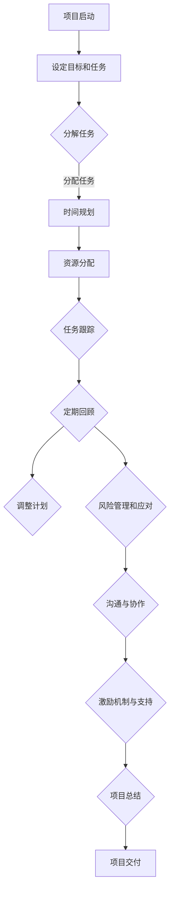
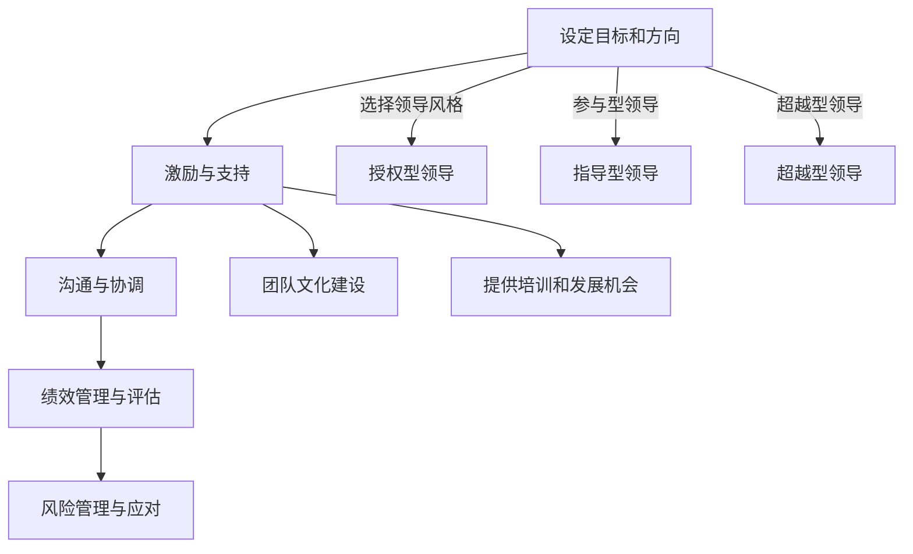
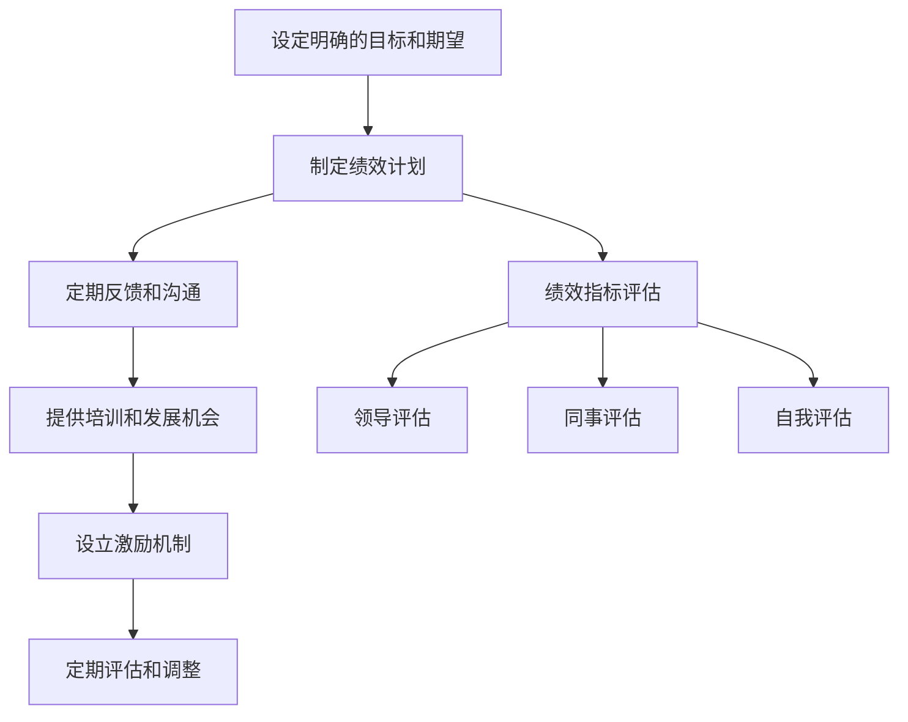

                 

## 文章标题

### 远程团队凝聚：跨越地理界限的团队建设

> 关键词：远程团队，团队建设，地理界限，凝聚力，协作，领导力，绩效评估

> 摘要：本文深入探讨了远程团队的建设与管理问题，从理论到实践，全面分析了远程团队面临的挑战与解决方案。文章首先介绍了远程团队的发展背景和重要性，随后详细阐述了远程团队凝聚力的构建策略，包括沟通与协作工具的运用、领导力的提升方法以及绩效评估与管理机制。通过实际案例和实战经验分享，文章为远程团队建设提供了切实可行的指导和建议，旨在帮助团队管理者跨越地理界限，打造高效、有序的远程团队。

## 引言与背景

### 1.1 远程团队的现状与挑战

随着互联网和通信技术的快速发展，远程工作已经成为一种常态。越来越多的企业和组织开始采用远程工作模式，以降低成本、提高效率、吸引和保留人才。然而，远程团队也面临着一系列独特的挑战。

#### 1.1.1 远程工作的兴起

远程工作最早可以追溯到20世纪90年代，随着互联网的普及，远程工作逐渐成为一种普遍的工作方式。特别是在新冠疫情爆发后，远程工作更是得到了前所未有的推广。根据国际数据公司（IDC）的报告，2020年全球远程工作人数达到了4亿人，约占全球劳动人口的28%。这一趋势表明，远程工作已经成为企业运营的一种新常态。

#### 1.1.2 远程工作的优势与挑战

远程工作具有很多优势，例如：

- **降低成本**：企业可以节省租金、水电等办公费用，同时员工也可以节省通勤时间和交通费用。
- **提高效率**：员工可以在更舒适的环境中工作，提高工作效率和创造力。
- **人才多样性**：企业可以招聘全球范围内的优秀人才，不受地理位置限制。

然而，远程工作也带来了一系列挑战，例如：

- **沟通障碍**：缺乏面对面的交流，可能导致信息传递不畅，理解偏差。
- **时间管理**：员工需要自我管理时间，避免工作与生活界限模糊。
- **团队凝聚力**：团队成员之间的信任和归属感可能减弱，影响团队协作效果。

#### 1.1.3 本书的核心目标

本书旨在解决远程团队建设中的关键问题，帮助团队管理者克服上述挑战，提升团队的整体绩效。具体目标如下：

- **明确远程团队建设的核心概念和原则**。
- **探讨如何提升远程团队的沟通与协作效率**。
- **分析远程团队的领导力和管理策略**。
- **提供实用的绩效评估和管理工具**。
- **分享成功的远程团队建设案例和实践经验**。

### 1.2 远程团队建设的意义

远程团队建设不仅是企业应对远程工作挑战的必要手段，更是提升企业竞争力的重要途径。以下是远程团队建设的几个重要意义：

#### 1.2.1 提高团队凝聚力

远程团队往往缺乏面对面的互动，容易导致成员之间缺乏信任和归属感。通过有效的团队建设，可以增强成员之间的联系，提高团队凝聚力。

#### 1.2.2 促进团队协作

远程团队需要依靠工具和技术进行协作，通过合理规划和有效使用这些工具，可以显著提升团队协作效率。

#### 1.2.3 提升团队绩效

远程团队建设可以帮助团队更好地管理资源和任务，提高整体绩效，为企业创造更大的价值。

#### 1.2.4 增强企业竞争力

拥有高效、有序的远程团队，可以更好地适应市场变化，抓住更多商机，提升企业的核心竞争力。

### 1.3 本书结构安排与目标读者

本书共分为七个主要部分，每个部分都涵盖了远程团队建设的重要方面。

- **第1章 引言与背景**：介绍远程团队的现状和挑战，以及本书的核心目标和意义。
- **第2章 远程团队建设的基础理论**：探讨远程团队的概念、特点和组织结构。
- **第3章 远程团队的沟通与协作**：分析远程沟通的障碍与对策，介绍协作工具和技术。
- **第4章 远程团队的领导力**：讨论远程领导者的角色、领导风格和激励方法。
- **第5章 远程团队的绩效评估与管理**：介绍绩效评估的指标和方法，以及绩效管理策略。
- **第6章 实战案例与经验分享**：分享成功的远程团队建设案例和实践经验。
- **第7章 总结与展望**：总结全书内容，探讨未来远程团队建设的发展趋势。

本书的目标读者包括：

- **远程团队管理者**：帮助其提升团队建设和管理能力。
- **IT行业从业者**：为远程工作的实践提供指导。
- **人力资源从业者**：为远程团队的人力资源管理提供参考。
- **对远程工作感兴趣的研究者**：提供远程团队建设的理论基础和实践案例。

## 远程团队建设的基础理论

### 2.1 远程团队的概念与特点

远程团队（Remote Team）是指团队成员分布在不同的地理位置，通过现代通信技术和协作工具进行工作的团队。与传统的集中式团队相比，远程团队具有以下特点：

#### 2.1.1 分布式

远程团队的成员可能分布在不同的城市、国家，甚至时区。这种分布性是远程团队最显著的特点之一，也是远程团队建设面临的最大挑战之一。

#### 2.1.2 高度依赖技术

远程团队的工作高度依赖于各种通信技术和协作工具，如视频会议、即时通讯、项目管理软件等。这些工具的有效使用是远程团队高效运作的关键。

#### 2.1.3 自我管理

远程团队成员通常需要自我管理，包括时间管理、任务管理、情绪管理等。自我管理能力的强弱直接影响到远程团队的工作效率。

#### 2.1.4 信任与沟通

远程团队需要建立良好的信任关系和沟通机制，以弥补地理距离带来的沟通障碍。信任和沟通是远程团队成功运作的基础。

### 2.2 远程团队建设的原则

为了确保远程团队的高效运作，团队建设需要遵循以下原则：

#### 2.2.1 透明性

远程团队的所有活动都应该是透明的，包括任务分配、进度报告、决策过程等。透明性有助于提高团队信任和协作效率。

#### 2.2.2 分享

远程团队需要鼓励成员分享信息、经验和资源，以提高团队的整体知识水平和协同效率。

#### 2.2.3 跨文化理解

由于远程团队成员可能来自不同的文化背景，团队建设需要注重跨文化理解，避免因文化差异引发的冲突。

#### 2.2.4 适应性

远程团队需要具备较强的适应性，能够快速响应环境变化和需求变化，以保持团队的高效运作。

#### 2.2.5 持续改进

远程团队建设是一个持续的过程，需要不断评估和改进，以适应不断变化的工作环境和团队需求。

### 2.3 远程团队的组织结构

远程团队的组织结构通常采用矩阵式或网络式结构，以适应分布式和自我管理的工作模式。

#### 2.3.1 矩阵式结构

矩阵式结构将团队成员分为纵向的项目团队和横向的功能团队，每个成员同时属于项目团队和功能团队。这种结构有助于充分发挥团队成员的专业技能，提高团队协作效率。

#### 2.3.2 网络式结构

网络式结构更加灵活，团队成员根据项目需求进行动态组合，没有固定的项目团队和功能团队。这种结构适合快速响应变化的工作环境，但需要较强的自我管理能力和沟通能力。

### 2.4 远程团队建设中的核心概念原理联系

为了更好地理解远程团队建设，我们需要掌握以下几个核心概念，并了解它们之间的联系。

#### 2.4.1 沟通与协作

沟通是远程团队工作的基础，协作则是团队完成任务的保障。有效的沟通能够确保信息的准确传递，协作则能够确保任务的顺利执行。沟通与协作之间是相辅相成的。

#### 2.4.2 领导力与执行力

领导力是远程团队成功的关键，它不仅包括对团队成员的指导和激励，还包括对团队整体目标的设定和执行。执行力则是将团队目标转化为实际成果的能力。

#### 2.4.3 绩效评估与管理

绩效评估是对团队成员工作表现的衡量，管理则是确保团队目标实现的过程。绩效评估与管理之间是相互关联的，评估结果将直接影响到团队管理策略的调整。

#### 2.4.4 自我管理与团队管理

自我管理是远程团队成员的基本能力，团队管理则是团队领导者的职责。自我管理能力越强，团队管理者的工作压力就越小，团队的整体效率也就越高。

### 2.5 远程团队建设的 Mermaid 流程图

为了更直观地展示远程团队建设的核心概念和流程，我们可以使用 Mermaid 工具绘制一个流程图。以下是远程团队建设流程的 Mermaid 表示：

```mermaid
graph TD
    A[引入背景] --> B{分析挑战}
    B -->|降低沟通障碍| C{提升团队凝聚力}
    B -->|提高协作效率| D{建立领导力模型}
    B -->|优化绩效管理} E{实施团队建设策略}
    C --> F{沟通工具应用}
    C --> G{团队文化建设}
    D --> H{领导风格选择}
    D --> I{激励机制设计}
    E --> J{建立协作机制}
    E --> K{制定管理策略}
    F --> L{实时沟通工具}
    F --> M{协作平台应用}
    G --> N{共同价值观}
    G --> O{共享经验与知识}
    H --> P{授权型领导}
    H --> Q{参与型领导}
    I --> R{奖励机制}
    I --> S{反馈机制}
    J --> T{任务分配与跟踪}
    J --> U{问题解决与决策}
    K --> V{目标设定与监控}
    K --> W{资源管理与支持}
```

通过这个流程图，我们可以清晰地看到远程团队建设的主要步骤和关键因素，以及它们之间的相互关系。

### 2.6 远程团队建设的基础理论讲解与伪代码实现

在理解了远程团队建设的核心概念和流程之后，我们需要进一步探讨如何将这些理论应用于实际工作中。以下是一个简单的伪代码示例，用于描述远程团队建设的基本步骤。

```python
# 远程团队建设伪代码

# 初始化远程团队
remote_team = initialize_remote_team()

# 建立沟通机制
communication_mechanism = build_communication_mechanism(team=remote_team)

# 确定团队目标
team_goals = define_team_goals()

# 建立协作机制
collaboration_mechanism = build_collaboration_mechanism(team=remote_team, goals=team_goals)

# 建立领导力模型
leadership_model = build_leadership_model(team=remote_team)

# 实施绩效管理
performance_management = implement_performance_management(team=remote_team, goals=team_goals)

# 持续改进
continuous_improvement = implement_continuous_improvement(team=remote_team, goals=team_goals, communication_mechanism=communication_mechanism, collaboration_mechanism=collaboration_mechanism, leadership_model=leadership_model, performance_management=performance_management)

# 输出结果
print("远程团队建设完成，团队成员已准备好开始工作。")
```

通过这个伪代码示例，我们可以看到远程团队建设的基本步骤和关键要素。在实际应用中，每个步骤都需要根据团队的具体情况进行调整和优化。

### 2.7 数学模型和公式讲解与举例说明

在远程团队建设中，数学模型和公式可以用来量化和管理团队的工作效率、沟通质量和绩效表现。以下是一个简单的数学模型，用于评估远程团队的沟通效率。

#### 2.7.1 沟通效率模型

沟通效率（E）可以用以下公式表示：

$$ E = \frac{有效沟通时间}{总沟通时间} $$

其中，有效沟通时间是指在沟通中能够准确传达信息和解决问题的部分，总沟通时间则是指所有的沟通时间。

#### 2.7.2 举例说明

假设一个远程团队在一个小时内进行了两场会议，会议总时长为40分钟。在这40分钟中，有30分钟的时间用于解决问题和传达信息，有10分钟的时间被用于其他非工作相关的讨论。那么，这个团队的沟通效率可以计算如下：

$$ E = \frac{30分钟}{40分钟} = 0.75 $$

这意味着，这个团队在沟通中的有效利用率为75%。

通过这个模型，团队管理者可以识别出沟通中的低效环节，并采取相应的措施进行改进。

### 2.8 远程团队建设中的注意事项与拓展阅读

在远程团队建设中，有一些关键的注意事项和拓展阅读资源，可以帮助团队管理者更好地理解和应用相关理论和实践。

#### 2.8.1 注意事项

1. **确保技术基础设施的稳定**：远程团队的工作高度依赖于技术工具，因此必须确保网络连接、通信工具等基础设施的稳定性。
2. **培养自我管理能力**：远程团队成员需要具备较强的自我管理能力，包括时间管理、任务管理和情绪管理。
3. **建立清晰的沟通渠道**：确保团队成员之间有明确的沟通渠道和规则，避免信息传递过程中的误解和冲突。
4. **关注团队成员的心理健康**：远程工作可能导致团队成员感到孤独和孤立，团队管理者需要关注团队成员的心理健康，提供必要的支持和帮助。

#### 2.8.2 拓展阅读

1. **《远程工作：挑战与机遇》**：这本书详细探讨了远程工作的各个方面，包括技术、管理、心理学等，为远程团队建设提供了丰富的理论基础和实践经验。
2. **《远程团队管理：策略与实践》**：这本书专注于远程团队管理，提供了大量实用的策略和案例分析，帮助团队管理者提升远程团队的管理能力。
3. **《敏捷团队建设：理论与实践》**：敏捷方法在远程团队管理中有着广泛的应用，这本书详细介绍了敏捷团队的建设和实践方法，为远程团队提供了有效的管理工具。

通过上述注意事项和拓展阅读，团队管理者可以更全面地了解远程团队建设的关键点和实践方法，从而提升团队的整体绩效。

## 远程团队的沟通与协作

### 3.1 远程沟通的障碍与对策

在远程团队中，沟通是团队协作的基础。然而，由于地理距离、时区差异、文化差异等因素，远程沟通面临着诸多障碍。了解这些障碍，并采取相应的对策，是确保远程团队高效运作的关键。

#### 3.1.1 障碍

1. **沟通延迟**：由于网络延迟或时区差异，信息传递可能会出现延迟，影响沟通的及时性和有效性。
2. **理解偏差**：远程沟通缺乏面对面的非语言线索，容易导致误解和沟通障碍。
3. **文化差异**：团队成员来自不同的文化背景，可能导致沟通风格、语言习惯和价值观的差异，影响沟通效果。
4. **技术依赖**：远程团队高度依赖通信工具和技术，技术故障或操作不当可能影响沟通质量。
5. **心理距离**：远程工作可能导致团队成员感到孤立和疏离，影响团队的凝聚力。

#### 3.1.2 对策

1. **使用即时通讯工具**：即时通讯工具如Slack、Microsoft Teams等，可以提供实时沟通渠道，减少沟通延迟。
2. **建立清晰的沟通规范**：制定沟通规范，包括沟通频率、沟通方式、信息传递标准等，确保团队成员了解沟通规则。
3. **利用视频会议**：视频会议可以提供面对面的交流，帮助团队成员更好地理解对方，减少误解。
4. **培训团队成员**：对团队成员进行沟通技能培训，提高他们的沟通技巧和跨文化沟通能力。
5. **建立支持系统**：为团队成员提供心理支持和咨询服务，帮助他们应对远程工作中的孤独和压力。

### 3.2 远程协作工具与技术

为了提升远程团队的协作效率，合理选择和使用协作工具至关重要。以下是一些常用的远程协作工具和技术：

#### 3.2.1 项目管理工具

1. **Trello**：Trello是一个可视化的项目管理工具，可以帮助团队清晰地规划和管理任务。
2. **Jira**：Jira是一个功能强大的项目管理工具，提供任务跟踪、bug管理和敏捷开发支持。
3. **Asana**：Asana是一个灵活的任务管理工具，适用于各种规模和类型的团队。

#### 3.2.2 文档共享与协作工具

1. **Google Workspace**：Google Workspace（包括Google Docs、Google Sheets等）提供在线文档共享和协作功能，支持实时编辑和评论。
2. **Notion**：Notion是一个多功能的笔记和组织工具，可以用于文档、笔记、数据库等。
3. **Confluence**：Confluence是一个团队协作平台，用于文档创作、知识分享和团队协作。

#### 3.2.3 视频会议与沟通工具

1. **Zoom**：Zoom是一个功能强大的视频会议工具，提供高清视频、音频和实时聊天功能。
2. **Microsoft Teams**：Microsoft Teams是一个集成通信和协作的平台，支持视频会议、聊天和文档共享。
3. **Slack**：Slack是一个即时通讯工具，支持聊天、视频会议和文档共享，适合团队日常沟通。

#### 3.2.4 版本控制工具

1. **Git**：Git是一个分布式版本控制工具，用于代码管理，支持多人协作和版本追踪。
2. **GitHub**：GitHub是一个基于Git的代码托管平台，提供代码管理、协作和项目跟踪功能。
3. **GitLab**：GitLab是一个自托管版本控制平台，提供Git功能，以及项目管理、代码审查和持续集成等。

通过合理选择和使用这些协作工具，远程团队可以更加高效地协同工作，提高团队的整体效率。

### 3.3 远程团队的项目管理

远程团队的项目管理需要特别的关注和策略，以确保项目的顺利进行和目标的实现。以下是一些关键的管理方法和实践：

#### 3.3.1 明确项目目标和任务

在项目启动阶段，明确项目的目标和任务是非常重要的。这包括：

- **设定清晰的项目目标**：确保所有团队成员都了解项目的最终目标。
- **分解任务**：将项目任务分解为可管理的子任务，并分配给相应的团队成员。

#### 3.3.2 制定详细的项目计划

- **时间规划**：为每个任务设定明确的时间表，确保任务按时完成。
- **资源分配**：合理分配团队成员的时间和资源，确保任务能够得到有效的执行。

#### 3.3.3 利用项目管理工具

- **任务跟踪**：使用项目管理工具（如Trello、Jira等）跟踪任务的进度和状态。
- **沟通与协作**：确保团队成员之间有有效的沟通渠道，及时更新任务状态和项目进展。

#### 3.3.4 定期回顾与调整

- **定期回顾**：定期举行项目回顾会议，评估项目进度和问题，及时调整计划。
- **风险管理与应对**：识别潜在风险，并制定相应的应对措施，确保项目能够按计划进行。

#### 3.3.5 激励与支持

- **激励机制**：为团队成员设立合理的激励机制，以鼓励他们积极参与项目。
- **心理支持**：提供心理支持，帮助团队成员应对远程工作中的压力和挑战。

通过这些项目管理方法，远程团队可以更好地协调工作，提高项目的成功率。

### 3.4 远程团队沟通与协作的 Mermaid 流程图

为了更好地展示远程团队沟通与协作的过程，我们可以使用 Mermaid 工具绘制一个流程图。以下是远程团队沟通与协作的基本流程图：



通过这个流程图，我们可以清晰地看到远程团队沟通与协作的主要步骤和关键环节，以及它们之间的相互关系。

### 3.5 远程团队沟通与协作的伪代码实现

为了更直观地展示远程团队沟通与协作的流程，我们可以使用伪代码来描述这个过程。以下是一个简单的伪代码示例：

```python
# 远程团队沟通与协作伪代码

# 初始化远程团队
remote_team = initialize_remote_team()

# 设定目标和任务
set_goals_and_tasks(team=remote_team)

# 分解任务
tasks = decompose_tasks(team=remote_team)

# 分配任务
assign_tasks(tasks=tasks)

# 时间规划
time_plan = plan_time(tasks=tasks)

# 资源分配
allocate_resources(time_plan=time_plan)

# 任务跟踪
track_tasks(tasks=tasks)

# 定期回顾
review_tasks(tasks=tasks)

# 调整计划
adjust_plan(time_plan=time_plan)

# 风险管理和应对
manage_risks()

# 沟通与协作
communicate_and Collaborate()

# 激励机制与支持
incentives_and_support()

# 项目总结
summary_project()

# 项目交付
deliver_project()
```

通过这个伪代码示例，我们可以看到远程团队沟通与协作的基本流程和关键步骤。在实际应用中，每个步骤都需要根据团队的具体情况进行调整和优化。

### 3.6 远程团队沟通与协作的数学模型和公式讲解与举例说明

在远程团队沟通与协作中，数学模型和公式可以帮助我们量化和管理团队的工作效率、沟通质量和协作效果。以下是一个简单的数学模型，用于评估远程团队的沟通效率。

#### 3.6.1 沟通效率模型

沟通效率（Efficiency）可以用以下公式表示：

$$
Efficiency = \frac{Effective \ Communication \ Time}{Total \ Communication \ Time}
$$

其中，Effective Communication Time 表示有效的沟通时间，Total Communication Time 表示总的沟通时间。

#### 3.6.2 举例说明

假设一个远程团队在一个小时内进行了两次沟通会议，每次会议的时长均为30分钟。在这60分钟的沟通时间里，有45分钟用于解决问题和任务讨论，15分钟被用于无关讨论。那么，这个团队的沟通效率可以计算如下：

$$
Efficiency = \frac{45分钟}{60分钟} = 0.75
$$

这意味着，这个团队在沟通中的有效利用率为75%。

通过这个模型，团队管理者可以识别出沟通中的低效环节，并采取相应的措施进行改进。

### 3.7 远程团队沟通与协作的最佳实践 tips、小结、注意事项、拓展阅读

#### 3.7.1 最佳实践 tips

1. **定期举行团队会议**：确保团队成员有固定的交流时间，增强团队凝聚力。
2. **使用多种沟通方式**：结合即时通讯、视频会议和邮件等多种沟通方式，确保信息传达的全面性和及时性。
3. **建立问题反馈机制**：鼓励团队成员提出问题和建议，及时解决团队协作中的障碍。

#### 3.7.2 小结

远程团队沟通与协作是远程团队高效运作的关键。通过明确沟通目标、建立规范的沟通渠道、合理选择协作工具和制定有效的项目管理策略，可以显著提升远程团队的协作效率和沟通质量。

#### 3.7.3 注意事项

1. **确保技术基础设施的稳定性**：确保网络连接、通信工具等基础设施的稳定性，减少沟通中断。
2. **关注团队成员的心理健康**：远程工作可能导致团队成员感到孤独和压力，需要提供心理支持和关怀。

#### 3.7.4 拓展阅读

1. **《远程工作的心理学》**：探讨远程工作对团队成员心理健康的影响，提供实用的心理支持策略。
2. **《敏捷项目管理实践》**：介绍敏捷方法在远程团队项目管理中的应用，提高团队协作效率。
3. **《远程团队协作工具指南》**：详细介绍各种远程协作工具的功能和最佳实践，帮助团队选择合适的协作工具。

通过这些最佳实践和拓展阅读，团队管理者可以更好地理解和应用远程团队沟通与协作的方法，提升团队的整体效率。

## 远程团队的领导力

### 4.1 远程领导者的角色与责任

远程领导者（Remote Leader）在远程团队中扮演着至关重要的角色。他们不仅要确保团队目标的实现，还需要应对远程工作带来的特殊挑战。以下是远程领导者的一些核心角色和责任：

#### 4.1.1 设定目标和方向

远程领导者需要明确团队的目标和愿景，确保所有成员都清楚了解团队的使命和期望。通过制定清晰的目标和规划，领导者可以为团队指引方向，激发团队成员的积极性和创造力。

#### 4.1.2 激励与支持

远程领导者需要关注团队成员的心理状态和工作动力。由于缺乏面对面的互动，远程团队成员可能会感到孤独和疏离。领导者需要通过定期沟通、鼓励和反馈等方式，提供心理支持和激励，帮助团队成员保持积极的态度。

#### 4.1.3 沟通与协调

远程领导者需要确保团队内部和跨团队之间的有效沟通。他们需要建立合适的沟通机制，确保信息的及时传递和问题的高效解决。同时，领导者还需要在团队之间协调资源，解决协作中的冲突和障碍。

#### 4.1.4 绩效管理与评估

远程领导者需要对团队成员的工作绩效进行管理和评估。他们需要制定合理的绩效指标，定期检查任务进度，并提供及时的反馈和指导。通过有效的绩效管理，领导者可以确保团队目标的实现，并帮助团队成员不断提升自己的能力。

#### 4.1.5 风险管理与应对

远程领导者需要具备较强的风险意识和应对能力。他们需要识别潜在的风险，并制定相应的应对策略。在远程团队中，风险可能包括技术故障、沟通障碍、任务延误等。领导者需要及时应对这些风险，确保项目能够按计划进行。

### 4.2 远程领导者的领导风格

远程领导者的领导风格对于团队的绩效和氛围具有重要影响。以下是几种常见的远程领导风格：

#### 4.2.1 授权型领导

授权型领导（Empowering Leadership）是一种以信任和自主性为核心的领导风格。领导者通过授权团队成员，让他们拥有更多的决策权和责任，从而激发团队成员的积极性和创造力。这种领导风格适合高度自我管理的远程团队。

- **优点**：提高团队成员的自主性和责任感，促进团队创新和成长。
- **缺点**：需要领导者具备较强的信任和沟通能力，否则可能导致团队失控。

#### 4.2.2 参与型领导

参与型领导（Participative Leadership）是一种强调团队成员参与决策和问题解决的领导风格。领导者鼓励团队成员提出意见和建议，共同制定团队目标和计划。这种领导风格有助于增强团队的凝聚力和归属感。

- **优点**：增强团队成员的参与感和责任感，提高团队决策的质量。
- **缺点**：决策过程可能较慢，需要领导者具备良好的沟通和协调能力。

#### 4.2.3 指导型领导

指导型领导（Directing Leadership）是一种以指导和监督为核心的传统领导风格。领导者通过明确的指示和监督，确保团队成员按照计划执行任务。这种领导风格在远程团队中可能较为常见，尤其是在任务较为明确和团队成员经验不足的情况下。

- **优点**：确保任务的顺利进行和目标的实现，提高团队执行力。
- **缺点**：可能抑制团队成员的自主性和创造力，影响团队的长期发展。

#### 4.2.4 超越型领导

超越型领导（Transformational Leadership）是一种注重变革和激励的领导风格。领导者通过激发团队成员的潜能，推动团队实现卓越表现。这种领导风格在远程团队中具有很高的应用价值，特别是在面对复杂挑战和需要创新突破时。

- **优点**：激发团队成员的积极性和创造力，推动团队实现长期目标。
- **缺点**：需要领导者具备较强的领导力和影响力，否则可能导致团队动力不足。

### 4.3 远程团队的激励与士气提升

在远程团队中，保持团队成员的士气和动力是一个重要挑战。以下是一些有效的激励和士气提升策略：

#### 4.3.1 设定清晰的目标和期望

为团队成员设定明确的目标和期望，让他们了解自己的工作价值和团队的愿景。这有助于提高团队成员的积极性和责任感。

#### 4.3.2 定期反馈和认可

通过定期的反馈和认可，领导者可以及时了解团队成员的工作情况，并给予肯定和鼓励。这有助于增强团队成员的自信心和归属感。

#### 4.3.4 提供培训和发展机会

为团队成员提供培训和发展机会，帮助他们提升技能和职业发展。这不仅可以提高团队的整体能力，还可以增强团队成员的满意度和忠诚度。

#### 4.3.5 建立团队文化

建立积极、互助的团队文化，增强团队成员之间的联系和信任。这可以通过团队建设活动、虚拟社交平台等方式实现。

通过上述激励和士气提升策略，远程领导者可以保持团队成员的积极性和创造力，提高团队的整体绩效。

### 4.4 远程团队领导力的 Mermaid 流程图

为了更直观地展示远程团队领导力的核心步骤和关键环节，我们可以使用 Mermaid 工具绘制一个流程图。以下是远程团队领导力的基本流程图：



通过这个流程图，我们可以清晰地看到远程团队领导力的主要步骤和关键因素，以及它们之间的相互关系。

### 4.5 远程团队领导力的伪代码实现

为了更直观地展示远程团队领导力的流程，我们可以使用伪代码来描述这个过程。以下是一个简单的伪代码示例：

```python
# 远程团队领导力伪代码

# 初始化远程团队
remote_team = initialize_remote_team()

# 设定目标和方向
set_goals_and_direction(team=remote_team)

# 激励与支持
motivate_and_support(team=remote_team)

# 沟通与协调
communicate_and协调(coordinator=remote_team)

# 绩效管理与评估
manage_performance(team=remote_team)

# 风险管理与应对
manage_risks_and_response(team=remote_team)

# 团队文化建设
build_team_culture(team=remote_team)

# 提供培训和发展机会
provide_train_and_development(opportunities=remote_team)

# 选择领导风格
choose_leadership_style(team=remote_team)
```

通过这个伪代码示例，我们可以看到远程团队领导力的基本流程和关键步骤。在实际应用中，每个步骤都需要根据团队的具体情况进行调整和优化。

### 4.6 远程团队领导力的数学模型和公式讲解与举例说明

在远程团队领导力中，数学模型和公式可以帮助我们量化和管理团队的工作效率、沟通质量和绩效表现。以下是一个简单的数学模型，用于评估远程团队的领导力效率。

#### 4.6.1 领导力效率模型

领导力效率（Leadership Efficiency）可以用以下公式表示：

$$
Leadership \ Efficiency = \frac{Effective \ Leadership \ Activities}{Total \ Leadership \ Activities}
$$

其中，Effective Leadership Activities 表示有效的领导力活动，Total Leadership Activities 表示总的领导力活动。

#### 4.6.2 举例说明

假设一个远程团队在一个季度内进行了10次领导力活动，其中有7次是有效的，3次是低效的。那么，这个团队的领导力效率可以计算如下：

$$
Leadership \ Efficiency = \frac{7次}{10次} = 0.7
$$

这意味着，这个团队的领导力活动有效率为70%。

通过这个模型，团队管理者可以识别出领导力活动中的低效环节，并采取相应的措施进行改进。

### 4.7 远程团队领导力的最佳实践 tips、小结、注意事项、拓展阅读

#### 4.7.1 最佳实践 tips

1. **定期沟通与反馈**：定期与团队成员沟通，了解他们的工作情况和需求，提供及时的反馈和指导。
2. **建立信任关系**：通过开放、透明的沟通和合作，建立团队成员之间的信任关系。
3. **培养团队文化**：通过团队活动、虚拟社交等方式，营造积极、互助的团队氛围。

#### 4.7.2 小结

远程团队领导力是确保远程团队高效运作的关键。通过设定明确的目标、激励团队成员、提供培训和发展机会以及建立信任关系，远程领导者可以提升团队的整体绩效。

#### 4.7.3 注意事项

1. **关注团队成员的心理健康**：远程工作可能导致团队成员感到孤独和压力，需要提供心理支持和关怀。
2. **确保技术基础设施的稳定性**：确保网络连接、通信工具等基础设施的稳定性，减少沟通中断。

#### 4.7.4 拓展阅读

1. **《远程团队领导力：策略与实践》**：详细介绍远程团队领导力的理论和实践方法，帮助领导者提升管理能力。
2. **《激励心理学》**：探讨激励理论在远程团队中的应用，为领导者提供实用的激励策略。
3. **《团队文化建设》**：介绍团队文化的重要性以及如何建立和维护团队文化，提升团队凝聚力。

通过这些最佳实践和拓展阅读，远程领导者可以更好地理解和应用领导力方法，提升团队的整体绩效。

## 远程团队的绩效评估与管理

### 5.1 远程团队绩效评估的指标

在远程团队中，绩效评估（Performance Evaluation）是确保团队成员工作表现与团队目标一致的关键环节。由于远程团队的特殊性，绩效评估需要考虑多种指标，以确保评估的全面性和准确性。以下是远程团队绩效评估的主要指标：

#### 5.1.1 任务完成度

任务完成度是评估团队成员完成任务情况的基本指标。它包括任务的完成时间、任务质量以及任务完成的比例。任务完成度可以量化团队成员的工作效率和责任心。

- **定量指标**：如任务完成率、任务完成时间等。
- **定性指标**：如任务的完成质量、任务的完成效果等。

#### 5.1.2 工作效率

工作效率是评估团队成员在单位时间内完成工作量的指标。工作效率不仅包括任务的完成速度，还包括工作过程中的资源利用率。

- **定量指标**：如每小时完成的任务数量、每小时的工作时长等。
- **定性指标**：如工作流程的优化程度、工作资源的有效分配等。

#### 5.1.3 沟通质量

沟通质量是评估团队成员之间沟通效果和协作能力的指标。远程团队依赖有效的沟通来确保任务顺利进行，因此沟通质量对于团队绩效至关重要。

- **定量指标**：如沟通延迟时间、沟通效率等。
- **定性指标**：如沟通的准确性、沟通的及时性等。

#### 5.1.4 创新能力

创新能力是评估团队成员在解决问题和新任务中的创新能力。创新能力可以体现团队成员的创造力和解决问题的能力，对于团队的长远发展至关重要。

- **定量指标**：如提出的创新方案数量、创新方案的实施效果等。
- **定性指标**：如创新方案的可行性、创新方案的创新程度等。

#### 5.1.5 团队合作精神

团队合作精神是评估团队成员在团队工作中的协作能力和团队意识。团队合作精神可以体现团队成员的团队意识和团队责任感。

- **定量指标**：如团队任务完成的协同程度、团队合作的反馈等。
- **定性指标**：如团队协作的积极性、团队合作的满意度等。

### 5.2 远程团队绩效评估的方法

为了确保绩效评估的全面性和客观性，远程团队可以采用多种评估方法。以下是几种常见的绩效评估方法：

#### 5.2.1 自我评估

自我评估（Self-Assessment）是一种由团队成员自我评价的方法。这种方法鼓励团队成员反思自己的工作表现，识别自己的优势和不足。自我评估的结果可以作为绩效评估的一部分，同时也可以帮助团队成员制定个人发展计划。

- **优点**：增强团队成员的参与感和自我管理能力。
- **缺点**：可能存在自我评价不准确的问题，需要与其他评估方法结合使用。

#### 5.2.2 同事评估

同事评估（Peer Assessment）是由团队成员相互评价的方法。这种方法可以提供多样化的视角，帮助团队管理者更全面地了解团队成员的工作表现。同事评估通常包括匿名评价和公开评价两种形式。

- **优点**：提供多样化的评估视角，促进团队成员之间的反馈和协作。
- **缺点**：可能存在评价主观性和偏颇，需要确保评估过程的公平性和透明性。

#### 5.2.3 领导评估

领导评估（Manager Assessment）是由团队领导者对团队成员进行评估的方法。这种方法通常基于团队领导者的观察和反馈，可以提供对团队成员工作表现的直接评价。领导评估通常是绩效评估的核心部分。

- **优点**：能够提供直接、具体的反馈，有助于团队管理者了解团队成员的实际工作情况。
- **缺点**：可能存在主观性和偏颇，需要确保评估过程的客观性和公平性。

#### 5.2.4 绩效指标评估

绩效指标评估（Performance Indicator Assessment）是基于具体绩效指标进行评估的方法。这种方法通过量化指标来衡量团队成员的工作表现，具有较高的客观性和可操作性。

- **优点**：量化评估结果，提高评估的准确性和可操作性。
- **缺点**：可能忽略团队成员的综合表现和团队合作精神，需要与其他评估方法结合使用。

### 5.3 远程团队的绩效管理策略

为了确保远程团队的绩效评估能够有效提升团队的整体绩效，需要采取一系列的绩效管理策略。以下是几种常见的绩效管理策略：

#### 5.3.1 设定明确的目标和期望

在绩效管理过程中，设定明确的目标和期望是关键。团队领导者需要与团队成员共同制定具体、可衡量的目标，并明确预期的工作成果和标准。这有助于团队成员了解自己的工作方向和期望，提高工作动力。

#### 5.3.2 定期反馈和沟通

定期反馈和沟通是绩效管理的重要环节。团队领导者需要定期与团队成员进行沟通，了解他们的工作进展和遇到的困难，并提供及时的反馈和建议。这有助于团队成员及时调整工作方向，提高工作效率。

#### 5.3.3 提供培训和发展机会

为了提升团队成员的技能和职业发展，团队领导者需要提供培训和发展机会。这可以包括在线培训、专业研讨会、技能提升课程等。通过培训和发展，团队成员可以不断提升自己的能力，为团队的发展做出更大贡献。

#### 5.3.4 设立激励机制

为了激发团队成员的工作积极性和创造力，团队领导者可以设立激励机制。这可以包括绩效奖金、荣誉称号、晋升机会等。合理的激励机制可以增强团队成员的归属感和工作动力，提高团队的整体绩效。

#### 5.3.5 定期评估和调整

绩效管理是一个持续的过程，需要定期评估和调整。团队领导者需要定期检查绩效评估的结果，了解团队成员的工作表现和团队的总体绩效。根据评估结果，及时调整绩效目标和策略，确保团队目标的实现。

通过上述绩效管理策略，远程团队可以有效地提升绩效，实现团队目标。

### 5.4 远程团队绩效评估与管理的 Mermaid 流程图

为了更直观地展示远程团队绩效评估与管理的过程，我们可以使用 Mermaid 工具绘制一个流程图。以下是远程团队绩效评估与管理的基本流程图：



通过这个流程图，我们可以清晰地看到远程团队绩效评估与管理的主要步骤和关键环节，以及它们之间的相互关系。

### 5.5 远程团队绩效评估与管理的伪代码实现

为了更直观地展示远程团队绩效评估与管理的过程，我们可以使用伪代码来描述这个过程。以下是一个简单的伪代码示例：

```python
# 远程团队绩效评估与管理伪代码

# 初始化远程团队
remote_team = initialize_remote_team()

# 设定明确的目标和期望
set_goals_and_expectations(team=remote_team)

# 制定绩效计划
create_performance_plan(team=remote_team)

# 定期反馈和沟通
perform_regular_feedacks(team=remote_team)

# 提供培训和发展机会
provide_training_and_development(team=remote_team)

# 设立激励机制
establish_incentive_program(team=remote_team)

# 定期评估和调整
perform_regular_evaluation_and_adjustment(team=remote_team)

# 绩效指标评估
evaluate_performance_based_on_indicators(team=remote_team)

# 领导评估
perform_manager_evaluation(team=remote_team)

# 同事评估
perform_peer_evaluation(team=remote_team)

# 自我评估
perform_self_evaluation(team=remote_team)
```

通过这个伪代码示例，我们可以看到远程团队绩效评估与管理的基本流程和关键步骤。在实际应用中，每个步骤都需要根据团队的具体情况进行调整和优化。

### 5.6 远程团队绩效评估与管理的数学模型和公式讲解与举例说明

在远程团队绩效评估与管理中，数学模型和公式可以帮助我们量化和管理团队的工作效率、沟通质量和绩效表现。以下是一个简单的数学模型，用于评估远程团队的绩效效率。

#### 5.6.1 绩效效率模型

绩效效率（Performance Efficiency）可以用以下公式表示：

$$
Performance \ Efficiency = \frac{Total \ Achievements}{Total \ Efforts}
$$

其中，Total Achievements 表示团队在特定时间段内实现的工作成果，Total Efforts 表示团队在实现这些成果时所投入的总工作量。

#### 5.6.2 举例说明

假设一个远程团队在一个季度内完成了50个任务，这些任务共计花费了团队成员2000小时的工作时间。那么，这个团队的绩效效率可以计算如下：

$$
Performance \ Efficiency = \frac{50个任务}{2000小时} = 0.025
$$

这意味着，这个团队在特定时间段内的绩效效率为2.5%。

通过这个模型，团队管理者可以识别出绩效效率低的环节，并采取相应的措施进行改进。

### 5.7 远程团队绩效评估与管理的最佳实践 tips、小结、注意事项、拓展阅读

#### 5.7.1 最佳实践 tips

1. **设定明确的目标和期望**：确保团队成员了解团队的目标和期望，提高工作方向的一致性。
2. **定期反馈和沟通**：通过定期的反馈和沟通，及时了解团队成员的工作进展和困难，提供支持和指导。
3. **提供培训和发展机会**：帮助团队成员提升技能和职业发展，增强团队的整体竞争力。
4. **设立激励机制**：通过设立合理的激励机制，激发团队成员的工作积极性和创造力。
5. **定期评估和调整**：根据评估结果，及时调整绩效目标和策略，确保团队目标的实现。

#### 5.7.2 小结

远程团队绩效评估与管理是确保团队高效运作的重要环节。通过设定明确的目标、定期反馈和沟通、提供培训和发展机会、设立激励机制以及定期评估和调整，远程团队可以提升整体绩效，实现团队目标。

#### 5.7.3 注意事项

1. **确保评估的公平性和客观性**：避免评估过程中的主观性和偏颇，确保评估结果的公正。
2. **关注团队成员的心理健康**：远程工作可能导致团队成员感到压力和孤独，需要提供心理支持和关怀。

#### 5.7.4 拓展阅读

1. **《绩效管理实践指南》**：详细介绍绩效管理的理论和方法，提供实用的管理工具和实践经验。
2. **《远程团队绩效评估方法》**：探讨远程团队绩效评估的多种方法和策略，帮助团队管理者提升绩效管理水平。
3. **《团队激励与薪酬管理》**：介绍团队激励和薪酬管理的理论和实践，为团队管理者提供有效的激励机制设计思路。

通过这些最佳实践和拓展阅读，团队管理者可以更好地理解和应用绩效评估与管理的方法，提升团队的整体绩效。

## 实战案例与经验分享

### 6.1 国内外远程团队建设成功案例

#### 6.1.1 国内案例：腾讯远程团队

腾讯是中国领先的互联网科技公司，其远程团队建设经验值得借鉴。腾讯通过以下几个关键措施来建设远程团队：

1. **明确目标和职责**：每个远程团队成员都清楚自己的工作目标和职责，确保团队目标的统一性。
2. **灵活的协作工具**：腾讯采用了多种协作工具，如腾讯会议、QQ、腾讯文档等，提高了团队协作效率。
3. **定期团队活动**：腾讯定期组织远程团队活动，如线上团建、分享会等，增强团队凝聚力和归属感。
4. **绩效激励机制**：腾讯为远程团队成员设立了明确的绩效目标和激励机制，鼓励团队成员积极工作。

通过这些措施，腾讯的远程团队在高效协作和绩效管理方面取得了显著成效。

#### 6.1.2 国际案例：GitHub

GitHub是全球领先的代码托管和协作平台，其远程团队建设经验在全球范围内具有广泛的影响力。GitHub采取了以下措施来建设远程团队：

1. **文化认同**：GitHub非常注重团队文化，强调开放、透明和创新，这些价值观贯穿于整个远程团队建设中。
2. **灵活的工作时间**：GitHub允许团队成员灵活安排工作时间，以适应不同的生活节奏和工作需求。
3. **多样化的沟通工具**：GitHub采用了多种沟通工具，如Slack、Zoom、GitHub Issues等，确保团队成员之间的有效沟通。
4. **持续的职业发展**：GitHub为远程团队成员提供丰富的培训和发展机会，帮助他们不断提升自己的技能和职业素养。

这些措施使得GitHub的远程团队能够高效运作，持续创新，取得了卓越的成绩。

### 6.2 远程团队建设中的问题与解决方案

#### 6.2.1 沟通障碍

**问题**：远程团队中沟通障碍可能导致信息传递不畅，影响团队协作效果。

**解决方案**：

1. **建立明确的沟通渠道**：确保团队成员了解并使用统一的沟通工具和渠道，减少信息传递的复杂性。
2. **定期组织沟通会议**：通过定期组织线上会议，确保团队成员之间的及时沟通和问题解决。
3. **培养良好的沟通习惯**：通过培训和实践，提高团队成员的沟通技巧和跨文化沟通能力。

#### 6.2.2 时间管理

**问题**：远程团队成员需要自我管理时间，但容易受到生活环境的干扰，导致工作效率下降。

**解决方案**：

1. **制定合理的工作计划**：帮助团队成员制定详细的工作计划，明确任务和时间安排。
2. **提供时间管理工具**：推荐使用时间管理工具，如Trello、Asana等，帮助团队成员更好地规划和管理时间。
3. **建立监督机制**：通过定期的进度报告和任务检查，确保团队成员按照计划完成任务。

#### 6.2.3 团队凝聚力

**问题**：远程工作可能导致团队成员感到孤独和疏离，影响团队凝聚力。

**解决方案**：

1. **组织团队活动**：通过线上团建活动、虚拟社交平台等，增强团队成员之间的互动和联系。
2. **设立团队目标**：明确团队目标，增强团队成员的归属感和责任感。
3. **提供心理支持**：为团队成员提供心理支持和咨询服务，帮助他们应对远程工作中的孤独和压力。

### 6.3 个人与团队的成长与转变

#### 6.3.1 个人成长

通过远程团队工作，个人可以享受到以下成长机会：

1. **技能提升**：远程工作提供了丰富的学习和成长资源，如在线课程、技术文档等，帮助个人不断提升自己的技能和知识。
2. **自我管理**：远程工作要求个人具备良好的自我管理能力，包括时间管理、任务管理和情绪管理，这些能力对个人的职业发展具有长期价值。
3. **职业发展**：远程团队通常提供灵活的职业发展机会，如晋升、跨部门调动等，为个人提供更多的职业发展路径。

#### 6.3.2 团队转变

远程团队建设不仅有助于个人成长，也对团队产生了积极的影响：

1. **协作效率**：远程协作工具和技术的应用，提高了团队协作的效率和效果，促进了团队目标的实现。
2. **创新能力**：远程工作环境激发了团队成员的创新思维，促进了新想法和新解决方案的产生。
3. **文化多样性**：远程团队由来自不同文化背景的成员组成，这种多样性为团队带来了丰富的观点和经验，促进了团队的创新和进步。

通过以上实战案例与经验分享，我们可以看到远程团队建设的重要性和有效性。通过借鉴成功案例，解决常见问题，个人和团队都可以在远程工作中实现成长与转变。

## 总结与展望

### 7.1 远程团队建设的总结

远程团队建设是现代企业应对远程工作挑战的重要手段。通过有效的团队建设，企业可以提升团队凝聚力、协作效率和绩效表现，从而在竞争激烈的市场中保持优势。本文从远程团队的现状与挑战、基础理论、沟通与协作、领导力、绩效评估与管理等方面，全面探讨了远程团队建设的方法和策略。

#### 7.1.1 核心观点回顾

- 远程团队建设的重要性在于提高团队凝聚力、促进团队协作和提升整体绩效。
- 远程团队面临的主要挑战包括沟通障碍、时间管理、团队凝聚力等。
- 远程团队建设需要遵循透明性、分享、跨文化理解和适应性等原则。
- 沟通与协作是远程团队运作的基础，需要使用多种工具和技术来提高效率。
- 远程领导力需要关注团队成员的心理健康和工作动力，选择合适的领导风格。
- 绩效评估与管理是确保远程团队目标实现的关键环节。

#### 7.1.2 成果与贡献

本文通过理论阐述、案例分析和实践指导，为远程团队建设提供了系统的参考框架。本文的核心贡献在于：

1. **明确了远程团队建设的核心概念和原则**，为团队管理者提供了理论基础。
2. **提供了多种远程沟通与协作工具和方法的详细分析**，帮助团队提升工作效率。
3. **探讨了远程领导力的关键要素和策略**，为远程领导者提供了实践指导。
4. **提出了绩效评估与管理的具体方法和策略**，帮助团队实现目标。

### 7.2 未来远程团队建设的发展趋势

随着技术的发展和市场的变化，远程团队建设将继续演进。以下是未来远程团队建设可能的发展趋势：

#### 7.2.1 技术创新

随着人工智能、虚拟现实、区块链等技术的不断发展，远程团队将采用更多创新的协作工具和技术。这些技术将进一步提高远程团队的协作效率和工作体验。

#### 7.2.2 文化多样性

全球化的进程将导致远程团队的文化多样性日益增加。团队管理者需要更加注重跨文化理解和沟通，以促进团队的多元化和创新。

#### 7.2.3 智能化

人工智能和大数据分析将在远程团队管理中发挥重要作用。通过智能化的管理工具，团队可以更精确地评估团队成员的表现和团队的整体绩效。

#### 7.2.4 持续学习

随着远程工作模式的普及，团队管理者需要不断学习和适应新的管理方法和技术。持续学习将成为远程团队建设的重要组成部分。

### 7.3 对远程团队建设者的建议

针对远程团队建设者，以下是几点建议：

#### 7.3.1 重视团队文化建设

团队文化建设是远程团队成功的关键。建设一个积极、互助和开放的团队文化，有助于提高团队的凝聚力和工作效率。

#### 7.3.2 注重沟通与协作

确保团队成员之间有充分的沟通和协作，使用合适的工具和方法，提高团队协作效率。

#### 7.3.3 关注团队成员的心理健康

关注团队成员的心理健康，提供必要的心理支持和关怀，帮助他们应对远程工作中的压力和挑战。

#### 7.3.4 持续优化绩效管理

定期评估和优化绩效管理方法，确保绩效评估的公平性和准确性，激励团队成员不断提升自己的能力。

通过以上建议，远程团队建设者可以更好地应对远程工作带来的挑战，提升团队的整体绩效。

## 作者信息

作者：AI天才研究院/AI Genius Institute & 禅与计算机程序设计艺术 /Zen And The Art of Computer Programming

感谢您阅读本书，希望本书能为您提供关于远程团队建设的有益见解和实践指导。期待与您在远程团队建设的道路上共同成长与进步。如果您有任何建议或反馈，欢迎随时与我们联系。再次感谢您的支持！

