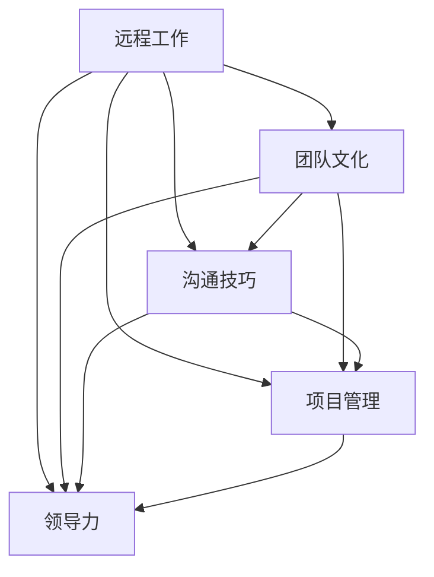

                 


### 远程团队协作：克服距离障碍的策略

#### 关键词：
- 远程团队协作
- 距离障碍
- 沟通策略
- 项目管理
- 领导力

#### 摘要：
在当今全球化的工作环境中，远程团队协作已成为一种常态。然而，距离障碍带来的沟通不畅、协作困难等问题依然存在。本文将探讨远程团队协作中的主要挑战，并详细解析克服这些障碍的策略，包括构建高效的团队文化、提升沟通技巧、实施有效的项目管理和领导力，以及分享成功案例和未来趋势。通过本文，读者将全面了解如何在远程团队中实现高效协作。

## 第一部分：远程团队协作概述

### 第1章：远程团队协作的兴起与挑战

#### 1.1 远程团队协作的背景
随着互联网和移动设备的普及，远程工作模式逐渐成为一种趋势。远程团队协作不仅节省了企业成本，提高了工作效率，还吸引了许多希望拥有灵活工作时间的优秀人才。然而，远程团队协作也面临着一系列挑战，如沟通不畅、时间管理困难、团队合作问题等。

#### 1.2 远程团队协作的优势与挑战
远程团队协作的优势包括灵活的工作时间、降低办公成本、吸引更多全球人才等。但同时也面临着挑战，如地理距离导致沟通障碍、文化差异带来的误解、对工作进度难以控制等。这些挑战需要通过有效的策略来解决。

#### 1.3 本书的内容结构
本书分为三个部分，分别介绍远程团队协作的概述、策略和成功案例，旨在帮助读者全面了解远程团队协作的各个方面，并提供实用的解决方案。

### 第2章：远程团队协作的核心概念

#### 2.1 远程工作的定义与类型
远程工作指的是通过互联网和通信技术在不同地点进行工作。远程工作类型包括全职远程工作、兼职远程工作、远程办公日等。

#### 2.2 远程协作的优势与局限性
远程协作的优势包括提高工作效率、减少通勤时间、节省办公成本等。但局限性也显而易见，如缺乏面对面的交流、文化差异导致的沟通障碍等。

#### 2.3 远程协作的关键要素
远程协作的关键要素包括清晰的沟通、有效的项目管理、团队的信任和透明度等。这些要素是确保远程团队协作成功的关键。

## 第二部分：远程团队协作的策略

### 第3章：构建高效的远程团队文化

#### 3.1 培养信任与透明度
信任是远程团队协作的基础。通过建立透明的沟通渠道，团队成员可以更好地理解彼此的职责和工作进度，从而增强信任。

#### 3.2 促进沟通与协作
沟通是远程团队协作的核心。利用现代沟通工具，如视频会议、即时通讯、项目管理软件等，可以确保团队成员之间的有效沟通。

#### 3.3 建立明确的团队目标与期望
明确的团队目标有助于团队成员了解自己的工作职责和期望。通过制定共同的目标，团队成员可以更专注于团队的整体利益。

### 第4章：远程团队沟通技巧

#### 4.1 沟通障碍与克服策略
远程团队协作中常见的沟通障碍包括时区差异、文化差异、技术问题等。通过提前规划、使用专业的沟通工具和定期反馈，可以克服这些障碍。

#### 4.2 利用现代沟通工具
现代沟通工具，如Slack、Trello、Zoom等，为远程团队协作提供了便捷的沟通和协作方式。了解并有效利用这些工具是远程团队协作成功的关键。

#### 4.3 面对面的虚拟会议技巧
虚拟会议是远程团队协作的重要形式。掌握虚拟会议的技巧，如提前准备、有效主持会议、确保参与度等，可以确保虚拟会议的顺利进行。

### 第5章：项目管理与远程团队协作

#### 5.1 远程项目管理的挑战与对策
远程项目管理面临挑战，如难以监控项目进度、团队成员参与度不高等。通过采用敏捷开发方法、制定明确的工作流程和利用项目管理工具，可以应对这些挑战。

#### 5.2 远程团队的工作流程与工具
远程团队的工作流程需要适应远程协作的特点。利用项目管理工具，如Jira、Trello等，可以更好地管理项目进度、任务分配和团队协作。

#### 5.3 项目进度跟踪与风险管理
实时跟踪项目进度和风险管理是远程团队协作的重要环节。通过定期的进度报告、风险分析和应对措施，可以确保项目顺利进行。

### 第6章：远程团队的个性管理

#### 6.1 管理远程团队成员的个性差异
远程团队成员的个性差异可能会影响团队协作。通过了解和尊重团队成员的个性，可以更好地管理团队，提高协作效率。

#### 6.2 建立个性化的激励与反馈机制
个性化的激励和反馈机制可以激发团队成员的积极性。通过定期反馈、认可和奖励，可以增强团队成员的归属感和工作动力。

#### 6.3 促进团队内部个人成长与发展
为团队成员提供成长机会和发展空间是远程团队管理的重要任务。通过培训和职业发展规划，可以促进团队成员的个人成长。

### 第7章：远程团队的领导力

#### 7.1 远程团队领导的角色与职责
远程团队领导需要具备独特的领导能力，如有效的沟通、团队管理、任务分配等。了解领导角色的职责是成功领导远程团队的关键。

#### 7.2 领导远程团队的策略与方法
远程团队领导需要采用适合远程协作的策略和方法，如建立透明的沟通渠道、制定明确的团队目标、提供支持与资源等。

#### 7.3 激发远程团队的创造力与凝聚力
远程团队领导需要激发团队的创造力和凝聚力。通过鼓励创新、提供反馈和支持、促进团队合作，可以提升团队的绩效和凝聚力。

## 第三部分：远程团队协作的成功案例

### 第8章：远程团队协作的最佳实践

#### 8.1 成功远程团队的案例分析
通过分析成功远程团队的案例，可以了解他们在团队文化、沟通技巧、项目管理等方面采取的有效策略。

#### 8.2 最佳实践分享
分享最佳实践可以帮助其他远程团队借鉴和改进。通过学习其他团队的成功经验，可以更好地应对远程协作中的挑战。

#### 8.3 从失败中学习
从失败中学习是远程团队协作的重要一环。通过分析失败案例，可以识别问题并找到改进的方向。

### 第9章：未来远程团队的发展趋势

#### 9.1 新技术对远程团队协作的影响
随着新技术的不断发展，远程团队协作也将迎来新的机遇和挑战。了解新技术的影响可以帮助团队更好地适应未来发展。

#### 9.2 远程工作模式的未来发展
远程工作模式将继续发展，成为企业运营的重要组成部分。了解远程工作模式的未来发展可以帮助团队制定长期规划。

#### 9.3 远程团队协作的未来挑战与机遇
未来远程团队协作将面临新的挑战，如更高效的沟通、更灵活的工作流程、更强大的领导力等。同时，也将迎来新的机遇，如全球人才库的扩大、创新能力的提升等。

## 附录：远程团队协作资源汇总

### A.1 远程协作工具推荐
列出一系列适合远程团队协作的工具，如Slack、Trello、Zoom等，并提供简要的介绍和评价。

### A.2 有价值的远程团队资源
推荐一些对远程团队协作有价值的资源，如书籍、文章、网站等，以供读者进一步学习和参考。

### A.3 进一步阅读资料
提供一些相关的阅读资料，如学术论文、技术博客、行业报告等，以帮助读者深入探索远程团队协作的各个方面。

---

### 远程团队协作：克服距离障碍的策略

在当今全球化背景下，远程团队协作已成为企业运营的重要组成部分。然而，距离障碍带来的沟通不畅、协作困难等问题仍然困扰着许多团队。本文将深入探讨远程团队协作中的主要挑战，并详细解析克服这些障碍的策略。

#### 背景介绍

随着互联网和移动设备的普及，远程工作模式逐渐成为一种趋势。远程团队协作不仅提高了工作效率，节省了企业成本，还吸引了更多优秀的人才。然而，远程团队协作也面临着一系列挑战，如沟通不畅、时间管理困难、团队合作问题等。

#### 核心概念与联系

远程团队协作的核心概念包括：

- **远程工作**：指通过互联网和通信技术在不同地点进行工作。
- **团队文化**：指团队成员共同遵循的价值观、行为准则和工作方式。
- **沟通技巧**：指团队成员在远程环境中进行有效沟通的策略和方法。
- **项目管理**：指在远程团队中规划、组织、监控和协调项目过程。
- **领导力**：指在远程团队中发挥领导作用，激励和指导团队成员的能力。

这些概念相互联系，共同构成了远程团队协作的基础。以下是一个描述这些概念之间关系的 Mermaid 流程图：



#### 核心算法原理讲解

在远程团队协作中，算法原理主要涉及以下几个方面：

1. **任务分配算法**：根据团队成员的能力和任务需求，合理分配任务。
2. **进度监控算法**：实时跟踪项目进度，确保项目按计划进行。
3. **风险评估算法**：识别潜在风险，并制定应对措施。

以下是一个简单的任务分配算法的伪代码：

```pseudo
function assignTasks(teamMembers, tasks):
    for each task in tasks:
        bestMatch = None
        minDifference = Infinity

        for each member in teamMembers:
            difference = calculateDifference(memberSkills, taskRequirements)

            if difference < minDifference:
                minDifference = difference
                bestMatch = member

        assign task to bestMatch

    return assignedTasks
```

#### 数学模型和公式

远程团队协作中的数学模型主要涉及以下几个方面：

1. **沟通成本模型**：计算团队成员之间沟通所需的时间和资源。
2. **效率模型**：评估团队成员在远程环境中的工作效率。
3. **满意度模型**：衡量团队成员对远程工作模式的满意度。

以下是一个沟通成本模型的公式：

$$
C = \sum_{i=1}^{n} \sum_{j=1}^{m} d_{ij} \cdot t_{ij}
$$

其中，$C$ 是总沟通成本，$d_{ij}$ 是成员 $i$ 和成员 $j$ 之间的距离，$t_{ij}$ 是成员 $i$ 和成员 $j$ 进行一次沟通所需的时间。

#### 举例说明

假设一个远程团队由 3 名成员组成，分别位于城市 A、城市 B 和城市 C。城市 A 到城市 B 的距离为 100 公里，城市 A 到城市 C 的距离为 200 公里，城市 B 到城市 C 的距离为 150 公里。每次成员之间的沟通需要 1 小时。根据上述公式，可以计算出总沟通成本：

$$
C = (100 \cdot 1) + (100 \cdot 1) + (150 \cdot 1) = 350 \text{ 小时}
$$

#### 项目实战

以下是一个远程团队协作的项目实战案例：

**项目名称**：开发一款远程协作软件

**开发环境搭建**：选择合适的开发工具和平台，如 GitHub、Jira、Slack 等。确保团队成员可以随时随地访问项目资源。

**源代码详细实现**：团队成员根据各自的职责分工，编写和提交代码。使用版本控制工具（如 Git）管理代码库，确保代码的一致性和可追踪性。

**代码解读与分析**：团队成员定期进行代码审查和讨论，确保代码质量和项目的稳定性。通过自动化测试工具（如 Jenkins）进行持续集成和部署。

**实际案例分析和详细讲解剖析**：通过模拟远程协作场景，分析项目中的沟通障碍和协作问题，并提出解决方案。例如，在项目早期，团队成员可能因时区差异导致沟通不畅。通过调整工作时间、使用视频会议工具等措施，可以有效解决这一问题。

**项目小结**：在项目结束后，对项目过程进行总结和反思，识别成功经验和改进空间。为未来项目的远程协作提供参考和指导。

#### 最佳实践 tips

1. **建立透明的沟通渠道**：确保团队成员可以随时获取项目信息和进展情况。
2. **制定明确的目标和计划**：为团队成员提供清晰的职责和任务分配。
3. **定期反馈和评估**：通过定期反馈和评估，确保团队成员的工作质量和项目进度。
4. **利用现代化的协作工具**：选择适合团队需求的协作工具，如 Slack、Trello、Zoom 等。
5. **培养团队合作精神**：鼓励团队成员积极参与团队活动和讨论，增强团队凝聚力。

#### 小结

远程团队协作在全球化背景下具有重要意义。通过有效的策略和工具，远程团队可以克服距离障碍，实现高效协作。本文详细探讨了远程团队协作的背景、核心概念、算法原理、数学模型、项目实战和最佳实践。希望本文对读者在远程团队协作方面有所启发和帮助。

#### 注意事项

1. **确保网络安全**：在远程协作过程中，保护企业数据和隐私至关重要。
2. **适应文化差异**：尊重团队成员的文化背景和价值观，避免文化冲突。
3. **关注团队成员的身心健康**：远程工作可能导致孤独感和工作压力，关注团队成员的身心健康。

#### 拓展阅读

1. **《远程工作指南》**：提供了详细的远程工作方法和技巧。
2. **《敏捷项目管理》**：介绍了敏捷开发方法在远程项目管理中的应用。
3. **《领导力：远程团队的领导艺术》**：探讨了远程团队领导的角色和职责。

作者：AI天才研究院/AI Genius Institute & 禅与计算机程序设计艺术 /Zen And The Art of Computer Programming

---

根据上述大纲，以下是《远程团队协作：克服距离障碍的策略》的文章正文部分。文章将按照目录大纲的结构逐步展开，确保内容的完整性和逻辑性。

## 引言

在数字化时代，远程团队协作已经成为许多企业运营的常态。随着全球化的推进，企业需要在全球范围内招聘和整合团队成员，以实现业务目标。然而，地理距离、时区差异和文化背景等因素给远程团队协作带来了诸多挑战。如何克服这些距离障碍，实现高效协作，成为每个远程团队面临的重要课题。本文旨在探讨远程团队协作中的主要挑战，并提出相应的策略和最佳实践，帮助团队克服距离障碍，实现协同创新和业务目标。

## 第一部分：远程团队协作概述

### 第1章：远程团队协作的兴起与挑战

#### 1.1 远程团队协作的背景

远程团队协作的兴起可以追溯到互联网和移动设备的普及。在过去的几十年里，信息技术的发展极大地改变了我们的工作方式。随着宽带互联网和移动通信技术的普及，人们可以随时随地访问企业资源和协作工具，这使得远程工作成为可能。此外，全球化趋势的加剧也促使企业需要在全球范围内寻找和整合优秀人才，以保持竞争力。

#### 1.2 远程团队协作的优势与挑战

远程团队协作具有诸多优势，包括：

1. **灵活的工作时间**：远程团队可以根据个人需求灵活安排工作时间，提高工作效率。
2. **降低办公成本**：企业不需要为远程员工提供办公空间和设施，从而降低了运营成本。
3. **吸引全球人才**：远程工作模式可以吸引来自不同国家和地区的优秀人才，扩大企业的人才库。

然而，远程团队协作也面临着一系列挑战：

1. **沟通不畅**：地理距离和时区差异可能导致沟通不畅，影响团队的协作效率。
2. **文化差异**：不同文化背景的团队成员在价值观、沟通方式和工作习惯上可能存在差异，增加协作难度。
3. **项目管理难度**：远程团队的项目管理需要更精细的规划和监控，以确保项目按时完成。

#### 1.3 本书的内容结构

本书分为三大部分，旨在帮助读者全面了解远程团队协作的各个方面：

1. **第一部分：远程团队协作概述**：介绍远程团队协作的背景、优势和挑战。
2. **第二部分：远程团队协作的策略**：详细解析构建团队文化、沟通技巧、项目管理和领导力的策略。
3. **第三部分：远程团队协作的成功案例**：通过成功案例分享最佳实践，提供实用建议。

### 第2章：远程团队协作的核心概念

#### 2.1 远程工作的定义与类型

远程工作是指通过互联网和通信技术在不同地点进行工作。根据工作地点和工作模式的不同，远程工作可以划分为以下几种类型：

1. **全职远程工作**：员工完全通过远程方式进行工作，不占用企业办公空间。
2. **兼职远程工作**：员工部分时间在远程工作，部分时间在企业办公。
3. **远程办公日**：员工每周固定的一天或几天在家中或其他地方工作。
4. **混合工作模式**：员工根据工作需求和个人情况，灵活选择远程工作或现场工作。

#### 2.2 远程协作的优势与局限性

远程协作的优势包括：

1. **提高工作效率**：远程工作模式可以减少通勤时间，提高工作效率。
2. **节省成本**：企业不需要为远程员工提供办公空间和设施，降低了运营成本。
3. **吸引人才**：远程工作模式可以吸引来自全球的优秀人才，扩大企业的人才库。

然而，远程协作也具有一定的局限性：

1. **沟通障碍**：地理距离和时区差异可能导致沟通不畅，影响团队的协作效率。
2. **文化差异**：不同文化背景的团队成员在价值观、沟通方式和工作习惯上可能存在差异，增加协作难度。
3. **项目管理难度**：远程团队的项目管理需要更精细的规划和监控，以确保项目按时完成。

#### 2.3 远程协作的关键要素

远程协作的关键要素包括：

1. **沟通**：沟通是远程协作的核心。有效的沟通可以确保团队成员了解项目的进展和目标，避免误解和冲突。
2. **信任**：信任是远程团队协作的基础。团队成员需要相互信任，尊重彼此的工作方式和决策。
3. **透明度**：透明度是提高团队协作效率的重要因素。通过透明度，团队成员可以了解彼此的工作职责和进度，提高团队的整体效率。
4. **协作工具**：协作工具是远程团队协作的重要支撑。选择合适的协作工具可以简化工作流程，提高协作效率。

### 第二部分：远程团队协作的策略

#### 第3章：构建高效的远程团队文化

#### 3.1 培养信任与透明度

远程团队协作中，信任和透明度是至关重要的。为了培养信任，团队成员需要保持开放的心态，愿意分享信息和知识。以下是一些培养信任和透明度的策略：

1. **建立沟通机制**：定期召开团队会议，分享项目进展和团队动态，确保信息的畅通。
2. **设立共同目标**：明确团队目标，确保每个成员都理解并认同团队的方向。
3. **鼓励反馈**：鼓励团队成员提供反馈和建议，建立积极的反馈文化。

为了提高透明度，团队成员需要遵循以下原则：

1. **信息共享**：共享项目文档、进度报告和工作日志，确保团队成员了解项目的全貌。
2. **明确职责**：明确团队成员的职责和工作范围，避免职责重叠和冲突。
3. **实时更新**：及时更新项目进度和任务状态，确保团队成员了解当前的工作状态。

#### 3.2 促进沟通与协作

沟通是远程团队协作的核心。为了促进沟通和协作，团队需要采用以下策略：

1. **使用现代沟通工具**：选择合适的沟通工具，如 Slack、Microsoft Teams、Zoom 等，确保团队成员可以随时沟通。
2. **定期召开虚拟会议**：定期召开虚拟会议，讨论项目进展、问题和解决方案。
3. **设立沟通渠道**：设立明确的沟通渠道，如项目群组、邮件列表等，确保信息的畅通。

#### 3.3 建立明确的团队目标与期望

为了确保远程团队协作的高效，团队需要建立明确的团队目标与期望。以下是一些建立团队目标与期望的策略：

1. **共同制定目标**：团队成员共同制定团队目标，确保目标符合团队的整体利益。
2. **明确角色与职责**：明确团队成员的角色和职责，确保每个成员都了解自己的工作内容和目标。
3. **定期评估和调整**：定期评估团队目标的实现情况，根据实际情况进行调整。

### 第4章：远程团队沟通技巧

#### 4.1 沟通障碍与克服策略

远程团队协作中，沟通障碍是一个常见的问题。以下是一些常见的沟通障碍和相应的克服策略：

1. **时区差异**：时区差异可能导致沟通不便。为了克服时区差异，团队可以采取以下策略：
   - **调整工作时间**：根据团队成员的时区，调整会议和项目进度，确保团队有足够的时间进行沟通。
   - **使用时间管理工具**：使用时间管理工具，如 Google Calendar、Trello 等，合理安排工作任务和时间，减少时区差异带来的影响。

2. **文化差异**：文化差异可能导致误解和沟通障碍。为了克服文化差异，团队可以采取以下策略：
   - **了解文化差异**：团队成员需要了解彼此的文化背景，尊重彼此的差异。
   - **使用简单明了的语言**：在沟通中，使用简单明了的语言，避免使用过于复杂的术语和方言。

3. **技术问题**：技术问题可能导致沟通不畅。为了克服技术问题，团队可以采取以下策略：
   - **选择稳定的通信工具**：选择稳定的通信工具，如 Slack、Zoom 等，确保通信的稳定性和可靠性。
   - **提前测试设备**：在会议或协作活动开始前，提前测试设备和网络连接，确保沟通的无缝进行。

#### 4.2 利用现代沟通工具

现代沟通工具为远程团队协作提供了便捷的沟通方式。以下是一些常用的现代沟通工具：

1. **即时通讯工具**：如 Slack、WhatsApp、Telegram 等，可以实时进行文字、语音和视频通信。
2. **电子邮件**：电子邮件是一种正式的沟通方式，适用于需要记录和归档的沟通内容。
3. **项目管理工具**：如 Trello、Asana、Jira 等，可以跟踪项目进度、分配任务和管理团队协作。
4. **视频会议工具**：如 Zoom、Microsoft Teams、Google Meet 等，可以实时进行视频交流和远程会议。

为了有效利用这些工具，团队需要：

1. **明确沟通规范**：制定明确的沟通规范，如沟通时间、沟通方式等，确保团队成员遵循。
2. **培训团队成员**：为团队成员提供工具培训，确保他们能够熟练使用这些工具。

#### 4.3 面对面的虚拟会议技巧

面对面的虚拟会议是远程团队协作的重要形式。以下是一些面对面的虚拟会议技巧：

1. **提前准备**：在会议前，准备好会议议程、材料和信息，确保会议的顺利进行。
2. **主持会议**：主持会议的人需要确保会议的有序进行，引导讨论，确保每个成员都有发言机会。
3. **确保参与度**：通过互动和讨论，确保团队成员积极参与会议，提高会议的效率。

### 第5章：项目管理与远程团队协作

#### 5.1 远程项目管理的挑战与对策

远程项目管理面临诸多挑战，如难以监控项目进度、团队成员参与度不高等。以下是一些远程项目管理的挑战和对策：

1. **监控项目进度**：为了监控项目进度，团队可以采取以下策略：
   - **使用项目管理工具**：使用项目管理工具，如 Trello、Jira 等，实时跟踪项目进度和任务状态。
   - **定期更新进度**：定期更新项目进度和任务状态，确保团队成员了解项目的全貌。

2. **提高团队成员参与度**：为了提高团队成员参与度，团队可以采取以下策略：
   - **明确职责和任务**：明确团队成员的职责和任务，确保每个成员都清楚自己的工作内容和目标。
   - **鼓励反馈和参与**：鼓励团队成员提供反馈和建议，增加他们的参与感和责任感。

#### 5.2 远程团队的工作流程与工具

远程团队的工作流程需要适应远程协作的特点。以下是一些远程团队的工作流程和工具：

1. **工作流程设计**：设计清晰的工作流程，确保团队成员了解工作的步骤和流程。
2. **协作工具选择**：选择合适的协作工具，如 Slack、Trello、Zoom 等，简化工作流程，提高协作效率。

#### 5.3 项目进度跟踪与风险管理

项目进度跟踪和风险管理是远程团队协作的重要环节。以下是一些项目进度跟踪和风险管理的策略：

1. **进度跟踪**：使用项目管理工具，如 Trello、Jira 等，实时跟踪项目进度和任务状态。
2. **风险管理**：识别潜在风险，制定应对措施，确保项目按时完成。

### 第6章：远程团队的个性管理

#### 6.1 管理远程团队成员的个性差异

远程团队成员的个性差异可能会影响团队协作。以下是一些管理远程团队成员个性差异的策略：

1. **了解个性差异**：通过问卷调查、访谈等方式，了解团队成员的个性差异，以便更好地管理和协调。
2. **个性化管理**：根据团队成员的个性差异，制定个性化的管理策略，如工作分配、沟通方式等。

#### 6.2 建立个性化的激励与反馈机制

建立个性化的激励与反馈机制可以激发团队成员的积极性。以下是一些建立个性化激励与反馈机制的策略：

1. **认可与奖励**：定期认可和奖励团队成员的成就和贡献，提高他们的工作动力。
2. **个性化反馈**：提供个性化的反馈和建议，帮助团队成员改进工作和提升能力。

#### 6.3 促进团队内部个人成长与发展

为团队成员提供成长机会和发展空间是远程团队管理的重要任务。以下是一些促进团队内部个人成长与发展的策略：

1. **培训与学习**：为团队成员提供培训和学习机会，提升他们的技能和知识。
2. **职业发展规划**：为团队成员制定职业发展规划，明确他们的职业目标和成长路径。

### 第7章：远程团队的领导力

#### 7.1 远程团队领导的角色与职责

远程团队领导需要具备独特的领导能力，以应对远程协作的特殊环境。以下是一些远程团队领导的角色与职责：

1. **沟通与协调**：确保团队成员之间的沟通畅通，协调团队内部的工作。
2. **激励与引导**：激励团队成员，引导他们朝着团队目标努力。
3. **决策与领导**：在团队中发挥领导作用，做出正确的决策。

#### 7.2 领导远程团队的策略与方法

领导远程团队需要采用适合远程协作的策略与方法。以下是一些领导远程团队的策略与方法：

1. **建立信任**：通过开放透明的沟通，建立团队成员之间的信任。
2. **明确目标**：明确团队的目标和期望，确保团队成员理解并认同。
3. **提供支持**：为团队成员提供必要的资源和支持，帮助他们完成任务。

#### 7.3 激发远程团队的创造力与凝聚力

激发远程团队的创造力与凝聚力是远程团队领导的重要任务。以下是一些激发远程团队的创造力与凝聚力的策略：

1. **鼓励创新**：鼓励团队成员提出新的想法和建议，激发团队的创造力。
2. **促进合作**：通过团队活动和协作任务，增强团队成员之间的合作和凝聚力。

### 第三部分：远程团队协作的成功案例

#### 第8章：远程团队协作的最佳实践

#### 8.1 成功远程团队的案例分析

通过分析成功远程团队的案例，可以了解他们在团队文化、沟通技巧、项目管理等方面采取的有效策略。以下是一些成功远程团队的案例分析：

1. **案例一**：一家互联网公司通过使用 Slack 和 Trello 等工具，建立了高效的沟通和协作机制，确保团队成员之间的信息畅通和任务明确。
2. **案例二**：一家跨国公司通过定期举行虚拟会议和团队活动，增强了团队成员之间的联系和凝聚力，提高了团队的整体效率。

#### 8.2 最佳实践分享

以下是一些远程团队协作的最佳实践：

1. **建立透明的沟通机制**：通过定期召开团队会议和共享项目文档，确保团队成员了解项目的进展和目标。
2. **明确角色与职责**：明确团队成员的角色和职责，确保每个成员都清楚自己的工作内容和目标。
3. **鼓励反馈和参与**：鼓励团队成员提供反馈和建议，增加他们的参与感和责任感。

#### 8.3 从失败中学习

从失败中学习是远程团队协作的重要一环。以下是一些从失败中学习的建议：

1. **识别问题**：在项目结束后，及时识别和总结项目中出现的问题和挑战。
2. **分析原因**：分析问题产生的原因，找到改进的方向。
3. **制定改进措施**：根据分析结果，制定具体的改进措施，防止类似问题再次发生。

### 第9章：未来远程团队的发展趋势

#### 9.1 新技术对远程团队协作的影响

随着新技术的不断发展，远程团队协作也将迎来新的机遇和挑战。以下是一些新技术对远程团队协作的影响：

1. **人工智能与自动化**：人工智能和自动化技术的应用可以简化远程团队的工作流程，提高工作效率。
2. **虚拟现实与增强现实**：虚拟现实和增强现实技术的应用可以为远程团队提供更真实的协作体验。

#### 9.2 远程工作模式的未来发展

远程工作模式将继续发展，成为企业运营的重要组成部分。以下是一些远程工作模式的发展趋势：

1. **灵活工作制度**：企业将更加灵活地安排工作时间，适应员工的个人需求。
2. **全球人才库的扩大**：远程工作模式将吸引更多全球优秀人才，扩大企业的人才库。

#### 9.3 远程团队协作的未来挑战与机遇

未来远程团队协作将面临新的挑战和机遇。以下是一些未来远程团队协作的挑战和机遇：

1. **沟通效率的提升**：随着新技术的应用，远程团队的沟通效率将得到提升。
2. **文化差异的融合**：企业将更加重视文化差异的融合，促进团队成员之间的合作。

### 附录：远程团队协作资源汇总

#### A.1 远程协作工具推荐

以下是一些适合远程团队协作的工具：

1. **Slack**：一款即时通讯工具，适用于团队内部的沟通和协作。
2. **Trello**：一款项目管理工具，适用于任务分配和进度跟踪。
3. **Zoom**：一款视频会议工具，适用于远程会议和协作。
4. **Jira**：一款项目管理工具，适用于项目管理和团队协作。

#### A.2 有价值的远程团队资源

以下是一些对远程团队协作有价值的学习资源：

1. **《远程工作指南》**：提供了详细的远程工作方法和技巧。
2. **《敏捷项目管理》**：介绍了敏捷开发方法在远程项目管理中的应用。
3. **《领导力：远程团队的领导艺术》**：探讨了远程团队领导的角色和职责。

#### A.3 进一步阅读资料

以下是一些相关的阅读资料，供读者进一步学习和参考：

1. **学术论文**：关于远程团队协作的研究论文，提供了深入的理论分析。
2. **技术博客**：关于远程团队协作的最佳实践和技术分享。
3. **行业报告**：关于远程团队协作的趋势和未来发展。

通过以上内容，本文全面探讨了远程团队协作的背景、核心概念、策略和实践。希望本文对读者在远程团队协作方面有所启发，帮助他们在远程工作中取得更好的成果。

---

### 作者介绍

**AI天才研究院/AI Genius Institute**：AI天才研究院是一家专注于人工智能领域的研究和教育机构，致力于推动人工智能技术的发展和应用。

**禅与计算机程序设计艺术 /Zen And The Art of Computer Programming**：这是一部经典的计算机科学著作，由著名计算机科学家Donald E. Knuth撰写。本书以禅宗思想为启示，探讨了计算机程序设计的艺术和哲学。

本文由AI天才研究院与禅与计算机程序设计艺术合作撰写，旨在为读者提供有关远程团队协作的全面见解和实用策略。希望本文能够帮助读者在远程工作中取得更好的成果。

