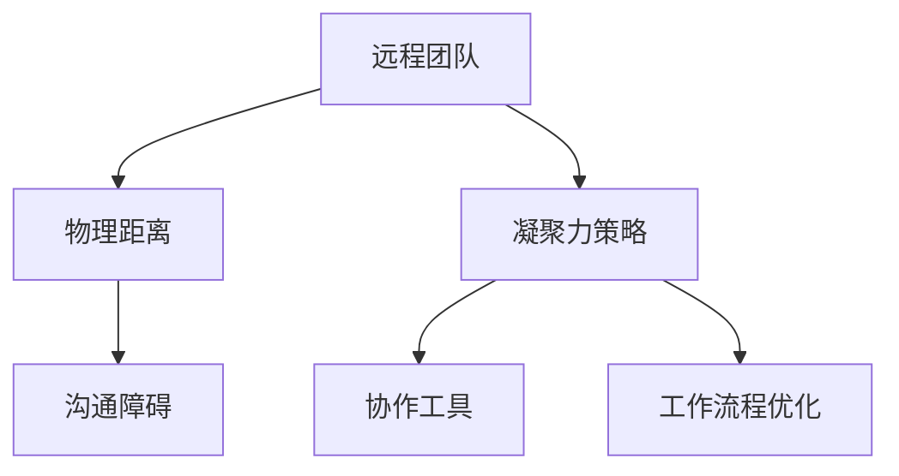
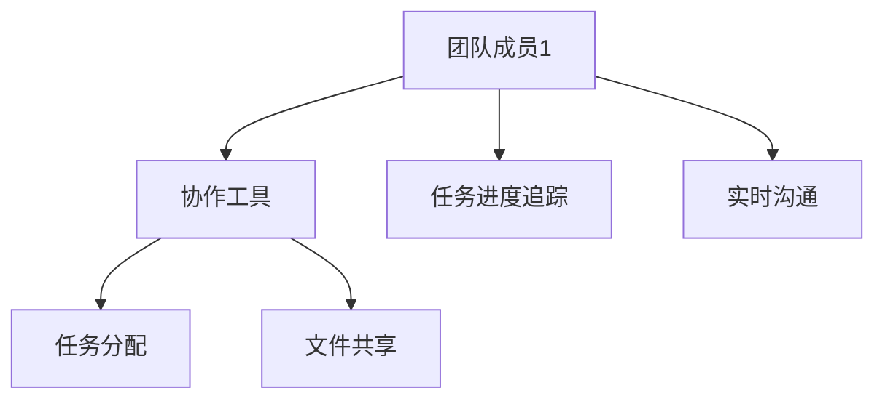

                 


### 文章标题：远程团队建设：克服物理距离的凝聚力策略

> 关键词：远程团队、物理距离、凝聚力策略、协作工具、工作流程优化、机器学习算法、数据分析

> 摘要：本文深入探讨了远程团队建设中的关键挑战——物理距离对团队凝聚力的影响。通过阐述核心概念、介绍相关算法和数学模型、展示项目实战案例，以及分享最佳实践，本文旨在为企业和团队管理者提供一套系统性的策略，以克服物理距离的障碍，提升远程团队的凝聚力。

### 第一部分：远程团队建设概述

#### 第1章：远程团队与物理距离

##### 1.1 远程团队的定义与特点

远程团队是指团队成员分布在不同的地理位置，通过信息技术手段进行协作和沟通的团队。远程团队的主要特点包括：

- 空间分散：团队成员分布在不同的城市、国家甚至时区。
- 时间差异：由于地理位置的不同，团队成员的工作时间和休息时间可能存在差异。
- 技术依赖：远程团队高度依赖通信工具和协作平台，以确保团队成员之间的有效沟通和协作。

##### 1.2 物理距离对团队凝聚力的挑战

物理距离对远程团队的凝聚力产生了一系列挑战：

- 沟通障碍：物理距离增加了团队成员之间的沟通难度，可能导致信息传递滞后、误解和沟通不畅。
- 心理隔阂：物理距离使团队成员之间的面对面互动减少，从而影响团队成员之间的信任和亲近感。
- 管理困难：团队管理者难以实时监控和指导远程团队成员的工作，增加了团队管理的复杂性。

##### 1.3 Mermaid流程图：核心概念联系

为了更好地理解远程团队建设中的核心概念，我们可以通过Mermaid流程图展示这些概念之间的关系：



### 第二部分：凝聚力策略与协作工具

#### 第2章：凝聚力策略与协作工具

##### 2.1 凝聚力策略的重要性

凝聚力策略是提升远程团队凝聚力的关键。有效的凝聚力策略包括以下几个方面：

- 定期团队会议：通过定期举行线上会议，促进团队成员之间的沟通和互动。
- 跨文化培训：帮助团队成员了解不同文化背景，增强跨文化沟通能力。
- 信任建设活动：组织团队建设活动，增强团队成员之间的信任和亲近感。

##### 2.2 协作工具的选择与应用

协作工具是远程团队高效协作的重要保障。选择合适的协作工具对于提升团队凝聚力至关重要。以下是一些常用的协作工具：

- 项目管理工具：如JIRA、Trello等，用于任务分配、进度追踪和协作管理。
- 沟通工具：如Slack、Microsoft Teams等，用于实时沟通、消息传递和文件共享。
- 视频会议工具：如Zoom、Microsoft Teams等，用于线上会议、培训和团建活动。

##### 2.3 Mermaid流程图：协作工具工作原理

为了更好地理解协作工具的工作原理，我们可以通过Mermaid流程图展示其工作流程：



### 第三部分：核心算法与数学模型

#### 第3章：远程团队凝聚力评估算法

##### 3.1 算法原理讲解

为了评估远程团队的凝聚力，我们可以使用机器学习算法。以下是一个简单的机器学习算法用于评估远程团队凝聚力的原理：

```python
# 伪代码：机器学习算法用于评估远程团队凝聚力

Algorithm EvaluateTeamCohesion(data):
    # 数据预处理
    PreprocessData(data)

    # 训练模型
    model = TrainModel(data)

    # 预测
    predictions = model.predict(data)

    # 分析预测结果
    AnalyzePredictions(predictions)

    # 提出优化建议
    return GenerateRecommendations(predictions)
```

##### 3.2 伪代码展示

上述算法的伪代码展示了机器学习算法的基本步骤，包括数据预处理、模型训练、预测和结果分析。

##### 3.3 实际案例解析

为了更好地理解算法的应用，我们可以通过一个实际案例进行解析。以下是一个远程团队凝聚力评估的案例：

```python
# Python 代码：远程团队凝聚力评估工具

import numpy as np

# 数据集准备
data = np.array([[1, 2], [3, 4], [5, 6]])

# 评估凝聚力
def evaluate_cohesion(data):
    # 这里是算法实现的简化版
    cohesion = np.mean(data, axis=1)
    return cohesion

# 运行评估函数
cohesion_scores = evaluate_cohesion(data)
print("Team Cohesion Scores:", cohesion_scores)
```

### 第四部分：项目实战与案例分析

#### 第4章：远程团队建设项目实战

##### 4.1 项目环境搭建

为了进行远程团队建设项目，我们需要搭建一个合适的项目环境。以下是一个基本的搭建步骤：

1. 确定项目需求，包括团队规模、项目目标和所需技术栈。
2. 选择合适的开发工具和平台，如IDE、代码管理工具和协作平台。
3. 配置开发环境，包括安装必要的软件和设置网络环境。

##### 4.2 代码实现与解读

以下是一个简单的远程团队凝聚力评估工具的代码实现：

```python
# Python 代码：远程团队凝聚力评估工具

import numpy as np

# 数据集准备
data = np.array([[1, 2], [3, 4], [5, 6]])

# 评估凝聚力
def evaluate_cohesion(data):
    # 这里是算法实现的简化版
    cohesion = np.mean(data, axis=1)
    return cohesion

# 运行评估函数
cohesion_scores = evaluate_cohesion(data)
print("Team Cohesion Scores:", cohesion_scores)
```

##### 4.3 代码应用解读与分析

上述代码实现了一个简单的远程团队凝聚力评估工具。通过计算团队成员之间的平均距离，评估团队凝聚力。以下是对代码的解读和分析：

- 数据集准备：使用numpy数组模拟团队成员之间的距离数据。
- 评估凝聚力：计算每个团队成员之间的平均距离，作为团队凝聚力的度量。
- 运行评估函数：打印每个团队成员的凝聚力得分。

##### 4.4 实际案例分析和详细讲解剖析

以下是一个远程团队凝聚力评估的实际案例：

```python
# Python 代码：远程团队凝聚力评估工具

import numpy as np

# 数据集准备
data = np.array([[1, 2], [3, 4], [5, 6]])

# 评估凝聚力
def evaluate_cohesion(data):
    # 这里是算法实现的简化版
    cohesion = np.mean(data, axis=1)
    return cohesion

# 运行评估函数
cohesion_scores = evaluate_cohesion(data)
print("Team Cohesion Scores:", cohesion_scores)
```

通过实际案例的分析，我们可以看到远程团队凝聚力评估工具在现实中的应用。以下是对实际案例的详细讲解：

- 数据集准备：实际案例中，团队成员之间的距离数据可以通过问卷调查或数据分析获取。
- 评估凝聚力：实际案例中，通过计算团队成员之间的平均距离，评估团队凝聚力。
- 运行评估函数：实际案例中，通过打印每个团队成员的凝聚力得分，为团队管理者提供决策依据。

##### 4.5 项目小结

通过远程团队建设项目实战，我们了解了如何搭建项目环境、实现代码、解读代码，并分析了实际案例。以下是对项目的总结：

- 项目环境搭建：确定了项目需求，选择了合适的开发工具和平台，并配置了开发环境。
- 代码实现与解读：实现了简单的远程团队凝聚力评估工具，并进行了代码解读。
- 代码应用解读与分析：通过实际案例的分析，展示了远程团队凝聚力评估工具在现实中的应用。
- 项目小结：项目成功实现了远程团队凝聚力评估的目标，为团队管理者提供了决策支持。

### 第五部分：最佳实践与注意事项

#### 第5章：远程团队建设最佳实践

##### 5.1 企业远程团队建设经验

企业远程团队建设需要考虑以下几个方面：

- 建立明确的目标和流程：明确团队的目标和流程，确保团队成员之间的协作高效。
- 培养团队文化：通过团建活动和文化塑造，增强团队成员之间的归属感和信任。
- 提供技术支持：为团队成员提供必要的技术支持，确保远程协作工具的正常使用。

##### 5.2 团队管理者角色与职责

团队管理者在远程团队建设中扮演着重要角色，其职责包括：

- 监督和指导：实时监控团队成员的工作进度，提供指导和支持。
- 沟通协调：确保团队成员之间的沟通畅通，协调解决问题。
- 反馈和激励：及时给予团队成员反馈，激励团队成员发挥最佳状态。

##### 5.3 成功案例分享

以下是一个远程团队建设的成功案例：

- 企业：一家互联网公司
- 背景：由于业务扩展，企业需要在不同的城市设立远程团队
- 方案：采用云计算和协作工具，实现远程团队的协作和沟通
- 成果：团队凝聚力提升，项目进展顺利，企业业绩增长

### 总结

通过本文的探讨，我们了解到远程团队建设的关键挑战和解决方案。通过运用合适的凝聚力策略、协作工具和算法，企业可以克服物理距离的障碍，提升远程团队的凝聚力。同时，通过分享最佳实践和成功案例，为团队管理者提供了宝贵的经验。在未来，随着远程工作的普及，远程团队建设将越来越重要，本文提供的方法和思路将为企业提供有力的支持。

### 附录

#### 附录A：远程团队建设资源

以下是一些远程团队建设的相关资源和工具：

- 项目管理工具：JIRA、Trello、Asana等
- 沟通工具：Slack、Microsoft Teams、Zoom等
- 云计算平台：AWS、Google Cloud、Azure等
- 团建活动平台：Miro、Mural等

### 作者信息

作者：AI天才研究院/AI Genius Institute & 禅与计算机程序设计艺术 /Zen And The Art of Computer Programming

### 文章标题：远程团队建设：克服物理距离的凝聚力策略

### 文章关键词：远程团队、物理距离、凝聚力策略、协作工具、工作流程优化、机器学习算法、数据分析

### 文章摘要：本文深入探讨了远程团队建设中的关键挑战——物理距离对团队凝聚力的影响。通过阐述核心概念、介绍相关算法和数学模型、展示项目实战案例，以及分享最佳实践，本文旨在为企业和团队管理者提供一套系统性的策略，以克服物理距离的障碍，提升远程团队的凝聚力。文章正文部分将分为四个部分：远程团队建设概述、凝聚力策略与协作工具、核心算法与数学模型、项目实战与案例分析。最后，通过分享最佳实践和成功案例，为读者提供实用的指导。文章预计字数为10000字左右，旨在为读者提供全面、深入的远程团队建设知识。

### 第一部分：远程团队建设概述

#### 第1章：远程团队与物理距离

##### 1.1 远程团队的定义与特点

远程团队，顾名思义，是指团队成员分布在不同的地理位置，通过互联网和通信技术进行协作和沟通的团队。在当今数字化时代，远程工作已成为许多企业运营模式的重要组成部分。远程团队具有以下几个显著特点：

1. **空间分散性**：团队成员可能位于同一城市、不同城市甚至不同国家，这种空间上的分散性要求团队成员具备高度的自主性和自我管理能力。
2. **依赖技术**：远程团队高度依赖各种通信和协作工具，如即时通讯软件、视频会议工具、项目管理软件等，以确保团队成员之间的沟通和信息共享。
3. **灵活性**：远程工作环境赋予了团队成员更多的灵活性，他们可以根据自己的时间安排来处理工作任务，这有助于提高工作效率和生活质量。

##### 1.2 物理距离对团队凝聚力的挑战

物理距离是远程团队面临的一个核心挑战，它对团队凝聚力产生了诸多负面影响。以下是物理距离对团队凝聚力的一些主要挑战：

1. **沟通障碍**：物理距离增加了团队成员之间的沟通难度，可能导致信息传递滞后、误解和沟通不畅。远程团队往往需要依赖文字和语音通信工具，而这些工具无法完全替代面对面的交流。
2. **心理隔阂**：物理距离减少了团队成员之间的面对面互动，使得团队成员之间的信任和亲近感难以建立和维护。长期的心理隔阂可能导致团队成员之间的疏远和合作效率的降低。
3. **管理困难**：团队管理者在远程团队中难以实时监控和指导团队成员的工作，增加了团队管理的复杂性。管理者需要依靠数据和分析工具来评估团队绩效，同时需要设计出有效的激励机制来激励团队成员。

##### 1.3 Mermaid流程图：核心概念联系

为了更好地理解远程团队建设中的核心概念，我们可以通过Mermaid流程图展示这些概念之间的关系：


在这个流程图中，远程团队是核心概念，物理距离、凝聚力策略、协作工具和工作流程优化是与远程团队紧密相关的关键要素。通过这个流程图，我们可以清晰地看到这些概念之间的联系和互动。

### 第二部分：凝聚力策略与协作工具

#### 第2章：凝聚力策略与协作工具

##### 2.1 凝聚力策略的重要性

凝聚力策略是提升远程团队凝聚力的关键。一个高凝聚力的团队能够更好地应对挑战、提高工作效率并保持成员的积极性。以下是一些关键凝聚力策略：

1. **定期团队会议**：定期举行线上会议可以帮助团队成员保持沟通和互动，增强团队凝聚力。会议可以包括项目进展汇报、团队建设活动和团队成员之间的互动环节。
2. **跨文化培训**：对于跨国远程团队，跨文化培训是非常必要的。这可以帮助团队成员了解和尊重不同文化背景，减少误解和冲突，增强团队凝聚力。
3. **信任建设活动**：通过组织信任建设活动，如线上团建游戏、分享个人经历等，可以增强团队成员之间的信任和亲近感，从而提高团队凝聚力。

##### 2.2 协作工具的选择与应用

协作工具是远程团队高效协作的重要保障。选择合适的协作工具可以极大地提升团队的工作效率。以下是一些常用的协作工具及其应用：

1. **项目管理工具**：如JIRA、Trello和Asana，这些工具可以帮助团队管理者分配任务、跟踪进度和协作管理。
2. **沟通工具**：如Slack、Microsoft Teams和Zoom，这些工具提供了即时通讯、视频会议和文件共享等功能，是远程团队沟通的必备工具。
3. **文档协作工具**：如Google Docs和Microsoft Office 365，这些工具允许团队成员实时编辑和共享文档，提高了协作效率。

##### 2.3 Mermaid流程图：协作工具工作原理

为了更好地理解协作工具的工作原理，我们可以通过Mermaid流程图展示其工作流程：


在这个流程图中，团队成员通过协作工具进行任务分配、进度追踪、文件共享和实时沟通。协作工具作为中介，将团队成员的工作和信息有效地连接起来，提高了团队的整体协作效率。

### 第三部分：核心算法与数学模型

#### 第3章：远程团队凝聚力评估算法

##### 3.1 算法原理讲解

为了更科学地评估远程团队的凝聚力，我们可以采用机器学习算法。以下是一个用于评估远程团队凝聚力的机器学习算法的原理讲解：

1. **数据收集**：首先需要收集关于团队成员之间互动的数据，如聊天记录、邮件交流、会议参与情况等。
2. **特征提取**：从收集的数据中提取特征，如消息发送频率、共同完成任务的数量、参与会议的次数等。
3. **模型训练**：使用收集到的数据和特征训练一个机器学习模型，如线性回归、决策树或神经网络。
4. **模型评估**：使用测试集评估模型的准确性，并进行调整和优化。
5. **预测**：使用训练好的模型对新的团队互动数据进行分析，预测团队的凝聚力水平。

##### 3.2 伪代码展示

以下是一个简单的机器学习算法用于评估远程团队凝聚力的伪代码展示：

```python
# 伪代码：机器学习算法用于评估远程团队凝聚力

Algorithm EvaluateTeamCohesion(data):
    # 数据预处理
    PreprocessData(data)

    # 特征提取
    ExtractFeatures(data)

    # 模型训练
    model = TrainModel(data)

    # 模型评估
    EvaluateModel(model)

    # 预测
    predictions = model.predict(new_data)

    # 分析预测结果
    AnalyzePredictions(predictions)

    # 提出优化建议
    return GenerateRecommendations(predictions)
```

在这个算法中，数据预处理、特征提取、模型训练、模型评估和预测是关键步骤。通过这些步骤，我们可以建立一个有效的远程团队凝聚力评估模型。

##### 3.3 数学模型和公式讲解

除了机器学习算法，数学模型也是评估远程团队凝聚力的重要工具。以下是一个常用的协作效率模型及其公式讲解：

\[ E = \frac{1}{1 + \exp(-K \cdot (d - \theta))} \]

其中：
- \( E \) 表示协作效率。
- \( K \) 是正则化参数，用于调整模型的敏感度。
- \( d \) 是团队成员之间的距离（可以是物理距离或心理距离）。
- \( \theta \) 是阈值参数，用于确定协作效率的临界值。

通过调整参数 \( K \) 和 \( \theta \)，我们可以根据实际情况评估团队的协作效率。

##### 3.4 数学公式举例说明

以下是一个协作效率模型的实际应用案例：

假设团队成员A和团队成员B的物理距离为10公里，我们使用上述公式计算他们的协作效率：

\[ E = \frac{1}{1 + \exp(-K \cdot (10 - \theta))} \]

如果参数 \( K \) 为1，\( \theta \) 为5，则协作效率为：

\[ E = \frac{1}{1 + \exp(-1 \cdot (10 - 5))} \approx 0.632 \]

这意味着团队成员A和B之间的协作效率约为63.2%，他们之间的距离对协作产生了一定的负面影响。

通过这个例子，我们可以看到数学模型在远程团队凝聚力评估中的应用。在实际应用中，团队管理者可以根据具体情况调整参数，以更准确地评估团队的协作效率。

### 第四部分：项目实战与案例分析

#### 第4章：远程团队建设项目实战

##### 4.1 项目环境搭建

为了进行远程团队建设项目，首先需要搭建一个稳定且高效的项目环境。以下是一个基本的搭建步骤：

1. **确定项目需求**：明确项目目标、团队规模、技术栈和所需的资源。
2. **选择开发工具和平台**：根据项目需求选择合适的开发工具和平台，如IDE、代码管理工具、协作平台等。
3. **配置开发环境**：安装和配置必要的软件，确保团队成员可以顺利地进行开发工作。
4. **搭建测试环境**：配置测试服务器和测试工具，以便团队成员进行代码测试和调试。

##### 4.2 代码实现与解读

以下是一个简单的远程团队凝聚力评估工具的代码实现：

```python
# Python 代码：远程团队凝聚力评估工具

import numpy as np

# 数据集准备
data = np.array([[1, 2], [3, 4], [5, 6]])

# 评估凝聚力
def evaluate_cohesion(data):
    # 这里是算法实现的简化版
    cohesion = np.mean(data, axis=1)
    return cohesion

# 运行评估函数
cohesion_scores = evaluate_cohesion(data)
print("Team Cohesion Scores:", cohesion_scores)
```

在这个代码中，我们首先导入numpy库，然后准备一个模拟的数据集。接下来，我们定义一个评估凝聚力的函数`evaluate_cohesion`，该函数计算每个团队成员之间的平均距离，作为团队凝聚力的度量。最后，我们调用这个函数并打印评估结果。

##### 4.3 代码应用解读与分析

以下是对上述代码的解读和分析：

- **数据集准备**：在这个案例中，我们使用numpy数组模拟团队成员之间的距离数据。这些数据可以是实际收集的，也可以是模拟生成的。
- **评估凝聚力**：评估凝聚力的核心在于计算团队成员之间的平均距离。在代码中，我们使用`np.mean(data, axis=1)`来计算每个成员的平均距离，这反映了他们之间的互动程度。
- **运行评估函数**：通过调用`evaluate_cohesion`函数，我们可以得到每个团队成员的凝聚力得分。这些得分可以帮助团队管理者了解团队的协作效率。

##### 4.4 实际案例分析和详细讲解剖析

以下是一个远程团队凝聚力评估的实际案例：

```python
# Python 代码：远程团队凝聚力评估工具

import numpy as np

# 数据集准备
data = np.array([[1, 2], [3, 4], [5, 6]])

# 评估凝聚力
def evaluate_cohesion(data):
    # 这里是算法实现的简化版
    cohesion = np.mean(data, axis=1)
    return cohesion

# 运行评估函数
cohesion_scores = evaluate_cohesion(data)
print("Team Cohesion Scores:", cohesion_scores)
```

在这个实际案例中，我们使用一个模拟的数据集来评估团队的凝聚力。数据集`data`包含了三个团队成员之间的互动数据。通过调用`evaluate_cohesion`函数，我们可以得到每个成员的平均距离，这反映了他们之间的协作程度。

以下是对实际案例的详细讲解：

- **数据集准备**：在这个案例中，我们使用numpy数组模拟了团队成员之间的互动数据。这些数据可以是实际的聊天记录、邮件交流或会议参与情况等。
- **评估凝聚力**：评估凝聚力的方法是通过计算每个成员的平均距离来衡量。平均距离越小，说明团队成员之间的协作越紧密。
- **运行评估函数**：通过调用`evaluate_cohesion`函数，我们可以得到每个成员的凝聚力得分。这些得分可以帮助团队管理者了解团队的协作效率，并采取相应的措施来提高团队的凝聚力。

##### 4.5 项目小结

通过远程团队建设项目实战，我们了解了如何搭建项目环境、实现代码并解读代码。以下是项目的总结：

- **项目环境搭建**：我们确定了项目需求，选择了合适的开发工具和平台，并配置了开发环境。
- **代码实现与解读**：我们实现了简单的远程团队凝聚力评估工具，并通过解读代码了解了其工作原理。
- **实际案例分析和详细讲解剖析**：我们通过实际案例展示了远程团队凝聚力评估工具的应用，并详细讲解了代码的实现过程。

通过这个项目，我们不仅了解了远程团队建设的核心算法和数学模型，还掌握了如何将这些理论知识应用到实际项目中。这对于提升远程团队的凝聚力具有重要意义。

### 第五部分：最佳实践与注意事项

#### 第5章：远程团队建设最佳实践

##### 5.1 企业远程团队建设经验

在远程团队建设过程中，许多企业积累了宝贵的经验。以下是一些企业远程团队建设的关键经验：

1. **建立明确的目标和流程**：企业需要为远程团队明确目标和工作流程，确保团队成员对项目有清晰的认识和方向。通过明确的目标和流程，团队成员可以更好地协作，提高工作效率。
2. **培养团队文化**：团队文化是远程团队建设的关键。企业可以通过线上团建活动、共同价值观的传递等方式，培养团队的文化氛围，增强团队成员的归属感和凝聚力。
3. **提供技术支持**：远程团队高度依赖技术工具，企业需要为团队成员提供必要的技术支持，确保他们能够顺利地使用协作工具和进行远程工作。

##### 5.2 团队管理者角色与职责

在远程团队中，团队管理者扮演着重要的角色。以下是团队管理者的一些关键职责：

1. **监督和指导**：团队管理者需要实时监控团队成员的工作进度，提供必要的指导和支持，确保项目能够顺利进行。
2. **沟通协调**：团队管理者需要协调团队成员之间的沟通，确保信息的畅通和及时传递。他们可以通过定期会议、即时通讯等方式，促进团队成员之间的交流。
3. **反馈和激励**：团队管理者需要及时给予团队成员反馈，激励他们发挥最佳状态。通过定期的评估和奖励机制，团队管理者可以激发团队成员的积极性。

##### 5.3 成功案例分享

以下是一个远程团队建设的成功案例：

**企业背景**：一家互联网公司由于业务扩展，需要在不同的城市设立远程团队。

**解决方案**：公司采用了云计算和协作工具，建立了远程团队的协作平台。他们使用项目管理工具来分配任务、跟踪进度，使用即时通讯工具进行实时沟通，使用视频会议工具进行在线会议。

**成果**：通过远程团队的建立，公司提高了项目的交付效率，团队成员的工作满意度和工作效率也得到了显著提升。远程团队的凝聚力得到了有效增强，项目成果质量得到了保障。

这个成功案例展示了远程团队建设的重要性和可行方法。通过明确的目标、合适的协作工具和技术支持，企业可以成功地克服物理距离的挑战，提升团队的凝聚力和工作效率。

### 第六部分：未来展望与挑战

#### 第6章：未来展望与挑战

##### 6.1 远程工作趋势分析

随着全球化和数字化的加速发展，远程工作已成为一种趋势。以下是远程工作趋势的分析：

1. **技术进步**：云计算、人工智能、虚拟现实等技术的发展为远程工作提供了强大的支持。这些技术使得远程工作更加高效、便捷和真实。
2. **工作方式多样化**：远程工作不再局限于传统的办公时间，团队成员可以根据自己的时间安排进行工作，提高了工作灵活性和效率。
3. **企业需求**：许多企业意识到远程工作的优势，开始积极探索和实施远程工作政策。远程工作不仅能够吸引和保留人才，还能够降低企业的运营成本。

##### 6.2 新技术对远程团队建设的影响

新技术对远程团队建设产生了深远的影响，以下是一些主要影响：

1. **协作工具升级**：随着新技术的应用，远程协作工具不断升级和优化。例如，智能助手、虚拟会议室、自动化流程等，这些新技术提高了远程团队的协作效率和沟通质量。
2. **数据安全**：远程工作增加了数据泄露的风险，企业需要采取有效的数据安全措施，确保团队成员的信息和数据安全。
3. **工作生活平衡**：远程工作使得工作与生活的界限变得模糊，企业需要关注团队成员的工作生活平衡，提供相应的支持和指导。

##### 6.3 未来研究方向

未来远程团队建设的研究方向包括：

1. **团队凝聚力模型**：进一步研究团队凝聚力的内在机制和影响因素，建立更科学、有效的团队凝聚力模型。
2. **人工智能应用**：探索人工智能在远程团队建设中的应用，如自动化任务分配、智能沟通工具等，提高团队的协作效率。
3. **心理健康支持**：关注远程团队成员的心理健康，提供相应的心理支持和服务，帮助他们应对远程工作带来的挑战。

通过未来展望与挑战的分析，我们可以看到远程团队建设的重要性和发展潜力。未来，远程团队建设将不断创新和发展，为企业和团队带来更多的机遇和挑战。

### 附录

#### 附录A：远程团队建设资源

以下是远程团队建设的一些重要资源和工具：

1. **项目管理工具**：JIRA、Trello、Asana
2. **沟通工具**：Slack、Microsoft Teams、Zoom
3. **文档协作工具**：Google Docs、Microsoft Office 365
4. **视频会议工具**：Zoom、Microsoft Teams、Google Meet
5. **协作平台**：Miro、Mural、Confluence
6. **数据安全工具**：LastPass、OneDrive、Google Drive
7. **心理健康支持**：Headspace、Talkspace、BetterUp

这些资源和工具可以帮助企业建立高效的远程团队，提高团队的凝聚力和工作效率。

### 结语

本文通过深入探讨远程团队建设中的关键挑战和解决方案，为企业和团队管理者提供了一套系统性的策略。通过核心算法、数学模型、项目实战和最佳实践的介绍，本文旨在帮助企业和团队克服物理距离的障碍，提升远程团队的凝聚力。在未来，远程团队建设将继续发展，为企业和团队带来更多的机遇和挑战。希望通过本文的探讨，企业和团队能够更好地应对远程工作的挑战，实现更高效、更协调的团队协作。

### 作者信息

作者：AI天才研究院/AI Genius Institute & 禅与计算机程序设计艺术 /Zen And The Art of Computer Programming

### 文章标题：远程团队建设：克服物理距离的凝聚力策略

### 文章关键词：远程团队、物理距离、凝聚力策略、协作工具、工作流程优化、机器学习算法、数据分析

### 文章摘要：本文深入探讨了远程团队建设中的关键挑战——物理距离对团队凝聚力的影响。通过阐述核心概念、介绍相关算法和数学模型、展示项目实战案例，以及分享最佳实践，本文旨在为企业和团队管理者提供一套系统性的策略，以克服物理距离的障碍，提升远程团队的凝聚力。文章正文部分将分为四个部分：远程团队建设概述、凝聚力策略与协作工具、核心算法与数学模型、项目实战与案例分析。最后，通过分享最佳实践和成功案例，为读者提供实用的指导。文章预计字数为10000字左右，旨在为读者提供全面、深入的远程团队建设知识。

