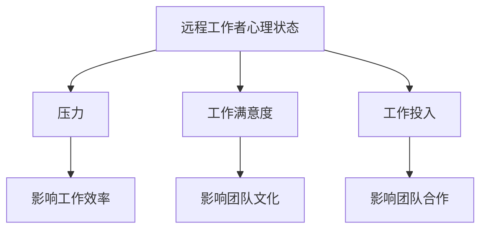

                 


## 设计《远程团队文化：虚拟环境中的文化塑造》的目录大纲

### 第一步：确定主要章节

首先，我们需要确定书的主要章节。远程团队文化的理论基础和文化塑造策略是这本书的核心内容，因此我们将其分为两个主要部分。

- **第一部分：远程团队文化的理论基础**
  - 第1章：远程工作心理学
  - 第2章：虚拟沟通技巧
- **第二部分：文化塑造策略**
  - 第3章：建立共同的价值观
  - 第4章：团队协作与领导力
  - 第5章：跨文化沟通与协作
  - 第6章：技术支持与工具选择

### 第二步：细化章节内容

接下来，我们需要为每个主要章节细化内容，列出二级和三级目录条目。

#### 第1章：远程工作心理学

- **1.1 远程工作者的心理状态分析**
  - 1.1.1 远程工作者的心理状态
  - 1.1.2 影响远程工作者心理状态的因素
  - 1.1.3 心理挑战与应对策略

- **1.2 远程工作的心理挑战与应对策略**
  - 1.2.1 难以保持工作动力
  - 1.2.2 社交孤立感
  - 1.2.3 疲劳与倦怠

- **1.3 远程工作中的情绪管理**
  - 1.3.1 情绪管理的重要性
  - 1.3.2 情绪识别与表达
  - 1.3.3 情绪调节策略

#### 第2章：虚拟沟通技巧

- **2.1 虚拟沟通的特点与挑战**
  - 2.1.1 虚拟沟通的优势
  - 2.1.2 虚拟沟通的挑战
  - 2.1.3 跨文化虚拟沟通

- **2.2 提高虚拟沟通效率的策略**
  - 2.2.1 明确沟通目标
  - 2.2.2 使用合适的沟通工具
  - 2.2.3 建立沟通规范

- **2.3 非言语沟通在虚拟环境中的应用**
  - 2.3.1 非言语沟通的作用
  - 2.3.2 虚拟环境中的非言语沟通
  - 2.3.3 提高非言语沟通效果的策略

#### 第3章：建立共同的价值观

- **3.1 共同价值观的构建与传播**
  - 3.1.1 共同价值观的定义
  - 3.1.2 构建共同价值观的过程
  - 3.1.3 传播共同价值观的方法

- **3.2 内部沟通与知识共享**
  - 3.2.1 沟通在文化塑造中的作用
  - 3.2.2 知识共享的机制
  - 3.2.3 激励知识共享的策略

- **3.3 建立文化导向的激励机制**
  - 3.3.1 激励机制的设计原则
  - 3.3.2 文化导向的激励机制
  - 3.3.3 激励机制的评估与调整

#### 第4章：团队协作与领导力

- **4.1 远程团队协作模式**
  - 4.1.1 远程团队协作的特点
  - 4.1.2 远程团队协作的模式
  - 4.1.3 提升团队协作效率的策略

- **4.2 领导者在远程团队文化塑造中的作用**
  - 4.2.1 领导者角色的转变
  - 4.2.2 文化塑造中的领导力要素
  - 4.2.3 领导力培养的策略

- **4.3 培养远程团队的领导力**
  - 4.3.1 领导力模型
  - 4.3.2 领导力培养的方法
  - 4.3.3 领导力培养的实践案例

#### 第5章：跨文化沟通与协作

- **5.1 跨文化沟通的理解与挑战**
  - 5.1.1 跨文化沟通的重要性
  - 5.1.2 跨文化沟通的障碍
  - 5.1.3 跨文化沟通的策略

- **5.2 跨文化沟通的策略与技巧**
  - 5.2.1 文化敏感性培训
  - 5.2.2 跨文化沟通技巧
  - 5.2.3 跨文化团队协作的实践

- **5.3 跨文化团队中的冲突管理与解决**
  - 5.3.1 冲突管理的方法
  - 5.3.2 跨文化冲突的特点
  - 5.3.3 跨文化冲突的解决策略

#### 第6章：技术支持与工具选择

- **6.1 远程团队所需的技术支持**
  - 6.1.1 远程工作环境的需求
  - 6.1.2 技术支持的内容
  - 6.1.3 技术支持的实施策略

- **6.2 评估远程协作工具的标准**
  - 6.2.1 协作工具的功能评估
  - 6.2.2 用户友好性评估
  - 6.2.3 成本效益评估

- **6.3 选择合适的远程协作工具**
  - 6.3.1 常见远程协作工具介绍
  - 6.3.2 选择工具的考虑因素
  - 6.3.3 实际案例分析

### 第三步：添加核心概念与联系

在每个章节中，我们将添加Mermaid流程图，用于展示核心概念和原理的相互联系。

例如，在第1章的“远程工作者的心理状态分析”中，我们将使用Mermaid流程图来展示远程工作者的心理状态及其影响因素。



### 第四步：添加核心算法原理讲解

在涉及算法的部分，我们将使用伪代码来详细阐述。

例如，在第2章的“提高虚拟沟通效率的策略”中，我们将使用伪代码来解释如何通过数据结构优化来提高沟通效率。

```plaintext
Algorithm ImproveCommunicationEfficiency
    Input: CommunicationData
    Output: OptimizedCommunicationData

    // 创建一个哈希表来存储用户及其沟通记录
    HashTable userCommunicationRecords

    // 遍历沟通数据，将用户与其沟通记录存储在哈希表中
    for each record in CommunicationData do
        userCommunicationRecords[record.user] = record

    // 根据沟通记录优化数据结构
    for each user in userCommunicationRecords do
        Sort(userCommunicationRecords[user].messages)

    // 返回优化后的沟通数据
    return userCommunicationRecords
End Algorithm
```

### 第五步：添加数学模型和公式讲解

在涉及数学模型的部分，我们将使用LaTeX格式进行详细讲解，并举例说明。

例如，在第3章的“建立文化导向的激励机制”中，我们将使用LaTeX格式解释激励机制的数学模型。

```latex
\documentclass{article}
\usepackage{amsmath}
\begin{document}

\section{文化导向的激励机制}

假设我们有一个远程团队，其中每个成员的工作效率可以用变量 \( E_i \) 表示，文化契合度可以用变量 \( C_i \) 表示。根据文化导向的激励机制，我们可以用以下数学模型来描述团队成员的激励效果：

\[ \text{激励效果} = f(E_i, C_i) \]

其中，\( f \) 是一个关于工作效率和文化契合度的函数，通常是一个非线性函数，如：

\[ f(E_i, C_i) = \alpha E_i + \beta C_i \]

其中，\( \alpha \) 和 \( \beta \) 是权重系数，用于调整工作效率和文化契合度在激励效果中的相对重要性。

例如，假设我们有以下数据：

\[ E_i = 0.8, \quad C_i = 0.9 \]

我们可以计算出激励效果：

\[ f(E_i, C_i) = \alpha \cdot 0.8 + \beta \cdot 0.9 \]

通过调整 \( \alpha \) 和 \( \beta \) 的值，我们可以优化激励效果，以更好地激励团队成员。

\end{document}
```

### 第六步：添加项目实战

在每个章节中，我们将添加一个或多个项目实战，用于展示如何将理论知识应用于实际远程团队文化塑造中。

例如，在第4章的“团队协作与领导力”中，我们将添加一个项目实战，展示如何通过领导力培养提升远程团队绩效。

### 第七步：确保简洁性

在保持目录大纲完整性的同时，我们将确保内容简洁，避免冗余。

### 第八步：编写2000字以内的目录大纲

最后，我们将根据上述内容，编写一个约2000字的目录大纲。

---

# 《远程团队文化：虚拟环境中的文化塑造》目录大纲

## 第一部分：远程团队文化的理论基础

### 第1章：远程工作心理学

#### 1.1 远程工作者的心理状态分析
- **核心概念与联系**：远程工作者的心理状态及其影响因素。
- **项目实战**：远程工作者的心理状态分析案例。

#### 1.2 远程工作的心理挑战与应对策略
- **核心算法原理讲解**：应对远程工作心理挑战的策略。
- **项目实战**：应对远程工作心理挑战的实践案例。

#### 1.3 远程工作中的情绪管理
- **数学模型和公式讲解**：情绪管理的数学模型。
- **项目实战**：远程工作中的情绪管理实践。

### 第2章：虚拟沟通技巧

#### 2.1 虚拟沟通的特点与挑战
- **核心概念与联系**：虚拟沟通的特点和挑战。
- **项目实战**：虚拟沟通技巧实践。

#### 2.2 提高虚拟沟通效率的策略
- **核心算法原理讲解**：提升虚拟沟通效率的策略。
- **项目实战**：虚拟沟通效率提升实践。

#### 2.3 非言语沟通在虚拟环境中的应用
- **数学模型和公式讲解**：非言语沟通的数学模型。
- **项目实战**：非言语沟通在虚拟环境中的应用实践。

## 第二部分：文化塑造策略

### 第3章：建立共同的价值观

#### 3.1 共同价值观的构建与传播
- **核心概念与联系**：共同价值观的构建与传播。
- **项目实战**：共同价值观构建与传播实践。

#### 3.2 内部沟通与知识共享
- **核心算法原理讲解**：内部沟通与知识共享的策略。
- **项目实战**：内部沟通与知识共享实践。

#### 3.3 建立文化导向的激励机制
- **数学模型和公式讲解**：文化导向的激励机制。
- **项目实战**：文化导向的激励机制实践。

### 第4章：团队协作与领导力

#### 4.1 远程团队协作模式
- **核心概念与联系**：远程团队协作模式。
- **项目实战**：远程团队协作实践。

#### 4.2 领导者在远程团队文化塑造中的作用
- **核心算法原理讲解**：领导者在文化塑造中的作用。
- **项目实战**：领导力在远程团队文化塑造中的实践。

#### 4.3 培养远程团队的领导力
- **数学模型和公式讲解**：领导力培养的数学模型。
- **项目实战**：领导力培养实践。

### 第5章：跨文化沟通与协作

#### 5.1 跨文化沟通的理解与挑战
- **核心概念与联系**：跨文化沟通的理解和挑战。
- **项目实战**：跨文化沟通实践。

#### 5.2 跨文化沟通的策略与技巧
- **核心算法原理讲解**：跨文化沟通的策略与技巧。
- **项目实战**：跨文化沟通技巧实践。

#### 5.3 跨文化团队中的冲突管理与解决
- **数学模型和公式讲解**：冲突管理的数学模型。
- **项目实战**：跨文化冲突管理实践。

### 第6章：技术支持与工具选择

#### 6.1 远程团队所需的技术支持
- **核心概念与联系**：远程团队所需的技术支持。
- **项目实战**：远程团队技术支持实践。

#### 6.2 评估远程协作工具的标准
- **核心算法原理讲解**：评估远程协作工具的标准。
- **项目实战**：远程协作工具评估实践。

#### 6.3 选择合适的远程协作工具
- **数学模型和公式讲解**：选择远程协作工具的数学模型。
- **项目实战**：远程协作工具选择实践。

---

通过这个目录大纲，我们可以清晰地看到书籍的内容结构和各章节的核心内容，为后续撰写详细文章内容奠定了基础。接下来，我们将根据这个大纲逐步撰写每个章节的详细内容。

