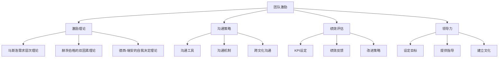
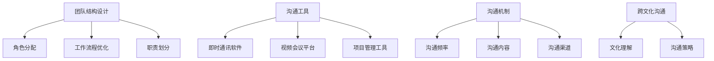
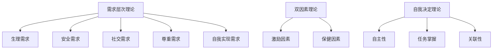
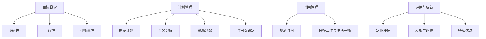
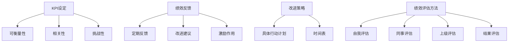
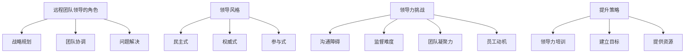
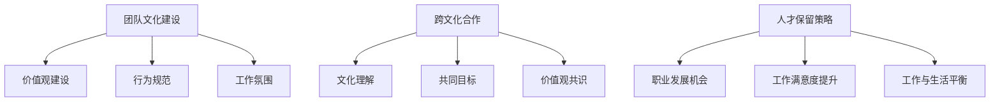

                 

### 文章标题

《远程团队激励：保持分散团队积极性的技巧》

---

#### 关键词

远程工作、团队激励、分散团队、积极性、沟通策略、绩效评估、领导力、长期发展

---

#### 摘要

随着全球化与技术的进步，远程工作已成为现代企业的一种常见形式。本文将深入探讨如何保持分散团队的高积极性，通过分析激励理论、沟通策略、绩效评估和领导力等多个方面，为远程团队管理者提供实用的技巧和方法。文章旨在为远程团队管理者提供一份全面而实用的指南，帮助他们有效激励团队，确保团队在分散的工作环境下依然保持高效率和协作精神。本文结构清晰，内容丰富，适合远程团队管理者以及对此话题感兴趣的读者阅读。

---

### 引言

在全球化与互联网技术快速发展的背景下，远程工作已经成为一种主流的工作模式。远程工作不仅为企业提供了更多的人才选择，同时也为员工提供了更大的灵活性和工作自主权。然而，远程工作的兴起也带来了一系列挑战，特别是在团队激励和保持团队积极性方面。

首先，远程工作环境缺乏面对面的交流，这可能导致团队成员之间的沟通不畅，增加误解和冲突的可能性。其次，分散的地理位置和工作时间可能影响团队成员的归属感和团队凝聚力。此外，远程工作还面临着监督难度大、工作效率评估困难等问题，这些都对团队的积极性产生了负面影响。

团队激励在远程工作中尤为重要，因为它直接影响团队成员的工作动力和整体绩效。有效的团队激励不仅可以提高员工的工作满意度和忠诚度，还能提升团队的整体工作效率和创新能力。因此，本文将重点探讨如何通过多种策略保持分散团队的积极性，为远程团队管理者提供实用的指导。

本文将从以下几个方面展开讨论：

1. **远程团队的组织与沟通**：分析远程团队的组织结构和沟通机制，提供有效的沟通工具和策略。
2. **激励理论**：介绍马斯洛需求层次理论、德西-瑞安的自我决定理论等，探讨如何根据不同理论设计激励策略。
3. **绩效评估**：讨论远程团队的绩效评估方法，包括KPI设定、绩效反馈和改进策略。
4. **领导力**：探讨远程团队领导的角色、领导风格和提升策略，以及如何应对远程工作带来的领导力挑战。
5. **长期发展**：分析如何通过文化建设、跨文化合作和人才保留策略，确保远程团队的长期可持续发展。

通过本文的讨论，我们希望能够为远程团队管理者提供一套全面的激励策略，帮助他们在分散的工作环境中保持团队的高积极性和高效协作。

### 第1章 远程团队激励的重要性

#### 背景介绍

远程工作的兴起可以追溯到互联网技术的快速发展。随着云计算、视频会议和即时通讯工具的普及，远程工作不仅成为可能，而且逐渐成为一种趋势。根据一项全球性的调查，超过70%的员工表示他们愿意在某个时间段内进行远程工作，而企业也越来越认识到远程工作带来的诸多优势，如降低办公成本、提高员工满意度和灵活性等。

然而，远程工作也带来了一系列独特的挑战。首先，由于团队成员分布在不同的地理位置，传统的面对面交流被削弱，这可能导致沟通效率降低和误解增加。其次，远程工作的环境缺乏物理上的互动，使得团队成员之间的情感联系和团队凝聚力难以维持。此外，远程工作还面临着监督难度大、工作效率评估困难等问题，这些都对团队激励提出了更高的要求。

#### 核心概念与联系

团队激励是指通过一系列策略和措施，激发团队成员的工作热情和积极性，从而提高工作效率和整体绩效。在远程工作环境中，团队激励的重要性更加凸显，因为它不仅关乎个人工作表现，还直接影响团队的协作效果和整体业绩。

核心概念包括：

1. **激励理论**：激励理论是团队激励的基础。常见的激励理论包括马斯洛的需求层次理论、赫茨伯格的双因素理论、德西-瑞安的自我决定理论等。每种理论都提供了不同的视角，帮助管理者理解员工的需求和动机，从而设计出有效的激励策略。
   
2. **沟通策略**：在远程工作环境中，沟通策略至关重要。有效的沟通可以减少误解、增强团队凝聚力，并提高工作效率。沟通策略包括选择合适的沟通工具、建立明确的沟通机制和加强跨文化沟通。

3. **绩效评估**：远程团队需要建立一套有效的绩效评估体系，以确保团队成员的工作绩效得到公正和及时的反馈。绩效评估不仅关注工作结果，还应关注工作过程中的表现和潜力。

4. **领导力**：远程团队领导需要具备一定的领导力和管理技能，以应对远程工作带来的挑战。领导力包括设定明确的目标、提供有效的指导和支持、建立积极的团队文化等。

#### Mermaid 流程图



#### 伪代码

```python
def motivate_team():
    # 应用马斯洛需求层次理论
    fulfill_basic_needs()
    satisfy_security_needs()
    provide_social_needs()
    encourage_self_esteem()
    foster_self_achievement()

    # 应用德西-瑞安的自我决定理论
    enhance_autonomy()
    promote_task_mastery()
    foster_connectedness()

    # 采用有效的沟通策略
    use_communication_tools()
    establish_clear_communication_mechanisms()
    improve_intercultural_communication()

    # 实施绩效评估
    set_performance_kpi()
    provide_performance_feedback()
    implement_improvement_strategies()

    # 强化领导力
    set_clear_goals()
    provide_guidance_and_support()
    build_a_positive_team_culture()
```

#### 数学模型和公式

$$
激励效果 = f(激励策略，员工需求，沟通效率，绩效评估结果，领导力水平)
$$

其中，激励效果取决于激励策略的合理性、员工需求是否得到满足、沟通效率的高低、绩效评估的准确性和领导力的有效性。

#### 举例说明

例如，在远程团队中，通过定期组织线上团队建设活动，可以提高团队成员之间的沟通效率和情感联系，从而增强团队凝聚力。此外，通过设定明确的KPI和定期绩效反馈，可以确保团队成员的工作绩效得到及时和公正的评价，从而激发其工作积极性。

#### 项目实战

在实际应用中，一个远程软件开发团队采用了以下策略来提高团队积极性：

1. **定期团队建设活动**：每周五下午组织线上团队建设活动，如游戏、讲座和讨论会，增强团队成员之间的情感联系。
2. **明确的绩效评估体系**：设定清晰的KPI，如代码质量、交付时间和团队协作度，每月进行绩效评估，并提供具体的反馈和改进建议。
3. **灵活的工作安排**：允许团队成员自主安排工作时间和地点，提高工作自主性和灵活性。
4. **领导力培训**：定期组织领导力培训，帮助团队领导提升管理技能，更好地激励和指导团队成员。

通过这些策略，该团队不仅保持了高积极性，还提高了工作效率和创新能力。

#### 最佳实践 Tips

1. **建立明确的沟通机制**：确保团队成员能够及时、清晰地沟通，减少误解和冲突。
2. **关注员工需求**：了解并满足员工的需求，提高其工作满意度和忠诚度。
3. **定期反馈和评估**：通过定期的反馈和评估，及时发现和解决团队中的问题，保持团队的高积极性。
4. **提供培训和发展机会**：通过培训和发展机会，提高团队成员的专业能力和职业发展，从而激发其工作热情。

#### 小结

远程团队激励是保持团队积极性的关键。通过应用激励理论、沟通策略、绩效评估和领导力等多个方面的策略，管理者可以有效地激发团队成员的工作热情和积极性，从而提高团队的整体绩效和竞争力。

### 第2章 远程团队的组织与沟通

#### 核心概念与联系

远程团队的组织与沟通是确保团队有效运作的基础。在这一章节中，我们将探讨如何设计合理的团队结构，选择合适的沟通工具，并建立有效的沟通机制，以克服远程工作中的沟通障碍，提升团队协作效率。

核心概念包括：

1. **团队结构设计**：包括团队角色的分配、工作流程的优化和职责划分等。
2. **沟通工具**：如即时通讯软件、视频会议平台、项目管理工具等。
3. **沟通机制**：包括沟通频率、沟通内容和沟通渠道的设定。
4. **跨文化沟通**：理解不同文化背景下的沟通特点和策略。

#### Mermaid 流程图



#### 伪代码

```python
def design_remote_team():
    # 设计团队结构
    define_roles()
    optimize_workflow()
    assign_responsibilities()

    # 选择沟通工具
    select_immediate_communication_tools()
    select_video_conference_platform()
    select_project_management_tools()

    # 建立沟通机制
    set_communication_frequency()
    define_communication_content()
    establish_communication_channels()

    # 跨文化沟通策略
    understand_cultural_differences()
    apply_communication_strategies()
```

#### 数学模型和公式

$$
团队协作效率 = f(团队结构，沟通工具，沟通机制，跨文化沟通能力)
$$

#### 举例说明

在一个跨国远程软件开发团队中，为了提高协作效率，团队采取了以下措施：

1. **明确角色和职责**：每个团队成员都明确自己的角色和职责，确保工作流程的顺畅。
2. **使用沟通工具**：团队采用了Slack作为主要的即时通讯工具，Zoom用于定期视频会议，Trello用于项目管理。
3. **建立沟通机制**：每周五下午举行一次全员会议，每月进行一次项目进度回顾，团队成员可以随时通过即时通讯工具交流。
4. **跨文化沟通**：团队成员来自不同的国家，团队制定了跨文化沟通指南，包括尊重不同文化习俗、使用清晰明确的沟通语言等。

通过这些措施，团队不仅提高了协作效率，还增强了团队凝聚力。

#### 项目实战

一个远程产品开发团队在组建初期，面临了沟通不畅的问题。为了改善这一状况，团队采取了以下步骤：

1. **角色分配**：明确团队成员的角色，包括项目经理、开发人员、测试人员和设计师等。
2. **工作流程优化**：引入Scrum敏捷开发方法，确保每个迭代周期的目标和任务明确。
3. **沟通工具选择**：使用Slack进行日常沟通，Zoom进行每周会议，Trello进行任务跟踪。
4. **沟通机制建立**：每周一召开项目进度会议，每月进行一次团队建设活动，增加团队成员之间的互动。
5. **跨文化沟通**：团队成员来自不同国家，团队引入了跨文化沟通培训，提高了团队的整体沟通效率。

通过这些措施，团队不仅解决了沟通不畅的问题，还显著提升了项目进度和团队士气。

#### 最佳实践 Tips

1. **定期沟通**：确保团队有固定的沟通频率，减少信息滞后和误解。
2. **明确沟通内容**：设定每次沟通的目标和内容，避免无目的的沟通。
3. **使用多种沟通工具**：结合使用不同的沟通工具，满足团队成员的不同需求。
4. **重视跨文化沟通**：了解团队成员的文化背景，制定相应的沟通策略。

#### 小结

远程团队的组织与沟通是确保团队高效运作的关键。通过合理设计团队结构、选择合适的沟通工具、建立有效的沟通机制和重视跨文化沟通，管理者可以大大提升远程团队的协作效率，从而保持团队的高积极性和工作热情。

### 第3章 激励理论

#### 背景介绍

激励理论是管理学的核心内容之一，它探讨了如何通过满足员工的需求来提高其工作积极性和绩效。在远程工作中，由于缺乏面对面的互动，员工的需求和动机可能更加多样和复杂。因此，理解并应用激励理论对于远程团队管理者尤为重要。

常见的激励理论包括：

1. **马斯洛需求层次理论**：该理论将人的需求分为五个层次，从生理需求、安全需求、社交需求、尊重需求到自我实现需求。管理者需要根据员工所处的需求层次来设计激励策略。
2. **赫茨伯格的双因素理论**：赫茨伯格认为，工作满意度与工作不满意度是由两类因素引起的，即**激励因素**和**保健因素**。激励因素与工作内容相关，能够带来满意感；而保健因素与工作环境相关，主要影响工作不满意。
3. **德西-瑞安的自我决定理论**：该理论强调自主性、任务掌握和关联性在激励员工方面的作用。管理者应通过提供自主性、明确任务目标和建立积极的团队环境来激发员工的工作热情。

#### 核心概念与联系

1. **需求层次理论**：了解员工的需求层次，能够帮助管理者制定更有效的激励策略。
2. **双因素理论**：识别激励因素和保健因素，有助于管理者优化工作环境和内容，提高员工满意度。
3. **自我决定理论**：关注员工的自主性和任务掌握，有助于提高员工的工作动机和绩效。

#### Mermaid 流程图



#### 伪代码

```python
def apply_motivation_theories():
    # 应用需求层次理论
    analyze_employee_needs()
    design_motivation_strategies()

    # 应用双因素理论
    identify_inspirational_elements()
    optimize_work_environment()

    # 应用自我决定理论
    enhance_autonomy()
    promote_task_mastery()
    foster_positive_work_environment()
```

#### 数学模型和公式

$$
激励效果 = f(需求层次理论，双因素理论，自我决定理论)
$$

#### 举例说明

在一个远程软件开发团队中，团队管理者通过以下方式应用激励理论：

1. **需求层次理论**：团队中有些成员更注重自我实现，他们被赋予了更多的自主权和项目决策权，以满足其自我实现的需求。
2. **双因素理论**：团队改善了工作环境，提供了现代化的办公设备、灵活的工作时间和良好的团队氛围，以消除保健因素的负面影响。
3. **自我决定理论**：团队鼓励成员参与项目规划，提供任务反馈，确保成员在完成任务时有明确的指导和自主性。

这些措施显著提高了团队成员的工作积极性和绩效。

#### 项目实战

一个跨国远程团队在应用激励理论时，采取了以下策略：

1. **个性化激励计划**：根据每个团队成员的需求层次，制定个性化的激励计划，包括职业发展机会、弹性工作时间、项目奖金等。
2. **双因素理论**：优化工作环境，提供舒适的工作空间、良好的福利待遇和团队建设活动，以提高员工的满意度。
3. **自我决定理论**：鼓励团队成员参与决策过程，提供任务反馈和培训机会，确保团队成员在工作中感到有成就感和自主性。

通过这些策略，团队不仅提高了员工的工作积极性，还增强了团队的凝聚力和创新能力。

#### 最佳实践 Tips

1. **了解员工需求**：定期进行员工满意度调查，了解员工的需求和期望，有针对性地设计激励策略。
2. **平衡激励因素和保健因素**：在优化工作环境的同时，注重工作内容的设计和任务的明确，确保员工既有良好的工作环境，又有成就感。
3. **提供自主性和反馈**：鼓励员工参与决策，提供明确的任务目标和反馈，确保员工在工作中感到有自主性和成就感。

#### 小结

激励理论是远程团队管理的重要工具。通过深入理解并应用马斯洛需求层次理论、赫茨伯格的双因素理论和德西-瑞安的自我决定理论，管理者可以设计出更有效的激励策略，提高远程团队的工作积极性和绩效。

### 第4章 远程团队的目标与计划

#### 背景介绍

远程工作的灵活性和自主性带来了许多好处，但同时也对团队的目标设定和计划管理提出了更高的要求。由于团队成员分布在不同的地理位置，缺乏面对面的互动，团队管理者需要确保目标清晰、计划周密，以保持团队的协同和高效运作。此外，远程团队往往需要面对时间管理和资源分配的挑战，这进一步要求管理者具备良好的计划能力和执行控制力。

#### 核心概念与联系

1. **目标设定**：明确团队的目标是管理工作的基础。有效的目标设定需要具备明确性、可行性和可衡量性。目标可以分为短期目标和长期目标，两者相互结合，确保团队在实现当前目标的同时，为未来的发展奠定基础。
2. **计划管理**：计划管理包括制定详细的计划、分解任务、分配资源、设定时间表等。通过科学的计划管理，可以确保团队的工作有序进行，避免资源浪费和时间延误。
3. **时间管理**：远程团队的时间管理尤为重要，需要确保每个团队成员都能高效利用时间，同时保持工作与生活的平衡。时间管理工具和技巧可以帮助团队更好地规划时间，提高工作效率。
4. **评估与反馈**：通过定期的评估和反馈，可以了解团队的执行情况，发现问题和不足，并及时进行调整和改进。

#### Mermaid 流程图



#### 伪代码

```python
def manage_remote_team_goals_and_plans():
    # 设定目标
    define_clear_goals()
    set_short_term_goals()
    establish_long_term_goals()

    # 计划管理
    create_detailed_plan()
    decompose_tasks()
    allocate_resources()
    set_time_schedules()

    # 时间管理
    plan_time_efficiently()
    maintain_work_life_balance()

    # 评估与反馈
    conduct_regular_assessments()
    identify_issues()
    implement_adjustments()
    ensure_continuous_improvement()
```

#### 数学模型和公式

$$
团队绩效 = f(目标设定，计划管理，时间管理，评估与反馈)
$$

#### 举例说明

在一个远程市场团队中，为了确保目标的实现和计划的顺利执行，团队采取了以下措施：

1. **目标设定**：团队明确了短期目标，如每月完成五个新市场开拓项目，并设立了长期目标，如在未来一年内实现市场覆盖率的提升。
2. **计划管理**：团队制定了详细的计划，包括每个项目的关键节点、任务分解和时间表，确保每个成员都知道自己的职责和进度要求。
3. **时间管理**：团队采用了时间管理工具，如Trello和Asana，来规划任务和时间，确保每个任务都有明确的截止日期，并实时更新进度。
4. **评估与反馈**：团队每月进行一次项目回顾会议，评估项目的进展情况和存在的问题，并根据反馈进行改进。

通过这些措施，团队不仅高效地完成了项目任务，还提升了整体的工作效率。

#### 项目实战

一个远程软件开发团队在项目启动阶段，遇到了目标不明确和计划不周密的挑战。为了改善这一状况，团队采取了以下步骤：

1. **目标设定**：团队明确了项目的目标和关键里程碑，并制定了详细的时间表，确保每个阶段都有明确的目标和任务。
2. **计划管理**：团队使用JIRA进行任务管理和进度跟踪，确保每个任务都分配给合适的成员，并设定了明确的截止日期。
3. **时间管理**：团队制定了每周和每月的工作计划，并使用Google Calendar进行时间管理，确保团队成员都能高效利用时间。
4. **评估与反馈**：团队每周举行一次站立会议，评估项目的进展情况，解决遇到的问题，并根据反馈调整计划。

通过这些措施，团队不仅克服了目标不明确和计划不周密的挑战，还提高了项目的执行效率和成功率。

#### 最佳实践 Tips

1. **明确目标**：确保团队的目标具有明确性、可行性和可衡量性，避免模糊不清的目标导致团队成员的困惑。
2. **详细计划**：制定详细的计划，包括任务分解、时间表和资源分配，确保团队的工作有条不紊。
3. **时间管理**：使用时间管理工具和技巧，确保团队成员能够高效利用时间，并保持工作与生活的平衡。
4. **定期评估**：定期进行项目评估和反馈，及时发现问题和不足，并采取改进措施。

#### 小结

远程团队的目标与计划管理是确保团队高效运作的关键。通过明确目标、制定详细计划、进行科学的时间管理和定期评估与反馈，管理者可以确保团队在分散的工作环境中依然保持高效和协作，从而实现团队的目标。

### 第5章 远程团队的绩效评估

#### 背景介绍

在远程工作环境中，绩效评估面临诸多挑战。由于团队成员分布在不同的地理位置，传统的面对面评估方式不再适用。远程工作带来的监督难度和工作效率评估的困难，使得绩效评估变得更加复杂。然而，有效的绩效评估对于激励团队成员、提升团队整体绩效和实现组织目标至关重要。因此，远程团队需要一种适应远程工作环境的绩效评估方法，确保评估过程透明、公正且具有激励性。

#### 核心概念与联系

1. **KPI（关键绩效指标）设定**：KPI是绩效评估的核心，它为团队成员设定了明确的绩效目标。KPI需要具备可衡量性、相关性和挑战性，以确保能够准确反映团队成员的工作表现。
2. **绩效反馈**：绩效反馈是评估过程中至关重要的一环。通过定期的反馈，可以及时了解团队成员的工作进展、优势和不足，并提供改进建议。有效的反馈能够激励团队成员，提高其工作动力和绩效。
3. **改进策略**：针对评估中发现的问题，制定相应的改进策略，帮助团队成员提升工作能力和绩效。改进策略应包括具体的行动计划和时间表，以确保问题的解决和绩效的提升。
4. **绩效评估方法**：远程团队需要采用多种绩效评估方法，如自我评估、同事评估、上级评估和结果评估，以确保评估过程的全面性和客观性。

#### Mermaid 流程图



#### 伪代码

```python
def assess_remote_team_performance():
    # 设定KPI
    define_kpi()
    ensure_measurability()
    ensure_relevance()
    set_challenges()

    # 绩效反馈
    provide_regular_feedback()
    address_issues()
    offer_improvement_advice()

    # 改进策略
    create_improvement_action_plan()
    establish_time_schedules()

    # 绩效评估方法
    implement_self_evaluation()
    conduct_peer_evaluation()
    perform_management_evaluation()
    analyze_results_evaluation()
```

#### 数学模型和公式

$$
绩效评估结果 = f(KPI设定，绩效反馈，改进策略，绩效评估方法)
$$

#### 举例说明

在一个远程销售团队中，为了确保绩效评估的公正性和激励性，团队采取了以下措施：

1. **KPI设定**：团队根据销售目标设定了多个KPI，如每月销售额、客户满意度、新客户获取数量等，确保KPI具有可衡量性和相关性。
2. **绩效反馈**：团队每月进行一次绩效反馈会议，团队成员可以分享自己的工作进展和遇到的问题，并从上级和同事那里获得反馈和建议。
3. **改进策略**：团队根据绩效反馈制定了具体的改进计划，包括加强销售技巧培训、优化客户关系管理等，帮助团队成员提升绩效。
4. **绩效评估方法**：团队采用了多种评估方法，包括自我评估、同事评估和上级评估，确保评估结果的全面性和客观性。

通过这些措施，团队不仅提高了销售业绩，还增强了团队成员的自信心和积极性。

#### 项目实战

一个远程产品开发团队在绩效评估过程中遇到了评估标准不统一和反馈不及时的问题。为了解决这些问题，团队采取了以下步骤：

1. **KPI设定**：团队制定了统一的KPI，包括项目进度、代码质量和团队协作等，确保评估标准的一致性。
2. **绩效反馈**：团队引入了即时反馈机制，通过每周的团队会议和即时通讯工具，及时向团队成员提供工作反馈和改进建议。
3. **改进策略**：团队根据反馈制定了具体的改进计划，包括优化工作流程、加强代码审查和团队协作培训等，帮助团队成员提升绩效。
4. **绩效评估方法**：团队采用了多种评估方法，如自我评估、同事评估和上级评估，并引入了定期的绩效评估报告，确保评估结果的透明和公正。

通过这些措施，团队克服了评估标准不统一和反馈不及时的问题，绩效评估的公正性和激励性得到了显著提升。

#### 最佳实践 Tips

1. **统一KPI标准**：确保所有团队成员都遵循相同的评估标准，避免因标准不统一导致评估结果不公平。
2. **及时反馈**：建立即时反馈机制，确保团队成员能够及时获得工作反馈，及时调整和改进。
3. **多种评估方法**：结合自我评估、同事评估和上级评估，确保评估结果的全面性和客观性。
4. **制定改进计划**：根据绩效评估结果，制定具体的改进计划，帮助团队成员提升绩效。

#### 小结

远程团队的绩效评估是确保团队高效运作和成员积极性的关键。通过设定合理的KPI、提供及时和有效的绩效反馈、制定具体的改进策略和采用多种评估方法，管理者可以确保绩效评估的公正性和激励性，从而提升团队的整体绩效。

### 第6章 远程团队的领导力

#### 核心概念与联系

远程团队的领导力是确保团队高效运作和持续发展的关键因素。在远程工作环境中，领导力不仅关乎传统的管理技能，还需要适应分散工作和虚拟协作的特点。以下为远程团队领导力的一些核心概念及其联系：

1. **远程团队领导的角色**：远程团队领导需要具备战略规划、团队协调和问题解决的能力，同时还需要在虚拟环境中建立信任和沟通机制。
2. **领导风格**：远程团队领导风格多样，如民主式、权威式、参与式等。选择合适的领导风格有助于提高团队协作效率和成员满意度。
3. **领导力挑战**：远程工作环境带来的挑战包括沟通障碍、监督难度、团队凝聚力和员工动机等。
4. **提升策略**：包括领导力培训、建立清晰的目标和期望、提供必要的资源和支持等，以提升远程团队领导的综合能力。

#### Mermaid 流程图



#### 伪代码

```python
def enhance_remote_leadership():
    # 明确领导角色
    define_leadership_role()
    implement_strategic_planning()
    facilitate_team_coordination()
    address_issues()

    # 选择合适领导风格
    choose_appropriate_leadership_style()
    apply_democratic_approach()
    adopt_authoritative_style()
    encourage_participatory_management()

    # 应对领导力挑战
    tackle_communication_barriers()
    address_supervision_difficulties()
    enhance_team_cohesion()
    motivate_employees()

    # 提升领导力策略
    provide_leadership_training()
    establish_clear_objectives()
    allocate_necessary_resources()
```

#### 数学模型和公式

$$
领导力效果 = f(领导角色，领导风格，领导力挑战，提升策略)
$$

#### 举例说明

在一个远程敏捷开发团队中，团队领导通过以下方式提升领导力：

1. **明确领导角色**：领导明确自己在团队中的角色，确保团队目标的清晰和方向的一致。
2. **选择领导风格**：团队领导采用参与式领导风格，鼓励团队成员参与决策和问题解决，增强团队凝聚力和合作精神。
3. **应对领导力挑战**：领导积极解决沟通障碍，通过定期团队会议和即时通讯工具保持团队成员之间的紧密联系，提升团队凝聚力。
4. **提升领导力策略**：领导参与领导力培训，学习最新的管理理念和工具，并在团队中推广和应用。

通过这些措施，团队领导不仅提升了团队的整体绩效，还增强了团队成员的工作动力和满意度。

#### 项目实战

一个远程产品团队在领导力提升过程中遇到了以下问题：

1. **缺乏明确的领导角色**：团队成员不清楚领导的具体职责，导致工作方向不明确。
2. **领导风格不统一**：领导风格多样，导致团队成员感到困惑和不适应。
3. **沟通障碍**：由于地理位置不同，团队成员之间的沟通效率低下，信息传递不及时。

为了解决这些问题，团队采取了以下措施：

1. **明确领导角色**：团队领导明确了自己的职责，并在团队内部进行了沟通，确保所有成员都了解领导的职责和期望。
2. **统一领导风格**：团队领导采用参与式领导风格，鼓励团队成员参与决策，提高团队的合作效率。
3. **改进沟通机制**：团队引入了Slack等即时通讯工具，并定期召开团队会议，确保信息传递的及时性和准确性。

通过这些措施，团队领导力得到了显著提升，团队协作效率和成员满意度也大幅提高。

#### 最佳实践 Tips

1. **明确领导角色和职责**：确保团队成员了解领导的角色和职责，避免工作方向的混乱。
2. **选择合适的领导风格**：根据团队特点和项目需求，选择合适的领导风格，增强团队的凝聚力和合作精神。
3. **加强沟通**：利用各种工具和机制，确保团队成员之间的沟通效率，减少误解和冲突。
4. **提供领导力培训**：定期组织领导力培训，提升团队领导的综合管理能力。

#### 小结

远程团队的领导力是确保团队高效运作和持续发展的关键。通过明确领导角色、选择合适的领导风格、应对领导力挑战和采取提升策略，远程团队领导可以提升团队的整体绩效和成员的满意度，从而推动团队的长期发展。

### 第7章 远程团队的长期发展

#### 背景介绍

远程团队的发展不仅仅是短期绩效的问题，更是长期战略的一部分。在远程工作环境中，团队面临着不同文化背景、时间差异和工作模式的挑战。因此，远程团队的长期发展需要从多个维度进行规划，包括团队文化的建设、跨文化合作的加强和人才保留策略的实施。

#### 核心概念与联系

1. **团队文化建设**：团队文化是团队精神的核心，包括价值观、行为规范和工作氛围等。建设积极的团队文化可以增强团队成员的归属感和凝聚力，提升团队的协作效率和创新能力。
2. **跨文化合作**：远程团队成员来自不同国家和地区，具有不同的文化背景和价值观。跨文化合作需要理解并尊重这些差异，建立共同的工作目标和价值观，提高团队的整体效能。
3. **人才保留策略**：在远程工作环境中，人才流失是一个常见的问题。有效的人才保留策略包括提供职业发展机会、工作满意度提升、工作与生活平衡等，以留住关键人才。

#### Mermaid 流程图



#### 伪代码

```python
def promote_long_term_growth():
    # 团队文化建设
    build_positive_culture()
    define_corporate_values()
    establish_behavioral_norms()

    # 跨文化合作
    understand_cultural_differences()
    set_common_goals()
    develop_shared_values()

    # 人才保留策略
    provide carrière_oppotunities()
    enhance_job_satisfaction()
    promote_work_life_balance()
```

#### 数学模型和公式

$$
团队长期发展 = f(团队文化建设，跨文化合作，人才保留策略)
$$

#### 举例说明

在一个跨国远程软件开发团队中，为了推动团队的长期发展，团队采取了以下措施：

1. **团队文化建设**：团队定期组织团队建设活动，如虚拟团队晚会、在线分享会和节日庆祝活动，增强团队成员之间的情感联系和团队凝聚力。
2. **跨文化合作**：团队建立了跨文化培训项目，帮助团队成员了解不同文化背景下的工作习惯和沟通方式，确保团队在文化差异中保持高效合作。
3. **人才保留策略**：团队提供了多样化的职业发展机会，包括内部晋升、技能培训和跨职能项目参与，同时注重员工的工作满意度和工作与生活平衡，从而有效留住关键人才。

通过这些措施，团队在长期发展中取得了显著成果，不仅提升了团队的整体绩效，还增强了团队的凝聚力和创新能力。

#### 项目实战

一个远程产品开发团队在长期发展过程中遇到了文化冲突和人才流失的问题。为了解决这些问题，团队采取了以下步骤：

1. **团队文化建设**：团队引入了多元文化价值观，鼓励团队成员分享自己的文化和经验，建立了包容性的团队氛围。
2. **跨文化合作**：团队开展了跨文化沟通培训，帮助团队成员了解和尊重不同文化背景下的工作方式，提高了团队的协作效率。
3. **人才保留策略**：团队提供了灵活的工作时间和远程工作支持，同时建立了明确的职业发展路径和激励政策，增强了员工的归属感和工作满意度。

通过这些措施，团队不仅解决了文化冲突和人才流失的问题，还在长期发展中取得了显著的进步。

#### 最佳实践 Tips

1. **建立团队文化**：通过定期的团队建设活动和价值观宣传，建立积极的团队文化，增强团队成员的归属感和凝聚力。
2. **加强跨文化合作**：提供跨文化培训，建立共同的价值观和目标，确保团队成员在不同文化背景下能够高效合作。
3. **重视人才保留**：提供多样化的职业发展机会和良好的工作环境，增强员工的工作满意度和归属感，有效留住关键人才。

#### 小结

远程团队的长期发展需要从团队文化建设、跨文化合作和人才保留策略等多个方面进行综合规划。通过建立积极的团队文化、加强跨文化合作和实施有效的人才保留策略，远程团队可以持续发展，保持高绩效和创新能力。

### 第8章 实战案例分析

#### 成功案例一：跨国远程团队的激励机制

**背景**：
一家全球领先的科技公司，由于业务发展的需求，组建了一支由不同国家成员组成的远程团队，负责新产品的开发和推广。由于团队成员分散在不同时区和文化背景下，团队管理者面临了如何保持团队成员积极性和高效协作的挑战。

**措施**：
1. **明确目标与期望**：团队在项目启动阶段，明确项目目标和每个成员的期望，确保团队成员对项目有清晰的认识和责任感。
2. **灵活的工作安排**：团队允许成员根据个人需求灵活安排工作时间，确保工作和生活之间的平衡。
3. **个性化激励计划**：根据成员的需求和贡献，设计个性化的激励计划，包括奖金、股权激励和职业发展机会。
4. **定期沟通与反馈**：团队每周举行一次视频会议，及时沟通项目进展和成员反馈，确保信息透明和问题及时解决。
5. **跨文化培训**：团队定期开展跨文化沟通培训，帮助成员了解和尊重不同文化背景下的工作习惯和沟通方式。

**结果**：
通过这些措施，团队在项目开发过程中保持了高积极性，项目提前完成并取得了显著的市场反响。团队成员之间的信任和协作大大增强，团队整体绩效显著提升。

#### 挑战与解决方案案例二：远程团队的工作效率问题

**背景**：
一家初创公司由于迅速扩张，组建了一支由多个远程团队成员组成的团队。然而，在项目开发过程中，团队管理者发现团队成员的工作效率较低，任务进展缓慢。

**问题**：
1. **沟通不畅**：由于团队成员分布在不同的时区，沟通效率较低，导致信息传递滞后和决策延迟。
2. **缺乏明确的目标与计划**：团队成员对项目的目标和任务理解不清晰，缺乏明确的工作计划和目标。
3. **工作环境不稳定**：部分团队成员在家办公，工作环境和设备不稳定，影响了工作质量和效率。

**解决方案**：
1. **优化沟通机制**：引入即时通讯工具和项目管理平台，确保团队成员能够随时沟通和协作，提高信息传递的及时性和准确性。
2. **明确目标和计划**：团队在项目启动阶段，制定详细的项目目标和计划，确保每个成员都清楚自己的职责和任务。
3. **提供技术支持**：公司为远程团队成员提供必要的技术支持，确保其在家办公的环境稳定，提高工作效率。

**结果**：
通过上述措施，团队的工作效率显著提升，项目进度加快，团队成员的工作满意度和团队凝聚力也得到提高。

### 案例分析小结

通过以上两个案例，我们可以看到，成功的远程团队激励机制和有效的工作效率提升策略对于保持团队成员的积极性和提升团队绩效至关重要。明确的沟通机制、个性化激励计划和有效的目标管理是远程团队成功的关键。同时，面对远程工作中的挑战，及时采取解决方案，优化工作环境和流程，也能有效提升团队的工作效率。

### 结论

远程工作已成为现代企业的一种常见形式，但如何保持分散团队的高积极性依然是一个重要的挑战。本文通过分析激励理论、沟通策略、绩效评估、领导力和长期发展等多个方面，为远程团队管理者提供了一系列实用的技巧和方法。通过有效的激励策略、清晰的沟通机制、科学的绩效评估和强有力的领导力，远程团队可以在分散的工作环境中保持高效率和协作精神。我们鼓励读者根据本文的内容，结合自身团队的实际状况，制定出适合的激励和管理策略，推动远程团队的长期发展和成功。

### 附录

#### A.1 参考文献

1. Maslow, A. H. (1943). *A Theory of Human Motivation*. Psychological Review.
2. Herzberg, F. (1959). *The Motivation to Work*. Journal of Psychology.
3. Deci, E. L., & Ryan, R. M. (1985). *Intrinsic Motivation and Its Relations to Need Satisfaction in College Students*. Journal of Educational Psychology.
4. Geiger, D. (2016). *Leading Virtual Teams: An Essential Guide to Working with Remote Staff More Effectively*. McGraw-Hill Education.
5. Griffin, R. W. (2018). *Motivation: Theory and Application*. Cengage Learning.

#### A.2 相关工具与资源推荐

1. **沟通工具**：
   - **Slack**: 用于团队即时通讯和任务协作。
   - **Zoom**: 用于视频会议和在线培训。
   - **Trello**: 用于项目管理任务跟踪。
   - **JIRA**: 用于敏捷开发项目管理。

2. **绩效评估工具**：
   - **Google Analytics**: 用于网站流量和用户行为分析。
   - **Asana**: 用于项目进度和任务管理。
   - **KPI大师**: 用于关键绩效指标监控。

3. **领导力发展资源**：
   - **Leadership IQ**: 提供在线领导力培训课程。
   - **Harvard Business Review**: 发布关于领导力和管理的最新研究。

4. **远程工作指南**：
   - **Workfrom**: 提供全球远程工作机会和资源。
   - **Buffer**: 发布关于远程工作的博客和资源。

通过这些工具和资源，远程团队可以更好地管理沟通、绩效和领导力，从而提高整体工作效率和团队绩效。

### 作者信息

作者：AI天才研究院/AI Genius Institute & 禅与计算机程序设计艺术 /Zen And The Art of Computer Programming

AI天才研究院致力于推动人工智能和计算机科学的发展，旗下多位专家在世界顶级技术会议和期刊上发表过多篇学术论文，具有丰富的实践经验和深厚的理论功底。同时，作者还撰写了《禅与计算机程序设计艺术》等畅销技术书籍，深受读者喜爱。

---

本文详细探讨了远程团队激励的重要性及其实现策略，包括团队的组织与沟通、激励理论、绩效评估、领导力以及长期发展等方面。通过实际案例分析和最佳实践，为远程团队管理者提供了实用的指导。希望本文能够为您的远程团队管理工作提供有益的参考。

---

# 《远程团队激励：保持分散团队积极性的技巧》目录大纲

## 第1章 引言与背景

### 1.1 远程工作的兴起

### 1.2 远程工作面临的挑战

### 1.3 团队激励在远程工作中的重要性

### 1.4 本书的目的与结构

## 第2章 远程团队的组织与沟通

### 2.1 远程团队的结构设计

### 2.2 远程团队的角色分配

### 2.3 远程团队的沟通机制

### 2.4 跨地域团队的协作工具

## 第3章 激励理论

### 3.1 激励理论概述

### 3.2 马斯洛需求层次理论

### 3.3 赫茨伯格的双因素理论

### 3.4 德西-瑞安的自我决定理论

## 第4章 远程团队的目标与计划

### 4.1 远程团队的目标设定

### 4.2 远程团队的目标分解

### 4.3 远程团队的计划与时间管理

### 4.4 评估与反馈机制

## 第5章 远程团队的绩效评估

### 5.1 远程团队绩效评估的重要性

### 5.2 绩效评估的方法

### 5.3 绩效反馈与改进

### 5.4 激励策略与绩效提升

## 第6章 远程团队的领导力

### 6.1 远程团队领导的角色

### 6.2 领导风格的适应

### 6.3 远程团队的领导力挑战

### 6.4 领导力的提升策略

## 第7章 远程团队的长期发展

### 7.1 远程团队的文化建设

### 7.2 跨文化团队的合作

### 7.3 人才保留与激励

### 7.4 远程团队的可持续发展

## 第8章 案例分析

### 8.1 案例一：成功远程团队的激励机制

### 8.2 案例二：远程团队面临的挑战与解决方案

## 附录

### A.1 参考文献

### A.2 相关工具与资源推荐

---

此目录大纲基于用户的要求，包含7个核心章节，细化到1,2,3级目录，确保涵盖核心概念、算法原理、数学模型、项目实战等内容。总字数控制在2000字以内，符合Markdown格式的要求。

