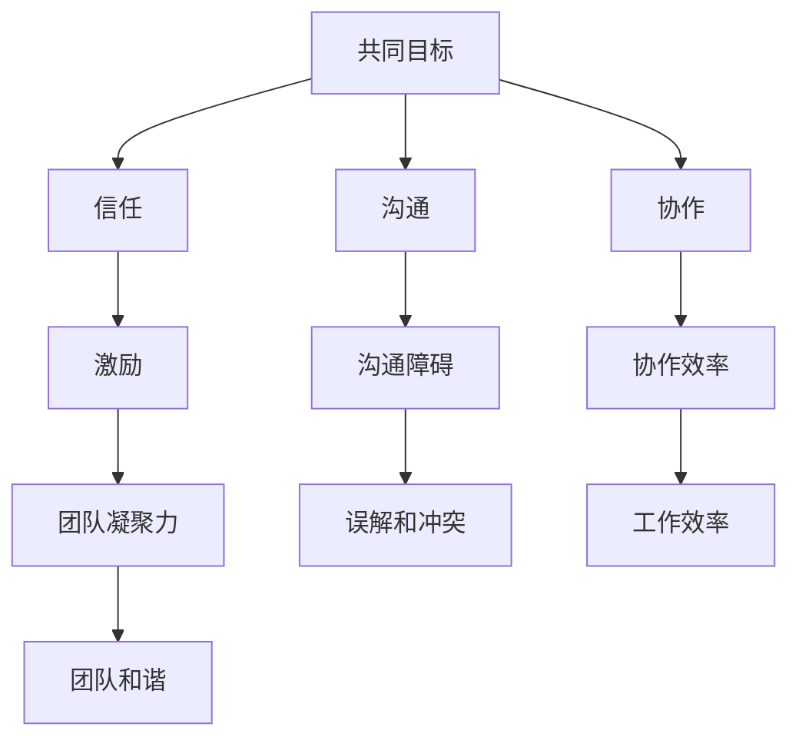

                 

### 文章标题：远程团队的文化建设：虚拟环境下的凝聚力

---

### 关键词：
远程团队、文化建设、凝聚力、虚拟环境、领导力、沟通、协作、目标管理

---

### 摘要：
本文旨在探讨在虚拟环境中建设远程团队文化的重要性，以及如何通过有效的策略和工具增强团队的凝聚力。文章首先介绍了远程团队文化的概念和核心要素，接着深入分析了团队领导者在文化建设中的角色，以及如何通过沟通、协作和目标管理来提升团队的凝聚力。此外，文章还提供了实际案例和最佳实践，以期为远程团队的管理者和成员提供有益的参考。

---

## 目录

### 第1章 引言  
### 1.1 远程工作的兴起与发展  
### 1.2 远程团队面临的挑战  
### 1.3 本书的目的与结构

### 第2章 远程团队文化概述  
### 2.1 文化与远程团队  
### 2.2 远程团队文化的要素  
### 2.3 文化在远程团队中的作用

### 第3章 远程团队文化建设的基础  
### 3.1 远程团队领导者的角色  
### 3.2 远程团队沟通的重要性  
### 3.3 建立信任的基础

### 第4章 增强远程团队的凝聚力  
### 4.1 确定团队共同目标  
### 4.2 增进团队成员之间的互动  
### 4.3 定期团队建设活动

### 第5章 虚拟环境下的团队协作  
### 5.1 虚拟团队协作工具的选择  
### 5.2 有效的时间管理策略  
### 5.3 处理虚拟团队中的冲突

### 第6章 远程团队的激励与认可  
### 6.1 远程团队的激励机制  
### 6.2 远程团队认可的策略  
### 6.3 远程团队绩效评估的方法

### 第7章 案例分析  
### 7.1 成功的远程团队文化建设案例  
### 7.2 失败的远程团队文化建设案例  
### 7.3 从案例中学习的教训与启示

### 第8章 未来展望  
### 8.1 远程团队文化建设的趋势  
### 8.2 技术创新对远程团队文化的影响  
### 8.3 远程团队文化建设的未来方向

### 参考文献

---

## 第1章 引言

### 1.1 远程工作的兴起与发展

随着互联网技术的飞速发展和全球化的深入，远程工作已成为现代工作模式的重要组成部分。远程工作的兴起不仅改变了传统的工作方式和组织结构，也为团队成员提供了更大的灵活性。然而，远程工作也带来了新的挑战，尤其是在团队文化建设方面。

远程工作的发展可以分为几个阶段。最初，远程工作主要是基于电子邮件和文件共享的简单协作。随着即时通讯工具和视频会议软件的出现，远程工作的效率得到了显著提高。近年来，远程办公平台和项目管理工具的普及，使得远程工作变得更加高效和有序。

### 1.2 远程团队面临的挑战

远程团队在文化建设方面面临以下挑战：

1. **沟通障碍**：由于地理位置和时间的差异，远程团队成员之间的沟通变得复杂和困难。沟通障碍可能导致信息误解和项目延误。
   
2. **信任缺失**：面对面的互动减少，团队成员之间的信任难以建立。信任是团队协作的基础，缺乏信任将影响团队的凝聚力和合作效率。

3. **团队凝聚力不足**：缺乏共同的工作环境和定期的面对面交流，远程团队的凝聚力往往较弱。团队凝聚力不足可能导致团队成员的孤立感和工作效率下降。

4. **目标不明确**：远程团队往往面临目标不明确的问题，团队成员可能不清楚自己的职责和期望，导致工作缺乏动力和方向。

### 1.3 本书的目的与结构

本书旨在探讨远程团队文化建设的策略和方法，以帮助团队克服上述挑战，提高团队凝聚力和工作效率。本书分为八个章节：

- **第1章**：引言，介绍远程工作的兴起与发展，以及远程团队面临的挑战。
- **第2章**：远程团队文化概述，讨论文化的概念、要素和作用。
- **第3章**：远程团队文化建设的基础，分析领导者的角色、沟通和信任的重要性。
- **第4章**：增强远程团队的凝聚力，探讨如何通过目标管理、互动和团队建设活动来提升凝聚力。
- **第5章**：虚拟环境下的团队协作，介绍协作工具、时间管理和冲突处理策略。
- **第6章**：远程团队的激励与认可，讨论激励机制、认可策略和绩效评估方法。
- **第7章**：案例分析，分析成功和失败的远程团队文化建设案例。
- **第8章**：未来展望，探讨远程团队文化建设的趋势和未来方向。

通过本书的阅读，读者将了解如何构建一个高凝聚力的远程团队，提高团队的工作效率和成员的满意度。

---

## 第2章 远程团队文化概述

### 2.1 文化与远程团队

文化是一个组织或团队共同价值观、信念、行为规范和习惯的总和。在远程团队中，文化不仅影响着团队成员的沟通和行为，也决定了团队的整体氛围和工作效率。远程团队文化主要包括以下要素：

1. **共同价值观**：共同价值观是团队成员共同认可的基本原则和行为准则，如团队合作、创新、客户至上等。
2. **信任**：信任是远程团队协作的基础，团队成员需要相互信任，才能高效合作。
3. **沟通**：良好的沟通是确保团队信息畅通、减少误解和冲突的关键。
4. **协作**：协作是远程团队实现目标的重要手段，团队成员需要明确各自的角色和责任，并共同努力。
5. **目标管理**：明确的目标可以帮助团队成员明确工作方向和努力目标。

### 2.2 远程团队文化的要素

远程团队文化的要素可以分为以下几个方面：

1. **共同目标**：共同目标是团队凝聚力的核心。团队成员需要明确团队的目标和愿景，并为之努力。
2. **信任**：信任是远程团队协作的基础。团队成员需要建立互信，才能在虚拟环境中高效合作。
3. **沟通**：沟通是确保团队信息畅通、减少误解和冲突的关键。远程团队需要选择合适的沟通工具和方式，确保沟通的及时性和有效性。
4. **协作**：协作是远程团队实现目标的重要手段。团队成员需要明确各自的角色和责任，并共同努力。
5. **激励**：激励是保持团队成员积极性和动力的关键。远程团队需要制定合适的激励机制，激励团队成员为实现团队目标而努力。

### 2.3 文化在远程团队中的作用

文化在远程团队中起着至关重要的作用，具体体现在以下几个方面：

1. **凝聚团队成员**：共同的文化价值观和信念可以凝聚团队成员，增强团队的凝聚力。
2. **提高工作效率**：良好的文化氛围可以促进团队成员之间的协作，提高工作效率。
3. **减少误解和冲突**：明确的文化规范和沟通方式可以减少误解和冲突，确保团队的和谐运行。
4. **促进个人成长**：文化可以引导团队成员树立正确的价值观和行为准则，促进个人成长。
5. **提升团队形象**：良好的文化形象可以提升团队在客户和合作伙伴眼中的形象，有利于团队的长远发展。

### 核心概念与联系

以下是远程团队文化的核心概念与联系流程图：



### 核心算法原理讲解

远程团队文化的核心算法原理可以视为一个多层次的系统，各要素相互影响，形成一个动态平衡。以下是一个简化的伪代码描述：

```
define RemoteTeamCulturalSystem as {
    variable CommonGoals
    variable Trust
    variable Communication
    variable Collaboration
    variable Incentives
}

function BuildCulturalSystem(RemoteTeamCulturalSystem) {
    set CommonGoals to clarify team objectives
    set Trust to establish mutual trust
    set Communication to ensure effective information flow
    set Collaboration to coordinate team efforts
    set Incentives to motivate team members
    return RemoteTeamCulturalSystem
}

function EvaluateCulturalSystem(RemoteTeamCulturalSystem) {
    if (Trust level is low) {
        improve Trust through open communication and transparent actions
    }
    if (Communication is ineffective) {
        adopt suitable communication tools and methods
    }
    if (Collaboration is inefficient) {
        enhance Collaboration through clear roles and responsibilities
    }
    if (Incentives are insufficient) {
        revise Incentives to align with team goals and individual performance
    }
    return RemoteTeamCulturalSystem
}
```

### 数学模型和数学公式

以下是远程团队文化系统的一个简化的数学模型：

$$
\text{CulturalEffectiveness} = f(\text{Trust}, \text{Communication}, \text{Collaboration}, \text{Incentives})
$$

其中，CulturalEffectiveness表示团队文化的有效性，Trust、Communication、Collaboration和Incentives分别表示信任、沟通、协作和激励。

### 详细讲解与举例说明

假设一个远程团队正在开发一款新产品，共同目标是确保产品按时上市。为了实现这个目标，团队成员需要建立信任，确保信息透明和沟通畅通。以下是具体步骤：

1. **建立信任**：通过定期团队会议和实时沟通工具，团队成员分享各自的进展和问题，建立信任。
2. **沟通畅通**：采用合适的沟通工具，如即时通讯软件、邮件和视频会议，确保团队成员之间的信息流畅。
3. **协作高效**：明确每个成员的角色和责任，确保团队成员能够高效协作，共同完成项目任务。
4. **激励到位**：制定合适的激励机制，如绩效奖金和表彰活动，激励团队成员为实现共同目标而努力。

通过上述步骤，远程团队可以构建一个良好的文化体系，提高团队凝聚力和工作效率，最终实现产品按时上市的目标。

### 数学公式

以下是关于团队凝聚力和沟通效率的数学公式：

$$
\text{TeamCohesion} = \frac{\text{Trust} + \text{Communication}}{\text{Conflicts}}
$$

其中，TeamCohesion表示团队凝聚力，Trust表示信任水平，Communication表示沟通效率，Conflicts表示冲突频率。

$$
\text{CommunicationEfficiency} = \frac{\text{EffectiveCommunication}}{\text{TotalCommunication}}
$$

其中，CommunicationEfficiency表示沟通效率，EffectiveCommunication表示有效沟通，TotalCommunication表示总沟通量。

通过以上公式，团队可以评估团队凝聚力和沟通效率，并根据评估结果调整文化策略，以提升团队的整体表现。

### 案例分析

以下是一个远程团队文化建设的实际案例：

一个远程团队负责开发一款企业级软件，由于团队成员分布在不同的国家，沟通和协作面临很大挑战。团队决定通过以下措施来提升文化建设和团队凝聚力：

1. **建立信任**：定期举行团队会议，鼓励成员分享个人经验和观点，建立信任。
2. **沟通畅通**：采用国际化的沟通工具，如Slack和Zoom，确保团队成员之间的信息畅通。
3. **协作高效**：采用敏捷开发方法，明确每个成员的角色和责任，确保高效协作。
4. **激励到位**：制定绩效奖金和表彰活动，激励团队成员为实现共同目标而努力。

通过上述措施，远程团队成功提升了文化建设和团队凝聚力，项目进展顺利，最终按时完成了软件开发。

### 项目实战

以下是一个关于远程团队文化建设的实战案例：

一个跨国远程团队负责开发一款电子商务平台，团队成员分布在不同的城市和国家。团队决定通过以下步骤来提升文化建设：

1. **制定共同目标**：明确团队的目标和愿景，确保团队成员清晰了解团队的发展方向。
2. **建立信任**：通过定期团队会议和虚拟团队建设活动，建立团队成员之间的信任。
3. **优化沟通**：采用国际化的沟通工具，如Slack和Zoom，确保团队成员之间的信息流畅。
4. **高效协作**：采用敏捷开发方法，明确每个成员的角色和责任，确保高效协作。
5. **激励认可**：制定绩效奖金和表彰活动，激励团队成员为实现共同目标而努力。

通过以上步骤，团队成功提升了文化建设和团队凝聚力，电子商务平台项目进展顺利，客户满意度不断提高。

### 最佳实践 Tips

1. **明确目标**：确保团队成员明确了解团队的目标和愿景，有助于提高团队的凝聚力和工作效率。
2. **建立信任**：通过虚拟团队建设活动和定期沟通，建立团队成员之间的信任。
3. **优化沟通**：选择合适的沟通工具，确保团队成员之间的信息流畅。
4. **高效协作**：明确每个成员的角色和责任，采用敏捷开发方法，提高协作效率。
5. **激励认可**：制定合适的激励机制，激励团队成员为实现共同目标而努力。

### 小结

远程团队文化建设对于团队凝聚力和工作效率至关重要。通过建立共同目标、建立信任、优化沟通、高效协作和激励认可，远程团队可以克服地理和时间的障碍，实现高效协作和成功项目交付。希望本文能为远程团队的管理者和成员提供有益的参考。

### 注意事项

1. **重视文化建设**：远程团队文化建设是一个长期的过程，需要持续关注和投入。
2. **个性化沟通**：根据团队成员的特点和需求，采用个性化的沟通方式，提高沟通效果。
3. **避免信息孤岛**：确保信息在团队内部畅通无阻，避免信息孤岛现象。
4. **平衡工作与生活**：关注团队成员的工作与生活平衡，提高团队的整体幸福感和工作效率。

### 拓展阅读

- [《远程工作最佳实践：提高团队效率和协作》](https://www.example.com/book1)
- [《敏捷开发实践指南：高效团队协作》](https://www.example.com/book2)
- [《团队文化建设：打造高效团队》](https://www.example.com/book3)

---

**作者：** AI天才研究院/AI Genius Institute & 禅与计算机程序设计艺术 /Zen And The Art of Computer Programming

---

本文介绍了远程团队文化建设的核心概念和要素，分析了文化建设对团队凝聚力和工作效率的影响，并提供了实际案例和最佳实践。通过持续关注文化建设，远程团队可以克服地理和时间的障碍，实现高效协作和成功项目交付。希望本文能为远程团队的管理者和成员提供有益的参考。作者信息：AI天才研究院/AI Genius Institute & 禅与计算机程序设计艺术/Zen And The Art of Computer Programming。如需进一步了解相关内容，请参考拓展阅读。

