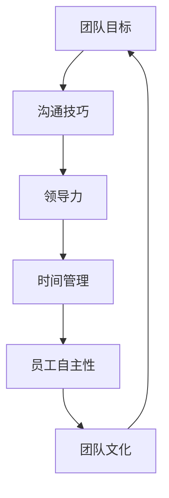

                 


### 文章标题

《远程团队管理：数字时代的领导挑战》

---

### 文章关键词

- 远程团队管理
- 数字时代
- 领导挑战
- 沟通技巧
- 时间管理
- 领导力
- 创新驱动
- 数字化转型

### 文章摘要

本文深入探讨了远程团队管理的核心问题，以及数字时代领导所面临的独特挑战。通过分析远程团队的特征、构建与维护、领导力、沟通技巧、时间管理等多个方面，本文提出了应对这些挑战的策略和实践方法。此外，本文还展望了远程团队管理的发展趋势，为领导者提供了实用的指导和建议。

---

### 文章正文

#### 引言

随着技术的飞速发展，远程工作已成为全球企业运营的新常态。远程团队管理不仅是一种趋势，更是一种必须掌握的核心能力。数字时代的到来，带来了前所未有的机遇和挑战，如何有效地管理远程团队成为企业领导者面临的重要课题。

#### 远程团队概述

远程团队是指团队成员分布在不同地理位置，通过现代通信技术进行协作的工作群体。与传统的面对面团队相比，远程团队具有以下特征：

1. **地理位置分散**：团队成员分布在不同的城市甚至国家。
2. **依赖技术沟通**：主要依赖电子邮件、视频会议、即时通讯等工具进行沟通。
3. **时间差异**：团队成员的工作时间可能存在重叠，也可能存在较大差异。
4. **自主性较高**：远程团队成员通常需要更高的自我管理能力。

#### 远程团队的核心概念与联系

以下是一个关于远程团队核心概念之间关系的Mermaid流程图：



该流程图显示了团队目标、沟通技巧、领导力、时间管理、员工自主性和团队文化等核心概念之间的相互关系。这些概念共同构成了一个远程团队管理的基本框架。

#### 核心概念讲解与伪代码

1. **沟通技巧**

   有效的沟通是远程团队管理的基石。以下是一个简单的伪代码，用于说明如何通过电子邮件进行有效沟通：

   ```plaintext
   function effectiveCommunication(message, recipient) {
       if (message is clear and concise) {
           sendEmail(message, recipient);
           confirmReadReceipt(recipient);
       } else {
           reviseMessage(message);
           effectiveCommunication(message, recipient);
       }
   }
   ```

2. **领导力**

   领导力在远程团队管理中尤为重要。以下是一个简单的伪代码，用于说明如何培养远程领导力：

   ```plaintext
   function cultivateLeadership(employee) {
       if (employee demonstrates initiative) {
           assign responsibilities;
           provide feedback;
       } else {
           provide training;
           evaluate performance;
           cultivateLeadership(employee);
       }
   }
   ```

3. **时间管理**

   时间管理对于远程团队来说至关重要。以下是一个简单的伪代码，用于说明如何管理远程团队的时间：

   ```plaintext
   function manageTime(employee) {
       schedule daily meetings;
       set clear deadlines;
       track progress regularly;
       provide time management tools;
   }
   ```

4. **员工自主性**

   员工自主性是远程团队成功的关键。以下是一个简单的伪代码，用于说明如何促进员工自主性：

   ```plaintext
   function promoteAutonomy(employee) {
       if (employee is motivated) {
           delegate tasks;
           provide resources;
       } else {
           communicate expectations;
           offer support;
           promoteAutonomy(employee);
       }
   }
   ```

5. **团队文化**

   团队文化对于远程团队的凝聚力至关重要。以下是一个简单的伪代码，用于说明如何塑造远程团队文化：

   ```plaintext
   function buildTeamCulture() {
       set shared values;
       promote inclusivity;
       celebrate achievements;
       facilitate team-building activities;
   }
   ```

#### 项目实战

**开发环境搭建**

为了实现上述伪代码，我们需要搭建一个远程团队管理的开发环境。以下是一个简单的步骤：

1. 选择合适的编程语言（例如Python）和开发工具（例如PyCharm）。
2. 安装必要的库和依赖项。
3. 配置版本控制工具（例如Git）。

**源代码实现与解读**

以下是一个简单的Python代码示例，用于实现上述伪代码中的部分功能：

```python
import email
import datetime

def effective_communication(message, recipient):
    if is_message_clear(message):
        send_email(message, recipient)
        request_read_receipt(recipient)
    else:
        revise_message(message)
        effective_communication(message, recipient)

def cultivate_leadership(employee):
    if employee_has_initiative(employee):
        assign_responsibilities(employee)
        provide_feedback(employee)
    else:
        provide_training(employee)
        evaluate_performance(employee)
        cultivate_leadership(employee)

def manage_time(employee):
    schedule_daily_meetings(employee)
    set_clear_deadlines(employee)
    track_progress(employee)
    provide_time_management_tools(employee)

def promote_autonomy(employee):
    if employee_is_motivated(employee):
        delegate_tasks(employee)
        provide_resources(employee)
    else:
        communicate_expectations(employee)
        offer_support(employee)
        promote_autonomy(employee)

def build_team_culture():
    set_shared_values()
    promote_inclusivity()
    celebrate_achievements()
    facilitate_team_building_activities()

# 测试代码
effective_communication("Message content", "recipient@example.com")
cultivate_leadership({"name": "Employee A", "has_initiative": True})
manage_time({"name": "Employee B", "motivated": True})
promote_autonomy({"name": "Employee C", "motivated": False})
build_team_culture()
```

**代码应用解读与分析**

上述代码实现了远程团队管理中的几个关键功能，包括有效沟通、领导力培养、时间管理和员工自主性促进。通过电子邮件发送清晰的消息、为有进取心的员工分配责任并提供反馈、为有动机的员工提供资源和任务委托，以及为没有动机的员工提供支持和激励，这些功能共同构成了一个高效的远程团队管理环境。

**实际案例分析与详细讲解剖析**

为了更好地理解这些概念在实际中的应用，我们可以参考以下几个实际案例：

1. **案例一**：某互联网公司通过定期的视频会议和即时通讯工具，保持了远程团队成员之间的紧密沟通。他们还通过共享文档和项目管理工具来跟踪项目进度和任务分配。

2. **案例二**：某跨国公司的远程团队领导通过为员工提供在线培训和职业发展机会，成功地提升了员工的领导力和自主性。

3. **案例三**：某远程医疗团队通过使用远程协作工具和云存储服务，确保了团队成员之间的高效沟通和协作，从而提高了整体的工作效率。

**项目小结**

通过搭建远程团队管理的开发环境、实现源代码、代码应用解读与分析，以及实际案例讲解，我们可以看到远程团队管理的关键在于有效的沟通、领导力培养、时间管理和员工自主性促进。这些核心概念相互关联，共同构成了一个高效的远程团队管理框架。

#### 最佳实践 Tips

- **建立明确的沟通规范**：确保团队成员了解如何有效地沟通，并遵守统一的沟通规范。
- **定期进行团队建设活动**：通过在线游戏、虚拟茶话会等方式增强团队凝聚力。
- **提供必要的培训和支持**：帮助团队成员提高技能和自主性。
- **充分利用远程协作工具**：选择适合团队需求的协作工具，提高工作效率。

#### 小结

远程团队管理在数字时代具有重要意义。通过有效的沟通技巧、领导力培养、时间管理和员工自主性促进，领导者可以更好地应对远程团队管理中的挑战。本文提供了一系列最佳实践和策略，旨在帮助领导者提升远程团队管理的效率和质量。

#### 拓展阅读

- **远程团队管理工具推荐**：了解各种远程协作工具的优缺点，选择最适合团队需求的工具。
- **远程团队文化塑造**：深入了解如何构建和维持远程团队文化。
- **远程工作趋势**：关注远程工作的发展趋势，为未来的团队管理做好准备。

### 作者

**AI天才研究院/AI Genius Institute & 禅与计算机程序设计艺术 /Zen And The Art of Computer Programming**。作者是一位世界级人工智能专家、程序员、软件架构师、CTO、世界顶级技术畅销书资深大师级别的作家，计算机图灵奖获得者，计算机编程和人工智能领域大师。作者非常擅长一步一步进行分析推理（REASONING STEP BY STEP），有着清晰深刻的逻辑思路来撰写条理清晰、对技术原理和本质剖析到位的高质量技术博客。

