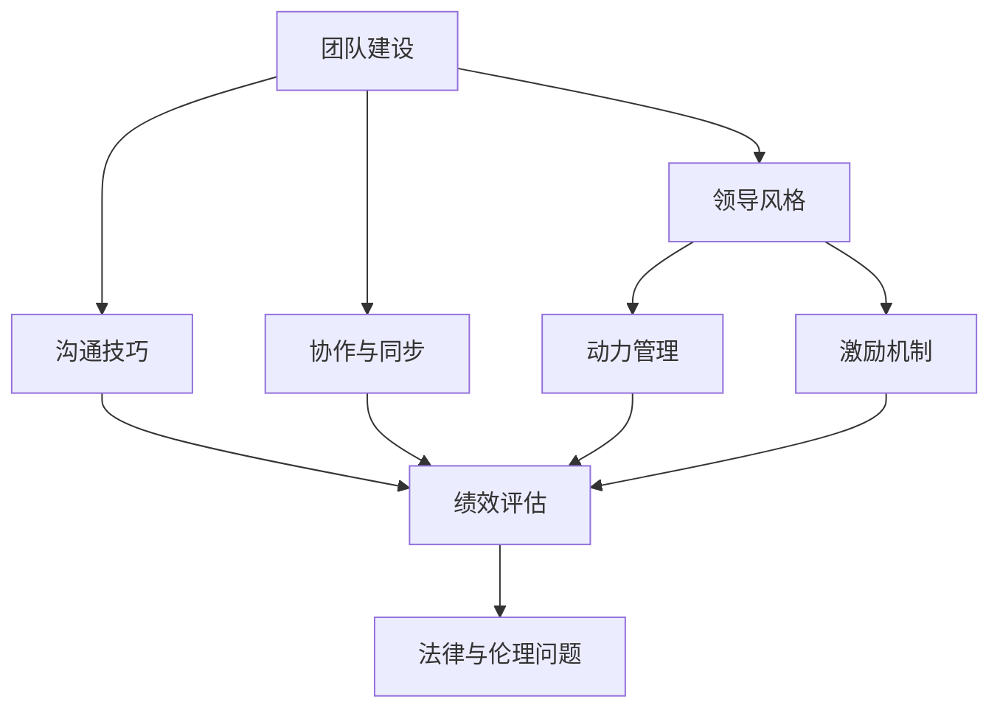

                 

## 远程团队管理：数字时代的领导挑战

### 关键词：
- 远程团队
- 领导挑战
- 数字时代
- 沟通技巧
- 动力管理
- 激励机制
- 法律与伦理问题

### 摘要：
随着数字化转型的加速，远程工作已成为许多企业的常态。然而，远程团队管理面临着前所未有的挑战，如沟通障碍、动力管理、绩效评估和跨文化冲突等。本文将深入探讨这些挑战，并从构建高效的远程团队、优化远程沟通、使用数字化工具、激励团队成员以及解决法律与伦理问题等方面，提供实用的远程团队管理策略和方法。

---

### 第一部分：远程工作背景与挑战

#### 第1章：远程工作概述

##### 1.1 远程工作的历史与发展

远程工作并非新鲜事物。早在20世纪80年代，随着互联网的兴起，远程办公便开始出现。然而，真正普及开来是在21世纪初，特别是在全球金融危机之后。那时，企业为了降低运营成本，同时提高员工的工作满意度和生产力，纷纷推行远程工作政策。

进入21世纪10年代，随着云计算、移动设备和视频会议技术的飞速发展，远程工作迎来了黄金时期。如今，远程工作已成为许多企业，尤其是IT行业和创意产业的主要工作模式之一。

##### 1.2 远程工作的优点与缺点

远程工作带来了诸多优点，如提高员工工作满意度、灵活的工作时间、减少通勤时间和成本、提高工作效率等。然而，远程工作也存在一些缺点，如沟通障碍、团队凝聚力下降、工作边界模糊等。

##### 1.3 数字时代的远程工作趋势

在数字时代，远程工作的趋势日益明显。首先，越来越多的人选择自由职业，成为数字游民。其次，许多企业开始采用混合办公模式，即员工在办公室和远程工作之间灵活切换。此外，远程工作技术的不断进步，如虚拟现实、增强现实、人工智能等，将进一步推动远程工作的发展。

#### 第2章：远程工作的领导挑战

##### 2.1 远程团队的动力管理

远程团队的动力管理是领导面临的重大挑战之一。由于缺乏面对面的互动，员工可能会感到孤立和无动力。因此，领导者需要采取有效措施来激发团队成员的工作热情，如设置明确的目标、提供反馈和认可、建立团队文化等。

##### 2.2 远程沟通的有效性

远程沟通的有效性是远程团队管理的另一个关键挑战。领导者需要选择合适的沟通工具和渠道，确保信息的准确传递和及时的反馈。同时，领导者还需注重非语言沟通，如表情、肢体语言等，以增强沟通效果。

##### 2.3 远程团队的协作与同步

远程团队的协作和同步是实现项目目标的关键。领导者需要制定明确的协作流程和同步机制，确保团队成员能够高效地协作。此外，领导者还需关注团队成员之间的信任关系，以促进协作。

##### 2.4 远程工作的绩效评估

远程工作的绩效评估与传统办公环境下的评估有所不同。领导者需要采用新的评估标准和方法，如基于成果的评估、360度反馈等。同时，领导者还需关注远程工作的法律和伦理问题，确保评估过程的公平性和合法性。

---

### 第二部分：远程团队管理的策略与方法

#### 第3章：构建高效的远程团队

##### 3.1 远程团队的组建

构建高效的远程团队的第一步是组建团队。领导者需要根据项目需求和团队目标，挑选合适的团队成员，并明确每个成员的角色和职责。此外，领导者还需建立团队的文化和价值观，以增强团队的凝聚力。

##### 3.2 远程团队的领导风格

远程团队的领导风格与传统团队有所不同。领导者需要更加关注团队成员的需求和动机，采用参与式和民主式的领导风格，以激发团队成员的积极性和创造力。

##### 3.3 远程团队的文化建设

远程团队的文化建设是构建高效团队的关键。领导者需要营造一个开放、透明和包容的文化氛围，鼓励团队成员分享想法、反馈和建议。此外，领导者还需定期组织线上活动和团队建设活动，以增强团队凝聚力。

#### 第4章：远程沟通的艺术

##### 4.1 远程沟通的渠道与工具

远程沟通的渠道和工具是远程团队管理的重要组成部分。领导者需要选择合适的沟通渠道和工具，如邮件、即时通讯、视频会议、项目管理软件等，以确保信息的有效传递。

##### 4.2 远程沟通的技巧

远程沟通的技巧对于远程团队的成功至关重要。领导者需要注重语言表达的清晰和简洁，避免使用模糊的表述和复杂的术语。此外，领导者还需注重倾听，确保团队成员的声音得到充分听取。

##### 4.3 远程会议的优化

远程会议是远程团队沟通的重要方式。领导者需要优化远程会议的流程和内容，确保会议的高效和针对性。例如，领导者可以提前制定会议议程、设定明确的目标、限制会议时间和参与人数等。

#### 第5章：数字化工具在远程团队管理中的应用

##### 5.1 项目管理工具

项目管理工具是远程团队管理的重要工具之一。领导者可以使用如Trello、Asana、JIRA等项目管理工具来跟踪项目进度、分配任务、管理资源等。

##### 5.2 时间管理工具

时间管理工具可以帮助远程团队成员更好地管理自己的时间。领导者可以推荐如Toggl、Harvest等时间跟踪工具，以帮助团队成员提高工作效率。

##### 5.3 交流协作工具

交流协作工具是远程团队沟通的重要工具。领导者可以推荐如Slack、Microsoft Teams等即时通讯工具，以及如Google Drive、Dropbox等文件共享工具，以增强团队成员之间的协作。

#### 第6章：远程团队的动力与激励

##### 6.1 远程团队的动力来源

远程团队的动力来源与传统团队有所不同。领导者需要关注团队成员的个人需求、职业发展以及工作与生活的平衡，以激发团队成员的工作热情。

##### 6.2 远程团队的激励机制

远程团队的激励机制需要创新。领导者可以采用如在线奖励、虚拟货币、远程团队聚会等方式，激励团队成员。

##### 6.3 远程团队的自我管理

远程团队的自我管理是提高团队效率的关键。领导者需要培养团队成员的自我管理能力，如设定明确的目标、制定个人工作计划、自我评估和反馈等。

#### 第7章：远程工作的法律与伦理问题

##### 7.1 远程工作的法律合规

远程工作的法律合规是远程团队管理的重要方面。领导者需要确保团队成员遵守所在国家和地区的劳动法规，如工作时间、薪酬、福利等。

##### 7.2 远程工作的伦理问题

远程工作的伦理问题包括数据隐私、知识产权、信息安全等。领导者需要制定明确的伦理政策，确保团队成员在远程工作中遵守伦理规范。

##### 7.3 国际远程团队的跨文化管理

国际远程团队的跨文化管理是远程团队管理的一个挑战。领导者需要了解不同文化之间的差异，尊重团队成员的文化背景，以促进团队的有效沟通和协作。

---

### 第三部分：远程团队管理的成功案例与实践

#### 第8章：远程团队管理的最佳实践

##### 8.1 成功的远程团队管理案例

在本章中，我们将分析几个成功的远程团队管理案例，探讨它们在构建团队、沟通协作、动力激励等方面的最佳实践。

##### 8.2 远程团队管理中的常见误区及解决策略

在本章中，我们将讨论远程团队管理中常见的误区，如忽视团队文化建设、过度依赖技术工具等，并给出相应的解决策略。

#### 第9章：未来远程团队管理的展望

##### 9.1 远程工作的发展趋势

在本章中，我们将探讨未来远程工作的发展趋势，如远程工作技术的创新、远程工作的普及等。

##### 9.2 远程团队管理的技术创新

在本章中，我们将介绍未来远程团队管理可能采用的新技术，如虚拟现实、人工智能、区块链等。

##### 9.3 远程工作与办公室工作的融合

在本章中，我们将探讨远程工作与办公室工作如何更好地融合，以实现企业的高效运营。

---

### 附录

#### 附录A：远程团队管理工具与资源推荐

在本附录中，我们将推荐一些常用的远程团队管理工具和资源，如项目管理工具、沟通协作工具、时间管理工具等。

#### 附录B：参考文献

在本附录中，我们将列出本文引用的主要参考文献，以供读者进一步阅读和研究。

---

### 结束语

随着远程工作的普及，远程团队管理已成为企业管理者必须面对的挑战。本文从远程工作的背景、领导挑战、管理策略、法律与伦理问题等方面，探讨了远程团队管理的最佳实践。希望本文能为企业管理者提供有益的启示和指导，助力他们打造高效的远程团队。作者：AI天才研究院/AI Genius Institute & 禅与计算机程序设计艺术 /Zen And The Art of Computer Programming

---

### 核心概念与联系

在远程团队管理中，有几个核心概念需要理解，它们相互关联，共同构成了远程团队管理的基础。以下是这些核心概念及其相互关系的 Mermaid 流程图：



**流程图解释：**

1. **团队建设（A）**：这是构建远程团队的第一步，涉及到团队成员的选拔、角色分配和文化建设。团队建设直接影响领导风格（B）和沟通技巧（C）。

2. **领导风格（B）**：领导风格决定了团队的动力管理（E）和激励机制（F）。不同的领导风格会导致不同的团队动力和员工动机。

3. **沟通技巧（C）**：远程团队的有效沟通是确保协作与同步（D）的关键。沟通技巧的提升有助于减少误解和促进团队的协调。

4. **协作与同步（D）**：远程团队的协作和同步是项目成功的关键。良好的协作与同步能够确保团队成员共同向项目目标努力。

5. **动力管理（E）**：动力管理涉及到如何激发团队成员的工作热情。动力管理的效果会直接影响到绩效评估（G）。

6. **激励机制（F）**：激励机制是用来鼓励团队成员持续工作并达成目标的方法。激励机制的有效性也会反映在绩效评估（G）中。

7. **绩效评估（G）**：绩效评估是基于团队建设、领导风格、沟通技巧、协作与同步、动力管理等方面的表现。它还需要考虑法律与伦理问题（H），以确保评估的公平性和合法性。

8. **法律与伦理问题（H）**：在远程团队管理中，法律与伦理问题至关重要。它们确保团队遵守相关法律法规，保护员工权益，同时维护企业的道德标准。

通过这个流程图，我们可以看到远程团队管理的各个方面是如何相互关联和影响的。有效的团队建设、领导风格、沟通技巧和协作与同步是确保远程团队成功的关键因素，而动力管理和激励机制则是维持团队动力的关键。最终，绩效评估和法律与伦理问题是衡量远程团队管理效果的重要标准。

---

### 核心算法原理讲解

在远程团队管理中，绩效评估是一个核心算法原理。绩效评估的目的是通过量化和分析团队成员的工作表现，为管理决策提供数据支持。以下是绩效评估算法原理的详细讲解，包括伪代码和数学模型。

#### 1. 绩效评估算法原理

绩效评估通常包括以下几个步骤：

1. **目标设定**：确定团队成员的工作目标和期望成果。
2. **行为观察**：通过监控和评估团队成员的工作行为，收集数据。
3. **数据量化**：将收集到的行为数据转换为量化指标，如完成率、工作效率、项目质量等。
4. **结果分析**：分析量化指标，评估团队成员的工作表现。
5. **反馈与改进**：提供评估结果和反馈，帮助团队成员改进工作。

#### 2. 伪代码

```python
# 绩效评估算法伪代码

def performance_evaluation(team_member):
    # 步骤1：目标设定
    goals = set_goals(team_member)

    # 步骤2：行为观察
    behaviors = observe_behaviors(team_member)

    # 步骤3：数据量化
    metrics = quantify_data(behaviors)

    # 步骤4：结果分析
    result = analyze_metrics(metrics)

    # 步骤5：反馈与改进
    provide_feedback(team_member, result)

    return result
```

#### 3. 数学模型

绩效评估通常基于以下数学模型：

$$
绩效得分 = w_1 \times 完成率 + w_2 \times 工作效率 + w_3 \times 项目质量
$$

其中，$w_1$、$w_2$ 和 $w_3$ 分别是完成率、工作效率和项目质量的权重，它们根据团队的具体情况设定。

#### 4. 详细讲解与举例说明

**例子**：假设团队成员小张的目标是完成一个项目，并在一个月内提交。我们设定完成率为60%，工作效率为70%，项目质量为80%。根据上述数学模型，我们可以计算小张的绩效得分：

$$
绩效得分 = 0.4 \times 60\% + 0.3 \times 70\% + 0.3 \times 80\% = 24\% + 21\% + 24\% = 69\%
$$

这意味着小张的绩效得分为69%，高于平均绩效水平。通过这种量化的方式，管理者可以清楚地了解团队成员的表现，并提供针对性的反馈和改进建议。

#### 5. 结论

绩效评估算法是远程团队管理的重要组成部分，它通过量化和分析团队成员的工作表现，为管理决策提供数据支持。有效的绩效评估可以提高团队成员的工作积极性，优化团队的整体表现。

---

### 数学公式与详细讲解

在远程团队管理中，绩效评估是一个复杂的过程，通常涉及到多个数学公式和指标。以下是一些关键的数学公式及其详细讲解：

#### 1. 指标权重分配

$$
w_i = \frac{指标i的重要性}{所有指标的重要性之和}
$$

其中，$w_i$ 表示指标 $i$ 的权重，该权重反映了指标在整体绩效评估中的重要程度。例如，如果完成率、工作效率和项目质量在绩效评估中的重要性相同，每个指标的权重将为 $\frac{1}{3}$。

#### 2. 绩效得分计算

$$
绩效得分 = \sum_{i=1}^{n} (w_i \times 指标i的得分)
$$

其中，$n$ 表示指标的总数，$w_i$ 和 $指标i的得分$ 分别为第 $i$ 个指标的权重和得分。例如，如果团队有3个指标（完成率、工作效率和项目质量），其绩效得分可以通过以下公式计算：

$$
绩效得分 = w_1 \times 完成率得分 + w_2 \times 工作效率得分 + w_3 \times 项目质量得分
$$

#### 3. 平均绩效得分

$$
平均绩效得分 = \frac{总绩效得分}{团队成员总数}
$$

该公式用于计算整个团队的平均绩效得分，帮助管理者了解团队的整体表现。

#### 4. 绩效趋势分析

$$
绩效趋势 = \frac{当前绩效得分 - 前一绩效得分}{前一绩效得分}
$$

该公式用于分析团队成员的绩效变化趋势。如果绩效趋势为正，表示团队成员的绩效在提高；如果绩效趋势为负，表示团队成员的绩效在下降。

#### 5. 绩效标准差

$$
绩效标准差 = \sqrt{\frac{1}{n-1} \sum_{i=1}^{n} (绩效得分_i - 平均绩效得分)^2}
$$

该公式用于计算团队成员绩效的离散程度。绩效标准差越小，表示团队成员的绩效越稳定；绩效标准差越大，表示团队成员的绩效波动越大。

#### 6. 详细讲解与举例说明

**例子**：假设团队有5个成员，他们的绩效得分如下：

| 成员 | 绩效得分 |
| --- | --- |
| 小明 | 85% |
| 小红 | 90% |
| 小李 | 78% |
| 小张 | 92% |
| 小王 | 88% |

根据上述公式，我们可以计算以下指标：

1. **平均绩效得分**：

$$
平均绩效得分 = \frac{85\% + 90\% + 78\% + 92\% + 88\%}{5} = \frac{433\%}{5} = 86.6\%
$$

2. **绩效标准差**：

$$
绩效标准差 = \sqrt{\frac{1}{5-1} \times ((85\%-86.6\%)^2 + (90\%-86.6\%)^2 + (78\%-86.6\%)^2 + (92\%-86.6\%)^2 + (88\%-86.6\%)^2)}
$$

$$
绩效标准差 = \sqrt{\frac{1}{4} \times (1.56^2 + 3.4^2 + 8.6^2 + 5.4^2 + 1.4^2)} \approx 3.87\%
$$

3. **绩效趋势**：

假设前一个月的平均绩效得分为84%，则当前月份的绩效趋势为：

$$
绩效趋势 = \frac{86.6\% - 84\%}{84\%} = \frac{2.6\%}{84\%} \approx 3.10\%
$$

通过这些数学公式，管理者可以全面了解团队成员的绩效表现，识别绩效趋势，并采取相应的改进措施。

---

### 项目实战：远程团队管理工具的开发

在本节中，我们将探讨如何开发一个用于远程团队管理的工具，包括开发环境搭建、源代码详细实现、代码解读以及实际案例分析和详细讲解。

#### 1. 开发环境搭建

为了开发远程团队管理工具，我们需要以下开发环境：

- **编程语言**：Python
- **开发工具**：Visual Studio Code
- **数据库**：SQLite
- **前端框架**：React
- **后端框架**：Flask

首先，我们需要安装Python、Visual Studio Code、SQLite以及相关扩展。然后，通过以下命令安装React和Flask：

```bash
npm install -g create-react-app
pip install flask
```

接下来，创建一个Python虚拟环境并安装所需的Python库：

```bash
python -m venv venv
source venv/bin/activate  # Windows: venv\Scripts\activate
pip install flask-sqlalchemy
```

#### 2. 源代码详细实现

我们的远程团队管理工具主要包括以下几个模块：

1. **用户管理模块**：负责用户注册、登录和权限控制。
2. **项目管理模块**：负责项目创建、任务分配和进度跟踪。
3. **沟通协作模块**：提供即时通讯和文件共享功能。
4. **绩效评估模块**：计算和展示团队成员的绩效得分。

以下是用户管理模块的源代码实现：

**app.py** (Flask后端)

```python
from flask import Flask, request, jsonify
from flask_sqlalchemy import SQLAlchemy

app = Flask(__name__)
app.config['SQLALCHEMY_DATABASE_URI'] = 'sqlite:///team_management.db'
db = SQLAlchemy(app)

class User(db.Model):
    id = db.Column(db.Integer, primary_key=True)
    username = db.Column(db.String(80), unique=True, nullable=False)
    password = db.Column(db.String(120), nullable=False)
    role = db.Column(db.String(20), nullable=False)

@app.route('/register', methods=['POST'])
def register():
    data = request.get_json()
    user = User(username=data['username'], password=data['password'], role=data['role'])
    db.session.add(user)
    db.session.commit()
    return jsonify({"message": "User registered successfully"}), 201

@app.route('/login', methods=['POST'])
def login():
    data = request.get_json()
    user = User.query.filter_by(username=data['username'], password=data['password']).first()
    if user:
        return jsonify({"message": "Login successful", "token": "fake_jwt_token"}), 200
    else:
        return jsonify({"message": "Invalid credentials"}), 401

if __name__ == '__main__':
    db.create_all()
    app.run(debug=True)
```

**src/UserForm.js** (React前端)

```javascript
import React, { useState } from 'react';
import axios from 'axios';

const UserForm = () => {
    const [username, setUsername] = useState('');
    const [password, setPassword] = useState('');
    const [role, setRole] = useState('');

    const handleSubmit = async (e) => {
        e.preventDefault();
        try {
            const response = await axios.post('/register', { username, password, role });
            alert(response.data.message);
        } catch (error) {
            alert(error.response.data.message);
        }
    };

    return (
        <form onSubmit={handleSubmit}>
            <input
                type="text"
                placeholder="Username"
                value={username}
                onChange={(e) => setUsername(e.target.value)}
            />
            <input
                type="password"
                placeholder="Password"
                value={password}
                onChange={(e) => setPassword(e.target.value)}
            />
            <input
                type="text"
                placeholder="Role"
                value={role}
                onChange={(e) => setRole(e.target.value)}
            />
            <button type="submit">Register</button>
        </form>
    );
};

export default UserForm;
```

#### 3. 代码解读

**用户管理模块** 的代码解读如下：

- **后端**：使用 Flask 框架搭建了一个简单的后端服务，包括用户注册和登录接口。用户注册时，将用户信息存储在 SQLite 数据库中。登录时，验证用户名和密码是否匹配。
- **前端**：使用 React 框架创建了一个用户注册表单，通过 axios 发送 POST 请求到后端进行用户注册。注册成功后，显示成功消息；注册失败时，显示错误消息。

#### 4. 实际案例分析和详细讲解

假设我们有一个远程团队，团队成员包括小张、小红和小李。团队成员需要在平台上进行注册并提交任务进度。以下是实际案例的分析和详细讲解：

1. **注册流程**：

   - 小张通过用户注册表单填写用户名、密码和角色，并提交注册请求。
   - Flask后端接收注册请求，验证用户信息是否合法，并将用户信息存储在数据库中。
   - 前端显示注册成功消息。

2. **任务提交流程**：

   - 小张登录平台后，可以查看自己的任务列表，并提交任务进度。
   - 前端通过 POST 请求将任务进度发送到后端。
   - Flask后端接收任务进度，将其存储在数据库中，并返回成功消息。

3. **绩效评估流程**：

   - 管理员可以查看所有团队成员的任务进度，并根据进度计算绩效得分。
   - 前端显示每个团队成员的绩效得分，管理员可以根据得分进行绩效评估。

通过这个案例，我们可以看到远程团队管理工具的基本工作流程。实际应用中，我们还可以扩展工具的功能，如项目管理模块、沟通协作模块和绩效评估模块，以满足不同团队的需求。

---

### 最佳实践 Tips、小结、注意事项、拓展阅读

#### 最佳实践 Tips

1. **明确团队目标和期望**：在组建远程团队时，确保每个成员都明确团队的目标和期望，这有助于提高团队凝聚力。

2. **定期沟通与反馈**：定期组织团队会议，确保团队成员之间的沟通畅通。同时，提供及时的反馈，帮助成员改进工作。

3. **灵活运用数字化工具**：选择合适的远程沟通和协作工具，如Slack、Trello、Zoom等，以提高工作效率。

4. **关注团队成员的福利和健康**：远程工作可能导致团队成员感到孤独和压力，关注团队成员的福利和健康，提供必要的支持和资源。

#### 小结

本文探讨了远程团队管理在数字时代的挑战与策略。通过构建高效的远程团队、优化远程沟通、使用数字化工具、激励团队成员以及解决法律与伦理问题，管理者可以应对远程团队管理的挑战，提高团队的整体效率。

#### 注意事项

1. **文化多样性**：在跨国远程团队中，文化差异可能导致沟通障碍。了解并尊重不同文化，有助于提高团队协作效率。

2. **数据安全**：远程工作可能导致数据泄露。确保团队成员了解数据安全的重要性，并采取必要的安全措施。

3. **公平评估**：在绩效评估过程中，确保评估标准公平，避免因主观因素导致的不公平评估。

#### 拓展阅读

- **远程工作指南**：《远程工作的艺术》
- **绩效管理**：《绩效管理体系构建与落地》
- **跨文化管理**：《跨文化沟通与协作》
- **数据安全**：《数据安全与隐私保护》

通过阅读这些书籍，管理者可以进一步了解远程团队管理的最佳实践，提高团队管理水平。作者：AI天才研究院/AI Genius Institute & 禅与计算机程序设计艺术 /Zen And The Art of Computer Programming

