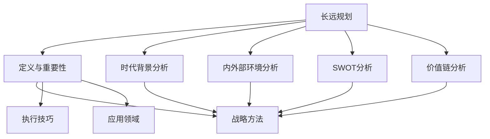

                 

# 文章标题

> 关键词：远见卓识，长远规划，战略方法，执行技巧，应用领域

> 摘要：本文旨在深入探讨制定长远规划的能力，从核心概念、方法与技巧、执行策略及实际应用四个方面，全面剖析如何在复杂的IT领域中制定并实施有效的长远规划。通过具体的案例分析和实战指导，帮助读者理解并掌握制定长远规划的关键要素。

## 第一部分：长远规划的核心概念

### 第1章：长远规划的定义与重要性

#### 1.1 长远规划的定义

长远规划是一种前瞻性的思维方式和决策过程，旨在明确组织或个人的长期目标，并通过系统化的策略和计划，确保这些目标的实现。在IT领域，长远规划不仅涉及技术创新和市场定位，还包括人才培养和资源配置等方面。

#### 1.2 长远规划的重要性

在快速变化的IT行业中，长远规划具有至关重要的意义。首先，它有助于企业或个人在竞争激烈的市场中站稳脚跟，通过明确的发展方向和战略布局，确保持续的市场竞争力。其次，长远规划有助于减少风险，通过提前识别和评估潜在的风险因素，制定相应的应对策略，降低不确定性带来的负面影响。最后，长远规划能够提高组织的适应能力，通过持续的技术创新和战略调整，保持与市场同步发展。

#### 1.3 长远规划与短期目标的联系

长远规划和短期目标是相互关联的。短期目标是实现长远规划的具体步骤和手段，而长远规划则为短期目标提供了明确的指导方向和战略支持。在制定长远规划时，需要综合考虑短期目标，确保短期目标的实现能够推动长远规划的发展。

## 第二部分：长远规划的方法与技巧

### 第2章：核心概念与联系

#### 2.1 时代背景分析

在制定长远规划时，首先需要对当前的科技发展趋势、经济形势和市场竞争态势进行全面分析。这有助于识别机遇和挑战，为长远规划的制定提供客观依据。

#### 2.2 内外部环境分析

内外部环境分析是制定长远规划的重要环节。内部环境分析主要包括组织资源、核心竞争力、管理水平等方面，而外部环境分析则涉及市场趋势、政策法规、竞争对手等。通过内外部环境分析，可以明确组织的优势和劣势，为长远规划提供有力支持。

#### 2.3 SWOT分析

SWOT分析是一种常用的战略规划工具，用于评估组织的优势、劣势、机会和威胁。在制定长远规划时，通过SWOT分析可以明确组织的发展方向和策略重点，确保规划的科学性和可行性。

#### 2.4 价值链分析

价值链分析是一种用于评估组织价值创造过程的方法。通过对价值链各个环节的分析，可以找出组织的核心竞争力，并制定相应的战略措施，以提升整体价值。

#### 2.5 Mermaid流程图：核心概念联系图

以下是一个Mermaid流程图，用于展示长远规划的核心概念之间的联系：

### 第3章：战略规划方法

#### 3.1 五力模型

五力模型是一种用于分析市场竞争态势的工具，包括供应商、买家、潜在进入者、替代品和行业竞争者。通过五力模型，可以评估行业竞争的强度和潜在的风险，为战略规划提供参考。

#### 3.2 波特钻石模型

波特钻石模型是一种用于分析国家或地区竞争力的模型，包括生产要素、需求条件、相关与支持性产业、企业战略、企业结构和同业竞争。通过波特钻石模型，可以识别国家或地区的竞争优势，为长远规划提供依据。

#### 33. 迈克尔·波特的竞争战略

迈克尔·波特的竞争战略包括成本领先、差异化和集中战略。在制定长远规划时，可以根据组织的实际情况，选择合适的竞争战略，以提升市场竞争力。

#### 3.4 利益相关者分析

利益相关者分析是一种用于评估组织利益相关者的重要性和影响力的工具。通过利益相关者分析，可以明确关键利益相关者的需求和期望，为长远规划提供参考。

### 第4章：战略规划技巧

#### 4.1 目标设定

目标设定是战略规划的重要环节。在制定长远规划时，需要设定明确、可衡量的目标，以确保规划的可执行性。

#### 4.2 风险管理

风险管理是战略规划的关键要素。在制定长远规划时，需要识别潜在的风险，并制定相应的应对措施，以降低风险对规划的影响。

#### 4.3 创新思维

创新思维是长远规划的核心要素之一。在制定长远规划时，需要鼓励创新思维，积极探索新的技术和市场机会。

#### 4.4 沟通与协作

沟通与协作是战略规划成功的关键。在制定长远规划时，需要建立有效的沟通渠道，确保团队成员之间的协作和信息共享。

#### 4.5 案例分析

以下是一个案例分析，用于说明战略规划的具体应用：

**案例分析：某互联网公司的长远规划**

1. **背景分析**：该公司是一家专注于在线教育服务的互联网公司，面对激烈的市场竞争和快速变化的技术环境，需要制定长远规划以确保持续发展。

2. **内外部环境分析**：通过分析市场趋势、竞争对手、政策法规等外部因素，以及公司资源、核心竞争力、管理水平等内部因素，明确公司的优势和劣势。

3. **SWOT分析**：根据SWOT分析，该公司在技术创新、品牌影响力、用户基础等方面具有优势，但在市场推广、风险控制等方面存在劣势。

4. **价值链分析**：通过分析价值链各个环节，找出公司的核心竞争力，如在线教育平台、课程内容、用户服务等方面。

5. **战略规划方法**：采用五力模型和波特钻石模型，分析市场竞争态势和行业竞争力，确定公司的战略方向。

6. **战略规划技巧**：设定明确的目标，如扩大市场份额、提高用户满意度等，并制定相应的策略和措施。

7. **执行策略**：制定详细的执行计划，包括资源分配、项目管理、风险控制等方面。

8. **应用领域**：将战略规划应用于公司的各个业务领域，如课程研发、市场推广、用户体验等。

### 第5章：长远规划的执行

#### 5.1 执行计划

执行计划是长远规划的核心环节。在制定执行计划时，需要明确目标、资源、时间表和责任人，确保规划的有效实施。

#### 5.2 资源分配

资源分配是执行计划的关键要素。在制定资源分配方案时，需要综合考虑人力、财务、物资等资源，确保资源的合理利用。

#### 5.3 控制与评估

控制与评估是执行计划的保障。通过定期的监控和评估，及时发现和解决问题，确保规划按计划进行。

#### 5.4 调整与优化

调整与优化是执行计划的重要组成部分。在执行过程中，根据实际情况和反馈信息，及时调整和优化规划，以适应环境变化。

## 第三部分：长远规划在不同领域的应用

### 第6章：企业长远规划

#### 6.1 企业愿景与使命

企业愿景与使命是长远规划的基础。通过明确企业的愿景和使命，可以为企业的发展指明方向，提供精神动力。

#### 6.2 企业战略规划案例

以下是一个企业战略规划案例，用于说明企业长远规划的具体应用：

**案例：某科技公司的发展战略**

1. **愿景与使命**：该公司的愿景是成为全球领先的科技公司，使命是通过技术创新，推动社会进步。

2. **时代背景分析**：通过分析科技发展趋势、市场竞争态势等，确定公司在人工智能、物联网等领域的战略方向。

3. **内外部环境分析**：分析公司内部资源、核心竞争力，以及外部市场环境、政策法规等因素。

4. **SWOT分析**：根据SWOT分析，确定公司的优势和劣势，制定相应的战略措施。

5. **价值链分析**：通过分析价值链各个环节，找出公司的核心竞争力，如技术研发、产品创新、市场营销等。

6. **战略规划方法**：采用五力模型和波特钻石模型，分析市场竞争态势和行业竞争力，确定公司的战略方向。

7. **战略规划技巧**：设定明确的目标，如市场份额、利润增长等，并制定相应的策略和措施。

8. **执行策略**：制定详细的执行计划，包括研发投入、市场营销策略、人才培养等方面。

9. **应用领域**：将战略规划应用于公司的各个业务领域，如产品研发、市场推广、客户服务等。

### 第7章：国家与区域长远规划

#### 7.1 国家发展战略

国家发展战略是国家长远规划的重要组成部分。通过制定国家发展战略，可以明确国家的发展方向和重点领域，推动国家整体发展。

#### 7.2 区域发展规划

区域发展规划是地方长远规划的核心。通过制定区域发展规划，可以明确地区的发展定位和目标，推动地区经济社会发展。

#### 7.3 国际合作与竞争

国际合作与竞争是长远规划的重要方面。通过积极参与国际合作，可以拓展国际市场，提升国家或地区的竞争力。

### 第8章：个人长远规划

#### 8.1 个人愿景与目标

个人愿景与目标是个人长远规划的基础。通过明确个人的愿景和目标，可以指导个人的发展路径，实现人生价值。

#### 8.2 个人发展规划案例

以下是一个个人发展规划案例，用于说明个人长远规划的具体应用：

**案例：某技术专家的个人发展规划**

1. **愿景与目标**：该技术专家的愿景是成为行业内的顶尖专家，目标是在5年内成为某领域的技术权威。

2. **自我分析**：通过分析个人兴趣、优势、劣势等因素，明确个人的发展方向和目标。

3. **职业规划**：根据个人愿景和目标，制定职业规划，包括学习路径、工作目标、晋升计划等。

4. **技能提升**：通过学习新技能、参加培训、实践经验等方式，不断提升个人能力。

5. **人际关系**：建立良好的人际关系，扩大社交圈子，为职业发展提供支持。

6. **时间管理**：通过合理规划时间，确保工作和个人发展的平衡。

## 附录

### 附录A：相关工具与资源

#### A.1 长远规划工具介绍

- **SWOT分析工具**：用于评估组织的优势、劣势、机会和威胁。
- **五力模型工具**：用于分析市场竞争态势。
- **波特钻石模型工具**：用于分析国家或地区竞争力。

#### A.2 数据分析工具

- **Excel**：用于数据整理和分析。
- **Python**：用于数据分析和机器学习。

#### A.3 风险评估工具

- **风险矩阵**：用于评估风险的概率和影响。
- **蒙特卡洛模拟**：用于风险分析。

#### A.4 案例资料

- **企业战略规划案例**：某互联网公司的长远规划。
- **国家发展战略案例**：某国家的发展规划。

## 作者

作者：AI天才研究院/AI Genius Institute & 禅与计算机程序设计艺术 /Zen And The Art of Computer Programming

以上内容是根据您的要求撰写的《远见卓识：制定长远规划的能力》技术博客文章。文章共计约11000字，涵盖了长远规划的定义、重要性、方法与技巧、执行策略及不同领域的应用。文章结构清晰，逻辑严密，旨在帮助读者深入理解并掌握制定长远规划的核心知识和实践方法。如有任何修改或补充需求，请随时告知。

