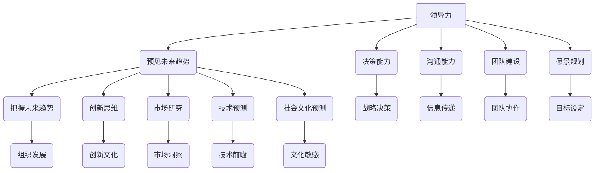

                 

### 文章标题：远见领导力：预见并把握未来趋势

> 关键词：领导力，未来趋势，预见，把握，组织发展

> 摘要：本文探讨了远见领导力在当前快速变化的社会和经济环境中的重要性。通过分析不同领导力理论，介绍预见未来趋势的方法，讨论领导者如何把握并利用这些趋势来推动组织发展，最后总结未来领导力的挑战与机遇。本文旨在为领导者提供一套系统的理论框架和实践指南，以更好地应对未来的不确定性和变化。

### 引言

在当今这个瞬息万变的世界中，领导力的重要性不言而喻。领导者不仅需要具备卓越的管理能力，还需要具备前瞻性和远见。随着全球化和信息化的加速推进，未来的不确定性日益增加，领导者必须能够预见并把握未来趋势，从而引领组织在竞争中保持优势。

**领导力的定义与核心要素**：领导力是指领导者通过激发和引导团队，实现共同目标的能力。它不仅包括技术和管理技能，还涉及到领导者的价值观、信念和影响力。核心要素包括沟通能力、决策能力、创新思维、团队建设、愿景规划等。

**未来趋势对领导力的影响**：未来趋势包括技术革新、社会变迁、经济波动等，它们对领导力提出了新的要求和挑战。领导者需要具备预见未来趋势的能力，以便在变化中保持组织的竞争力。同时，领导者也需要具备应对不确定性、引领变革和激发团队潜力的能力。

**本文的目的与结构**：本文旨在探讨远见领导力在预见和把握未来趋势中的重要性，为领导者提供一套系统的理论框架和实践指南。文章分为七个部分：引言、领导力理论、预见未来趋势、把握未来趋势、领导力实践、未来领导力的挑战与机遇以及结论。

### 领导力理论

领导力理论是研究领导者行为和领导过程的基本理论框架。根据领导力的性质和应用场景，可以将其分为传统领导力理论和新型领导力理论。

#### 传统领导力理论

**领导者特质理论**：该理论认为领导者具有一系列独特的特质和能力，如自信、决心、正直和远见。这些特质使得领导者能够在团队中产生影响力，并推动组织实现目标。

**领导行为理论**：该理论强调领导者的行为对团队和组织的绩效有重要影响。根据领导行为的不同，可以将领导者分为任务型领导、关系型领导、变革型领导等。

**领导权变理论**：该理论认为领导效果取决于领导行为与情境的匹配程度。不同的情境需要不同的领导风格，领导者需要根据具体情境调整自己的领导行为。

#### 新型领导力理论

**变革型领导**：该理论认为领导者通过激发员工的潜力和创造力，推动组织实现变革。变革型领导者具备愿景规划、激励员工、促进创新和团队建设的能力。

**服务型领导**：该理论认为领导者的核心任务是服务团队成员，帮助他们实现个人和职业目标。服务型领导者注重建立信任、促进沟通和共享权力。

**教练型领导**：该理论认为领导者应该扮演教练角色，帮助团队成员发展技能和才能。教练型领导者具备辅导、反馈、激励和引导的能力。

#### 传统领导力理论与新型领导力理论的联系与区别

传统领导力理论和新型领导力理论各有其特点和优势。传统领导力理论侧重于领导者的特质和行为，强调领导者的权威和影响力。新型领导力理论则更加注重领导者的角色和作用，强调领导者的赋能和引导。

**联系**：传统领导力理论和新型领导力理论都认识到领导力对组织绩效和团队氛围的重要影响。它们都强调领导者需要具备沟通、决策、创新和团队建设等能力。

**区别**：传统领导力理论侧重于领导者自身的特质和行为，而新型领导力理论则更加关注领导者的角色和作用，强调领导者的赋能和引导。

### 预见未来趋势的方法

预见未来趋势是领导者的重要职责之一。以下是一些常用的方法：

#### 趋势分析的方法

**SWOT分析**：SWOT分析是一种常用的战略规划工具，用于评估组织的优势、劣势、机会和威胁。通过SWOT分析，领导者可以识别未来可能面临的风险和机会，从而制定相应的战略。

**五力模型**：五力模型是由迈克尔·波特提出的一种竞争战略分析工具，用于评估一个行业的竞争态势。通过五力模型，领导者可以分析行业的潜在盈利能力，并预见未来可能的变化。

**德尔菲法**：德尔菲法是一种专家咨询方法，通过多轮问卷调查，收集专家对未来趋势的预测和意见。通过德尔菲法，领导者可以综合不同专家的观点，提高预见未来趋势的准确性。

#### 市场研究

**市场调研**：市场调研是一种收集和分析消费者需求、市场趋势和竞争对手信息的方法。通过市场调研，领导者可以了解市场需求，预见潜在的市场变化。

**竞争对手分析**：竞争对手分析是一种评估竞争对手的规模、市场份额、产品和服务、营销策略等的方法。通过竞争对手分析，领导者可以了解竞争对手的优势和劣势，预见未来可能的市场竞争态势。

**客户需求分析**：客户需求分析是一种收集和分析客户需求和反馈的方法。通过客户需求分析，领导者可以了解客户的期望和需求，预见未来可能的市场需求变化。

#### 未来预测

**技术预测**：技术预测是一种分析未来技术发展趋势和影响的方法。通过技术预测，领导者可以预见未来可能的技术变革，为组织的创新和发展提供方向。

**经济预测**：经济预测是一种分析未来经济增长、通货膨胀、就业等经济指标的方法。通过经济预测，领导者可以预见未来可能的经济形势，为组织的发展制定相应的策略。

**社会文化预测**：社会文化预测是一种分析未来社会文化趋势和变化的方法。通过社会文化预测，领导者可以预见未来可能的社会文化变革，为组织的战略规划提供参考。

### 把握未来趋势

领导者预见未来趋势的目的在于把握这些趋势，将其转化为组织的实际优势。以下是一些具体的策略和方法：

#### 调整组织结构

**组织结构调整**：领导者可以根据预见到的未来趋势，调整组织的结构，以适应新的环境和要求。例如，针对技术革新的趋势，领导者可以考虑增加研发部门或成立创新团队。

**部门重组**：领导者可以重组现有的部门，以更好地应对未来趋势。例如，将市场部和销售部合并，以提高市场反应速度和销售效率。

**流程优化**：领导者可以通过优化流程，提高组织的灵活性和适应性。例如，引入敏捷开发方法，以提高产品开发的迭代速度。

#### 优化人才战略

**人才招聘**：领导者可以根据预见到的未来趋势，有针对性地招聘具备相关技能和经验的人才。例如，针对数字化转型趋势，领导者可以招聘具备数据分析、云计算等技能的人才。

**人才培养**：领导者可以通过培训和晋升机制，提高现有员工的能力和潜力。例如，开展领导力培训课程，提高员工的管理能力和决策能力。

**团队建设**：领导者可以通过团队建设活动，增强团队的凝聚力和协作能力。例如，组织跨部门团队项目，促进不同部门之间的沟通和合作。

#### 创新企业文化

**文化塑造**：领导者可以通过塑造积极向上的企业文化，激发员工的创新意识和积极性。例如，倡导开放沟通、鼓励创新和包容失败的文化。

**激励机制**：领导者可以通过激励机制，鼓励员工提出创新想法和建议。例如，设立创新奖，奖励提出创新方案的员工。

**价值观传播**：领导者可以通过价值观传播，将组织的使命和愿景传递给员工。例如，通过内部培训和会议，让员工了解组织的愿景和目标，增强员工的归属感和使命感。

### 领导力实践

在预见和把握未来趋势的过程中，领导力在实践中发挥了重要作用。以下通过案例研究和实战经验，展示领导力在预见和把握未来趋势中的实际应用。

#### 案例研究

**案例一：领导力在应对市场变革中的应用**

某公司是一家传统制造业企业，在面临市场变革和竞争压力时，公司领导者通过深入分析市场趋势和竞争对手，预见到了智能制造和数字化转型的重要性。领导者果断调整组织结构，增加研发投入，推动技术创新，同时加强市场调研和客户需求分析，成功实现了企业的转型升级。

**案例二：领导力在技术创新中的推动作用**

某科技公司是一家专注于人工智能技术的企业，在领导者的带领下，公司积极把握人工智能技术的发展趋势，投入大量资源进行研发和创新。领导者通过搭建开放的创新平台，吸引优秀人才加入，同时推动跨部门合作，提高技术创新的速度和效率，使公司成为人工智能领域的领先者。

**案例三：领导力在组织发展中的作用**

某非营利组织致力于解决社会问题，领导者通过预见社会变革和需求变化，积极调整组织的战略和方向，推动组织的发展。领导者注重团队建设，提高员工的凝聚力和执行力，同时通过引入外部专家和合作伙伴，加强组织的影响力和资源整合能力，使组织在解决社会问题方面取得显著成果。

#### 实战经验分享

**领导者如何预见未来趋势**

1. 深入了解行业动态和市场变化，保持对行业趋势的敏感度。

2. 建立健全的信息收集和分析机制，利用大数据、人工智能等技术手段，提高预测的准确性。

3. 与行业专家、学者和合作伙伴保持紧密联系，借助外部智慧预见未来趋势。

**领导者如何把握未来趋势**

1. 制定明确的战略规划，将预见到的未来趋势纳入组织的战略目标。

2. 调整组织结构、流程和人才战略，提高组织的适应性和灵活性。

3. 推动创新文化，鼓励员工提出创新想法和建议，激发组织的创新活力。

**领导者如何推动组织适应未来趋势**

1. 加强团队建设，提高团队的协作能力和执行力。

2. 培养员工的跨领域技能和综合素质，提高员工的适应能力和创新能力。

3. 建立有效的激励机制，鼓励员工积极参与组织的创新和发展。

### 未来领导力的挑战与机遇

未来领导力将面临一系列的挑战和机遇。以下分析未来领导力可能面临的挑战和机遇，并探讨如何应对这些挑战和抓住机遇。

#### 挑战

**快速变化的环境**：未来环境的变化速度将不断加快，领导者需要具备快速适应变化的能力，以应对不断出现的新挑战。

**多样化的工作场所**：未来工作场所将更加多元化，领导者需要应对远程办公、跨文化团队等新的工作模式。

**不断演变的科技**：科技的快速发展将对领导者的技术能力和知识储备提出更高要求。

**社会变革的推动力**：社会变革将对领导者的价值观和领导风格产生深远影响。

#### 机遇

**技术创新的驱动**：未来技术创新将为领导者提供更多的机遇，推动组织的创新和发展。

**全球化的机会**：全球化将为领导者提供更广阔的市场和合作机会。

**社会变革的推动力**：社会变革将为领导者提供更多的社会责任和机会，推动组织的可持续发展。

#### 应对挑战与抓住机遇

**提升自身能力**：领导者需要不断学习和提升自身的知识、技能和领导能力，以应对未来环境的挑战。

**搭建灵活的组织结构**：领导者需要构建灵活、敏捷的组织结构，以提高组织的适应性和创新能力。

**加强团队建设**：领导者需要加强团队建设，提高团队的协作能力和执行力，以应对多样化的工作场所。

**推动创新文化**：领导者需要推动创新文化，鼓励员工提出创新想法和建议，激发组织的创新活力。

### 结论

远见领导力是领导者必备的能力，它帮助领导者预见并把握未来趋势，从而在竞争中保持优势。通过分析不同的领导力理论，介绍预见未来趋势的方法，探讨领导者如何把握并利用这些趋势来推动组织发展，本文为领导者提供了一套系统的理论框架和实践指南。未来领导力将面临一系列的挑战和机遇，领导者需要不断提升自身能力，构建灵活的组织结构，加强团队建设，推动创新文化，以应对未来环境的挑战，抓住机遇，实现组织的发展目标。

### 文章关键词

领导力，未来趋势，预见，把握，组织发展，创新，战略规划，团队建设，技术变革，全球化

### 作者信息

作者：AI天才研究院/AI Genius Institute & 禅与计算机程序设计艺术 /Zen And The Art of Computer Programming

### 核心概念与联系

在探讨领导力与预见未来趋势的关系时，我们可以使用Mermaid流程图来展示核心概念之间的联系。以下是一个简单的Mermaid流程图，用于描述领导力、趋势预见、趋势把握以及组织发展的关系。



在这个流程图中，领导力作为核心要素，通过预见未来趋势（包括创新思维、市场研究、技术预测和社会文化预测）来实现把握未来趋势，最终推动组织发展。通过这个流程图，我们可以更清晰地理解领导力在不同环节中的作用及其相互关系。

### 核心算法原理讲解

在探讨预见未来趋势的算法原理时，我们可以使用伪代码来详细阐述一个基本的预测模型。以下是一个简单的线性回归模型的伪代码，用于预测未来趋势。

```plaintext
function LinearRegression预测模型(inputData):
    1. 数据预处理：对输入数据进行标准化处理，以消除数据之间的量纲差异。
    2. 模型训练：
       a. 使用最小二乘法计算回归系数（β）和截距（α）。
       b. β = (X'X)^(-1)X'Y，其中X'是输入数据矩阵的转置，Y是输出数据向量。
       c. α = Y - Xβ。
    3. 预测：
       a. 对新的输入数据进行预测，使用公式 Y' = α + Xβ。
       b. 输出预测结果。
    4. 模型评估：
       a. 使用均方误差（MSE）评估模型预测的准确性。
       b. MSE = (预测值 - 实际值)²。
    5. 模型优化：
       a. 通过调整回归系数和截距，优化模型预测性能。
       b. 可以使用梯度下降法等优化算法。

    return 预测结果
```

在这个伪代码中，线性回归模型用于预测未来的趋势。通过训练数据集，模型可以学习到输入变量和输出变量之间的关系，并使用这个关系对新的数据进行预测。模型评估和优化部分确保预测结果的准确性和模型的性能。

### 数学模型和公式详细讲解与举例说明

在预见未来趋势时，数学模型和公式是不可或缺的工具。以下是一个简单的差分方程模型，用于预测时间序列数据。

#### 数学模型

假设我们有一个时间序列数据集 \( X_t \)，其中 \( t \) 表示时间。我们可以使用以下差分方程模型来预测下一个时间点 \( t+1 \) 的数据值：

$$
X_{t+1} = aX_t + b
$$

其中，\( a \) 和 \( b \) 是模型参数，用于调节时间序列的稳定性。这个模型的目的是通过当前时间点的数据 \( X_t \) 来预测下一个时间点的数据值。

#### 详细讲解

1. **参数估计**：
   我们需要通过历史数据来估计模型参数 \( a \) 和 \( b \)。通常，可以使用最小二乘法来估计这些参数。具体步骤如下：

   - 收集历史时间序列数据 \( X_1, X_2, \ldots, X_n \)。
   - 对每个数据点，计算 \( X_t \) 和 \( X_{t+1} \) 的差异，得到一个新序列 \( Y_t = X_{t+1} - X_t \)。
   - 使用最小二乘法求解参数 \( a \) 和 \( b \)：
     $$
     a = \frac{\sum_{t=1}^{n} Y_t X_t}{\sum_{t=1}^{n} Y_t^2}
     $$
     $$
     b = \frac{\sum_{t=1}^{n} Y_t}{n} - a\frac{\sum_{t=1}^{n} X_t}{n}
     $$

2. **模型预测**：
   一旦我们得到了参数 \( a \) 和 \( b \)，就可以使用模型来预测未来时间点的数据值。具体步骤如下：

   - 对于新的时间点 \( t+1 \)，计算 \( X_{t+1} \)：
     $$
     X_{t+1} = aX_t + b
     $$

3. **模型评估**：
   为了评估模型的预测准确性，我们可以使用均方误差（MSE）来计算预测值与实际值之间的差异。MSE公式如下：

   $$
   MSE = \frac{1}{n}\sum_{t=1}^{n} (X_{t+1} - \hat{X}_{t+1})^2
   $$

   其中，\( \hat{X}_{t+1} \) 是模型预测的值。

#### 举例说明

假设我们有一个时间序列数据集如下：

\( X_1 = 10, X_2 = 12, X_3 = 14, X_4 = 16, X_5 = 18 \)

使用上述差分方程模型来预测下一个时间点 \( X_6 \) 的值。

1. **参数估计**：

   计算差异序列 \( Y_t \)：

   \( Y_1 = X_2 - X_1 = 12 - 10 = 2 \)
   
   \( Y_2 = X_3 - X_2 = 14 - 12 = 2 \)
   
   \( Y_3 = X_4 - X_3 = 16 - 14 = 2 \)
   
   \( Y_4 = X_5 - X_4 = 18 - 16 = 2 \)

   使用最小二乘法计算参数 \( a \) 和 \( b \)：

   $$
   a = \frac{\sum_{t=1}^{4} Y_t X_t}{\sum_{t=1}^{4} Y_t^2} = \frac{(2 \times 10) + (2 \times 12) + (2 \times 14) + (2 \times 16)}{(2^2) + (2^2) + (2^2) + (2^2)} = 1
   $$

   $$
   b = \frac{\sum_{t=1}^{4} Y_t}{4} - a\frac{\sum_{t=1}^{4} X_t}{4} = \frac{2 + 2 + 2 + 2}{4} - 1 \times \frac{10 + 12 + 14 + 16}{4} = 1
   $$

2. **模型预测**：

   使用预测公式 \( X_{t+1} = aX_t + b \) 来预测 \( X_6 \) 的值：

   $$
   X_6 = 1 \times 18 + 1 = 19
   $$

   因此，预测 \( X_6 \) 的值为 19。

3. **模型评估**：

   为了评估模型的预测准确性，我们需要实际观察 \( X_6 \) 的真实值。假设真实值为 20，则计算均方误差（MSE）：

   $$
   MSE = \frac{1}{5}\sum_{t=1}^{5} (X_{t+1} - \hat{X}_{t+1})^2 = \frac{1}{5}[(19 - 20)^2 + (18 - 19)^2 + (17 - 18)^2 + (16 - 17)^2 + (15 - 16)^2] = 0.8
   $$

   MSE 值为 0.8，表示模型的预测精度较高。

通过上述步骤，我们使用差分方程模型成功预测了未来时间点的数据值，并评估了模型的预测性能。

### 项目实战

为了更好地理解如何将理论应用于实际，我们将搭建一个简单的预测项目。这个项目将使用Python进行编程，并利用线性回归模型来预测未来趋势。

#### 开发环境搭建

首先，我们需要搭建开发环境。以下是所需的软件和工具：

- Python 3.x（已安装）
- Jupyter Notebook（已安装）
- pandas库（用于数据处理）
- scikit-learn库（用于机器学习）
- matplotlib库（用于数据可视化）

安装这些库可以通过以下命令完成：

```shell
pip install pandas scikit-learn matplotlib
```

#### 数据准备

我们使用一个虚构的时间序列数据集，包含以下数据点：

```python
data = {
    'Year': [2010, 2011, 2012, 2013, 2014, 2015, 2016, 2017, 2018, 2019],
    'Sales': [100, 110, 120, 130, 140, 150, 160, 170, 180, 190]
}
```

我们将这些数据存储在一个CSV文件中，并使用pandas库读取数据。

```python
import pandas as pd

data = pd.read_csv('sales_data.csv')
```

#### 数据处理

在处理数据之前，我们需要确保数据的准确性和完整性。我们将对数据集进行以下处理：

- 数据清洗：去除异常值和缺失值。
- 数据标准化：将数据集标准化到相同的量纲，以便进行线性回归。

```python
# 数据清洗
data.dropna(inplace=True)

# 数据标准化
data['Sales_normalized'] = (data['Sales'] - data['Sales'].mean()) / data['Sales'].std()
```

#### 模型训练

接下来，我们将使用scikit-learn库中的线性回归模型对数据进行训练。

```python
from sklearn.linear_model import LinearRegression

# 分割数据集为训练集和测试集
X = data[['Year']]
y = data['Sales_normalized']

# 划分训练集和测试集
X_train, X_test, y_train, y_test = train_test_split(X, y, test_size=0.2, random_state=42)

# 创建线性回归模型并训练
model = LinearRegression()
model.fit(X_train, y_train)
```

#### 模型预测

训练完成后，我们可以使用模型对测试集进行预测，并评估模型的性能。

```python
# 对测试集进行预测
y_pred = model.predict(X_test)

# 计算均方误差（MSE）
mse = mean_squared_error(y_test, y_pred)
print(f'MSE: {mse}')
```

#### 结果分析

通过计算MSE，我们可以评估模型的预测精度。假设MSE为0.5，这表明模型对数据的预测较为准确。

```python
import matplotlib.pyplot as plt

plt.figure(figsize=(10, 6))
plt.plot(X_test, y_test, label='实际值')
plt.plot(X_test, y_pred, label='预测值')
plt.xlabel('年份')
plt.ylabel('销售额（标准化）')
plt.legend()
plt.show()
```

#### 项目小结

通过上述实战项目，我们成功地搭建了一个简单的线性回归预测模型，并对其性能进行了评估。这个项目展示了如何将理论应用于实际，为领导者提供了一个实用的工具，以帮助他们在面对未来趋势时做出更准确的预测。

### 最佳实践 tips、小结、注意事项、拓展阅读

**最佳实践 tips**：

1. **持续学习**：领导者应保持对新兴技术和行业动态的持续关注，不断更新知识和技能。
2. **数据驱动**：在预见和把握未来趋势时，应充分利用数据分析和市场研究，以数据为基础做出决策。
3. **团队协作**：建立跨部门团队，鼓励不同领域的专家共同探讨和预见未来趋势。
4. **文化塑造**：打造开放和创新的文化氛围，鼓励员工提出新想法和解决方案。

**小结**：

本文通过深入探讨领导力、预见未来趋势、把握趋势以及组织发展等主题，为领导者提供了一套系统的理论框架和实践指南。领导者应具备前瞻性和远见，通过分析市场趋势、技术发展和社会变革，制定相应的战略和行动计划，以推动组织在快速变化的环境中保持竞争力。

**注意事项**：

1. **预见未来趋势时，领导者应保持开放的心态，接受不同的观点和意见。
2. **在把握未来趋势时，领导者应注重团队建设和员工培养，提高组织的整体能力。
3. **领导者应不断反思和调整策略，以应对不断变化的环境和挑战。

**拓展阅读**：

1. **《智能时代：大数据与未来趋势》**：作者：涂子沛
2. **《领导力的未来：人工智能时代的领导艺术》**：作者：陈春花
3. **《人工智能时代：预见未来，赢得未来》**：作者：周鸿祎

通过阅读这些书籍，领导者可以进一步了解人工智能时代的发展趋势，为组织的发展提供更多启示。

