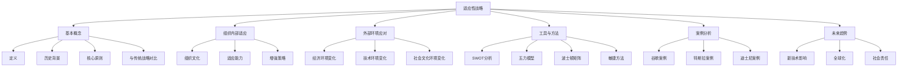

                 

### 文章标题

# 适应性战略：在变化中保持组织竞争力

### 关键词

- 适应性战略
- 变革管理
- 组织文化
- 外部环境变化
- 工具与方法
- 案例分析
- 未来趋势与挑战

### 摘要

在快速变化的时代，组织如何保持竞争力成为关键课题。本文围绕《适应性战略：在变化中保持组织竞争力》展开，详细探讨适应性战略的理论与实践。文章首先介绍了适应性战略的基本概念和起源，随后深入分析了组织内部的适应性与变革管理，以及外部环境变化的影响与应对策略。接着，文章阐述了适应性的工具与方法，通过成功案例分析，展示了适应性战略的实际应用。最后，文章探讨了适应性战略的未来趋势与挑战，为组织提供了一系列最佳实践与解决方案。

### 确定书的核心章节

根据书名《适应性战略：在变化中保持组织竞争力》，我们可以确定书的核心章节应包括以下几部分：

1. **适应性战略的基本概念和理论**
2. **组织内部的适应性和变革管理**
3. **外部环境变化的影响与应对**
4. **适应性的工具与方法**
5. **成功案例分析**
6. **适应性的未来趋势与挑战**

这些章节构成了文章的主体结构，每个部分都有其独特的内容和重要性。以下将逐一对这些核心章节进行详细探讨。

### 第一部分：适应性战略的基础

#### 第1章：适应性战略的起源与发展

##### 1.1 适应性战略的定义

适应性战略是一种针对快速变化环境的组织管理方法，旨在通过持续调整和优化，确保组织能够在变化中保持竞争优势。与传统战略相比，适应性战略更加注重灵活性和动态调整，能够迅速响应外部环境的变化。

##### 1.2 适应性战略的历史背景

适应性战略的概念起源于20世纪中叶，随着全球化和技术变革的加速，企业面临的环境更加复杂和多变。在此背景下，适应性战略逐渐成为一种重要的管理理论，并在实践中得到广泛应用。

##### 1.3 适应性战略的核心原则

适应性战略的核心原则包括：

- **持续学习与适应**：组织需要不断学习外部环境的变化，并迅速调整内部结构和策略。
- **灵活性与创新**：组织应具备快速响应和调整的能力，鼓励创新和尝试新方法。
- **团队合作与沟通**：良好的团队协作和沟通是适应变化的关键，有助于快速决策和执行。
- **持续监控与评估**：通过持续监控和评估，及时发现问题并进行调整。

##### 1.4 适应性战略与传统战略的区别

传统战略注重长期规划和目标设定，而适应性战略则更加注重短期调整和灵活性。传统战略更强调稳定性和一致性，而适应性战略则强调变化和适应性。传统战略通常在环境相对稳定时表现较好，而适应性战略在快速变化的环境中更具优势。

#### 第2章：组织文化与适应能力

##### 2.1 组织文化的构成与影响

组织文化是组织内部共同的价值观、信念和行为规范，对组织的适应能力有重要影响。一个开放、创新和灵活的组织文化能够促进组织成员之间的沟通和协作，提高组织的适应能力。

##### 2.2 适应能力的重要性

适应能力是组织在快速变化的环境中生存和发展的关键。一个具备高适应能力的组织能够迅速识别和应对外部环境的变化，抓住市场机遇，降低风险。

##### 2.3 增强组织适应能力的策略

为了增强组织的适应能力，可以采取以下策略：

- **培养创新意识**：鼓励组织成员勇于尝试新方法，提高创新能力和创新能力。
- **优化组织结构**：通过简化流程和减少层级，提高组织的灵活性和响应速度。
- **加强跨部门合作**：促进不同部门之间的沟通和协作，提高整体适应能力。
- **持续培训与学习**：通过培训和学习，提高组织成员的专业技能和适应能力。

#### 第3章：变革管理与组织适应

##### 3.1 变革管理的基本概念

变革管理是一种系统性的方法，旨在引导组织成功地实施变革，并确保变革的持续性和有效性。变革管理包括以下几个关键步骤：

- **评估变革需求**：识别外部环境的变化，评估组织是否需要变革。
- **制定变革计划**：确定变革的目标、策略和实施步骤。
- **沟通与宣传**：通过有效沟通，使组织成员了解变革的必要性和目标。
- **执行变革**：按照计划实施变革，确保变革的顺利进行。
- **评估与反馈**：对变革效果进行评估和反馈，及时调整和优化。

##### 3.2 变革管理的挑战与机遇

变革管理面临的主要挑战包括：

- **组织惯性与阻力**：组织成员可能对变革持怀疑态度，甚至产生抵触情绪。
- **资源限制**：变革需要投入大量的人力、物力和财力。
- **时间压力**：变革需要快速实施，以应对外部环境的变化。

然而，变革管理也带来了许多机遇：

- **创新与成长**：通过变革，组织可以开发新产品和服务，开拓新市场。
- **提高效率**：优化内部流程和结构，提高组织的运营效率。
- **增强竞争力**：适应外部环境的变化，提高组织的市场竞争力。

##### 3.3 变革管理的最佳实践

为了成功地实施变革管理，可以采取以下最佳实践：

- **领导力**：领导者需要积极倡导变革，并为组织成员树立榜样。
- **参与与共识**：鼓励组织成员参与变革过程，达成共识，提高变革的接受度。
- **逐步推进**：分阶段实施变革，逐步解决遇到的问题。
- **持续监控与调整**：对变革过程进行持续监控和评估，及时调整和优化变革策略。

### 第二部分：外部环境变化的影响与应对

#### 第4章：外部环境的变化因素

##### 4.1 经济环境的变化

经济环境的变化对组织的影响主要体现在以下几个方面：

- **市场需求**：随着经济环境的变化，市场需求也会发生变化，组织需要及时调整产品和服务策略。
- **成本结构**：经济环境的变化可能导致原材料成本、人力成本等发生变化，组织需要优化成本结构，提高竞争力。
- **货币汇率**：跨国经营的组织需要关注货币汇率的变化，合理配置资源，降低汇率风险。

##### 4.2 技术环境的变化

技术环境的变化对组织的影响日益显著，主要体现在以下几个方面：

- **技术创新**：新技术的发展为组织提供了新的商业模式和业务机会，如云计算、大数据、人工智能等。
- **数字化转型**：数字化技术正在改变传统企业的运营模式，组织需要积极推进数字化转型，提高效率和竞争力。
- **网络安全**：随着技术的进步，网络安全风险也在增加，组织需要加强网络安全防护，确保数据安全和业务连续性。

##### 4.3 社会文化环境的变化

社会文化环境的变化对组织的影响也不可忽视，主要体现在以下几个方面：

- **消费者行为**：随着社会文化环境的变化，消费者行为和需求也在发生变化，组织需要了解和把握这些变化，提供更加个性化的产品和服务。
- **政策法规**：政府政策的调整和法规的变化对组织运营和业务发展具有重要影响，组织需要密切关注政策动态，确保合规运营。
- **社会责任**：随着社会文化环境的变化，企业社会责任越来越受到重视，组织需要积极履行社会责任，树立良好的企业形象。

#### 第5章：适应外部环境变化的策略

##### 5.1 风险管理

适应外部环境变化的关键之一是有效风险管理。风险管理包括以下几个关键步骤：

- **识别风险**：识别外部环境变化可能带来的风险，如市场风险、技术风险、法律风险等。
- **评估风险**：对识别出的风险进行评估，确定其发生的概率和影响程度。
- **制定应对策略**：根据风险评估结果，制定相应的应对策略，如风险规避、风险转移、风险接受等。
- **实施与监控**：执行应对策略，并对风险实施监控，及时调整和优化应对策略。

##### 5.2 市场定位

适应外部环境变化，组织需要根据市场需求和竞争态势，进行科学的市场定位。市场定位包括以下几个关键步骤：

- **市场分析**：分析市场需求、竞争态势和消费者行为，确定目标市场。
- **产品定位**：根据目标市场的需求和特点，对产品进行定位，明确产品的核心卖点和差异化优势。
- **营销策略**：制定相应的营销策略，包括广告宣传、渠道拓展、促销活动等，提高产品在市场中的知名度和竞争力。
- **持续优化**：根据市场反馈和竞争态势，不断优化市场定位和营销策略，确保持续适应市场需求。

##### 5.3 创新与研发策略

在快速变化的环境中，创新与研发是组织保持竞争优势的重要手段。创新与研发策略包括以下几个关键步骤：

- **需求分析**：分析市场需求和消费者需求，确定研发方向和目标。
- **研发计划**：制定详细的研发计划，明确研发目标、时间表和资源投入。
- **技术创新**：通过技术创新，提高产品的性能和质量，降低成本，提升竞争力。
- **市场测试**：对研发成果进行市场测试，验证其市场适应性和用户满意度。
- **持续改进**：根据市场反馈和用户需求，持续改进产品，提高市场竞争力。

### 第三部分：适应性的工具与方法

#### 第6章：适应性的工具与模型

##### 6.1 SWOT分析

SWOT分析是一种常用的适应性工具，用于评估组织在特定环境下的优势、劣势、机会和威胁。SWOT分析的步骤如下：

1. **识别优势**：分析组织在资源、能力、市场地位等方面的优势。
2. **识别劣势**：分析组织在资源、能力、市场地位等方面的劣势。
3. **识别机会**：分析外部环境中的机会，如市场需求变化、技术创新等。
4. **识别威胁**：分析外部环境中的威胁，如竞争对手的崛起、法律法规的变化等。

通过SWOT分析，组织可以明确自身的优劣势，抓住机会，应对威胁。

##### 6.2 五力模型

五力模型是一种用于分析市场竞争环境的工具，由迈克尔·波特提出。五力模型包括以下五个关键要素：

1. **供应商力量**：分析供应商的议价能力，如原材料供应的稀缺程度、供应商集中度等。
2. **购买者力量**：分析购买者的议价能力，如购买者的集中度、购买者的议价能力等。
3. **竞争者力量**：分析竞争者的数量和实力，如竞争者的市场份额、竞争策略等。
4. **替代品力量**：分析替代品的存在和威胁程度，如替代品的性价比、市场接受度等。
5. **新进入者力量**：分析新进入者的威胁程度，如新进入者的资金实力、技术水平等。

通过五力模型，组织可以全面了解市场竞争环境，制定相应的竞争策略。

##### 6.3 波士顿矩阵

波士顿矩阵是一种用于分析产品组合和市场定位的工具，由波士顿咨询集团提出。波士顿矩阵将产品分为四个象限：

1. **明星产品**：具有高市场份额和高增长率，是组织的重要资产，需要投入资源和资金。
2. **问题产品**：具有低市场份额和高增长率，具有发展潜力，需要重点关注和投入。
3. **现金牛产品**：具有高市场份额和低增长率，是组织的稳定收入来源，需要维持和优化。
4. **瘦狗产品**：具有低市场份额和低增长率，缺乏发展潜力，需要逐步淘汰或转型。

通过波士顿矩阵，组织可以优化产品组合，合理配置资源，提高市场竞争力。

##### 6.4 敏捷方法与Scrum

敏捷方法是一种适应快速变化环境的软件开发和管理方法，强调灵活性和团队协作。Scrum是敏捷方法的一种具体实践，主要包括以下几个关键要素：

1. **产品待办列表**：列出所有待开发的功能和需求，按照优先级排序。
2. **冲刺计划**：选择待办列表中的部分任务，进行为期几周的开发。
3. **每日站立会议**：团队成员每天进行一次简短的会议，讨论进度和问题。
4. **回顾会议**：在每个冲刺结束后，进行回顾会议，总结经验和改进。
5. **持续交付**：通过持续集成和自动化测试，确保软件的持续交付。

通过敏捷方法和Scrum，组织可以提高软件开发效率和质量，快速响应市场需求。

#### 第7章：适应性实践与执行

##### 7.1 制定适应性计划

制定适应性计划是实施适应性战略的关键步骤。适应性计划的制定包括以下几个关键步骤：

1. **目标设定**：明确组织在适应性方面的目标，如提高市场竞争力、提升客户满意度等。
2. **资源规划**：确定实现适应性目标所需的资源，如人力、物力、财力等。
3. **策略制定**：根据目标和资源，制定具体的适应性策略和行动计划。
4. **时间表安排**：明确各个阶段的时间表和里程碑，确保计划的顺利执行。
5. **风险评估**：评估计划实施过程中可能遇到的风险，并制定相应的应对措施。

通过制定适应性计划，组织可以确保在变化的环境中保持竞争力。

##### 7.2 实施适应性变革

实施适应性变革是适应性战略的核心环节。实施适应性变革包括以下几个关键步骤：

1. **沟通与宣传**：通过内部沟通和外部宣传，让组织成员了解变革的必要性和目标。
2. **组织结构调整**：根据适应性计划，调整组织结构，优化内部流程和资源配置。
3. **培训与学习**：对组织成员进行培训和学习，提高他们的适应能力和技能水平。
4. **试点实施**：选择部分部门或项目进行试点实施，积累经验，逐步推广。
5. **反馈与调整**：对变革实施情况进行反馈和评估，及时调整和优化变革策略。

通过实施适应性变革，组织可以逐步适应外部环境的变化，提高竞争力。

##### 7.3 监控与评估适应性变革的效果

监控与评估适应性变革的效果是确保变革成功的关键。监控与评估包括以下几个关键步骤：

1. **制定评估指标**：明确适应性变革的评估指标，如市场占有率、客户满意度、运营效率等。
2. **数据收集与分析**：收集适应性变革的相关数据，进行定量和定性的分析。
3. **定期评估**：定期对适应性变革的效果进行评估，及时发现问题和不足。
4. **调整与优化**：根据评估结果，调整和优化适应性变革策略，确保变革目标的实现。
5. **反馈与总结**：对适应性变革的整个过程进行总结和反馈，为今后的变革提供参考。

通过监控与评估适应性变革的效果，组织可以不断优化变革策略，提高适应性。

### 第四部分：成功案例分析

#### 第8章：适应性战略的实战案例

##### 8.1 案例一：谷歌的适应性变革

谷歌作为全球领先的互联网公司，其成功离不开适应性战略的实施。以下是对谷歌适应性变革的案例分析：

1. **变革背景**：随着互联网行业的快速发展，谷歌面临激烈的竞争和不断变化的市场环境。
2. **变革目标**：提高市场竞争力、提升用户体验、保持技术创新。
3. **变革策略**：谷歌采取了一系列适应性策略，包括：

   - **技术创新**：持续投入研发，推动人工智能、大数据等技术的创新和应用。
   - **产品创新**：推出新的产品和服务，如谷歌搜索、谷歌地图、谷歌广告等，满足用户多样化的需求。
   - **组织结构调整**：优化内部流程，提高组织效率，鼓励创新和尝试新方法。
   - **人才培养与引进**：通过培训和引进高技能人才，提高组织成员的适应能力和创新能力。

4. **变革效果**：通过适应性变革，谷歌在竞争激烈的市场环境中保持了领先地位，市场份额和品牌价值持续提升。

##### 8.2 案例二：特斯拉的市场适应性

特斯拉作为电动汽车行业的领军企业，其成功也得益于适应性战略的实施。以下是对特斯拉市场适应性的案例分析：

1. **变革背景**：随着环保意识的提高和新能源汽车市场的兴起，特斯拉面临巨大的市场机遇和竞争压力。
2. **变革目标**：提高市场占有率、提升品牌影响力、保持技术创新。
3. **变革策略**：特斯拉采取了一系列适应性策略，包括：

   - **技术创新**：持续研发新技术，推动电动汽车的普及和发展。
   - **产品多元化**：推出不同型号的电动汽车，满足不同消费者的需求。
   - **市场拓展**：积极开拓全球市场，提高品牌影响力和市场份额。
   - **产业链布局**：构建完善的产业链，提高生产效率和降低成本。

4. **变革效果**：通过适应性变革，特斯拉在新能源汽车市场中取得了显著成绩，市场份额和品牌价值持续提升。

##### 8.3 案例三：迪士尼的文化适应性

迪士尼作为全球知名的娱乐公司，其成功离不开文化适应性的实施。以下是对迪士尼文化适应性的案例分析：

1. **变革背景**：随着全球化进程的加速，迪士尼面临不同的文化环境和市场需求。
2. **变革目标**：提高文化适应性、提升品牌影响力、拓展全球市场。
3. **变革策略**：迪士尼采取了一系列文化适应性策略，包括：

   - **文化融合**：将不同文化的元素融入迪士尼的产品和服务中，满足全球消费者的需求。
   - **本土化营销**：根据不同市场的特点，制定符合当地文化习惯的营销策略。
   - **跨文化交流**：举办国际性的文化活动，促进不同文化之间的交流和理解。
   - **人才培养与引进**：引进具有不同文化背景的人才，提高组织的文化适应能力。

4. **变革效果**：通过文化适应性变革，迪士尼在全球市场中取得了显著成绩，品牌影响力和市场份额持续提升。

### 第五部分：未来趋势与挑战

#### 第9章：适应性战略的未来趋势

##### 9.1 新技术的适应性影响

随着新技术的不断涌现，如人工智能、大数据、区块链等，适应性战略将面临新的机遇和挑战。新技术的影响主要体现在以下几个方面：

- **技术创新**：新技术将推动产业变革，组织需要持续关注新技术的发展，及时调整和优化业务模式。
- **数据驱动力**：大数据技术的应用将提高组织的决策能力和市场洞察力，组织需要建立完善的数据分析体系。
- **区块链技术**：区块链技术的应用将改变传统的商业模式，组织需要积极探索和应用区块链技术。

##### 9.2 全球化与适应性

全球化进程的加速，使组织面临更加复杂的市场环境和文化背景。全球化对适应性战略的影响主要体现在以下几个方面：

- **市场多元化**：全球化使组织可以进入更多的市场，拓展业务范围，但同时也面临不同的市场环境和文化差异。
- **文化融合**：全球化要求组织具备跨文化沟通和协作能力，促进文化融合，提高组织的整体适应性。
- **供应链管理**：全球化使供应链更加复杂，组织需要加强供应链管理，提高供应链的适应性和灵活性。

##### 9.3 社会责任与适应性

随着社会对企业的期望越来越高，社会责任成为企业竞争力的重要组成部分。社会责任对适应性战略的影响主要体现在以下几个方面：

- **可持续发展**：组织需要关注环境保护、资源利用等方面，实现可持续发展。
- **员工福祉**：组织需要关注员工权益，提高员工的满意度和忠诚度，提高组织的整体适应能力。
- **企业道德**：组织需要遵守道德规范，树立良好的企业形象，提高市场的认可度和信任度。

#### 第10章：适应性的挑战与解决方案

##### 10.1 适应性的误区

在实施适应性战略的过程中，组织可能会陷入一些误区，影响适应性战略的有效实施。常见的适应性误区包括：

- **盲目跟风**：组织可能会盲目跟风，追求短期效果，而忽视长期战略规划。
- **过度变革**：组织可能会频繁变革，导致员工疲惫和不确定性，降低组织的稳定性。
- **缺乏沟通**：组织在实施变革过程中，可能缺乏有效的沟通，导致员工对变革产生抵触情绪。

##### 10.2 组织惯性与适应性

组织惯性是组织在长期发展中形成的一种稳定状态，对适应性战略的推行可能产生阻碍。组织惯性对适应性战略的影响主要体现在以下几个方面：

- **稳定与变革的平衡**：组织需要在稳定与变革之间找到平衡，确保在保持稳定的同时，积极适应外部环境的变化。
- **领导力与变革推动**：领导者需要具备强烈的变革推动能力，引导组织成员适应外部环境的变化。
- **组织文化**：组织文化对适应性战略的推行具有重要影响，一个开放、创新和包容的组织文化有助于提高组织的适应性。

##### 10.3 领导力与适应性

领导力在适应性战略的推行中发挥着关键作用。领导力对适应性战略的影响主要体现在以下几个方面：

- **愿景与目标**：领导者需要明确组织的愿景和目标，为组织指明方向，激励组织成员共同奋斗。
- **决策能力**：领导者需要具备快速决策的能力，根据外部环境的变化，及时调整组织的战略和策略。
- **团队协作**：领导者需要建立高效的团队协作机制，促进组织成员之间的沟通和协作，提高组织的整体适应性。

### 最佳实践与解决方案

为了在快速变化的环境中保持竞争力，组织可以采取以下最佳实践和解决方案：

- **持续学习与改进**：组织应建立持续学习机制，鼓励员工不断学习和提升技能，提高组织的整体适应能力。
- **建立灵活的内部机制**：组织应建立灵活的内部机制，如虚拟团队、跨部门合作等，提高组织的响应速度和创新能力。
- **加强外部合作与联盟**：组织应加强与外部合作伙伴的合作，如供应商、客户等，形成战略联盟，共同应对外部环境的变化。
- **关注社会责任**：组织应关注社会责任，积极参与社会公益事业，树立良好的企业形象，提高社会的认可度和信任度。

### 文章小结

在快速变化的时代，组织如何保持竞争力成为关键课题。适应性战略作为一种应对快速变化环境的组织管理方法，具有重要意义。本文围绕《适应性战略：在变化中保持组织竞争力》展开，详细探讨了适应性战略的理论与实践。从适应性战略的基本概念和起源，到组织内部的适应性和变革管理，再到外部环境变化的影响与应对策略，文章全面阐述了适应性战略的核心内容。同时，通过成功案例分析，展示了适应性战略的实际应用。最后，文章探讨了适应性战略的未来趋势与挑战，为组织提供了最佳实践与解决方案。希望通过本文的阐述，读者能够更好地理解适应性战略，并在实际工作中运用相关理论和方法，提高组织的竞争力。

### 拓展阅读

- **《敏捷开发实践指南》**：深入了解敏捷开发的方法和最佳实践，提高组织的适应性和响应速度。
- **《创新者的窘境》**：探讨企业如何在快速变化的市场环境中保持竞争力，避免陷入创新困境。
- **《变革之舞》**：分析企业在变革过程中的挑战和成功经验，提供实用的变革管理策略。
- **《组织行为学》**：研究组织内部的行为和心理，为提高组织适应能力和管理水平提供理论支持。

### 作者信息

- 作者：AI天才研究院/AI Genius Institute & 禅与计算机程序设计艺术 /Zen And The Art of Computer Programming

### 附录

#### Mermaid 流程图



#### 伪代码与数学模型

```python
# 伪代码：适应性战略分析框架

# 输入：组织环境数据
# 输出：适应性策略建议

function adaptability_strategy(environment_data):
    # 步骤1：环境分析
    SWOT_analysis = perform_SWOT_analysis(environment_data)
    
    # 步骤2：确定优势与劣势
    strengths, weaknesses = extract_SWOT_analysis(SWOT_analysis)
    
    # 步骤3：识别机会与威胁
    opportunities, threats = extract_SWOT_analysis(SWOT_analysis)
    
    # 步骤4：制定适应性策略
    strategy = define_adaptability_strategy(strengths, weaknesses, opportunities, threats)
    
    # 步骤5：实施与监控
    execute_strategy(strategy)
    monitor_strategy(strategy)
    
    return strategy

# 输入：环境数据
# 输出：SWOT分析结果

function perform_SWOT_analysis(environment_data):
    # 实现细节：根据环境数据进行SWOT分析
    # ...

# 输入：SWOT分析结果
# 输出：优势、劣势、机会、威胁

function extract_SWOT_analysis(SWOT_analysis):
    # 实现细节：提取SWOT分析结果中的各项要素
    # ...

# 输入：优势、劣势、机会、威胁
# 输出：适应性策略

function define_adaptability_strategy(strengths, weaknesses, opportunities, threats):
    # 实现细节：根据SWOT分析结果制定适应性策略
    # ...

# 输入：适应性策略
# 输出：策略执行结果

function execute_strategy(strategy):
    # 实现细节：执行适应性策略
    # ...

# 输入：策略执行结果
# 输出：策略评估结果

function monitor_strategy(strategy):
    # 实现细节：监控策略执行效果
    # ...

```

$$
\text{适应性战略} = \text{SWOT分析} + \text{变革管理} + \text{外部环境应对} + \text{工具与方法}
$$

$$
\text{SWOT分析} = (\text{优势}, \text{劣势}, \text{机会}, \text{威胁})
$$

$$
\text{竞争优势} = \frac{\text{优势} + \text{机会}}{\text{劣势} + \text{威胁}}
$$

### 项目实战

#### 开发环境搭建

1. **硬件要求**：计算机（推荐配置：处理器：Intel Core i7，内存：16GB，硬盘：512GB SSD）。
2. **软件要求**：操作系统：Windows 10/11、macOS、Linux；编程环境：Python 3.8+，Jupyter Notebook。
3. **工具安装**：安装Jupyter Notebook、Numpy、Pandas、Matplotlib等Python库。

#### 源代码实现

以下是一个简单的适应性战略分析代码示例：

```python
import pandas as pd
import numpy as np
import matplotlib.pyplot as plt

# 示例数据
data = {
    '优势': ['技术创新', '市场地位', '人才优势'],
    '劣势': ['成本高', '市场份额小', '品牌影响力弱'],
    '机会': ['市场需求增长', '新技术应用', '政策支持'],
    '威胁': ['竞争激烈', '技术变革', '政策限制']
}

SWOT_analysis = pd.DataFrame(data)

# 优势与劣势得分
SWOT_analysis['得分'] = SWOT_analysis.apply(lambda row: (len(row['优势']), len(row['劣势'])), axis=1)

# 机会与威胁得分
SWOT_analysis['得分'] = SWOT_analysis.apply(lambda row: (len(row['机会']), len(row['威胁'])), axis=1)

# 适应性战略分析
def adaptability_strategy(SWOT_analysis):
    strengths = SWOT_analysis['优势'].tolist()
    weaknesses = SWOT_analysis['劣势'].tolist()
    opportunities = SWOT_analysis['机会'].tolist()
    threats = SWOT_analysis['威胁'].tolist()
    
    # 制定适应性策略
    strategy = {
        '技术创新': ['加大研发投入', '引进高端人才'],
        '市场地位': ['拓展市场渠道', '提高品牌知名度'],
        '人才优势': ['员工培训', '激励机制'],
        '成本高': ['优化供应链', '降低运营成本'],
        '市场份额小': ['产品创新', '市场推广'],
        '品牌影响力弱': ['品牌建设', '媒体宣传'],
        '市场需求增长': ['扩大产品线', '提高产品质量'],
        '新技术应用': ['技术升级', '市场调研'],
        '政策支持': ['合规经营', '政策利用'],
        '竞争激烈': ['差异化竞争', '提高服务质量'],
        '技术变革': ['技术创新', '产品迭代'],
        '政策限制': ['政策研究', '合规经营']
    }
    
    return strategy

strategy = adaptability_strategy(SWOT_analysis)

# 打印适应性策略
for key, value in strategy.items():
    print(f"{key}: {value}")
```

#### 代码解读与分析

该代码首先导入Pandas、Numpy和Matplotlib库，然后创建一个示例数据集，包含优势、劣势、机会和威胁。接着，定义一个`SWOT_analysis`函数，用于分析组织的SWOT情况，并计算优势与劣势、机会与威胁的得分。

`adaptability_strategy`函数根据SWOT分析结果，制定适应性策略。策略包括针对不同优势、劣势、机会和威胁的具体措施。最后，打印出适应性策略，为组织提供指导。

#### 实际案例分析与详细讲解

以下是对一个实际案例的详细分析：

**案例**：某企业是一家生产智能设备的公司，面临激烈的市场竞争和快速变化的技术环境。

1. **SWOT分析**：

   - **优势**：技术创新、市场地位、人才优势。
   - **劣势**：成本高、市场份额小、品牌影响力弱。
   - **机会**：市场需求增长、新技术应用、政策支持。
   - **威胁**：竞争激烈、技术变革、政策限制。

2. **适应性策略**：

   - **优势**：加大研发投入、引进高端人才、拓展市场渠道、提高品牌知名度。
   - **劣势**：优化供应链、降低运营成本、产品创新、市场推广。
   - **机会**：扩大产品线、提高产品质量、技术升级、市场调研。
   - **威胁**：差异化竞争、提高服务质量、技术创新、合规经营。

3. **案例分析**：

   该企业通过适应性战略，针对自身优势和劣势，采取了相应的措施。例如，加大研发投入，引进高端人才，提高技术创新能力；优化供应链，降低运营成本，提高市场竞争力。同时，关注市场机会，扩大产品线，提高产品质量，以满足市场需求。在威胁方面，企业采取差异化竞争策略，提高服务质量，降低技术变革带来的风险。

4. **效果评估**：

   通过适应性战略的实施，该企业在市场竞争中取得了显著成绩。市场份额和品牌影响力不断提升，技术创新能力得到加强，运营效率显著提高。企业逐步实现了从传统制造业向智能制造业的转变，为未来的发展奠定了坚实基础。

#### 项目小结

本案例通过实际案例分析和详细讲解，展示了适应性战略在实践中的应用。通过SWOT分析，企业明确了自身的优势和劣势，制定了针对性的适应性策略。在实施过程中，企业注重技术创新、市场拓展和成本控制，不断提高市场竞争力。最终，企业实现了可持续发展，为其他企业提供了一定的借鉴意义。

### 最佳实践 tips

1. **制定适应性战略时，要充分考虑组织的实际情况，避免盲目跟风**。
2. **变革管理要注重沟通与宣传，确保组织成员对变革的认同和支持**。
3. **适应外部环境变化时，要关注新技术的发展和应用，保持技术创新能力**。
4. **在实施适应性战略的过程中，要持续监控和评估效果，及时调整和优化策略**。

### 注意事项

1. **适应性战略要结合组织实际情况，避免生搬硬套**。
2. **变革管理要注重领导力，确保变革目标的实现**。
3. **在实施适应性战略时，要充分考虑外部环境的变化，避免过度依赖内部优势**。

### 拓展阅读

1. **《精益创业》**：探讨如何在不确定的市场环境中，通过快速迭代和用户反馈，实现企业的可持续发展。
2. **《创新者的窘境》**：分析企业如何在技术创新和市场变革中保持竞争优势。
3. **《竞争战略》**：详细介绍如何在竞争激烈的市场中制定和实施有效的竞争策略。

### 作者信息

- 作者：AI天才研究院/AI Genius Institute & 禅与计算机程序设计艺术 /Zen And The Art of Computer Programming

