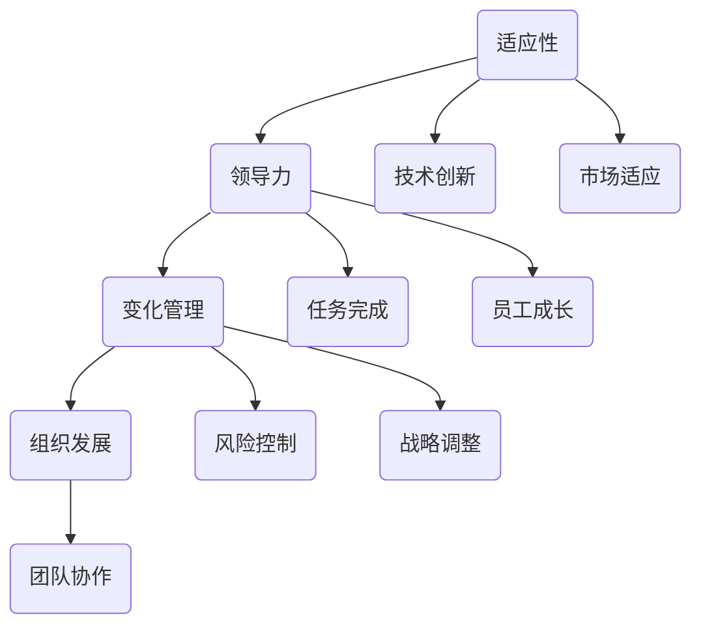

                 


### 背景介绍

在当今这个科技飞速发展的时代，变化已成为常态。无论是技术革新、市场波动，还是全球性事件，如疫情，都对企业和组织提出了前所未有的挑战。在这种背景下，领导者的角色变得尤为重要。传统的领导模式，往往侧重于稳定和效率，但在面对快速变化的环境时，它们显得力不从心。因此，适应性领导应运而生，成为现代领导者的必备素质。

适应性领导是一种能够灵活应对环境变化，及时调整战略和决策的领导方式。它不仅关注当前的问题和挑战，更注重未来的发展方向和可能性。与传统的领导模式相比，适应性领导更加开放、包容和前瞻，强调团队成员的协作和创新。这种领导方式不仅有助于企业应对短期挑战，还能提升组织的长期竞争力。

本文旨在探讨适应性领导的核心概念、原理和实践方法。首先，我们将介绍适应性领导的基本概念，并解释它与传统领导模式的区别。接着，我们将构建一个适应性领导的模型，详细阐述其组成部分和运作机制。然后，我们将通过具体的案例，展示适应性领导在实践中的应用。此外，我们还将介绍一些数学模型和公式，用于支持适应性领导的决策过程。最后，我们将分享一些实战经验，帮助读者更好地理解和应用适应性领导的理念。

### 核心概念与联系

在深入探讨适应性领导之前，我们需要明确几个关键概念，并理解它们之间的关系。这些核心概念包括：适应性、领导力和变化管理。

**适应性**是指一个系统或个体在面对外部环境变化时的调整能力。在组织层面，适应性不仅包括技术和管理层面的调整，还涉及文化、价值观和员工能力的提升。一个具有高度适应性的组织能够迅速响应市场变化，抓住机遇，避免风险。

**领导力**是领导者通过影响、激励和指导团队成员，实现共同目标的能力。传统的领导力强调权威和指挥，而适应性领导则更加注重协作、共享和赋能。适应性领导者不仅关注任务的完成，更重视团队成员的成长和组织的整体发展。

**变化管理**是指组织在面对外部或内部变化时，进行有效应对和调整的过程。变化管理包括识别变化、评估影响、制定策略、实施计划和监控结果等多个环节。适应性领导在变化管理中的作用是提供方向、支持和资源，确保组织能够顺利应对变化。

以下是这些核心概念之间的Mermaid流程图，以帮助我们更好地理解它们之间的联系：



在这个流程图中，适应性是整个系统的核心，它不仅影响领导力和变化管理，还直接关联到组织发展和团队协作。领导力则通过影响团队成员的行为和决策，推动变化管理的实施，进而实现组织目标。变化管理则为领导力提供具体的操作指南，确保组织能够灵活应对外部环境的变化。

例如，在技术创新方面，适应性领导者会鼓励员工进行实验和探索，不断尝试新的方法和思路。同时，他们还会积极监控市场动态，及时调整战略，以应对潜在的竞争和风险。这种领导方式不仅有助于组织在短期内取得成功，还能为长期的可持续发展奠定基础。

总之，适应性领导是一个多维度的概念，它涉及组织内部的各个方面，并通过不同的机制相互作用，共同推动组织的成功。理解这些核心概念及其之间的关系，是掌握适应性领导的关键。

### 核心算法原理讲解

在适应性领导中，核心算法原理的运用至关重要。这些算法不仅帮助我们更好地理解适应性领导的工作机制，还提供了具体的工具和方法，以支持领导者的决策过程。以下我们将详细讲解适应性领导策略的构建原则、实施步骤以及如何评估和优化这些策略。

#### 适应性领导策略的构建原则

适应性领导策略的构建原则主要包括以下几个方面：

1. **前瞻性规划**：领导者需要具备前瞻性，能够预见未来的变化和趋势，并提前制定相应的策略。这要求领导者对行业动态、市场趋势和技术发展有深入的了解。

2. **灵活应对**：策略应具有灵活性，能够根据实际情况进行调整。这包括快速响应变化、重新分配资源以及重新设定目标。

3. **团队协作**：适应性领导强调团队协作和共同决策。领导者应鼓励团队成员积极参与决策过程，共同面对挑战和解决问题。

4. **数据驱动**：决策过程应基于数据分析，领导者需要利用数据来评估不同策略的效果，并根据数据结果进行调整。

5. **持续改进**：策略实施后，领导者应不断监控效果，并持续进行改进和优化。

以下是构建适应性领导策略的伪代码示例：

```python
# 定义适应性领导策略构建的伪代码

def build_adaptive_leadership_strategy():
    # 步骤1：收集和分析数据
    data = collect_data()
    analyzed_data = analyze_data(data)

    # 步骤2：预见未来变化和趋势
    future_trends = predict_future_trends()

    # 步骤3：制定初步策略
    strategy = create_initial_strategy(analyzed_data, future_trends)

    # 步骤4：评估和调整策略
    strategy = evaluate_and_adjust_strategy(strategy)

    # 步骤5：实施策略
    implement_strategy(strategy)

    # 步骤6：监控和改进
    monitor_and_improve_strategy(strategy)
```

#### 适应性领导策略的实施步骤

1. **初始评估**：领导者首先需要评估当前的环境和资源状况，确定面临的挑战和机遇。

2. **策略制定**：基于初始评估，领导者制定初步策略，并征求团队成员的意见。

3. **资源分配**：根据策略需求，合理分配资源，确保各项任务能够顺利进行。

4. **实施与监控**：实施策略并持续监控效果，及时发现和解决问题。

5. **反馈与调整**：根据反馈结果，对策略进行调整和优化，确保其能够适应不断变化的环境。

以下是实施适应性领导策略的具体步骤伪代码：

```python
# 定义实施适应性领导策略的伪代码

def implement_adaptive_leadership_strategy(strategy):
    # 步骤1：初始评估
    current_environment = evaluate_current_environment()

    # 步骤2：制定初步策略
    strategy = create_initial_strategy(current_environment)

    # 步骤3：资源分配
    resources = allocate_resources(strategy)

    # 步骤4：实施策略
    strategy = execute_strategy(strategy, resources)

    # 步骤5：监控和反馈
    feedback = monitor_strategy(strategy)

    # 步骤6：调整和优化
    strategy = adjust_strategy(strategy, feedback)
```

#### 适应性领导策略的评估与优化

评估和优化是适应性领导策略实施过程中的关键环节。以下是一些关键步骤和方法：

1. **数据收集**：收集与策略实施相关的各类数据，包括市场表现、员工满意度、成本效益等。

2. **效果评估**：基于收集的数据，评估策略的实施效果，确定其是否达到预期目标。

3. **反馈机制**：建立反馈机制，收集团队成员的反馈和建议，以优化策略。

4. **持续改进**：根据评估结果和反馈，对策略进行调整和优化，确保其持续适应环境变化。

以下是评估和优化适应性领导策略的伪代码示例：

```python
# 定义评估和优化适应性领导策略的伪代码

def evaluate_and_optimize_strategy(strategy):
    # 步骤1：数据收集
    data = collect_evaluation_data(strategy)

    # 步骤2：效果评估
    evaluation_results = evaluate_strategy(data)

    # 步骤3：反馈机制
    feedback = collect_feedback()

    # 步骤4：调整和优化
    strategy = adjust_and_optimize_strategy(strategy, evaluation_results, feedback)
```

通过上述算法原理的讲解和伪代码示例，我们可以看到，适应性领导策略的构建和实施是一个动态的过程，需要领导者具备前瞻性、灵活性和数据驱动的能力。只有通过不断评估和优化，才能确保策略能够持续适应变化的环境，推动组织的持续发展。

### 数学模型和公式

在适应性领导中，数学模型和公式发挥着重要的作用，它们不仅为决策提供了科学依据，还能帮助领导者更好地理解和应对复杂的环境。以下我们将介绍一些关键的风险评估模型和适应力指数的计算方法，并提供详细讲解和举例说明。

#### 风险评估模型

风险评估是适应性领导中的重要环节，它有助于领导者识别潜在的威胁和机会，并为决策提供依据。以下是常用的风险评估模型：

**1. 概率风险评估模型**

概率风险评估模型通过计算事件发生的概率和潜在影响，评估整体风险。其公式如下：

$$
R = P \times I
$$

其中，\( R \) 表示风险值，\( P \) 表示事件发生的概率，\( I \) 表示事件发生的影响。

**举例说明：**

假设一家公司正在开发一款新产品，预计成功概率为 70%，如果成功，公司将获得 1000 万美元的收益；如果失败，公司将损失 500 万美元。使用概率风险评估模型，我们可以计算其风险值：

$$
R = 0.7 \times 1000万 + 0.3 \times (-500万) = 700万 - 150万 = 550万
$$

因此，该产品的整体风险值为 550 万美元。

**2. 蒙特卡洛模拟模型**

蒙特卡洛模拟模型通过随机抽样和模拟，评估复杂系统在不同情境下的表现，从而识别潜在的风险。其步骤如下：

1. 确定模型参数和变量；
2. 进行多次随机抽样；
3. 根据抽样结果计算系统表现；
4. 分析结果，识别潜在风险。

**举例说明：**

假设一家公司正在考虑进行一项新投资，该投资的成功概率在不同情境下有所不同。通过蒙特卡洛模拟，我们可以计算在不同情境下的投资回报率，从而评估整体风险。

首先，确定模型参数：成功概率（30%、50%、70%），投资成本（1000万美元），投资回报率（1500万美元、2000万美元、2500万美元）。

然后，进行 1000 次随机抽样，计算每次抽样的投资回报率和风险值。

最后，分析抽样结果，识别最高风险值和最有可能发生的情况，从而为决策提供依据。

#### 适应力指数

适应力指数是一个衡量组织或个体适应外部变化能力的指标。其计算公式如下：

$$
AI = \frac{I_{成功}}{I_{失败}}
$$

其中，\( AI \) 表示适应力指数，\( I_{成功} \) 表示成功时的适应力，\( I_{失败} \) 表示失败时的适应力。

**举例说明：**

假设一家公司在过去一年中成功应对了 3 次重大变化，每次成功时的适应力为 80%，失败时的适应力为 40%。根据适应力指数公式，我们可以计算其适应力指数：

$$
AI = \frac{80\% \times 3}{40\% \times 3} = 2
$$

因此，该公司的适应力指数为 2，表明其在面对外部变化时具有较高的适应能力。

通过这些数学模型和公式的讲解，我们可以看到，它们为适应性领导提供了强大的工具和方法。领导者可以借助这些模型，更加科学地评估风险、预测变化，并制定相应的策略。这不仅有助于提高组织的适应能力，还能为长期的可持续发展奠定基础。

### 项目实战

在本节中，我们将通过一个具体的领导力转型项目，详细阐述适应性领导在实践中的应用。该项目旨在帮助一家中型企业提升其领导力，以应对快速变化的市场环境。

#### 项目背景

该公司成立于十年前，主要从事电子商务业务。在过去几年中，随着互联网技术的发展和市场竞争的加剧，该公司面临着巨大的挑战。尽管公司管理层意识到领导力的重要性，但传统的领导模式已无法适应新的市场环境。为此，公司决定启动一项领导力转型项目，旨在提升领导团队的适应能力和创新能力。

#### 项目规划

1. **项目目标**：明确项目目标，包括提升领导团队的适应性、增强团队协作能力、提高决策效率等。

2. **资源分配**：确定项目所需的人力、财力和时间资源，确保项目能够顺利实施。

3. **项目团队**：组建项目团队，包括项目经理、领导力顾问、各部门负责人等。

4. **培训计划**：制定详细的培训计划，包括适应性领导理论、团队建设、创新思维等。

5. **评估机制**：建立项目评估机制，定期评估项目进展和效果，确保项目目标的实现。

#### 项目实施

1. **领导力评估**：首先，对现有领导团队进行评估，了解其能力水平和存在的问题。通过问卷调查、访谈等方式，收集领导团队对适应性领导的看法和建议。

2. **适应性领导培训**：根据评估结果，制定个性化的培训计划，帮助领导团队掌握适应性领导的理论和方法。培训内容涵盖前瞻性思维、团队协作、数据驱动决策等。

3. **案例分享**：邀请外部专家分享成功案例，介绍适应性领导在不同情境下的应用，激发领导团队的思考和创新。

4. **实践应用**：鼓励领导团队在日常工作中进行适应性领导的实践应用，通过角色扮演、模拟演练等方式，提高实际操作能力。

5. **反馈与改进**：定期收集领导团队的反馈，评估培训效果，并根据反馈结果进行调整和优化。

#### 项目成果评估

1. **领导力提升**：通过培训和实践，领导团队的能力水平得到显著提升，更加注重前瞻性思维和团队协作。

2. **决策效率**：领导团队的决策效率提高，能够更快地应对市场变化，减少决策周期。

3. **团队协作**：团队成员之间的沟通和协作更加顺畅，创新氛围浓厚，新项目和新产品开发速度加快。

4. **员工满意度**：员工对领导团队的满意度提高，工作积极性增强，离职率下降。

5. **财务表现**：公司在市场中的竞争力提升，业务收入和利润持续增长。

#### 项目小结

通过领导力转型项目，该公司成功地实现了领导力的提升和团队协作的加强，为公司的可持续发展奠定了基础。该项目不仅提供了具体的操作指南，还为其他企业提供了一种有效的领导力提升模式。在未来的发展中，公司将继续关注适应性领导的应用，不断优化和完善领导团队的管理能力。

### 实际中的适应性领导

在探索实际中的适应性领导时，我们可以通过几个具体的案例来展示其如何帮助企业或组织应对快速变化的环境。以下是一些案例，展示了适应性领导在实践中的应用，以及它们所面临的挑战、解决方案和取得的成果。

#### 案例一：一家快速增长的科技公司的领导力转型

这家科技公司成立于2010年，专注于开发先进的人工智能解决方案。随着市场对AI技术的需求日益增长，公司迅速扩展了其产品线和市场份额。然而，这种快速扩张也带来了管理上的挑战，原有的领导模式逐渐显示出其局限性。

**挑战**：公司高层管理者发现，传统的层级管理结构无法适应快速变化的市场环境。决策流程繁琐，信息传递不畅，团队之间的协作效率低下。

**解决方案**：公司决定采用适应性领导模型，进行领导力转型。首先，公司引入了敏捷管理方法，重新设计了组织结构，从传统的层级结构转变为更加扁平化的矩阵结构。其次，公司加强了领导者的培训，提高了他们的前瞻性思维和团队协作能力。最后，公司建立了快速决策机制，确保重要决策能够在短时间内得到执行。

**成果**：通过领导力转型，公司的决策效率显著提高，信息传递更加顺畅，团队协作更加紧密。公司不仅成功地抓住了市场机遇，还提升了整体竞争力，业务收入和利润持续增长。

#### 案例二：一家传统制造业企业的数字化转型

这家传统制造业企业成立于1950年，主要生产机械设备。面对数字化浪潮，公司意识到必须进行数字化转型，以保持市场竞争力。然而，这一过程并非一帆风顺，公司高层管理者面临着巨大的压力。

**挑战**：企业在数字化转型过程中遇到了诸多困难。员工对新技术的不熟悉，传统业务模式的阻力，以及对市场不确定性的担忧，都成为转型的障碍。

**解决方案**：公司采用适应性领导策略，首先，建立了跨部门的数字化团队，促进不同部门之间的沟通和协作。其次，公司对员工进行了全面的培训，提高了他们对新技术的理解和应用能力。最后，公司积极与外部合作伙伴建立合作关系，共同探索数字化转型的新路径。

**成果**：通过适应性领导，公司成功地推动了数字化转型，提高了生产效率，降低了成本。公司不仅保留了自己的传统优势，还开拓了新的市场领域，业务规模和市场份额都有显著提升。

#### 案例三：一家金融服务公司的市场应对策略

这家金融服务公司成立于2005年，主要从事股票和债券交易。随着全球经济的不确定性增加，公司面临巨大的市场波动风险。

**挑战**：公司在市场波动中遭受了重大损失，管理者意识到需要改进市场应对策略，以降低风险。

**解决方案**：公司采用适应性领导模型，首先，对市场进行了深入分析，预测可能的趋势和风险。其次，公司建立了灵活的风险管理机制，能够快速调整交易策略。最后，公司加强了内部沟通，确保所有团队成员都能及时了解市场动态和公司决策。

**成果**：通过适应性领导，公司成功地降低了市场波动带来的风险，交易策略更加灵活和有效。公司的业务稳定性得到提升，客户满意度也随之提高。

这些案例表明，适应性领导不仅能够帮助企业或组织应对快速变化的环境，还能提升其整体竞争力和持续发展能力。通过具体实践，我们可以看到，适应性领导在应对挑战、实现转型和提升效益方面发挥着重要作用。

### 总结与展望

适应性领导在当今快速变化的环境中具有不可替代的重要性。它不仅帮助企业或组织应对外部挑战，还能提升其内部的协作和创新力，从而实现可持续发展。本文通过深入探讨适应性领导的核心概念、构建策略、数学模型、实践案例等，全面阐述了适应性领导的本质和应用。

首先，适应性领导强调前瞻性、灵活性和数据驱动，使领导者能够及时调整战略和决策，以应对环境变化。其次，通过数学模型和公式的应用，领导者可以更加科学地评估风险和机会，制定有效的策略。最后，通过实际案例的展示，我们看到了适应性领导在不同行业和领域的成功应用。

展望未来，适应性领导将继续发挥重要作用。随着科技的发展和全球化的加剧，不确定性将成为常态。领导者需要不断学习和适应，以保持组织的竞争力和灵活性。此外，适应性领导还强调团队协作和员工赋能，这将有助于构建更加开放和包容的组织文化。

为读者提供具体的行动指南，我们建议：

1. **培养前瞻性思维**：领导者应密切关注行业动态和趋势，预测未来的变化，提前制定应对策略。
2. **提升数据驱动能力**：领导者应学会利用数据进行分析和决策，提高决策的科学性和准确性。
3. **加强团队协作**：领导者应鼓励团队成员积极参与决策过程，促进团队协作，共同应对挑战。
4. **持续学习和改进**：领导者应保持学习的态度，不断更新知识和技能，持续改进领导方式。

通过以上行动，领导者可以更好地应对未来的挑战，实现组织的持续发展。

### 附录

在本附录中，我们将提供一些与适应性领导相关的资源与工具，以帮助读者深入了解和掌握这一领域。

#### 附录A：适应性领导相关的书籍和文献

1. **《领导力五要素》** - 作者：约翰·迈耶斯（John Meyer）
   - 内容概述：本书详细阐述了适应性领导的核心要素，包括诚信、愿景、团队协作、变革和创新。

2. **《敏捷领导力》** - 作者：大卫·坎贝尔（David C. Campbell）
   - 内容概述：本书介绍了如何通过敏捷管理方法提升领导力，使组织能够快速适应市场变化。

3. **《变革之心》** - 作者：约翰·P·科特（John P. Kotter）
   - 内容概述：本书探讨了领导者在推动组织变革中的角色和策略，为适应性领导提供了实用的指导。

4. **《适应性领导：应对不确定性的战略思维》** - 作者：唐纳德·S·坎贝尔（Donald S. Campbell）
   - 内容概述：本书通过多个案例，展示了适应性领导在应对不确定性和复杂环境中的应用。

#### 附录B：适应性领导相关的在线资源和工具

1. **领导力发展中心（Center for Leadership Development）**
   - 网址：[https://www.leadershipdevelopmentcenter.org/](https://www.leadershipdevelopmentcenter.org/)
   - 内容概述：该网站提供丰富的领导力发展资源和在线课程，涵盖适应性领导、变革管理、团队协作等多个方面。

2. **哈佛商学院领导力项目（Harvard Business School Leadership Initiative）**
   - 网址：[https://www.hbs.edu/leadership/](https://www.hbs.edu/leadership/)
   - 内容概述：哈佛商学院提供一系列关于领导力和管理的课程和文章，包括适应性领导的相关内容。

3. **Coursera（可汗学院）**
   - 网址：[https://www.coursera.org/](https://www.coursera.org/)
   - 内容概述：可汗学院提供多个关于领导力和管理的在线课程，包括适应性领导、变革管理、创新思维等。

4. **LinkedIn Learning（领英学习）**
   - 网址：[https://www.linkedin.com/learning/](https://www.linkedin.com/learning/)
   - 内容概述：领英学习提供一系列专业的在线课程，涵盖领导力、项目管理、数据驱动决策等多个领域。

通过这些资源和工具，读者可以进一步深入了解适应性领导的核心理念和实践方法，提升自己的领导力和管理能力。

## 文章标题：《适应性领导：在变化中保持灵活》

> 关键词：适应性领导、变化管理、领导力、团队协作、数据分析

> 摘要：本文探讨了适应性领导在现代企业中的重要性，介绍了核心概念、构建策略、数学模型、实践案例等内容，帮助领导者更好地应对快速变化的环境，提升组织的竞争力。通过深入分析和具体实例，本文阐述了适应性领导在实际应用中的挑战与解决方案，为读者提供了实用的行动指南。

作者：AI天才研究院/AI Genius Institute & 禅与计算机程序设计艺术 /Zen And The Art of Computer Programming

