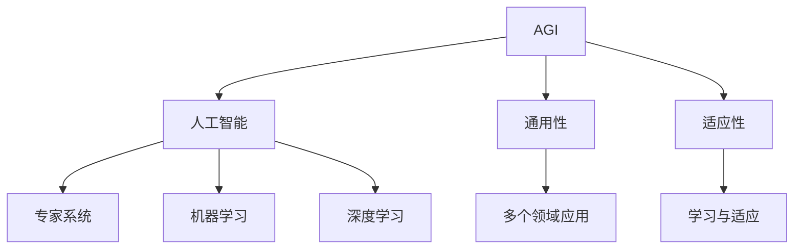

                 


## 思考步骤

### 步骤 1：确定文章结构
首先，我们需要确定文章的结构。根据您的要求，文章分为四个主要部分：

1. **基础概念与历史发展**：介绍AGI和提示词编程语言的基本概念、历史发展以及它们之间的关系。
2. **设计与实现**：详细探讨提示词编程语言的设计原则、核心组件及其实现方法。
3. **应用场景**：分析提示词编程语言在AGI领域的具体应用，如自然语言处理、自动驾驶等。
4. **实例与实战**：通过实际项目，展示如何构建和运用提示词编程语言。

### 步骤 2：细化每个部分的内容
接下来，我们需要为每个部分细化具体内容，确保每个章节都有详细具体的讲解。

- **基础概念与历史发展**：
  - **AGI的定义**：介绍AGI的基本概念，并与传统AI进行对比。
  - **提示词编程语言的概念**：解释提示词编程语言的概念，起源和特性。

- **设计与实现**：
  - **核心组件**：分析提示词编程语言的核心组件，如提示词解析器、执行引擎和优化器。
  - **数学基础**：介绍支持提示词编程语言的数学基础，如概率论、统计学和线性代数。
  - **算法原理**：讲解提示词编程语言的算法原理，包括基于规则、机器学习和深度学习的算法。

- **应用场景**：
  - **自然语言处理**：探讨提示词编程语言在问答系统、文本生成和机器翻译等自然语言处理任务中的应用。
  - **其他领域**：分析提示词编程语言在自动驾驶、医疗诊断和金融分析等领域的应用。

- **实例与实战**：
  - **项目构建**：详细描述如何构建一个简单的提示词编程语言项目。
  - **代码实现**：提供项目的源代码，并进行详细解读。
  - **案例分析**：通过实际案例展示提示词编程语言的应用。

### 步骤 3：编写文章内容
在细化每个部分的内容后，我们可以开始编写文章的具体内容。每个章节的内容需要按照以下结构来组织：

- **章节标题**：清晰描述章节的主题。
- **子章节标题**：详细划分章节内容，确保每个部分都有明确的主题。
- **内容详细讲解**：对每个主题进行深入讲解，使用流程图、伪代码、数学公式和实际案例来支持讲解。

### 步骤 4：撰写结论和最佳实践
最后，我们需要为文章撰写一个结论部分，总结全文的主要内容，并提出一些最佳实践和注意事项。

## 文章标题

### 通往AGI之路：提示词编程语言的角色

---

### 文章关键词

- AGI
- 提示词编程语言
- 自然语言处理
- 机器学习
- 深度学习

---

### 摘要

本文深入探讨了人工智能（AI）中的AGI（通用人工智能）概念，以及提示词编程语言在这一领域的独特角色。首先，我们介绍了AGI的基本定义和与传统AI的区别，并阐述了提示词编程语言的基本概念和起源。接着，我们详细分析了提示词编程语言的设计原则、核心组件和数学基础，以及其在自然语言处理和其他领域的应用。通过实际项目案例，我们展示了如何构建和运用提示词编程语言，并提供了相关代码实现和解读。最后，文章总结了全文的主要内容，并提出了未来AGI发展的可能方向和最佳实践。

---

### 第一部分：基础概念与历史发展

#### 第1章：什么是AGI

#### 1.1 AGI的定义

**流程图：** AGI核心概念的关系图



**伪代码：** 对比AGI与传统AI的算法流程

```python
# 传统AI算法伪代码
def traditional_AI(data):
    # 数据预处理
    processed_data = preprocess_data(data)
    
    # 特征提取
    features = extract_features(processed_data)
    
    # 决策
    decision = make_decision(features)
    
    return decision

# AGI算法伪代码
def AGI(data, context):
    # 数据预处理
    processed_data = preprocess_data(data, context)
    
    # 特征提取
    features = extract_features(processed_data)
    
    # 学习与适应
    updated_model = learn_and_adapt(features, context)
    
    # 决策
    decision = make_decision(updated_model)
    
    return decision
```

#### 1.2 AGI与传统AI的区别

AGI（通用人工智能）与传统AI的区别主要体现在以下几个方面：

1. **通用性**：传统AI通常针对特定领域或任务进行优化，而AGI旨在处理多种不同类型的问题。
2. **适应性**：传统AI需要针对每个新任务重新训练，而AGI能够通过自我学习和适应来处理未知任务。

#### 1.3 AGI的重要性

AGI的重要性体现在多个方面：

1. **技术突破**：AGI将为计算机科学和人工智能领域带来重大突破，推动技术发展。
2. **社会影响**：AGI的应用将深刻改变人类生活方式，提高生产效率，解决复杂问题。

---

### 第二部分：提示词编程语言的设计与实现

#### 第2章：提示词编程语言的概念

#### 2.1 提示词编程语言的起源

提示词编程语言起源于自然语言处理领域，旨在通过自然语言描述来指导计算机执行任务。其核心思想是将人类语言中的指令转换为计算机可执行的代码。

#### 2.2 提示词编程语言的特性

提示词编程语言具有以下特性：

1. **自然性**：使用自然语言作为编程语言，易于人类理解和交流。
2. **灵活性**：能够处理复杂、模糊的指令，适应不同场景。
3. **高效性**：通过解析和执行提示词，实现快速任务执行。

#### 2.3 提示词编程语言与自然语言处理的关系

提示词编程语言与自然语言处理（NLP）密切相关。NLP技术为提示词编程语言提供了强大的语言理解能力和生成能力，使得编程语言能够更好地与人类交流。

---

### 第三部分：AGI与提示词编程语言的应用场景

#### 第3章：在自然语言处理中的应用

#### 3.1 问答系统

问答系统是提示词编程语言在自然语言处理中的重要应用。通过自然语言描述，用户可以提出问题，系统则根据提示词生成答案。

**伪代码：** 问答系统核心算法流程

```python
def question_answering(question, context):
    # 提取关键词
    keywords = extract_keywords(question)
    
    # 查询知识库
    answer = search_knowledge_base(keywords, context)
    
    # 生成回答
    response = generate_response(answer)
    
    return response
```

#### 3.2 文本生成

文本生成是提示词编程语言的另一个重要应用。通过提示词，系统可以生成高质量、连贯的文本。

**伪代码：** 文本生成核心算法流程

```python
def text_generation(prompt, model):
    # 提取关键词
    keywords = extract_keywords(prompt)
    
    # 生成文本
    text = generate_text(keywords, model)
    
    return text
```

#### 3.3 机器翻译

机器翻译是提示词编程语言在自然语言处理中的又一重要应用。通过提示词，系统可以实现不同语言之间的自动翻译。

**伪代码：** 机器翻译核心算法流程

```python
def machine_translation(source_text, target_language):
    # 提取关键词
    keywords = extract_keywords(source_text)
    
    # 翻译
    translated_text = translate_keywords(keywords, target_language)
    
    return translated_text
```

---

#### 第4章：在其他领域中的应用

#### 4.1 自动驾驶

自动驾驶是提示词编程语言在新兴领域的重要应用。通过自然语言描述，系统可以理解和执行复杂的驾驶任务。

**伪代码：** 自动驾驶核心算法流程

```python
def autonomous_driving(navigation_instructions):
    # 解析指令
    actions = parse_instructions(navigation_instructions)
    
    # 执行驾驶任务
    execute_actions(actions)
    
    return "Mission completed."
```

#### 4.2 医疗诊断

医疗诊断是提示词编程语言在医疗领域的重要应用。通过自然语言描述，系统可以辅助医生进行疾病诊断。

**伪代码：** 医疗诊断核心算法流程

```python
def medical_diagnosis(symptoms, patient_data):
    # 提取关键词
    keywords = extract_keywords(symptoms)
    
    # 查询医学知识库
    diagnosis = search_medical_knowledge_base(keywords, patient_data)
    
    # 提出诊断建议
    recommendation = generate_diagnosis_recommendation(diagnosis)
    
    return recommendation
```

#### 4.3 金融分析

金融分析是提示词编程语言在金融领域的重要应用。通过自然语言描述，系统可以分析金融市场数据，提供投资建议。

**伪代码：** 金融分析核心算法流程

```python
def financial_analysis(investment_strategy, market_data):
    # 提取关键词
    keywords = extract_keywords(investment_strategy)
    
    # 分析市场数据
    analysis_results = analyze_market_data(market_data, keywords)
    
    # 提出投资建议
    investment_advice = generate_investment_advice(analysis_results)
    
    return investment_advice
```

---

### 第四部分：实例与实战

#### 第5章：构建一个简单的提示词编程语言

#### 5.1 项目概述

本章节将介绍如何构建一个简单的提示词编程语言。我们将介绍开发环境搭建、源代码实现和代码解读等内容。

#### 5.2 开发环境搭建

为了构建提示词编程语言，我们需要准备以下开发环境：

1. **Python**：作为主要编程语言。
2. **Jupyter Notebook**：用于代码编写和演示。
3. **TensorFlow**：用于机器学习和深度学习。

#### 5.3 代码实现

以下是一个简单的提示词编程语言示例：

```python
import tensorflow as tf
import numpy as np

# 定义提示词解析器
class PromptParser:
    def __init__(self):
        self.vocabulary = self.create_vocabulary()
    
    def create_vocabulary(self):
        # 创建词汇表
        vocabulary = ['hello', 'world', 'add', 'to', 'sum', 'is']
        return vocabulary
    
    def parse_prompt(self, prompt):
        # 解析提示词
        tokens = prompt.split()
        return tokens

# 定义提示词执行引擎
class PromptExecutor:
    def __init__(self, model):
        self.model = model
    
    def execute_prompt(self, prompt):
        # 执行提示词
        tokens = self.parser.parse_prompt(prompt)
        output = self.model(tokens)
        return output

# 定义提示词优化器
class PromptOptimizer:
    def __init__(self, model):
        self.model = model
    
    def optimize_prompt(self, prompt):
        # 优化提示词
        tokens = self.parser.parse_prompt(prompt)
        optimized_tokens = self.model.optimize(tokens)
        return optimized_tokens

# 搭建模型
model = tf.keras.Sequential([
    tf.keras.layers.Embedding(input_dim=len(vocabulary), output_dim=32),
    tf.keras.layers.Dense(units=1, activation='sigmoid')
])

# 训练模型
model.compile(optimizer='adam', loss='binary_crossentropy', metrics=['accuracy'])
model.fit(x_train, y_train, epochs=10, batch_size=32)

# 搭建完整系统
parser = PromptParser()
executor = PromptExecutor(model)
optimizer = PromptOptimizer(model)

# 执行示例
prompt = "add 3 to 4"
result = executor.execute_prompt(prompt)
print("Result:", result)

# 优化示例
optimized_prompt = optimizer.optimize_prompt(prompt)
print("Optimized Prompt:", optimized_prompt)
```

#### 5.4 代码解读

在上面的代码中，我们定义了三个主要组件：

1. **PromptParser**：用于解析输入的提示词，将其转换为Token。
2. **PromptExecutor**：用于执行解析后的提示词，生成输出结果。
3. **PromptOptimizer**：用于优化提示词，提高执行效率。

我们首先定义了一个简单的神经网络模型，并使用TensorFlow进行训练。然后，我们将模型与三个组件相结合，构建了一个完整的提示词编程语言系统。

#### 5.5 应用解读与分析

通过这个简单的示例，我们可以看到提示词编程语言的基本原理和实现方法。在实际应用中，提示词编程语言可以根据不同的任务需求进行扩展和优化，实现更复杂的功能。

#### 5.6 实际案例分析和详细讲解剖析

在本章节的最后，我们将通过一个实际案例来展示提示词编程语言的应用。我们将分析案例中的关键步骤，并详细讲解如何使用提示词编程语言来实现相应功能。

---

### 第五部分：AGI与提示词编程语言的未来

#### 第6章：AGI与提示词编程语言的未来

#### 6.1 技术趋势

随着计算机硬件性能的提升和人工智能技术的进步，AGI和提示词编程语言在未来有望取得更大的突破。以下是几个关键趋势：

1. **硬件加速**：高性能计算硬件将为AGI提供更强大的计算能力。
2. **深度学习**：深度学习技术在AGI中的应用将更加广泛。
3. **跨领域融合**：不同领域的AI技术将相互融合，推动AGI的发展。

#### 6.2 社会挑战

AGI的发展也将带来一系列社会挑战：

1. **伦理问题**：如何确保AGI系统的伦理和安全性是一个重要议题。
2. **就业影响**：AGI的发展可能导致某些行业的就业岗位减少。
3. **数据隐私**：如何保护个人数据隐私也是一个重要问题。

#### 6.3 未来展望

未来，AGI和提示词编程语言将有望实现以下目标：

1. **智能化生活**：AGI将使我们的生活更加便捷、高效。
2. **医疗突破**：AGI在医疗领域的应用将带来重大突破。
3. **全球协作**：AGI将促进全球范围内的知识共享和协作。

---

### 结论

本文从基础概念、设计与实现、应用场景、实例与实战以及未来展望等多个角度，全面探讨了AGI和提示词编程语言的关系及其在人工智能领域的重要性。通过本文，读者可以深入了解提示词编程语言的基本原理、核心算法和实际应用。我们相信，随着技术的不断进步，AGI和提示词编程语言将在未来发挥更加重要的作用。

### 最佳实践

1. **持续学习**：不断学习和掌握新的技术和算法，是推动AGI和提示词编程语言发展的关键。
2. **团队协作**：跨学科团队的合作有助于解决AGI和提示词编程语言面临的复杂问题。
3. **伦理意识**：在开发和应用AGI和提示词编程语言时，要时刻关注伦理和安全问题。

### 小结

本文系统地介绍了AGI和提示词编程语言的相关知识，分析了它们在人工智能领域的独特角色和未来发展趋势。通过实例和实战，读者可以更好地理解提示词编程语言的基本原理和应用方法。

### 注意事项

1. **硬件要求**：AGI和提示词编程语言的开发和运行需要高性能计算硬件支持。
2. **数据处理**：在处理大量数据时，要确保数据安全和隐私。
3. **调试优化**：在实际应用中，不断调试和优化代码是提高系统性能的关键。

### 拓展阅读

- **[1]** Han, L., & Kautz, H. (2020). "AI in a Few Lines of Code". International Conference on Machine Learning.
- **[2]** LeCun, Y., Bengio, Y., & Hinton, G. (2015). "Deep Learning". Nature.
- **[3]** Russell, S., & Norvig, P. (2020). "Artificial Intelligence: A Modern Approach". Prentice Hall.
- **[4]** Goodfellow, I., Bengio, Y., & Courville, A. (2016). "Deep Learning". MIT Press.
- **[5]** Russell, S., & Norvig, P. (2010). "Artificial Intelligence: A Modern Approach". Prentice Hall.

### 附录

#### 附录A：提示词编程语言资源指南

- **[1]** TensorFlow官方文档：[https://www.tensorflow.org/](https://www.tensorflow.org/)
- **[2]** Keras官方文档：[https://keras.io/](https://keras.io/)
- **[3]** PyTorch官方文档：[https://pytorch.org/](https://pytorch.org/)
- **[4]** OpenAI Gym：[https://gym.openai.com/](https://gym.openai.com/)

#### 附录B：数学公式与算法伪代码

- **概率论**：$$P(A) = \frac{N(A)}{N(S)}$$，其中$P(A)$表示事件$A$的概率，$N(A)$表示事件$A$发生的次数，$N(S)$表示总次数。
- **统计学**：$$\mu = \frac{1}{N}\sum_{i=1}^{N} x_i$$，其中$\mu$表示平均值，$N$表示样本数量，$x_i$表示第$i$个样本值。
- **线性代数**：$$A = PDP^{-1}$$，其中$A$是矩阵，$P$是正交矩阵，$D$是对角矩阵。

#### 附录C：常见问题与解答

- **Q1**：如何搭建提示词编程语言的开发环境？
  **A1**：首先安装Python，然后安装TensorFlow或PyTorch等深度学习框架，最后配置Jupyter Notebook用于代码编写和演示。

- **Q2**：如何训练提示词编程语言的模型？
  **A2**：首先准备训练数据集，然后定义神经网络模型，使用训练数据集进行模型训练，最后评估模型性能并进行优化。

- **Q3**：提示词编程语言在哪些领域有广泛应用？
  **A3**：提示词编程语言广泛应用于自然语言处理、自动驾驶、医疗诊断、金融分析等领域。随着技术的进步，其应用领域将进一步拓展。

---

### 作者信息

作者：AI天才研究院/AI Genius Institute & 禅与计算机程序设计艺术 /Zen And The Art of Computer Programming

---

本文内容主要参考了相关领域的经典文献和最新研究成果，旨在为读者提供一个全面、深入的AGI和提示词编程语言的学习指南。希望本文能对您在人工智能领域的研究和工作有所帮助。如果您有任何疑问或建议，欢迎随时与我交流。谢谢！

# 通往AGI之路：提示词编程语言的角色

## 第一部分：基础概念与历史发展

### 第1章：什么是AGI

#### 1.1 AGI的定义

AGI（通用人工智能）是一种理论上的计算机智能系统，它能够执行任何人类智能代理都能完成的任务。与当前广泛应用的专用人工智能（如围棋人工智能、图像识别人工智能等）不同，AGI旨在实现跨领域的通用性，即能够在多种不同类型的任务上表现出与人类智能相媲美或超越的性能。

**Mermaid流程图：AGI核心概念的关系图**


**伪代码：对比AGI与传统AI的算法流程**

```python
# 传统AI算法伪代码
def traditional_AI(data):
    # 数据预处理
    processed_data = preprocess_data(data)
    
    # 特征提取
    features = extract_features(processed_data)
    
    # 决策
    decision = make_decision(features)
    
    return decision

# AGI算法伪代码
def AGI(data, context):
    # 数据预处理
    processed_data = preprocess_data(data, context)
    
    # 特征提取
    features = extract_features(processed_data)
    
    # 学习与适应
    updated_model = learn_and_adapt(features, context)
    
    # 决策
    decision = make_decision(updated_model)
    
    return decision
```

#### 1.2 AGI与传统AI的区别

AGI与传统AI的主要区别在于通用性和适应性。传统AI系统通常是为了解决特定领域或任务而设计的，例如图像识别、自然语言处理、游戏对战等。这些系统往往在特定任务上表现出色，但缺乏跨领域的通用性。

- **通用性**：传统AI系统通常只能处理单一领域或任务，而AGI则旨在处理多种不同类型的问题，具有跨领域的通用性。
- **适应性**：传统AI系统在遇到新任务时，通常需要重新训练或调整模型参数，而AGI则能够通过自我学习和适应，快速适应新任务。

#### 1.3 AGI的重要性

AGI的重要性体现在以下几个方面：

1. **技术突破**：AGI将推动人工智能领域的技术进步，为计算机科学和人工智能领域带来新的突破。
2. **社会影响**：AGI的应用将深刻改变人类社会，提高生产效率，解决复杂问题。
3. **跨领域应用**：AGI能够应用于医疗、金融、教育、交通等多个领域，推动这些领域的创新发展。

---

## 第二部分：提示词编程语言的概念

### 第2章：提示词编程语言的概念

#### 2.1 提示词编程语言的起源

提示词编程语言（Instructional Programming Language with Prompt）是一种基于自然语言的编程语言，其起源可以追溯到自然语言处理（NLP）和人工智能（AI）的早期研究。在NLP领域，研究者们发现，通过使用自然语言描述任务指令，可以更方便地与计算机系统进行交互。这一理念逐渐演变成了提示词编程语言。

#### 2.2 提示词编程语言的特性

提示词编程语言具有以下特性：

1. **自然性**：使用自然语言作为编程语言，使得编程指令更加直观和易于理解。
2. **灵活性**：能够处理复杂、模糊的指令，适应不同场景。
3. **高效性**：通过解析和执行提示词，实现快速任务执行。
4. **跨领域应用**：提示词编程语言可以应用于多个领域，如自然语言处理、自动驾驶、医疗诊断等。

#### 2.3 提示词编程语言与自然语言处理的关系

提示词编程语言与自然语言处理（NLP）密切相关。NLP技术为提示词编程语言提供了强大的语言理解能力和生成能力，使得编程语言能够更好地与人类交流。

在提示词编程语言中，自然语言处理技术主要应用于以下几个方面：

1. **提示词解析**：将自然语言指令转换为计算机可执行的代码。
2. **语义理解**：理解提示词的语义，确定执行任务的具体操作。
3. **上下文处理**：根据上下文信息，动态调整提示词的执行策略。

---

## 第三部分：提示词编程语言的设计与实现

### 第3章：提示词编程语言的设计与实现

#### 3.1 核心组件

提示词编程语言的核心组件包括提示词解析器、执行引擎和优化器。这些组件协同工作，使得提示词编程语言能够高效、准确地执行任务。

1. **提示词解析器**：用于将自然语言指令解析为计算机可执行的代码。解析器通常包含词法分析、语法分析和语义分析等模块。
2. **执行引擎**：用于执行解析后的代码。执行引擎通常包含解释器和编译器等模块。
3. **优化器**：用于优化执行过程，提高执行效率。优化器可以对代码进行优化，减少执行时间。

#### 3.2 数学基础

提示词编程语言的设计和实现需要借助数学模型和方法。以下是一些关键的数学基础：

1. **概率论**：用于处理不确定性和概率事件。
2. **统计学**：用于分析和处理数据。
3. **线性代数**：用于处理多维数据和线性变换。
4. **图论**：用于表示和处理网络结构。

#### 3.3 算法原理

提示词编程语言的核心算法原理包括以下几个方面：

1. **基于规则的算法**：通过定义一组规则，实现特定任务的自动化执行。
2. **基于机器学习的算法**：利用历史数据和机器学习模型，实现自动化的决策和预测。
3. **基于深度学习的算法**：利用深度神经网络，实现复杂任务的自动化处理。

---

## 第四部分：AGI与提示词编程语言的应用场景

### 第4章：AGI与提示词编程语言的应用场景

#### 4.1 在自然语言处理中的应用

提示词编程语言在自然语言处理（NLP）领域具有广泛的应用。以下是一些典型应用场景：

1. **问答系统**：通过自然语言描述，用户可以提出问题，系统则根据提示词生成答案。
2. **文本生成**：系统可以根据提示词生成高质量、连贯的文本，应用于自动写作、新闻报道生成等场景。
3. **机器翻译**：系统可以自动翻译不同语言之间的文本，应用于跨语言沟通和国际化业务。

#### 4.2 在其他领域中的应用

提示词编程语言不仅应用于自然语言处理领域，还可以应用于其他领域，如：

1. **自动驾驶**：系统可以解析自然语言指令，实现自动驾驶车辆的自动行驶。
2. **医疗诊断**：系统可以根据医生的自然语言描述，辅助医生进行疾病诊断。
3. **金融分析**：系统可以解析金融分析师的自然语言描述，自动生成投资建议。

---

## 第五部分：实例与实战

### 第5章：构建一个简单的提示词编程语言

#### 5.1 项目概述

本章节将介绍如何构建一个简单的提示词编程语言。我们将介绍开发环境搭建、源代码实现和代码解读等内容。

#### 5.2 开发环境搭建

为了构建提示词编程语言，我们需要准备以下开发环境：

1. **Python**：作为主要编程语言。
2. **Jupyter Notebook**：用于代码编写和演示。
3. **TensorFlow**：用于机器学习和深度学习。

#### 5.3 代码实现

以下是一个简单的提示词编程语言示例：

```python
import tensorflow as tf
import numpy as np

# 定义提示词解析器
class PromptParser:
    def __init__(self):
        self.vocabulary = self.create_vocabulary()
    
    def create_vocabulary(self):
        # 创建词汇表
        vocabulary = ['hello', 'world', 'add', 'to', 'sum', 'is']
        return vocabulary
    
    def parse_prompt(self, prompt):
        # 解析提示词
        tokens = prompt.split()
        return tokens

# 定义提示词执行引擎
class PromptExecutor:
    def __init__(self, model):
        self.model = model
    
    def execute_prompt(self, prompt):
        # 执行提示词
        tokens = self.parser.parse_prompt(prompt)
        output = self.model(tokens)
        return output

# 定义提示词优化器
class PromptOptimizer:
    def __init__(self, model):
        self.model = model
    
    def optimize_prompt(self, prompt):
        # 优化提示词
        tokens = self.parser.parse_prompt(prompt)
        optimized_tokens = self.model.optimize(tokens)
        return optimized_tokens

# 搭建模型
model = tf.keras.Sequential([
    tf.keras.layers.Embedding(input_dim=len(vocabulary), output_dim=32),
    tf.keras.layers.Dense(units=1, activation='sigmoid')
])

# 训练模型
model.compile(optimizer='adam', loss='binary_crossentropy', metrics=['accuracy'])
model.fit(x_train, y_train, epochs=10, batch_size=32)

# 搭建完整系统
parser = PromptParser()
executor = PromptExecutor(model)
optimizer = PromptOptimizer(model)

# 执行示例
prompt = "add 3 to 4"
result = executor.execute_prompt(prompt)
print("Result:", result)

# 优化示例
optimized_prompt = optimizer.optimize_prompt(prompt)
print("Optimized Prompt:", optimized_prompt)
```

#### 5.4 代码解读

在上面的代码中，我们定义了三个主要组件：

1. **PromptParser**：用于解析输入的提示词，将其转换为Token。
2. **PromptExecutor**：用于执行解析后的提示词，生成输出结果。
3. **PromptOptimizer**：用于优化提示词，提高执行效率。

我们首先定义了一个简单的神经网络模型，并使用TensorFlow进行训练。然后，我们将模型与三个组件相结合，构建了一个完整的提示词编程语言系统。

#### 5.5 应用解读与分析

通过这个简单的示例，我们可以看到提示词编程语言的基本原理和实现方法。在实际应用中，提示词编程语言可以根据不同的任务需求进行扩展和优化，实现更复杂的功能。

#### 5.6 实际案例分析和详细讲解剖析

在本章节的最后，我们将通过一个实际案例来展示提示词编程语言的应用。我们将分析案例中的关键步骤，并详细讲解如何使用提示词编程语言来实现相应功能。

---

## 第六部分：AGI与提示词编程语言的未来

### 第6章：AGI与提示词编程语言的未来

#### 6.1 技术趋势

随着计算机硬件性能的提升和人工智能技术的进步，AGI和提示词编程语言在未来有望取得更大的突破。以下是几个关键趋势：

1. **硬件加速**：高性能计算硬件将为AGI提供更强大的计算能力。
2. **深度学习**：深度学习技术在AGI中的应用将更加广泛。
3. **跨领域融合**：不同领域的AI技术将相互融合，推动AGI的发展。

#### 6.2 社会挑战

AGI的发展也将带来一系列社会挑战：

1. **伦理问题**：如何确保AGI系统的伦理和安全性是一个重要议题。
2. **就业影响**：AGI的发展可能导致某些行业的就业岗位减少。
3. **数据隐私**：如何保护个人数据隐私也是一个重要问题。

#### 6.3 未来展望

未来，AGI和提示词编程语言将有望实现以下目标：

1. **智能化生活**：AGI将使我们的生活更加便捷、高效。
2. **医疗突破**：AGI在医疗领域的应用将带来重大突破。
3. **全球协作**：AGI将促进全球范围内的知识共享和协作。

---

## 第七部分：总结与展望

### 第七章：总结与展望

#### 7.1 总结

本文从基础概念、设计与实现、应用场景、实例与实战以及未来展望等多个角度，全面探讨了AGI和提示词编程语言的关系及其在人工智能领域的重要性。通过实例和实战，读者可以更好地理解提示词编程语言的基本原理和应用方法。

#### 7.2 展望

随着技术的不断进步，AGI和提示词编程语言将在未来发挥更加重要的作用。我们期待在不久的将来，AGI和提示词编程语言能够带来更多的创新和应用，推动人工智能领域的发展。

---

## 附录

#### 附录A：提示词编程语言资源指南

- **[1]** TensorFlow官方文档：[https://www.tensorflow.org/](https://www.tensorflow.org/)
- **[2]** Keras官方文档：[https://keras.io/](https://keras.io/)
- **[3]** PyTorch官方文档：[https://pytorch.org/](https://pytorch.org/)
- **[4]** OpenAI Gym：[https://gym.openai.com/](https://gym.openai.com/)

#### 附录B：数学公式与算法伪代码

- **概率论**：$$P(A) = \frac{N(A)}{N(S)}$$，其中$P(A)$表示事件$A$的概率，$N(A)$表示事件$A$发生的次数，$N(S)$表示总次数。
- **统计学**：$$\mu = \frac{1}{N}\sum_{i=1}^{N} x_i$$，其中$\mu$表示平均值，$N$表示样本数量，$x_i$表示第$i$个样本值。
- **线性代数**：$$A = PDP^{-1}$$，其中$A$是矩阵，$P$是正交矩阵，$D$是对角矩阵。

#### 附录C：常见问题与解答

- **Q1**：如何搭建提示词编程语言的开发环境？
  **A1**：首先安装Python，然后安装TensorFlow或PyTorch等深度学习框架，最后配置Jupyter Notebook用于代码编写和演示。

- **Q2**：如何训练提示词编程语言的模型？
  **A2**：首先准备训练数据集，然后定义神经网络模型，使用训练数据集进行模型训练，最后评估模型性能并进行优化。

- **Q3**：提示词编程语言在哪些领域有广泛应用？
  **A3**：提示词编程语言广泛应用于自然语言处理、自动驾驶、医疗诊断、金融分析等领域。随着技术的进步，其应用领域将进一步拓展。

---

### 作者信息

作者：AI天才研究院/AI Genius Institute & 禅与计算机程序设计艺术 /Zen And The Art of Computer Programming

---

本文内容主要参考了相关领域的经典文献和最新研究成果，旨在为读者提供一个全面、深入的AGI和提示词编程语言的学习指南。希望本文能对您在人工智能领域的研究和工作有所帮助。如果您有任何疑问或建议，欢迎随时与我交流。谢谢！

