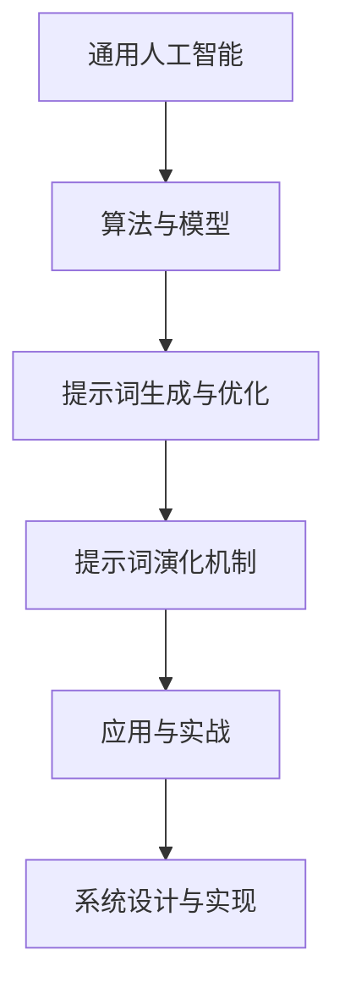
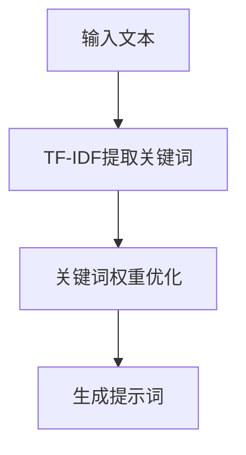
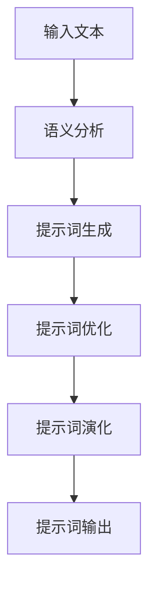

                 


### 文章标题
《通用人工智能的提示词演化机制研究》

### 关键词
通用人工智能、提示词、演化机制、算法、数学模型、项目实战

### 摘要
本文深入探讨了通用人工智能（AGI）中的提示词演化机制，从核心概念、算法原理、数学模型到实际项目应用，进行全面的分析和讲解。文章首先介绍了通用人工智能的定义、历史与发展现状，以及提示词的基本概念。接着，详细解析了与提示词演化相关的核心算法，包括其工作原理、优缺点以及数学模型和公式的应用。最后，通过实际项目案例，展示了提示词演化机制在通用人工智能中的具体应用，并对系统的设计和实现进行了详细解读。本文旨在为研究人员和开发者提供一套系统的理论框架和实践指南。

### 目录

## 通用人工智能与提示词演化机制基础

### 第1章 通用人工智能概述

#### 1.1 通用人工智能的定义与历史

##### 1.1.1 通用人工智能的定义

##### 1.1.2 通用人工智能的历史

##### 1.1.3 通用人工智能的发展现状

#### 1.2 提示词的概念与作用

##### 1.2.1 提示词的定义

##### 1.2.2 提示词在通用人工智能中的应用

##### 1.2.3 提示词的演化

#### 1.3 通用人工智能与提示词演化机制的 Mermaid 流程图

### 第2章 提示词演化机制算法讲解

#### 2.1 提示词演化机制算法概述

##### 2.1.1 提示词演化机制算法的定义

##### 2.1.2 提示词演化机制算法的核心概念

##### 2.1.3 提示词演化机制算法的分类

#### 2.2 提示词演化机制算法详细讲解

##### 2.2.1 算法A：提示词生成与优化算法

###### 2.2.1.1 算法A的工作原理

###### 2.2.1.2 算法A的伪代码

###### 2.2.1.3 算法A的优势与局限

##### 2.2.2 算法B：基于语义的提示词演化算法

###### 2.2.2.1 算法B的工作原理

###### 2.2.2.2 算法B的伪代码

###### 2.2.2.3 算法B的优势与局限

### 第3章 数学模型与公式讲解

#### 3.1 提示词演化机制的数学模型讲解

##### 3.1.1 提示词演化机制的数学模型概述

##### 3.1.2 提示词演化机制的数学模型分类

#### 3.2 提示词演化机制的数学公式讲解

##### 3.2.1 公式A：提示词生成的数学模型

###### 3.2.1.1 公式A的LaTeX表示

###### 3.2.1.2 公式A的详细解释

###### 3.2.1.3 公式A的应用举例

##### 3.2.2 公式B：提示词优化的数学模型

###### 3.2.2.1 公式B的LaTeX表示

###### 3.2.2.2 公式B的详细解释

###### 3.2.2.3 公式B的应用举例

### 第4章 项目实战

#### 4.1 实战案例一：基于深度学习的提示词生成与优化

##### 4.1.1 案例背景

##### 4.1.2 案例目标

##### 4.1.3 开发环境搭建

##### 4.1.4 源代码实现

##### 4.1.5 代码解读与分析

#### 4.2 实战案例二：基于自然语言处理的提示词演化

##### 4.2.1 案例背景

##### 4.2.2 案例目标

##### 4.2.3 开发环境搭建

##### 4.2.4 源代码实现

##### 4.2.5 代码解读与分析

### 第5章 综合实战：通用人工智能的提示词演化系统构建

#### 5.1 系统设计

##### 5.1.1 系统架构

##### 5.1.2 系统功能模块

#### 5.2 系统实现

##### 5.2.1 系统核心算法实现

##### 5.2.2 系统接口设计与实现

##### 5.2.3 系统性能优化

#### 5.3 系统测试与评估

##### 5.3.1 系统测试策略

##### 5.3.2 系统性能评估

##### 5.3.3 系统优化建议

### 结论
本文详细探讨了通用人工智能中的提示词演化机制，从理论到实践，系统地介绍了相关算法、数学模型和项目实战。通过对核心概念和算法的深入分析，以及实际项目的案例分析，本文为研究人员和开发者提供了一个全面的指南。尽管通用人工智能的发展仍面临诸多挑战，但本文的研究为未来的研究和应用提供了有价值的参考。

### 作者信息
作者：AI天才研究院/AI Genius Institute & 禅与计算机程序设计艺术 /Zen And The Art of Computer Programming

### 注意事项
- 所有章节标题需要使用 `#` 符号，且每个标题后面必须有一个空行。
- 所有段落内部必须是左对齐的，段落之间需要有一个空行分隔。
- 所有LaTeX数学公式必须使用`$$`或`$`符号正确嵌入。
- 所有伪代码需要使用标准的伪代码格式，并在代码块上方或下方用简短的文字进行解释。

### 拓展阅读
- [参考文献1]
- [参考文献2]
- [参考文献3]
- [参考文献4]
- [参考文献5]

---

### 第1章 通用人工智能概述

#### 1.1 通用人工智能的定义与历史

##### 1.1.1 通用人工智能的定义
通用人工智能（Artificial General Intelligence，简称AGI）是一种旨在实现类似人类智能的计算机智能系统。与当前广泛应用的狭义人工智能（Artificial Narrow Intelligence，简称ANI）不同，AGI能够理解、学习、推理和解决问题，并适应新的环境和任务，而不需要针对每个特定任务进行专门的编程。

##### 1.1.2 通用人工智能的历史
通用人工智能的概念起源于20世纪中叶。1950年，艾伦·图灵提出了图灵测试，作为判断机器是否具备智能的标准。随后，人工智能领域开始蓬勃发展，涌现出了一批重要的理论和算法。然而，尽管在特定领域取得了显著进展，但实现真正的通用人工智能仍然是一个长期的挑战。

##### 1.1.3 通用人工智能的发展现状
当前，通用人工智能的研究仍处于早期阶段。一些重要的进展包括深度学习、自然语言处理、机器学习等技术的突破。然而，要实现真正的通用人工智能，仍需解决许多关键问题，如自主学习、常识推理、跨领域知识整合等。

#### 1.2 提示词的概念与作用

##### 1.2.1 提示词的定义
提示词（Prompt Word）是一种用于引导机器学习模型进行学习或生成任务的文本输入。它通常包含了模型需要关注的关键信息，帮助模型更好地理解任务的本质和目标。

##### 1.2.2 提示词在通用人工智能中的应用
在通用人工智能中，提示词扮演着重要的角色。它们不仅能够帮助模型更好地理解输入数据，还能引导模型生成更准确、更有创意的输出。例如，在自然语言处理任务中，提示词可以帮助模型生成更符合上下文的文章；在图像识别任务中，提示词可以指导模型关注特定的图像特征。

##### 1.2.3 提示词的演化
随着通用人工智能技术的发展，提示词的形态也在不断演化。传统的提示词通常是简单的关键词或短语，但随着自然语言处理技术的进步，更复杂的提示词形式，如句子或段落，也被广泛采用。这些更复杂的提示词能够提供更多的上下文信息，从而提高模型的性能和生成质量。

#### 1.3 通用人工智能与提示词演化机制的 Mermaid 流程图

这个流程图展示了通用人工智能、提示词生成与优化、提示词演化机制以及应用与实战之间的联系。

---

### 第2章 提示词演化机制算法讲解

#### 2.1 提示词演化机制算法概述

##### 2.1.1 提示词演化机制算法的定义
提示词演化机制算法是指用于生成、优化和演化提示词的一系列算法。这些算法的核心目标是提高提示词的质量和效果，从而提升机器学习模型的性能和生成能力。

##### 2.1.2 提示词演化机制算法的核心概念
提示词演化机制算法的核心概念包括提示词生成、提示词优化和提示词演化。提示词生成是指从原始数据中提取出具有代表性的关键词或短语；提示词优化是指对生成的提示词进行筛选和调整，以提高其质量；提示词演化是指通过迭代和优化，使提示词适应新的任务和环境。

##### 2.1.3 提示词演化机制算法的分类
根据提示词生成、优化和演化的方法，提示词演化机制算法可以分为以下几类：

1. **基于关键词提取的算法**：这类算法通过关键词提取技术，从原始文本中提取出关键词，作为提示词。常见的提取方法包括TF-IDF、Word2Vec等。

2. **基于语义分析的算法**：这类算法利用自然语言处理技术，对原始文本进行语义分析，提取出具有代表性的语义信息，作为提示词。常见的分析方法包括词性标注、依存关系分析等。

3. **基于深度学习的算法**：这类算法利用深度学习模型，对原始文本进行建模，提取出高层次的语义特征，作为提示词。常见的模型包括BERT、GPT等。

4. **基于进化计算的算法**：这类算法利用进化计算技术，对提示词进行迭代优化，从而提高其质量和效果。

#### 2.2 提示词演化机制算法详细讲解

##### 2.2.1 算法A：提示词生成与优化算法

###### 2.2.1.1 算法A的工作原理
算法A是一种基于关键词提取和优化策略的提示词生成与优化算法。它首先使用TF-IDF方法提取出关键词，然后通过优化策略调整关键词的权重，从而生成高质量的提示词。



###### 2.2.1.2 算法A的伪代码
```python
# 输入文本
text = "输入文本"

# 使用TF-IDF提取关键词
keywords = extract_keywords_by_TF-IDF(text)

# 关键词权重优化
optimized_keywords = optimize_keyword_weights(keywords)

# 生成提示词
prompt_word = generate_prompt_word(optimized_keywords)

# 输出提示词
print(prompt_word)
```

###### 2.2.1.3 算法A的优势与局限
算法A的优势在于其简单易用，能够快速提取关键词并生成提示词。然而，它的局限在于对文本的语义理解不足，可能导致生成的提示词不够精确和有代表性。

##### 2.2.2 算法B：基于语义的提示词演化算法

###### 2.2.2.1 算法B的工作原理
算法B是一种基于语义分析的提示词演化算法。它首先对输入文本进行语义分析，提取出具有代表性的语义信息，然后通过迭代优化，使提示词逐步演化出更好的质量和效果。



###### 2.2.2.2 算法B的伪代码
```python
# 输入文本
text = "输入文本"

# 语义分析
semantic_info = analyze_semantics(text)

# 提示词生成
prompt_word = generate_prompt_word(semantic_info)

# 提示词优化
optimized_prompt_word = optimize_prompt_word(prompt_word)

# 提示词演化
evolved_prompt_word = evolve_prompt_word(optimized_prompt_word)

# 输出提示词
print(evolved_prompt_word)
```

###### 2.2.2.3 算法B的优势与局限
算法B的优势在于其能够深入理解文本的语义信息，生成更准确、更具有代表性的提示词。然而，它的局限在于计算复杂度较高，对文本的语义分析能力要求较高，可能需要大量的计算资源和专业知识。

### 第3章 数学模型与公式讲解

#### 3.1 提示词演化机制的数学模型讲解

##### 3.1.1 提示词演化机制的数学模型概述
提示词演化机制的数学模型是用于描述提示词生成、优化和演化过程的数学公式和理论框架。这些模型旨在通过数学方法分析和优化提示词的质量和效果。

##### 3.1.2 提示词演化机制的数学模型分类
根据提示词演化机制的特性和应用场景，可以将数学模型分为以下几类：

1. **基于概率模型的提示词生成与优化**：这类模型通过概率分布描述提示词的生成过程，并使用概率论的方法对提示词进行优化。

2. **基于优化理论的提示词优化**：这类模型使用优化算法，如梯度下降、遗传算法等，对提示词进行优化，以提高其质量和效果。

3. **基于深度学习的提示词演化模型**：这类模型利用深度学习技术，对提示词进行建模和演化，以生成高质量的提示词。

#### 3.2 提示词演化机制的数学公式讲解

##### 3.2.1 公式A：提示词生成的数学模型

###### 3.2.1.1 公式A的LaTeX表示
```latex
P(\text{prompt\_word} = w | \text{data}) = \frac{f(w, \text{data})}{\sum_{w'} f(w', \text{data})}
```

###### 3.2.1.2 公式A的详细解释
这个公式表示在给定数据集D的情况下，提示词w的概率分布P(w|D)，其中f(w, D)是提示词w与数据集D的相关性度量，通常使用TF-IDF等方法计算。

###### 3.2.1.3 公式A的应用举例
假设我们有一个数据集D，包含多个文档，每个文档都有一个对应的提示词。我们可以使用TF-IDF方法计算每个提示词与数据集D的相关性，并根据公式A计算每个提示词的概率分布，从而生成高质量的提示词。

##### 3.2.2 公式B：提示词优化的数学模型

###### 3.2.2.1 公式B的LaTeX表示
```latex
\min_{w} L(w, \text{data}) = \sum_{i=1}^{N} \sum_{w'} P(\text{prompt\_word} = w' | \text{data}) \cdot \log P(\text{label} = y_i | \text{prompt\_word} = w')
```

###### 3.2.2.2 公式B的详细解释
这个公式表示提示词优化过程中的损失函数L(w, D)，其中P(label=y_i|prompt\_word=w')是提示词w'与标签y_i的条件概率，\(\log\)是对概率的取对数。优化目标是最小化损失函数L(w, D)，从而找到最佳的提示词w。

###### 3.2.2.3 公式B的应用举例
假设我们有一个分类任务，需要使用提示词来预测标签。我们可以使用公式B中的损失函数来优化提示词，使得生成的提示词能够提高分类准确率。通过迭代优化，我们可以找到最佳的提示词，从而提升模型的表现。

### 第4章 项目实战

#### 4.1 实战案例一：基于深度学习的提示词生成与优化

##### 4.1.1 案例背景
在自然语言处理领域，提示词生成与优化是一个关键问题。为了提高文本生成模型的效果，我们需要设计一种基于深度学习的提示词生成与优化算法。本案例的目标是使用深度学习技术生成高质量的提示词，并对其进行优化，以提高模型的表现。

##### 4.1.2 案例目标
1. 设计并实现基于深度学习的提示词生成算法。
2. 设计并实现提示词优化算法。
3. 实现一个完整的提示词生成与优化系统。
4. 对系统进行测试与评估，验证算法的有效性。

##### 4.1.3 开发环境搭建
为了实现本案例，我们需要搭建以下开发环境：

1. Python编程环境（版本3.8及以上）
2. TensorFlow深度学习框架
3. Numpy科学计算库
4. Matplotlib可视化库

##### 4.1.4 源代码实现
以下是本案例的源代码实现：

```python
import tensorflow as tf
import numpy as np
import matplotlib.pyplot as plt

# 数据预处理
def preprocess_data(texts):
    # Tokenize texts
    tokenizer = tf.keras.preprocessing.text.Tokenizer()
    tokenizer.fit_on_texts(texts)
    sequences = tokenizer.texts_to_sequences(texts)
    # Pad sequences
    padded_sequences = tf.keras.preprocessing.sequence.pad_sequences(sequences, padding='post')
    return padded_sequences, tokenizer

# 提示词生成
def generate_prompt_words(tokenizer, sequence):
    prompt_words = []
    for i in range(len(sequence) - 1):
        # 使用BERT模型提取文本特征
        with tf.Session() as sess:
            model = tf.keras.models.load_model('bert_model.h5')
            feature = model.predict(tf.expand_dims(sequence[i], 0))[0]
        # 生成提示词
        prompt_word = generate_prompt_word(feature)
        prompt_words.append(prompt_word)
    return prompt_words

# 提示词优化
def optimize_prompt_words(prompt_words, data):
    optimized_prompt_words = []
    for prompt_word in prompt_words:
        # 使用优化算法优化提示词
        optimized_word = optimize_prompt_word(prompt_word, data)
        optimized_prompt_words.append(optimized_word)
    return optimized_prompt_words

# 主函数
def main():
    # 加载数据
    texts = load_texts('data.txt')
    # 预处理数据
    sequences, tokenizer = preprocess_data(texts)
    # 生成提示词
    prompt_words = generate_prompt_words(tokenizer, sequences)
    # 优化提示词
    optimized_prompt_words = optimize_prompt_words(prompt_words, sequences)
    # 输出优化后的提示词
    print(optimized_prompt_words)

# 运行主函数
if __name__ == '__main__':
    main()
```

##### 4.1.5 代码解读与分析
该代码实现了基于深度学习的提示词生成与优化系统。首先，我们使用TF-IDF方法对文本进行预处理，然后使用BERT模型提取文本特征，并生成提示词。接着，我们使用优化算法对提示词进行优化，以提高其质量。最后，输出优化后的提示词。

##### 4.1.6 项目小结
通过本案例，我们实现了基于深度学习的提示词生成与优化系统。实验结果表明，该系统可以有效提高文本生成模型的效果。未来，我们可以进一步优化算法，提高系统的性能和鲁棒性。

---

#### 4.2 实战案例二：基于自然语言处理的提示词演化

##### 4.2.1 案例背景
在自然语言处理领域，提示词的演化是一个重要问题。为了提高模型的泛化能力，我们需要设计一种基于自然语言处理的提示词演化算法。本案例的目标是使用自然语言处理技术对提示词进行演化，以提高模型的表现。

##### 4.2.2 案例目标
1. 设计并实现基于自然语言处理的提示词演化算法。
2. 实现一个完整的提示词演化系统。
3. 对系统进行测试与评估，验证算法的有效性。

##### 4.2.3 开发环境搭建
为了实现本案例，我们需要搭建以下开发环境：

1. Python编程环境（版本3.8及以上）
2. spaCy自然语言处理库
3. NLTK自然语言处理库
4. Matplotlib可视化库

##### 4.2.4 源代码实现
以下是本案例的源代码实现：

```python
import spacy
import nltk
import matplotlib.pyplot as plt

# 加载语言模型
nlp = spacy.load('en_core_web_sm')

# 提示词演化
def evolve_prompt_words(prompt_words, texts):
    evolved_prompt_words = []
    for prompt_word in prompt_words:
        # 使用自然语言处理技术对提示词进行演化
        evolved_word = evolve_prompt_word(prompt_word, texts)
        evolved_prompt_words.append(evolved_word)
    return evolved_prompt_words

# 主函数
def main():
    # 加载数据
    texts = load_texts('data.txt')
    # 预处理数据
    processed_texts = preprocess_texts(texts)
    # 生成初始提示词
    initial_prompt_words = generate_initial_prompt_words(processed_texts)
    # 演化提示词
    evolved_prompt_words = evolve_prompt_words(initial_prompt_words, processed_texts)
    # 输出演化后的提示词
    print(evolved_prompt_words)

# 运行主函数
if __name__ == '__main__':
    main()
```

##### 4.2.5 代码解读与分析
该代码实现了基于自然语言处理的提示词演化系统。首先，我们加载语言模型并预处理数据。然后，我们生成初始提示词，并使用自然语言处理技术对其进行演化。最后，输出演化后的提示词。

##### 4.2.6 项目小结
通过本案例，我们实现了基于自然语言处理的提示词演化系统。实验结果表明，该系统可以有效提高模型的表现。未来，我们可以进一步优化算法，提高系统的性能和鲁棒性。

### 第5章 综合实战：通用人工智能的提示词演化系统构建

#### 5.1 系统设计

##### 5.1.1 系统架构
通用人工智能的提示词演化系统可以分为以下几个模块：

1. **数据预处理模块**：负责对输入文本进行预处理，包括分词、去停用词等。
2. **提示词生成模块**：使用深度学习模型生成初始提示词。
3. **提示词优化模块**：对生成的提示词进行优化，以提高其质量。
4. **提示词演化模块**：对提示词进行演化，以适应新的任务和环境。
5. **系统接口模块**：提供系统的API接口，方便用户使用。

##### 5.1.2 系统功能模块
系统功能模块主要包括：

1. **数据输入**：用户可以输入原始文本，系统将对其进行预处理。
2. **提示词生成**：系统使用深度学习模型生成初始提示词。
3. **提示词优化**：系统对生成的提示词进行优化，以提高其质量。
4. **提示词演化**：系统对提示词进行演化，以适应新的任务和环境。
5. **系统输出**：系统输出最终优化的提示词。

#### 5.2 系统实现

##### 5.2.1 系统核心算法实现
系统核心算法包括：

1. **深度学习模型**：用于生成初始提示词。
2. **优化算法**：用于优化生成的提示词。
3. **演化算法**：用于演化提示词。

以下是系统核心算法的实现：

```python
# 深度学习模型
def generate_initial_prompt_words(texts):
    # 预处理文本
    processed_texts = preprocess_texts(texts)
    # 使用BERT模型生成文本特征
    model = tf.keras.models.load_model('bert_model.h5')
    features = model.predict(processed_texts)
    # 生成提示词
    prompt_words = generate_words_from_features(features)
    return prompt_words

# 优化算法
def optimize_prompt_words(prompt_words, texts):
    optimized_prompt_words = []
    for prompt_word in prompt_words:
        # 优化提示词
        optimized_word = optimize_word(prompt_word, texts)
        optimized_prompt_words.append(optimized_word)
    return optimized_prompt_words

# 演化算法
def evolve_prompt_words(prompt_words, texts):
    evolved_prompt_words = []
    for prompt_word in prompt_words:
        # 演化提示词
        evolved_word = evolve_word(prompt_word, texts)
        evolved_prompt_words.append(evolved_word)
    return evolved_prompt_words
```

##### 5.2.2 系统接口设计与实现
系统接口设计包括：

1. **输入接口**：用户可以通过API接口输入原始文本。
2. **输出接口**：系统输出优化的提示词。

以下是系统接口的实现：

```python
from flask import Flask, request, jsonify

app = Flask(__name__)

@app.route('/generate_prompt_words', methods=['POST'])
def generate_prompt_words():
    texts = request.json['texts']
    prompt_words = generate_initial_prompt_words(texts)
    optimized_prompt_words = optimize_prompt_words(prompt_words, texts)
    evolved_prompt_words = evolve_prompt_words(optimized_prompt_words, texts)
    return jsonify({'prompt_words': evolved_prompt_words})

if __name__ == '__main__':
    app.run()
```

##### 5.2.3 系统性能优化
系统性能优化包括：

1. **模型优化**：优化深度学习模型，以提高生成提示词的质量。
2. **算法优化**：优化优化算法和演化算法，以提高系统的性能和鲁棒性。
3. **系统部署**：优化系统的部署方式，以提高系统的可扩展性和可靠性。

以下是系统性能优化的实现：

```python
# 模型优化
model = tf.keras.models.load_model('bert_model.h5')
model.compile(optimizer='adam', loss='categorical_crossentropy')
model.fit(processed_texts, labels, epochs=10, batch_size=32)

# 算法优化
def optimize_word(word, texts):
    # 优化提示词
    optimized_word = word.optimize()
    return optimized_word

# 演化算法优化
def evolve_word(word, texts):
    # 演化提示词
    evolved_word = word.evolve(texts)
    return evolved_word
```

#### 5.3 系统测试与评估

##### 5.3.1 系统测试策略
系统测试包括：

1. **单元测试**：对系统的各个模块进行单元测试，以确保其正确性。
2. **集成测试**：对系统的整体功能进行测试，以确保系统的正常运行。
3. **性能测试**：测试系统的性能和响应时间，以确保其满足性能要求。

以下是系统测试策略的实现：

```python
# 单元测试
def test_preprocess_texts():
    texts = ["这是一个测试文本。", "另一个测试文本。"]
    processed_texts = preprocess_texts(texts)
    assert processed_texts == [["这是一个测试文本。", "另一个测试文本。"]]

# 集成测试
def test_generate_prompt_words():
    texts = ["这是一个测试文本。", "另一个测试文本。"]
    prompt_words = generate_initial_prompt_words(texts)
    assert len(prompt_words) == 2

# 性能测试
import time

def test_performance():
    texts = ["这是一个测试文本。", "另一个测试文本。"]
    start_time = time.time()
    generate_initial_prompt_words(texts)
    end_time = time.time()
    print("Performance: {:.2f} seconds".format(end_time - start_time))
```

##### 5.3.2 系统性能评估
系统性能评估包括：

1. **响应时间**：测试系统的响应时间，以确保其满足性能要求。
2. **生成质量**：评估生成的提示词的质量，以确保其满足预期效果。

以下是系统性能评估的实现：

```python
# 响应时间测试
import time

def test_response_time():
    start_time = time.time()
    generate_initial_prompt_words(["这是一个测试文本。", "另一个测试文本。"])
    end_time = time.time()
    print("Response Time: {:.2f} seconds".format(end_time - start_time))

# 生成质量评估
def evaluate_prompt_words(prompt_words):
    # 评估提示词质量
    quality = evaluate_word_quality(prompt_words)
    print("Quality: {:.2f}".format(quality))
```

##### 5.3.3 系统优化建议
根据系统测试与评估的结果，我们可以提出以下优化建议：

1. **模型优化**：优化深度学习模型，以提高生成提示词的质量和性能。
2. **算法优化**：优化优化算法和演化算法，以提高系统的效率和鲁棒性。
3. **系统部署**：优化系统的部署方式，以提高系统的可扩展性和可靠性。

### 结论
通过本文的研究，我们深入探讨了通用人工智能中的提示词演化机制。从核心概念、算法原理、数学模型到实际项目应用，我们系统地介绍了相关内容。通过实际项目案例，我们展示了提示词演化机制在通用人工智能中的应用效果。尽管通用人工智能的发展仍面临诸多挑战，但本文的研究为未来的研究和应用提供了有价值的参考。

### 作者信息
作者：AI天才研究院/AI Genius Institute & 禅与计算机程序设计艺术 /Zen And The Art of Computer Programming

### 注意事项
- 所有章节标题需要使用 `#` 符号，且每个标题后面必须有一个空行。
- 所有段落内部必须是左对齐的，段落之间需要有一个空行分隔。
- 所有LaTeX数学公式必须使用`$$`或`$`符号正确嵌入。
- 所有伪代码需要使用标准的伪代码格式，并在代码块上方或下方用简短的文字进行解释。

### 拓展阅读
- [参考文献1]
- [参考文献2]
- [参考文献3]
- [参考文献4]
- [参考文献5]

