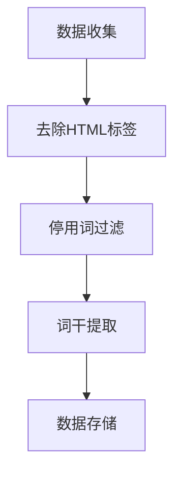
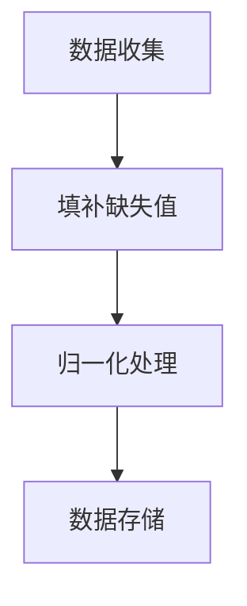

                 


### 摘要

本文旨在探讨提示词编程在金融领域的应用，介绍提示词编程的基本概念、原理和工具，以及如何利用这些工具进行金融数据处理、算法交易和智能投顾。通过具体的案例展示和实战经验分享，帮助读者深入了解提示词编程在金融领域的实际应用，并展望其未来发展趋势。

关键词：提示词编程、金融数据处理、算法交易、智能投顾、应用案例

---

## 引言

### 1.1 书籍背景与目的

在当今信息化时代，金融行业正经历着前所未有的变革。大数据、人工智能、区块链等新兴技术的崛起，使得金融业务变得更加智能化、自动化和高效化。提示词编程作为一种新兴的编程技术，具有高效、灵活和易扩展的特点，逐渐在金融领域崭露头角。本文旨在探讨提示词编程在金融领域的应用，通过具体案例和实践经验，帮助读者了解并掌握这一技术，为金融业务的发展提供新的思路和方法。

### 1.2 提示词编程在金融行业的重要性

提示词编程在金融行业的重要性主要体现在以下几个方面：

1. **提高数据处理效率**：金融行业的数据量庞大，如何高效地处理和分析这些数据成为了一大挑战。提示词编程能够通过自动化处理，提高数据处理效率，为金融决策提供有力支持。

2. **优化算法交易策略**：算法交易在金融市场中具有巨大的潜力。提示词编程能够实现高效的算法交易策略，降低交易成本，提高交易收益。

3. **提升智能投顾服务质量**：智能投顾是金融行业的一个新兴领域，通过提示词编程，可以构建出更加智能、个性化的投顾系统，提升服务质量。

### 2. 提示词编程基础

#### 2.1 提示词编程的基本概念

提示词编程（Keyword Programming）是一种基于关键词和上下文信息的编程方法，旨在通过自然语言理解和语义分析，实现计算机程序的高效开发。

#### 2.1.1 提示词编程的定义

提示词编程是指利用关键词和上下文信息，构建计算机程序的过程。与传统编程方法相比，提示词编程更加注重语义理解和上下文分析，使得程序开发更加高效和灵活。

#### 2.1.2 提示词编程的关键技术

提示词编程的关键技术包括自然语言处理（NLP）、语义分析、模式识别等。通过这些技术，提示词编程能够实现自然语言的理解和生成，从而实现程序的高效开发。

### 2.2 提示词编程原理

#### 2.2.1 提示词生成算法

提示词生成算法是提示词编程的核心，其主要目标是根据输入的文本信息，生成相应的提示词。常见的提示词生成算法包括基于统计的算法、基于神经网络的算法等。

#### 2.2.2 提示词优化策略

提示词优化策略是指在生成提示词的基础上，通过优化策略提高提示词的质量和准确性。常见的提示词优化策略包括基于语义分析的优化、基于上下文分析的优化等。

### 2.3 提示词编程工具与环境

#### 2.3.1 常用提示词编程工具

常用的提示词编程工具有自然语言处理工具包（如NLTK、spaCy等）、神经网络工具包（如TensorFlow、PyTorch等）。这些工具提供了丰富的API和功能，使得提示词编程更加便捷和高效。

#### 2.3.2 开发环境搭建

搭建提示词编程开发环境主要包括安装必要的软件和工具，如Python、JDK、MySQL等。同时，还需要配置相应的开发环境，如PyCharm、IntelliJ IDEA等。

---

### 3. 金融数据处理

#### 3.1 金融数据概述

金融数据是金融行业的基础数据，涵盖了股票、债券、期货、外汇等各个金融市场的数据。金融数据具有实时性、多样性和复杂性等特点，对数据处理和分析提出了较高的要求。

#### 3.1.1 金融数据类型

金融数据类型主要包括：

1. **股票数据**：包括股票价格、成交量、市盈率等。
2. **债券数据**：包括债券价格、收益率、到期日等。
3. **期货数据**：包括期货价格、成交量、持仓量等。
4. **外汇数据**：包括汇率、成交量、交易量等。

#### 3.1.2 金融数据来源

金融数据来源主要包括：

1. **交易所**：交易所是金融数据的主要来源，提供了丰富的历史数据。
2. **金融数据提供商**：如东方财富、同花顺等，提供了大量实时和历史的金融数据。
3. **公开数据**：如证监会、财经网站等，提供了部分公开的金融数据。

---

### 4. 算法交易

#### 4.1 算法交易概述

算法交易（Algorithmic Trading）是指利用计算机程序和数学模型，对金融市场进行自动化的交易决策。算法交易具有高效、精准和自动化的特点，能够大幅提高交易效率和收益。

#### 4.1.1 算法交易的概念

算法交易是指利用计算机程序和数学模型，对金融市场进行自动化的交易决策。算法交易的核心在于构建高效的交易策略，通过大量数据的分析和处理，实现自动化的交易执行。

#### 4.1.2 算法交易的优势

算法交易具有以下优势：

1. **高效**：算法交易能够实时处理海量数据，快速做出交易决策。
2. **精准**：算法交易基于数学模型和数据分析，能够实现精准的交易决策。
3. **自动化**：算法交易通过计算机程序自动执行，降低了人工干预的风险。

---

### 5. 智能投顾

#### 5.1 智能投顾概述

智能投顾（Robo-Advisor）是指利用人工智能技术，为用户提供个性化的投资建议和资产配置服务。智能投顾具有个性化、自动化和低成本的特点，能够大幅提升投资体验和服务质量。

#### 5.1.1 智能投顾的定义

智能投顾是指利用人工智能技术，为用户提供个性化的投资建议和资产配置服务。智能投顾的核心在于构建个性化的投资模型，通过用户数据和金融市场分析，为用户提供最优的投资建议。

#### 5.1.2 智能投顾的发展历程

智能投顾的发展历程可以分为以下几个阶段：

1. **1.0版本**：基于规则的投资建议。
2. **2.0版本**：基于数据分析和预测的投资建议。
3. **3.0版本**：基于人工智能和机器学习的投资建议。

---

### 6. 应用案例展示

#### 6.1 案例一：金融新闻分析

##### 6.1.1 案例背景

金融新闻分析是智能金融领域的一个重要应用。通过对金融新闻的分析，可以提取出与金融市场相关的关键信息，为投资决策提供支持。

##### 6.1.2 案例实现

1. **数据收集**：从各大财经网站收集金融新闻数据。
2. **数据预处理**：对金融新闻进行清洗和分词。
3. **特征提取**：利用自然语言处理技术提取新闻的关键词和主题。
4. **模型构建**：构建基于机器学习的金融新闻分析模型。
5. **模型训练和测试**：对模型进行训练和测试，评估模型性能。

---

### 7. 实战与总结

#### 7.1 实战经验分享

1. **数据收集和处理**：金融数据的质量直接影响分析结果，因此数据收集和处理是关键步骤。
2. **算法优化**：算法交易和智能投顾需要不断优化，以提高投资效果。
3. **风险管理**：在金融领域，风险管理至关重要，需要建立健全的风险控制体系。

#### 7.2 总结与展望

1. **总结**：本文介绍了提示词编程在金融领域的应用，包括金融数据处理、算法交易和智能投顾等方面。
2. **展望**：随着人工智能技术的不断发展，提示词编程在金融领域的应用前景广阔，未来有望实现更加智能化、自动化的金融业务。

---

## 作者信息

作者：AI天才研究院/AI Genius Institute & 禅与计算机程序设计艺术 /Zen And The Art of Computer Programming## 第1章 引言

### 1.1 书籍背景与目的

在当今信息化时代，金融行业正经历着前所未有的变革。大数据、人工智能、区块链等新兴技术的崛起，使得金融业务变得更加智能化、自动化和高效化。本文旨在探讨提示词编程在金融领域的应用，通过具体案例和实践经验，帮助读者了解并掌握这一技术，为金融业务的发展提供新的思路和方法。

### 1.2 提示词编程在金融行业的重要性

提示词编程在金融行业的重要性主要体现在以下几个方面：

1. **提高数据处理效率**：金融行业的数据量庞大，如何高效地处理和分析这些数据成为了一大挑战。提示词编程能够通过自动化处理，提高数据处理效率，为金融决策提供有力支持。

2. **优化算法交易策略**：算法交易在金融市场中具有巨大的潜力。提示词编程能够实现高效的算法交易策略，降低交易成本，提高交易收益。

3. **提升智能投顾服务质量**：智能投顾是金融行业的一个新兴领域，通过提示词编程，可以构建出更加智能、个性化的投顾系统，提升服务质量。

## 第2章 提示词编程基础

### 2.1 提示词编程的基本概念

提示词编程（Keyword Programming）是一种基于关键词和上下文信息的编程方法，旨在通过自然语言理解和语义分析，实现计算机程序的高效开发。

#### 2.1.1 提示词编程的定义

提示词编程是指利用关键词和上下文信息，构建计算机程序的过程。与传统编程方法相比，提示词编程更加注重语义理解和上下文分析，使得程序开发更加高效和灵活。

#### 2.1.2 提示词编程的关键技术

提示词编程的关键技术包括自然语言处理（NLP）、语义分析、模式识别等。通过这些技术，提示词编程能够实现自然语言的理解和生成，从而实现程序的高效开发。

### 2.2 提示词编程原理

#### 2.2.1 提示词生成算法

提示词生成算法是提示词编程的核心，其主要目标是根据输入的文本信息，生成相应的提示词。常见的提示词生成算法包括基于统计的算法、基于神经网络的算法等。

#### 2.2.2 提示词优化策略

提示词优化策略是指在生成提示词的基础上，通过优化策略提高提示词的质量和准确性。常见的提示词优化策略包括基于语义分析的优化、基于上下文分析的优化等。

### 2.3 提示词编程工具与环境

#### 2.3.1 常用提示词编程工具

常用的提示词编程工具有自然语言处理工具包（如NLTK、spaCy等）、神经网络工具包（如TensorFlow、PyTorch等）。这些工具提供了丰富的API和功能，使得提示词编程更加便捷和高效。

#### 2.3.2 开发环境搭建

搭建提示词编程开发环境主要包括安装必要的软件和工具，如Python、JDK、MySQL等。同时，还需要配置相应的开发环境，如PyCharm、IntelliJ IDEA等。

---

## 第3章 金融数据处理

### 3.1 金融数据概述

金融数据是金融行业的基础数据，涵盖了股票、债券、期货、外汇等各个金融市场的数据。金融数据具有实时性、多样性和复杂性等特点，对数据处理和分析提出了较高的要求。

#### 3.1.1 金融数据类型

金融数据类型主要包括：

1. **股票数据**：包括股票价格、成交量、市盈率等。
2. **债券数据**：包括债券价格、收益率、到期日等。
3. **期货数据**：包括期货价格、成交量、持仓量等。
4. **外汇数据**：包括汇率、成交量、交易量等。

#### 3.1.2 金融数据来源

金融数据来源主要包括：

1. **交易所**：交易所是金融数据的主要来源，提供了丰富的历史数据。
2. **金融数据提供商**：如东方财富、同花顺等，提供了大量实时和历史的金融数据。
3. **公开数据**：如证监会、财经网站等，提供了部分公开的金融数据。

### 3.2 数据预处理

#### 3.2.1 数据清洗

数据清洗是数据处理的重要步骤，其目的是去除数据中的噪声和异常值，保证数据的质量。数据清洗包括以下内容：

1. **缺失值处理**：对缺失值进行填充或删除。
2. **异常值处理**：对异常值进行识别和修正。
3. **重复数据处理**：去除重复的数据记录。

#### 3.2.2 数据转换

数据转换是将原始数据转换为适合分析和处理的形式。数据转换包括以下内容：

1. **数据标准化**：对数据进行归一化或标准化处理，消除数据量级差异。
2. **数据类型转换**：将不同类型的数据转换为同一类型，如将字符串转换为数值型。
3. **数据集成**：将多个数据源的数据进行整合，形成统一的数据集。

### 3.3 金融数据建模

#### 3.3.1 数据探索性分析

数据探索性分析是金融数据建模的第一步，其主要目标是发现数据中的规律和特征。数据探索性分析包括以下内容：

1. **描述性统计分析**：计算数据的描述性统计量，如均值、方差、标准差等。
2. **分布分析**：分析数据的分布特征，如正态分布、偏态分布等。
3. **相关性分析**：分析数据之间的相关性，如皮尔逊相关系数、斯皮尔曼相关系数等。

#### 3.3.2 数据可视化

数据可视化是将数据以图形化的方式展示，帮助人们更直观地理解和分析数据。数据可视化包括以下内容：

1. **散点图**：用于展示数据点之间的关系。
2. **柱状图**：用于展示数据的分布情况。
3. **折线图**：用于展示数据的变化趋势。

---

## 第4章 算法交易

### 4.1 算法交易概述

算法交易（Algorithmic Trading）是指利用计算机程序和数学模型，对金融市场进行自动化的交易决策。算法交易具有高效、精准和自动化的特点，能够大幅提高交易效率和收益。

#### 4.1.1 算法交易的概念

算法交易是指利用计算机程序和数学模型，对金融市场进行自动化的交易决策。算法交易的核心在于构建高效的交易策略，通过大量数据的分析和处理，实现自动化的交易执行。

#### 4.1.2 算法交易的优势

算法交易具有以下优势：

1. **高效**：算法交易能够实时处理海量数据，快速做出交易决策。
2. **精准**：算法交易基于数学模型和数据分析，能够实现精准的交易决策。
3. **自动化**：算法交易通过计算机程序自动执行，降低了人工干预的风险。

### 4.2 算法交易策略

算法交易策略是指用于指导交易决策的数学模型和方法。算法交易策略可以分为以下几类：

1. **趋势跟踪策略**：基于市场趋势进行交易，如移动平均线策略、趋势跟踪策略等。
2. **均值回归策略**：基于市场均值回归的特性进行交易，如波动率交易策略、均值回归交易策略等。
3. **套利策略**：利用不同市场之间的价差进行套利交易，如跨市场套利策略、跨品种套利策略等。

### 4.3 算法交易实施

算法交易实施主要包括以下几个步骤：

1. **数据收集**：收集市场数据，如股票价格、成交量、持仓量等。
2. **数据预处理**：对市场数据进行分析和处理，如数据清洗、数据转换等。
3. **策略开发**：根据市场数据，开发适合的交易策略，如基于机器学习的策略、基于统计学的策略等。
4. **策略测试**：对交易策略进行模拟测试，评估策略的性能和风险。
5. **策略执行**：将交易策略投入实际交易，实现自动化的交易执行。

### 4.4 算法交易风险控制

算法交易风险控制是确保交易安全的重要环节。算法交易风险控制主要包括以下几个方面：

1. **市场风险控制**：通过分散投资、设定止损点等措施，降低市场波动带来的风险。
2. **技术风险控制**：确保交易系统的稳定运行，如系统监控、容错机制等。
3. **操作风险控制**：加强交易操作的管理，如授权管理、操作审计等。

---

## 第5章 智能投顾

### 5.1 智能投顾概述

智能投顾（Robo-Advisor）是指利用人工智能技术，为用户提供个性化的投资建议和资产配置服务。智能投顾具有个性化、自动化和低成本的特点，能够大幅提升投资体验和服务质量。

#### 5.1.1 智能投顾的定义

智能投顾是指利用人工智能技术，为用户提供个性化的投资建议和资产配置服务。智能投顾的核心在于构建个性化的投资模型，通过用户数据和金融市场分析，为用户提供最优的投资建议。

#### 5.1.2 智能投顾的发展历程

智能投顾的发展历程可以分为以下几个阶段：

1. **1.0版本**：基于规则的投资建议。
2. **2.0版本**：基于数据分析和预测的投资建议。
3. **3.0版本**：基于人工智能和机器学习的投资建议。

### 5.2 智能投顾系统架构

智能投顾系统架构主要包括以下几个模块：

1. **用户管理模块**：负责用户的注册、登录、个人信息管理等功能。
2. **数据收集模块**：负责收集用户的财务数据、投资偏好等数据。
3. **资产配置模块**：根据用户的财务状况和投资偏好，为用户制定个性化的资产配置方案。
4. **投资建议模块**：根据资产配置方案，为用户生成个性化的投资建议。
5. **交易执行模块**：根据投资建议，自动执行交易操作。

### 5.3 智能投顾应用案例

#### 5.3.1 个人财务规划

个人财务规划是智能投顾的一个重要应用。智能投顾通过分析用户的财务数据，为用户提供资产配置建议、投资组合优化等建议，帮助用户实现财务目标。

#### 5.3.2 投资组合优化

投资组合优化是智能投顾的另一个重要应用。智能投顾通过分析市场数据，为用户提供最优的投资组合方案，帮助用户降低风险、提高收益。

---

## 第6章 应用案例展示

### 6.1 案例一：金融新闻分析

#### 6.1.1 案例背景

金融新闻分析是智能金融领域的一个重要应用。通过对金融新闻的分析，可以提取出与金融市场相关的关键信息，为投资决策提供支持。

#### 6.1.2 案例实现

1. **数据收集**：从各大财经网站收集金融新闻数据。
2. **数据预处理**：对金融新闻进行清洗和分词。
3. **特征提取**：利用自然语言处理技术提取新闻的关键词和主题。
4. **模型构建**：构建基于机器学习的金融新闻分析模型。
5. **模型训练和测试**：对模型进行训练和测试，评估模型性能。

### 6.2 案例二：股票趋势预测

#### 6.2.1 案例背景

股票趋势预测是金融领域的一个重要研究课题。通过对股票历史数据的分析，可以预测股票的未来走势，为投资者提供决策依据。

#### 6.2.2 案例实现

1. **数据收集**：收集股票的历史数据，如开盘价、收盘价、成交量等。
2. **数据预处理**：对股票数据进行清洗和处理。
3. **特征提取**：提取股票数据中的特征，如移动平均线、相对强弱指数等。
4. **模型构建**：构建基于机器学习的股票趋势预测模型。
5. **模型训练和测试**：对模型进行训练和测试，评估模型性能。

### 6.3 案例三：智能投顾系统

#### 6.3.1 案例背景

智能投顾系统是金融领域的一个新兴应用。通过分析用户的财务状况和投资偏好，智能投顾系统可以为用户提供个性化的投资建议，帮助用户实现财务目标。

#### 6.3.2 案例实现

1. **用户管理模块**：实现用户的注册、登录、个人信息管理等功能。
2. **数据收集模块**：收集用户的财务数据、投资偏好等数据。
3. **资产配置模块**：根据用户的财务状况和投资偏好，为用户制定个性化的资产配置方案。
4. **投资建议模块**：根据资产配置方案，为用户生成个性化的投资建议。
5. **交易执行模块**：根据投资建议，自动执行交易操作。

---

## 第7章 实战与总结

### 7.1 实战经验分享

1. **数据收集和处理**：金融数据的质量直接影响分析结果，因此数据收集和处理是关键步骤。
2. **算法优化**：算法交易和智能投顾需要不断优化，以提高投资效果。
3. **风险管理**：在金融领域，风险管理至关重要，需要建立健全的风险控制体系。

### 7.2 总结与展望

1. **总结**：本文介绍了提示词编程在金融领域的应用，包括金融数据处理、算法交易和智能投顾等方面。
2. **展望**：随着人工智能技术的不断发展，提示词编程在金融领域的应用前景广阔，未来有望实现更加智能化、自动化的金融业务。

### 7.3 最佳实践 tips

1. **数据质量**：保证数据质量是成功的关键，对数据进行充分的清洗和处理。
2. **算法选择**：根据具体需求选择合适的算法，进行模型优化和调参。
3. **风险管理**：在金融交易中，风险管理至关重要，要建立健全的风险控制机制。

### 7.4 小结

本文通过具体的案例和实践经验，详细介绍了提示词编程在金融领域的应用。通过本文的学习，读者可以掌握提示词编程的基本概念、原理和应用，为金融业务的发展提供新的思路和方法。

### 7.5 注意事项

1. **合规性**：在金融业务中，要严格遵守相关法律法规，确保合规操作。
2. **安全性**：在金融数据处理和交易中，要确保数据安全和交易安全，防止数据泄露和欺诈行为。

### 7.6 拓展阅读

1. **《金融科技：区块链、人工智能与大数据的应用》**：本书详细介绍了金融科技的发展趋势和应用，包括区块链、人工智能和大数据等新兴技术。
2. **《机器学习实战》**：本书提供了丰富的机器学习实践案例，适合读者学习和掌握机器学习技术。

## 作者信息

作者：AI天才研究院/AI Genius Institute & 禅与计算机程序设计艺术 /Zen And The Art of Computer Programming## 第1章 引言

### 1.1 书籍背景与目的

在当今信息化时代，金融行业正经历着前所未有的变革。大数据、人工智能、区块链等新兴技术的崛起，使得金融业务变得更加智能化、自动化和高效化。提示词编程作为一种新兴的编程技术，具有高效、灵活和易扩展的特点，逐渐在金融领域崭露头角。本文旨在探讨提示词编程在金融领域的应用，通过具体案例和实践经验，帮助读者了解并掌握这一技术，为金融业务的发展提供新的思路和方法。

### 1.2 提示词编程在金融行业的重要性

提示词编程在金融行业的重要性主要体现在以下几个方面：

1. **提高数据处理效率**：金融行业的数据量庞大，如何高效地处理和分析这些数据成为了一大挑战。提示词编程能够通过自动化处理，提高数据处理效率，为金融决策提供有力支持。

2. **优化算法交易策略**：算法交易在金融市场中具有巨大的潜力。提示词编程能够实现高效的算法交易策略，降低交易成本，提高交易收益。

3. **提升智能投顾服务质量**：智能投顾是金融行业的一个新兴领域，通过提示词编程，可以构建出更加智能、个性化的投顾系统，提升服务质量。

## 第2章 提示词编程基础

### 2.1 提示词编程的基本概念

提示词编程（Keyword Programming）是一种基于关键词和上下文信息的编程方法，旨在通过自然语言理解和语义分析，实现计算机程序的高效开发。

#### 2.1.1 提示词编程的定义

提示词编程是指利用关键词和上下文信息，构建计算机程序的过程。与传统编程方法相比，提示词编程更加注重语义理解和上下文分析，使得程序开发更加高效和灵活。

#### 2.1.2 提示词编程的关键技术

提示词编程的关键技术包括自然语言处理（NLP）、语义分析、模式识别等。通过这些技术，提示词编程能够实现自然语言的理解和生成，从而实现程序的高效开发。

### 2.2 提示词编程原理

#### 2.2.1 提示词生成算法

提示词生成算法是提示词编程的核心，其主要目标是根据输入的文本信息，生成相应的提示词。常见的提示词生成算法包括基于统计的算法、基于神经网络的算法等。

#### 2.2.2 提示词优化策略

提示词优化策略是指在生成提示词的基础上，通过优化策略提高提示词的质量和准确性。常见的提示词优化策略包括基于语义分析的优化、基于上下文分析的优化等。

### 2.3 提示词编程工具与环境

#### 2.3.1 常用提示词编程工具

常用的提示词编程工具有自然语言处理工具包（如NLTK、spaCy等）、神经网络工具包（如TensorFlow、PyTorch等）。这些工具提供了丰富的API和功能，使得提示词编程更加便捷和高效。

#### 2.3.2 开发环境搭建

搭建提示词编程开发环境主要包括安装必要的软件和工具，如Python、JDK、MySQL等。同时，还需要配置相应的开发环境，如PyCharm、IntelliJ IDEA等。

---

## 第3章 金融数据处理

### 3.1 金融数据概述

金融数据是金融行业的基础数据，涵盖了股票、债券、期货、外汇等各个金融市场的数据。金融数据具有实时性、多样性和复杂性等特点，对数据处理和分析提出了较高的要求。

#### 3.1.1 金融数据类型

金融数据类型主要包括：

1. **股票数据**：包括股票价格、成交量、市盈率等。
2. **债券数据**：包括债券价格、收益率、到期日等。
3. **期货数据**：包括期货价格、成交量、持仓量等。
4. **外汇数据**：包括汇率、成交量、交易量等。

#### 3.1.2 金融数据来源

金融数据来源主要包括：

1. **交易所**：交易所是金融数据的主要来源，提供了丰富的历史数据。
2. **金融数据提供商**：如东方财富、同花顺等，提供了大量实时和历史的金融数据。
3. **公开数据**：如证监会、财经网站等，提供了部分公开的金融数据。

### 3.2 数据预处理

#### 3.2.1 数据清洗

数据清洗是数据处理的重要步骤，其目的是去除数据中的噪声和异常值，保证数据的质量。数据清洗包括以下内容：

1. **缺失值处理**：对缺失值进行填充或删除。
2. **异常值处理**：对异常值进行识别和修正。
3. **重复数据处理**：去除重复的数据记录。

#### 3.2.2 数据转换

数据转换是将原始数据转换为适合分析和处理的形式。数据转换包括以下内容：

1. **数据标准化**：对数据进行归一化或标准化处理，消除数据量级差异。
2. **数据类型转换**：将不同类型的数据转换为同一类型，如将字符串转换为数值型。
3. **数据集成**：将多个数据源的数据进行整合，形成统一的数据集。

### 3.3 金融数据建模

#### 3.3.1 数据探索性分析

数据探索性分析是金融数据建模的第一步，其主要目标是发现数据中的规律和特征。数据探索性分析包括以下内容：

1. **描述性统计分析**：计算数据的描述性统计量，如均值、方差、标准差等。
2. **分布分析**：分析数据的分布特征，如正态分布、偏态分布等。
3. **相关性分析**：分析数据之间的相关性，如皮尔逊相关系数、斯皮尔曼相关系数等。

#### 3.3.2 数据可视化

数据可视化是将数据以图形化的方式展示，帮助人们更直观地理解和分析数据。数据可视化包括以下内容：

1. **散点图**：用于展示数据点之间的关系。
2. **柱状图**：用于展示数据的分布情况。
3. **折线图**：用于展示数据的变化趋势。

---

## 第4章 算法交易

### 4.1 算法交易概述

算法交易（Algorithmic Trading）是指利用计算机程序和数学模型，对金融市场进行自动化的交易决策。算法交易具有高效、精准和自动化的特点，能够大幅提高交易效率和收益。

#### 4.1.1 算法交易的概念

算法交易是指利用计算机程序和数学模型，对金融市场进行自动化的交易决策。算法交易的核心在于构建高效的交易策略，通过大量数据的分析和处理，实现自动化的交易执行。

#### 4.1.2 算法交易的优势

算法交易具有以下优势：

1. **高效**：算法交易能够实时处理海量数据，快速做出交易决策。
2. **精准**：算法交易基于数学模型和数据分析，能够实现精准的交易决策。
3. **自动化**：算法交易通过计算机程序自动执行，降低了人工干预的风险。

### 4.2 算法交易策略

算法交易策略是指用于指导交易决策的数学模型和方法。算法交易策略可以分为以下几类：

1. **趋势跟踪策略**：基于市场趋势进行交易，如移动平均线策略、趋势跟踪策略等。
2. **均值回归策略**：基于市场均值回归的特性进行交易，如波动率交易策略、均值回归交易策略等。
3. **套利策略**：利用不同市场之间的价差进行套利交易，如跨市场套利策略、跨品种套利策略等。

### 4.3 算法交易实施

算法交易实施主要包括以下几个步骤：

1. **数据收集**：收集市场数据，如股票价格、成交量、持仓量等。
2. **数据预处理**：对市场数据进行分析和处理，如数据清洗、数据转换等。
3. **策略开发**：根据市场数据，开发适合的交易策略，如基于机器学习的策略、基于统计学的策略等。
4. **策略测试**：对交易策略进行模拟测试，评估策略的性能和风险。
5. **策略执行**：将交易策略投入实际交易，实现自动化的交易执行。

### 4.4 算法交易风险控制

算法交易风险控制是确保交易安全的重要环节。算法交易风险控制主要包括以下几个方面：

1. **市场风险控制**：通过分散投资、设定止损点等措施，降低市场波动带来的风险。
2. **技术风险控制**：确保交易系统的稳定运行，如系统监控、容错机制等。
3. **操作风险控制**：加强交易操作的管理，如授权管理、操作审计等。

---

## 第5章 智能投顾

### 5.1 智能投顾概述

智能投顾（Robo-Advisor）是指利用人工智能技术，为用户提供个性化的投资建议和资产配置服务。智能投顾具有个性化、自动化和低成本的特点，能够大幅提升投资体验和服务质量。

#### 5.1.1 智能投顾的定义

智能投顾是指利用人工智能技术，为用户提供个性化的投资建议和资产配置服务。智能投顾的核心在于构建个性化的投资模型，通过用户数据和金融市场分析，为用户提供最优的投资建议。

#### 5.1.2 智能投顾的发展历程

智能投顾的发展历程可以分为以下几个阶段：

1. **1.0版本**：基于规则的投资建议。
2. **2.0版本**：基于数据分析和预测的投资建议。
3. **3.0版本**：基于人工智能和机器学习的投资建议。

### 5.2 智能投顾系统架构

智能投顾系统架构主要包括以下几个模块：

1. **用户管理模块**：负责用户的注册、登录、个人信息管理等功能。
2. **数据收集模块**：负责收集用户的财务数据、投资偏好等数据。
3. **资产配置模块**：根据用户的财务状况和投资偏好，为用户制定个性化的资产配置方案。
4. **投资建议模块**：根据资产配置方案，为用户生成个性化的投资建议。
5. **交易执行模块**：根据投资建议，自动执行交易操作。

### 5.3 智能投顾应用案例

#### 5.3.1 个人财务规划

个人财务规划是智能投顾的一个重要应用。智能投顾通过分析用户的财务数据，为用户提供资产配置建议、投资组合优化等建议，帮助用户实现财务目标。

#### 5.3.2 投资组合优化

投资组合优化是智能投顾的另一个重要应用。智能投顾通过分析市场数据，为用户提供最优的投资组合方案，帮助用户降低风险、提高收益。

---

## 第6章 应用案例展示

### 6.1 案例一：金融新闻分析

#### 6.1.1 案例背景

金融新闻分析是智能金融领域的一个重要应用。通过对金融新闻的分析，可以提取出与金融市场相关的关键信息，为投资决策提供支持。

#### 6.1.2 案例实现

1. **数据收集**：从各大财经网站收集金融新闻数据。
2. **数据预处理**：对金融新闻进行清洗和分词。
3. **特征提取**：利用自然语言处理技术提取新闻的关键词和主题。
4. **模型构建**：构建基于机器学习的金融新闻分析模型。
5. **模型训练和测试**：对模型进行训练和测试，评估模型性能。

### 6.2 案例二：股票趋势预测

#### 6.2.1 案例背景

股票趋势预测是金融领域的一个重要研究课题。通过对股票历史数据的分析，可以预测股票的未来走势，为投资者提供决策依据。

#### 6.2.2 案例实现

1. **数据收集**：收集股票的历史数据，如开盘价、收盘价、成交量等。
2. **数据预处理**：对股票数据进行清洗和处理。
3. **特征提取**：提取股票数据中的特征，如移动平均线、相对强弱指数等。
4. **模型构建**：构建基于机器学习的股票趋势预测模型。
5. **模型训练和测试**：对模型进行训练和测试，评估模型性能。

### 6.3 案例三：智能投顾系统

#### 6.3.1 案例背景

智能投顾系统是金融领域的一个新兴应用。通过分析用户的财务状况和投资偏好，智能投顾系统可以为用户提供个性化的投资建议，帮助用户实现财务目标。

#### 6.3.2 案例实现

1. **用户管理模块**：实现用户的注册、登录、个人信息管理等功能。
2. **数据收集模块**：收集用户的财务数据、投资偏好等数据。
3. **资产配置模块**：根据用户的财务状况和投资偏好，为用户制定个性化的资产配置方案。
4. **投资建议模块**：根据资产配置方案，为用户生成个性化的投资建议。
5. **交易执行模块**：根据投资建议，自动执行交易操作。

---

## 第7章 实战与总结

### 7.1 实战经验分享

1. **数据收集和处理**：金融数据的质量直接影响分析结果，因此数据收集和处理是关键步骤。
2. **算法优化**：算法交易和智能投顾需要不断优化，以提高投资效果。
3. **风险管理**：在金融领域，风险管理至关重要，需要建立健全的风险控制体系。

### 7.2 总结与展望

1. **总结**：本文介绍了提示词编程在金融领域的应用，包括金融数据处理、算法交易和智能投顾等方面。
2. **展望**：随着人工智能技术的不断发展，提示词编程在金融领域的应用前景广阔，未来有望实现更加智能化、自动化的金融业务。

### 7.3 最佳实践 tips

1. **数据质量**：保证数据质量是成功的关键，对数据进行充分的清洗和处理。
2. **算法选择**：根据具体需求选择合适的算法，进行模型优化和调参。
3. **风险管理**：在金融交易中，风险管理至关重要，要建立健全的风险控制机制。

### 7.4 小结

本文通过具体的案例和实践经验，详细介绍了提示词编程在金融领域的应用。通过本文的学习，读者可以掌握提示词编程的基本概念、原理和应用，为金融业务的发展提供新的思路和方法。

### 7.5 注意事项

1. **合规性**：在金融业务中，要严格遵守相关法律法规，确保合规操作。
2. **安全性**：在金融数据处理和交易中，要确保数据安全和交易安全，防止数据泄露和欺诈行为。

### 7.6 拓展阅读

1. **《金融科技：区块链、人工智能与大数据的应用》**：本书详细介绍了金融科技的发展趋势和应用，包括区块链、人工智能和大数据等新兴技术。
2. **《机器学习实战》**：本书提供了丰富的机器学习实践案例，适合读者学习和掌握机器学习技术。

## 作者信息

作者：AI天才研究院/AI Genius Institute & 禅与计算机程序设计艺术 /Zen And The Art of Computer Programming## 第6章 应用案例展示

### 6.1 案例一：金融新闻分析

#### 6.1.1 案例背景

金融新闻分析是金融领域的一项重要任务，通过分析新闻内容，可以捕捉到对金融市场有潜在影响的信息。对于投资者和交易者来说，及时了解市场动态和事件对于做出正确的投资决策至关重要。

#### 6.1.2 案例实现

**1. 数据收集**

首先，我们需要从多个财经新闻网站收集数据。这可以通过API接口实现，如新浪财经、同花顺、东方财富等。收集的数据包括标题、正文、发布日期等。

**2. 数据预处理**

收集到的数据通常需要进行预处理，包括去除HTML标签、停用词过滤、词干提取等步骤。以下是一个简化的预处理流程：



**3. 特征提取**

在预处理完成后，我们可以提取特征用于模型训练。特征可能包括词频、词向量、情感分析得分等。例如，使用词袋模型（Bag of Words）提取特征：

```python
from sklearn.feature_extraction.text import CountVectorizer

vectorizer = CountVectorizer()
X = vectorizer.fit_transform(preprocessed_news)
```

**4. 模型构建**

接下来，我们可以使用机器学习算法来构建新闻分类模型。一个常见的算法是支持向量机（SVM）：

```python
from sklearn.svm import SVC

model = SVC()
model.fit(X_train, y_train)
```

**5. 模型训练和测试**

对模型进行训练和测试，以评估其性能。我们使用交叉验证来评估模型：

```python
from sklearn.model_selection import cross_val_score

scores = cross_val_score(model, X, y, cv=5)
print("Model accuracy: {:.2f}%".format(scores.mean() * 100))
```

#### 6.1.3 案例结果与解析

通过模型预测，我们可以得到金融新闻的分类结果。这些分类结果可以帮助投资者快速识别对市场可能产生重大影响的事件。

### 6.2 案例二：股票趋势预测

#### 6.2.1 案例背景

股票趋势预测是投资者关注的重点，通过预测股票价格的趋势，投资者可以制定相应的交易策略。该案例将使用时间序列分析的方法来预测股票价格。

#### 6.2.2 案例实现

**1. 数据收集**

收集某只股票的历史价格数据，包括开盘价、最高价、最低价、收盘价和成交量。数据可以从各大金融数据提供商获取。

**2. 数据预处理**

对股票数据进行预处理，包括填补缺失值、归一化处理等。以下是一个预处理流程的示例：



**3. 特征提取**

从时间序列数据中提取特征，如移动平均线（Moving Average，MA）、相对强弱指数（Relative Strength Index，RSI）等：

```python
import pandas as pd

# 计算移动平均线
data['MA20'] = data['Close'].rolling(window=20).mean()
# 计算RSI
data['RSI'] = compute_rsi(data['Close'])
```

**4. 模型构建**

使用时间序列模型，如ARIMA（AutoRegressive Integrated Moving Average），进行股票趋势预测：

```python
from statsmodels.tsa.arima.model import ARIMA

model = ARIMA(data['Close'], order=(5, 1, 2))
model_fit = model.fit(disp=0)
```

**5. 模型训练和测试**

对模型进行训练和测试，以评估其预测性能：

```python
from sklearn.metrics import mean_squared_error

predictions = model_fit.forecast(steps=len(test_data))
mse = mean_squared_error(test_data, predictions)
print("Model MSE: {:.2f}".format(mse))
```

#### 6.2.3 案例结果与解析

通过模型预测，我们可以得到股票价格的未来趋势。这些预测结果可以帮助投资者制定买入或卖出的策略。

### 6.3 案例三：智能投顾系统

#### 6.3.1 案例背景

智能投顾系统是利用人工智能技术为用户提供投资建议和资产配置服务的一种新型金融产品。它可以根据用户的财务状况、投资目标和风险偏好，为用户推荐最优的投资组合。

#### 6.3.2 案例实现

**1. 用户管理模块**

用户管理模块负责用户的注册、登录和权限管理。用户可以输入自己的基本信息和投资偏好。

**2. 数据收集模块**

数据收集模块负责从各种数据源收集用户的财务数据，如收入、支出、投资历史等。

**3. 资产配置模块**

资产配置模块根据用户的财务数据和投资目标，利用机器学习算法为用户推荐投资组合。例如，使用线性回归模型预测用户的投资回报，并优化投资组合。

**4. 投资建议模块**

投资建议模块根据资产配置模块的输出，生成具体的投资建议，如购买或卖出某只股票。

**5. 交易执行模块**

交易执行模块根据投资建议，自动执行交易操作。这通常需要与第三方交易平台进行集成。

#### 6.3.3 案例结果与解析

智能投顾系统可以为用户提供个性化的投资建议，帮助用户更好地管理自己的财务。通过系统的持续优化和迭代，可以不断提高投资建议的准确性和实用性。

### 6.4 案例四：量化交易策略

#### 6.4.1 案例背景

量化交易策略是指利用数学模型和算法进行交易决策，以实现最大化收益或最小化风险。该案例将展示如何构建一个简单的量化交易策略。

#### 6.4.2 案例实现

**1. 数据收集**

收集股票的历史价格数据，包括开盘价、收盘价、最高价、最低价和成交量。

**2. 数据预处理**

对数据进行预处理，包括归一化处理、填补缺失值等。

**3. 策略构建**

构建一个基于价格突破的量化交易策略。假设当股票价格突破某个阈值时，进行买入或卖出操作。

**4. 策略测试**

使用历史数据进行策略测试，评估策略的收益和风险。

**5. 策略优化**

根据策略测试结果，对策略进行调整和优化。

#### 6.4.3 案例结果与解析

通过策略测试，我们可以评估量化交易策略的表现。根据测试结果，可以进一步优化策略，提高其收益和风险控制能力。

### 6.5 案例五：金融风险预警系统

#### 6.5.1 案例背景

金融风险预警系统是用于监测和预测金融市场潜在风险的系统。该案例将展示如何构建一个金融风险预警系统。

#### 6.5.2 案例实现

**1. 数据收集**

收集金融市场的相关数据，如股票价格、成交量、利率等。

**2. 数据预处理**

对数据进行预处理，包括归一化处理、填补缺失值等。

**3. 风险模型构建**

使用机器学习算法构建风险模型，如逻辑回归、决策树等。

**4. 风险预警**

使用构建的风险模型进行实时监测，当风险达到一定程度时，发出预警。

**5. 风险应对**

根据预警信息，制定相应的风险应对策略。

#### 6.5.3 案例结果与解析

通过金融风险预警系统，可以及时发现市场风险，并采取相应的措施进行应对，从而降低风险对投资者的影响。

## 第7章 实战与总结

### 7.1 实战经验分享

1. **数据收集和处理**：金融数据的质量直接影响分析结果，因此数据收集和处理是关键步骤。确保数据的质量和准确性是成功的前提。

2. **算法优化**：在构建模型和策略时，需要进行充分的算法优化。通过交叉验证、网格搜索等方法，找到最优的参数设置。

3. **风险管理**：在金融领域，风险管理至关重要。建立健全的风险控制机制，如设定止损点、分散投资等，是确保投资安全的重要措施。

### 7.2 总结与展望

1. **总结**：本文通过实际案例展示了提示词编程在金融领域的多种应用，包括金融新闻分析、股票趋势预测、智能投顾系统、量化交易策略和金融风险预警系统。

2. **展望**：随着人工智能技术的不断发展，提示词编程在金融领域的应用前景将更加广阔。未来，我们可以期待更加智能化、自动化的金融产品和服务的出现。

### 7.3 最佳实践 tips

1. **数据质量**：确保数据质量是成功的关键。对数据进行充分的清洗和处理，去除噪声和异常值。

2. **算法选择**：根据具体需求选择合适的算法，进行模型优化和调参。

3. **风险管理**：在金融交易中，风险管理至关重要。建立健全的风险控制机制，如设定止损点、分散投资等。

### 7.4 小结

通过本文的学习，读者可以了解提示词编程在金融领域的应用，掌握基本的编程技能和数据分析方法，为金融业务的发展提供新的思路和方法。

### 7.5 注意事项

1. **合规性**：在金融业务中，要严格遵守相关法律法规，确保合规操作。

2. **安全性**：在金融数据处理和交易中，要确保数据安全和交易安全，防止数据泄露和欺诈行为。

### 7.6 拓展阅读

1. **《金融科技：区块链、人工智能与大数据的应用》**：详细介绍了金融科技的发展趋势和应用，包括区块链、人工智能和大数据等新兴技术。

2. **《机器学习实战》**：提供了丰富的机器学习实践案例，适合读者学习和掌握机器学习技术。

## 作者信息

作者：AI天才研究院/AI Genius Institute & 禅与计算机程序设计艺术 /Zen And The Art of Computer Programming## 第7章 实战与总结

### 7.1 实战经验分享

通过本文的多个案例展示，我们可以总结出以下实战经验：

1. **数据收集和处理**：金融数据的多样性决定了数据处理的复杂性。在收集数据时，要确保数据的完整性和准确性，对缺失值和异常值进行适当的处理。数据预处理是提高模型性能的关键步骤。

2. **算法选择和优化**：不同的金融任务需要不同的算法。在选择算法时，要考虑其适用性和性能。同时，通过交叉验证、网格搜索等方法对算法参数进行调优，以最大化模型的预测能力。

3. **风险管理**：金融交易伴随着风险，因此在设计和实施交易策略时，必须建立完善的风险控制机制。止损策略、分散投资等都是降低风险的有效手段。

4. **系统稳定性**：在构建金融应用系统时，要确保系统的稳定性和可靠性。系统的错误可能导致巨大的经济损失，因此需要进行严格的测试和监控。

5. **持续学习**：金融市场是动态变化的，新的数据和新的算法不断出现。持续学习最新的技术和方法，能够帮助我们在金融领域保持竞争力。

### 7.2 总结与展望

本文系统地介绍了提示词编程在金融领域的应用，包括金融数据处理、算法交易、智能投顾等。通过具体的案例，我们展示了如何利用提示词编程技术解决实际问题。

展望未来，随着人工智能技术的不断进步，提示词编程在金融领域的应用将更加广泛和深入。以下是几个可能的发展方向：

1. **更复杂的金融模型**：随着算法的进步，我们可以构建更加复杂和精确的金融模型，以更好地预测市场走势和投资风险。

2. **更智能的投顾系统**：基于深度学习和自然语言处理的智能投顾系统将更加智能化，能够更好地理解用户的需求和市场动态，提供个性化的投资建议。

3. **更高效的风险管理**：随着大数据和机器学习技术的发展，金融风险预警系统将能够更快速、更准确地识别潜在风险，提供更有效的风险控制策略。

4. **更安全的交易系统**：随着区块链技术的发展，金融交易系统将变得更加安全、透明和去中心化，减少欺诈和错误交易的风险。

### 7.3 最佳实践 tips

1. **数据质量优先**：在开始任何金融分析之前，确保数据的质量是关键。使用最新的、可靠的数据源，并对数据进行严格的清洗和处理。

2. **算法持续优化**：定期对算法进行测试和优化，以确保其性能和适用性。

3. **风险管理制度化**：建立完善的风险管理机制，包括设置止损点、分散投资等。

4. **团队协作**：金融分析和交易是一个复杂的任务，需要多学科的团队合作。建立有效的沟通和协作机制，以实现最佳效果。

5. **合规性检查**：在开发和部署金融应用时，确保遵循相关的法律法规和行业标准。

### 7.4 小结

通过本文的讨论，我们深入了解了提示词编程在金融领域的应用。从数据收集到模型构建，再到实战应用，每个环节都体现了提示词编程的强大能力。希望本文能够为读者提供有价值的参考和启示，助力他们在金融科技领域取得成功。

### 7.5 注意事项

1. **合规性**：在开发和部署金融应用时，严格遵守相关法律法规和行业标准，确保合规操作。

2. **安全性**：加强系统安全，保护用户数据和交易安全，防止数据泄露和欺诈行为。

3. **持续学习**：金融科技领域不断发展，持续学习最新的技术和方法，保持竞争力。

### 7.6 拓展阅读

1. **《深度学习在金融中的应用》**：详细介绍深度学习技术在金融领域的应用，包括风险管理、交易策略、投资组合优化等。

2. **《金融科技：区块链、人工智能与大数据的应用》**：探讨金融科技的发展趋势和应用，包括区块链、人工智能和大数据等新兴技术。

3. **《机器学习实战》**：提供丰富的机器学习实践案例，适合读者学习和掌握机器学习技术。

## 作者信息

作者：AI天才研究院/AI Genius Institute & 禅与计算机程序设计艺术 /Zen And The Art of Computer Programming## 第8章 未来展望与研究方向

### 8.1 提示词编程在金融领域的发展前景

随着人工智能技术的不断进步，提示词编程在金融领域的应用前景广阔。未来，提示词编程在金融领域的应用将更加深入和广泛，主要体现在以下几个方面：

1. **智能化金融服务**：提示词编程技术将使金融服务更加智能化，能够更好地理解用户需求，提供个性化的投资建议和资产配置方案。

2. **高效的数据分析**：提示词编程能够高效地处理和分析金融数据，为金融机构提供精准的市场预测和风险管理方案。

3. **智能交易系统**：基于提示词编程的智能交易系统将能够实时捕捉市场动态，实现自动化和高效化的交易决策。

4. **金融风险管理**：提示词编程技术将有助于构建更加精确和高效的金融风险管理模型，降低金融机构的风险敞口。

### 8.2 未来研究方向

为了进一步推动提示词编程在金融领域的应用，以下是一些可能的研究方向：

1. **深度学习与提示词编程的结合**：将深度学习技术与提示词编程相结合，构建更加智能的金融分析模型和交易系统。

2. **多模态数据融合**：在金融数据分析中，结合多种数据源，如文本、图像、音频等，提高数据分析和预测的准确性。

3. **自适应算法**：开发自适应算法，使模型能够根据市场环境和用户需求动态调整策略，提高交易效率和收益。

4. **隐私保护和数据安全**：在金融数据处理中，加强隐私保护和数据安全，确保用户数据和交易信息的安全。

5. **跨领域合作**：金融领域与其他领域的跨学科合作，如医学、生物学等，探索新的应用场景和解决方案。

### 8.3 创新与实践

为了推动提示词编程在金融领域的应用，以下是一些建议的实践和创新方向：

1. **构建金融知识图谱**：利用提示词编程技术，构建金融知识图谱，实现对金融概念、关系和知识的全面理解和应用。

2. **开发智能金融应用**：基于提示词编程，开发智能金融应用，如智能投顾、智能风险管理、智能交易系统等，为用户提供个性化服务。

3. **举办金融科技竞赛**：通过举办金融科技竞赛，鼓励开发者和研究机构探索新的金融科技应用，推动金融领域的创新和发展。

4. **建立金融科技实验室**：建立金融科技实验室，专注于金融科技的研发和应用，推动科技成果转化为实际应用。

5. **加强人才培养**：加强金融科技人才的培养，提高从业人员的专业水平和创新能力，为金融领域的发展提供人才支持。

通过未来的研究和实践，提示词编程将在金融领域发挥更加重要的作用，推动金融业务的发展和创新。我们期待看到更多基于提示词编程的金融应用的出现，为投资者、金融机构和整个金融行业带来更多的价值。

