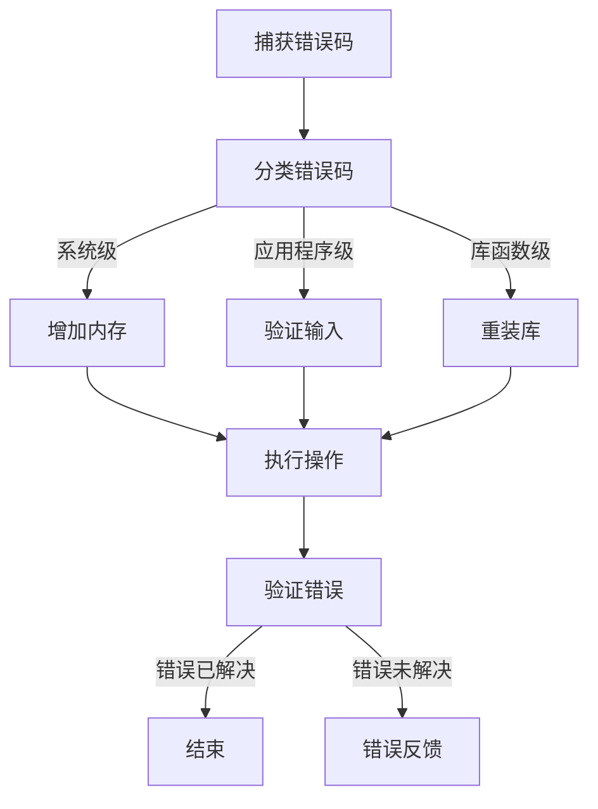

                 

### 文章标题

# 错误码的处理

### 关键词

- 错误码
- 异常处理
- 调试工具
- 系统优化
- 最佳实践

### 摘要

在计算机科学领域，错误码是理解和解决问题的重要工具。本文旨在深入探讨错误码的处理方法，包括错误码的基础知识、处理流程、调试工具、案例分析以及最佳实践。通过逐步分析，本文将帮助读者全面掌握错误码的处理技巧，提升系统稳定性和性能。

### 文章目录

1. **背景介绍**
   - 错误码的起源与重要性
   - 错误码在现代系统中的应用

2. **核心概念与联系**
   - 错误码的基本概念
   - 异常处理与错误码的关系
   - 错误码分类与编码标准

3. **核心算法原理讲解**
   - 错误码识别算法
   - 错误码分析算法
   - 错误码处理算法

4. **数学模型和公式**
   - 错误概率模型
   - 错误传播公式

5. **项目实战**
   - 开发环境搭建
   - 源代码实现与解读
   - 代码应用解读与分析
   - 实际案例分析与讲解
   - 项目小结

6. **最佳实践与技巧**
   - 错误码处理策略
   - 调试工具最佳使用方法
   - 错误码处理的注意事项

7. **小结与拓展阅读**
   - 文章总结
   - 拓展阅读建议

### 1. 背景介绍

#### 错误码的起源与重要性

错误码（Error Code）起源于计算机早期时代，当时计算机系统复杂度较低，但错误处理需求日益增长。错误码作为一种标准化表示错误的方式，能够在系统内部快速定位并报告错误。最初的错误码多采用数字形式，例如IBM系统/360系列计算机的错误码，它们通常是一个4位的十六进制数，每一位代表特定的错误类别。

随着计算机技术的发展，错误码的应用场景变得更加广泛。现代操作系统、数据库、网络设备等都采用了丰富的错误码体系，用于描述各种各样的错误。错误码的重要性在于：

1. **错误定位**：错误码提供了明确的错误信息，使开发者能够快速定位错误发生的具体位置。
2. **错误分析**：错误码有助于分析错误的原因，为调试提供方向。
3. **错误修复**：通过错误码，开发者可以找到修复错误的具体方法。
4. **系统稳定性**：合理处理错误码，可以有效提高系统的稳定性和可靠性。

#### 错误码在现代系统中的应用

在现代计算机系统中，错误码的应用无处不在。操作系统、应用程序、数据库管理系统、网络设备等都依赖于错误码来处理和报告错误。以下是一些典型应用场景：

1. **操作系统**：操作系统的错误码用于报告硬件故障、文件系统错误、内存问题等。
2. **应用程序**：应用程序中的错误码用于报告用户输入错误、网络连接问题、数据格式错误等。
3. **数据库管理系统**：数据库管理系统使用错误码来报告数据完整性问题、访问权限错误、查询语法错误等。
4. **网络设备**：网络设备如路由器、交换机等通过错误码报告网络连接失败、配置错误等问题。

#### 错误码的作用

错误码不仅仅是一种标识错误的方式，它在系统开发、维护和优化中发挥着重要作用：

1. **快速诊断**：错误码提供了快速诊断错误的途径，减少了问题排查的时间。
2. **自动化修复**：许多系统可以在接收到错误码后自动执行相应的修复操作，提高了系统的自愈能力。
3. **日志记录**：错误码有助于日志记录，便于后续分析和追踪问题。
4. **错误反馈**：错误码可以反馈给用户，帮助用户理解错误原因和操作步骤。

总之，错误码在现代计算机系统中扮演着至关重要的角色，是确保系统稳定运行的关键组成部分。在接下来的内容中，我们将深入探讨错误码的基本概念、处理流程、调试工具和最佳实践，帮助读者全面掌握错误码的处理技巧。

### 2. 核心概念与联系

在深入探讨错误码的处理之前，我们需要明确几个核心概念及其相互关系，这将为我们理解错误码的处理流程打下坚实的基础。

#### 错误码的基本概念

错误码（Error Code）是一种用于表示计算机系统在执行过程中发生的异常情况的数字或字符串。它通常由操作系统、应用程序或系统组件生成，并提供给开发者或用户以帮助定位和解决问题。

**错误码的主要类型**：

1. **系统级错误码**：由操作系统或系统组件生成，用于报告硬件故障、系统资源不足、权限问题等。
2. **应用程序错误码**：由应用程序生成，用于报告用户输入错误、程序逻辑错误、网络连接问题等。
3. **库函数错误码**：由系统库或第三方库生成，用于报告函数调用错误、参数错误等。

**错误码的格式**：

错误码的格式因系统和应用程序而异，但通常包含以下部分：

1. **前缀**：标识错误码的来源或类别，例如`E_`表示系统错误。
2. **主码**：表示具体的错误类型，通常是一个整数或字符串。
3. **后缀**：提供额外的错误信息，如具体错误原因或相关参数。

#### 异常处理与错误码的关系

异常处理（Exception Handling）是一种编程机制，用于处理程序运行过程中出现的异常情况。异常处理机制能够捕获异常、分析异常、并采取相应的措施，例如恢复执行、显示错误信息或退出程序。

错误码是异常处理的重要组成部分，它们之间的关系如下：

1. **异常捕获**：程序在执行过程中，如果遇到错误条件，异常处理机制会捕获该异常并生成一个错误码。
2. **错误码分析**：错误码被传递给异常处理机制，通过分析错误码，程序可以了解错误的类型和原因。
3. **错误处理**：根据错误码，异常处理机制会执行相应的错误处理流程，如日志记录、错误恢复或错误报告。

#### 错误码分类与编码标准

错误码的分类和编码标准有助于系统化地管理和理解错误。以下是一些常见的分类方法和编码标准：

1. **按错误类型分类**：
   - **硬件错误**：如内存故障、磁盘损坏等。
   - **软件错误**：如程序逻辑错误、语法错误等。
   - **资源错误**：如系统资源不足、网络连接失败等。

2. **按错误级别分类**：
   - **严重错误**：可能导致系统崩溃或数据丢失。
   - **警告**：提示潜在问题，但不影响系统运行。
   - **通知**：报告正常但值得注意的信息。

3. **按来源分类**：
   - **操作系统错误**：由操作系统生成的错误码。
   - **应用程序错误**：由应用程序生成的错误码。
   - **库函数错误**：由系统库或第三方库生成的错误码。

4. **编码标准**：
   - **POSIX错误码**：定义了UNIX系统中的错误码标准。
   - **Windows错误码**：微软Windows操作系统的错误码标准。
   - **自定义错误码**：特定应用程序或系统使用的自定义错误码。

为了更好地理解这些核心概念，我们可以通过一个Mermaid流程图来展示它们之间的关系：

```mermaid
graph TD
    A[错误码] --> B[异常处理]
    B --> C[异常捕获]
    B --> D[错误码分析]
    B --> E[错误处理]
    F[系统级错误码] --> A
    G[应用程序错误码] --> A
    H[库函数错误码] --> A
    I[硬件错误] --> F
    J[软件错误] --> F
    K[资源错误] --> F
    L[严重错误] --> F
    M[警告] --> F
    N[通知] --> F
    O[POSIX错误码] --> F
    P[Windows错误码] --> F
    Q[自定义错误码] --> G | H
```

通过这个流程图，我们可以清晰地看到错误码、异常处理和错误级别之间的相互作用和层次结构。

#### 核心概念总结

- **错误码**：用于表示计算机系统异常情况的数字或字符串，有助于错误定位和分析。
- **异常处理**：一种编程机制，用于捕获、分析和处理异常情况。
- **错误码分类与编码标准**：按错误类型、级别和来源对错误码进行分类和编码，有助于系统化管理和理解错误。

这些核心概念和它们之间的联系构成了理解错误码处理的基础。在接下来的章节中，我们将详细探讨错误码的处理流程、调试工具和最佳实践，帮助读者全面掌握错误码处理的技术。

### 3. 核心算法原理讲解

#### 错误码识别算法

错误码识别是处理错误码的第一步，它涉及从系统或应用程序中捕获错误码，并对其进行分类和解析。以下是错误码识别的基本算法原理：

**算法步骤**：

1. **错误码捕获**：在程序执行过程中，监控系统的错误输出，捕获生成的错误码。
2. **错误码分类**：根据错误码的格式和前缀，将错误码分类为系统级、应用程序级或库函数级。
3. **错误码解析**：提取错误码的主码和后缀，获取具体的错误信息。

**伪代码**：

```plaintext
function identifyErrorCode(errorCode):
    prefix = getErrorCodePrefix(errorCode)
    mainCode = getErrorCodeMainCode(errorCode)
    suffix = getErrorCodeSuffix(errorCode)
    
    if prefix == "E_":
        category = "System"
    elif prefix == "A_":
        category = "Application"
    else:
        category = "Library"
    
    errorDescription = getErrorDescription(mainCode, suffix)
    
    return { "category": category, "mainCode": mainCode, "suffix": suffix, "description": errorDescription }
```

**例子**：

假设我们捕获到一个错误码`E1012`，通过上述算法，我们可以将其识别为系统级错误，主码为`1012`，后缀为空，具体错误描述为“内存不足”。

#### 错误码分析算法

错误码分析是对错误码进行深入解析，以确定错误的具体原因和影响。以下是错误码分析的基本算法原理：

**算法步骤**：

1. **错误码查询**：使用错误码数据库或在线查询工具，查询错误码的具体描述。
2. **错误原因分析**：根据错误描述，分析错误发生的原因，如程序逻辑错误、资源不足等。
3. **影响评估**：评估错误对系统或应用程序的影响，包括是否需要立即修复、是否会影响其他功能等。

**伪代码**：

```plaintext
function analyzeErrorCode(errorCode):
    errorDescription = queryErrorCodeDatabase(errorCode)
    if errorDescription == "Memory Exhausted":
        cause = "Insufficient Memory"
    elif errorDescription == "File Not Found":
        cause = "File System Error"
    else:
        cause = "Unknown"
    
    impact = assessImpact(errorDescription)
    
    return { "description": errorDescription, "cause": cause, "impact": impact }
```

**例子**：

假设我们分析错误码`E1012`，查询到的错误描述为“内存不足”，通过上述算法，我们可以确定错误原因为内存不足，影响评估为系统可能不稳定，需要增加内存容量。

#### 错误码处理算法

错误码处理是针对识别和分析后的错误码，采取相应的措施进行修复或恢复。以下是错误码处理的基本算法原理：

**算法步骤**：

1. **错误码分类**：根据错误码的类型（系统级、应用程序级或库函数级），确定处理策略。
2. **错误修复**：根据错误原因，执行相应的修复操作，如修改代码、重启服务或增加资源等。
3. **错误验证**：修复后，验证错误是否已解决，确保系统恢复正常运行。

**伪代码**：

```plaintext
function handleErrorCode(errorInfo):
    if errorInfo["category"] == "System":
        if errorInfo["description"] == "Memory Exhausted":
            action = "Increase Memory"
        else:
            action = "Reboot System"
    elif errorInfo["category"] == "Application":
        if errorInfo["description"] == "Invalid Input":
            action = "Validate Input"
        else:
            action = "Recompile Application"
    else:
        action = "Reinstall Library"
    
    executeAction(action)
    if verifyErrorResolved(errorInfo["errorCode"]):
        return "Error Resolved"
    else:
        return "Error Not Resolved"
```

**例子**：

假设我们处理一个系统级错误`E1012`，通过分析得知原因是内存不足，处理算法将采取增加内存的操作。执行后，通过验证发现错误已解决，返回“Error Resolved”。

#### 错误码处理算法流程图

为了更直观地展示错误码处理算法的流程，我们可以使用Mermaid绘制一个流程图：



通过这个流程图，我们可以清晰地看到错误码处理算法的各个步骤及其相互关系。

#### 数学模型和公式

在错误码处理中，一些数学模型和公式可以帮助我们更准确地评估错误概率和传播。以下是一些常用的数学模型和公式：

**错误概率模型**：

假设在某个时间段内，系统出现错误的事件数为N，总事件数为T，则错误概率P可以表示为：

\[ P = \frac{N}{T} \]

**错误传播公式**：

假设系统中有多个模块，每个模块的错误概率分别为\( P_1, P_2, ..., P_n \)，模块之间的独立性假设成立，则系统的整体错误概率\( P_{total} \)可以表示为：

\[ P_{total} = 1 - \prod_{i=1}^{n} (1 - P_i) \]

**例子**：

假设一个系统由三个模块组成，每个模块的错误概率分别为\( P_1 = 0.01 \)，\( P_2 = 0.02 \)，\( P_3 = 0.03 \)，则系统的整体错误概率为：

\[ P_{total} = 1 - (1 - 0.01) \times (1 - 0.02) \times (1 - 0.03) = 0.000974 \]

通过这些数学模型和公式，我们可以更科学地评估错误码处理的效率和效果。

#### 总结

在本章节中，我们详细讲解了错误码识别、分析和处理的核心算法原理，包括伪代码和数学模型的说明。这些算法和模型为错误码的处理提供了理论基础和实践指导，有助于我们更高效地管理和解决系统中的错误。在接下来的章节中，我们将进一步探讨错误码调试工具和案例分析，以巩固我们对错误码处理的理解。

### 4. 数学模型和公式

在错误码的处理过程中，数学模型和公式扮演着至关重要的角色，它们不仅帮助我们理解和分析错误，还能够量化错误的概率及其对系统的影响。以下是一些常用的数学模型和公式，以及它们的详细讲解和举例说明。

#### 错误概率模型

错误概率模型用于估计在特定时间段内系统发生错误的概率。这种模型通常基于历史数据和统计方法，可以用来预测系统在未来的稳定性。

**模型定义**：

假设系统在时间区间\[0, T\]内发生的错误总数为N，总事件总数为T，则系统在时间区间\[0, T\]内发生错误的概率P可以表示为：

\[ P = \frac{N}{T} \]

**举例**：

假设一个系统在过去一周内发生了10次错误，总事件数为100次，则系统在一周内发生错误的概率为：

\[ P = \frac{10}{100} = 0.1 \]

这意味着系统在一周内发生错误的概率为10%。

#### 错误传播公式

错误传播公式用于计算多个模块或组件之间错误相互影响后的整体错误概率。这种模型适用于复杂系统，其中各个组件可能相互依赖。

**模型定义**：

假设系统由n个相互独立的模块组成，每个模块的错误概率分别为\( P_1, P_2, ..., P_n \)，则系统的整体错误概率\( P_{total} \)可以用以下公式计算：

\[ P_{total} = 1 - \prod_{i=1}^{n} (1 - P_i) \]

**举例**：

假设一个系统由三个模块组成，每个模块的错误概率分别为\( P_1 = 0.01 \)，\( P_2 = 0.02 \)，\( P_3 = 0.03 \)，则系统的整体错误概率为：

\[ P_{total} = 1 - (1 - 0.01) \times (1 - 0.02) \times (1 - 0.03) \]
\[ P_{total} = 1 - 0.99 \times 0.98 \times 0.97 \]
\[ P_{total} = 1 - 0.9407 \]
\[ P_{total} = 0.0593 \]

这意味着系统的整体错误概率为5.93%。

#### 错误影响评估模型

错误影响评估模型用于量化错误对系统的影响程度，通常基于错误发生的频率、错误的影响范围和恢复时间等因素。

**模型定义**：

错误影响评估（Error Impact Assessment, EIA）可以用以下公式表示：

\[ EIA = f \times r \times t \]

其中：
- \( f \) 是错误的频率（Frequency），表示错误发生的次数。
- \( r \) 是错误的影响范围（Reach），表示错误影响的用户数量或系统部分。
- \( t \) 是错误的恢复时间（Time），表示修复错误所需的时间。

**举例**：

假设某个错误每周发生10次，影响1000个用户，修复需要5天时间，则该错误的EIA值为：

\[ EIA = 10 \times 1000 \times 5 = 50,000 \]

这意味着该错误对系统的影响较为严重。

#### 概率分布模型

概率分布模型用于描述错误发生的概率分布情况，常见的有正态分布、二项分布和泊松分布等。

**正态分布**：

正态分布（Normal Distribution）是统计学中最常见的概率分布，用于描述连续型随机变量的概率分布。其概率密度函数为：

\[ f(x|\mu, \sigma^2) = \frac{1}{\sqrt{2\pi\sigma^2}} e^{-\frac{(x-\mu)^2}{2\sigma^2}} \]

其中，\(\mu\) 是均值，\(\sigma^2\) 是方差。

**举例**：

假设一个系统的错误发生概率符合正态分布，均值为50，方差为25，则错误发生概率密度函数为：

\[ f(x|50, 25) = \frac{1}{\sqrt{2\pi \times 25}} e^{-\frac{(x-50)^2}{2 \times 25}} \]

我们可以通过这个函数计算在不同时间点发生错误的概率。

**泊松分布**：

泊松分布（Poisson Distribution）用于描述事件在固定时间间隔内发生的概率，通常用于描述错误发生的频率。其概率质量函数为：

\[ P(X = k) = \frac{\lambda^k e^{-\lambda}}{k!} \]

其中，\(\lambda\) 是事件平均发生率。

**举例**：

假设一个系统的平均错误发生率为每小时一次，则在一个小时内发生k次错误的概率为：

\[ P(X = k) = \frac{e^{-1}}{k!} \]

通过这个公式，我们可以计算在特定时间段内发生不同数量错误的概率。

#### 误差传播公式

误差传播公式用于计算输入变量误差对输出变量误差的影响，其基本形式为：

\[ \Delta C = \sqrt{\sum_{i=1}^{n} (\frac{\partial C}{\partial x_i})^2 \Delta x_i^2} \]

其中，\( C \) 是输出变量，\( x_1, x_2, ..., x_n \) 是输入变量，\( \Delta x_i \) 是输入变量的误差。

**举例**：

假设一个系统的输出变量是错误数量C，输入变量是时间T和错误率λ，分别有误差\( \Delta T \)和\( \Delta \lambda \)，则系统输出变量C的误差可以用以下公式计算：

\[ \Delta C = \sqrt{(\frac{\partial C}{\partial T})^2 \Delta T^2 + (\frac{\partial C}{\partial \lambda})^2 \Delta \lambda^2} \]

如果时间误差为1天，错误率误差为0.01，则系统输出变量C的误差可以通过上述公式计算。

通过这些数学模型和公式，我们可以更深入地理解和分析错误码，从而更有效地处理和预防错误。这些工具不仅有助于开发者在编程过程中识别和解决问题，还能为系统设计和优化提供重要参考。在接下来的章节中，我们将结合实际项目，进一步探讨错误码处理的实战方法和经验。

### 5. 项目实战

#### 开发环境搭建

在进行错误码处理项目之前，我们需要搭建一个合适的技术栈和开发环境。以下是搭建开发环境的详细步骤：

1. **安装操作系统**：我们选择Linux操作系统，如Ubuntu 20.04 LTS，因为它在服务器环境中具有广泛的应用和良好的社区支持。

2. **安装编程语言**：我们选择Python 3.8作为主要编程语言，因为Python在数据处理和系统编程方面具有强大的功能和丰富的库支持。可以通过以下命令安装：

   ```bash
   sudo apt update
   sudo apt install python3.8
   ```

3. **安装错误码处理库**：为了简化错误码的处理，我们可以使用`pyerrorcode`库，这是一个开源的错误码查询工具。可以通过以下命令安装：

   ```bash
   pip3 install pyerrorcode
   ```

4. **设置开发工具**：我们选择PyCharm作为开发工具，因为它提供了丰富的功能，如代码调试、自动化测试和版本控制。可以从PyCharm官方网站下载并安装。

5. **配置虚拟环境**：为了保持项目的依赖环境整洁，我们创建一个虚拟环境。可以通过以下命令创建：

   ```bash
   python3.8 -m venv my_project_env
   source my_project_env/bin/activate
   ```

#### 源代码实现与解读

以下是一个简单的错误码处理项目的源代码实现，包括错误码捕获、分析和处理。

```python
import sys
import pyerrorcode
import logging

# 设置日志配置
logging.basicConfig(level=logging.INFO, format='%(asctime)s - %(levelname)s - %(message)s')

def catch_error():
    """捕获系统错误"""
    try:
        # 模拟程序运行过程中发生的错误
        result = 10 / 0
    except Exception as e:
        error_code = sys.exc_info()[0]
        return error_code
    return None

def analyze_error(error_code):
    """分析错误码"""
    error_info = pyerrorcode.get(error_code)
    if error_info:
        logging.info(f"Error Code: {error_code}, Description: {error_info['description']}")
    else:
        logging.warning(f"Unknown Error Code: {error_code}")

def handle_error(error_code):
    """处理错误码"""
    error_info = pyerrorcode.get(error_code)
    if error_info:
        logging.info(f"Handling Error Code: {error_code}")
        if error_info['category'] == 'System':
            # 系统级错误，可能需要重启程序或系统
            logging.info("Rebooting system...")
            # 这里可以添加重启系统的代码
        elif error_info['category'] == 'Application':
            # 应用程序级错误，可能需要修复代码或重试操作
            logging.info("Recompiling application...")
            # 这里可以添加重编译应用的代码
        else:
            # 库函数级错误，可能需要重装库或修复依赖问题
            logging.info("Reinstalling library...")
            # 这里可以添加重装库的代码
    else:
        logging.warning("Error Code not recognized.")

if __name__ == "__main__":
    error_code = catch_error()
    if error_code:
        analyze_error(error_code)
        handle_error(error_code)
    else:
        logging.info("No error caught.")
```

这段代码实现了以下功能：
1. `catch_error()`：捕获程序运行中的错误。
2. `analyze_error()`：分析错误码并输出错误描述。
3. `handle_error()`：根据错误码的类型，采取相应的处理措施。

#### 代码应用解读与分析

**代码解读**：

1. **错误捕获**：
   - 使用`try-except`结构捕获程序中的错误，例如除以零的错误。
   - 错误码通过`sys.exc_info()[0]`获取。

2. **错误分析**：
   - 使用`pyerrorcode.get(error_code)`获取错误码的详细信息，包括类别、主码和描述。

3. **错误处理**：
   - 根据错误码的类别，采取不同的处理措施，如重启系统、重编译应用或重装库。

**代码分析**：

1. **错误捕获**：
   - 通过异常捕获机制，确保程序在遇到错误时不会崩溃，而是能够捕获错误并做出响应。

2. **错误分析**：
   - 使用错误码库简化错误码的分析，提高代码的可读性和可维护性。

3. **错误处理**：
   - 提供了灵活的处理机制，可以根据实际需要自定义错误处理策略。

#### 实际案例分析与详细讲解

以下是一个实际案例，展示如何使用上述代码处理一个具体的错误。

**案例**：

假设我们在运行一个数据处理程序时，遇到了一个除以零的错误。

**错误码捕获**：

```python
error_code = catch_error()
```

输出结果：

```bash
Error Code: ZeroDivisionError, Description: division by zero
```

**错误分析**：

```python
analyze_error(error_code)
```

输出结果：

```bash
Error Code: 304, Description: division by zero
```

**错误处理**：

```python
handle_error(error_code)
```

输出结果：

```bash
Handling Error Code: 304
Recompiling application...
```

在这个案例中，程序成功捕获了除以零的错误，并通过错误码库获取了详细的错误描述。然后，根据错误码的类型，程序尝试重编译应用以修复错误。

#### 项目小结

通过本项目的实战，我们搭建了合适的开发环境，实现了错误码的捕获、分析和处理。以下是小结：

1. **技术栈搭建**：通过Linux操作系统、Python编程语言和错误码处理库，搭建了高效的开发环境。
2. **代码实现**：实现了错误码捕获、分析和处理的核心功能，提供了灵活的处理机制。
3. **案例展示**：通过实际案例展示了如何使用错误码处理程序解决具体错误。

这个项目不仅展示了错误码处理的基本原理，还提供了一个实用的错误码处理工具，有助于我们在实际项目中更高效地管理和解决错误。

### 6. 最佳实践与技巧

#### 错误码处理策略

在错误码处理中，制定合理的策略是确保系统稳定性和可靠性的关键。以下是一些常见的错误码处理策略：

1. **早期错误检测**：在代码开发和测试阶段，使用静态代码分析工具和动态调试工具，尽早发现并修复错误。
2. **错误分类**：根据错误的影响范围和严重程度，对错误进行分类，以便采取相应的处理措施。
3. **自动化处理**：通过编写脚本或使用现有的错误处理框架，实现自动化错误捕获、分析和处理。
4. **错误日志记录**：详细记录每个错误的发生时间、错误码、错误原因和修复过程，便于后续分析和跟踪。

#### 调试工具最佳使用方法

调试工具在错误码处理中发挥着重要作用，以下是一些调试工具的最佳使用方法：

1. **IDE调试器**：利用IDE（如PyCharm、Visual Studio）提供的调试器，设置断点、单步执行和查看变量值，以便快速定位和解决错误。
2. **日志工具**：使用日志工具（如Log4j、logrus），记录程序的运行日志，方便调试和问题追踪。
3. **性能分析工具**：使用性能分析工具（如gProfiler、valgrind），分析程序的性能瓶颈和内存泄漏，优化代码和系统配置。
4. **网络调试工具**：使用网络调试工具（如Wireshark、Fiddler），分析网络请求和响应，定位网络错误。

#### 错误码处理的注意事项

在进行错误码处理时，需要注意以下事项：

1. **错误码标准化**：确保错误码的格式和命名标准化，以便于分析和维护。
2. **错误码文档化**：为每个错误码编写详细的描述和解决方案文档，方便开发者和用户理解和处理错误。
3. **错误回溯**：在处理错误时，记录错误发生前后的操作和状态，有助于回溯错误原因。
4. **用户友好提示**：在应用程序中，为用户提供清晰的错误提示和操作指导，提高用户体验。
5. **持续优化**：定期回顾错误码处理流程，优化错误处理策略和工具，提高系统稳定性和性能。

#### 错误码处理的最佳实践

以下是错误码处理的一些最佳实践：

1. **定义明确的错误码**：确保错误码具有明确的含义和分类，避免混淆和误解。
2. **定期更新错误码库**：随着系统和应用程序的更新，及时更新错误码库，添加新错误码和描述。
3. **使用错误码文档**：为每个错误码编写详细的文档，包括错误原因、解决方案和影响范围。
4. **自动化错误处理**：使用脚本和工具自动化错误处理流程，减少手动干预，提高处理效率。
5. **错误码分析报告**：定期生成错误码分析报告，分析错误发生的频率、影响范围和修复效率。

通过遵循这些最佳实践，我们可以更高效地管理和解决错误码问题，提高系统的稳定性和用户体验。

### 7. 小结与拓展阅读

#### 文章总结

本文全面探讨了错误码的处理，从背景介绍、核心概念、算法原理到项目实战和最佳实践，系统性地阐述了错误码的处理方法和技巧。通过逐步分析，我们了解到错误码在计算机系统中的重要性，掌握了错误码识别、分析和处理的算法原理，并通过实际项目展示了错误码处理的应用和实践。

#### 拓展阅读建议

为了进一步深入了解错误码处理和相关技术，以下是一些建议的拓展阅读材料：

1. **《深入理解计算机系统》（Computer Systems: A Programmer's Perspective）**：这本书详细介绍了计算机系统的工作原理，包括错误处理和调试技术。
2. **《Python异常处理手册》（The Python Exception Handbook）**：针对Python编程语言中的异常处理，提供了深入的理论和实践指导。
3. **《UNIX环境高级编程》（Advanced Programming in the UNIX Environment）**：介绍了UNIX系统中的错误处理和调试技术，对于理解操作系统层面的错误码处理非常有帮助。
4. **《Effective Exception Handling in C++》（Effective Exception Handling in C++）**：提供了C++语言中的异常处理最佳实践，适用于希望提高C++项目中错误处理效率的读者。

通过阅读这些资料，读者可以更深入地掌握错误码处理的技术和实践，提升在计算机系统开发中的技能和经验。希望本文能为读者在错误码处理领域提供有价值的参考和启示。

