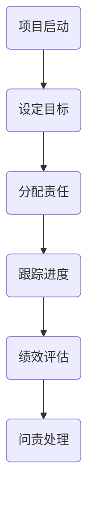

                 


### 文章标题：问责制：确保团队成员负责任完成任务

## 关键词：问责制、团队责任、目标设定、绩效评估、项目管理

## 摘要：
在现代企业的信息化管理中，问责制是一种至关重要的管理工具，它不仅有助于明确团队成员的责任，还能激励团队成员达成预期目标。本文将深入探讨问责制的概念、重要性、实施方法和实战案例，以帮助读者了解如何在日常工作中确保团队成员负责任地完成任务。

---

## 第一部分：问责制的基础

### 第1章：问责制的概念与重要性

#### 1.1 问责制的定义
问责制是一种管理体系，它要求团队成员对他们的行为和结果负责。在团队中，问责制有助于建立透明度和信任，确保每个人都能为共同的目标做出贡献。

#### 1.2 问责制的核心要素
问责制的核心要素包括责任分配、目标设定、绩效评估和反馈机制。这些要素相互作用，共同确保团队成员能够按时完成任务。

#### 1.3 问责制在企业中的重要性
问责制在企业中具有重要意义。它有助于提高团队的工作效率，降低错误率，并促进组织文化的建设。

---

### 第2章：建立有效的问责机制

#### 2.1 确定目标与期望
设定清晰的目标是问责制的第一步。目标应当符合SMART原则，即具体（Specific）、可衡量（Measurable）、可实现（Achievable）、相关（Relevant）和时限（Time-bound）。

#### 2.2 制定明确的责任分配
责任分配应当基于团队成员的技能和职责。可以使用RACI模型（Responsible、Accountable、Consulted、Informed）来确保每个人都知道自己的责任。

#### 2.3 设定绩效指标与评估方法
绩效指标应当能够量化团队成员的贡献。评估方法可以包括定期检查、同行评审和客户反馈等。

---

### 第3章：培养责任感

#### 3.1 增强自我认知
自我认知是培养责任感的基石。团队成员应当了解自己的优点和不足，并努力改进。

#### 3.2 提升团队凝聚力
团队凝聚力是问责制成功的关键。通过团队建设活动和共享目标，可以增强团队成员之间的联系。

#### 3.3 培养责任感的工作环境
一个健康的工作环境能够促进责任感的培养。管理层应当树立榜样，并鼓励团队成员提出建议和反馈。

---

## 第二部分：实施问责制的方法

### 第4章：设定目标和期望

#### 4.1 目标设定的SMART原则
SMART原则是设定有效目标的关键。具体、可衡量、可实现、相关和时限的目标有助于团队成员明确任务方向。

#### 4.2 如何设定明确的期望
明确的期望有助于团队成员了解他们的职责和任务。管理层应当与团队成员进行沟通，确保每个人都能理解期望。

#### 4.3 目标与期望的沟通与确认
沟通是实施问责制的重要环节。通过定期的会议和反馈，管理层可以确保团队成员对目标和期望有清晰的认识。

---

### 第5章：跟踪进度和绩效

#### 5.1 设定关键绩效指标（KPI）
关键绩效指标是评估团队成员绩效的重要工具。管理层应当根据团队目标设定KPI，并定期跟踪进展。

#### 5.2 进度跟踪工具与方法
现代化的项目管理工具如JIRA、Trello等可以帮助团队成员跟踪进度。定期的进度报告也是确保任务按时完成的关键。

#### 5.3 绩效评估与反馈
绩效评估是问责制的重要环节。管理层应当根据设定的KPI评估团队成员的绩效，并提供及时的反馈。

---

### 第6章：应对问责过程中的挑战

#### 6.1 遇到责任推诿的情况
责任推诿是问责制实施中的常见问题。管理层应当制定明确的政策，鼓励团队成员承担自己的责任。

#### 6.2 如何处理绩效不佳的成员
对于绩效不佳的成员，管理层应当提供培训和支持，帮助他们提高工作能力。

#### 6.3 问责制实施中的常见问题与解决方案
问责制实施中可能会遇到各种问题。通过提前准备解决方案，管理层可以确保问责制的有效性。

---

## 第三部分：案例与实战

### 第7章：案例研究

#### 7.1 案例一：成功实施问责制的公司
通过分析成功案例，读者可以了解如何有效实施问责制。

#### 7.2 案例二：问责制失败的案例
分析失败案例可以帮助读者避免常见的错误。

#### 7.3 案例分析与启示
从案例中总结经验教训，为读者提供实用的指导。

---

### 第8章：项目实战

#### 8.1 实战一：团队目标设定与责任分配
通过实际操作，读者可以了解如何设定团队目标和分配责任。

#### 8.2 实战二：绩效跟踪与评估
读者可以学习如何使用工具跟踪绩效，并进行评估。

#### 8.3 实战三：问责制实施的策略与技巧
读者可以掌握问责制实施的策略和技巧，以提高工作效率。

---

## 附录：问责制实施工具

### 附录A：问责制实施流程图
流程图可以帮助读者理解问责制的实施过程。

### 附录B：绩效评估表模板
绩效评估表模板可以帮助读者制定个性化的绩效评估表格。

### 附录C：责任分配矩阵模板
责任分配矩阵模板可以帮助读者明确团队成员的责任。

---

**核心概念原理与架构Mermaid流程图：**



**核心算法原理讲解：**

```plaintext
1. 设定目标（SMART原则）
   - S（Specific，具体）：目标应当明确、具体，避免模糊。
   - M（Measurable，可衡量）：目标应当能够量化，以便跟踪进度。
   - A（Achievable，可达成）：目标应当是可实现的，避免过高或过低。
   - R（Relevant，相关）：目标应当与团队和组织目标一致。
   - T（Time-bound，时限）：目标应当有明确的截止时间。

2. 责任分配（RACI模型）
   - R（Responsible，责任人）：负责完成任务的成员。
   - A（Accountable，责任人）：对任务完成情况负责的人。
   - C（Consulted，咨询）：需要在任务决策过程中提供意见的人。
   - I（Informed，告知）：需要在任务进展中了解情况的人。

3. 绩效评估（KPI设置）
   - 选择关键绩效指标（KPI），确保能够衡量任务的完成情况。
   - 设置合理的目标值，便于评估绩效。
   - 定期收集数据，分析绩效，提供反馈。

4. 问责处理（PDCA循环）
   - P（Plan，计划）：制定问责处理策略。
   - D（Do，执行）：实施问责制。
   - C（Check，检查）：评估问责处理的效果。
   - A（Act，行动）：根据检查结果进行改进。

$$
\text{绩效评分} = \frac{\text{实际完成指标}}{\text{预期完成指标}} \times 100\%
$$
```

**数学模型和数学公式详细讲解与举例说明**

问责制的实施涉及到多个数学模型和公式，以下是一些关键的部分：

### 绩效评估模型

绩效评估通常基于关键绩效指标（KPI）的完成情况。一个简单的绩效评估模型可以表示为：

$$
\text{绩效评分} = \frac{\text{实际完成指标}}{\text{预期完成指标}} \times 100\%
$$

这个公式可以帮助我们量化团队成员的绩效表现。例如，如果某个团队成员的目标是完成10个任务，但实际上完成了12个任务，那么他的绩效评分将是：

$$
\text{绩效评分} = \frac{12}{10} \times 100\% = 120\%
$$

这意味着他超额完成了任务。

### 责任分配模型

在责任分配过程中，RACI模型是一个常用的工具。RACI模型定义了四种角色：责任人（Responsible）、责任人（Accountable）、咨询者（Consulted）和告知者（Informed）。以下是一个简单的责任分配模型：

- **责任人（Responsible）**：负责任务的具体实施。
- **责任人（Accountable）**：对任务的结果负责。
- **咨询者（Consulted）**：在决策过程中提供意见。
- **告知者（Informed）**：需要了解任务的进展。

例如，在一个软件开发项目中，项目经理可能是责任人（Responsible），而项目总监则是责任人（Accountable）。技术专家可能会被咨询（Consulted），而其他团队成员可能会被告知（Informed）。

### 目标设定模型

目标设定模型通常基于SMART原则，即目标应当是具体（Specific）、可衡量（Measurable）、可实现（Achievable）、相关（Relevant）和时限（Time-bound）的。以下是一个简单的目标设定模型：

- **具体（Specific）**：目标应当明确，例如“增加销售额”不如“增加销售额到100万元”具体。
- **可衡量（Measurable）**：目标应当能够量化，例如“提高客户满意度”不如“提高客户满意度到90%”可衡量。
- **可实现（Achievable）**：目标应当是可实现的，例如“在一个月内增加销售额100万元”可能过于激进。
- **相关（Relevant）**：目标应当与团队和组织目标一致。
- **时限（Time-bound）**：目标应当有明确的截止时间，例如“在2023年底前完成新产品的开发”。

例如，一个销售团队的目标可以是“在2023年第一季度增加销售额到200万元”，这是一个具体、可衡量、可实现、相关且时限的目标。

**项目实战**

以下是一个项目实战的例子：

**项目名称**：开发一款新的移动应用

**目标**：在三个月内完成应用的开发，并在应用商店上线。

**责任分配**：

- 项目经理（Accountable）：负责整个项目的规划和管理。
- 技术负责人（Responsible）：负责应用的技术实现。
- 产品经理（Consulted）：提供产品需求和用户体验建议。
- 设计师（Informed）：需要了解设计进度的反馈。

**绩效跟踪**：

- **关键绩效指标（KPI）**：
  - 完成应用的核心功能。
  - 完成应用的设计和UI/UX。
  - 通过测试，确保应用的稳定性和性能。
  - 在应用商店上线。

- **进度跟踪**：使用JIRA等项目管理工具跟踪每个任务的进度。

- **绩效评估**：每两周进行一次绩效评估，根据KPI的完成情况提供反馈。

**代码实现**：

```python
# Python 代码示例：移动应用登录功能

def login(username, password):
    # 验证用户名和密码
    if verify_credentials(username, password):
        # 登录成功
        return "登录成功"
    else:
        # 登录失败
        return "用户名或密码错误"

def verify_credentials(username, password):
    # 这里使用一个假定的验证函数
    return True  # 表示验证通过

# 用户输入
print("请输入用户名：")
username = input()
print("请输入密码：")
password = input()

# 调用登录函数
result = login(username, password)
print(result)
```

**代码解读**：

这个代码示例展示了移动应用登录功能的核心部分。`login` 函数接受用户名和密码作为参数，并调用`verify_credentials` 函数来验证这些凭证。如果验证成功，函数返回“登录成功”，否则返回“用户名或密码错误”。

**应用解读与分析**：

这个示例代码虽然简单，但展示了移动应用开发中的一个关键功能——用户登录。在实际项目中，登录功能通常需要考虑安全性、用户输入验证和用户体验等多个方面。

**案例分析与详细讲解**：

在分析这个案例时，我们可以看到以下关键点：

- **功能完整性**：登录功能是应用的核心功能之一，必须确保其完整性和稳定性。
- **用户体验**：登录界面应当简洁、易于使用，并提供清晰的反馈。
- **安全性**：密码应当加密存储，并在传输过程中使用安全的协议（如HTTPS）。

**项目小结**：

通过这个案例，我们可以看到问责制在项目开发中的重要性。明确的角色分配、目标设定和绩效评估有助于确保项目的成功。同时，团队成员之间的沟通和协作也是成功的关键。

**最佳实践 tips**：

- **定期沟通**：确保团队成员之间定期沟通，及时解决问题。
- **持续改进**：根据反馈和评估结果，不断改进项目和流程。
- **透明度**：保持项目进度的透明度，让团队成员了解整体情况。

**注意事项**：

- **避免过度依赖工具**：工具可以帮助管理，但最终的执行和决策仍需人为判断。
- **关注团队成员的身心健康**：确保团队成员在工作压力下保持良好的身心健康。

**拓展阅读**：

- 《敏捷软件开发实践指南》
- 《项目管理知识体系指南》（PMBOK指南）
- 《人月神话》

---

**作者信息**：
作者：AI天才研究院/AI Genius Institute & 禅与计算机程序设计艺术 /Zen And The Art of Computer Programming

通过这篇文章，我们探讨了问责制的概念、重要性、实施方法和实战案例。问责制不仅有助于明确团队成员的责任，还能激励团队成员达成预期目标。希望这篇文章能帮助读者在实际工作中更好地实施问责制，提高团队的工作效率和绩效。

