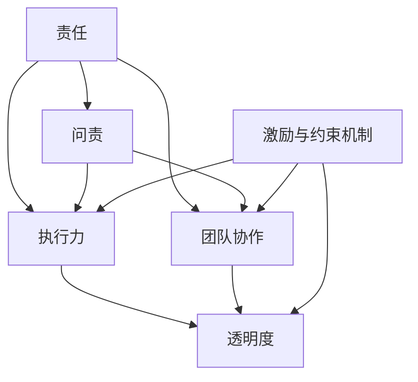

                 

### 第1章 引言：问责文化的概念与重要性

#### 什么是问责文化？

问责文化（Accountability Culture）是一种通过明确责任、提升执行力和促进团队合作的企业文化。在这种文化中，每个人都清楚自己的职责，能够主动承担责任，并对自己的行为和决策结果负责。问责文化不仅仅是一种管理工具，更是企业运营的核心，它影响着企业的效率、团队合作和长期发展。

在传统管理文化中，管理层往往拥有绝对的权力，而下属只需执行命令即可。这种模式容易导致执行力不足、责任分散和团队协作困难。相比之下，问责文化强调个人和团队的责任感，鼓励每个人在面对问题和挑战时主动承担责任，从而提高整体效率和企业竞争力。

#### 问责文化的重要性

1. **提高执行力**

   问责文化通过明确责任和建立激励机制，可以有效提高执行力。在问责文化中，每个人都清楚自己的职责和期望，这有助于减少工作中的模糊地带和推诿现象。此外，问责机制能够对不履行责任的行为进行监督和惩罚，从而确保执行力的落实。

2. **增强团队协作**

   在问责文化中，团队成员之间的责任明确，这有助于加强团队协作。每个人都能清楚地了解自己的角色和责任，从而更有效地与团队成员合作。此外，问责文化鼓励团队成员相互支持和监督，有助于建立信任和合作的基础。

3. **提升企业竞争力**

   问责文化能够提高企业的效率和创新能力，从而提升企业竞争力。在问责文化中，企业能够更加灵活地应对市场变化，快速响应客户需求，并在竞争中保持领先地位。

#### 为什么问责文化对企业如此重要？

1. **可持续发展**

   问责文化有助于企业建立长期可持续发展的基础。通过明确责任和提升执行力，企业能够持续改进和优化业务流程，提高效率和创新能力。

2. **人才吸引与保留**

   问责文化能够吸引和留住优秀人才。在这种文化中，员工能够感受到自己的价值和贡献，从而更有动力为企业的发展贡献力量。

3. **风险管理**

   问责文化有助于企业识别和应对风险。通过明确责任和建立有效的监督机制，企业能够及时发现潜在问题并采取措施，从而降低风险。

#### 总结

问责文化是一种能够显著提升企业效率和竞争力的文化。通过明确责任、增强团队协作和提升执行力，问责文化为企业提供了持续发展的动力。在接下来的章节中，我们将深入探讨如何建立和推广问责文化，以及它在实际应用中的具体方法和实践。

---

### 问责文化的核心概念与联系

为了更好地理解问责文化，我们需要先明确几个核心概念，并分析它们之间的关系。以下是几个关键概念的定义及其相互关系：

1. **责任（Responsibility）**：责任是指个体或团队在特定情境下应承担的义务或任务。在问责文化中，每个人都应该清楚自己的职责，并对自己的行为和结果负责。

2. **问责（Accountability）**：问责是指对行为和结果进行监督和评价的过程。问责文化强调对责任的履行情况进行追踪和评估，以确保工作的高效和合规。

3. **执行力（Execution）**：执行力是指将计划、策略转化为实际结果的能力。问责文化通过明确责任和建立监督机制，有助于提高团队的执行力和效率。

4. **团队协作（Team Collaboration）**：团队协作是指团队成员共同努力、互相支持以实现共同目标的过程。问责文化鼓励团队成员之间明确责任和相互协作，从而提高团队的整体绩效。

5. **透明度（Transparency）**：透明度是指信息的公开和透明，使每个人都能够了解工作中的进展和问题。问责文化强调信息的透明，有助于建立信任和促进团队合作。

6. **激励与约束机制（Incentive and Discipline）**：激励与约束机制是指通过奖励和惩罚来激发员工积极性并确保责任履行。问责文化中，激励机制有助于提高员工的积极性和创造力，而约束机制则确保员工遵守规定和标准。

#### 核心概念之间的关系架构

下面是一个使用Mermaid绘制的流程图，展示了这些核心概念之间的相互关系：

#### 关键概念之间的联系

1. **责任与问责**：责任是问责的前提，只有明确了责任，才能进行有效的问责。问责是对责任的履行情况进行监督和评价，确保工作的高效和合规。

2. **执行力与团队协作**：执行力是团队协作的成果，团队协作是提高执行力的重要手段。问责文化通过明确责任和建立监督机制，有助于提高团队的执行力和协作效率。

3. **透明度与激励与约束机制**：透明度是建立信任的基础，通过公开信息，可以增强员工对企业的信任和归属感。激励与约束机制则通过奖励和惩罚来激发员工积极性，同时确保责任履行。

4. **激励与约束机制与执行力、团队协作和透明度**：激励与约束机制是问责文化的重要组成部分，通过激励员工，可以提高执行力和团队协作，同时确保透明度的实现。

理解这些核心概念及其相互关系，有助于我们更好地建立和推广问责文化，从而提高企业的效率和竞争力。

---

### 问责文化在提高执行力方面的具体措施

问责文化通过明确责任、建立监督机制和提供激励机制，能够有效提高团队的执行力。以下是一些具体措施，可以帮助企业建立和推广问责文化，从而提升团队的执行力。

#### 1. 明确责任

明确责任是建立问责文化的基础。企业需要确保每个员工都清楚自己的职责和任务，避免工作中的模糊地带和推诿现象。以下是一些具体做法：

- **角色划分**：明确各部门和团队的角色和职责，确保每个人都知道自己的任务和期望。

- **岗位说明书**：为每个岗位编写详细的岗位说明书，列出职责、任务和关键绩效指标（KPI）。

- **定期沟通**：定期与员工进行沟通，确保他们了解自己的职责和工作重点。

#### 2. 建立监督机制

监督机制是确保责任履行的重要手段。企业可以通过以下方式建立有效的监督机制：

- **绩效评估**：定期对员工的工作绩效进行评估，确保他们按照预期完成工作任务。

- **透明度**：提高工作过程的透明度，使员工能够了解自己的工作进度和团队的整体进展。

- **反馈机制**：建立有效的反馈机制，让员工能够及时了解自己的工作表现，并得到改进建议。

#### 3. 提供激励机制

激励机制是提高员工积极性和执行力的重要手段。企业可以通过以下方式提供激励机制：

- **奖励制度**：为表现优秀的员工提供奖励，如奖金、晋升机会和表彰。

- **职业发展**：为员工提供职业发展的机会，如培训、职业规划和支持。

- **团队建设**：通过团队建设活动，增强团队成员之间的信任和协作，提高整体执行力。

#### 4. 培养问责意识

问责意识是建立问责文化的关键。企业需要通过以下方式培养员工的问责意识：

- **领导者的示范作用**：领导者应该通过自己的行为树立榜样，展示对责任的承担。

- **培训和教育**：定期为员工提供培训和教育，让他们了解问责文化的重要性和具体做法。

- **团队讨论**：组织团队讨论，鼓励员工分享自己的经验和观点，增强对问责文化的认同感。

#### 5. 落实问责机制

落实问责机制是确保问责文化有效运行的关键。企业可以通过以下方式落实问责机制：

- **建立问责制度**：制定明确的问责制度，包括问责流程、问责标准和问责结果。

- **监督与检查**：定期对问责机制的执行情况进行监督和检查，确保问责制度的落实。

- **改进与优化**：根据反馈和实际情况，不断改进和优化问责机制，使其更加符合企业的需求和目标。

#### 案例分析

以下是一个企业通过建立问责文化提高执行力的案例：

**企业背景**：某互联网公司发现其产品开发团队在项目执行中存在进度滞后、质量不稳定和团队协作不畅的问题。

**解决方案**：

1. **明确责任**：为每个团队成员制定详细的岗位说明书，明确他们的职责和任务。

2. **建立监督机制**：引入项目管理系统，实时监控项目进度，确保项目按计划进行。

3. **提供激励机制**：对按时完成任务的团队和个人给予奖励，如奖金和晋升机会。

4. **培养问责意识**：定期组织团队讨论和培训，强调问责文化的重要性。

5. **落实问责机制**：建立问责制度，对未按时完成任务或影响团队协作的成员进行问责。

**结果**：通过实施问责文化，该公司的产品开发团队执行力显著提高，项目进度和质量得到明显改善，团队协作也得到加强。

综上所述，建立问责文化是提高团队执行力的重要途径。通过明确责任、建立监督机制、提供激励机制和培养问责意识，企业可以有效地提升团队的执行力，从而实现更高的工作效率和业务成果。

---

### 问责文化在团队协作中的作用

问责文化不仅仅是提高执行力的工具，它同样在团队协作中发挥着至关重要的作用。通过明确责任、提高透明度和建立激励机制，问责文化能够显著增强团队成员之间的协作效果，提高整体团队的绩效。

#### 明确责任

在问责文化中，每个团队成员都清楚自己的职责和任务。这种明确的责任划分有助于减少工作中的模糊地带和责任推诿现象。以下是一些具体做法：

1. **角色和职责定义**：企业需要为每个团队成员定义明确的角色和职责，确保每个人知道自己的工作内容和目标。

2. **任务分解**：将大任务分解为小任务，并明确每个小任务的负责人，这样可以确保每个团队成员都有具体的责任和目标。

3. **定期沟通**：定期与团队成员沟通，确保他们了解自己的职责和任务进展，以及与其他团队成员的协作关系。

#### 提高透明度

透明度是建立信任和促进团队合作的基础。在问责文化中，工作过程和进展情况应该保持透明，使所有团队成员都能够了解各自的工作情况和团队的整体进展。以下是一些提高透明度的做法：

1. **共享信息**：建立信息共享平台，让团队成员能够随时查看项目进展、工作成果和其他相关信息。

2. **公开会议**：定期召开公开会议，让团队成员能够了解项目的最新动态和关键决策。

3. **反馈机制**：建立反馈机制，让团队成员能够及时表达意见和建议，确保信息的流通和透明。

#### 建立激励机制

激励机制能够激发团队成员的积极性和创造力，促进团队合作。在问责文化中，企业可以通过以下方式建立激励机制：

1. **奖励制度**：为表现优秀的团队和个人提供奖励，如奖金、晋升机会和表彰。

2. **荣誉制度**：设立团队荣誉制度，表彰在项目中作出突出贡献的团队成员。

3. **团队建设**：通过团队建设活动和培训，增强团队成员之间的信任和协作。

#### 案例分析

以下是一个企业通过问责文化增强团队协作的案例：

**企业背景**：某跨国公司的一个研发团队在处理复杂项目时，经常出现进度滞后、质量不稳定和团队协作困难的问题。

**解决方案**：

1. **明确责任**：为团队成员制定详细的岗位说明书，明确他们的职责和任务，并确保每个人了解自己的角色。

2. **提高透明度**：引入项目管理工具，实时监控项目进展，并定期召开公开会议，让团队成员了解项目的最新动态和关键决策。

3. **建立激励机制**：为按时完成任务的团队和个人提供奖金和晋升机会，同时通过团队建设活动增强团队成员之间的信任和协作。

**结果**：通过实施问责文化，该研发团队的协作效果显著提高，项目进度和质量得到改善，团队成员之间的沟通和信任也得到增强。

#### 总结

问责文化通过明确责任、提高透明度和建立激励机制，能够有效增强团队协作。在问责文化中，团队成员之间明确责任、信息透明和激励机制相互作用，共同促进团队合作，提高整体团队的绩效。企业通过建立和推广问责文化，可以更好地实现团队协作，从而推动企业的发展和成功。

---

### 第3章 建立问责文化的理论基础

#### 问责文化与领导力

问责文化是建立在强有力的领导基础之上的，因此领导者在其中扮演着至关重要的角色。领导者的领导风格和行为方式直接影响到问责文化的形成和推广。以下从领导者的角色和问责实践两个方面，探讨问责文化与领导力之间的关系。

1. **领导者的角色**

   领导者在建立问责文化中具有以下几个关键角色：

   - **倡导者**：领导者需要积极倡导问责文化，通过自己的言行向团队成员传达问责的重要性，使之成为企业的核心价值观。
   - **榜样**：领导者应当以身作则，展示对责任的承担和对工作的敬业精神，成为团队成员的榜样。
   - **协调者**：领导者需要协调团队成员之间的关系，确保责任明确、任务分配合理，促进团队协作。

2. **领导者的问责实践**

   领导者应当通过以下实践来推动问责文化的建立：

   - **明确目标**：领导者需要明确团队的目标和期望，确保每个团队成员都清楚自己的职责和任务。
   - **建立反馈机制**：领导者应当建立有效的反馈机制，鼓励团队成员提供意见和建议，并对工作进展进行及时反馈。
   - **激励与约束**：领导者应当通过激励措施鼓励团队成员承担责任，同时通过约束机制确保职责的履行。

#### 建立问责文化的原则

建立问责文化需要遵循一系列基本原则，以确保其有效性和可持续性。以下是一些关键原则：

1. **公正性**

   公正性是建立问责文化的基石。在问责过程中，领导者需要确保公平对待每个团队成员，不偏袒或歧视任何个人或团队。这有助于增强团队成员对问责制度的信任和认同。

2. **透明度**

   透明度是促进问责文化的重要手段。领导者应当确保工作过程和问责结果对团队成员公开透明，使团队成员能够了解工作中的问题和改进方向。

3. **公平性**

   公平性是指问责过程中对待每个团队成员的平等和公正。领导者应当确保问责制度不偏袒特定个体或团队，而是根据客观标准和绩效进行评估。

4. **责任明确**

   责任明确是建立问责文化的基础。领导者需要明确每个团队成员的职责和任务，确保每个人都清楚自己的角色和责任。

#### 核心要素

问责文化的核心要素是责任、权力与责任的匹配以及激励与约束机制。以下分别进行阐述：

1. **责任明确**

   责任明确要求每个团队成员都清楚自己的职责和任务，避免工作中的推诿现象。领导者应当通过岗位说明书、任务分解和定期沟通等方式，确保责任明确。

2. **权力与责任的匹配**

   权力与责任的匹配是指团队成员在承担责任的同时，拥有相应的权力和资源。领导者需要确保团队成员在执行任务时具备必要的权力，以便有效地履行职责。

3. **激励与约束机制**

   激励与约束机制是推动问责文化的重要手段。领导者应当通过奖励优秀的团队成员和惩罚不履行责任的成员，来激发员工的积极性和责任感。

#### 结论

问责文化是提高团队执行力、增强团队协作和提升企业竞争力的重要手段。领导者通过明确的角色和问责实践，可以有效地推动问责文化的建立。同时，遵循公正性、透明度和公平性等原则，以及确保责任明确、权力与责任的匹配和激励与约束机制的落实，是建立成功问责文化的关键。在接下来的章节中，我们将继续探讨问责文化在组织架构设计、实践步骤和企业文化建设中的应用。

---

### 第4章 建立问责文化的实践步骤

#### 制定问责制度

建立问责文化需要一套明确的制度作为基础。问责制度应当包括以下几个方面：

1. **问责原则**：明确问责的基本原则，如公正性、透明度和公平性等，以确保问责过程的合理性和有效性。

2. **问责流程**：制定详细的问责流程，包括问责的触发条件、申诉渠道和处理方式等，确保问责过程的规范和透明。

3. **责任界定**：明确每个团队成员的职责和任务，确保每个人都知道自己的职责范围和预期成果。

4. **考核指标**：制定具体的考核指标，用于评估团队成员的工作表现和责任履行情况。

5. **奖励与惩罚**：明确奖励和惩罚措施，激励团队成员积极履行责任，同时对不履行责任的成员进行惩罚。

#### 培养问责意识

培养问责意识是建立问责文化的重要步骤。以下是一些具体措施：

1. **领导者的示范作用**：领导者应当以身作则，展示对责任的承担和对工作的敬业精神，成为团队成员的榜样。

2. **培训和教育**：定期为员工提供问责文化的培训和教育，让他们了解问责文化的重要性、原则和实践方法。

3. **团队讨论**：组织团队讨论，鼓励团队成员分享自己的经验和观点，增强对问责文化的认同感。

4. **沟通与反馈**：建立有效的沟通与反馈机制，让团队成员能够及时了解工作中的问题和改进方向，培养责任感。

#### 落实问责机制

落实问责机制是确保问责文化有效运行的关键。以下是一些具体措施：

1. **监督与检查**：定期对问责机制的执行情况进行监督和检查，确保问责制度的落实和效果。

2. **绩效评估**：定期对团队成员的工作绩效进行评估，根据考核指标和问责结果进行奖惩。

3. **反馈与改进**：根据反馈和评估结果，对问责制度进行改进和优化，确保其持续有效。

4. **激励与约束**：通过奖励优秀的团队成员和惩罚不履行责任的成员，来激发员工的积极性和责任感。

#### 案例分析

以下是一个企业通过建立问责制度、培养问责意识和落实问责机制来建立问责文化的案例：

**企业背景**：某大型制造企业发现其生产部门在产品质量控制和进度管理方面存在严重问题，导致产品投诉率上升和生产进度滞后。

**解决方案**：

1. **制定问责制度**：
   - 明确生产部门各岗位的职责和任务，确保责任明确。
   - 制定详细的问责流程，包括质量问题的处理流程和进度管理的考核标准。
   - 制定奖励和惩罚措施，激励员工提高产品质量和生产效率。

2. **培养问责意识**：
   - 领导者通过自身行为树立榜样，展示对责任的承担。
   - 定期组织培训，让员工了解问责文化的重要性和具体实践方法。
   - 鼓励员工参与团队讨论，分享自己的经验和观点。

3. **落实问责机制**：
   - 定期对生产部门的绩效进行评估，根据问责结果进行奖惩。
   - 建立质量监控和进度管理的反馈机制，及时发现问题并进行改进。

**结果**：

通过建立问责文化，该企业的生产部门在产品质量控制和进度管理方面取得了显著改善，产品投诉率下降，生产进度恢复正常，员工的责任感和执行力也得到显著提高。

#### 总结

建立问责文化需要一系列具体的实践步骤，包括制定问责制度、培养问责意识和落实问责机制。通过这些步骤，企业可以有效地推动问责文化的建立，提高团队的执行力和协作效果，从而实现更高的工作效率和业务成果。在接下来的章节中，我们将进一步探讨问责文化在企业文化建设中的应用和评估方法。

---

### 第5章 问责文化与企业文化建设

#### 问责文化与企业文化建设的关系

问责文化与企业文化建设有着紧密的联系。企业文化建设是企业长期发展的重要战略，而问责文化作为其核心组成部分，对企业文化的塑造和传承起着关键作用。企业文化建设侧重于构建企业的核心价值观、行为规范和工作氛围，而问责文化则通过明确责任和提升执行力，推动企业文化的实践和深化。

1. **共同价值观**：问责文化和企业文化建设都强调共同的价值观，如责任感、诚信、协作和创新等。这些价值观不仅指导员工的行为，也为问责文化的建立提供了基础。

2. **行为规范**：问责文化通过明确责任和行为规范，帮助员工理解和遵守企业的行为准则，从而强化企业文化。

3. **工作氛围**：问责文化强调透明度和公平性，有助于建立开放、公正和信任的工作氛围，这有利于企业文化的培养和传播。

#### 企业文化建设与问责文化的融合

为了有效地融合问责文化与企业文化，企业需要从以下几个方面进行努力：

1. **企业文化的内涵与外延**

   - **内涵**：企业文化的内涵包括核心价值观、企业使命、愿景和价值观。这些内涵需要通过问责文化来具体化和实践。

   - **外延**：企业文化的内涵需要通过具体的制度、行为和实践活动来外延化。问责文化通过明确责任、建立监督机制和激励机制，将这些内涵转化为具体的行动。

2. **问责文化在企业文化中的应用**

   - **员工行为规范**：企业可以通过问责文化建立员工行为规范，如职业道德、工作态度和团队合作等，这些规范有助于强化企业文化。

   - **绩效评估**：企业可以将问责文化融入绩效评估体系，通过明确的考核指标和问责机制，确保员工的行为符合企业文化的要求。

   - **激励机制**：企业可以通过问责文化建立激励机制，鼓励员工积极践行企业文化，如通过奖励那些在工作中表现优秀的员工。

3. **企业文化的传播与推广**

   - **内部沟通**：企业可以通过内部沟通平台，如员工大会、内部杂志和培训课程等，传播和推广问责文化，使员工理解并认同企业文化的内涵。

   - **领导示范**：企业领导者应当通过自身的示范作用，展示对问责文化的理解和践行，从而影响和激励员工。

   - **外部展示**：企业可以通过对外展示企业文化的成果，如客户满意度、市场表现和社会责任等，来提升企业的品牌形象和影响力。

#### 成功案例分析

以下是一个企业成功融合问责文化与企业文化建设的案例：

**企业背景**：某全球知名科技公司，其企业文化强调创新、协作和责任感。

**解决方案**：

1. **明确价值观**：公司明确其核心价值观，如创新、客户至上和团队合作，并将其融入问责文化中。

2. **建立问责制度**：公司制定了一系列问责制度，如项目责任制度、绩效考核制度和反馈机制，确保每个员工都清楚自己的责任和工作标准。

3. **员工参与**：公司鼓励员工参与问责制度和企业文化的建设，通过内部讨论和反馈机制，不断优化和改进。

4. **领导示范**：公司领导层通过自身的示范作用，展示对问责文化和企业文化的重视，如公开会议、培训课程和员工互动活动等。

**结果**：

通过融合问责文化与企业文化，该公司在员工责任感、团队合作和创新方面取得了显著提升，企业绩效和客户满意度也随之提高。公司还成功吸引了和留住了大量优秀人才，进一步巩固了其市场地位。

#### 总结

问责文化是企业文化建设的重要组成部分，通过明确责任、建立监督机制和激励机制，问责文化有助于企业文化的实践和深化。企业需要从价值观、制度、员工参与和领导示范等方面，融合问责文化与企业文化，从而推动企业的持续发展和成功。

---

### 第6章 问责文化在项目管理中的应用

#### 项目管理的问责机制

在项目管理中，问责机制是确保项目成功的关键。通过明确的职责划分、有效的监督和评估，问责机制有助于提高项目管理的效率和质量。以下是一个典型的项目管理问责机制：

1. **项目目标与责任的明确**：

   - **项目目标**：明确项目的目标，包括项目范围、交付成果和时间节点。

   - **责任划分**：为项目中的每个角色（如项目经理、团队成员、质量保证人员等）明确职责和任务，确保每个人都知道自己的工作内容和目标。

2. **项目进度与质量的监控**：

   - **进度监控**：定期跟踪项目进度，确保项目按照计划进行。这可以通过项目进度报告、状态会议和项目管理系统来实现。

   - **质量监控**：确保项目交付的产品或服务符合质量标准。质量保证人员负责监控质量，并采取必要的纠正措施。

3. **风险评估与应对**：

   - **风险评估**：识别项目中可能出现的风险，并评估其影响和可能性。

   - **风险应对**：制定应对策略，确保在风险发生时能够迅速响应和解决。

#### 项目团队的问责文化建设

建立问责文化对于项目团队的协作和项目成功至关重要。以下是一些关键步骤：

1. **团队成员的角色定位**：

   - **角色定义**：为每个团队成员明确角色和职责，确保每个人都知道自己的角色和任务。

   - **协作机制**：建立有效的协作机制，如定期团队会议、任务分解和协同工作平台，以促进团队成员之间的沟通和协作。

2. **团队协作与沟通**：

   - **沟通渠道**：建立畅通的沟通渠道，确保团队成员能够及时获取信息和解决问题。

   - **反馈机制**：建立反馈机制，鼓励团队成员提供意见和建议，促进持续改进。

3. **激励与约束机制**：

   - **激励措施**：为表现优秀的团队成员提供奖励和认可，如奖金、晋升机会和表彰。

   - **约束机制**：对未能履行职责的团队成员进行约束，如警告、绩效改进计划或岗位调整。

#### 案例分析

以下是一个在项目管理中成功应用问责文化的案例：

**企业背景**：某软件公司负责开发一款大型企业级应用软件，该项目涉及多个部门和团队的合作。

**解决方案**：

1. **项目目标与责任明确**：

   - **项目目标**：明确项目的目标，包括功能需求、性能标准和交付时间。

   - **责任划分**：为项目经理、开发人员、测试人员等角色明确职责和任务，确保每个人都知道自己的工作内容和目标。

2. **项目进度与质量监控**：

   - **进度监控**：通过每周的项目进度会议和项目管理工具，定期跟踪项目进度，确保项目按照计划进行。

   - **质量监控**：建立质量保证团队，定期进行代码审查和测试，确保软件质量。

3. **团队协作与沟通**：

   - **沟通渠道**：通过即时通讯工具、邮件和项目管理平台，确保团队成员能够及时获取信息和解决问题。

   - **反馈机制**：定期组织团队讨论，鼓励团队成员提供意见和建议，促进持续改进。

4. **激励与约束机制**：

   - **激励措施**：为按时完成任务的团队成员提供奖金和表彰，鼓励他们继续努力。

   - **约束机制**：对未能履行职责的团队成员进行警告和绩效改进计划，确保项目按计划进行。

**结果**：

通过建立问责文化，该项目在进度、质量和团队合作方面取得了显著改善。团队成员的责任感和执行力得到提升，项目按时交付，客户满意度也显著提高。

#### 总结

问责文化在项目管理中发挥着至关重要的作用。通过明确的职责划分、有效的监督和评估、团队协作与沟通以及激励与约束机制，问责文化有助于提高项目的管理效率和成功概率。企业通过在项目管理中成功应用问责文化，可以更好地应对复杂的项目挑战，实现项目的目标和价值。

---

### 第7章 问责文化的评估与持续改进

#### 问责文化的评估指标

为了确保问责文化在企业中的有效运行，需要对问责文化进行定期评估。以下是一些关键评估指标：

1. **执行力评估**：评估团队和个人的执行力，包括任务的完成情况、工作进度和效率等。

2. **团队协作评估**：评估团队成员之间的协作效果，包括沟通效率、协作精神和共同解决问题的能力。

3. **责任感评估**：评估员工的责任感，包括对任务的承诺程度、主动承担责任的意愿和解决问题的能力。

4. **透明度评估**：评估企业内部的透明度，包括信息共享的频率和质量、决策过程的公开程度等。

5. **激励与约束机制评估**：评估激励和约束机制的有效性，包括奖励措施的公正性和惩罚措施的实施情况。

#### 面对挑战的调整

在实施问责文化的过程中，企业可能会面临一些挑战。以下是一些建议，帮助企业应对这些挑战：

1. **文化抵触**：一些员工可能对问责文化持抵触态度，企业需要通过沟通和培训，帮助他们理解问责文化的重要性。

2. **执行难度**：问责制度的执行可能遇到难度，企业需要不断完善制度，确保其实用性和可操作性。

3. **激励机制不足**：激励措施可能不足以激发员工的积极性，企业需要根据实际情况调整激励政策。

#### 培养创新与适应能力

问责文化不仅需要应对现有的挑战，还需要具备持续改进和创新的能力。以下是一些建议：

1. **定期评估与反馈**：定期对问责文化进行评估，收集员工反馈，识别问题和改进方向。

2. **持续改进**：根据评估结果和反馈，不断优化问责制度，提高其适应性和有效性。

3. **鼓励创新**：鼓励员工提出改进建议和创新想法，通过建立创新激励机制，激发员工的创新潜力。

4. **培训与学习**：为员工提供培训和学习机会，提高他们的专业能力和责任感。

#### 案例分析

以下是一个企业通过持续改进和培养创新能力，成功优化问责文化的案例：

**企业背景**：某跨国公司在实施问责文化过程中，发现团队成员的执行力和协作效果不理想，同时激励机制存在不足。

**解决方案**：

1. **定期评估与反馈**：公司定期对问责文化进行评估，通过问卷调查和员工访谈，收集员工反馈，识别存在的问题。

2. **优化问责制度**：根据反馈，公司对问责制度进行优化，增加了透明度和灵活性，确保员工对问责过程的认同。

3. **激励机制调整**：公司调整了激励机制，增加了奖金和晋升机会，同时引入了创新奖励制度，鼓励员工提出改进建议。

4. **培训与学习**：公司为员工提供专业培训和跨部门学习机会，提高员工的专业能力和责任感。

**结果**：

通过持续改进和培养创新能力，该公司的问责文化得到了显著优化。团队成员的执行力和协作效果得到提升，员工满意度和工作积极性也显著提高，企业的整体运营效率和竞争力得到了增强。

#### 总结

问责文化的评估与持续改进是企业成功实施问责文化的重要环节。通过定期评估、反馈和持续改进，企业可以不断优化问责制度，提高其有效性和适应性。同时，培养创新和适应能力，有助于企业在不断变化的市场环境中保持竞争优势。企业通过有效的问责文化和持续改进，可以实现更高的执行力和团队合作，推动企业的长远发展。

---

### 第8章 结论：问责文化对企业长远发展的影响

#### 问责文化的价值体现

问责文化作为一种关键的企业管理工具，其价值在多个维度上得到了体现：

1. **提升企业的市场竞争力**：通过明确责任和提升执行力，问责文化帮助企业快速响应市场变化，提高产品和服务质量，从而增强市场竞争力。

2. **促进企业的可持续发展**：问责文化通过持续改进和创新，帮助企业优化业务流程，提高运营效率，实现可持续发展的目标。

3. **优化企业内部管理**：问责文化通过明确的职责划分和有效的监督机制，优化企业内部管理，减少浪费和冗余，提高资源利用效率。

#### 问责文化对企业长远发展的影响

问责文化对企业长远发展具有深远的影响：

1. **提高团队执行力**：问责文化通过明确的职责和有效的监督机制，确保团队成员高效完成任务，提高团队的执行力。

2. **增强团队协作**：问责文化通过明确责任和透明度，促进团队成员之间的协作，提高团队整体绩效。

3. **提升员工满意度**：问责文化通过激励与约束机制，激发员工的积极性和责任感，提高员工满意度，从而降低员工流失率。

#### 未来的研究方向

在未来的研究和实践中，以下几个方向值得探索：

1. **跨行业应用**：研究问责文化在不同行业中的应用效果和适应性，探索其在不同领域的最佳实践。

2. **国际化发展**：研究问责文化在国际化的企业管理中的应用，探讨其在跨国企业中的推广策略。

3. **技术赋能**：结合人工智能、大数据等技术，探索如何通过技术手段提升问责文化的实施效果，提高企业的管理效率。

#### 总结

问责文化是企业长远发展的重要保障。通过明确责任、提升执行力和促进团队合作，问责文化能够显著提高企业的市场竞争力、运营效率和员工满意度。未来，企业需要不断探索和优化问责文化的实践，以适应不断变化的市场环境，实现持续发展和成功。

---

## 《问责文化：建立高效执行力的基础》目录大纲

### 第1章 引言：问责文化的概念与重要性

1.1 什么是问责文化？  
1.2 问责文化的重要性

### 第2章 建立问责文化的理论基础

2.1 问责文化与领导力  
2.2 建立问责文化的原则  
2.3 问责文化的核心要素

### 第3章 问责文化与组织架构设计

3.1 问责文化与组织架构的关系  
3.2 优化组织架构以支持问责文化

### 第4章 建立问责文化的实践步骤

4.1 制定问责制度  
4.2 培养问责意识  
4.3 落实问责机制

### 第5章 问责文化与企业文化建设

5.1 问责文化与企业文化的关系  
5.2 企业文化建设与问责文化的融合

### 第6章 问责文化在项目管理中的应用

6.1 项目管理的问责机制  
6.2 项目团队的问责文化建设

### 第7章 问责文化的评估与持续改进

7.1 问责文化的评估指标  
7.2 面对挑战的调整  
7.3 培养创新与适应能力

### 第8章 结论：问责文化对企业长远发展的影响

8.1 问责文化的价值体现  
8.2 未来的研究方向

---

以上是《问责文化：建立高效执行力的基础》的目录大纲。通过详细的章节划分和内容概述，我们为读者提供了一个系统化的学习和理解问责文化的框架。每个章节都涵盖了问责文化在不同方面的应用和实践，旨在帮助读者全面掌握问责文化的概念、理论和实践方法。同时，文章末尾的总结和未来研究方向为读者提供了进一步的思考方向，以促进问责文化的深入研究和实际应用。

---

## 作者信息

**作者：** AI天才研究院/AI Genius Institute & 禅与计算机程序设计艺术 /Zen And The Art of Computer Programming

AI天才研究院（AI Genius Institute）致力于推动人工智能领域的创新研究和应用，汇集了世界顶级的人工智能专家、程序员和软件架构师。研究院在计算机图灵奖等领域取得了显著成就，为全球人工智能产业的发展做出了重要贡献。

《禅与计算机程序设计艺术》是作者结合多年编程经验和哲学思考所著的经典之作，深入探讨了程序设计中的禅意和智慧，为程序员提供了一种全新的编程理念和思维方式。该书在全球范围内受到了广泛的关注和好评，成为计算机科学领域的畅销书之一。

