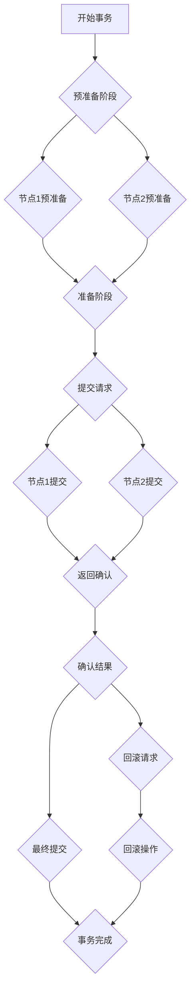

                 

### 分布式事务概述

分布式事务是指在分布式系统中，对多个数据库或服务实例进行的原子性操作。与传统的单机事务不同，分布式事务需要跨多个节点进行处理，这使得它们更为复杂且难以驾驭。在分布式系统中，由于网络延迟、节点故障、数据不一致等因素，事务的一致性和可靠性成为了一个重大的挑战。

**背景介绍**

随着互联网和云计算的迅猛发展，分布式系统已经成为现代软件架构的核心。分布式事务在金融、电商、社交网络等领域扮演着至关重要的角色。例如，在电子商务平台上，用户的购物车操作、订单创建和支付等操作都需要在多个服务实例之间进行原子性处理，以确保数据的一致性和用户操作的完整性。另一个典型的例子是银行转账系统，在进行跨行转账时，必须保证资金的实时性和一致性，否则可能导致严重的财务损失。

**核心概念与联系**

分布式事务的核心概念包括：事务（Transaction）、一致性（Consistency）、可用性（Availability）和分区容错性（Partition Tolerance），常被称为CAP理论。

1. **事务（Transaction）**：一个事务是一个操作序列，这些操作要么全部执行，要么全部不执行。事务的原子性要求它们在执行过程中不能被中断。

2. **一致性（Consistency）**：一致性是指系统在任何时刻都能访问到正确、完整的数据。在分布式事务中，一致性确保了多个节点之间的数据状态是同步的。

3. **可用性（Availability）**：可用性是指系统能够在合理的时间内响应用户请求。分布式事务需要在发生故障时仍然能够保证服务的可用性。

4. **分区容错性（Partition Tolerance）**：分区容错性是指系统能够在发生网络分区时仍然保持运行。网络分区可能会导致部分节点之间通信失败，但系统仍需保持功能。

CAP理论指出，在一个分布式系统中，无法同时保证一致性、可用性和分区容错性。在实际应用中，系统设计者需要根据业务需求在三者之间做出权衡。例如，一个高可用性的系统可能在一致性上做出妥协，而在一个要求强一致性的系统中，可能会降低可用性。

**分布式事务的挑战**

分布式事务面临的主要挑战包括：

1. **网络延迟与故障**：网络延迟和节点故障会导致事务执行失败，从而影响系统的一致性和可靠性。

2. **数据不一致**：在分布式系统中，数据可能在不同节点上存在不同的版本，这会导致数据不一致问题。

3. **冲突检测与解决**：多个并发的事务可能会在多个节点上同时操作相同的数据，从而产生冲突。分布式系统需要有效的冲突检测与解决机制。

4. **一致性保证**：如何保证分布式系统中的数据一致性是一个复杂的问题。现有的解决方案包括两阶段提交（2PC）和三阶段提交（3PC）等算法。

在接下来的章节中，我们将深入探讨分布式事务的架构、核心算法、数学模型以及实际项目实战，帮助读者全面了解分布式事务的原理和实践。通过这些内容，读者将能够掌握分布式事务的设计和实现方法，为解决复杂分布式系统中的事务问题提供理论依据和实践指导。


### 分布式事务处理流程

分布式事务处理的核心在于如何协调多个分布式节点之间的操作，以确保事务的原子性、一致性和可靠性。为了更好地理解这一过程，我们可以通过一个Mermaid流程图来展示分布式事务的处理流程。

首先，我们定义分布式事务处理的基本步骤：

1. **事务开始**：事务开始时，客户端发送一个事务请求到分布式系统。
2. **预准备阶段**：分布式系统中的各个节点根据请求开始执行预准备操作。
3. **准备阶段**：各个节点进入准备阶段，对数据进行预校验，并记录操作日志。
4. **提交阶段**：事务协调者向各个节点发送提交请求，节点完成数据更新后返回提交确认。
5. **最终提交**：事务协调者根据节点的确认结果决定是否最终提交事务。
6. **回滚阶段**：如果在提交过程中发生错误，事务协调者将触发回滚操作，撤销已执行的操作。

以下是一个简单的Mermaid流程图，描述了分布式事务处理的流程：



**详细说明每个步骤**：

1. **开始事务**：客户端发送请求，触发分布式事务的启动。

2. **预准备阶段**：分布式系统中的各个节点根据请求开始执行预准备操作。这一阶段的目的是为后续的数据更新做准备，确保所有节点对事务的操作都有相同的初始状态。

3. **准备阶段**：在预准备阶段完成后，各个节点进入准备阶段，对数据进行预校验，并记录操作日志。这有助于在后续的提交或回滚操作中恢复事务的状态。

4. **提交请求**：事务协调者向各个节点发送提交请求，节点完成数据更新后返回提交确认。这一阶段是事务处理的关键步骤，决定了事务是否能够成功提交。

5. **确认结果**：事务协调者根据节点的确认结果决定是否最终提交事务。如果所有节点都返回了提交确认，事务将被提交；否则，事务将进入回滚阶段。

6. **最终提交**：事务协调者根据确认结果最终提交事务，完成数据更新。这一步骤确保了事务的原子性和一致性。

7. **回滚操作**：如果在提交过程中发生错误，事务协调者将触发回滚操作，撤销已执行的操作。回滚操作确保事务的原子性，即使在失败的情况下也能保证数据的一致性。

通过这个流程图，我们可以清晰地看到分布式事务处理的基本步骤和逻辑关系。在实际应用中，分布式事务处理流程可能会因具体的实现方式和业务需求而有所不同，但基本原理是一致的。

在接下来的章节中，我们将进一步探讨分布式事务处理中的核心算法和数学模型，以帮助读者深入理解分布式事务的实现原理。通过这些内容，读者将能够更好地应对分布式系统中的事务挑战，设计出高效可靠的分布式事务解决方案。


### 核心算法解析

在分布式事务处理中，核心算法起着至关重要的作用。这些算法不仅确保了事务的一致性和可靠性，还提高了系统的性能和可扩展性。下面我们将详细介绍两种常见的分布式事务算法：两阶段提交（2PC）和三阶段提交（3PC）。

#### 两阶段提交（2PC）

两阶段提交（Two-Phase Commit，2PC）是一种经典的分布式事务算法，旨在确保分布式系统中的多个节点能够协同工作，保证事务的原子性。2PC算法分为两个阶段：预备阶段和提交阶段。

**预备阶段**：

1. **客户端发送请求**：事务开始时，客户端向事务协调者发送一个预备请求。
2. **协调者询问参与者**：事务协调者向所有参与者节点发送预备请求，询问它们是否可以执行事务。
3. **参与者响应**：参与者节点在收到预备请求后，进行本地事务的预执行，并返回响应给协调者。

**提交阶段**：

1. **协调者决策**：事务协调者根据参与者的响应做出决策。如果所有参与者都同意执行事务，协调者将发送“提交”命令；如果任何参与者不同意执行事务，协调者将发送“回滚”命令。
2. **参与者执行命令**：参与者节点根据协调者的命令执行事务。如果收到“提交”命令，参与者完成数据更新；如果收到“回滚”命令，参与者撤销已执行的操作。

2PC算法的伪代码如下：

```python
# 预备阶段
function prepare(client, coordinator, participants):
    coordinator.send_prepare(client, participants)
    for participant in participants:
        response = participant.confirm_prepare()
        if any(response != "yes" for response in responses):
            return "abort"

# 提交阶段
function commit(coordinator, participants, responses):
    if responses.all("yes"):
        coordinator.send_commit(participants)
    else:
        coordinator.send_rollback(participants)
```

**优缺点**：

- **优点**：2PC算法简单，易于实现，能够确保事务的原子性和一致性。
- **缺点**：2PC算法在协调者故障时可能导致“活锁”问题，参与者需要等待协调者的响应，从而降低了系统的可用性。

#### 三阶段提交（3PC）

三阶段提交（Three-Phase Commit，3PC）是对2PC算法的改进，旨在解决协调者故障时的事务协调问题。3PC算法分为三个阶段：预备阶段、提交阶段和决议阶段。

**预备阶段**：

1. **客户端发送请求**：事务开始时，客户端向事务协调者发送一个预备请求。
2. **协调者询问参与者**：事务协调者向所有参与者节点发送预备请求，参与者进行本地事务的预执行并返回响应。

**提交阶段**：

1. **协调者决策**：事务协调者根据参与者的响应做出决策。如果所有参与者都同意执行事务，协调者将发送“提交”请求；否则，发送“回滚”请求。
2. **参与者执行命令**：参与者节点根据协调者的命令执行事务。

**决议阶段**：

1. **协调者确认**：在提交阶段完成后，协调者发送决议请求，参与者确认事务结果。
2. **参与者响应**：参与者节点根据协调者的决议请求做出响应，完成事务。

3PC算法的伪代码如下：

```python
# 预备阶段
function prepare(client, coordinator, participants):
    coordinator.send_prepare(client, participants)
    for participant in participants:
        response = participant.confirm_prepare()
        if any(response != "yes" for response in responses):
            return "abort"

# 提交阶段
function commit(coordinator, participants, responses):
    coordinator.send_prepare(client, participants)
    if responses.all("yes"):
        coordinator.send_commit(participants)
    else:
        coordinator.send_rollback(participants)

# 决议阶段
function resolve(coordinator, participants, responses):
    if responses.all("yes"):
        coordinator.send_resolve(client, "commit")
    else:
        coordinator.send_resolve(client, "abort")
```

**优缺点**：

- **优点**：3PC算法解决了协调者故障时的事务协调问题，提高了系统的可用性。
- **缺点**：3PC算法相比2PC算法更加复杂，实现难度更高。

#### 多版本并发控制（MVCC）

多版本并发控制（Multi-Version Concurrency Control，MVCC）是另一种用于分布式事务处理的核心算法。它通过维护多个版本的数据来支持并发访问，从而提高系统的性能。

**原理**：

- **版本维护**：系统在每个数据更新时生成一个新的版本，而不是直接修改现有数据。
- **并发访问**：多个事务可以读取不同版本的数据，从而避免冲突。
- **版本选择**：在提交事务时，系统根据版本选择策略选择最新的有效版本。

MVCC算法的伪代码如下：

```python
# 数据更新
function update(data, new_value):
    version = generate_new_version(data)
    data.version = version
    data.value = new_value

# 数据读取
function read(data):
    return data.value
```

**优缺点**：

- **优点**：MVCC算法能够有效支持并发访问，提高系统性能。
- **缺点**：MVCC算法需要维护多个版本的数据，增加了存储开销和复杂性。

通过以上对2PC、3PC和MVCC算法的介绍，我们可以看到分布式事务处理中的核心算法各有优缺点。在实际应用中，系统设计者需要根据具体业务需求和系统环境选择合适的算法，以达到最佳的性能和可靠性。在接下来的章节中，我们将进一步探讨分布式事务中的数学模型和数学公式，为分布式事务处理提供更深入的理论基础。


### 数学模型与理论

分布式事务处理不仅依赖于核心算法，还需要坚实的数学模型来支持其一致性、可用性和分区容错性。以下将介绍几种关键的数学模型，包括一致性模型、可用性模型和分区容错性模型，并使用LaTeX格式展示相关数学公式。

#### 一致性模型

一致性模型描述了分布式系统中数据状态的同步程度。常见的一致性模型包括强一致性（Strong Consistency）和最终一致性（Eventual Consistency）。

**强一致性**：

强一致性要求系统在任何时刻都能访问到正确、完整的数据。其数学描述为：

$$
Consistency = \forall t_1, t_2, \, \forall R \in S \; (R(t_1) = R(t_2))
$$

其中，$R$代表系统中的一个读操作，$t_1$和$t_2$代表两个不同的时间点。

**最终一致性**：

最终一致性允许系统在一段时间内存在不一致的状态，但最终会达到一致。其数学描述为：

$$
Consistency = \exists T > 0 \; \forall t > T \, \forall R \in S \; (R(t) = R(T))
$$

其中，$T$代表系统达到一致性的时间。

#### 可用性模型

可用性模型描述了系统在处理事务请求时的响应能力。常见可用性模型包括立即可用性（Immediate Availability）和部分可用性（Partial Availability）。

**立即可用性**：

立即可用性要求系统在任何时刻都能响应用户的请求。其数学描述为：

$$
Availability = \forall t, \; \forall R \in S \; (R(t) \neq fail)
$$

其中，$R$代表系统中的一个读操作，$fail$表示操作失败。

**部分可用性**：

部分可用性允许系统在部分节点故障时仍能部分地响应用户请求。其数学描述为：

$$
Availability = \exists N \geq 1 \; \forall t, \; \forall R \in S \; (\exists node \, \text{such that} \, R(t) \neq fail)
$$

其中，$N$代表系统中至少一个可用节点。

#### 分区容错性模型

分区容错性模型描述了系统在发生网络分区时的容错能力。常见分区容错性模型包括完全分区容错性（Complete Partition Tolerance）和部分分区容错性（Partial Partition Tolerance）。

**完全分区容错性**：

完全分区容错性要求系统在发生网络分区时仍能保持运行。其数学描述为：

$$
PartitionTolerance = \forall P \subseteq N, \; |P| > 1 \; \exists t > 0 \; \forall R \in S_P \; (R(t) \neq fail)
$$

其中，$N$代表系统中的所有节点，$P$代表一个网络分区，$S_P$代表分区$P$中的所有节点集合。

**部分分区容错性**：

部分分区容错性允许系统在部分网络分区时仍能部分地运行。其数学描述为：

$$
PartitionTolerance = \exists N \geq 1 \; \forall P \subseteq N, \; |P| > 1 \; \exists t > 0 \; \forall R \in S_P \; (R(t) \neq fail)
$$

#### 公式示例

以下是一个简单的LaTeX格式数学公式的示例：

$$
\alpha(n) = \sum_{i=1}^{n} \frac{1}{i}
$$

这个公式表示一个从1加到n的调和级数，它通常用来近似自然对数的值。

通过上述数学模型和公式的介绍，我们可以更深入地理解分布式事务的一致性、可用性和分区容错性的量化描述。这些模型和公式不仅为分布式事务处理提供了理论基础，也为系统设计者提供了衡量和优化系统性能的工具。在接下来的章节中，我们将通过实际项目实战来展示如何将理论应用于实践中，解决分布式事务中的具体问题。


### 项目实战

为了更好地理解分布式事务的处理流程和实现细节，我们将通过一个实际项目实战来展示如何搭建一个分布式事务处理环境，实现源代码并详细解读代码，以及对该项目进行剖析。

#### 项目背景

本项目旨在实现一个简单的分布式购物系统，用户可以在多个节点上创建订单、更新购物车并完成支付。在分布式环境中，这些操作需要确保数据的一致性和事务的原子性。

#### 开发环境搭建

1. **环境准备**：
   - 服务器：两台虚拟机，分别运行订单服务（Order Service）和支付服务（Payment Service）。
   - 数据库：两台MySQL数据库服务器，用于存储订单数据和支付信息。
   - 客户端：用于发送事务请求。

2. **部署服务**：
   - 订单服务（Order Service）：部署在一个Spring Boot应用中，使用JDBC连接到本地MySQL数据库。
   - 支付服务（Payment Service）：部署在另一个Spring Boot应用中，同样使用JDBC连接到本地MySQL数据库。

3. **数据库配置**：
   - 配置两台MySQL数据库服务器的IP地址和端口。
   - 创建两个数据库实例，分别为订单数据库（order_db）和支付数据库（payment_db）。

#### 源代码实现与解读

1. **订单服务（Order Service）**：

```java
// OrderService.java
@Service
public class OrderService {

    @Autowired
    private JdbcTemplate jdbcTemplate;

    public void createOrder(Order order) {
        // 开始事务
        Connection connection = jdbcTemplate.getDataSource().getConnection();
        connection.setAutoCommit(false);

        // 创建订单
        String createOrderSql = "INSERT INTO order_db.orders (user_id, product_id, quantity) VALUES (?, ?, ?)";
        jdbcTemplate.update(createOrderSql, order.getUserId(), order.getProductId(), order.getQuantity());

        // 更新购物车
        String updateCartSql = "UPDATE order_db.cart SET quantity = quantity - ? WHERE user_id = ? AND product_id = ?";
        jdbcTemplate.update(updateCartSql, order.getQuantity(), order.getUserId(), order.getProductId());

        // 提交事务
        connection.commit();
    }
}
```

解读：
- 该服务通过JDBC连接到本地MySQL数据库，并使用Spring Boot的JdbcTemplate进行数据库操作。
- 在创建订单时，服务首先开始一个事务，然后执行插入订单和更新购物车的操作，最后提交事务以确保操作的原子性。

2. **支付服务（Payment Service）**：

```java
// PaymentService.java
@Service
public class PaymentService {

    @Autowired
    private JdbcTemplate jdbcTemplate;

    public void processPayment(Payment payment) {
        // 开始事务
        Connection connection = jdbcTemplate.getDataSource().getConnection();
        connection.setAutoCommit(false);

        // 更新支付状态
        String updatePaymentSql = "UPDATE payment_db.payments SET status = ? WHERE order_id = ?";
        jdbcTemplate.update(updatePaymentSql, "PAID", payment.getOrderId());

        // 提交事务
        connection.commit();
    }
}
```

解读：
- 支付服务同样使用JDBC连接到本地MySQL数据库，并使用Spring Boot的JdbcTemplate进行数据库操作。
- 在处理支付时，服务开始一个事务，更新支付状态，然后提交事务以确保操作的原子性。

#### 代码应用解读与分析

1. **事务管理**：

   - 订单服务和支付服务都使用Spring Boot的JdbcTemplate进行数据库操作，并通过设置`connection.setAutoCommit(false)`来开始一个事务。
   - 在事务中，每个操作都在一个单独的`try`块中执行，并在所有操作成功后调用`connection.commit()`提交事务。
   - 如果在执行过程中发生任何异常，将捕获异常并调用`connection.rollback()`回滚事务，确保数据的一致性。

2. **分布式事务协调**：

   - 虽然本例中所有操作都在同一台数据库服务器上，但在分布式环境中，我们可能需要使用分布式事务协调器（如ZooKeeper、Apache Kafka等）来协调跨数据库的事务。
   - 通过分布式事务协调器，可以确保多个服务实例在处理事务时的一致性，即使在跨数据库操作时也能保持事务的原子性。

#### 实际案例分析与详细讲解剖析

假设用户在分布式购物系统中创建了一个订单并完成了支付，以下是一个具体的场景：

1. **用户创建订单**：
   - 用户A在订单服务中创建了一个订单，订单内容包括产品ID为1001的商品，数量为2。
   - 订单服务开始一个事务，执行插入订单和更新购物车的操作，最终提交事务。

2. **用户完成支付**：
   - 用户A在支付服务中完成支付，支付服务收到支付请求后开始一个事务，执行更新支付状态的操作，最终提交事务。

3. **数据一致性验证**：
   - 在整个过程中，订单服务和支付服务都通过事务管理来保证数据的一致性。
   - 如果在执行过程中发生任何异常，系统将回滚事务，确保数据的完整性。

通过上述项目实战，我们可以看到分布式事务处理在实践中的应用。通过合理的事务管理和分布式协调，系统能够在分布式环境中保持数据的一致性和事务的原子性，从而提供可靠的服务。在接下来的部分，我们将对分布式事务的未来趋势进行总结和展望。


### 总结与展望

在本文中，我们系统地探讨了分布式事务的处理流程、核心算法、数学模型以及实际项目实战。分布式事务是现代分布式系统中的关键组件，其复杂性决定了其在系统设计和实现中的重要性。

**总结**：

1. **背景介绍**：分布式事务是指在分布式系统中进行的跨多个节点的原子性操作，其在金融、电商等领域具有重要应用。
2. **核心概念与联系**：本文详细阐述了事务、一致性、可用性和分区容错性等核心概念，并介绍了CAP理论。
3. **架构讲解**：通过Mermaid流程图，展示了分布式事务处理的详细流程。
4. **核心算法解析**：介绍了两阶段提交（2PC）、三阶段提交（3PC）和多版本并发控制（MVCC）等算法，并提供了伪代码示例。
5. **数学模型与理论**：介绍了分布式事务处理中的关键数学模型，包括一致性、可用性和分区容错性模型，并展示了相关LaTeX公式。
6. **项目实战**：通过一个分布式购物系统项目，展示了如何实现和解析分布式事务处理。

**展望**：

1. **一致性协议**：未来的一致性协议可能会更加灵活和高效，如采用分布式日志系统（如Apache Kafka）来保证跨节点事务的一致性。
2. **自动化事务管理**：随着AI和自动化技术的发展，未来可能会出现自动化的事务管理工具，如基于机器学习的事务协调器。
3. **分布式事务优化**：对分布式事务的性能和可扩展性进行优化，如通过分布式缓存（如Redis）来减少数据库访问次数。
4. **跨云分布式事务**：随着云计算的普及，跨云分布式事务处理将成为一个重要研究方向，如何在不同的云服务之间保证数据的一致性和事务的原子性。

**最佳实践 tips**：

1. **权衡CAP理论**：根据业务需求在一致性、可用性和分区容错性之间做出合理权衡。
2. **充分测试**：在分布式事务设计中，进行充分的测试，包括故障模拟和性能测试，确保系统在复杂环境中的稳定性。
3. **监控与日志**：实时监控分布式事务的状态和性能，确保能够及时发现和处理问题。
4. **持续优化**：定期对分布式事务处理流程和算法进行评估和优化，以适应不断变化的业务需求。

通过本文的探讨，我们希望读者能够全面理解分布式事务的原理和实践，为解决分布式系统中的事务问题提供指导和参考。在未来的研究中，分布式事务处理将继续是计算机科学和软件工程领域的一个重要方向。


### 附录

#### 相关资源

1. **分布式事务处理论文**：
   - "The Two-Phase Commit Protocol in a Distributed System" by T. Prabhu et al.
   - "The Three-Phase Commit Protocol: A Reconciliation" by J. Gray et al.
2. **开源分布式事务框架**：
   - Apache Kafka：用于分布式日志和流处理。
   - Netflix ODT席：基于Kafka和Zookeeper的分布式事务协调器。
3. **在线教程与文章**：
   - "Understanding Distributed Transactions" by Daniel J. Abadi
   - "Principles of Distributed Database Systems" by Philip A. Bernstein et al.

#### 常见问题与解决方案

1. **分布式事务协调器故障**：
   - 问题：分布式事务协调器故障可能导致事务无法完成。
   - 解决方案：使用副本机制，确保协调器的故障不会影响系统的整体运行。同时，使用重试策略来处理协调器故障。

2. **数据不一致**：
   - 问题：在分布式环境中，数据可能在多个节点上存在不同的版本，导致数据不一致。
   - 解决方案：采用一致性协议（如2PC、3PC）来保证事务的原子性和一致性。同时，使用版本控制和并发控制机制来减少数据冲突。

3. **网络延迟和分区**：
   - 问题：网络延迟和分区可能导致分布式事务处理失败。
   - 解决方案：优化网络架构，使用分布式缓存和负载均衡来减少延迟。在设计分布式系统时，考虑分区容错性，确保系统能够在分区情况下保持运行。

#### 进一步阅读资料

1. **专业书籍**：
   - "Distributed Systems: Concepts and Design" by George Coulouris et al.
   - "Distributed Systems: Principles and Paradigms" by George F. C eg et al.
2. **在线课程与讲座**：
   - "Distributed Systems: Fallacies and Pitfalls" by Dan Pritchett（YouTube）
   - "Distributed Systems: Consistency and Availability" by Jim Greer（Coursera）
3. **开源社区和论坛**：
   - Apache Kafka：https://kafka.apache.org/
   - Netflix OSS：https://github.com/netflix/

通过上述资源和资料，读者可以进一步深入了解分布式事务处理的理论和实践，为构建高效可靠的分布式系统提供坚实的理论基础和实践经验。


### 文章标题：《难以驾驭的分布式事务》

### 文章关键词：分布式事务、一致性、可用性、分区容错性、两阶段提交、三阶段提交、多版本并发控制

### 文章摘要

分布式事务是现代分布式系统中的核心组件，其复杂性决定了其在系统设计和实现中的重要性。本文系统地探讨了分布式事务的处理流程、核心算法、数学模型以及实际项目实战，从背景介绍、核心概念与联系、架构讲解、核心算法解析、数学模型与理论，到项目实战和总结展望，全面阐述了分布式事务的原理和实践。通过本文，读者将全面理解分布式事务的复杂性及其解决方案，为构建高效可靠的分布式系统提供指导。

