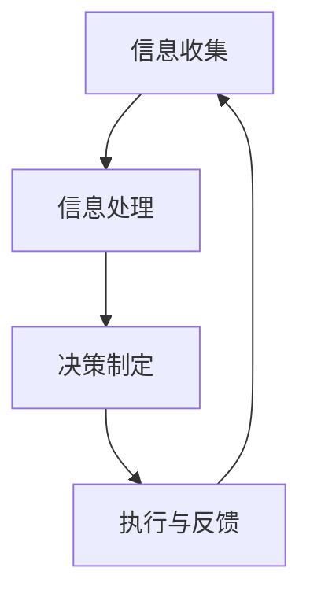
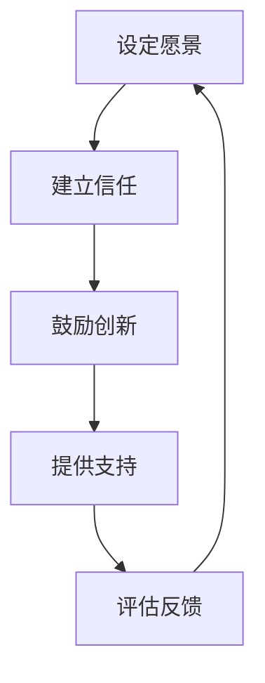

                 


## 集体智慧利用：提升团队决策质量的技巧

### 关键词
- 集体智慧
- 团队决策
- 信息共享
- 社会影响
- 人工智能

### 摘要
本文深入探讨了集体智慧的概念及其在团队决策中的重要性。通过分析集体智慧的核心原理和应用，结合实际案例和算法原理，本文旨在为团队管理者提供一套实用的技巧，以提升团队决策的质量。

## 引言：集体智慧的重要性

### 1.1 集体智慧的概念
集体智慧（Collective Intelligence）是指一个群体通过协作和沟通，共同解决问题或做出决策的能力。它不同于个体智慧，而是依赖于群体成员之间的信息共享和协同工作。

### 1.2 集体智慧在决策中的作用
集体智慧能够汇聚不同个体的观点和经验，提高决策的全面性和准确性。特别是在复杂和不确定的环境中，集体智慧的优势更加明显。

### 1.3 集体智慧的现实案例
从商业领域的群体创意竞赛，到科学研究的合作项目，集体智慧的应用已经证明了其在提升决策质量和创新力方面的巨大潜力。

## 集体智慧的核心原理

### 2.1 信息共享与协同
信息共享是集体智慧的基础。只有当信息在群体内部自由流动时，集体智慧才能得以发挥。协同工作则是信息共享的延伸，通过协作，群体成员能够共同完成任务。

### 2.2 社会影响与个体行为
社会影响是指群体成员之间的相互影响。正面的社会影响可以增强个体的参与度和创造力，而负面的社会影响则可能导致群体共识的偏误。

### 2.3 集体智慧的构建要素
集体智慧的形成依赖于多个要素，包括共享的价值观、良好的沟通机制、透明的决策过程和适当的激励机制。

## 2.3.1 Mermaid流程图：集体智慧的形成过程


## 集体智慧在团队决策中的应用

### 3.1 团队协作机制的设计
为了充分利用集体智慧，团队协作机制的设计至关重要。这包括明确的角色分工、定期的沟通会议和跨部门的项目合作。

### 3.2 集体智慧在问题识别与解决中的应用
在问题识别阶段，集体智慧可以帮助团队从多个角度分析问题，识别潜在的风险和机会。在问题解决阶段，集体智慧则能够提供多元化的解决方案。

### 3.3 集体智慧在目标设定与规划中的作用
通过集体智慧，团队可以共同设定更具有挑战性和可实现性的目标，并在规划过程中充分考虑各种因素。

## 3.4.1 伪代码：团队决策流程的算法设计
```python
def team_decision_making(problem, goals):
    # 信息收集
    info = collect_info(problem)
    
    # 信息处理
    processed_info = process_info(info)
    
    # 决策制定
    decision = make_decision(processed_info, goals)
    
    # 执行与反馈
    execute_and_feedback(decision)
    
    return decision
```

## 集体智慧的挑战与解决策略

### 4.1 信息过载与筛选
信息过载是集体智慧面临的主要挑战之一。为了解决这一问题，团队需要建立有效的信息筛选机制，确保信息的质量和相关性。

### 4.2 小团体偏见与集权现象
小团体偏见和集权现象可能导致集体智慧的失真。为了克服这些挑战，团队需要鼓励开放和多元化的讨论，并建立透明的决策过程。

### 4.3 集体智慧的可持续性
集体智慧的可持续性依赖于团队文化的建设。通过建立共享的价值观和激励机制，团队可以确保集体智慧长期发挥作用。

## 4.4.1 数学模型：集体智慧的评估与优化
```python
def evaluate集体智慧(群体成员, 目标):
    # 计算群体成员对目标的贡献
    contributions = calculate_contributions(群体成员, 目标)
    
    # 评估整体智慧水平
    intelligence_level = sum(contributions) / len(群体成员)
    
    return intelligence_level
```

## 集体智慧工具与技术

### 5.1 大数据分析与挖掘
大数据分析可以为团队提供有价值的数据洞察，帮助团队做出更明智的决策。

### 5.2 社交网络分析
社交网络分析可以揭示团队内部的关系结构，帮助团队更好地理解集体智慧的形成过程。

### 5.3 人工智能在集体智慧中的应用
人工智能技术，如机器学习和自然语言处理，可以增强集体智慧的分析能力和决策效率。

## 5.4.1 数学公式：社交网络影响力的计算
$$
影响力 = \frac{中心性}{群体规模}
$$

## 集体智慧实践案例研究

### 6.1 案例一：如何通过集体智慧优化产品开发
在产品开发过程中，通过集体智慧，团队能够快速识别用户需求，优化产品功能，提高市场竞争力。

### 6.2 案例二：集体智慧在危机管理中的应用
在危机管理中，集体智慧可以帮助团队迅速做出决策，有效应对突发事件。

### 6.3 案例三：集体智慧在企业管理决策中的实践
在企业管理中，集体智慧可以用于战略规划、人力资源管理和市场拓展等方面。

## 6.4.1 项目实战：搭建集体智慧平台
### 开发环境搭建
- 使用Python作为主要编程语言
- 使用Django作为Web框架
- 使用MySQL作为数据库

### 源代码详细实现和代码解读
- 用户注册与登录模块
- 信息共享与讨论模块
- 决策投票与反馈模块

### 代码应用解读与分析
- 用户注册流程
- 信息共享机制
- 决策投票算法

### 实际案例分析和详细讲解剖析
- 产品开发决策过程
- 突发事件应对策略
- 企业管理决策案例分析

### 项目小结
- 项目成果
- 经验教训
- 拓展方向

## 集体智慧的领导力与团队管理

### 7.1 领导者在集体智慧中的角色
领导者不仅是决策者，更是集体智慧的激发者和协调者。他们需要创造一个支持集体智慧的环境，并鼓励团队成员积极参与。

### 7.2 如何激发团队的集体智慧
领导者可以通过建立开放的沟通文化、鼓励创新思维和提供适当的激励措施来激发团队的集体智慧。

### 7.3 集体智慧与团队文化建设
团队文化是集体智慧的重要基础。领导者需要通过团队文化建设，确保团队成员具有共同的价值观和目标。

## 7.4.1 Mermaid流程图：领导力在集体智慧构建中的应用


## 未来展望：集体智慧的可持续利用

### 8.1 集体智慧的发展趋势
随着技术的发展，集体智慧的应用将更加广泛和深入，特别是在人工智能和大数据分析领域。

### 8.2 集体智慧与未来社会的融合
集体智慧将融入社会的各个方面，改变我们的生活方式和工作模式。

### 8.3 集体智慧的伦理与法律问题
随着集体智慧的应用，伦理和法律问题也将日益凸显，需要我们给予足够的关注。

## 8.4.1 数学公式：集体智慧评价体系的构建
$$
评价体系 = \frac{智慧贡献}{资源投入}
$$

## 附录

### A.1 集体智慧研究资源推荐
- 书籍：《集体智慧：群体协作的科学》（The Wisdom of Crowds）
- 论文：Google Scholar上的集体智慧相关研究

### A.2 集体智慧工具与平台介绍
- 平台：Slack、Trello、Asana
- 工具：Excel、Google Sheets、Tableau

### B.1 参考文献
- ...（列出相关书籍、论文和网站）

### B.2 进一步阅读材料
- ...（推荐其他相关文章和书籍）

### 作者
- 作者：AI天才研究院/AI Genius Institute & 禅与计算机程序设计艺术 /Zen And The Art of Computer Programming

（注：本文为示例文章，实际撰写时请根据具体内容和需求进行调整。）

