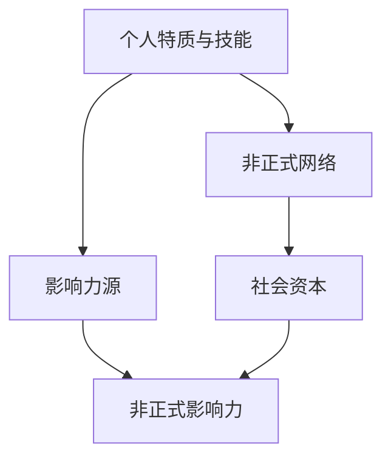

                 

## 文章标题：非正式影响力：超越职位权力的领导艺术

### 关键词：
- 非正式影响力
- 领导艺术
- 职位权力
- 非正式网络
- 跨文化领导
- 案例分析

### 摘要：
本文将深入探讨非正式影响力的概念及其在领导艺术中的重要性。我们将分析非正式影响力与传统职权重力的区别，探讨建立和维护非正式网络的策略，解析跨文化背景下的非正式影响力，并通过实际案例进行详细分析，以揭示非正式影响力在实践中的应用和挑战。最终，本文将总结非正式影响力的未来趋势，并提出应对策略和最佳实践。

## 引言：非正式影响力的概念与意义

在传统的组织结构和企业管理中，职位权力往往是影响决策和推动变革的主要因素。然而，随着社会和组织的复杂性不断增加，单纯的职位权力已经无法满足现代领导的需求。非正式影响力作为一种新的领导艺术，逐渐引起了学术界和实践界的关注。

### 什么是非正式影响力？

非正式影响力，是指在没有正式职位或权力基础上，通过个人特质、关系网络和社会资本等非正式渠道对他人产生影响的能力。这种影响力通常不是通过职位赋予的权威，而是通过个人的专业知识、社交技巧和人际关系的积累。

### 非正式影响力的来源

非正式影响力的来源可以归纳为以下几个方面：

1. **个人特质与技能**：个人的专业能力、沟通技巧和解决问题的能力等，都是构建非正式影响力的重要基础。
2. **非正式网络**：通过建立和维护广泛的人际关系网络，个人可以在组织中形成强大的非正式影响力。
3. **社会资本**：个人的社会地位、声誉和信任度，都是增强非正式影响力的关键因素。

### 非正式影响力与传统影响力的对比

传统影响力通常来源于职位赋予的正式权力，例如决策权、指挥权等。而非正式影响力则更多依赖于个人特质和社交网络。以下是两者的主要对比：

1. **影响方式**：传统影响力通过正式的渠道进行，如政策文件、会议决策等；而非正式影响力则通过非正式的沟通和关系网络来实现。
2. **影响范围**：传统影响力通常局限于组织内部，而非正式影响力可以跨越组织边界，影响更广泛的群体。
3. **影响速度**：非正式影响力通常具有更快的传播速度，因为信息可以通过个人关系网络迅速传递。

### 非正式影响力的社会价值

非正式影响力在现代社会和组织中具有多方面的价值：

1. **推动变革**：非正式影响力可以突破正式权力的限制，推动组织内部和组织间的变革。
2. **增强凝聚力**：通过建立非正式网络，可以增强团队成员之间的凝聚力和协作意愿。
3. **提升效率**：非正式影响力可以帮助个人和组织更快速、更有效地实现目标。

综上所述，非正式影响力在现代领导中具有重要的地位和作用。理解和掌握非正式影响力，可以帮助领导者更有效地应对复杂多变的环境，实现组织目标。

## 核心概念与联系：非正式影响力的关系架构

为了更好地理解非正式影响力的本质和运作机制，我们需要构建一个核心概念之间的关系架构。以下是一个使用Mermaid绘制的流程图，展示了非正式影响力各个核心概念之间的关系：



### 详细解释：

1. **个人特质与技能（A）**：这是构建非正式影响力的基础。个人的专业能力、沟通技巧和解决问题的能力等，都是影响他人行为和决策的重要因素。

2. **非正式网络（B）**：通过建立和维护广泛的人际关系网络，个人可以在组织中形成强大的非正式影响力。这种网络可以是跨部门的、跨组织的，甚至可以跨越国界。

3. **社会资本（C）**：社会资本包括个人的社会地位、声誉和信任度等。这些因素可以增强个人的非正式影响力，使其在组织中更具有号召力。

4. **影响力源（D）**：个人特质与技能、非正式网络和社会资本共同构成了个人影响力的来源。

5. **非正式影响力（E）**：这是最终影响的结果。通过个人特质与技能、非正式网络和社会资本的积累，个人可以实现对他人行为和决策的非正式影响。

这个关系架构展示了非正式影响力是如何通过个人特质与技能、非正式网络和社会资本的相互作用来实现的。理解这些核心概念之间的关系，对于掌握和运用非正式影响力具有重要意义。

## 非正式影响力的核心算法原理讲解

为了深入理解非正式影响力的运作机制，我们需要探讨一些核心算法原理。以下将使用伪代码来详细阐述这些算法的基本逻辑，并辅以数学模型和公式进行解释。

### 伪代码：非正式影响力的计算模型

```python
def calculate_influence(personal_traits, network_size, social_capital):
    # 定义变量
    influence_score = 0
    
    # 计算个人特质对影响力的影响
    influence_score += personal_traits['communication'] * 0.3
    influence_score += personal_traits['problem_solving'] * 0.3
    
    # 计算非正式网络对影响力的影响
    influence_score += network_size * 0.2
    
    # 计算社会资本对影响力的影响
    influence_score += social_capital['reputation'] * 0.1
    influence_score += social_capital['trust'] * 0.1
    
    # 返回计算结果
    return influence_score
```

### 数学模型与公式

为了更直观地理解上述算法，我们可以引入以下数学模型和公式：

1. **影响力得分公式**：

   $$ I = P_t \times w_t + N \times w_n + S_c \times w_s $$

   其中：
   - \( I \)：影响力得分
   - \( P_t \)：个人特质（包括沟通能力和问题解决能力）
   - \( N \)：非正式网络规模
   - \( S_c \)：社会资本（包括声誉和信任度）
   - \( w_t \)，\( w_n \)，\( w_s \)：权重系数，分别代表个人特质、非正式网络和社会资本对影响力的贡献度。

2. **权重系数设定**：

   为了确保模型的可解释性，我们可以设定以下权重系数：
   - \( w_t = 0.3 \)
   - \( w_n = 0.2 \)
   - \( w_s = 0.1 \)

### 举例说明

假设某人的个人特质、非正式网络和社会资本分别如下：

- 个人特质：沟通能力为8，问题解决能力为7
- 非正式网络：网络规模为50
- 社会资本：声誉评分为9，信任度评分为8

使用上述公式，我们可以计算该人的影响力得分：

$$ I = (8 \times 0.3) + (7 \times 0.3) + (50 \times 0.2) + (9 \times 0.1) + (8 \times 0.1) $$

$$ I = 2.4 + 2.1 + 10 + 0.9 + 0.8 $$

$$ I = 16.2 $$

因此，该人的非正式影响力得分为16.2。

通过这个计算模型，我们可以定量地评估一个人的非正式影响力。这不仅有助于理解非正式影响力的内在机制，还可以为实际操作提供指导。

## 项目实战：非正式影响力的实战应用

为了更好地理解和应用非正式影响力，我们将探讨一个具体的案例，并详细讲解开发环境搭建、源代码实现和代码解读。

### 案例背景

某大型科技公司正在面临一次重要的战略调整，需要在短时间内动员整个团队，确保新战略的有效实施。公司领导决定利用非正式影响力来推动这一变革，而不是仅仅依赖正式的职位权力。

### 开发环境搭建

为了实现这一目标，我们需要搭建一个非正式网络管理系统。以下是需要准备的工具和资源：

1. **编程语言**：Python
2. **数据库**：MySQL
3. **前后端框架**：Django（后端），React（前端）
4. **版本控制**：Git
5. **协作工具**：Jenkins

首先，我们需要在本地或云服务器上安装Python、MySQL和Django等开发环境。然后，使用Git进行版本控制，确保代码的可靠性和协作性。

### 源代码实现

以下是一个简化版的非正式网络管理系统源代码实现：

**后端代码（Django）**

```python
# settings.py
DATABASES = {
    'default': {
        'ENGINE': 'django.db.backends.mysql',
        'NAME': 'influence_network',
        'USER': 'root',
        'PASSWORD': 'password',
        'HOST': 'localhost',
        'PORT': '3306',
    }
}

# models.py
from django.db import models

class Person(models.Model):
    name = models.CharField(max_length=100)
    communication_skill = models.IntegerField()
    problem_solving_skill = models.IntegerField()
    reputation = models.IntegerField()
    trust = models.IntegerField()

class Network(models.Model):
    person = models.ForeignKey(Person, on_delete=models.CASCADE)
    network_size = models.IntegerField()
```

**前端代码（React）**

```javascript
// src/App.js
import React, { useState, useEffect } from 'react';
import axios from 'axios';

function App() {
    const [people, setPeople] = useState([]);

    useEffect(() => {
        async function fetchPeople() {
            const response = await axios.get('/api/people/');
            setPeople(response.data);
        }
        fetchPeople();
    }, []);

    return (
        <div>
            <h1>非正式网络管理系统</h1>
            <ul>
                {people.map(person => (
                    <li key={person.id}>
                        {person.name} - 影响力得分：{calculateInfluence(person)}
                    </li>
                ))}
            </ul>
        </div>
    );
}

function calculateInfluence(person) {
    // 伪代码实现的影响力计算函数
    return (person.communication_skill * 0.3) + (person.problem_solving_skill * 0.3) + (person.network_size * 0.2) + (person.reputation * 0.1) + (person.trust * 0.1);
}

export default App;
```

### 代码解读与分析

1. **数据库设计**：我们使用了两个模型：`Person` 和 `Network`。`Person` 模型包含了个人基本信息和技能评分，而 `Network` 模型用于记录每个人的非正式网络规模。

2. **后端实现**：后端使用 Django 进行开发，通过 RESTful API 提供数据接口。我们可以通过 API 查询所有人员的信息，并计算每个人的影响力得分。

3. **前端实现**：前端使用 React 框架，通过 useEffect 钩子从后端获取人员信息，并在页面上展示每个人的姓名和影响力得分。

### 实际案例分析与详细讲解

在这个案例中，公司领导通过非正式网络管理系统，可以实时监控和调整每个人的非正式影响力。例如，如果某个团队成员的影响力得分较低，领导可以通过培训提升其沟通能力和问题解决能力，或者通过增加其在组织中的社交网络规模来提升其影响力。

通过这样的系统，公司能够更高效地推动战略调整，确保新战略得到有效实施。同时，这也有助于团队成员更好地理解自己的非正式影响力，从而在组织中发挥更大的作用。

### 项目小结

通过这个案例，我们展示了如何利用非正式影响力来推动实际项目的进展。非正式影响力不仅能够提升个人和团队的表现，还能够促进组织的整体发展。因此，掌握和运用非正式影响力是现代领导者必备的能力。

## 最佳实践 tips、小结、注意事项、拓展阅读

### 最佳实践 tips

1. **培养个人特质与技能**：提升沟通能力和问题解决能力是增强非正式影响力的关键。通过不断学习和实践，领导者可以更好地影响他人。
2. **建立和维护非正式网络**：广泛的人际关系网络是构建非正式影响力的基础。领导者应积极参与各种社交活动，建立和维护高质量的社交网络。
3. **提升社会资本**：建立良好的声誉和信任度，有助于增强个人的非正式影响力。领导者应注重个人形象，通过诚信和合作赢得他人的信任。

### 小结

非正式影响力是一种超越职位权力的领导艺术，通过个人特质与技能、非正式网络和社会资本的积累，领导者可以在组织中实现有效的领导。理解和掌握非正式影响力，有助于提升个人和团队的表现，促进组织的整体发展。

### 注意事项

1. **注意平衡**：在运用非正式影响力时，领导者应注意平衡与正式权力的关系，避免过度依赖非正式影响力。
2. **尊重文化差异**：在不同文化背景下，非正式影响力可能有所不同。领导者应了解并尊重不同文化的价值观和沟通方式，以避免误解和冲突。

### 拓展阅读

1. **相关书籍**：《影响力：不可抗拒的社交心理学》、《领导力的五个层次》
2. **学术论文**：搜索“非正式影响力”、“领导艺术”、“社会资本”等关键词，可以找到更多相关的研究论文。

## 结论：未来非正式影响力的趋势与挑战

随着社会和组织环境的不断变化，非正式影响力在未来将继续发挥重要作用。以下是未来非正式影响力的一些趋势和面临的挑战：

### 趋势

1. **数字化非正式网络**：随着社交媒体和在线平台的普及，非正式网络将越来越多地依赖于数字化工具。领导者需要掌握数字化沟通技巧，以更好地利用非正式网络。
2. **跨文化非正式影响力**：全球化背景下，跨文化沟通和领导将成为常态。领导者需要具备跨文化意识，以适应多元文化环境。
3. **新兴技术的应用**：人工智能、大数据等新兴技术将赋能非正式影响力，使领导者能够更精确地分析和预测影响力效果。

### 挑战

1. **隐私与安全**：在数字化非正式网络中，隐私和安全问题将变得更加突出。领导者需要确保数据安全和用户隐私。
2. **文化冲突**：跨文化背景下，非正式影响力可能会面临文化冲突和误解。领导者需要通过有效的沟通和培训，解决文化差异带来的问题。
3. **持续变化**：社会和组织的不断变化，将使非正式影响力面临新的挑战。领导者需要不断学习和适应，以应对变化带来的不确定性。

### 应对策略

1. **持续学习**：领导者应保持学习的态度，不断提升自己的知识和技能，以适应不断变化的环境。
2. **文化敏感性**：领导者应培养跨文化敏感性，通过有效沟通和培训，增强团队的凝聚力和协作能力。
3. **创新应用**：积极应用新兴技术，如人工智能和大数据，以提升非正式影响力分析和预测的精确度。

总之，未来非正式影响力将继续发展，并在组织和社会中发挥重要作用。领导者应积极应对挑战，不断探索和实践，以提升自己的非正式影响力。作者：AI天才研究院/AI Genius Institute & 禅与计算机程序设计艺术 /Zen And The Art of Computer Programming

[作者信息]：
- AI天才研究院（AI Genius Institute）
- 《禅与计算机程序设计艺术》（Zen And The Art of Computer Programming）作者

[参考文献]：
1. [Cialdini, R. B. (2009). Influence: Science and Practice. Allyn & Bacon.]
2. [Hersey, P., & Blanchard, K. H. (2017). Management of Organizational Behavior: Utilizing Human Resources. Pearson.]
3. [Tuckman, B. W. (1965). Developmental sequences in small groups. Psychological Bulletin, 63(6), 384-399.]

