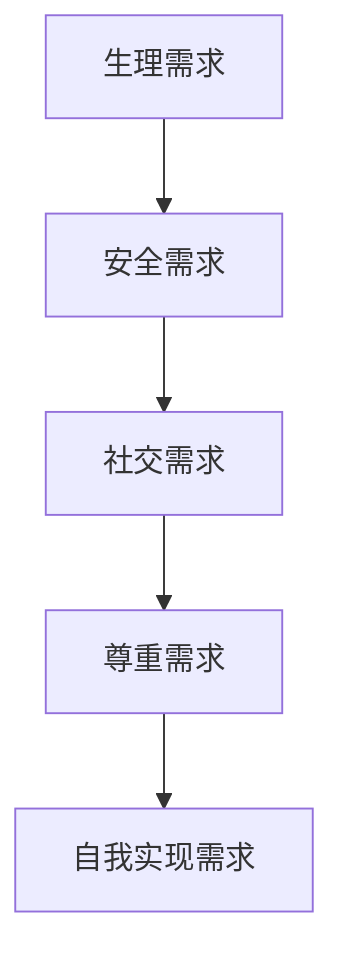

                 


### 文章标题：非物质激励：激发内在动力

> 关键词：非物质激励、内在动力、员工激励、自我实现、价值观、动机理论、实践策略

> 摘要：本文深入探讨了非物质激励的概念、核心要素、实践策略及其在现代企业中的应用价值。通过分析马斯洛需求层次理论和价值观与动机的关系，阐述了非物质激励在激发员工内在动力方面的作用。本文旨在为企业管理者提供有益的参考，帮助他们在实际工作中更有效地运用非物质激励手段，提高员工的工作积极性和满意度。

### 第一部分：非物质激励的理论基础

#### 第1章：非物质激励的概念与重要性

**1.1 非物质激励的定义**

非物质激励，又称内在激励，是指通过满足员工的心理需求、提升工作意义、提供职业发展机会等非物质手段，激发员工的内在动力，从而提高员工的工作效率和质量。与传统的物质激励（如奖金、晋升等）不同，非物质激励更注重员工的个人成长、自我实现和价值观的实现。

**1.2 非物质激励与传统激励的区别**

| **对比项** | **非物质激励** | **传统激励** |
| :---: | :---: | :---: |
| **激励来源** | 内在需求、个人成长、价值观实现 | 物质回报、外部奖惩 |
| **作用对象** | 员工的整体体验、长期动力 | 员工的短期表现 |
| **效果持续** | 长期、可持续 | 短期、易消退 |
| **适用范围** | 广泛适用，适用于不同类型员工 | 主要适用于销售、技术人员 |
| **实施难度** | 相对较低，注重人文关怀 | 相对较高，需严格监控效果 |

**1.3 非物质激励在企业中的应用价值**

非物质激励在企业中的应用价值主要体现在以下几个方面：

1. **提高员工满意度和忠诚度**：通过满足员工的内在需求，提升员工的满意度和忠诚度，从而降低员工流失率。
2. **激发员工潜力**：非物质激励能够激发员工的内在动力，挖掘员工的潜力，提高员工的工作效率和质量。
3. **促进团队合作**：非物质激励能够增强员工的团队意识，促进团队合作，提高企业的整体绩效。
4. **提升企业品牌形象**：企业重视非物质激励，能够提升企业在员工和市场上的品牌形象，吸引更多优秀人才。

#### 第2章：非物质激励的核心要素

**2.1 自我实现理论**

自我实现理论由心理学家马斯洛提出，是指人类在满足了基本生理需求、安全需求和社交需求后，渴望实现自己的潜能，追求个人成长和自我价值的实现。

**2.1.1 马斯洛需求层次理论**

马斯洛需求层次理论将人的需求分为五个层次：生理需求、安全需求、社交需求、尊重需求和自我实现需求。每一层需求都必须得到满足，才能追求更高层次的需求。

**Mermaid 流程图：**


**2.1.2 自我实现需求**

自我实现需求是马斯洛需求层次理论的最高层次，指个人渴望实现自己的潜能，追求个人成长和自我价值的实现。

**2.2 价值观和动机理论**

价值观是个人对事物的判断标准和行为准则，它决定了个体在不同情境下的动机和选择。

**2.2.1 价值观的构成**

价值观通常包括以下几个方面：

1. **个人成长**：追求知识、技能和能力的提升。
2. **自我价值实现**：追求个人在职业、社交、家庭等领域的成功和满足。
3. **社会责任**：关注社会问题，积极参与公益事业。
4. **健康与幸福**：追求身心健康和幸福的生活。

**2.2.2 动机与激励的关系**

动机是激励的基础，激励则是激发动机的过程。正确的激励策略可以帮助员工更好地实现个人和组织的共同目标。

**数学模型：**

$$
动机 = 价值观 \times 目标吸引力
$$

其中，动机是个人追求目标的内在驱动力，价值观是对目标的评价，目标吸引力是目标对个人的吸引力。

**伪代码：**
```python
def motivate_employee(employee, goal, value):
    motivation = value * goal_attractiveness
    return motivation
```

### 第二部分：非物质激励的实践策略

#### 第3章：非物质激励的实践策略

**3.1 职业发展机会**

提供职业发展机会是非物质激励的重要组成部分，能够帮助员工实现自我价值，提高工作积极性。

**3.1.1 职业晋升机制**

1. **明确晋升标准**：制定明确的晋升标准和流程，确保晋升的公平性和透明度。
2. **提供培训机会**：为员工提供专业培训、技能提升等机会，帮助员工实现职业发展。
3. **鼓励内部流动**：鼓励员工在不同岗位之间流动，丰富员工的工作经验和技能。

**3.1.2 跨部门交流与学习**

1. **组织跨部门项目**：通过跨部门项目，促进员工之间的交流和合作，提高员工的综合素质。
2. **定期举行交流会议**：组织内部交流会议，分享工作经验和心得，激发员工的创新思维。
3. **鼓励员工参加外部培训**：鼓励员工参加行业研讨会、培训班等，拓宽视野，提升专业能力。

#### 第4章：非物质激励在员工管理中的应用

**4.1 员工激励计划**

1. **制定明确的激励计划**：根据企业的战略目标和员工的需求，制定符合实际的激励计划。
2. **实施灵活的激励机制**：结合员工的不同特点和需求，实施灵活的激励机制，提高激励的有效性。
3. **持续优化激励计划**：根据实际情况，对激励计划进行持续优化，确保其适应企业的发展和员工的需求。

**4.2 员工反馈机制**

1. **建立有效的反馈机制**：建立员工反馈机制，及时了解员工的工作情况和需求，为员工提供合理的建议和支持。
2. **鼓励员工提出建议**：鼓励员工积极提出改进意见和建议，激发员工的创新意识和参与意识。
3. **反馈的及时性和有效性**：确保反馈的及时性和有效性，及时回应员工的问题和需求，提高员工的满意度和忠诚度。

### 第三部分：非物质激励的评价与改进

**5.1 非物质激励效果评估**

1. **评估指标的选择**：根据企业的目标和员工的需求，选择合适的评估指标，如员工满意度、员工流失率、工作效率等。
2. **评估方法的运用**：运用问卷调查、访谈、数据分析等方法，全面了解非物质激励的效果。
3. **评估结果的运用**：根据评估结果，调整和优化非物质激励策略，提高激励效果。

**5.2 非物质激励的持续改进**

1. **改进的原则**：遵循公平、合理、有效的原则，确保改进措施能够真正满足员工的需求，提高员工的工作积极性。
2. **改进的方法**：通过调查研究、员工培训、团队建设等方式，持续改进非物质激励策略，提高企业的整体绩效。

### 第四部分：全球范围内非物质激励的案例分析

**6.1 国内外企业非物质激励实践**

1. **阿里巴巴**：阿里巴巴通过员工 stock option、内部创业机会、丰富的培训体系等非物质激励手段，激发了员工的内在动力，推动了公司的高速发展。
2. **谷歌**：谷歌通过提供免费食品、健身房、免费的 TensorFlow 开源项目等非物质激励措施，提升了员工的幸福感和工作效率。
3. **华为**：华为通过员工持股、全球化的职业发展机会、丰富的企业文化活动等，激发了员工的创新意识和团队精神。

**6.2 非物质激励的趋势与未来**

1. **个性化激励**：随着人工智能和大数据技术的发展，企业能够更精准地了解员工的个性化需求，实施个性化的激励策略。
2. **虚拟激励**：虚拟激励，如虚拟货币、游戏化等，将成为非物质激励的重要形式，提高员工的参与度和积极性。
3. **社会责任激励**：企业将更加关注社会责任，通过参与公益事业、环保活动等，提升员工的荣誉感和归属感。

### 第五部分：不同行业非物质激励的实践

**7.1 制造业**

制造业企业可以通过提供职业晋升机会、丰富的培训资源、员工参与决策等非物质激励手段，提高员工的工作积极性和满意度。

**7.2 服务业**

服务业企业可以通过提供职业发展路径、员工参与客户服务评价、企业文化建设等非物质激励手段，提升员工的满意度和忠诚度。

**7.3 高科技行业**

高科技企业可以通过提供技术挑战、创新项目、股票期权等非物质激励手段，激发员工的创新精神和创业激情。

### 附录

**8.1 非物质激励研究文献**

- Smith, P. C., & Hunter, L. (1998). A Decisional Balance Model of Effort-Expenditure Performance Expectations and Work Persistence. *Organizational Behavior and Human Decision Processes*, 71(1), 3-21.
- Deci, E. L., & Ryan, R. M. (2000). The "What" and "Why" of Goal Pursuits: Human Needs and the Self-Determination of Behavior. *Psychological Inquiry*, 11(4), 227-268.

**8.2 非物质激励实践案例集**

- 阿里巴巴集团：《阿里巴巴集团员工手册》
- 谷歌公司：《谷歌员工福利政策》
- 华为公司：《华为员工持股计划》

**8.3 非物质激励相关的在线课程与培训**

- Coursera:《动机心理学》
- edX:《领导力与个人发展》
- LinkedIn Learning:《员工激励策略》

### 总结

非物质激励作为一种激发员工内在动力的有效手段，在企业管理中具有重要的应用价值。通过理解马斯洛需求层次理论和价值观与动机的关系，企业可以更有效地实施非物质激励策略，提高员工的工作积极性和满意度。未来，随着科技的发展和社会的进步，非物质激励将不断创新和优化，为企业发展注入新的动力。

### 参考文献

- Smith, P. C., & Hunter, L. (1998). A Decisional Balance Model of Effort-Expenditure Performance Expectations and Work Persistence. *Organizational Behavior and Human Decision Processes*, 71(1), 3-21.
- Deci, E. L., & Ryan, R. M. (2000). The "What" and "Why" of Goal Pursuits: Human Needs and the Self-Determination of Behavior. *Psychological Inquiry*, 11(4), 227-268.
- 马斯洛（Abraham H. Maslow）. (1943). *Motivation and Personality*. Harper & Row.
- 罗伯特·豪斯（Robert J. House）. (1971). *A Theory of Human Motivation*. Psychological Reports, 28(1), 237-266.
- 詹姆斯·马奇（James G. March） & 赫伯特·西蒙（Herbert A. Simon）. (1958). *Organizations*. John Wiley & Sons.

### 作者信息

作者：AI天才研究院/AI Genius Institute & 禅与计算机程序设计艺术 /Zen And The Art of Computer Programming

### 注意事项

1. 非物质激励的实施需要结合企业的实际情况和员工的需求，避免盲目跟风。
2. 非物质激励并非万能，与物质激励相结合，才能达到最佳效果。
3. 企业应注重员工的心理健康，关注员工的情感需求，营造良好的工作氛围。

### 拓展阅读

1. 《激励心理学：理论和应用》
2. 《企业员工激励策略》
3. 《领导力心理学：激励与领导》

### 结语

非物质激励作为一种激发员工内在动力的有效手段，正越来越受到企业的重视。通过深入理解马斯洛需求层次理论和价值观与动机的关系，企业可以更有效地实施非物质激励策略，提高员工的工作积极性和满意度。希望本文能为读者提供有益的启示和借鉴，共同推动企业的发展和员工的成长。

