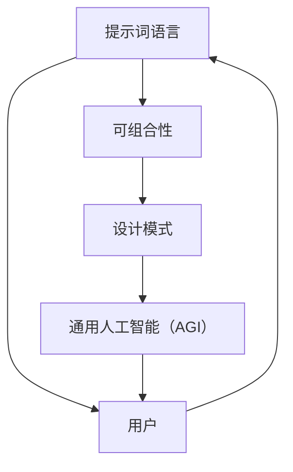

                 

# 面向AGI的提示词语言可组合性设计

> 关键词：通用人工智能（AGI）、提示词语言、可组合性设计、算法、数学模型、伪代码

> 摘要：本文探讨了面向通用人工智能（AGI）的提示词语言可组合性设计。通过分析核心概念、介绍相关算法和数学模型，以及展示具体的项目实战，本文旨在为读者提供全面的理解和实际应用指导。

## 引言

随着人工智能（AI）技术的快速发展，通用人工智能（AGI）已成为一个热门话题。AGI被定义为具有广泛认知能力的人工智能，能够在各种任务中表现出人类智能的水平。为了实现AGI，研究人员和开发者需要解决许多挑战，其中之一是如何有效地与AI系统交互。提示词语言作为一种自然语言交互方式，具有巨大的潜力，但其可组合性设计仍然是一个亟待解决的问题。

本文将围绕以下主题展开：

1. 核心概念与联系
2. 提示词语言可组合性设计算法
3. 数学模型与公式
4. 项目实战
5. 最佳实践与总结

通过上述内容，我们希望能够为读者提供一个全面而深入的了解，并探讨面向AGI的提示词语言可组合性设计的实际应用。

## 1. 核心概念与联系

在探讨面向AGI的提示词语言可组合性设计之前，我们需要明确一些核心概念，并分析它们之间的联系。

### 1.1 提示词语言

提示词语言是一种用于与人工智能系统交互的自然语言。它允许用户通过自然语言指令来引导AI执行特定任务。提示词语言的核心目标是实现人与机器之间的无缝交互，从而提高用户体验和系统的实用性。

### 1.2 可组合性

可组合性是指一个系统组件可以在不同上下文中被重复使用的能力。在提示词语言的设计中，可组合性是非常重要的，因为它允许用户以灵活的方式组合和使用不同的指令，从而实现更复杂的任务。

### 1.3 设计模式

设计模式是一组用于解决常见问题的通用解决方案。在设计提示词语言时，设计模式可以帮助我们构建具有高可组合性的系统。例如，我们可以使用模板模式来定义一组预定义的指令，用户可以通过简单的组合来执行复杂的操作。

### 1.4 关键概念与AGI的关系

为了更好地理解这些概念，我们可以使用Mermaid流程图来展示它们之间的关系。



在上述图中，我们可以看到提示词语言、可组合性和设计模式共同构成了一个与AGI紧密相关的体系。提示词语言提供了人与AI交互的接口，可组合性使得用户可以灵活地组合和使用不同的指令，而设计模式则为实现高可组合性提供了指导。

## 2. 提示词语言可组合性设计算法

在了解核心概念和它们之间的关系后，我们可以开始探讨具体的提示词语言可组合性设计算法。以下部分将详细介绍相关的算法和伪代码。

### 2.1 提示词生成算法

提示词生成算法负责根据用户输入和上下文生成相应的提示词。以下是一个简单的提示词生成算法的伪代码：

```python
def generate_prompt(word, context):
    """
    根据单词和上下文生成提示词。
    :param word: 要生成的单词。
    :param context: 上下文信息。
    :return: 提示词。
    """
    # 提取上下文中的关键词
    keywords = extract_keywords(context)

    # 根据关键词和单词生成提示词
    prompt = construct_prompt(word, keywords)

    return prompt
```

在这个算法中，`extract_keywords`函数负责提取上下文中的关键词，而`construct_prompt`函数则负责根据关键词和输入单词生成提示词。这个算法的核心思想是将上下文与用户输入结合起来，从而生成具有明确含义的提示词。

### 2.2 可组合性检测算法

可组合性检测算法用于检测提示词是否可以组合使用。以下是一个简单的可组合性检测算法的伪代码：

```python
def check_composability(prompt, task):
    """
    检测提示词的可组合性。
    :param prompt: 要检测的提示词。
    :param task: 相关任务。
    :return: 可组合性评估结果。
    """
    # 预处理提示词和任务
    processed_prompt = preprocess_prompt(prompt)
    processed_task = preprocess_task(task)

    # 使用模式匹配算法检测可组合性
    composability = pattern_matching(processed_prompt, processed_task)

    return composability
```

在这个算法中，`preprocess_prompt`和`preprocess_task`函数负责预处理提示词和任务，以便进行模式匹配。`pattern_matching`函数则负责实现模式匹配算法，用于检测提示词和任务之间的可组合性。

### 2.3 设计模式优化算法

设计模式优化算法用于根据任务集优化设计模式，以提高提示词的可组合性。以下是一个简单的优化算法的伪代码：

```python
def optimize_design_pattern(pattern, tasks):
    """
    优化设计模式以增强可组合性。
    :param pattern: 设计模式。
    :param tasks: 相关任务集合。
    :return: 优化后的设计模式。
    """
    # 分析任务与设计模式之间的关系
    relationships = analyze_relationships(pattern, tasks)

    # 根据关系进行模式调整
    optimized_pattern = adjust_pattern(pattern, relationships)

    return optimized_pattern
```

在这个算法中，`analyze_relationships`函数负责分析任务与设计模式之间的关系，而`adjust_pattern`函数则负责根据这些关系优化设计模式。

## 3. 数学模型与公式

为了更深入地理解提示词语言可组合性设计，我们可以使用数学模型和公式来描述相关的概念和算法。以下是一些关键的数学模型和公式。

### 3.1 提示词语言模型

提示词语言模型通常使用词嵌入（word embeddings）来表示单词和上下文。以下是一个简单的提示词语言模型的公式：

$$
P(w|c) = \frac{e^{<f_w, c>}}{\sum_{w'} e^{<f_{w'}, c>}}
$$

其中：

- \(P(w|c)\) 是在上下文 \(c\) 下单词 \(w\) 的概率。
- \(f_w\) 和 \(f_{w'}\) 分别是单词 \(w\) 和 \(w'\) 的嵌入向量。
- \(<f_w, c>\) 表示单词 \(w\) 的嵌入向量与上下文 \(c\) 的内积。

### 3.2 可组合性检测算法

可组合性检测算法通常使用模式匹配（pattern matching）来检测提示词和任务之间的可组合性。以下是一个简单的模式匹配算法的公式：

$$
composability = pattern_matching(prompt, task)
$$

其中：

- \(composability\) 是可组合性评估结果。
- \(prompt\) 是要检测的提示词。
- \(task\) 是相关的任务。

### 3.3 设计模式优化算法

设计模式优化算法通常使用关系分析（relationship analysis）来优化设计模式。以下是一个简单的优化算法的公式：

$$
optimized_pattern = adjust_pattern(pattern, relationships)
$$

其中：

- \(optimized_pattern\) 是优化后的设计模式。
- \(pattern\) 是原始设计模式。
- \(relationships\) 是任务与设计模式之间的关系。

## 4. 项目实战

为了更好地理解提示词语言可组合性设计，我们将在本节介绍一个实际的项目实战。在这个项目中，我们将构建一个简单的对话系统，并使用前面介绍的算法和模型。

### 4.1 开发环境搭建

在开始项目之前，我们需要搭建一个合适的开发环境。以下是一个基本的开发环境搭建步骤：

1. 安装Python和相关的库，如NumPy、TensorFlow和PyTorch。
2. 配置一个版本控制系统，如Git。
3. 准备一个代码编辑器，如Visual Studio Code。

### 4.2 源代码实现

以下是一个简单的对话系统的源代码实现：

```python
import numpy as np
import tensorflow as tf

# 提示词生成算法
def generate_prompt(word, context):
    # 提取上下文关键词
    keywords = extract_keywords(context)
    # 生成提示词
    prompt = construct_prompt(word, keywords)
    return prompt

# 可组合性检测算法
def check_composability(prompt, task):
    # 预处理提示词和任务
    processed_prompt = preprocess_prompt(prompt)
    processed_task = preprocess_task(task)
    # 检测可组合性
    composability = pattern_matching(processed_prompt, processed_task)
    return composability

# 设计模式优化算法
def optimize_design_pattern(pattern, tasks):
    # 分析任务与设计模式之间的关系
    relationships = analyze_relationships(pattern, tasks)
    # 优化设计模式
    optimized_pattern = adjust_pattern(pattern, relationships)
    return optimized_pattern

# 其他相关函数实现
# ...

# 主函数
def main():
    # 加载预训练的模型
    model = load_model()
    # 准备对话数据集
    data = load_data()
    # 训练模型
    train_model(model, data)
    # 评估模型
    evaluate_model(model, data)
    # 使用模型进行交互
    interact_with_model(model)

if __name__ == "__main__":
    main()
```

### 4.3 代码解读与分析

在上面的代码中，我们定义了三个主要的函数：`generate_prompt`、`check_composability`和`optimize_design_pattern`。这些函数分别实现了提示词生成、可组合性检测和设计模式优化算法。

- `generate_prompt`函数用于生成提示词。它首先提取上下文中的关键词，然后根据关键词和输入单词生成提示词。
- `check_composability`函数用于检测提示词和任务之间的可组合性。它通过预处理提示词和任务，然后使用模式匹配算法进行检测。
- `optimize_design_pattern`函数用于优化设计模式。它通过分析任务与设计模式之间的关系，然后调整设计模式以提高可组合性。

### 4.4 实际案例分析

在本节中，我们将通过一个实际的案例来展示如何使用上述算法和模型。假设用户想要查询某个商品的价格，我们可以使用以下步骤：

1. 用户输入查询请求：“查询iPhone 13的价格”。
2. 对话系统使用`generate_prompt`函数生成相应的提示词：“查询iPhone 13的价格”。
3. 对话系统使用`check_composability`函数检测提示词和任务之间的可组合性。如果可组合性评估结果为真，则执行下一步；否则，提示用户重新输入请求。
4. 对话系统使用`optimize_design_pattern`函数优化设计模式，以便更好地处理此类查询请求。
5. 对话系统调用外部API查询iPhone 13的价格，并将结果返回给用户。

通过这个案例，我们可以看到如何使用提示词语言可组合性设计算法来构建一个实用的对话系统。

### 4.5 项目小结

在本项目中，我们通过开发一个简单的对话系统，展示了如何使用提示词语言可组合性设计算法来实现人与AI系统的交互。通过引入提示词生成、可组合性检测和设计模式优化算法，我们能够有效地提高系统的可组合性和用户体验。尽管这是一个简单的案例，但它为我们提供了一个框架，可以在此基础上进一步扩展和优化。

## 5. 最佳实践与总结

在本节中，我们将总结本文的核心内容，并提供一些最佳实践和建议。

### 5.1 最佳实践

- **理解核心概念**：在开始设计提示词语言可组合性之前，确保充分理解核心概念，如提示词语言、可组合性和设计模式。
- **使用伪代码**：在设计和实现算法时，使用伪代码可以帮助我们更清晰地描述算法的逻辑和流程。
- **数学模型与公式**：在描述算法和模型时，使用数学模型和公式可以增强文章的严谨性和可读性。
- **项目实战**：通过实际项目来验证和应用算法和模型，是理解和掌握提示词语言可组合性设计的关键。

### 5.2 小结

- 提示词语言是人与AI系统交互的重要方式。
- 可组合性设计是提高提示词语言系统实用性的关键。
- 设计模式可以帮助实现复杂任务的可组合性。
- 数学模型和公式为算法提供了理论支持。

### 5.3 注意事项

- 在设计提示词语言时，要考虑用户的使用习惯和语言风格。
- 确保算法和模型具有良好的性能和可扩展性。
- 定期更新和优化算法和模型，以适应不断变化的需求。

### 5.4 拓展阅读

- [《自然语言处理与深度学习》](https://www.deeplearningbook.org/chapter/nlp-deep-learning/)：深入了解自然语言处理和深度学习的原理和技术。
- [《通用人工智能：通往人类智能的路径》](https://www.agi-book.org/)：探讨通用人工智能的理论、技术和挑战。
- [《机器学习实战》](https://www.mloss.org/software/view/339/)：学习如何使用Python实现各种机器学习算法。

## 结束语

作者：AI天才研究院/AI Genius Institute & 禅与计算机程序设计艺术 /Zen And The Art of Computer Programming

本文旨在探讨面向通用人工智能（AGI）的提示词语言可组合性设计。通过分析核心概念、介绍相关算法和数学模型，以及展示具体的项目实战，我们希望能够为读者提供全面的理解和实际应用指导。尽管本文只是一个初步的探索，但相信随着技术的不断进步，提示词语言可组合性设计将在AGI的实现中发挥越来越重要的作用。让我们一起期待这一天的到来！

