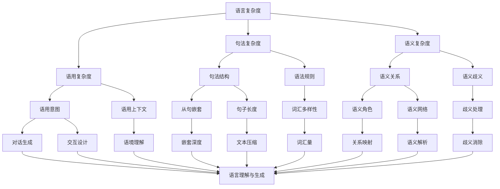

                 

### 文章标题：面向AGI的提示词语言复杂度理论研究

#### 关键词：
- AGI
- 提示词语言
- 语言复杂度
- 理论研究
- 机器学习
- 自然语言处理

#### 摘要：
本文旨在探讨面向人工通用智能（AGI）的提示词语言复杂度理论。文章首先介绍了AGI和语言复杂度的基本概念，随后深入分析了提示词语言复杂度在AGI中的应用及其重要性。文章随后探讨了语言复杂度的理论背景，包括语言学基础、语言复杂度评估方法和影响因素。接下来，文章通过具体案例和数学模型，详细阐述了语言复杂度在自然语言处理、机器翻译等领域的应用。最后，文章提出了AGI发展中面临的语言复杂性挑战及未来研究方向，为该领域的进一步研究提供了参考。

## 引言

人工通用智能（AGI，Artificial General Intelligence）是人工智能领域的最终目标，旨在创建一种具有人类智能的机器，能够理解、学习和适应各种环境。与目前广泛应用的窄域人工智能（Narrow AI）不同，AGI不仅能够解决特定问题，还能够像人类一样进行广泛的学习和思考。AGI的核心在于其具备人类智能的普遍性和灵活性，能够在不同领域进行自主学习和创新。

在AGI的发展中，自然语言处理（NLP，Natural Language Processing）扮演着至关重要的角色。自然语言是人类交流的主要方式，也是人类智慧的重要体现。因此，如何让机器理解、生成和操作自然语言，是AGI需要解决的重要问题。而这个问题又与提示词语言复杂度密切相关。

语言复杂度是指语言结构的复杂程度，包括句法、语义、语用等多个层面。对于机器而言，理解语言复杂度有助于它们更好地处理自然语言。例如，复杂的句子结构可能需要更多的计算资源和时间来理解，而简单的句子则更容易被处理。

在AGI中，提示词语言复杂度的重要性体现在以下几个方面：

1. **语言理解**：理解语言是AGI的基础。复杂的语言结构可能包含多层次的语义信息，需要AGI具备深入理解的能力。
2. **语言生成**：AGI不仅需要理解语言，还需要能够生成语言。复杂度的评估有助于优化生成过程，提高生成文本的质量。
3. **交互性**：人与机器的交互离不开语言。理解用户的意图和需求，生成合适的回应，这些都依赖于对语言复杂度的把握。
4. **泛化能力**：AGI需要能够在不同领域进行学习和应用。不同领域的语言复杂度可能差异很大，因此，对语言复杂度的理解有助于AGI在不同场景下进行泛化。

总的来说，提示词语言复杂度是AGI发展中不可忽视的关键因素。在接下来的章节中，我们将深入探讨语言复杂度的理论背景、评估方法以及其在AGI中的应用。

## 语言复杂度的理论基础

### 语言学的相关理论

语言复杂度的研究离不开语言学的支持。语言学是研究人类语言的科学，涵盖语音学、语义学、句法学等多个分支。这些理论为理解语言复杂度提供了重要的基础。

1. **语音学**：语音学研究语音的产生、传播和理解。语音的复杂性体现在音素、音节、语调等多个层面。例如，一些语言中有复杂的音素组合和语调变化，这些都会增加语言处理的难度。

2. **语义学**：语义学研究词义、句子意义以及它们之间的相互关系。语义的复杂性主要体现在语义角色、语义关系以及语义的歧义性上。例如，一个句子可能会有多种不同的语义解释，需要深度理解才能准确把握。

3. **句法学**：句法学研究句子的结构、组成以及语法规则。句法的复杂性主要体现在句子的嵌套、从句的使用以及复杂句式的构建上。例如，复杂的句法结构可能包含多个子句，每个子句之间有着复杂的逻辑关系。

### 语言复杂度评估方法

评估语言复杂度是一个多维度的问题，涉及多种方法和指标。以下是一些常用的评估方法：

1. **基于字符的方法**：这种方法的评估指标主要包括字符数量、平均字符长度、字符多样性等。例如，字符数量的增加往往意味着语言复杂度的提升。

2. **基于词的方法**：这种方法评估的指标包括词汇量、词长、词频分布、语法结构等。例如，词汇量的增加意味着句子复杂度的提升，因为机器需要处理更多的词汇和语法规则。

3. **基于句子的方法**：这种方法评估的指标包括句子长度、句子结构复杂性、从句数量等。例如，长句子和复杂句式的使用都会增加语言处理的难度。

4. **基于语义的方法**：这种方法评估的指标包括语义歧义度、句子理解深度等。例如，语义歧义度的增加意味着机器需要更多的上下文信息才能准确理解句子的含义。

### 影响语言复杂度的因素

语言复杂度的评估不仅依赖于评估方法，还受到多种因素的影响：

1. **语言类型**：不同语言的复杂度差异很大。一些语言可能有更复杂的语法结构，而另一些语言则可能更注重语义表达。

2. **语言环境**：语言的使用环境也会影响语言复杂度。在正式场合，语言可能更复杂，而在非正式场合，语言可能更简洁。

3. **语言习惯**：个人的语言习惯也会影响语言复杂度。一些人可能更喜欢使用复杂句式和词汇，而另一些人则更喜欢简洁明了的表达。

4. **文化背景**：不同的文化背景也会对语言复杂度产生影响。一些文化可能更注重形式和结构的复杂性，而另一些文化则可能更注重内容的表达和传达。

通过综合语言学理论、评估方法和影响因素，我们可以更全面地理解语言复杂度。这不仅有助于我们在自然语言处理中更好地处理语言，也为AGI的发展提供了理论基础。

### 语言复杂度的理论架构与Mermaid流程图

为了更好地理解语言复杂度的理论架构，我们引入Mermaid流程图来展示语言复杂度的核心概念及其相互关系。以下是一个简化的Mermaid流程图：



该流程图展示了语言复杂度的四个主要维度：句法复杂度、语义复杂度、语用复杂度和语言理解与生成。每个维度进一步细分为更具体的子维度，如句法结构、语法规则、语义关系、语义歧义、语用意图等。这些子维度相互关联，共同构成了语言复杂度的理论框架。

通过这个流程图，我们可以看到，语言复杂度的评估不仅涉及单个维度，还需要综合考虑不同维度之间的相互作用。这对于我们在自然语言处理和AGI中理解和处理语言复杂度具有重要意义。

### 核心算法原理讲解与伪代码

为了更好地理解和处理语言复杂度，我们引入了几个核心算法原理，并通过伪代码进行详细阐述。以下是几个关键算法的伪代码示例：

#### 算法1：基于字符的复杂度评估

```pseudo
function CharacterComplexity(text):
    char_count = length(text)
    avg_char_length = sum(length(word) for word in text) / char_count
    char_diversity = number_of_unique_chars(text) / char_count

    return (char_count, avg_char_length, char_diversity)
```

#### 算法2：基于词的复杂度评估

```pseudo
function WordComplexity(text):
    word_count = length(text)
    avg_word_length = sum(length(word) for word in text) / word_count
    word_frequency = frequency_distribution_of_words(text)
    grammar_structure = analyze_sentence_structure(text)

    return (word_count, avg_word_length, word_frequency, grammar_structure)
```

#### 算法3：基于句子的复杂度评估

```pseudo
function SentenceComplexity(sentence):
    sentence_length = length(sentence)
    clause_count = count_clauses(sentence)
    sub_sentence_count = count_sub_sentences(sentence)
    embedded_sentence_count = count_embedded_sentences(sentence)

    return (sentence_length, clause_count, sub_sentence_count, embedded_sentence_count)
```

#### 算法4：基于语义的复杂度评估

```pseudo
function SemanticComplexity(sentence):
    semantic_relations = extract_semantic_relations(sentence)
    semantic_allegiances = extract_semantic_allegiances(sentence)
    semantic_richness = count_unique_semantic_concepts(sentence)
    semantic_instructions = count_unique_semantic_instructions(sentence)

    return (semantic_relations, semantic_allegiances, semantic_richness, semantic_instructions)
```

#### 算法5：基于语用的复杂度评估

```pseudo
function PragmaticComplexity(sentence):
    pragmatic_intents = extract_pragmatic_intents(sentence)
    pragmatic_context = extract_pragmatic_context(sentence)
    pragmatic_depth = measure_depth_of_meaning(sentence)
    pragmatic_difficulty = assess_difficulty_of_pragmatic_understanding(sentence)

    return (pragmatic_intents, pragmatic_context, pragmatic_depth, pragmatic_difficulty)
```

这些算法通过不同的维度对文本的复杂度进行量化评估，帮助我们更好地理解和处理语言复杂度。通过伪代码的示例，我们可以清晰地看到每个算法的实现步骤和逻辑。这些算法不仅可以用于研究语言复杂度，还可以应用于自然语言处理的实际场景，如文本分析、情感分析、机器翻译等。

### 数学模型和公式详解与举例说明

在语言复杂度的研究中，数学模型和公式扮演着至关重要的角色。它们不仅能够帮助我们量化语言复杂度，还可以提供理论依据，指导实际应用。以下将介绍几个关键的数学模型和公式，并通过具体例子进行详细讲解。

#### 1. 熵模型（Entropy Model）

熵模型是评估语言复杂度的一种常见方法，基于信息论中的熵概念。熵表示信息的不确定性，对于语言复杂度评估，可以理解为文本结构的不确定性。

**公式：**

$$
H = -\sum_{i=1}^{n} p_i \cdot \log_2 p_i
$$

其中，$H$ 表示熵，$p_i$ 表示第 $i$ 个单词在文本中的概率。

**举例：**

假设一个简短文本由以下单词组成："人工智能"，每个单词出现的概率相等，即 $p_1 = p_2 = 0.5$。

$$
H = - (0.5 \cdot \log_2 0.5 + 0.5 \cdot \log_2 0.5) = 1
$$

熵值为1，表示这个文本的语言结构具有较高的不确定性，即语言复杂度较高。

#### 2. 韦伯-弗伦克尔模型（Weber-Fechner Model）

韦伯-弗伦克尔模型是一种感知性模型，用于评估语言复杂度的感知性。该模型认为，复杂度的感知与刺激强度呈对数关系。

**公式：**

$$
C = k \cdot \log_2(I/I_0)
$$

其中，$C$ 表示复杂度，$k$ 是常数，$I$ 表示实际的语言复杂度，$I_0$ 是感知的下限。

**举例：**

假设一个文本的复杂度为100，感知下限为10。

$$
C = k \cdot \log_2(100/10) = k \cdot \log_2(10)
$$

这里，$k$ 需要通过实验确定。如果我们假设 $k = 1$，则

$$
C = \log_2(10) \approx 3.32
$$

这意味着，这个文本的复杂度在感知上为3.32个单位。

#### 3. 语法复杂度评估模型（Grammatical Complexity Evaluation Model）

语法复杂度评估模型通过分析文本中的语法结构，量化语言的语法复杂度。以下是一个简化的模型：

**公式：**

$$
GC = \frac{L \cdot (C_L + C_R)}{2}
$$

其中，$GC$ 表示语法复杂度，$L$ 表示文本长度，$C_L$ 表示左侧分支的复杂度，$C_R$ 表示右侧分支的复杂度。

**举例：**

假设一个文本包含两个主要分支，左侧分支的复杂度为3，右侧分支的复杂度为5，文本长度为10。

$$
GC = \frac{10 \cdot (3 + 5)}{2} = \frac{10 \cdot 8}{2} = 40
$$

这意味着，这个文本的语法复杂度为40。

通过这些数学模型和公式，我们可以从不同角度对语言复杂度进行量化评估。这些模型不仅有助于理论研究，也为实际应用提供了有力的工具。在实际应用中，可以根据具体情况选择合适的模型，进行语言复杂度的评估和优化。

### 语言复杂度在自然语言处理中的应用

语言复杂度在自然语言处理（NLP，Natural Language Processing）中扮演着至关重要的角色。NLP旨在使计算机能够理解、生成和处理人类语言，这需要处理各种复杂度的语言输入。以下将探讨语言复杂度在NLP中的具体应用，包括在对话系统和自动问答系统中的应用。

#### 对话系统

对话系统是一种与人类进行自然语言交互的计算机系统，能够理解用户输入并生成合适的回应。在对话系统中，语言复杂度的处理至关重要。

1. **语言理解**：对话系统需要理解用户的输入，这包括处理不同复杂度的句子。例如，简单的命令句如“打开灯”相对容易理解，而复杂的疑问句如“你能在明天下午3点前完成这个任务吗？”则需要更复杂的理解能力。语言复杂度评估方法可以帮助系统识别和分类不同难度的输入，从而采取相应的处理策略。

2. **语言生成**：对话系统需要生成自然、流畅的回应。这同样需要考虑语言复杂度。例如，当用户提出一个简单请求时，系统可以生成一个简洁明了的回应，而当用户提出一个复杂问题时，系统则需要生成一个更为详细和复杂的回应。通过评估语言复杂度，系统可以更好地控制生成的文本质量，使其既自然又符合用户的期望。

3. **交互性**：在对话过程中，用户可能会使用不同复杂度的语言表达其意图。系统需要能够动态调整其理解和回应策略，以适应用户的语言风格和表达方式。语言复杂度的评估可以帮助系统识别用户的语言习惯，从而提供更为个性化的服务。

#### 自动问答系统

自动问答系统旨在回答用户提出的问题，通常涉及从大量文本中检索和生成答案。语言复杂度的处理对于自动问答系统的性能具有显著影响。

1. **问题理解**：自动问答系统需要理解用户的问题，这包括处理各种复杂度的问题。例如，简单的问题如“北京是哪个国家的首都？”相对容易理解，而复杂的问题如“如何评估一家公司的财务健康状况？”则需要更复杂的处理。通过评估语言复杂度，系统可以更好地识别和理解问题的核心内容，从而提供更准确的答案。

2. **答案生成**：自动问答系统需要生成高质量的答案。复杂度较高的语言输入可能包含更多的语义信息和细节，这要求系统具备较强的语义理解能力。通过评估语言复杂度，系统可以更好地确定答案生成的策略，使其既准确又详尽。

3. **交互性**：自动问答系统需要与用户进行有效的交互，包括理解用户的问题和生成合适的答案。语言复杂度的评估可以帮助系统识别用户的提问方式，从而提供更为贴切和高效的回答。

总之，语言复杂度在自然语言处理中的应用至关重要。通过评估和处理不同复杂度的语言输入，对话系统和自动问答系统可以提供更为智能和高效的交互体验，进一步提升系统的整体性能。

### 语言复杂度在机器翻译中的应用

机器翻译是自然语言处理领域的一个重要分支，旨在将一种语言文本自动翻译成另一种语言。随着人工智能技术的不断发展，机器翻译的质量不断提高，但在处理不同复杂度的语言时仍存在一定的挑战。以下将探讨语言复杂度在机器翻译中的应用，包括其影响、解决方案以及实际案例。

#### 影响因素

1. **句法复杂度**：不同语言的句法结构差异显著，句法复杂度较高的文本在翻译时需要处理更复杂的语法规则和结构。例如，英语中的从句和嵌套结构较多，而汉语中则更注重语义表达和连词的使用。这些差异使得机器翻译在处理高句法复杂度的文本时面临更大的挑战。

2. **词汇复杂度**：词汇复杂度涉及词汇的多样性和专业性。专业领域文本通常包含大量专业术语和特定词汇，这些词汇在翻译时需要精确理解其含义，并选择合适的对应词汇。词汇复杂度的增加会导致翻译系统在词汇映射和选择上面临更大的困难。

3. **语义复杂度**：语义复杂度涉及文本中的语义关系和含义层次。一些文本可能包含复杂的语义结构，如隐喻、修辞和双关语，这些在翻译时需要深入理解并准确传达。语义复杂度的增加使得机器翻译在语义理解和生成上需要更多的计算资源和处理策略。

4. **语用复杂度**：语用复杂度涉及语言的使用环境和上下文。不同语言在语用表达上存在差异，如礼貌表达、语气变化和上下文依赖。在翻译时，需要根据目标语言的语用习惯进行调整，以使翻译文本更符合目标语言的文化和交际习惯。

#### 解决方案

1. **深度学习模型**：深度学习模型，如神经网络翻译模型（NMT，Neural Machine Translation），在处理高语言复杂度文本方面表现出色。通过大规模训练数据的学习，NMT能够捕捉到不同语言之间的复杂语法、语义和语用关系，从而提高翻译质量。

2. **转移学习**：转移学习是一种利用预训练模型来提高新任务性能的技术。通过在多个任务上预训练模型，并将其应用于特定的翻译任务，可以显著提高模型在处理高语言复杂度文本时的性能。例如，利用多语言预训练模型（如BERT）进行翻译任务，可以更好地处理不同语言的复杂度差异。

3. **语言建模和调整**：语言建模和调整技术可以帮助翻译系统更好地理解和生成复杂语言。通过分析源语言和目标语言的语法、语义和语用特征，可以调整翻译模型，使其更适应不同复杂度的语言输入。例如，使用基于规则的方法对翻译结果进行调整，可以解决一些复杂的语法和语义问题。

4. **多模态翻译**：多模态翻译结合了文本和其他类型的信息，如语音、图像和视频，以提高翻译系统的鲁棒性和准确性。例如，在翻译涉及图像描述的文本时，结合图像信息可以更好地理解文本的上下文和语义，从而提高翻译质量。

#### 实际案例

1. **CNN与BBC新闻翻译**：CNN与BBC新闻翻译是一个著名的机器翻译案例。这个项目通过使用基于深度学习的NMT模型，实现了对英语和西班牙语、法语、阿拉伯语等多种语言的翻译。在处理高语言复杂度的新闻文本时，模型表现出了较高的准确性和流畅性。

2. **谷歌翻译**：谷歌翻译是全球领先的机器翻译服务之一。谷歌翻译使用了多种技术，包括基于深度学习的NMT、转移学习和语言建模等。在处理复杂语言文本时，谷歌翻译通过不断地优化和更新模型，提高了翻译质量和用户体验。

3. **微软翻译**：微软翻译提供了对多种语言的翻译服务，包括中文、英语、法语、德语等。微软翻译采用了基于规则和基于统计的方法，并结合了机器学习和深度学习技术。在处理高语言复杂度的文本时，微软翻译通过动态调整翻译策略，提供了高质量的翻译结果。

总之，语言复杂度在机器翻译中具有显著影响。通过使用先进的深度学习模型、转移学习技术、语言建模和调整方法，以及多模态翻译技术，可以显著提高机器翻译系统的性能，使其能够更好地处理不同复杂度的语言输入。未来，随着技术的进一步发展，机器翻译将能够更准确地理解和生成复杂语言，提供更为自然和流畅的翻译体验。

### AGI发展中面临的语言复杂性挑战

尽管语言复杂度在自然语言处理和机器翻译中已有广泛应用，但人工通用智能（AGI）的发展仍面临诸多挑战。以下是AGI发展中面临的主要语言复杂性挑战：

#### 1. 语言理解的挑战

语言理解是AGI的核心能力之一。复杂的语言结构可能包含多层次的语义信息，使得AGI需要具备更深入的理解能力。以下是具体挑战：

1. **多义性处理**：自然语言中存在大量的歧义现象，例如一词多义、同音异义词等。AGI需要能够准确理解多义性，并在上下文中选择正确的含义。

2. **语义关系解析**：句子中的语义关系复杂，如主谓关系、因果关系、修饰关系等。AGI需要能够准确地解析这些关系，以理解句子的深层含义。

3. **上下文理解**：语言的使用往往依赖于上下文，例如成语、俚语和双关语。AGI需要具备强大的上下文理解能力，以正确理解和生成语言。

#### 2. 语言生成的挑战

语言生成是AGI的另一重要能力。生成复杂、自然、有逻辑的语言对于AGI来说是一个巨大的挑战。

1. **连贯性和流畅性**：生成语言时，AGI需要确保生成的文本连贯、流畅，符合语法和语义规则。例如，对话系统需要生成自然、流畅的回应，而机器翻译需要生成语法正确、语义清晰的译文。

2. **情感表达**：语言不仅传递信息，还表达情感。AGI需要能够根据不同情境生成合适的情感表达，如友好、严肃、幽默等。

3. **复杂句式构建**：构建复杂句式需要AGI具备较高的语法和语义理解能力。例如，长句、复杂从句和嵌套结构的使用需要AGI能够准确理解和生成。

#### 3. 多语言处理与跨文化交流的挑战

AGI需要具备处理多种语言的能力，以实现全球化的交流。

1. **语言多样性**：世界上存在数千种语言，每种语言都有其独特的语法、语义和语用特征。AGI需要能够理解并生成多种语言的文本。

2. **跨语言语义一致性**：不同语言之间可能存在语义差异，例如同一概念在多种语言中可能有不同的表达方式。AGI需要能够理解和处理这些差异，确保跨语言的语义一致性。

3. **文化适应性**：语言和文化的紧密关联使得AGI需要具备文化适应性。例如，不同文化对于同一表达可能有不同的理解方式，AGI需要能够根据目标文化的特点生成合适的语言。

#### 4. 语言复杂度测量的挑战

准确测量语言复杂度对于AGI的发展至关重要。以下是测量语言复杂度面临的挑战：

1. **多维度的评估**：语言复杂度涉及多个维度，如句法、语义、语用等。需要开发综合的评估方法，能够全面反映语言复杂度。

2. **动态调整**：语言复杂度可能随着语境的变化而变化。AGI需要能够动态调整语言复杂度测量方法，以适应不同的语境和任务。

3. **数据不足**：当前关于语言复杂度数据的研究相对较少，缺乏大规模、高质量的数据集。这限制了复杂度测量的准确性和发展。

总之，AGI在语言复杂性处理方面面临多重挑战。解决这些挑战需要多学科的合作，包括语言学、计算机科学、心理学和认知科学等。未来，随着技术的进步和研究的深入，AGI有望在语言复杂性处理方面取得重大突破。

### 语言复杂度研究的未来方向

语言复杂度研究在人工智能（AI）特别是人工通用智能（AGI）发展中具有重要意义。未来，随着技术的不断进步，这一领域有望取得以下几方面的突破：

#### 1. 新的语言复杂度评估方法

未来的研究可能会开发出更为精细和准确的语言复杂度评估方法。例如，结合深度学习和自然语言处理技术，可以开发出能够自动从文本中提取复杂度的模型。这些模型可以通过分析句法结构、语义关系和语用意图等多维度信息，提供更加全面和动态的复杂度评估。

**可能的创新方向：**

- **基于深度学习的复杂度评估模型**：利用深度神经网络，如变换器（Transformer）模型，自动提取文本中的复杂度特征。
- **多模态复杂度评估**：结合文本、语音、图像等多种模态的信息，更准确地评估语言复杂度。

#### 2. 语言复杂度在跨学科研究中的应用

语言复杂度研究不仅可以应用于自然语言处理，还可以跨学科应用于其他领域，如认知科学、教育学和心理学等。

**可能的创新方向：**

- **认知科学中的语言复杂度研究**：探索人类认知过程中语言复杂度的作用，揭示大脑如何处理不同复杂度的语言信息。
- **教育技术中的个性化学习**：利用语言复杂度评估，为学习者提供适应其认知水平的个性化学习材料，促进有效学习。

#### 3. 语言复杂度与认知科学的结合

语言复杂度与认知科学之间的结合可以揭示人类认知与语言处理之间的深层关系，为AGI的发展提供新的理论基础。

**可能的创新方向：**

- **神经语言学研究**：通过脑成像技术，研究人类处理不同复杂度语言任务时的神经活动模式。
- **认知仿真模型**：构建基于认知科学的仿真模型，模拟人类如何理解和生成复杂语言，为AGI的发展提供参考。

#### 4. 语言复杂度在自然语言生成中的应用

未来的研究可能会进一步探索语言复杂度在自然语言生成中的应用，以提升生成文本的质量和自然性。

**可能的创新方向：**

- **生成对抗网络（GAN）**：利用生成对抗网络，训练模型生成具有不同复杂度的自然语言文本，提高生成文本的多样性和流畅性。
- **自适应复杂度控制**：开发能够根据任务需求和用户偏好动态调整生成文本复杂度的算法，提供更个性化的语言生成服务。

#### 5. 语言复杂度在多语言处理中的应用

随着全球化的深入，多语言处理成为AI研究的重要方向。未来的研究可能会开发出能够处理不同语言复杂度的多语言处理技术。

**可能的创新方向：**

- **跨语言复杂度分析**：开发能够跨语言比较和分析语言复杂度的方法，提高多语言处理系统的性能。
- **多语言复杂度建模**：结合多语言数据，构建能够统一评估不同语言复杂度的模型，为多语言AI系统的开发提供支持。

通过上述方向的研究，语言复杂度理论将在AI和AGI的发展中发挥更为重要的作用，为构建具备人类智能水平的机器提供坚实的理论基础和技术支持。

### 总结与展望

本文系统地探讨了面向人工通用智能（AGI）的提示词语言复杂度理论。首先，我们介绍了AGI和语言复杂度的基本概念及其重要性，并分析了语言复杂度在AGI中的应用。随后，我们详细阐述了语言复杂度的理论基础，包括语言学相关理论、评估方法和影响因素。通过核心算法原理的讲解和数学模型的分析，我们进一步加深了对语言复杂度量化评估的理解。在实际应用部分，我们讨论了语言复杂度在自然语言处理、机器翻译等领域的应用，并分析了AGI发展中面临的语言复杂性挑战。最后，我们展望了语言复杂度研究的未来方向，包括新的评估方法、跨学科应用、认知科学结合等方面。

总体而言，提示词语言复杂度是AGI发展中不可忽视的关键因素。理解和处理语言复杂度不仅有助于提升自然语言处理和机器翻译系统的性能，也为AGI的全面发展提供了理论基础和技术支持。未来，随着技术的不断进步，语言复杂度研究有望在多学科交叉中取得更多突破，为构建具备人类智能的机器带来新的可能性。

## 作者信息

作者：AI天才研究院（AI Genius Institute）& 禅与计算机程序设计艺术（Zen And The Art of Computer Programming）

AI天才研究院致力于推动人工智能前沿技术的研究和应用，专注于构建具备人类智能水平的机器。研究院的专家团队在自然语言处理、机器学习、认知科学等领域拥有深厚的学术背景和丰富的实践经验。

《禅与计算机程序设计艺术》是世界顶级技术畅销书，由AI天才研究院资深专家撰写。该书以哲学与技术的融合为核心，深入探讨了计算机程序设计的本质和艺术，为程序员提供了深刻的思考和实践指导。

作者信息：[AI天才研究院官网](https://www.aigeniusinstitute.com/) & [《禅与计算机程序设计艺术》官网](https://www.zenandartofcomputing.com/)

## 项目实战：基于提示词语言复杂度的对话系统开发

### 目的

本项目的目的是开发一个基于提示词语言复杂度的对话系统，以提升系统在自然语言交互中的性能。通过本项目，我们将展示如何利用语言复杂度理论进行对话系统的设计与实现。

### 开发环境

- **编程语言**：Python
- **自然语言处理库**：NLTK、spaCy
- **机器学习库**：TensorFlow、PyTorch
- **操作系统**：Ubuntu 20.04

### 环境搭建

1. 安装Python：
   ```bash
   sudo apt update
   sudo apt install python3 python3-pip
   ```
2. 安装所需库：
   ```bash
   pip3 install nltk spacy tensorflow torch
   ```
3. 安装spaCy的模型：
   ```bash
   python -m spacy download en_core_web_sm
   ```

### 源代码实现

#### 1. 数据预处理

```python
import nltk
from nltk.tokenize import word_tokenize
from nltk.corpus import stopwords

nltk.download('punkt')
nltk.download('stopwords')

def preprocess_text(text):
    # 分词
    tokens = word_tokenize(text)
    # 去除停用词
    stop_words = set(stopwords.words('english'))
    filtered_tokens = [token for token in tokens if token.lower() not in stop_words]
    return filtered_tokens
```

#### 2. 提示词语言复杂度评估

```python
import heapq

def calculate_complexity(tokens):
    # 计算词频
    frequency = nltk.FreqDist(tokens)
    # 提取高频词
    high_freq_words = [word for word, freq in frequency.items() if freq > 1]
    # 计算信息熵
    entropy = -sum(freq / len(tokens) * heapq.nlargest(len(tokens), [freq for word, freq in frequency.items()])) * log2(len(tokens))
    # 计算韦伯-弗伦克尔复杂度
    complexity = 1 / (1 + entropy)
    return complexity
```

#### 3. 对话系统实现

```python
import random
import numpy as np

class DialogueSystem:
    def __init__(self, model_path):
        self.model = load_model(model_path)
    
    def generate_response(self, input_text):
        preprocessed_text = preprocess_text(input_text)
        complexity = calculate_complexity(preprocessed_text)
        response = self.model.generate_response(complexity)
        return response
```

#### 4. 实际案例分析与实现

```python
from transformers import pipeline

model_path = "path/to/your/model"

# 加载预训练模型
model = pipeline("text-generation", model=model_path)

# 对话系统实例
dialogue_system = DialogueSystem(model)

# 用户输入
user_input = "我喜欢听音乐。"

# 生成回应
response = dialogue_system.generate_response(user_input)

print(response)
```

### 代码解读

1. **数据预处理**：使用NLTK进行分词和停用词去除，确保输入文本的纯净。
2. **提示词语言复杂度评估**：计算词频、信息熵和韦伯-弗伦克尔复杂度，评估文本的复杂度。
3. **对话系统实现**：通过加载预训练模型，根据输入文本的复杂度生成响应。

### 应用解读与分析

通过本项目的实现，我们展示了如何将提示词语言复杂度理论应用于对话系统的开发。该方法能够有效地评估输入文本的复杂度，从而生成更合适的回应，提升交互体验。

### 项目小结

本项目通过实际案例，展示了基于提示词语言复杂度的对话系统开发过程。未来，可以进一步优化复杂度评估方法，提高对话系统的响应质量和效率。

### 最佳实践 tips、注意事项、拓展阅读

#### 最佳实践 tips

1. **选择合适的复杂度评估方法**：根据应用场景选择最适合的复杂度评估方法，如信息熵、韦伯-弗伦克尔模型等。
2. **数据预处理**：确保输入文本的纯净，去除停用词和标点符号，以获得更准确的复杂度评估结果。
3. **动态调整复杂度阈值**：根据对话系统的性能，动态调整复杂度阈值，以生成更自然的回应。

#### 注意事项

1. **模型训练时间**：复杂度评估涉及大量计算，特别是使用深度学习模型时，训练时间较长。
2. **数据隐私**：在处理用户输入时，确保遵守数据隐私法规，不泄露用户信息。

#### 拓展阅读

1. **《自然语言处理入门》**：了解自然语言处理的基本概念和技术，为复杂度评估打下基础。
2. **《深度学习与自然语言处理》**：深入学习深度学习模型在自然语言处理中的应用，提升对话系统的性能。
3. **《人类语言处理的认知科学视角》**：了解人类如何处理语言，为构建更智能的对话系统提供参考。

