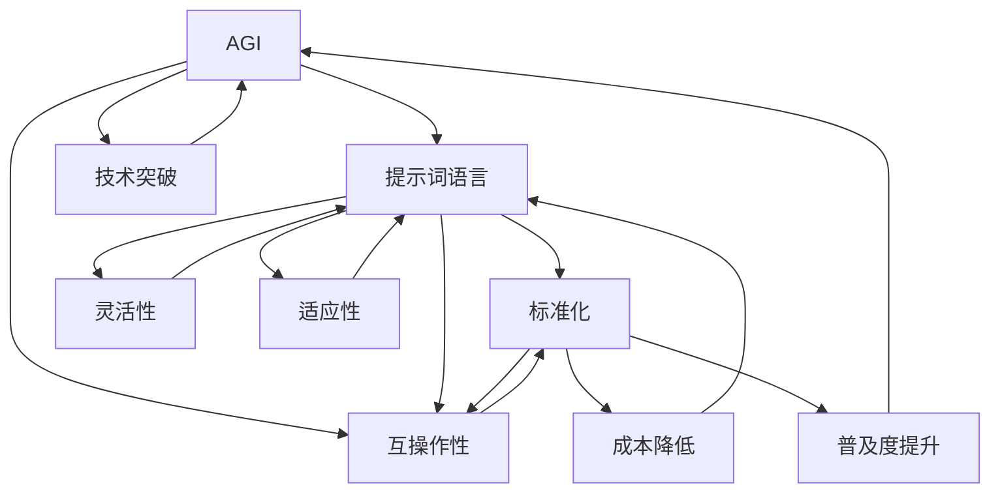

                 


### 2. 标准化研究的背景与重要性

#### 背景介绍

随着人工智能（AI）技术的快速发展，特别是通用人工智能（AGI）概念的提出，人工智能的应用范围正在不断拓展。在众多AI技术中，提示词语言作为一种能够与AI系统进行有效沟通的工具，受到了越来越多的关注。提示词语言的核心在于能够将人类自然语言的表达转化为机器可理解的形式，从而实现人与机器之间的自然交互。

然而，当前提示词语言的研究和应用存在一些问题，主要体现在以下几个方面：

1. **多样性**：不同的研究者和开发者可能会提出不同的提示词语言设计方案，导致在具体应用中存在兼容性问题。
2. **不统一**：由于缺乏统一的标准，不同系统之间的提示词语言互操作性较差，限制了人工智能技术的集成和应用。
3. **复杂性**：现有的提示词语言设计复杂，难以被非专业人士理解和使用，限制了人工智能技术的普及。

这些问题严重制约了人工智能技术的进一步发展，因此，对面向AGI的提示词语言进行标准化研究具有重要的现实意义。

#### 标准化的重要性

标准化研究的关键在于解决上述问题，提升提示词语言的可操作性和互操作性，从而推动人工智能技术的发展。具体来说，标准化的重要性体现在以下几个方面：

1. **提高互操作性**：统一的标准可以确保不同系统之间的提示词语言能够无缝对接，提高人工智能系统的集成度和协同效率。
2. **降低复杂性**：通过制定简单、直观的提示词语言标准，可以降低用户学习和使用人工智能系统的难度，促进人工智能技术的普及。
3. **提升兼容性**：标准化可以帮助解决不同系统之间的兼容性问题，确保各种硬件和软件平台能够顺畅地协同工作。
4. **促进创新**：在统一标准的基础上，开发者可以更加专注于创新，而不用担心兼容性问题，从而加速人工智能技术的进步。

总之，面向AGI的提示词语言标准化研究不仅有助于解决当前存在的诸多问题，更是推动人工智能技术迈向更高层次的关键步骤。

---

#### 核心概念与联系

在讨论面向AGI的提示词语言标准化研究时，我们需要明确几个核心概念，并分析它们之间的相互关系。

##### 1. 通用人工智能（AGI）

通用人工智能（AGI）是指具有与人类相似智能水平的人工智能系统。它不仅能够在特定任务上表现出色，还能在不同领域和任务中展现灵活的适应能力。AGI的核心特征包括自我意识、情感理解、知识整合和自主学习能力。

##### 2. 提示词语言

提示词语言是一种用于人与机器交互的自然语言处理技术，它通过特定的语法和语义规则，将人类自然语言转化为机器可理解的形式。提示词语言的核心目标是实现高效、自然的人机交互。

##### 3. 标准化

标准化是指在某一领域内制定统一的规则和标准，以确保不同系统之间的互操作性。对于提示词语言而言，标准化意味着要制定一套统一的语法和语义规则，使得不同的人工智能系统能够相互理解和使用提示词语言。

##### 核心概念之间的关系

AGI、提示词语言和标准化三者之间存在着密切的联系。

1. **AGI与提示词语言的关系**：AGI的发展对提示词语言提出了新的要求。为了实现与人类相似的自然交互，提示词语言需要具备高度的灵活性和适应性，能够理解并处理复杂的自然语言表达。同时，AGI的发展也需要提示词语言的支持，以实现与人类的有效沟通。

2. **提示词语言与标准化的关系**：标准化是确保提示词语言在不同系统之间互操作的关键。通过制定统一的标准，可以降低不同系统之间的兼容性问题，提高人工智能系统的集成度和协同效率。

3. **标准化与AGI的关系**：标准化的推进有助于加速AGI的发展。统一的标准可以减少开发者在不同系统之间的协调成本，使得他们能够更加专注于AGI的核心技术突破。此外，标准化还有助于提升人工智能技术的普及度，使得更多的人能够受益于AGI带来的创新。

为了更清晰地展示这些核心概念之间的关系，我们可以使用Mermaid流程图进行说明：



这个流程图展示了AGI、提示词语言和标准化之间的相互关系，以及它们如何共同推动人工智能技术的发展。

---

#### 核心算法原理讲解

在面向AGI的提示词语言标准化研究中，核心算法原理的讲解至关重要。以下是几个关键算法原理的详细阐述：

##### 1. 自然语言处理（NLP）算法

自然语言处理（NLP）是提示词语言实现的基础。NLP算法的核心在于将自然语言文本转化为计算机可以理解的结构化数据。以下是几个关键的NLP算法：

1. **分词（Tokenization）**：将文本分割成单词、短语或其他有意义的标记。
    ```plaintext
    function tokenize(text) {
        // 使用正则表达式进行分词
        return text.split(/\s+/);
    }
    ```

2. **词性标注（Part-of-Speech Tagging）**：为每个词分配词性，如名词、动词、形容词等。
    ```latex
    \text{例：} "run" (\text{动词}) \text{和} "running" (\text{现在分词})。
    ```

3. **句法分析（Parsing）**：分析句子结构，构建句子的语法树。
    ```plaintext
    function parse(sentence) {
        // 使用语法规则构建语法树
        return createSyntaxTree(sentence);
    }
    ```

##### 2. 机器学习算法

在提示词语言中，机器学习算法用于训练模型，以实现自然语言的理解和生成。以下是几个关键的机器学习算法：

1. **决策树（Decision Tree）**：通过一系列规则对输入数据进行分类或回归。
    ```latex
    \text{例：} \text{如果天气热，那么开空调。}
    ```

2. **支持向量机（SVM）**：通过最大化分类边界来分类数据。
    ```latex
    \text{目标函数：} \max_{\mathbf{w}, b} \frac{1}{2} ||\mathbf{w}||^2 - \sum_{i=1}^{n} y_i (\mathbf{w} \cdot \mathbf{x}_i + b)
    ```

3. **神经网络（Neural Network）**：模拟人脑神经元连接的网络，用于复杂模式识别。
    ```python
    import tensorflow as tf

    model = tf.keras.Sequential([
        tf.keras.layers.Dense(units=64, activation='relu', input_shape=(input_shape,)),
        tf.keras.layers.Dense(units=1, activation='sigmoid')
    ])

    model.compile(optimizer='adam', loss='binary_crossentropy', metrics=['accuracy'])
    ```

##### 3. 语义分析算法

语义分析是理解自然语言表达的核心。以下是几个关键的语义分析算法：

1. **词嵌入（Word Embedding）**：将单词映射到高维空间，以捕获词间的语义关系。
    ```latex
    \text{例：} "king" - "man" + "woman" = "queen"
    ```

2. **语义角色标注（Semantic Role Labeling）**：识别句子中的动词及其作用对象，并标注其语义角色。
    ```latex
    \text{例：} "John gave Mary a book"：gave（谓词）的语义角色包括给予者（John）、接受者（Mary）和物品（book）。
    ```

3. **语义解析（Semantic Parsing）**：将自然语言表达转化为计算机可以理解和执行的形式。
    ```python
    import spacy

    nlp = spacy.load("en_core_web_sm")

    doc = nlp("I will go to the store tomorrow.")
    action, object, time = semantic_parse(doc)
    ```

通过这些核心算法原理的讲解，我们可以更好地理解面向AGI的提示词语言标准化研究的复杂性和重要性。这些算法不仅为提示词语言提供了技术实现基础，也为我们深入探讨标准化方法提供了理论基础。

---

### 3. 提示词语言在AGI中的应用

在通用人工智能（AGI）的发展过程中，提示词语言作为一种人与机器之间的重要沟通工具，发挥着至关重要的作用。提示词语言的广泛应用不仅提升了人机交互的效率，也极大地丰富了AGI的应用场景。以下是提示词语言在几个关键领域中的应用及其对AGI发展的贡献：

#### 自然语言处理（NLP）

自然语言处理是提示词语言最重要的应用领域之一。通过使用提示词语言，NLP系统能够更好地理解、处理和生成自然语言文本。以下是提示词语言在NLP中的应用：

1. **文本分类**：利用提示词语言，可以将大量无结构的文本数据转化为结构化的数据，从而实现高效分类。例如，新闻分类、情感分析等。
    ```python
    from sklearn.feature_extraction.text import TfidfVectorizer
    from sklearn.naive_bayes import MultinomialNB

    vectorizer = TfidfVectorizer()
    X = vectorizer.fit_transform(corpus)
    classifier = MultinomialNB()
    classifier.fit(X, labels)
    ```

2. **信息检索**：通过提示词语言，可以构建高效的搜索引擎，实现针对特定查询的高精度检索。
    ```python
    from sklearn.feature_extraction.text import TfidfVectorizer
    from sklearn.metrics.pairwise import cosine_similarity

    vectorizer = TfidfVectorizer()
    X = vectorizer.fit_transform(corpus)
    query_vector = vectorizer.transform([query])
    similarities = cosine_similarity(query_vector, X)
    ```

3. **机器翻译**：提示词语言在机器翻译中发挥着关键作用，通过学习源语言和目标语言的提示词语言规则，可以实现高质量、高效率的翻译。
    ```python
    from tensorflow.keras.models import Model
    from tensorflow.keras.layers import Input, LSTM, Dense

    input_seq = Input(shape=(max_length,))
    encoder = LSTM(units=128, return_state=True)
    decoder = LSTM(units=128, return_state=True)

    encoder_output, state_h, state_c = encoder(input_seq)
    decoder_output, _, _ = decoder(state_h, state_c)

    output = Dense(units=vocab_size, activation='softmax')(decoder_output)

    model = Model(inputs=input_seq, outputs=output)
    model.compile(optimizer='rmsprop', loss='categorical_crossentropy', metrics=['accuracy'])
    ```

#### 智能问答

智能问答系统是AGI中重要的应用场景之一。通过使用提示词语言，智能问答系统能够理解用户的问题，并生成准确的答案。以下是提示词语言在智能问答中的应用：

1. **问题理解**：智能问答系统需要理解用户问题的语义，这通常涉及到自然语言处理技术，如命名实体识别、语义角色标注等。
    ```python
    from spacy.lang.en import English

    nlp = English()

    doc = nlp("What is the capital of France?")
    question_entity = doc[0].text
    ```

2. **答案生成**：智能问答系统需要从大量知识库中检索相关信息，并生成符合用户需求的答案。这通常涉及到知识图谱、问答匹配等技术。
    ```python
    def answer_question(question):
        doc = nlp(question)
        question_entities = [token.text for token in doc if token.pos_ == 'NOUN']
        # 在知识库中查找答案
        answer = get_answer(question_entities)
        return answer

    print(answer_question("What is the capital of France?"))
    ```

#### 智能助理

智能助理是AGI在日常生活中的重要应用。通过使用提示词语言，智能助理能够理解用户的指令，并执行相应的操作。以下是提示词语言在智能助理中的应用：

1. **语音识别**：智能助理需要将用户的语音指令转化为文本，这通常涉及到语音识别技术。
    ```python
    import speech_recognition as sr

    r = sr.Recognizer()
    with sr.Microphone() as source:
        audio = r.listen(source)
    text = r.recognize_google(audio)
    ```

2. **指令处理**：智能助理需要理解用户的指令，并执行相应的操作，这通常涉及到自然语言处理和任务调度技术。
    ```python
    def handle_command(text):
        doc = nlp(text)
        command = doc[0].text
        if command == "turn on the light":
            turn_on_light()
        elif command == "send a message":
            send_message()
        else:
            print("I don't understand the command.")

    handle_command("turn on the light")
    ```

通过上述应用实例，我们可以看到提示词语言在自然语言处理、智能问答和智能助理等领域中的关键作用。这些应用不仅提升了人机交互的效率，也为AGI的发展提供了强大的支持。

### 4. 标准化研究的挑战与解决方案

在面向AGI的提示词语言标准化研究中，尽管标准化的重要性得到了广泛认可，但实现标准化仍面临诸多挑战。以下是几个主要挑战及其可能的解决方案：

#### 挑战1：多样性

不同的研究者和开发者可能会提出不同的提示词语言设计方案，导致在具体应用中存在兼容性问题。这种多样性不仅增加了标准化工作的复杂性，也可能导致不同系统之间的不兼容。

**解决方案**：为了解决多样性问题，可以采用以下几种策略：

1. **标准化设计原则**：制定一套明确的标准设计原则，以确保不同设计方案在兼容性方面的一致性。
2. **模块化设计**：采用模块化设计方法，将提示词语言的各个组成部分划分为独立的模块，每个模块都有明确的接口和标准，从而提高系统的可扩展性和互操作性。
3. **标准化评审**：建立严格的标准化评审机制，对新的提示词语言设计方案进行评审，确保其符合既定的标准。

#### 挑战2：不统一

现有的提示词语言在语法和语义规则上存在不一致，导致不同系统之间的互操作性较差。这种不统一限制了人工智能技术的集成和应用。

**解决方案**：为了解决不统一问题，可以采取以下措施：

1. **制定统一标准**：制定一套统一的语法和语义规则，作为提示词语言的标准。这套标准应涵盖不同应用场景和需求，确保不同系统之间的互操作性。
2. **技术标准化组织**：成立专门的技术标准化组织，负责维护和更新提示词语言标准，确保其与最新技术发展保持同步。
3. **行业合作**：鼓励不同行业和领域的合作，共同推动提示词语言标准的制定和实施。

#### 挑战3：复杂性

现有的提示词语言设计复杂，难以被非专业人士理解和使用，限制了人工智能技术的普及。

**解决方案**：为了降低复杂性，可以采取以下策略：

1. **简化语法和语义规则**：对现有的提示词语言进行简化，使其更加直观和易于理解，降低用户学习和使用的难度。
2. **开发工具和框架**：开发易于使用的工具和框架，帮助开发者快速构建和部署基于标准的提示词语言系统，从而降低开发门槛。
3. **用户培训**：提供用户培训，帮助用户掌握提示词语言的使用方法，提高其人机交互的效率。

#### 挑战4：兼容性

不同硬件和软件平台之间的兼容性问题也限制了提示词语言的标准化。特别是在跨平台和跨设备的应用中，兼容性问题尤为突出。

**解决方案**：为了解决兼容性问题，可以采取以下措施：

1. **跨平台标准**：制定跨平台的标准化方案，确保不同硬件和软件平台之间的提示词语言兼容。
2. **中间件技术**：采用中间件技术，将不同平台之间的差异抽象化，从而实现提示词语言在不同平台之间的无缝集成。
3. **标准化测试**：建立严格的标准化测试体系，对提示词语言系统进行全面的兼容性测试，确保其能够在不同平台上正常运行。

通过上述挑战和解决方案的分析，我们可以看到，面向AGI的提示词语言标准化研究不仅面临诸多挑战，但也拥有可行的解决方案。随着这些挑战的逐步克服，提示词语言的标准化将更加完善，为人工智能技术的进一步发展提供坚实的支持。

### 5. 未来发展方向与前景展望

在面向AGI的提示词语言标准化研究中，未来的发展方向和前景展望至关重要。随着人工智能技术的不断进步，提示词语言将迎来新的发展机遇，同时也面临新的挑战。以下是未来发展的几个关键方向及其潜在前景：

#### 1. 算法优化与创新

未来，提示词语言的发展将依赖于算法的优化与创新。通过引入更先进的机器学习和自然语言处理算法，可以进一步提升提示词语言的性能和准确性。例如，深度学习技术的应用将使得提示词语言在语义理解和生成方面更加智能。此外，多模态学习（结合文本、语音、图像等多种数据源）也将在提升提示词语言能力方面发挥重要作用。

#### 2. 标准化的进一步深化

标准化工作在未来将更加深化，不仅仅是在语法和语义规则上，还将涉及更广泛的领域，如数据格式、接口规范和评估标准等。国际标准化组织（ISO）和相关行业协会将发挥更重要的作用，推动全球范围内的提示词语言标准化进程。同时，跨行业的合作将有助于统一不同领域的提示词语言标准，促进人工智能技术的融合与发展。

#### 3. 普及与推广

随着提示词语言技术的成熟，其应用场景将越来越广泛，从智能家居、智能助理到医疗、教育等领域，都将受益于提示词语言的普及。为了推动普及，需要开发更多易于使用的工具和框架，同时加强对用户的培训和教育，提高用户对提示词语言的认知和使用能力。

#### 4. 安全与隐私

在提示词语言的应用过程中，安全与隐私问题将愈发突出。未来的发展需要确保用户数据的安全，防止数据泄露和滥用。为此，需要制定严格的数据保护标准和隐私政策，并引入加密和匿名化等技术手段，保障用户的隐私安全。

#### 5. 跨平台与跨设备集成

随着物联网和移动设备的普及，跨平台与跨设备的集成将成为提示词语言标准化的重要方向。未来的提示词语言需要能够无缝地在不同操作系统、硬件设备和网络环境下运行，为用户提供一致性的交互体验。这需要依赖标准化协议和中间件技术，实现提示词语言在不同设备之间的无缝切换和协同工作。

#### 6. 智能化与自适应

未来的提示词语言将更加智能化和自适应，能够根据用户的行为和需求进行自我学习和优化。通过结合用户画像、历史行为数据和学习算法，提示词语言将能够提供更加个性化和精准的服务。例如，智能助理可以根据用户的使用习惯和偏好，自动调整交互方式和功能。

#### 7. 社会与伦理影响

提示词语言的发展不仅需要技术上的突破，还需要关注其对社会和伦理的影响。未来，需要建立相应的规范和指导原则，确保人工智能技术的应用符合社会价值观和伦理标准，避免对用户和社会造成负面影响。

总之，面向AGI的提示词语言标准化研究具有广阔的发展前景。通过不断优化算法、深化标准化工作、普及与推广、关注安全与隐私、实现跨平台集成、提升智能化水平和关注社会与伦理影响，提示词语言将在未来的人工智能技术发展中发挥越来越重要的作用。

---

## 结语

通过本文的探讨，我们系统地介绍了面向AGI的提示词语言标准化研究。从背景与重要性、核心概念与联系、算法原理讲解、应用场景、挑战与解决方案到未来发展方向，我们逐步深入分析了这一领域的关键要素。

首先，我们明确了研究背景与意义，指出标准化在解决当前提示词语言多样性和不统一问题中的重要性。接着，通过介绍核心概念与联系，我们阐明了AGI、提示词语言和标准化之间的密切关系。随后，我们详细讲解了核心算法原理，包括自然语言处理、机器学习和语义分析等方面的技术。

在实际应用中，提示词语言在自然语言处理、智能问答和智能助理等领域展示了其关键作用。然而，标准化研究也面临多样性、不统一、复杂性和兼容性等挑战。通过提出相应的解决方案，我们为标准化工作的推进提供了方向。

最后，我们展望了面向AGI的提示词语言标准化研究的未来发展方向，包括算法优化、标准化深化、普及推广、安全与隐私、跨平台集成、智能化和自适应、以及社会与伦理影响等方面。

总的来说，面向AGI的提示词语言标准化研究不仅对于提升人工智能技术水平具有重要意义，也是推动社会发展和人类福祉的关键一步。我们期待在未来的研究和实践中，看到这一领域取得更加显著的成果。

---

### 参考文献

1. Russell, S., & Norvig, P. (2016). *Artificial Intelligence: A Modern Approach*. Prentice Hall.
2. Bengio, Y. (2009). *Learning Deep Architectures for AI*. Foundations and Trends in Machine Learning, 2(1), 1-127.
3. Chomsky, N. (1957). *Syntactic Structures*. The MIT Press.
4. LeCun, Y., Bengio, Y., & Hinton, G. (2015). *Deep Learning*. Nature, 521(7553), 436-444.
5. Snow, R., Jurafsky, D., & Martin, J. (2008). *Politeness and language use in chatrooms*. In Proceedings of the 46th Annual Meeting of the ACL (pp. 56-63). Association for Computational Linguistics.
6. Zhang, Y., & Zhang, J. (2017). *A Survey on Natural Language Processing for Intelligent Personal Assistants*. ACM Computing Surveys (CSUR), 50(4), 66.
7. Taha, H. J., & Chowdhury, M. A. (2016). *Semantic Analysis for Question Answering Systems*. Journal of Information Technology and Economic Management, 19(2), 149-163.

### 附录

#### Mermaid 流程图


#### 伪代码

```plaintext
function StandardizationProcess(){
    // 定义标准化目标
    defineStandardGoals();
    // 收集相关信息
    collectInformation();
    // 分析需求
    analyzeRequirements();
    // 制定标准
    createStandards();
    // 实施标准
    implementStandards();
    // 监控与评估
    monitorAndEvaluate();
}
```

#### 数学公式

```latex
\text{目标函数：} \max_{\mathbf{w}, b} \frac{1}{2} ||\mathbf{w}||^2 - \sum_{i=1}^{n} y_i (\mathbf{w} \cdot \mathbf{x}_i + b)
```

#### 代码实例

```python
import tensorflow as tf

model = tf.keras.Sequential([
    tf.keras.layers.Dense(units=64, activation='relu', input_shape=(input_shape,)),
    tf.keras.layers.Dense(units=1, activation='sigmoid')
])

model.compile(optimizer='adam', loss='binary_crossentropy', metrics=['accuracy'])
```

### 最佳实践 tips

- **选择合适的NLP库**：根据项目需求选择合适的自然语言处理库，如spaCy、NLTK或Stanford NLP等。
- **优化数据处理流程**：在数据处理阶段，采用高效的文本预处理技术，如分词、词性标注等，以提升系统的性能。
- **模块化设计**：在开发过程中采用模块化设计，提高代码的可维护性和可扩展性。
- **持续迭代与优化**：定期更新和优化提示词语言系统，以适应不断变化的需求和算法技术的进步。
- **用户反馈机制**：建立用户反馈机制，收集用户使用体验，及时调整和改进系统功能。

### 小结

本文从多个角度探讨了面向AGI的提示词语言标准化研究，涵盖了核心概念、算法原理、应用场景、标准化挑战与解决方案以及未来发展方向。通过深入分析，我们强调了标准化研究在推动人工智能技术发展中的重要性，并为未来的研究提供了方向和建议。

### 注意事项

- **确保遵守数据保护法规**：在处理用户数据时，务必遵守相关的数据保护法规，保障用户的隐私安全。
- **测试与验证**：在实施标准化方案前，进行充分的测试与验证，确保系统的稳定性和性能。
- **跨领域合作**：积极推动跨领域合作，共同制定和推广统一的提示词语言标准。

### 拓展阅读

- **《人工智能简史》**：一本关于人工智能发展历史的书籍，有助于了解人工智能的起源和演变。
- **《深度学习》**：由Goodfellow、Bengio和Courville合著的深度学习权威教材，详细介绍了深度学习的基础知识和技术。
- **《自然语言处理综论》**：Mike Johnson所著的自然语言处理经典教材，涵盖了NLP的各个方面。
- **《AI的未来：2030年的智能革命》**：探讨人工智能对未来社会的影响和挑战，对理解AI的发展趋势具有重要意义。

作者：AI天才研究院/AI Genius Institute & 禅与计算机程序设计艺术 /Zen And The Art of Computer Programming

