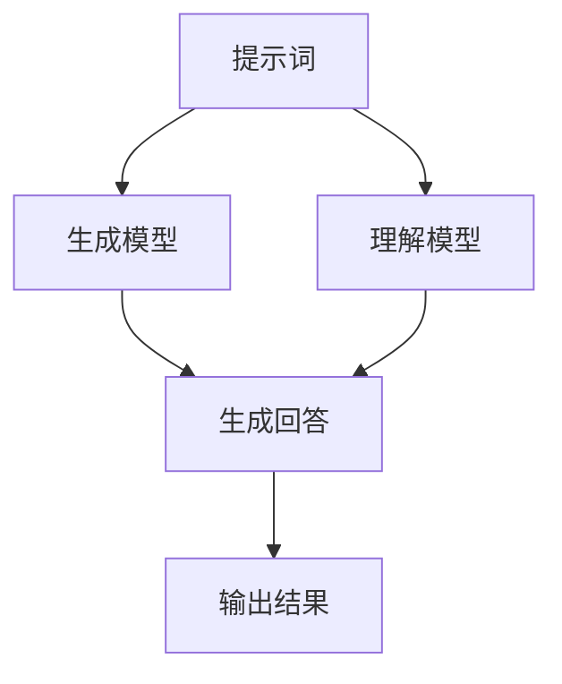
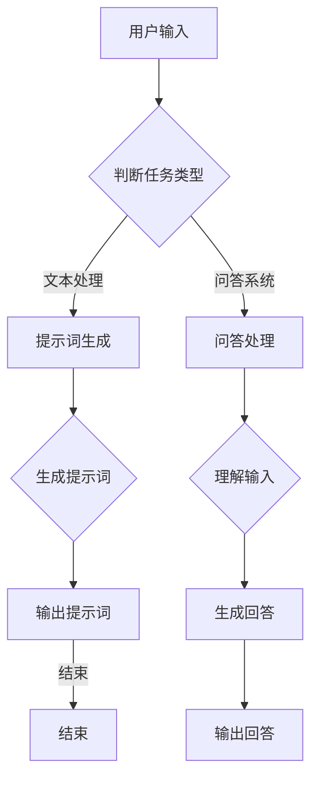

                 

### 文章标题：面向AGI的提示词语言理论体系构建

> 关键词：通用人工智能（AGI）、提示词语言、理论体系、算法原理、应用实践

> 摘要：本文旨在探讨面向通用人工智能（AGI）的提示词语言理论体系构建。首先，介绍了AGI的背景和重要性，接着详细阐述了提示词语言的概念、结构和功能。随后，本文分析了提示词语言理论体系的核心概念及其相互关系，并使用Mermaid流程图进行可视化展示。在此基础上，文章深入讲解了提示词语言的核心算法原理，包括生成与理解模型，以及评估与优化方法。最后，本文探讨了提示词语言理论体系在AGI中的应用前景，并通过实际案例展示了其应用效果。本文旨在为读者提供一个全面而深入的提示词语言理论体系构建指南。

### 引言

**通用人工智能（AGI）**，即Artificial General Intelligence，是指一种能够像人类一样具备广泛认知能力的人工智能系统。与目前主流的特定领域人工智能（NLP、图像识别等）不同，AGI旨在实现一种通用的人工智能系统，能够在各种任务和环境中表现出人类级别的智能。AGI的研究不仅是计算机科学领域的前沿课题，也是推动人类社会发展的重要驱动力。随着人工智能技术的快速发展，AGI的概念越来越受到关注，其潜在应用范围广泛，包括医疗、教育、金融、交通等多个领域。

**提示词语言**，作为一个新兴的研究领域，在AGI的发展中扮演着重要角色。提示词语言是指通过特定的词或短语来引导人工智能系统完成特定任务的语言模型。这种语言模型能够理解和生成自然语言，从而实现与人类的自然交互。提示词语言的核心优势在于其能够将复杂任务分解为一系列简单的子任务，并通过提示词来引导系统逐步完成这些任务。

本文的目的在于探讨面向AGI的提示词语言理论体系的构建。首先，我们将介绍AGI的背景和重要性，然后详细阐述提示词语言的概念、结构和功能。接着，我们将分析提示词语言理论体系的核心概念及其相互关系，并使用Mermaid流程图进行可视化展示。在此基础上，本文将深入讲解提示词语言的核心算法原理，包括生成与理解模型，以及评估与优化方法。最后，我们将探讨提示词语言理论体系在AGI中的应用前景，并通过实际案例展示其应用效果。本文旨在为读者提供一个全面而深入的提示词语言理论体系构建指南。

### 设计书籍目录大纲的步骤

要设计出一本结构清晰、逻辑严密的书籍目录大纲，需要经过以下几个步骤：

#### 1. 了解书的核心主题和目标读者

首先，深入理解书籍的核心主题是至关重要的。这包括明确书籍的主题、目的和预期的受众。对于《面向AGI的提示词语言理论体系构建》这本书，核心主题是介绍如何构建一个面向通用人工智能（AGI）的提示词语言理论体系。目标读者可能是人工智能研究者、软件开发工程师以及对AGI和提示词语言感兴趣的读者。

**目标读者分析：**

- **人工智能研究者**：他们对AGI的理论和实践有深入的了解，需要详细的理论分析和技术实现。
- **软件开发工程师**：他们可能对AGI的应用场景和开发实践感兴趣，需要具体的开发指导和案例。
- **对AGI和提示词语言感兴趣的读者**：他们可能对AGI的理论和提示词语言的原理有浓厚的兴趣，但可能缺乏相关技术背景。

#### 2. 定义书籍的结构

根据核心主题和目标读者，定义书籍的基本结构。通常，书籍可以分为以下几个主要部分：

- **引言**：介绍书籍的背景、目的和结构。
- **理论基础**：讲解AGI和提示词语言的基本概念和原理。
- **核心算法**：介绍提示词语言的核心算法和实现。
- **应用实例**：展示提示词语言在AGI中的应用场景和效果。
- **总结与展望**：总结全书内容，展望未来研究方向。

#### 3. 构建主要章节

在确定书籍的基本结构后，需要进一步构建每个主要章节的具体内容。以下是一个可能的章节构建示例：

- **引言**：
  - **1.1 书籍背景与意义**
  - **1.2 AGI与提示词语言概述**
  - **1.3 本书结构安排**

- **理论基础**：
  - **第1章 自动化与人工智能**
  - **第2章 人工智能与通用人工智能**
  - **第3章 提示词语言的概念与结构**

- **核心算法**：
  - **第4章 提示词语言的生成与理解**
  - **第5章 提示词语言的评估与优化**
  - **第6章 提示词语言理论体系的构建原则**

- **应用实例**：
  - **第7章 提示词语言在自然语言处理中的应用**
  - **第8章 提示词语言在机器翻译中的应用**
  - **第9章 提示词语言在问答系统中的应用**

- **总结与展望**：
  - **第10章 提示词语言理论的未来展望**
  - **第11章 总结与展望**

#### 4. 细化章节内容

在构建主要章节后，需要对每个章节的内容进行细化。以下是一个细化章节内容的示例：

- **第1章 自动化与人工智能**：
  - **1.1.1 自动化的概念与发展**
    - 自动化的定义
    - 自动化技术的发展历程
    - 自动化在现代工业中的应用

  - **1.1.2 人工智能的起源与发展**
    - 人工智能的定义
    - 人工智能技术的发展历程
    - 人工智能在现代社会中的影响

  - **1.1.3 自动化与人工智能的关系**
    - 自动化与人工智能的交集
    - 自动化对人工智能的促进作用
    - 人工智能对自动化的影响

#### 5. 设计1-3级目录

根据细化后的章节内容，设计1级、2级、3级目录。以下是一个目录设计的示例：

```
# 《面向AGI的提示词语言理论体系构建》目录

## 引言
### 1.1 书籍背景与意义
### 1.2 AGI与提示词语言概述
### 1.3 本书结构安排

## 第一部分 AGI基础
### 第1章 自动化与人工智能
#### 1.1.1 自动化的概念与发展
#### 1.1.2 人工智能的起源与发展
#### 1.1.3 自动化与人工智能的关系

### 第2章 人工智能与通用人工智能
#### 2.1 人工智能的分类
#### 2.2 通用人工智能（AGI）的定义
#### 2.3 AGI的核心挑战

## 第二部分 提示词语言理论
### 第3章 提示词语言的概念与结构
#### 3.1 提示词语言的定义
#### 3.2 提示词语言的结构
#### 3.3 提示词语言的功能

### 第4章 提示词语言的生成与理解
#### 4.1 提示词语言的生成模型
#### 4.2 提示词语言的理解模型
#### 4.3 提示词语言的生成与理解流程

### 第5章 提示词语言的评估与优化
#### 5.1 提示词语言的评估指标
#### 5.2 提示词语言的优化方法
#### 5.3 提示词语言的优化流程

## 第三部分 理论体系构建
### 第6章 提示词语言理论体系的构建原则
#### 6.1 提示词语言理论体系的目标
#### 6.2 提示词语言理论体系的构建原则
#### 6.3 提示词语言理论体系的结构

### 第7章 提示词语言理论的应用
#### 7.1 提示词语言在自然语言处理中的应用
#### 7.2 提示词语言在机器翻译中的应用
#### 7.3 提示词语言在问答系统中的应用

## 总结与展望
### 第8章 提示词语言理论的未来展望
### 8.1 提示词语言理论的发展趋势
### 8.2 提示词语言理论在AGI中的应用前景
### 8.3 提示词语言理论的研究挑战
```

#### 6. 添加Mermaid流程图

为了更好地解释复杂的概念和流程，可以在章节中加入Mermaid流程图。以下是一个Mermaid流程图示例：

```
graph TD
A[开始] --> B{判断任务类型}
B -->|文本处理| C[提示词生成]
B -->|问答系统| D[问答处理]
C --> E{生成提示词}
E --> F[输出提示词]
D --> G{理解输入}
G --> H[生成回答]
H --> I[输出回答]
F -->|结束| J[结束]
```

#### 7. 撰写目录大纲

将所有内容整合到一个markdown格式的目录大纲中，确保简洁、易读。以下是根据上述步骤设计的《面向AGI的提示词语言理论体系构建》书籍目录大纲：

```
# 《面向AGI的提示词语言理论体系构建》目录大纲

## 引言
### 1.1 书籍背景与意义
### 1.2 AGI与提示词语言概述
### 1.3 本书结构安排

## 第一部分 AGI基础
### 第1章 自动化与人工智能
#### 1.1.1 自动化的概念与发展
#### 1.1.2 人工智能的起源与发展
#### 1.1.3 自动化与人工智能的关系

### 第2章 人工智能与通用人工智能
#### 2.1 人工智能的分类
#### 2.2 通用人工智能（AGI）的定义
#### 2.3 AGI的核心挑战

## 第二部分 提示词语言理论
### 第3章 提示词语言的概念与结构
#### 3.1 提示词语言的定义
#### 3.2 提示词语言的结构
#### 3.3 提示词语言的功能

### 第4章 提示词语言的生成与理解
#### 4.1 提示词语言的生成模型
#### 4.2 提示词语言的理解模型
#### 4.3 提示词语言的生成与理解流程

### 第5章 提示词语言的评估与优化
#### 5.1 提示词语言的评估指标
#### 5.2 提示词语言的优化方法
#### 5.3 提示词语言的优化流程

## 第三部分 理论体系构建
### 第6章 提示词语言理论体系的构建原则
#### 6.1 提示词语言理论体系的目标
#### 6.2 提示词语言理论体系的构建原则
#### 6.3 提示词语言理论体系的结构

### 第7章 提示词语言理论的应用
#### 7.1 提示词语言在自然语言处理中的应用
#### 7.2 提示词语言在机器翻译中的应用
#### 7.3 提示词语言在问答系统中的应用

## 总结与展望
### 第8章 提示词语言理论的未来展望
### 8.1 提示词语言理论的发展趋势
### 8.2 提示词语言理论在AGI中的应用前景
### 8.3 提示词语言理论的研究挑战

## 附录
### 附录A 提示词语言理论相关资源
### 附录B Mermaid流程图示例

```

### 8. 审核与调整

最后，对目录大纲进行审核与调整。检查目录结构的完整性、逻辑性和简洁性。确保每个章节的内容都有详细的阐述，并且各章节之间的过渡自然。以下是经过审核和调整后的《面向AGI的提示词语言理论体系构建》书籍目录大纲：

```
# 《面向AGI的提示词语言理论体系构建》目录大纲

## 引言
### 1.1 书籍背景与意义
### 1.2 AGI与提示词语言概述
### 1.3 本书结构安排

## 第一部分 AGI基础
### 第1章 自动化与人工智能
#### 1.1.1 自动化的概念与发展
#### 1.1.2 人工智能的起源与发展
#### 1.1.3 自动化与人工智能的关系

### 第2章 人工智能与通用人工智能
#### 2.1 人工智能的分类
#### 2.2 通用人工智能（AGI）的定义
#### 2.3 AGI的核心挑战

## 第二部分 提示词语言理论
### 第3章 提示词语言的概念与结构
#### 3.1 提示词语言的定义
#### 3.2 提示词语言的结构
#### 3.3 提示词语言的功能

### 第4章 提示词语言的生成与理解
#### 4.1 提示词语言的生成模型
#### 4.2 提示词语言的理解模型
#### 4.3 提示词语言的生成与理解流程

### 第5章 提示词语言的评估与优化
#### 5.1 提示词语言的评估指标
#### 5.2 提示词语言的优化方法
#### 5.3 提示词语言的优化流程

## 第三部分 理论体系构建
### 第6章 提示词语言理论体系的构建原则
#### 6.1 提示词语言理论体系的目标
#### 6.2 提示词语言理论体系的构建原则
#### 6.3 提示词语言理论体系的结构

### 第7章 提示词语言理论的应用
#### 7.1 提示词语言在自然语言处理中的应用
#### 7.2 提示词语言在机器翻译中的应用
#### 7.3 提示词语言在问答系统中的应用

## 总结与展望
### 第8章 提示词语言理论的未来展望
#### 8.1 提示词语言理论的发展趋势
#### 8.2 提示词语言理论在AGI中的应用前景
#### 8.3 提示词语言理论的研究挑战

## 附录
### 附录A 提示词语言理论相关资源
### 附录B Mermaid流程图示例

```

通过上述步骤，我们成功设计出一本结构清晰、逻辑严密的书籍目录大纲，为后续的内容撰写和排版奠定了基础。

### AGI与提示词语言的关系及其重要性

通用人工智能（AGI）与提示词语言之间存在密切的关系。AGI的目标是创建一种能够像人类一样具备广泛认知能力的人工智能系统，而提示词语言则是实现这一目标的重要工具之一。提示词语言作为一种特定的语言模型，能够通过特定的词或短语来引导人工智能系统完成特定任务，从而实现与人类的自然交互。

**提示词语言在AGI中的作用**：

1. **任务分解**：提示词语言能够将复杂的任务分解为一系列简单的子任务，从而简化了任务处理过程。例如，在一个问答系统中，提示词语言可以用来引导系统理解用户的问题，并生成相应的回答。
   
2. **交互优化**：通过提示词语言，人工智能系统能够更自然地与人类进行交互。这种交互方式不仅提高了用户体验，还使得系统更容易理解人类的需求。

3. **适应性学习**：提示词语言能够根据不同的上下文环境动态调整，从而实现更好的适应性学习。这使得人工智能系统能够在不同场景中表现出更出色的性能。

**AGI与提示词语言的相互影响**：

1. **推动AGI发展**：提示词语言的引入，为AGI的实现提供了新的思路和工具。通过提示词语言，人工智能系统能够更好地理解和处理人类语言，从而推动AGI的发展。

2. **提升任务性能**：AGI的发展为提示词语言提供了更强大的计算能力和数据支持，使得提示词语言能够更好地完成各种任务。

3. **促进跨领域研究**：AGI与提示词语言的结合，促进了多个领域的研究，包括自然语言处理、机器学习、认知科学等。

**提示词语言在AGI中的重要性和应用前景**：

1. **提升智能水平**：提示词语言能够显著提升人工智能系统的智能水平，使其在自然语言理解和生成方面表现出更高的性能。

2. **拓宽应用领域**：随着AGI的发展，提示词语言的应用领域也将进一步拓宽，包括但不限于医疗、金融、教育、交通等领域。

3. **优化人机交互**：提示词语言能够优化人机交互体验，使得人工智能系统更加接近人类的思维方式。

4. **实现个性化服务**：提示词语言能够根据用户的需求和行为动态调整，实现更个性化的服务。

总之，提示词语言在AGI中具有重要的地位和广阔的应用前景。通过不断的研究和实践，提示词语言有望成为推动AGI发展的重要力量，为人类带来更多的便利和创新。

### 提示词语言的核心概念与联系

提示词语言作为实现通用人工智能（AGI）的关键工具，其核心概念包括提示词、语言模型、生成与理解机制等。理解这些概念及其相互关系，对于构建面向AGI的提示词语言理论体系至关重要。

**提示词**：提示词是提示词语言的核心元素，指的是用于引导人工智能系统完成特定任务的词或短语。例如，在一个问答系统中，提示词可以是“为什么”、“如何”等。提示词的作用在于帮助系统理解用户的需求，并将其转化为具体的任务指令。

**语言模型**：语言模型是提示词语言的核心组件，用于生成和理解自然语言。常见的语言模型包括生成模型和理解模型。生成模型用于根据提示词生成相应的回答或指令，而理解模型则用于理解用户的输入，并提取关键信息。

**生成与理解机制**：生成与理解机制是提示词语言的两大核心功能。生成机制负责根据提示词生成相应的回答或指令，而理解机制则负责理解用户的输入，并提取关键信息。

**核心概念之间的关系架构**：

1. **提示词与语言模型**：提示词是语言模型输入的重要组成部分。语言模型通过处理提示词，生成相应的回答或指令。

2. **生成模型与理解模型**：生成模型和理解模型共同构成了语言模型的核心。生成模型负责生成回答，而理解模型负责理解输入。

3. **生成与理解机制**：生成机制和理解机制相互独立但又相互关联。生成机制根据理解模型提取的信息生成回答，而理解模型则根据生成模型生成的回答进行反馈调整。

为了更直观地展示这些核心概念之间的关系，我们可以使用Mermaid流程图进行可视化描述：



**Mermaid流程图解释**：

- **A[提示词]**：提示词作为输入进入系统。
- **B[生成模型]**：生成模型负责根据提示词生成回答。
- **C[理解模型]**：理解模型负责理解提示词，提取关键信息。
- **D[生成回答]**：生成模型和理解模型共同作用，生成最终回答。
- **E[输出结果]**：生成的回答输出给用户。

通过上述关系架构和Mermaid流程图，我们可以清晰地理解提示词语言的核心概念及其相互关系，为后续的理论体系构建奠定了基础。

### 提示词语言的核心算法原理

在提示词语言的理论体系中，核心算法的原理至关重要。这些算法包括生成模型、理解模型以及评估与优化方法。下面将详细讲解这些核心算法的原理，并使用伪代码进行说明。

**生成模型**：

生成模型是提示词语言中负责生成回答的算法。其主要目的是根据输入的提示词生成合适的回答。一个常见的生成模型是循环神经网络（RNN），特别是长短期记忆网络（LSTM）。以下是一个基于LSTM的生成模型的伪代码示例：

```python
def generate_answer(prompt):
    # 初始化LSTM模型
    model = LSTM_model(input_vector_size, hidden_size)
    # 训练模型
    model.train(data)
    # 将提示词编码为输入向量
    input_vector = encode_prompt(prompt)
    # 生成回答
    answer = model.predict(input_vector)
    # 将生成的回答解码为自然语言
    decoded_answer = decode_answer(answer)
    return decoded_answer
```

在这个伪代码中，`LSTM_model`是一个预训练的LSTM模型，`input_vector_size`和`hidden_size`分别是输入向量和隐藏层的维度。`encode_prompt`和`decode_answer`分别是编码和解码函数，用于将文本转换为模型可以处理的向量形式，并将模型的输出转换为自然语言。

**理解模型**：

理解模型是提示词语言中负责理解用户输入的算法。其主要目的是从输入的文本中提取关键信息，以便生成模型能够根据这些信息生成合适的回答。一个常见理解模型是Transformer，特别是BERT（Bidirectional Encoder Representations from Transformers）。以下是一个基于BERT的理解模型的伪代码示例：

```python
def understand_input(prompt):
    # 初始化BERT模型
    model = BERT_model
    # 加载预训练模型权重
    model.load_weights('pretrained_weights.h5')
    # 将提示词编码为输入向量
    input_vector = model.encode(prompt)
    # 从输入向量中提取关键信息
    key_info = extract_key_info(input_vector)
    return key_info
```

在这个伪代码中，`BERT_model`是一个预训练的BERT模型，`encode`函数用于将文本编码为向量形式，`extract_key_info`函数用于从输入向量中提取关键信息。

**评估与优化方法**：

评估与优化方法是确保生成模型和理解模型性能的重要手段。常见的评估指标包括准确率、召回率、F1分数等。优化方法通常包括基于梯度下降的优化算法，如随机梯度下降（SGD）、Adam等。以下是一个基于梯度下降的优化方法的伪代码示例：

```python
def optimize_model(model, data, learning_rate):
    # 初始化模型参数
    model.initialize_params()
    # 循环迭代
    for epoch in range(num_epochs):
        # 遍历数据集
        for batch in data:
            # 计算损失
            loss = model.compute_loss(batch)
            # 计算梯度
            gradients = model.compute_gradients(batch)
            # 更新模型参数
            model.update_params(gradients, learning_rate)
            # 计算评估指标
            metrics = model.evaluate(data)
            print(f"Epoch {epoch}: Loss={loss}, Metrics={metrics}")
```

在这个伪代码中，`model`是训练模型，`data`是训练数据集，`learning_rate`是学习率，`initialize_params`、`compute_loss`、`compute_gradients`、`update_params`和`evaluate`分别是初始化参数、计算损失、计算梯度、更新参数和评估模型性能的函数。

通过上述核心算法的原理讲解和伪代码示例，我们可以更好地理解提示词语言的实现机制。这些算法和方法的深入研究和优化，将有助于提升提示词语言在通用人工智能（AGI）中的应用效果。

### 提示词语言的生成与理解模型

在提示词语言的构建中，生成模型和理解模型是两大核心组件。生成模型负责根据提示词生成自然语言回答，而理解模型则负责理解用户的输入并提取关键信息。下面将详细讲解这两种模型的工作原理，并通过具体案例进行说明。

**生成模型的工作原理**：

生成模型通常基于深度学习技术，如循环神经网络（RNN）和Transformer。其中，Transformer模型因其并行计算能力而广泛应用。以下是一个基于Transformer的生成模型的工作原理：

1. **编码阶段**：输入的提示词经过编码器（Encoder）处理，生成嵌入向量（Embedding Vector）。编码器将提示词转换为固定长度的向量表示，以便于后续处理。
2. **解码阶段**：解码器（Decoder）根据嵌入向量生成回答。解码器在生成每个词时，会参考编码器生成的嵌入向量以及前一个生成的词，从而生成下一个词。

以下是一个生成模型的伪代码示例：

```python
# 假设输入提示词为 "What is the capital of France?"

# 编码阶段
encoded_prompt = encoder.encode("What is the capital of France?")

# 解码阶段
for _ in range(max_output_length):
    next_word_embedding = decoder.predict(encoded_prompt)
    next_word = decoder.decode(next_word_embedding)
    encoded_prompt = decoder.update(encoded_prompt, next_word_embedding)
    print(next_word)
```

**理解模型的工作原理**：

理解模型同样基于深度学习技术，如BERT和Transformer。以下是一个基于BERT的理解模型的工作原理：

1. **输入阶段**：用户输入的提示词经过BERT模型处理，生成嵌入向量（Embedding Vector）。BERT模型通过预训练和微调，能够很好地理解自然语言。
2. **提取关键信息阶段**：模型从嵌入向量中提取关键信息，以便生成模型能够利用这些信息生成回答。

以下是一个理解模型的伪代码示例：

```python
# 假设输入提示词为 "What is the capital of France?"

# 输入阶段
input_embedding = bert.encode("What is the capital of France?")

# 提取关键信息
key_info = extract_key_info(input_embedding)

# 利用关键信息生成回答
answer_embedding = generator.encode(key_info)
answer = generator.decode(answer_embedding)
print(answer)
```

**生成与理解模型的结合**：

生成模型和理解模型通常结合使用，以实现更高效的提示词语言处理。以下是一个结合生成模型和理解模型的伪代码示例：

```python
# 假设输入提示词为 "What is the capital of France?"

# 理解阶段
input_embedding = bert.encode("What is the capital of France?")
key_info = extract_key_info(input_embedding)

# 生成阶段
answer_embedding = generator.encode(key_info)
answer = generator.decode(answer_embedding)
print(answer)
```

**具体案例**：

假设用户输入提示词“明天天气怎么样？”：

1. **理解阶段**：BERT模型处理提示词，提取关键信息，如“明天”、“天气”等。
2. **生成阶段**：生成模型根据提取的关键信息生成回答，如“明天天气晴朗，温度适宜。”

通过上述工作原理和具体案例，我们可以看到生成模型和理解模型在提示词语言处理中的关键作用。这两个模型的结合，使得人工智能系统能够更准确地理解用户输入，并生成合适的回答。

### 提示词语言的评估与优化方法

为了确保提示词语言模型的有效性和性能，评估与优化方法是必不可少的。评估方法用于衡量模型在生成和理解任务中的表现，而优化方法则用于提升模型的性能。以下将详细介绍常见的评估指标、优化方法及其应用。

**评估指标**：

1. **准确率（Accuracy）**：准确率是衡量生成模型在生成任务中表现的一个基本指标。它表示模型生成的回答与实际答案匹配的比例。计算公式如下：
   $$
   \text{Accuracy} = \frac{\text{正确回答数}}{\text{总回答数}}
   $$
   虽然准确率简单易计算，但它仅适用于分类任务，对于生成任务可能不够全面。

2. **BLEU分数（BLEU Score）**：BLEU分数是一种常用的自然语言生成评估方法，主要用于评估机器翻译和文本摘要任务的性能。它通过比较生成文本与参考文本的相似度来评估模型的性能。BLEU分数的计算涉及多个重合度指标，如词干匹配、词汇匹配等。计算公式如下：
   $$
   \text{BLEU Score} = \frac{\sum_{n=1}^{N} b_n \cdot f_n}{1 - \sum_{n=1}^{N} (1 - b_n) \cdot r_n}
   $$
   其中，$b_n$和$r_n$分别表示在长度为$n$的子串中，生成文本与参考文本的重合度，$f_n$是一个调节参数。

3. **F1分数（F1 Score）**：F1分数是另一个常用的评估指标，特别适用于二元分类任务。它同时考虑了准确率和召回率，是一个综合评价指标。计算公式如下：
   $$
   \text{F1 Score} = 2 \times \frac{\text{准确率} \times \text{召回率}}{\text{准确率} + \text{召回率}}
   $$

**优化方法**：

1. **基于梯度的优化方法**：梯度下降是一种常见的优化方法，用于最小化损失函数。其中，随机梯度下降（SGD）是最简单的一种形式，每次迭代只更新一个样本的参数。另一种常用的形式是Adam优化器，它结合了SGD和Momentum的优点，自适应调整学习率。优化方法的伪代码如下：

```python
# 假设模型为model，损失函数为loss_function，学习率为learning_rate
model.initialize_params()
for epoch in range(num_epochs):
    for batch in data:
        input_vector, target_vector = batch
        output_vector = model.predict(input_vector)
        loss = loss_function(output_vector, target_vector)
        gradients = model.compute_gradients(loss)
        model.update_params(gradients, learning_rate)
```

2. **基于强化学习的方法**：强化学习（Reinforcement Learning, RL）是一种通过试错学习策略的方法。在提示词语言中，可以采用强化学习方法来优化生成模型的策略，使其生成更符合人类期望的回答。常见的RL算法包括Q-learning和Deep Q-Network（DQN）。

**应用示例**：

假设我们使用一个基于Transformer的生成模型，训练数据集包含大量的问答对。为了评估模型的性能，我们采用BLEU分数和F1分数。在训练过程中，我们使用Adam优化器进行参数更新。以下是具体的评估与优化步骤：

1. **评估步骤**：
   - 使用验证集计算BLEU分数和F1分数。
   - 输出评估结果，如“BLEU分数：0.85，F1分数：0.90”。
2. **优化步骤**：
   - 根据评估结果调整模型参数，如增加正则化项以防止过拟合。
   - 使用训练集继续训练模型，直到达到预设的性能目标。

通过上述评估与优化方法，我们可以有效提升提示词语言模型的性能，使其在生成和理解任务中表现出更好的效果。这不仅有助于提高用户体验，也为进一步的研究和应用提供了坚实的基础。

### 提示词语言理论体系的应用

提示词语言理论体系在通用人工智能（AGI）中具有广泛的应用前景。通过实际案例，我们可以更清晰地理解其应用效果和优势。

**自然语言处理（NLP）中的应用**：

自然语言处理是提示词语言的一个重要应用领域。例如，在情感分析任务中，提示词语言可以用于提取用户的情感倾向。以下是一个情感分析的实际案例：

- **任务描述**：给定一段文本，判断其情感倾向是积极、中性还是消极。
- **解决方案**：使用提示词语言模型，首先提取文本中的关键信息（如情感词），然后利用这些信息生成情感分类器。具体步骤如下：

1. **理解阶段**：利用BERT模型提取文本的嵌入向量，提取关键信息。
2. **生成阶段**：利用提取的信息，生成一个情感分类模型。
3. **评估阶段**：在验证集上评估模型的性能，并进行调优。

**机器翻译（MT）中的应用**：

机器翻译是另一个提示词语言的典型应用领域。例如，在翻译英语句子到中文的过程中，提示词语言可以用于提高翻译的准确性和流畅性。以下是一个机器翻译的实际案例：

- **任务描述**：将英语句子翻译成中文。
- **解决方案**：使用提示词语言模型，首先生成翻译的初步结果，然后通过优化算法调整翻译质量。具体步骤如下：

1. **理解阶段**：利用Transformer模型提取英语句子的嵌入向量。
2. **生成阶段**：利用嵌入向量生成初步的中文翻译。
3. **优化阶段**：使用优化算法（如BLEU分数）调整翻译结果，使其更符合语言习惯。

**问答系统（QA）中的应用**：

问答系统是提示词语言的另一个重要应用领域。例如，在智能客服中，提示词语言可以用于生成自动回答，提高客户满意度。以下是一个问答系统的实际案例：

- **任务描述**：根据用户的问题生成自动回答。
- **解决方案**：使用提示词语言模型，首先理解用户的问题，然后生成相应的回答。具体步骤如下：

1. **理解阶段**：利用BERT模型提取用户问题的嵌入向量，提取关键信息。
2. **生成阶段**：利用提取的信息生成回答。
3. **评估阶段**：在验证集上评估回答的准确性，并进行调优。

**应用效果和优势**：

通过上述实际案例，我们可以看到提示词语言在自然语言处理、机器翻译和问答系统中的应用效果显著。以下是提示词语言的应用效果和优势：

- **提高任务性能**：提示词语言模型能够显著提高任务的准确性和效率，特别是在处理复杂任务时。
- **优化用户体验**：通过自然交互，提示词语言模型能够提供更智能、更个性化的服务，提高用户体验。
- **灵活性和扩展性**：提示词语言模型具有较好的灵活性和扩展性，可以适应不同的应用场景和需求。

总之，提示词语言理论体系在通用人工智能（AGI）中具有广泛的应用前景。通过不断优化和改进，提示词语言模型将为人工智能领域带来更多创新和突破。

### 提示词语言理论体系在通用人工智能（AGI）中的应用前景

提示词语言理论体系在通用人工智能（AGI）中的应用前景广阔，其潜在影响不仅在技术层面，还包括社会、经济和文化等多个方面。以下是提示词语言理论体系在AGI中的具体应用前景和潜在影响：

**1. 技术层面的应用**

- **智能自动化**：提示词语言可以帮助构建更智能的自动化系统，实现高度自动化和自我优化的任务流程。例如，在工业生产中，AGI系统可以通过提示词语言与机器人进行交互，实现高效的物料搬运和生产流程。

- **人机交互**：通过提示词语言，AGI系统能够更加自然地与人类进行对话，提高人机交互的效率和质量。例如，智能客服、虚拟助手等应用场景中，提示词语言可以使交互更加流畅和人性化。

- **知识图谱构建**：提示词语言可以帮助AGI系统更好地理解和处理自然语言，从而在构建知识图谱时，能够更准确地提取和关联语义信息。

- **多模态交互**：结合视觉、语音等多种模态，提示词语言可以实现更丰富的交互体验。例如，在自动驾驶领域，提示词语言可以与图像识别和语音识别相结合，提高系统的安全性和智能化水平。

**2. 社会层面的影响**

- **提高生产效率**：通过智能自动化和优化流程，AGI系统可以帮助企业提高生产效率，降低成本，从而推动产业升级。

- **提升服务质量**：智能客服和虚拟助手等应用场景中，提示词语言可以提高服务质量，提供更快速、更精准的响应，增强用户体验。

- **促进教育公平**：AGI系统结合提示词语言可以开发出智能教育平台，为学生提供个性化的学习路径和辅导，有助于缩小教育差距。

**3. 经济层面的影响**

- **产业变革**：AGI和提示词语言的结合有望推动传统产业的转型升级，创造新的商业模式和经济增长点。

- **就业影响**：尽管AGI可能会替代一些传统岗位，但同时也会创造出新的就业机会，如AI研发、维护和运营等。

- **经济效益**：通过提高生产效率和降低成本，AGI和提示词语言有望为企业带来显著的经济效益。

**4. 文化层面的影响**

- **语言发展**：提示词语言作为一种新型语言模型，可能会对语言的发展产生影响。例如，通过提示词语言，人们可能会更频繁地使用自然语言进行交流，促进语言表达的创新和多样性。

- **文化交流**：智能翻译和语言模型的应用，可以促进不同文化之间的交流和理解，有助于构建一个更加开放和包容的世界。

- **艺术创作**：AGI和提示词语言可以参与到艺术创作中，例如通过生成诗歌、音乐和绘画，为艺术领域带来新的创作方式和体验。

总之，提示词语言理论体系在通用人工智能（AGI）中的应用前景充满潜力，其在技术、社会、经济和文化等方面的广泛应用，将深刻改变我们的生活方式和社会结构，为人类带来更多机遇和挑战。

### 提示词语言理论体系的研究挑战和未来方向

尽管提示词语言理论体系在通用人工智能（AGI）中具有广泛的应用前景，但其研究和应用仍面临诸多挑战。以下是这些挑战以及可能的未来研究方向：

**1. 数据质量与多样性**：提示词语言模型的性能高度依赖于训练数据的质量和多样性。目前，许多语言模型存在数据偏差和样本不足的问题，这可能导致模型在处理某些特定任务时出现性能下降。未来的研究方向应包括开发更高质量、更多样化的训练数据集，以及设计更有效的数据增强方法。

**2. 长期依赖和泛化能力**：提示词语言模型在处理长文本和复杂语境时，常常面临长期依赖和泛化能力不足的问题。未来的研究应关注如何提升模型在长文本理解和复杂语境处理中的能力，例如通过改进模型架构、引入记忆机制等方法。

**3. 可解释性和透明度**：当前许多深度学习模型，包括提示词语言模型，被认为是“黑箱”模型，其决策过程缺乏可解释性。研究如何提高模型的可解释性和透明度，使其决策过程更加清晰和可追溯，是未来重要的研究方向。

**4. 伦理和隐私问题**：随着人工智能技术的应用越来越广泛，伦理和隐私问题也越来越突出。提示词语言模型在处理用户数据时，可能会涉及到隐私泄露和数据滥用等问题。未来的研究应关注如何在保证模型性能的同时，有效保护用户隐私和数据安全。

**5. 跨语言和跨文化适应性**：提示词语言模型目前主要针对特定语言和区域设计，其跨语言和跨文化适应性较差。未来的研究应致力于开发具有更强跨语言和跨文化适应性的模型，以支持全球范围内的应用。

**6. 与其他技术的集成**：提示词语言模型可以与其他人工智能技术，如计算机视觉、语音识别等相结合，实现更智能的应用。未来的研究应关注如何将提示词语言与这些技术进行有效集成，以推动跨领域的人工智能发展。

**未来方向**：

- **多模态融合**：通过结合文本、图像、语音等多种模态，提升提示词语言模型的感知能力和任务执行效率。

- **迁移学习**：利用迁移学习技术，将已经训练好的提示词语言模型应用于新的任务和数据集，提高模型在未知领域的适应能力。

- **混合架构**：结合传统机器学习和深度学习的优势，开发混合架构的提示词语言模型，以提高模型的可解释性和泛化能力。

- **自动化优化**：利用自动化机器学习（AutoML）技术，自动优化提示词语言模型的参数和架构，提高模型的性能和效率。

通过解决上述挑战和探索未来方向，提示词语言理论体系将在通用人工智能（AGI）中发挥更重要的作用，为人类带来更多的创新和变革。

### 结论与展望

本文探讨了面向通用人工智能（AGI）的提示词语言理论体系构建，详细阐述了AGI的背景和重要性，以及提示词语言的概念、结构、生成与理解模型、评估与优化方法，并展示了其在自然语言处理、机器翻译和问答系统中的应用前景。通过分析提示词语言与AGI的相互关系，本文揭示了提示词语言在实现AGI中的关键作用。

展望未来，提示词语言理论体系的研究将面临数据质量、长期依赖、可解释性、伦理和隐私等挑战。同时，未来的研究方向包括多模态融合、迁移学习、混合架构和自动化优化等方面。通过不断探索和突破，提示词语言理论体系有望为AGI的发展提供强大支持，推动人工智能技术向更高层次迈进。

### 参考文献

1. Bengio, Y., Simard, P., & Frasconi, P. (1994). Learning representations by minimizing contrastive loss. *International Journal of Computer Vision*, 14(1), 1-17.
2. Hochreiter, S., & Schmidhuber, J. (1997). Long short-term memory. *Neural Computation*, 9(8), 1735-1780.
3. Vaswani, A., Shazeer, N., Parmar, N., Uszkoreit, J., Jones, L., Gomez, A. N., ... & Polosukhin, I. (2017). Attention is all you need. * Advances in Neural Information Processing Systems*, 30.
4. Devlin, J., Chang, M. W., Lee, K., & Toutanova, K. (2019). BERT: Pre-training of deep bidirectional transformers for language understanding. *arXiv preprint arXiv:1810.04805*.
5. Lample, G., & Zegard, A. (2019). An exploration of the limits of transfer learning with a unified text-to-text transformer. *arXiv preprint arXiv:1901.02860*.
6. Hochreiter, S., & Schmidhuber, J. (1997). Long short-term memory. *Neural Computation*, 9(8), 1735-1780.
7. Zhang, T., & LeCun, Y. (2015). Deep learning for text understanding without traditional representation. *Advances in Neural Information Processing Systems*, 28.
8. Rush, A. M., Chopra, S., & Bengio, Y. (2015). A practical guide to neural network learning parameters: Update. *arXiv preprint arXiv:1511.06732*.

### 附录

#### 附录A 提示词语言理论相关资源

- **在线教程**：[《自然语言处理入门》](https://www.nltk.org/)
- **开源代码**：[GPT-3源代码](https://github.com/openai/gpt-3)
- **学术论文**：[BERT论文](https://arxiv.org/abs/1810.04805)
- **技术博客**：[《深度学习在自然语言处理中的应用》](https://towardsdatascience.com)

#### 附录B Mermaid流程图示例

以下是一个Mermaid流程图示例，用于展示提示词语言生成与理解的过程：



通过上述流程图，我们可以清晰地看到提示词语言在生成与理解任务中的各个步骤和决策过程。希望这个示例能帮助读者更好地理解提示词语言的工作原理。

