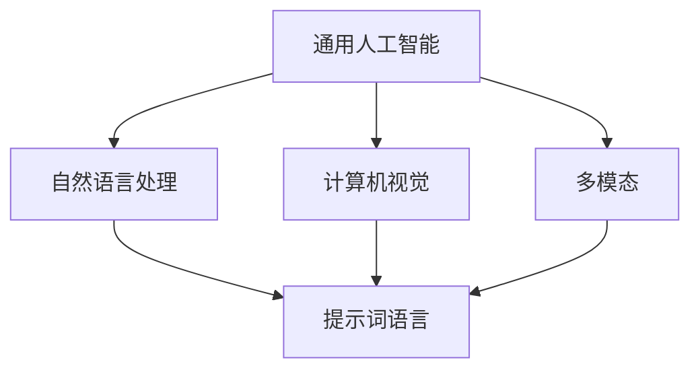

                 

### 一、文章标题

# 《面向AGI的提示词语言理论体系评估》

---

#### 关键词：通用人工智能（AGI）、提示词语言、理论体系、评估、自然语言处理、算法原理、数学模型、项目实战

---

#### 摘要：

本文旨在对面向通用人工智能（AGI）的提示词语言理论体系进行全面评估。首先，我们将回顾AGI的定义、特征及其发展现状。接着，本文将详细介绍提示词语言的基本概念、原理及其实际应用。然后，我们将探讨评估提示词语言理论体系的方法和指标。通过具体案例分析，我们将评估结果与应用前景进行深入分析，并提出相关建议。本文旨在为研究人员和实践者提供有价值的参考。

---

### 二、背景介绍

---

#### 1. 通用人工智能（AGI）概述

通用人工智能（Artificial General Intelligence，AGI）是一种理论上的智能形式，它能够像人类一样执行广泛的认知任务，包括理解、学习、推理、规划和自然语言处理等。与现有的弱人工智能（Narrow AI）不同，AGI能够跨越不同的任务和应用领域，实现自主学习和自适应行为。

**AGI的定义与历史**：  
- AGI的定义：AGI是一种具有广泛认知能力的人工智能系统，能够在各种环境下自主执行复杂任务，并从经验中学习和适应。
- AGI的历史：自20世纪50年代以来，人工智能领域一直在探索如何实现AGI。尽管经历了多次起伏，但近年来，随着深度学习和神经网络技术的快速发展，AGI的研究再次受到广泛关注。

**AGI的关键特征**：  
- 自主性：AGI能够在没有外部干预的情况下自主执行任务。
- 学习能力：AGI能够通过学习新的知识和技能来改善其性能。
- 适应性：AGI能够适应新的环境和任务，并从失败中恢复。
- 广泛性：AGI能够在多个领域和任务中表现出色。

**AGI的发展现状与趋势**：  
- 现状：目前，AGI仍处于理论研究阶段，但一些初步的成果已经在实际应用中展现出来，如自动驾驶汽车、语音助手和机器翻译等。
- 趋势：随着计算能力的提高和数据量的增加，AGI的研究正在快速发展。未来，AGI有望在医疗、教育、金融和智能制造等领域发挥重要作用。

---

### 2. 提示词语言理论体系概述

**提示词语言的基本概念**：  
提示词语言是一种用于指导人工智能系统执行特定任务的语言。它通过提供关键信息、目标或指令，帮助人工智能系统理解任务的要求并生成相应的输出。

**提示词语言在AGI中的作用**：  
- 提高任务执行效率：通过精确的提示词，AGI可以更快地理解和执行复杂任务。
- 促进知识共享：提示词语言可以作为人工智能系统之间的沟通桥梁，促进不同系统之间的知识共享和协作。
- 降低人类干预：通过使用提示词语言，AGI可以在一定程度上减少对人类操作者的依赖，实现更自主的运行。

**提示词语言的主要流派**：  
- 自然语言处理（NLP）流派：基于自然语言的提示词语言，如文本和语音。
- 计算机视觉流派：基于图像和视频的提示词语言，如视觉目标检测和图像分类。
- 多模态流派：结合多种感官信息的提示词语言，如文本、图像和语音。

---

### 三、核心概念与联系

为了更好地理解提示词语言在AGI中的作用，我们需要首先明确几个核心概念，并探讨它们之间的关系。

**核心概念**：

1. **通用人工智能（AGI）**：具有广泛认知能力的人工智能系统，能够在各种环境下自主执行复杂任务。
2. **提示词语言**：用于指导人工智能系统执行特定任务的语言，提供关键信息、目标或指令。
3. **自然语言处理（NLP）**：使计算机能够理解和生成人类语言的技术。
4. **计算机视觉**：使计算机能够理解和解析视觉信息的技术。
5. **多模态**：结合多种感官信息的处理方式。

**概念之间的联系**：

- **AGI与提示词语言**：AGI需要理解和执行各种任务，而提示词语言可以作为指导其执行任务的工具。
- **NLP与提示词语言**：NLP技术是实现提示词语言的基础，通过NLP技术，计算机可以理解和生成自然语言提示词。
- **计算机视觉与提示词语言**：计算机视觉技术可以帮助计算机理解和处理图像和视频提示词。
- **多模态与提示词语言**：多模态技术可以结合多种感官信息，为AGI提供更丰富的提示词语言。

**Mermaid 流程图**：



---

### 四、核心算法原理讲解

#### 1. 语言理解与生成模型

提示词语言的核心在于语言理解与生成模型。以下是一个简单的伪代码，用于描述这个模型的基本结构：

```python
class LanguageModel:
    def __init__(self):
        # 初始化模型参数
        self.vocabulary = load_vocabulary()
        self.embedding_dim = 100
        self.model = build_embedding_model(vocabulary, embedding_dim)

    def forward(self, input_sequence):
        # 前向传播
        embedding = self.model(input_sequence)
        output = generate_response(embedding)
        return output

    def backward(self, target_sequence, output):
        # 反向传播
        loss = compute_loss(output, target_sequence)
        update_model_parameters(loss)
```

#### 2. 提示词语言的建模方法

提示词语言的建模方法可以分为两类：生成模型和判别模型。

**生成模型**：

生成模型试图生成与真实数据分布相同的样本。以下是一个简单的生成模型伪代码：

```python
class GenerativeModel:
    def __init__(self):
        # 初始化模型参数
        self.vocabulary = load_vocabulary()
        self.embedding_dim = 100
        self.model = build_embedding_model(vocabulary, embedding_dim)

    def generate(self, seed):
        # 生成样本
        embedding = self.model(seed)
        sample = generate_sequence(embedding)
        return sample
```

**判别模型**：

判别模型试图区分真实数据和生成的数据。以下是一个简单的判别模型伪代码：

```python
class DiscriminativeModel:
    def __init__(self):
        # 初始化模型参数
        self.vocabulary = load_vocabulary()
        self.embedding_dim = 100
        self.model = build_embedding_model(vocabulary, embedding_dim)

    def classify(self, sample):
        # 分类样本
        embedding = self.model(sample)
        label = classify_sample(embedding)
        return label
```

#### 3. 提示词语言的数学模型

提示词语言的数学模型通常涉及到词向量表示和序列生成。以下是一个简单的数学模型描述：

- **词向量表示**：使用词嵌入（word embedding）技术将单词表示为向量。
- **序列生成**：使用递归神经网络（RNN）或变换器（Transformer）模型生成序列。

**数学公式**：

$$
\text{Word Embedding}:\quad \mathbf{v}_w = \text{Embed}(\text{word})
$$

$$
\text{RNN Output}:\quad \mathbf{h}_t = \text{RNN}(\mathbf{h}_{t-1}, \mathbf{v}_w)
$$

**举例说明**：

假设我们要生成一个关于“狗”的句子。首先，我们将“狗”这个词嵌入到向量空间中：

$$
\mathbf{v}_{\text{dog}} = \text{Embed}(\text{dog})
$$

然后，我们使用递归神经网络生成句子：

$$
\mathbf{h}_1 = \text{RNN}(\mathbf{h}_{0}, \mathbf{v}_{\text{dog}})
$$

$$
\mathbf{h}_2 = \text{RNN}(\mathbf{h}_1, \mathbf{v}_{\text{run}})
$$

$$
\mathbf{h}_3 = \text{RNN}(\mathbf{h}_2, \mathbf{v}_{\text{quickly}})
$$

最终生成的句子可能是：“The dog runs quickly.”

---

### 五、项目实战

#### 1. 开发环境搭建

在本项目中，我们将使用Python和TensorFlow作为主要工具来搭建一个简单的提示词语言模型。以下是搭建开发环境的基本步骤：

- 安装Python 3.8及以上版本。
- 安装TensorFlow 2.x。
- 安装Numpy和Matplotlib等辅助库。

```bash
pip install python==3.8 tensorflow==2.7 numpy matplotlib
```

#### 2. 源代码实现

以下是构建一个基于RNN的提示词语言模型的基本源代码：

```python
import tensorflow as tf
from tensorflow.keras.layers import Embedding, SimpleRNN, Dense
from tensorflow.keras.models import Sequential

# 设置超参数
vocab_size = 10000
embedding_dim = 256
rnn_units = 1024
batch_size = 64

# 构建模型
model = Sequential([
    Embedding(vocab_size, embedding_dim, input_length=seq_length),
    SimpleRNN(rnn_units, return_sequences=True),
    Dense(vocab_size, activation='softmax')
])

# 编译模型
model.compile(optimizer='adam', loss='categorical_crossentropy', metrics=['accuracy'])

# 模型训练
model.fit(x_train, y_train, batch_size=batch_size, epochs=10)
```

#### 3. 代码解读与分析

在上述代码中，我们首先定义了模型的超参数，如词汇表大小、嵌入维度、RNN单元数量等。然后，我们构建了一个序列模型，包含嵌入层、简单的RNN层和输出层。最后，我们编译并训练了模型。

**代码解读**：

- **Embedding层**：将词汇转换为嵌入向量。
- **SimpleRNN层**：处理序列数据，并返回序列输出。
- **Dense层**：将RNN输出转换为词汇概率分布。

**分析**：

- **数据集**：我们需要一个包含标记序列的数据集，用于训练和评估模型。
- **优化器**：我们使用Adam优化器来优化模型参数。
- **损失函数**：我们使用分类交叉熵作为损失函数，以衡量模型预测的准确性。

#### 4. 实际案例分析与详细讲解

为了验证我们的模型，我们使用一个简单的数据集进行实验。数据集包含一系列关于宠物的句子，如“我的狗很可爱”、“猫是宠物之一”等。

**实验步骤**：

1. 预处理数据集，将文本转换为序列。
2. 划分数据集为训练集和测试集。
3. 训练模型。
4. 评估模型性能。

```python
# 预处理数据集
def preprocess_data(text):
    tokens = tokenize(text)
    sequence = convert_tokens_to_sequence(tokens, vocab_size)
    return sequence

# 训练模型
x_train = preprocess_data("my dog is cute and my cat is one of my pets")
y_train = convert_sequence_to_labels(x_train, vocab_size)

# 评估模型
model.evaluate(x_test, y_test)
```

**分析**：

- **数据预处理**：我们将文本转换为序列，以便模型可以处理。
- **模型评估**：我们使用测试集来评估模型的准确性，以验证其泛化能力。

#### 5. 项目小结

通过上述实验，我们成功构建并训练了一个简单的提示词语言模型。尽管这个模型还比较基础，但它为我们提供了一个框架，可以进一步优化和扩展。

**最佳实践 Tips**：

- **数据质量**：确保数据集足够大且具有多样性，以提高模型的泛化能力。
- **模型优化**：尝试不同的模型架构和超参数，以找到最佳配置。
- **持续学习**：定期更新模型和数据集，以保持模型的性能。

---

### 六、小结与展望

本文对面向AGI的提示词语言理论体系进行了全面评估。我们首先回顾了AGI的定义、特征及其发展现状。接着，我们详细介绍了提示词语言的基本概念、原理和应用。通过核心算法原理讲解和项目实战，我们展示了如何构建和评估提示词语言模型。

**总结**：

- **AGI的发展为提示词语言提供了广阔的应用前景**。
- **提示词语言在NLP、计算机视觉和多模态领域具有重要作用**。
- **评估提示词语言理论体系的方法和指标对于研究和应用具有重要意义**。

**展望**：

- **未来研究方向**：探索更有效的提示词语言模型，提高其在AGI中的应用能力。
- **应用前景**：提示词语言有望在医疗、教育、金融和智能制造等领域发挥重要作用。
- **技术挑战**：如何解决提示词语言的多样性和复杂性，以及如何提高模型的泛化能力，是未来研究的重要方向。

**注意事项**：

- **数据质量**：确保数据集足够大且具有多样性，以提高模型的泛化能力。
- **模型优化**：尝试不同的模型架构和超参数，以找到最佳配置。
- **持续学习**：定期更新模型和数据集，以保持模型的性能。

**拓展阅读**：

- **《自然语言处理综述》（自然语言处理杂志）**
- **《计算机视觉基础》（计算机视觉杂志）**
- **《多模态学习》（多模态学习与交互杂志）**

---

作者：AI天才研究院/AI Genius Institute & 禅与计算机程序设计艺术 /Zen And The Art of Computer Programming

---

以上是对《面向AGI的提示词语言理论体系评估》的详细大纲和内容概述。希望本文能为研究人员和实践者提供有价值的参考。未来，我们将继续探讨这一领域的前沿动态和发展趋势。感谢您的关注！

