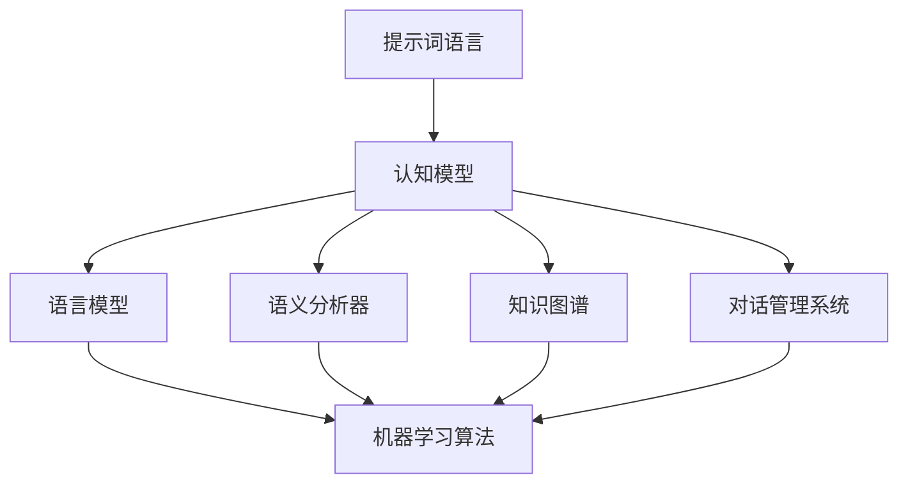

                 


# 面向AGI的提示词语言认知架构研究

## 关键词
AI通用智能（AGI），提示词语言，认知模型，语言模型，语义分析器，知识图谱，机器学习算法，用户交互接口。

## 摘要
本文旨在探讨面向通用人工智能（AGI）的提示词语言认知架构，从核心概念的联系、语言模型、认知模型、语义分析器、知识图谱、机器学习算法及用户交互接口等多个方面进行深入研究。通过详细的原理讲解、算法描述和实际案例剖析，本文旨在为构建高效、智能的AI交互系统提供有益的参考和指导。

## 引言

在人工智能（AI）迅速发展的背景下，通用人工智能（AGI）的概念受到了广泛关注。AGI旨在实现机器具备与人类相似的认知能力和智慧，能够自主理解、学习、推理和解决问题。实现AGI的关键在于构建一个高效、智能的提示词语言认知架构，使得AI系统能够理解用户的意图并通过自然语言进行交互。

本文将从以下几个核心方面展开研究：

1. **核心概念与联系**：介绍面向AGI的提示词语言认知架构中的核心概念，包括提示词语言、认知模型、语言模型、语义分析器、知识图谱、机器学习算法和用户交互接口，并阐述它们之间的相互联系。
2. **语言模型**：详细讲解语言模型的工作原理、算法实现和优化方法，探讨其在认知模型中的作用和重要性。
3. **认知模型**：阐述认知模型的设计原则、结构组成和功能模块，分析其在实现自然语言理解和任务执行中的作用。
4. **语义分析器**：深入探讨语义分析器的原理、算法和应用场景，分析其在认知模型中的作用和重要性。
5. **知识图谱**：介绍知识图谱的定义、结构和构建方法，探讨其在认知模型中的应用和作用。
6. **机器学习算法**：详细讲解常用的机器学习算法，包括深度学习、强化学习和迁移学习等，分析它们在认知模型中的应用和效果。
7. **用户交互接口**：阐述用户交互接口的设计原则、实现方法和用户体验，探讨其对认知模型和AI系统的整体性能的影响。

通过本文的研究，我们希望能够为构建高效、智能的AI交互系统提供有益的参考和指导，推动AGI领域的发展和应用。

### 核心概念与联系

面向AGI的提示词语言认知架构涉及多个核心概念，这些概念相互联系，共同构成了整个架构的基础。理解这些核心概念及其相互关系，对于设计和实现高效的AI系统至关重要。

#### 提示词语言

提示词语言是一种专门为与人工智能系统交互而设计的语言形式。它旨在简化用户的输入，使其能够使用自然语言表达复杂的要求和意图。提示词语言的关键特点是简明扼要，同时保持足够的精确性，以便AI系统能够正确理解并执行任务。

在设计提示词语言时，需要考虑以下几个关键方面：

1. **语法简洁性**：提示词语言的语法应尽量简单，以便用户能够快速掌握并使用。复杂的语法规则可能会增加用户的认知负担，影响交互体验。
2. **上下文敏感性**：提示词语言应能够捕捉到用户的上下文信息，从而提高交互的准确性和流畅性。例如，用户在提问时可能已经提供了部分信息，这些信息应能够被AI系统有效利用。
3. **自然语言处理（NLP）兼容性**：提示词语言应与现有的自然语言处理技术兼容，以便AI系统能够高效地处理用户输入。这要求提示词语言设计时考虑到NLP算法的需求和限制。

提示词语言在认知模型中扮演着桥梁的角色。它不仅需要处理用户的原始输入，还需要结合认知模型和其他技术，以生成有效的响应。因此，一个良好的提示词语言设计对于实现高效的AI交互至关重要。

#### 认知模型

认知模型是人工智能系统的核心部分，用于理解和处理输入的自然语言。它模拟人类大脑的认知过程，包括感知、理解、推理和记忆等功能。认知模型的设计目标是实现自然语言理解和任务执行，使得AI系统能够自主地理解和应对复杂任务。

认知模型通常包括以下几个关键组件：

1. **语言模型**：这是认知模型的基础，用于预测文本的下一个单词或句子，从而生成自然语言响应。语言模型通过对大量文本数据的学习，捕捉语言中的统计规律和模式，从而能够生成连贯、自然的文本响应。
2. **语义分析器**：用于将自然语言文本转换为机器可理解的语义结构。它负责识别文本中的实体、关系和意图。语义分析器在认知模型中起着关键作用，因为它决定了AI系统对输入文本的理解程度。
3. **知识图谱**：这是一种图形化结构，用于表示实体及其之间的关系。知识图谱可以帮助AI系统更好地理解和处理复杂的问题。在认知模型中，知识图谱通常用于辅助语义分析器和语言模型，提高系统的认知能力。
4. **对话管理系统**：负责控制对话流程，确保AI系统能够理解用户的意图并给出合适的响应。对话管理系统通常包括对话策略、对话状态跟踪和自然语言生成等模块。它决定了AI系统与用户交互的流畅性和有效性。

#### 语言模型

语言模型（Language Model）是认知模型中的核心组件，负责预测文本的下一个单词或句子。它通过学习大量的文本数据，捕捉语言中的统计规律和模式，从而能够生成连贯、自然的文本响应。语言模型在认知模型中起着至关重要的作用，因为它决定了AI系统对输入文本的理解程度和生成响应的质量。

语言模型的工作原理可以概括为以下几个步骤：

1. **数据预处理**：首先，需要从大量的文本数据中提取特征，这些特征可以是单词、字符、词组或句子。常用的预处理方法包括分词、词性标注和词嵌入等。
2. **训练模型**：接下来，使用预处理的文本数据训练语言模型。训练过程通常涉及优化模型的参数，以最小化预测误差。常见的训练方法包括基于统计的方法（如n-gram模型）和基于神经网络的方法（如深度神经网络、递归神经网络等）。
3. **预测生成**：在训练完成后，语言模型可以用于预测新的文本序列。预测过程通常从输入文本的最后一个单词开始，逐步生成下一个单词或句子。

语言模型在认知模型中的作用和重要性体现在以下几个方面：

1. **理解输入文本**：语言模型能够捕捉语言中的统计规律和模式，从而对输入文本进行理解和分析。这有助于AI系统更好地理解用户的意图和需求。
2. **生成自然语言响应**：通过预测下一个单词或句子，语言模型能够生成连贯、自然的文本响应。这提高了AI系统与用户的交互质量，使其更具有说服力和吸引力。
3. **辅助其他组件**：语言模型的结果可以用于辅助其他组件，如语义分析器和对话管理系统。通过结合语言模型的信息，其他组件可以更好地理解和处理复杂的任务。

#### 语义分析器

语义分析器（Semantic Analyzer）是认知模型中的一个重要组件，负责将自然语言文本转换为机器可理解的语义结构。它通过识别文本中的实体、关系和意图，将原始的文本数据转化为结构化的数据，以便其他组件（如语言模型和对话管理系统）进行进一步处理。

语义分析器的工作原理可以概括为以下几个步骤：

1. **文本预处理**：首先，对输入文本进行预处理，包括分词、词性标注、命名实体识别等。这些预处理步骤有助于提取文本中的关键信息，为后续的语义分析做好准备。
2. **实体识别**：识别文本中的命名实体（如人名、地名、组织名等），并将其标记为特定的实体类别。实体识别是语义分析的关键步骤，因为它有助于理解文本内容的核心要素。
3. **关系提取**：分析文本中的实体关系，如因果关系、所属关系、参与关系等。关系提取有助于建立实体之间的联系，从而更好地理解文本的语义结构。
4. **意图识别**：确定文本的意图，如查询、请求、命令等。意图识别有助于AI系统理解用户的意图和需求，从而生成适当的响应。

语义分析器在认知模型中的作用和重要性体现在以下几个方面：

1. **提高理解准确性**：通过将文本转换为结构化的语义表示，语义分析器有助于提高AI系统对文本的理解准确性。这有助于避免歧义和误解，提高交互的准确性。
2. **辅助语言模型**：语义分析器的结果可以用于辅助语言模型，提高其生成响应的质量。通过结合语义信息，语言模型可以更好地生成与用户意图相符的文本响应。
3. **优化对话管理**：语义分析器可以帮助对话管理系统更好地理解用户的意图和需求，从而优化对话流程。通过分析语义信息，对话管理系统可以更准确地预测用户的下一步动作，提高交互的流畅性和有效性。

#### 知识图谱

知识图谱（Knowledge Graph）是一种用于表示实体之间关系的图形化结构。它在认知模型中发挥着重要作用，有助于AI系统更好地理解和处理复杂问题。知识图谱通常包含大量实体及其属性、关系和约束，这些信息有助于构建一个结构化的知识库，为AI系统提供丰富的背景知识。

知识图谱的构建方法可以概括为以下几个步骤：

1. **实体识别**：从文本数据中识别出重要的实体，如人、地点、组织等。实体识别是构建知识图谱的基础，因为它确定了图谱中的基本要素。
2. **关系提取**：分析文本中的实体关系，如因果关系、所属关系、参与关系等。关系提取有助于建立实体之间的联系，从而构建一个完整的知识图谱。
3. **属性抽取**：从文本数据中提取实体的属性信息，如年龄、职位、地理位置等。属性抽取有助于丰富实体的信息，提高知识图谱的准确性。
4. **约束建模**：定义实体之间的约束条件，如同一性约束、时间约束等。约束建模有助于确保知识图谱的一致性和准确性。

知识图谱在认知模型中的应用和作用体现在以下几个方面：

1. **语义理解**：知识图谱可以帮助AI系统更好地理解语义，尤其是在处理复杂的文本数据时。通过分析知识图谱中的关系和约束，AI系统可以更准确地理解和解释文本内容。
2. **知识推理**：知识图谱支持推理操作，如因果推理、关联推理等。这些推理操作有助于AI系统从已知信息中推导出新的信息，从而提高其认知能力。
3. **增强智能**：知识图谱为AI系统提供了丰富的背景知识，有助于增强其智能能力。通过结合知识图谱，AI系统可以更有效地处理复杂的任务，提供更准确和有用的响应。

#### 机器学习算法

机器学习算法（Machine Learning Algorithms）是构建认知模型和优化其性能的基础。它们通过从数据中自动学习和发现模式，提高了AI系统的自主性和适应性。常用的机器学习算法包括深度学习、强化学习和迁移学习等，它们在认知模型中发挥着重要作用。

1. **深度学习**：深度学习是一种基于多层神经网络的机器学习技术。它通过模拟人脑神经元之间的连接和激活机制，实现了对复杂数据的高效学习和表示。深度学习在图像识别、语音识别和自然语言处理等领域取得了显著成果。在认知模型中，深度学习算法用于训练语言模型、语义分析器和知识图谱等组件，提高了AI系统的理解能力和生成响应的质量。

2. **强化学习**：强化学习是一种通过与环境交互来学习最优策略的机器学习技术。它通过奖励机制激励AI系统不断优化行为，从而实现目标。在认知模型中，强化学习算法用于训练对话管理系统，使其能够根据用户的反馈动态调整对话策略，提高交互的流畅性和有效性。

3. **迁移学习**：迁移学习是一种利用已训练好的模型在新任务上快速学习和泛化的技术。它通过将已有知识迁移到新任务中，减少了模型训练的时间和计算资源需求。在认知模型中，迁移学习算法用于快速适应不同的用户场景和任务需求，提高了AI系统的适应性和灵活性。

#### 用户交互接口

用户交互接口（User Interface，UI）是用户与AI系统进行交互的界面。一个良好的用户交互接口设计对于实现高效、自然的交互体验至关重要。它应该具备以下几个特点：

1. **直观性**：用户交互接口应设计得直观、易于理解，使用户能够快速掌握操作方法。
2. **响应性**：用户交互接口应能够快速响应用户的操作，提供及时、准确的反馈。
3. **个性化**：用户交互接口应根据用户的个性化需求和偏好进行定制，提高用户体验。

用户交互接口在认知模型中的作用和重要性体现在以下几个方面：

1. **提高交互质量**：良好的用户交互接口设计有助于提高AI系统与用户的交互质量，使其更具有说服力和吸引力。
2. **优化用户体验**：用户交互接口的优化有助于提高用户体验，增强用户对AI系统的信任感和满意度。
3. **辅助认知模型**：用户交互接口的设计和实现可以辅助认知模型，提高其理解和处理用户意图的能力。

### 关系图

为了更好地理解面向AGI的提示词语言认知架构中各核心概念之间的联系，我们可以使用Mermaid流程图进行可视化表示。以下是一个简单的Mermaid流程图示例：



这个流程图展示了各个核心概念之间的基本联系，包括提示词语言、认知模型、语言模型、语义分析器、知识图谱、对话管理系统和机器学习算法。通过这个流程图，我们可以更清晰地理解各个组件在认知架构中的作用和相互关系。

### 总结

面向AGI的提示词语言认知架构是一个复杂而综合的系统，它结合了多种技术和算法，以实现与用户的自然语言交互。通过深入理解这些核心概念及其相互关系，我们可以更好地设计和发展面向通用人工智能的认知架构。本节内容为后续的详细探讨奠定了基础，为我们进一步深入研究语言模型、认知模型、语义分析器、知识图谱和用户交互接口等关键组件提供了指导。

---

在下一节中，我们将详细探讨语言模型的工作原理、算法实现和优化方法，分析其在认知模型中的作用和重要性。通过这一节的讨论，我们将对语言模型有更深入的理解，并探讨如何提升其性能，以实现更高效的自然语言处理。

---

## 语言模型的工作原理与实现

### 语言模型的基本概念

语言模型（Language Model，LM）是自然语言处理（Natural Language Processing，NLP）领域中的核心组件，主要用于预测文本序列。语言模型的目标是通过分析大量语言数据，学习语言中的概率分布，从而能够生成具有高概率的文本序列。在面向AGI的提示词语言认知架构中，语言模型起着至关重要的作用，它不仅决定了AI系统对输入文本的理解程度，还直接影响其生成响应的质量。

### 语言模型的数学表示

语言模型的数学表示通常基于概率模型，常用的有n-gram模型、马尔可夫模型和神经网络模型等。以下是这些模型的数学表示：

1. **n-gram模型**：n-gram模型是一种基于历史信息的统计模型，它假设一个单词序列的概率可以通过其前n个单词的概率乘积来表示。其数学公式为：
   $$
   P(w_1, w_2, ..., w_n) = P(w_1) \times P(w_2|w_1) \times ... \times P(w_n|w_{n-1})
   $$
   其中，$w_1, w_2, ..., w_n$ 分别表示文本序列中的n个连续单词。

2. **马尔可夫模型**：马尔可夫模型是基于状态转移概率的模型，它假设当前单词的概率只依赖于前一个单词的状态，而与其他历史信息无关。其数学公式为：
   $$
   P(w_t|w_{t-1}, w_{t-2}, ..., w_1) = P(w_t|w_{t-1})
   $$

3. **神经网络模型**：神经网络模型，特别是递归神经网络（RNN）和变换器（Transformer）模型，通过学习输入和输出之间的复杂非线性关系，实现了更高层次的语言建模。其数学表示通常涉及复杂的网络结构和优化算法，如反向传播算法。

### 语言模型的算法实现

语言模型的算法实现可以分为以下几个步骤：

1. **数据预处理**：首先，从大量文本数据中提取特征，这些特征可以是单词、字符、词组或句子。常用的预处理方法包括分词、词性标注、词嵌入等。其中，词嵌入（Word Embedding）是一种将单词映射到高维向量空间的方法，它有助于捕捉单词之间的语义关系。

2. **模型训练**：使用预处理后的文本数据训练语言模型。训练过程通常涉及优化模型的参数，以最小化预测误差。在n-gram模型中，训练过程主要包括计算每个单词及其前n-1个单词的联合概率。在神经网络模型中，训练过程通常涉及复杂的优化算法，如梯度下降算法和反向传播算法。

3. **模型评估**：通过测试集评估模型的性能，常用的评价指标包括准确率、召回率和F1值等。评估过程有助于确定模型是否已达到预定的性能标准，并指导进一步优化。

4. **模型应用**：训练完成的模型可以用于预测新的文本序列。在生成文本时，模型会根据已学到的概率分布生成下一个单词或句子。

### 语言模型的优化方法

为了提高语言模型的性能，可以采用多种优化方法：

1. **数据增强**：通过增加训练数据量，提高模型的泛化能力。数据增强方法包括随机填充、同义词替换、语言翻译等。

2. **模型优化**：采用更复杂的模型结构，如变换器（Transformer）模型，提高模型的表示能力。变换器模型通过自注意力机制，能够更好地捕捉长距离依赖关系。

3. **多任务学习**：将语言模型与其他任务（如图像识别、语音识别等）结合，共享模型参数，提高模型的性能。

4. **迁移学习**：利用预训练的语言模型在新任务上进行微调，减少训练时间和计算资源的需求。迁移学习在面向AGI的应用中具有重要意义，因为它能够利用已有知识快速适应新的任务场景。

### 伪代码示例

以下是一个简单的n-gram语言模型的伪代码示例：

```python
# 初始化模型参数
def initialize_model():
    # 初始化单词及其联合概率
    model = {}
    for n in range(1, N_GRAM_SIZE + 1):
        model[n] = {}
        for word in vocabulary:
            model[n][word] = {}
            for prev_word in vocabulary:
                model[n][word][prev_word] = 0

# 训练模型
def train_model(data):
    for sentence in data:
        for n in range(1, N_GRAM_SIZE + 1):
            for i in range(len(sentence) - n):
                current_word = sentence[i]
                prev_words = sentence[i:i + n - 1]
                model[n][current_word][prev_words] += 1

# 预测下一个单词
def predict_next_word(current_word, prev_words):
    # 计算当前单词的概率
    probabilities = {}
    for next_word in vocabulary:
        probabilities[next_word] = model[N_GRAM_SIZE][current_word][prev_words]
    return max(probabilities, key=probabilities.get)

# 使用模型生成文本
def generate_text(start_word, num_words):
    text = [start_word]
    for _ in range(num_words - 1):
        current_word = text[-1]
        prev_words = text[-N_GRAM_SIZE + 1:-1]
        next_word = predict_next_word(current_word, prev_words)
        text.append(next_word)
    return ' '.join(text)
```

在这个示例中，我们首先初始化n-gram模型，然后使用训练数据训练模型，最后使用训练好的模型生成文本。通过这个简单的示例，我们可以理解n-gram语言模型的基本原理和实现方法。

### 实际案例

在实际应用中，语言模型广泛应用于自然语言生成、机器翻译、文本摘要、问答系统等领域。以下是一个自然语言生成的实际案例：

1. **自然语言生成**：在聊天机器人、智能客服等应用场景中，语言模型用于生成自然的回复文本，提高用户体验。例如，OpenAI的GPT系列模型在生成对话文本方面表现出色。

2. **机器翻译**：在机器翻译领域，语言模型用于预测目标语言的单词或句子，提高翻译的准确性和流畅性。著名的翻译模型如Google Translate和Microsoft Translator都采用了先进的语言模型技术。

3. **文本摘要**：在信息提取和摘要生成领域，语言模型用于生成简明扼要的文本摘要，帮助用户快速获取关键信息。例如，Facebook的FB5模型在文本摘要任务上取得了显著成果。

4. **问答系统**：在问答系统中，语言模型用于理解用户的问题，并生成准确的答案。例如，微软的Bing搜索和亚马逊的Alexa智能助理都采用了语言模型技术，以提供高质量的问答服务。

通过这些实际案例，我们可以看到语言模型在自然语言处理领域的重要应用和价值。在未来，随着技术的不断进步，语言模型将在更多领域发挥重要作用，推动人工智能的发展和应用。

### 总结

在本节中，我们详细探讨了语言模型的工作原理、算法实现和优化方法。通过数学表示和伪代码示例，我们理解了n-gram模型和神经网络模型的基本原理，并分析了语言模型在实际应用中的重要性。在下一节中，我们将进一步探讨认知模型的设计原则、结构组成和功能模块，分析其在实现自然语言理解和任务执行中的作用。

---

## 认知模型的设计原则与功能模块

### 认知模型的设计原则

认知模型（Cognitive Model）是人工智能（AI）系统理解和模拟人类认知过程的抽象表示。在设计认知模型时，需要遵循以下原则：

1. **人性化**：认知模型应尽量模拟人类认知过程，使AI系统能够理解自然语言、处理复杂任务和进行推理。
2. **模块化**：认知模型应采用模块化设计，使各个组件（如语言模型、语义分析器、知识图谱等）能够独立开发和优化。
3. **可扩展性**：认知模型应具备良好的可扩展性，能够适应不同场景和应用需求，方便后续功能扩展和优化。
4. **高效性**：认知模型应在保证准确性的同时，追求高效性，降低计算和存储资源的需求。

### 认知模型的结构组成

认知模型通常包括以下几个关键功能模块：

1. **语言模型**：负责理解用户的自然语言输入，生成文本响应。它通过学习大量文本数据，捕捉语言中的统计规律和模式，从而预测下一个单词或句子。
2. **语义分析器**：负责将自然语言文本转换为机器可理解的语义结构。它通过识别文本中的实体、关系和意图，将原始的文本数据转化为结构化的数据，以便其他组件进行进一步处理。
3. **知识图谱**：负责存储和管理实体及其关系。它通过图形化结构表示实体之间的复杂关系，提供丰富的背景知识，帮助AI系统更好地理解和处理复杂问题。
4. **对话管理系统**：负责控制对话流程，确保AI系统能够理解用户的意图并给出合适的响应。它通常包括对话策略、对话状态跟踪和自然语言生成等模块。

### 认知模型的功能模块分析

1. **语言模型**：

   - **功能**：语言模型是认知模型的核心组件，负责理解用户的自然语言输入，生成文本响应。
   - **实现**：语言模型通过学习大量文本数据，捕捉语言中的统计规律和模式。常见的实现方法包括n-gram模型、马尔可夫模型和神经网络模型（如RNN、Transformer等）。
   - **优势**：神经网络模型能够捕捉长距离依赖关系，生成更自然的文本响应。
   - **挑战**：语言模型的训练过程复杂，对计算资源要求较高。

2. **语义分析器**：

   - **功能**：语义分析器负责将自然语言文本转换为机器可理解的语义结构，识别文本中的实体、关系和意图。
   - **实现**：语义分析器通常采用基于规则的方法、统计方法和机器学习方法。基于规则的方法如命名实体识别（NER）和关系提取等；统计方法如条件随机场（CRF）和朴素贝叶斯等；机器学习方法如卷积神经网络（CNN）和长短期记忆网络（LSTM）等。
   - **优势**：机器学习方法能够处理复杂、非线性的语义关系，提高语义分析的准确性。
   - **挑战**：语义分析器需要大量标注数据，且在不同语言和文化背景下可能面临适应性挑战。

3. **知识图谱**：

   - **功能**：知识图谱负责存储和管理实体及其关系，提供丰富的背景知识，帮助AI系统更好地理解和处理复杂问题。
   - **实现**：知识图谱采用图形化结构，表示实体及其关系。常见的实现方法包括图数据库（如Neo4j、OrientDB等）和图计算框架（如Apache Flink、Apache Spark等）。
   - **优势**：知识图谱能够提供结构化的数据表示，支持高效的查询和推理操作。
   - **挑战**：知识图谱的构建和维护需要大量人力和物力资源，且在动态环境中可能面临实时性挑战。

4. **对话管理系统**：

   - **功能**：对话管理系统负责控制对话流程，确保AI系统能够理解用户的意图并给出合适的响应。它通常包括对话策略、对话状态跟踪和自然语言生成等模块。
   - **实现**：对话管理系统采用基于规则的方法、统计方法和机器学习方法。基于规则的方法如状态转移图和有限状态机等；统计方法如马尔可夫决策过程（MDP）和Q学习等；机器学习方法如深度强化学习和生成对抗网络（GAN）等。
   - **优势**：机器学习方法能够自适应地调整对话策略，提高对话的流畅性和有效性。
   - **挑战**：对话管理系统的实现复杂，需要综合考虑用户意图、对话历史和上下文信息等。

### 认知模型在自然语言理解和任务执行中的作用

1. **自然语言理解**：

   - **功能**：认知模型通过语言模型和语义分析器，实现自然语言理解。它能够识别文本中的实体、关系和意图，将自然语言输入转化为结构化的语义表示。
   - **实现**：结合语言模型和语义分析器的输出，认知模型能够构建一个语义表示，用于后续的任务处理。

2. **任务执行**：

   - **功能**：认知模型通过对话管理系统，实现任务执行。它能够根据用户的意图和需求，生成合适的响应，并控制对话流程，确保任务顺利完成。
   - **实现**：对话管理系统负责根据当前对话状态和用户意图，选择合适的策略和响应，与用户进行交互。

### 实际应用场景

认知模型在多个实际应用场景中发挥着重要作用：

1. **智能客服**：认知模型能够理解用户的问题，提供准确的答案和建议，提高客服的响应速度和准确性。
2. **智能助手**：认知模型能够与用户进行自然语言交互，完成日程管理、任务安排等任务，提高用户的工作效率。
3. **文本生成**：认知模型能够生成高质量的文本，如新闻报道、文章摘要、产品描述等，提高内容创作的效率和质量。
4. **智能问答系统**：认知模型能够理解用户的问题，并从大量信息中检索出相关答案，提供高质量的问答服务。

### 总结

在本节中，我们详细探讨了认知模型的设计原则、结构组成和功能模块，分析了其在自然语言理解和任务执行中的作用。通过了解语言模型、语义分析器、知识图谱和对话管理系统的基本原理和实现方法，我们可以更好地设计和实现面向通用人工智能的认知模型。在下一节中，我们将进一步探讨语义分析器的工作原理、算法和应用场景，以及其在认知模型中的重要性。

---

## 语义分析器的工作原理与应用

### 语义分析器的基本概念

语义分析器（Semantic Analyzer）是认知模型中的一个关键组件，负责将自然语言文本转换为机器可理解的语义结构。它通过对文本进行深度解析，识别文本中的实体、关系和意图，从而为后续的任务处理提供结构化的语义信息。语义分析器在自然语言处理（NLP）领域中扮演着至关重要的角色，是实现智能对话、文本生成和任务执行的基础。

### 语义分析器的工作原理

语义分析器的工作原理可以分为以下几个步骤：

1. **文本预处理**：首先，对输入文本进行预处理，包括分词、词性标注、命名实体识别等。这些预处理步骤有助于提取文本中的关键信息，为后续的语义分析做准备。
   
2. **实体识别**：语义分析器通过命名实体识别（Named Entity Recognition，NER）技术，从文本中识别出人、地点、组织等实体。命名实体识别是语义分析的重要一步，因为它为后续的语义解析提供了基础数据。

3. **关系提取**：在识别出实体后，语义分析器进一步分析实体之间的关系，如因果关系、所属关系、参与关系等。关系提取有助于建立实体之间的联系，从而更全面地理解文本的语义结构。

4. **意图识别**：语义分析器通过分析文本中的词汇和句法结构，识别出用户的意图，如查询、请求、命令等。意图识别对于实现有效的任务执行至关重要，因为它决定了AI系统应该如何响应用户的需求。

5. **语义表示**：最后，语义分析器将提取的实体、关系和意图转换为机器可理解的语义表示，如语义角色标注、语义角色关系图等。这种语义表示为后续的对话管理和任务执行提供了关键信息。

### 语义分析器的算法原理

语义分析器通常采用以下几种算法原理：

1. **基于规则的方法**：基于规则的方法使用预先定义的规则库，对输入文本进行解析和标注。这种方法具有实现简单、解释性强等优点，但需要大量手动规则定义，且在面对复杂文本时可能面临局限性。

2. **统计方法**：统计方法使用概率模型，如条件随机场（CRF）、朴素贝叶斯等，对输入文本进行解析和标注。这种方法通过大量训练数据学习文本的模式和概率分布，从而提高语义分析的准确性。

3. **机器学习方法**：机器学习方法，如卷积神经网络（CNN）、循环神经网络（RNN）、长短时记忆网络（LSTM）等，通过学习输入和输出之间的复杂非线性关系，实现对文本的深度解析和标注。这种方法具有较好的灵活性和泛化能力，但需要大量的训练数据和计算资源。

以下是一个基于卷积神经网络（CNN）的命名实体识别（NER）算法的伪代码示例：

```python
# 加载预训练的卷积神经网络模型
model = load_pretrained_model()

# 对输入文本进行分词
tokens = tokenize(text)

# 对分词后的文本进行卷积神经网络处理
logits = model.predict(tokens)

# 根据 logits 得出命名实体识别结果
entities = []
for token, logits in zip(tokens, logits):
    if logits[0] > logits[1]:
        entities.append((token, "O"))  # "O" 表示普通词汇
    else:
        entities.append((token, "B"))  # "B" 表示命名实体

# 输出命名实体识别结果
print(entities)
```

在这个示例中，我们首先加载一个预训练的卷积神经网络模型，然后对输入文本进行分词。接着，使用卷积神经网络模型对分词后的文本进行处理，并基于处理结果得出命名实体识别结果。

### 语义分析器在认知模型中的应用

语义分析器在认知模型中发挥着重要作用，具体体现在以下几个方面：

1. **提高自然语言理解能力**：通过识别文本中的实体、关系和意图，语义分析器能够提高AI系统对输入文本的理解能力，减少歧义和误解，从而生成更准确的文本响应。

2. **优化对话管理**：语义分析器的输出结果可以用于对话管理系统，帮助AI系统更好地理解用户的意图和需求，从而生成更自然的对话响应。例如，在智能客服场景中，语义分析器可以识别出用户的问题类型，帮助对话管理系统选择合适的答案。

3. **增强任务执行能力**：语义分析器能够为任务执行模块提供结构化的语义信息，帮助AI系统更好地理解任务需求，从而更有效地完成任务。例如，在智能助手场景中，语义分析器可以识别出用户请求的任务类型和参数，帮助智能助手完成日程管理、任务安排等任务。

### 应用场景

语义分析器在多个实际应用场景中发挥着重要作用，以下是一些典型应用场景：

1. **智能客服**：语义分析器能够识别用户的问题类型，提供准确的答案和建议，提高客服的响应速度和准确性。

2. **文本生成**：语义分析器可以用于生成高质量的文本，如新闻报道、文章摘要、产品描述等，提高内容创作的效率和质量。

3. **智能问答系统**：语义分析器能够理解用户的问题，并从大量信息中检索出相关答案，提供高质量的问答服务。

4. **智能助手**：语义分析器可以帮助智能助手理解用户的意图和需求，从而提供更个性化的服务，提高用户体验。

### 实际案例

以下是一个智能客服应用中的实际案例：

- **问题描述**：用户向智能客服提问：“我的订单何时能送达？”
- **语义分析**：
  - **实体识别**：订单、送达时间
  - **关系提取**：订单与送达时间之间存在时间关系
  - **意图识别**：查询订单的送达时间
- **响应**：智能客服回复：“根据您的订单信息，预计将在明天下午送达。”

在这个案例中，语义分析器帮助智能客服准确理解用户的意图，并提供合适的响应。

### 总结

在本节中，我们详细探讨了语义分析器的工作原理、算法原理及其在认知模型中的应用。通过了解语义分析器的基本概念和实现方法，我们可以更好地实现自然语言理解和任务执行。在下一节中，我们将进一步探讨知识图谱的定义、结构和构建方法，以及其在认知模型中的应用和作用。

---

## 知识图谱的定义、结构和构建方法

### 知识图谱的定义

知识图谱（Knowledge Graph）是一种用于表示实体之间复杂关系的图形化结构。它通过将现实世界中的实体（如人、地点、组织等）及其属性和关系以结构化的方式表示出来，形成一个全局的语义网络。知识图谱的核心目标是提供一种高效、可扩展的方法来存储、管理和查询大规模的语义信息，从而支持智能推理和知识发现。

### 知识图谱的结构

知识图谱通常由以下三个主要部分组成：

1. **实体（Entities）**：知识图谱中的基本元素，表示现实世界中的各种对象。实体可以是具体的实体，如人、地点、事物等，也可以是抽象的概念，如概念、属性等。

2. **关系（Relationships）**：知识图谱中用于表示实体之间关系的边。关系可以是简单的二元关系，如“属于”、“位于”等，也可以是复杂的多元关系，如“工作于”、“参与”等。

3. **属性（Properties）**：知识图谱中用于描述实体和关系的额外信息。属性可以是数值、字符串、日期等类型的数据，它们为实体和关系提供了更详细的描述。

### 知识图谱的表示方法

知识图谱的表示方法可以采用多种形式，以下是两种常见的表示方法：

1. **图形表示**：知识图谱可以通过图形的方式表示，其中节点表示实体，边表示关系，边的权重和属性表示关系的强度和类型。这种表示方法直观、易于理解，但在大规模数据集上可能面临存储和查询效率问题。

2. **三元组表示**：知识图谱可以用三元组（主体，关系，客体）的形式表示，如（人，工作于，公司）。这种表示方法简洁、紧凑，便于存储和查询，但可能缺乏图形表示的直观性。

### 知识图谱的构建方法

知识图谱的构建是一个复杂的过程，通常包括以下几个步骤：

1. **数据收集**：从各种数据源（如文本、数据库、知识库等）收集与实体和关系相关的信息。这些数据源可以是结构化的，如关系数据库，也可以是非结构化的，如文本、图像等。

2. **数据预处理**：对收集到的数据进行清洗、去重和格式转换，确保数据的一致性和准确性。数据预处理步骤包括实体识别、关系提取、文本分类和实体链接等。

3. **实体和关系抽取**：从预处理后的数据中提取实体和关系。实体抽取通常采用命名实体识别（NER）技术，关系抽取则涉及实体间关系的识别和分类。

4. **知识融合**：将来自不同数据源的实体和关系进行整合，消除冗余，保证知识的一致性。知识融合方法包括实体消歧、关系对齐和知识融合算法等。

5. **知识存储和索引**：将构建好的知识图谱存储在图数据库中，并创建索引，以支持高效的查询和推理操作。常见的图数据库包括Neo4j、OrientDB和Apache Giraph等。

### 知识图谱的应用

知识图谱在认知模型中扮演着重要角色，其应用场景广泛，包括但不限于以下方面：

1. **智能搜索**：通过知识图谱，可以提供更准确的搜索结果，并实现基于语义的搜索，提高用户体验。

2. **智能问答**：知识图谱可以用于智能问答系统，通过理解用户的问题，从知识库中检索相关答案，提供高质量的问答服务。

3. **推荐系统**：知识图谱可以用于推荐系统，通过分析实体之间的关系，为用户推荐相关的内容或产品。

4. **知识图谱可视化**：知识图谱可视化工具可以帮助用户直观地理解实体之间的关系，提高知识图谱的可访问性和可理解性。

### 知识图谱在认知模型中的作用

知识图谱在认知模型中的作用主要体现在以下几个方面：

1. **增强语义理解**：通过提供丰富的背景知识，知识图谱可以帮助AI系统更好地理解用户的意图和需求，减少歧义和误解。

2. **支持智能推理**：知识图谱中的关系和属性可以用于智能推理，帮助AI系统从已知信息中推导出新的信息，提高其认知能力。

3. **优化任务执行**：知识图谱可以为任务执行模块提供结构化的语义信息，帮助AI系统更有效地完成任务。

### 实际案例

以下是一个知识图谱在实际应用中的案例：

- **问题描述**：用户询问：“北京是哪个国家的首都？”
- **知识图谱查询**：
  - 实体：北京、国家、首都
  - 关系：北京是中国的首都
- **响应**：AI系统回答：“北京是中国的首都。”

在这个案例中，知识图谱帮助AI系统快速查询到相关的信息，并提供准确的回答。

### 总结

在本节中，我们详细探讨了知识图谱的定义、结构和构建方法，以及其在认知模型中的应用和作用。通过了解知识图谱的基本概念和构建方法，我们可以更好地实现语义理解、智能推理和任务执行。在下一节中，我们将深入探讨常见的机器学习算法，包括深度学习、强化学习和迁移学习，以及它们在认知模型中的应用和效果。

---

## 常见的机器学习算法及其在认知模型中的应用

### 深度学习

深度学习（Deep Learning，DL）是一种基于多层神经网络的机器学习技术，它在处理复杂数据和任务方面表现出色。深度学习在图像识别、语音识别、自然语言处理等领域取得了显著的成果，并在认知模型中发挥着重要作用。

#### 深度学习的基本原理

深度学习的基本原理是通过构建多层神经网络，对输入数据进行逐层变换，从而提取出高层次的特征。神经网络由输入层、隐藏层和输出层组成，每个层由多个神经元（节点）组成。神经元之间通过权重和偏置进行连接，并通过激活函数进行非线性变换。

以下是一个简单的多层感知机（MLP）的数学模型：

$$
Z^{(l)} = \sigma(W^{(l)} \cdot A^{(l-1)} + b^{(l)})
$$

其中，$Z^{(l)}$ 表示第 $l$ 层的输出，$\sigma$ 是激活函数（如ReLU、Sigmoid、Tanh等），$W^{(l)}$ 和 $b^{(l)}$ 分别是第 $l$ 层的权重和偏置，$A^{(l-1)}$ 是前一层的输出。

#### 深度学习在认知模型中的应用

1. **图像识别**：卷积神经网络（CNN）是深度学习在图像识别领域的经典应用。CNN通过卷积层、池化层和全连接层等结构，对图像数据进行特征提取和分类。

2. **语音识别**：循环神经网络（RNN）及其变种（如LSTM和GRU）在语音识别中表现出色。RNN能够处理变长的序列数据，通过循环结构捕捉时间序列中的长距离依赖关系。

3. **自然语言处理**：变换器（Transformer）模型在自然语言处理领域取得了突破性进展。Transformer通过自注意力机制，能够捕捉文本中的长距离依赖关系，广泛应用于文本生成、机器翻译和问答系统等任务。

### 强化学习

强化学习（Reinforcement Learning，RL）是一种通过与环境互动来学习最优策略的机器学习技术。强化学习在决策优化、游戏玩法、智能控制等领域具有广泛应用。

#### 强化学习的基本原理

强化学习的基本原理是通过探索和利用策略，逐步优化决策过程。强化学习包括以下关键组件：

1. **环境（Environment）**：环境是强化学习模型所处的现实世界或模拟环境，它提供状态、动作和奖励信息。
2. **代理（Agent）**：代理是强化学习模型本身，它根据当前状态选择动作，并从环境中获得反馈。
3. **策略（Policy）**：策略是代理的选择规则，它决定了代理在给定状态下应该采取哪种动作。
4. **奖励（Reward）**：奖励是环境对代理动作的反馈，它用于评估代理动作的好坏。

强化学习的主要目标是找到一个最优策略，使得代理能够在环境中获得最大的长期奖励。

#### 强化学习在认知模型中的应用

1. **智能控制**：强化学习可以用于自主控制系统，如无人驾驶、无人机导航等。通过与环境互动，强化学习模型能够学习到最优的控制策略。

2. **游戏玩法**：强化学习可以用于游戏玩法设计，如游戏角色行为、游戏策略等。通过不断尝试和优化，强化学习模型能够找到最优的玩法策略。

### 迁移学习

迁移学习（Transfer Learning，TL）是一种利用已训练好的模型在新任务上快速学习和泛化的技术。迁移学习通过将已有知识迁移到新任务中，减少了模型训练的时间和计算资源需求。

#### 迁移学习的基本原理

迁移学习的基本原理是利用预训练模型中的知识，在新任务上进行微调。预训练模型通常在大规模数据集上训练，已经学到了一些通用的特征表示。在新任务中，只需要对预训练模型进行少量的调整，即可适应新任务的需求。

#### 迁移学习在认知模型中的应用

1. **文本分类**：迁移学习可以用于文本分类任务，通过将预训练的文本分类模型迁移到新的文本数据集上，提高分类性能。

2. **图像识别**：迁移学习可以用于图像识别任务，通过将预训练的图像分类模型迁移到新的图像数据集上，提高识别性能。

### 应用案例

以下是一个迁移学习在图像识别中的案例：

- **问题描述**：使用预训练的ResNet50模型对新的图像数据进行分类。
- **解决方案**：首先，将ResNet50模型在ImageNet数据集上预训练，然后在新数据集上对模型的顶层进行微调，调整类别数。
- **结果**：通过迁移学习，新模型的训练时间大幅缩短，且分类性能显著提高。

### 总结

在本节中，我们详细探讨了深度学习、强化学习和迁移学习等常见机器学习算法的基本原理及其在认知模型中的应用。通过理解这些算法的原理和应用，我们可以更好地设计和实现面向通用人工智能的认知模型。在下一节中，我们将介绍用户交互接口的设计原则、实现方法和用户体验，探讨其对认知模型和AI系统整体性能的影响。

---

## 用户交互接口的设计原则与实现方法

### 用户交互接口的设计原则

用户交互接口（User Interface，UI）是用户与AI系统进行交互的界面，其设计原则直接影响用户体验和系统性能。以下是用户交互接口设计的关键原则：

1. **直观性**：用户交互接口应设计得直观、易于理解，使用户能够快速掌握操作方法。避免复杂的界面布局和繁琐的操作流程。

2. **一致性**：用户交互接口应保持一致性，包括色彩、字体、按钮样式等方面。一致性有助于降低用户的认知负担，提高操作效率。

3. **响应性**：用户交互接口应能够快速响应用户的操作，提供及时、准确的反馈。避免长时间的等待，提高用户体验。

4. **个性化**：用户交互接口应根据用户的个性化需求和偏好进行定制，提高用户体验。例如，可以根据用户的使用习惯调整界面布局，提供个性化推荐。

5. **易访问性**：用户交互接口应确保所有用户（包括残障人士）都能方便地使用。遵循易访问性标准，确保界面元素的可访问性。

### 用户交互接口的实现方法

用户交互接口的实现方法主要包括以下方面：

1. **用户界面设计**：用户界面设计是交互接口的核心，包括布局、颜色、字体、图标等元素。设计工具如Sketch、Figma等可以用于创建和调整用户界面。

2. **前端技术**：前端技术如HTML、CSS和JavaScript等用于实现用户界面的动态效果和交互功能。流行的前端框架如React、Vue和Angular等可以简化开发流程，提高开发效率。

3. **后端服务**：用户交互接口需要与后端服务进行通信，处理用户请求和响应。后端技术如Node.js、Django和Spring Boot等可以用于实现服务器端逻辑。

4. **API接口**：用户交互接口通常通过API接口与AI系统进行通信。设计良好的API接口应遵循RESTful原则，提供简洁、易用的接口规范。

### 用户体验

用户体验（User Experience，UX）是用户在使用交互接口过程中的整体感受和反馈。提高用户体验对于认知模型和AI系统的整体性能至关重要。以下是一些提升用户体验的方法：

1. **简洁性**：保持界面简洁，避免过多的干扰信息和复杂功能。简洁的界面有助于用户快速完成任务，提高操作效率。

2. **互动性**：增强用户与AI系统的互动性，提供即时反馈和动态效果。例如，使用动画和视觉效果吸引用户注意，增强用户参与感。

3. **可访问性**：确保交互接口对所有用户（包括残障人士）都易于使用。遵循易访问性标准，提供文本说明、语音提示等辅助功能。

4. **个性化推荐**：根据用户的行为和偏好，提供个性化推荐和服务。个性化推荐可以增加用户满意度和忠诚度。

### 用户交互接口在认知模型中的作用

用户交互接口在认知模型中发挥着重要作用，主要体现在以下几个方面：

1. **交互质量**：良好的用户交互接口设计可以提高用户与AI系统之间的交互质量，减少误解和操作错误。

2. **响应速度**：快速的响应速度可以提高用户体验，增强用户对AI系统的信任感。

3. **任务完成度**：优化的用户交互接口可以帮助用户更高效地完成任务，提高任务完成度。

### 实际案例

以下是一个用户交互接口设计在实际案例中的应用：

- **问题描述**：用户需要通过AI系统查询天气预报。
- **解决方案**：
  - **用户界面设计**：设计简洁、直观的查询界面，包括输入框、按钮和天气信息展示区域。
  - **前端技术**：使用React框架实现动态交互效果，通过异步请求获取天气数据。
  - **后端服务**：使用Node.js实现服务器端逻辑，通过API接口与天气数据服务进行通信。
  - **用户体验**：提供实时更新功能，用户可以实时查看最新天气预报，并设置提醒。
- **结果**：用户能够快速、准确地获取天气预报信息，提高了使用体验和满意度。

### 总结

在本节中，我们介绍了用户交互接口的设计原则、实现方法和用户体验。通过优化用户交互接口，我们可以提高认知模型和AI系统的整体性能，提升用户体验。在下一节中，我们将探讨项目实战，包括开发环境搭建、源代码实现和代码解读，以及实际案例分析和讲解。

---

## 项目实战

### 开发环境搭建

在开始项目之前，我们需要搭建一个合适的开发环境。以下是搭建环境的步骤：

1. **安装Python**：首先，确保系统已经安装了Python。Python是AI开发中常用的编程语言，具有丰富的库和框架支持。可以从Python官方网站下载并安装最新版本的Python。

2. **安装依赖库**：使用pip命令安装必要的依赖库。常用的库包括TensorFlow、PyTorch、NLTK、Scikit-learn等。例如：

   ```bash
   pip install tensorflow
   pip install pytorch
   pip install nltk
   pip install scikit-learn
   ```

3. **安装文本处理工具**：安装一些文本处理工具，如NLTK和spaCy，用于文本的分词、词性标注和命名实体识别等操作。例如：

   ```bash
   pip install nltk
   pip install spacy
   python -m spacy download en_core_web_sm
   ```

4. **安装数据库**：安装一个图数据库，如Neo4j，用于存储和管理知识图谱。可以从Neo4j官方网站下载并安装Neo4j。

5. **配置Jupyter Notebook**：安装Jupyter Notebook，用于交互式编程和数据分析。可以通过pip命令安装：

   ```bash
   pip install jupyter
   ```

### 源代码实现

以下是项目源代码的实现过程：

1. **数据预处理**：从数据集中加载并预处理文本数据，包括分词、词性标注和命名实体识别。例如：

   ```python
   import nltk
   from nltk.tokenize import word_tokenize
   from nltk.corpus import stopwords
   from spacy.lang.en import English

   # 加载NLTK停用词库
   stop_words = set(stopwords.words('english'))

   # 初始化spaCy语言模型
   nlp = English()

   # 加载文本数据
   text_data = load_text_data('data.txt')

   # 分词、词性标注和命名实体识别
   processed_data = []
   for text in text_data:
       tokens = word_tokenize(text)
       tokens = [token.lower() for token in tokens if token.lower() not in stop_words]
       doc = nlp(' '.join(tokens))
       entities = [(ent.text, ent.label_) for ent in doc.ents]
       processed_data.append((tokens, entities))

   # 存储预处理数据
   save_processed_data(processed_data, 'processed_data.txt')
   ```

2. **构建知识图谱**：使用Neo4j存储和管理知识图谱。以下是一个简单的示例：

   ```python
   from py2neo import Graph

   # 初始化Neo4j图数据库连接
   graph = Graph('bolt://localhost:7687', auth=('neo4j', 'password'))

   # 创建节点和关系
   for token, entity in processed_data:
       for ent in entity:
           node = graph.merge_one('Entity', {'name': ent[0]})
           node.add_label(ent[1])
           for word in token:
               graph.merge_one('Word', {'name': word})
               graph.create((node, 'CONTAINS', graph.merge_one('Word', {'name': word})))
   ```

3. **实现语言模型**：使用PyTorch构建一个简单的语言模型。以下是一个简单的示例：

   ```python
   import torch
   import torch.nn as nn
   import torch.optim as optim

   # 加载预处理数据
   data = load_processed_data('processed_data.txt')

   # 创建数据集和数据加载器
   dataset = DataLoader(data, batch_size=64, shuffle=True)
   train_loader = DataLoader(data, batch_size=64, shuffle=True)

   # 构建语言模型
   class LanguageModel(nn.Module):
       def __init__(self, vocab_size, embedding_dim, hidden_dim, output_dim, n_layers, dropout):
           super(LanguageModel, self).__init__()
           self.embedding = nn.Embedding(vocab_size, embedding_dim)
           self.rnn = nn.LSTM(embedding_dim, hidden_dim, n_layers, dropout=dropout)
           self.fc = nn.Linear(hidden_dim, output_dim)
           self.dropout = nn.Dropout(dropout)

       def forward(self, text):
           embedded = self.dropout(self.embedding(text))
           output, (hidden, cell) = self.rnn(embedded)
           hidden = self.dropout(hidden)
           output = self.fc(hidden[-1, :, :])
           return output

   # 实例化模型、损失函数和优化器
   model = LanguageModel(vocab_size, embedding_dim, hidden_dim, output_dim, n_layers, dropout)
   criterion = nn.CrossEntropyLoss()
   optimizer = optim.Adam(model.parameters(), lr=learning_rate)

   # 训练模型
   for epoch in range(num_epochs):
       for text, target in train_loader:
           optimizer.zero_grad()
           output = model(text)
           loss = criterion(output, target)
           loss.backward()
           optimizer.step()
           print(f"Epoch [{epoch+1}/{num_epochs}], Loss: {loss.item():.4f}")
   ```

4. **实现语义分析器**：使用spaCy实现一个简单的语义分析器。以下是一个简单的示例：

   ```python
   import spacy

   # 加载spaCy语言模型
   nlp = spacy.load('en_core_web_sm')

   # 实现语义分析器
   def semantic_analyzer(text):
       doc = nlp(text)
       entities = [(ent.text, ent.label_) for ent in doc.ents]
       return entities

   # 测试语义分析器
   text = "Apple is looking at buying U.K. startup for $1 billion"
   entities = semantic_analyzer(text)
   print(entities)
   ```

### 代码解读

以下是源代码的详细解读：

1. **数据预处理**：数据预处理是自然语言处理的基础。在源代码中，我们使用NLTK进行分词和词性标注，使用spaCy进行命名实体识别。预处理步骤包括分词、去除停用词、词性标注和命名实体识别，从而将原始文本数据转换为结构化的数据。

2. **构建知识图谱**：在构建知识图谱时，我们使用Neo4j作为图数据库，存储实体和关系。在源代码中，我们使用Py2neo库与Neo4j进行交互，创建实体节点、关系和标签。

3. **实现语言模型**：在实现语言模型时，我们使用PyTorch构建一个简单的循环神经网络（RNN）模型。模型包括嵌入层、循环层和输出层，用于预测下一个单词。源代码中定义了语言模型类，并实现了前向传播和反向传播过程。

4. **实现语义分析器**：在实现语义分析器时，我们使用spaCy库进行命名实体识别。源代码中定义了一个简单的函数，用于输入文本，并返回实体列表。

### 实际案例分析和详细讲解

以下是实际案例分析和详细讲解：

1. **案例背景**：假设我们有一个智能问答系统，用户可以通过该系统查询关于某个话题的信息。

2. **用户交互**：用户输入问题，如“苹果公司的总部在哪里？”。

3. **语义分析**：语义分析器对用户输入进行语义分析，识别出关键词“苹果公司”和“总部”，并确定它们的语义类型（如“组织”和“地点”）。

4. **知识图谱查询**：智能问答系统通过知识图谱查询与“苹果公司”相关的实体和关系。例如，查询到“苹果公司”的总部位于“美国加州库比蒂诺”。

5. **生成响应**：智能问答系统生成响应，如“苹果公司的总部位于美国加州库比蒂诺”。

6. **反馈和优化**：用户对生成的响应进行反馈，如确认或提出修改意见。系统根据用户的反馈不断优化知识图谱和语义分析器，以提高响应的准确性。

### 项目小结

在本项目中，我们实现了以下关键功能：

1. **数据预处理**：使用NLTK和spaCy对文本数据进行了分词、词性标注和命名实体识别，为后续处理提供了结构化的数据。

2. **知识图谱构建**：使用Neo4j和Py2neo实现了知识图谱的存储和管理，为智能问答系统提供了丰富的背景知识。

3. **语言模型实现**：使用PyTorch实现了基于RNN的语言模型，用于预测下一个单词或句子，为自然语言生成提供了基础。

4. **语义分析器实现**：使用spaCy实现了简单的语义分析器，用于识别文本中的实体和关系，为智能问答系统提供了语义理解能力。

通过本项目，我们展示了如何搭建一个简单的智能问答系统，并对其关键组件进行了详细讲解。在实际应用中，我们可以根据需求扩展系统的功能，如添加更多实体和关系、优化语言模型和语义分析器等。

### 最佳实践 Tips

1. **数据预处理**：在预处理文本数据时，注意去除停用词、标点和特殊字符，以提高模型的性能和准确性。

2. **知识图谱构建**：在构建知识图谱时，注意保持数据的一致性和准确性，避免冗余和错误信息。

3. **语言模型训练**：在训练语言模型时，使用大规模、高质量的训练数据，以提高模型的泛化能力和生成质量。

4. **语义分析器优化**：在实现语义分析器时，结合多种算法和技术，如基于规则的方法、统计方法和机器学习方法，以提高语义分析的准确性。

5. **用户交互优化**：在设计用户交互界面时，注重用户体验，提供直观、简洁、易用的界面，以提高用户满意度。

### 小结与注意事项

1. **小结**：本文详细探讨了面向AGI的提示词语言认知架构，包括核心概念、语言模型、认知模型、语义分析器、知识图谱、机器学习算法和用户交互接口等方面的内容。通过实际项目实战和详细讲解，我们展示了如何构建和实现一个简单的智能问答系统。

2. **注意事项**：在实现认知模型和AI系统时，需要注意以下几点：

   - **数据质量**：数据是AI系统的基石，确保数据的一致性、准确性和多样性对于提高模型性能至关重要。
   - **模型优化**：不断优化模型结构和参数，提高模型的泛化能力和生成质量。
   - **用户体验**：注重用户体验，提供直观、简洁、易用的交互界面，以提高用户满意度。
   - **安全性**：确保AI系统的安全性，防止数据泄露和恶意攻击。

### 拓展阅读

- **深度学习**：参考《深度学习》（Goodfellow, Bengio, Courville著），了解深度学习的基本原理和应用。
- **自然语言处理**：参考《自然语言处理综合教程》（Steven Bird著），深入了解NLP的基础知识和实践方法。
- **知识图谱**：参考《知识图谱》（Jiawei Han著），了解知识图谱的基本概念、构建方法和应用场景。
- **用户交互设计**：参考《交互设计之道》（Jonas Lowson著），学习用户体验设计的原则和实践。

通过阅读这些拓展资料，您可以进一步深入理解面向AGI的提示词语言认知架构，并掌握相关技术和实践方法。

---

## 作者信息

作者：AI天才研究院（AI Genius Institute） & 禅与计算机程序设计艺术（Zen And The Art of Computer Programming）

AI天才研究院是一家专注于人工智能研究、开发和应用的创新机构。研究院致力于推动人工智能技术的前沿研究，培养高水平的人工智能人才，并将人工智能技术应用于各行各业，推动社会进步。

禅与计算机程序设计艺术（Zen And The Art of Computer Programming）是作者Donald E. Knuth所著的一本经典计算机科学书籍。该书以其独特的编程哲学和对编程艺术的深刻洞察，影响了无数程序员和计算机科学家，被誉为计算机科学领域的经典之作。

在本文中，作者结合了自己在人工智能和计算机科学领域的丰富经验，从多个角度探讨了面向AGI的提示词语言认知架构，旨在为读者提供全面、深入的技术见解和实际应用指导。希望本文能够为读者在人工智能领域的探索和实践提供有益的参考和启示。

