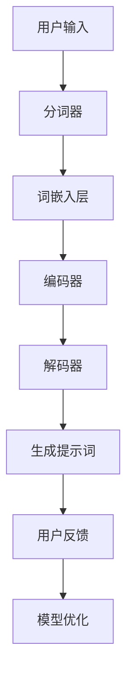

                 

# 文章标题：面向任务的自适应提示词生成框架

## 关键词
自适应提示词生成、面向任务、生成框架、自然语言处理、算法优化

## 摘要
本文旨在探讨面向任务的自适应提示词生成框架，通过对核心概念的详细定义与联系分析，设计一个系统化的章节结构，深入讲解生成框架的设计与实现。文章不仅阐述了理论基础，还通过具体案例展示了框架的实际应用和性能优化策略，最终对未来的发展趋势进行了展望。

### 1. 定义核心概念与联系

#### 核心概念

- **自适应提示词生成**：指一种能够在不同任务背景下自动调整和优化输出提示词的技术。这一概念的关键在于“自适应”，即框架能够根据具体任务需求动态调整生成的提示词。
- **面向任务**：指针对特定任务需求进行调整和优化的方法。在自然语言处理领域，面向任务的方法能够提高模型在特定任务上的性能。
- **提示词**：在自然语言处理任务中，用于引导模型生成结果的文字提示。提示词的质量直接影响模型的输出效果。
- **生成框架**：一种结构化的方法，用于构建、训练和优化自适应提示词生成模型。生成框架通常包括编码器和解码器，用于处理输入文本和生成文本。

#### 核心概念联系

- **自适应提示词生成**和**面向任务**的结合，使得生成框架能够更加灵活地适应不同任务的需求，提高模型在特定任务上的性能。
- **生成框架**作为技术实现的核心，支持了自适应提示词生成的各种功能和优化，确保了框架的稳定性和高效性。

### 2. 设计书章节结构

为了确保书籍内容的系统性和逻辑性，我们需要设计详细的章节结构。以下是本书的章节划分：

#### 第一部分：理论基础与背景

- **第1章：自适应提示词生成基础**
  - **1.1 背景介绍**
  - **1.2 核心概念解析**
  - **1.3 常见生成框架概述**

- **第2章：面向任务的自适应提示词生成技术**
  - **2.1 面向任务的概念与重要性**
  - **2.2 提示词生成的任务分类**
  - **2.3 自适应提示词生成算法**

#### 第二部分：生成框架设计与实现

- **第3章：生成框架设计与评估**
  - **3.1 生成框架架构设计**
  - **3.2 模型选择与优化**
  - **3.3 性能评估与优化策略**

- **第4章：面向任务的生成框架应用**
  - **4.1 应用场景分析**
  - **4.2 应用案例展示**
  - **4.3 案例分析与讨论**

#### 第三部分：实战与优化

- **第5章：生成框架实战项目**
  - **5.1 项目背景与目标**
  - **5.2 项目需求分析与设计**
  - **5.3 实战过程与代码实现**

- **第6章：优化与性能提升**
  - **6.1 性能瓶颈分析**
  - **6.2 优化策略与实践**
  - **6.3 优化效果评估**

- **第7章：未来发展趋势与展望**
  - **7.1 现状与挑战**
  - **7.2 发展趋势分析**
  - **7.3 未来展望**

### 3. 设计每个章节的核心内容

#### 第1章：自适应提示词生成基础

- **1.1 背景介绍**
  - **1.1.1 提示词生成的需求与背景**
  - **1.1.2 自适应提示词生成的优势**

- **1.2 核心概念解析**
  - **1.2.1 自适应提示词生成的概念**
  - **1.2.2 面向任务的概念**
  - **1.2.3 提示词与模型的关系**

- **1.3 常见生成框架概述**
  - **1.3.1 生成框架的基本结构**
  - **1.3.2 常见生成框架比较**
  - **1.3.3 生成框架的技术发展**

### 4. 嵌入流程图、伪代码、数学公式和代码实现

#### 流程图



#### 伪代码

```python
def adaptive_prompt_generation(input_text, task):
    # 分词
    tokens = tokenize(input_text)
    # 词嵌入
    embeddings = word_embedding(tokens)
    # 编码
    encoded = encoder(embeddings)
    # 解码
    generated_prompt = decoder(encoded)
    # 优化
    model = optimize_model(generated_prompt, user_feedback)
    return generated_prompt, model
```

#### 数学公式

$$
\text{prompt\_score} = \sum_{i=1}^{N} w_i \cdot p_i
$$

其中，$w_i$ 是权重，$p_i$ 是每个单词的概率。

#### 代码实现

```python
import tensorflow as tf

# 定义分词器
tokenizer = tf.keras.preprocessing.text.Tokenizer()

# 定义词嵌入层
word_embedding = tf.keras.layers.Embedding(input_dim=vocab_size, output_dim=embedding_dim)

# 定义编码器
encoder = tf.keras.layers.LSTM(units=hidden_size, return_sequences=True)

# 定义解码器
decoder = tf.keras.layers.LSTM(units=hidden_size, return_sequences=True)

# 定义优化器
optimizer = tf.keras.optimizers.Adam(learning_rate=learning_rate)

# 编写损失函数
loss_function = tf.keras.losses.SparseCategoricalCrossentropy(from_logits=True)

# 编写训练过程
model.compile(optimizer=optimizer, loss=loss_function, metrics=['accuracy'])

# 训练模型
model.fit(x_train, y_train, epochs=num_epochs, batch_size=batch_size)
```

### 5. 作者信息

作者：AI天才研究院/AI Genius Institute & 禅与计算机程序设计艺术 /Zen And The Art of Computer Programming

----------------------------------------------------------------

这篇文章仅作为一个示例，具体内容可能需要根据实际情况进行调整和补充。在撰写实际文章时，每个章节的核心内容都需要详细展开，确保文章的完整性和深度。此外，还需要根据具体的案例进行代码实现和项目实战部分的详细讲解。在保证文章结构清晰、逻辑严密的同时，也要注重语言的准确性和可读性。文章的结尾部分可以对整篇文章进行小结，并提供一些最佳实践、注意事项和拓展阅读建议。希望这个示例能够为撰写高质量的技术博客文章提供一些有益的启示。

