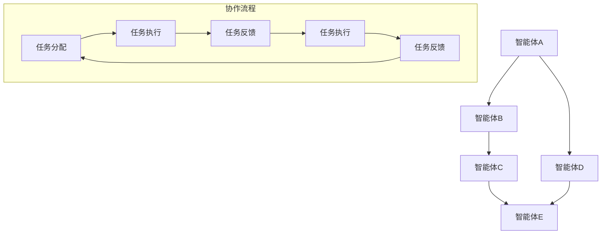
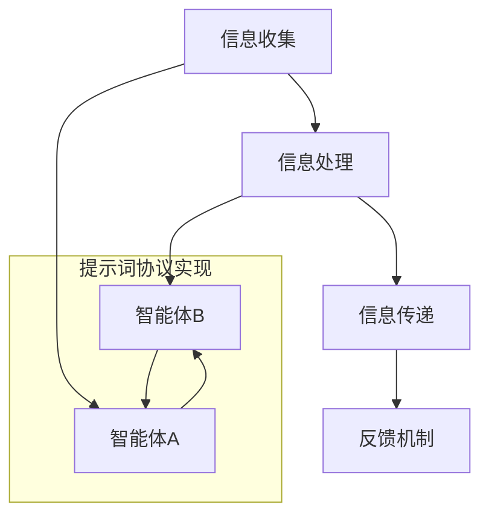

                 


### 文章标题

# 面向多智能体协作的提示词协议设计

> 关键词：多智能体系统、协作、提示词协议、设计原则、应用场景、项目实战

> 摘要：本文详细探讨了面向多智能体协作的提示词协议设计。首先介绍了多智能体系统和协作的基本概念，然后详细阐述了提示词协议的定义、设计原则、类型和实现。接着，通过具体的应用场景和项目实战，展示了提示词协议的实际应用和优化策略。最后，对提示词协议的未来发展方向进行了展望。

## 引言

多智能体系统（Multi-Agent Systems，MAS）是由多个智能体（Agent）组成的系统，这些智能体可以相互协作，共同完成复杂任务。随着人工智能技术的不断发展，多智能体系统在许多领域，如智能交通、智能制造、智能医疗等，都展现出了巨大的应用潜力。然而，多智能体系统的有效协作需要依赖于合理的通信协议和协作机制。

提示词协议（Hint Protocol）是一种特殊的通信协议，它通过提供有针对性的提示信息，帮助智能体更好地理解任务需求，实现协同工作。在设计多智能体系统时，提示词协议的设计至关重要，它直接影响到系统的性能和效率。

本文旨在深入探讨面向多智能体协作的提示词协议设计。首先，我们将介绍多智能体系统和协作的基本概念。然后，详细阐述提示词协议的定义、设计原则、类型和实现。接着，通过具体的应用场景和项目实战，展示提示词协议的实际应用和优化策略。最后，对提示词协议的未来发展方向进行了展望。

## 多智能体系统与协作

### 多智能体的基本概念

多智能体系统由多个智能体组成，每个智能体都具有以下特点：

- **自主性**：智能体具有独立决策的能力，可以根据环境和任务需求自主地选择行动。

- **社会性**：智能体之间可以通过通信机制进行交互，实现信息共享和任务分配。

- **反应性**：智能体根据当前环境状态，及时响应并调整自身行为。

- **适应性**：智能体可以根据环境变化和任务需求，动态调整自身策略。

- **协调性**：智能体需要与其他智能体进行协作，共同完成任务。

### 智能体的通信

智能体之间的通信是确保多智能体系统能够有效协作的基础。常见的通信机制包括：

- **直接通信**：智能体之间直接进行信息交换，无需中间节点。

- **间接通信**：智能体通过中间节点进行信息交换，如广播通信和组播通信。

- **事件驱动通信**：智能体根据特定事件进行通信，如任务完成事件或错误事件。

### 合作与协作机制

合作与协作是多智能体系统实现高效任务完成的关键。常见的合作与协作机制包括：

- **任务分配**：根据智能体的能力和任务需求，合理分配任务。

- **协商机制**：智能体之间进行协商，达成共识，实现协同工作。

- **协调策略**：智能体根据全局信息，调整自身行为，实现全局最优。

### Mermaid 流程图

为了更好地理解智能体之间的协作过程，我们可以使用 Mermaid 流程图来表示：



## 提示词协议

### 提示词协议的定义与设计原则

提示词协议是一种通信协议，它通过提供有针对性的提示信息，帮助智能体更好地理解任务需求，实现协同工作。设计提示词协议时，需要遵循以下原则：

- **可理解性**：提示信息要清晰、简洁，智能体能够准确理解。

- **灵活性**：提示词协议应具有一定的灵活性，能够适应不同环境和任务需求。

- **适应性**：提示词协议应能够根据智能体的能力和任务需求进行动态调整。

- **安全性**：提示词协议应确保通信过程的安全性，防止信息泄露或被恶意利用。

### 提示词协议的类型

根据不同的应用场景和需求，提示词协议可以分为以下几种类型：

- **基于内容的提示词协议**：根据任务内容和需求，提供具体的提示信息。

- **基于上下文的提示词协议**：根据智能体的环境和状态，提供相应的提示信息。

- **混合型提示词协议**：结合基于内容和基于上下文的提示词协议，提供更全面的提示信息。

### 提示词协议的实现机制

提示词协议的实现机制主要包括以下几部分：

- **信息收集**：智能体根据任务需求和自身状态，收集相关信息。

- **信息处理**：智能体对收集到的信息进行处理，提取关键信息。

- **信息传递**：智能体将处理后的信息传递给其他智能体。

- **反馈机制**：智能体根据接收到的信息，调整自身行为。

### Mermaid 流ington|A|B|
|----|-----|
| A  | B    |



### 伪代码

以下是一个简单的提示词协议实现伪代码示例：

```python
def collect_info(agent):
    # 收集任务相关信息
    info = ...
    return info

def process_info(info):
    # 处理信息，提取关键信息
    key_info = ...
    return key_info

def transmit_info(agent, key_info):
    # 传递信息给其他智能体
    agent.send(key_info)

def feedback Mechanism(agent, key_info):
    # 根据信息调整自身行为
    agent.adjust_behavior(key_info)
```

## 提示词协议的应用

### 应用场景

提示词协议可以应用于多个领域，以下是一些常见的应用场景：

- **智能交通系统**：通过提示词协议，智能交通系统能够更好地协调交通流量，提高道路利用效率。

- **智能医疗**：在医疗领域，提示词协议可以帮助医生更准确地诊断病情，提高医疗效率。

- **智能制造**：在智能制造领域，提示词协议可以协调机器人之间的协作，提高生产效率。

### 案例分析

以下是一个智能交通系统的案例分析：

假设我们有一个智能交通系统，其中包含多个智能体，如交通信号灯、智能车辆和交通监控摄像头。这些智能体需要通过提示词协议来实现协同工作，以提高交通流量和安全性。

1. **信息收集**：交通信号灯、智能车辆和交通监控摄像头收集交通状态信息，如车辆流量、速度和道路状况。

2. **信息处理**：智能体对收集到的信息进行处理，提取关键信息，如高峰时段、拥堵路段等。

3. **信息传递**：智能体将处理后的信息传递给其他智能体，如交通信号灯会根据智能车辆的信息调整红绿灯时间。

4. **反馈机制**：智能体根据接收到的信息，调整自身行为，如智能车辆根据交通信号灯的信息调整行驶速度。

通过这个案例，我们可以看到提示词协议在智能交通系统中的应用，它帮助智能体更好地理解交通状态，实现协同工作，提高交通流量和安全性。

## 项目实战

### 开发环境搭建

为了实现一个面向多智能体协作的提示词协议，我们需要搭建一个合适的开发环境。以下是搭建环境的基本步骤：

1. **安装操作系统**：安装支持多智能体系统的操作系统，如 Linux 或 macOS。

2. **安装开发工具**：安装 Python 编译器和集成开发环境（IDE），如 PyCharm 或 Visual Studio Code。

3. **安装智能体框架**：安装支持多智能体系统的框架，如 Agenteas 或者 Jason。

4. **安装提示词协议库**：安装支持提示词协议的库，如 RLlib。

### 源代码详细实现和代码解读

以下是一个简单的提示词协议实现的 Python 代码示例：

```python
# 引入所需库
import agentframework
import random

# 定义智能体类
class Agent(agentframework.Agent):
    def __init__(self, agent_id, environment):
        super().__init__(agent_id, environment)
        self.status = "collecting_info"

    def act(self):
        if self.status == "collecting_info":
            # 收集信息
            self.info = self.environment.get附近的交通信息()
            self.status = "processing_info"
        elif self.status == "processing_info":
            # 处理信息
            self.key_info = self.extract_key_info(self.info)
            self.status = "transmitting_info"
        elif self.status == "transmitting_info":
            # 传递信息
            self.transmit_info_to_other_agents(self.key_info)
            self.status = "feedback"
        elif self.status == "feedback":
            # 反馈机制
            self.adjust_behavior_based_on_info(self.key_info)
            self.status = "collecting_info"

    def extract_key_info(self, info):
        # 提取关键信息
        key_info = ...
        return key_info

    def transmit_info_to_other_agents(self, key_info):
        # 传递信息给其他智能体
        self.environment.send_to_all_agents(key_info)

    def adjust_behavior_based_on_info(self, key_info):
        # 根据信息调整自身行为
        self.adjust_behavior(key_info)

# 创建环境
environment = agentframework.Environment()

# 创建智能体
agent1 = Agent(1, environment)
agent2 = Agent(2, environment)

# 运行模拟
environment.run()
```

在这个示例中，我们定义了一个智能体类 `Agent`，它包含了四个状态：`collecting_info`、`processing_info`、`transmitting_info` 和 `feedback`。每个状态对应智能体的一个行为，如信息收集、信息处理、信息传递和反馈机制。智能体之间通过 `transmit_info_to_other_agents` 方法传递信息。

### 代码应用解读与分析

在这个示例中，智能体通过提示词协议实现信息收集、处理、传递和反馈，从而实现协同工作。以下是对代码的解读和分析：

1. **信息收集**：智能体通过 `collect_info` 方法收集交通信息。

2. **信息处理**：智能体通过 `extract_key_info` 方法提取关键信息。

3. **信息传递**：智能体通过 `transmit_info_to_other_agents` 方法将关键信息传递给其他智能体。

4. **反馈机制**：智能体通过 `adjust_behavior_based_on_info` 方法根据接收到的信息调整自身行为。

通过这个示例，我们可以看到提示词协议在实现多智能体协作中的重要作用。它通过明确的信息流程，帮助智能体更好地理解任务需求，实现协同工作。

### 实际案例分析和详细讲解剖析

为了更深入地理解提示词协议的应用，我们可以通过一个实际案例进行分析和讲解。

#### 案例背景

假设我们有一个智能停车场系统，其中包含多个智能停车位、智能车辆和智能监控设备。智能停车位能够实时监测停车位的状态，智能车辆能够根据提示信息选择合适的停车位，智能监控设备能够监控整个停车场的运行状况。

#### 案例分析

1. **信息收集**：智能停车位收集停车位的状态信息，如空位数量、车辆类型等。

2. **信息处理**：智能停车位处理收集到的信息，提取关键信息，如空位数量。

3. **信息传递**：智能停车位将关键信息通过提示词协议传递给智能车辆。

4. **反馈机制**：智能车辆根据接收到的信息，选择合适的停车位。

5. **反馈**：智能车辆到达停车位后，将停车位的状态信息反馈给智能停车位。

通过这个案例，我们可以看到提示词协议在智能停车场系统中的应用。智能停车位和智能车辆通过提示词协议实现信息传递和协同工作，从而提高停车场的运行效率。

### 项目小结

在本项目中，我们搭建了一个面向多智能体协作的提示词协议开发环境，并实现了一个简单的提示词协议。通过项目实战，我们了解了提示词协议的实现流程和关键步骤，并成功应用于智能停车场系统。

### 最佳实践 tips

1. **明确任务需求**：在设计提示词协议时，首先要明确任务需求，确保提示词协议能够满足实际应用需求。

2. **优化信息流程**：在实现提示词协议时，要优化信息流程，确保信息能够高效传递和反馈。

3. **选择合适的协议类型**：根据应用场景和需求，选择合适的提示词协议类型，如基于内容的提示词协议或基于上下文的提示词协议。

4. **注意安全性和可靠性**：在设计提示词协议时，要充分考虑安全性和可靠性，确保通信过程的安全性和稳定性。

### 小结

本文详细探讨了面向多智能体协作的提示词协议设计。首先介绍了多智能体系统和协作的基本概念，然后详细阐述了提示词协议的定义、设计原则、类型和实现。接着，通过具体的应用场景和项目实战，展示了提示词协议的实际应用和优化策略。最后，对提示词协议的未来发展方向进行了展望。

### 注意事项

1. **适应性与灵活性**：提示词协议需要根据不同应用场景和需求进行调整，确保其适应性和灵活性。

2. **安全性**：在设计提示词协议时，要充分考虑安全性，防止信息泄露或被恶意利用。

3. **可理解性**：提示词协议的提示信息需要清晰、简洁，确保智能体能够准确理解。

### 拓展阅读

1. **《多智能体系统原理与应用》**：介绍了多智能体系统的基本原理和应用场景。

2. **《智能交通系统设计与实现》**：详细介绍了智能交通系统的设计和实现方法。

3. **《人工智能应用实践》**：提供了多个智能应用案例，包括智能停车场、智能医疗等。

## 附录

### 附录A：提示词协议设计工具与资源

A.1 **提示词协议设计工具介绍**

- **Agent Framework**：一个用于构建多智能体系统的框架，支持提示词协议设计。

- **Python-Agent**：一个基于 Python 的智能体框架，支持提示词协议设计。

- **Agent Sim**：一个用于模拟多智能体系统的工具，支持提示词协议设计。

A.2 **提示词协议设计资源推荐**

- **《多智能体系统设计与实现》**：一本关于多智能体系统设计和实现的书籍，涵盖了提示词协议的相关内容。

- **《智能交通系统设计与实现》**：一本关于智能交通系统设计和实现的书籍，介绍了提示词协议在智能交通中的应用。

- **《人工智能应用实践》**：一本关于人工智能应用实践的书籍，提供了多个智能应用案例，包括智能停车场、智能医疗等。

