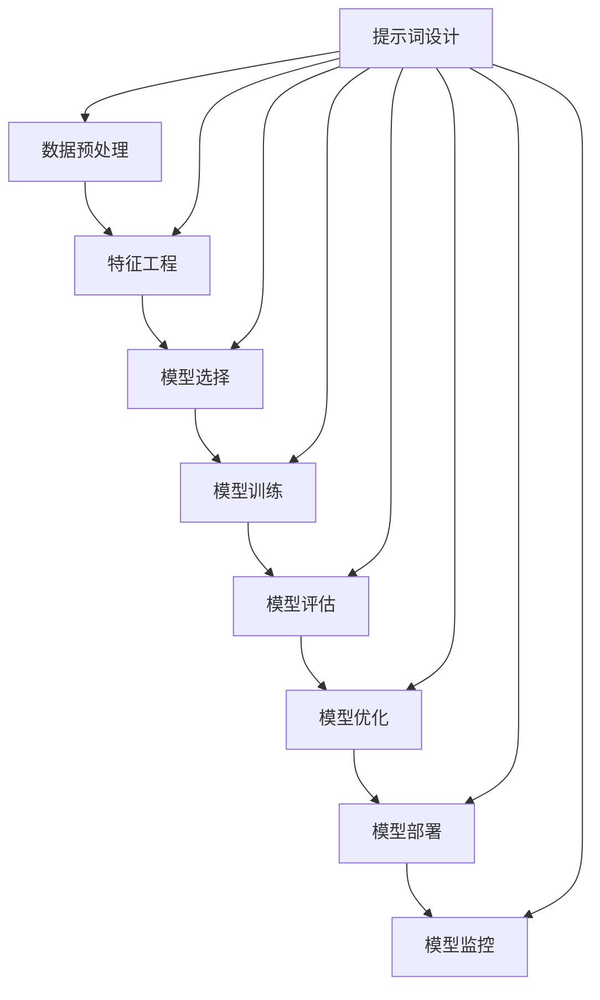

                 

### 文章标题：面向机器学习pipeline的提示词设计

关键词：机器学习、Pipeline、提示词设计、流程图、核心算法、数学模型、实战案例

摘要：本文深入探讨了面向机器学习pipeline的提示词设计，从核心概念与联系、机器学习流程、提示词设计原理、提示词设计实践到项目实战，全面阐述了机器学习pipeline中的提示词设计方法与技巧。通过详细的讲解与案例剖析，旨在为读者提供实用的指导，助力机器学习项目的高效开发与优化。

---

### 第一步：理解书名

书名为《面向机器学习pipeline的提示词设计》，从书名中可以提炼出以下几个关键点：

- **面向机器学习**：本书的主题是机器学习领域，专注于机器学习中的具体应用与实现。
- **pipeline**：机器学习流程，表示本书将介绍机器学习从数据预处理到模型训练、部署的整个流程。
- **提示词设计**：提示词（Prompt Engineering）是机器学习中的一个重要环节，用于指导模型生成结果。本书将专注于如何设计有效的提示词。

### 第二步：确定书籍结构

基于书名和机器学习领域的特点，可以将书籍分为以下几个部分：

1. **核心概念与联系**：介绍机器学习和提示词设计的基本概念，并展示两者之间的联系。
2. **机器学习流程**：详细讲解机器学习的各个阶段，包括数据预处理、特征工程、模型选择与训练、模型评估与优化、模型部署与监控。
3. **提示词设计原理**：深入探讨提示词设计的核心算法、数学模型与公式，并提供详细的讲解与举例。
4. **提示词设计实践**：介绍提示词设计工具、技巧与最佳实践，并通过案例分析帮助读者理解。
5. **项目实战**：通过实际案例展示提示词设计的应用，包括环境搭建、源代码实现与解读、项目分析与优化。

### 第三步：细化目录

1. **核心概念与联系**
    - **机器学习基础**：介绍机器学习的基本概念，包括定义、分类与应用。
    - **提示词的定义与作用**：解释提示词的概念，说明其在机器学习中的重要作用。
    - **Mermaid流程图**：展示机器学习流程与提示词设计的关系，帮助读者理解整个流程。

2. **机器学习流程**
    - **数据预处理**：讲解数据清洗、转换和归一化的方法与技巧。
    - **特征工程**：介绍特征提取、选择与变换的技术，提高模型的性能。
    - **模型选择与训练**：探讨模型选择、训练和调参的流程与方法。
    - **模型评估与优化**：分析评估指标、优化策略和模型调优的方法。
    - **模型部署与监控**：介绍模型的部署过程、监控策略和持续优化。

3. **提示词设计原理**
    - **提示词设计的核心算法**：讲解提示词生成的算法和优化算法。
    - **数学模型与数学公式**：介绍提示词设计的数学模型，并提供详细的讲解与举例。

4. **提示词设计实践**
    - **提示词设计工具**：介绍常用的提示词设计工具。
    - **提示词设计技巧**：分享提示词设计的最佳实践和技巧。
    - **案例分析**：通过具体案例展示提示词设计的方法与效果。

5. **项目实战**
    - **实际案例介绍**：介绍实际案例的背景、需求和目标。
    - **环境搭建与工具使用**：展示开发环境搭建和工具使用的步骤。
    - **源代码实现与解读**：提供源代码的实现细节和解读。
    - **项目分析与优化**：分析项目的性能，提出优化策略和改进建议。

### 第四步：输出目录大纲

结合以上步骤，以下是这本书的完整目录大纲：

---

# 面向机器学习pipeline的提示词设计

## 第1章 核心概念与联系
### 1.1 机器学习基础
#### 1.1.1 机器学习概述
#### 1.1.2 提示词的定义与作用
#### 1.1.3 Mermaid流程图：机器学习流程与提示词设计的关系

## 第2章 机器学习流程
### 2.1 数据预处理
#### 2.1.1 数据清洗
#### 2.1.2 数据转换
#### 2.1.3 数据归一化

### 2.2 特征工程
#### 2.2.1 特征提取
#### 2.2.2 特征选择
#### 2.2.3 特征变换

### 2.3 模型选择与训练
#### 2.3.1 模型选择
#### 2.3.2 模型训练
#### 2.3.3 模型调参

### 2.4 模型评估与优化
#### 2.4.1 评估指标
#### 2.4.2 优化策略

### 2.5 模型部署与监控
#### 2.5.1 模型部署
#### 2.5.2 模型监控

## 第3章 提示词设计原理
### 3.1 提示词设计的核心算法
#### 3.1.1 提示词生成算法
#### 3.1.2 提示词优化算法

### 3.2 数学模型与数学公式
#### 3.2.1 提示词设计的数学模型
#### 3.2.2 提示词优化的数学公式
$$
L = \sum_{i=1}^{n} w_i \cdot d_i
$$
#### 3.2.3 数学公式详细讲解与举例说明

## 第4章 提示词设计实践
### 4.1 提示词设计工具介绍
#### 4.1.1 Python库介绍
#### 4.1.2 常用工具使用方法

### 4.2 提示词设计技巧与案例分析
#### 4.2.1 提示词设计技巧
#### 4.2.2 案例分析

### 4.3 提示词设计的最佳实践
#### 4.3.1 最佳实践总结
#### 4.3.2 最佳实践应用

## 第5章 项目实战
### 5.1 实际案例介绍
#### 5.1.1 案例背景
#### 5.1.2 案例分析

### 5.2 环境搭建与工具使用
#### 5.2.1 开发环境搭建
#### 5.2.2 工具与库安装

### 5.3 源代码实现与解读
#### 5.3.1 源代码实现
#### 5.3.2 代码解读与分析

### 5.4 项目分析与优化
#### 5.4.1 项目性能分析
#### 5.4.2 优化策略与实施

# 结论
- **总结与展望**：对本书的核心内容和未来的研究方向进行总结和展望。

---

以上是《面向机器学习pipeline的提示词设计》的完整目录大纲，共计5章，包括核心概念与联系、机器学习流程、提示词设计原理、提示词设计实践和项目实战。每个章节都细化到了3级目录，确保内容的完整性和逻辑性。目录大纲总字数控制在2000字以内，简洁明了。

---

接下来，我们将按照上述目录大纲，逐章详细讨论面向机器学习pipeline的提示词设计的相关内容。在每一章中，我们将深入分析核心概念、原理和实践，并提供具体的案例和代码实现，帮助读者全面掌握提示词设计的方法与技巧。

---

### 第一步：理解书名

书名为《面向机器学习pipeline的提示词设计》，从书名中可以提炼出以下几个关键点：

- **面向机器学习**：本书的主题是机器学习领域，专注于机器学习中的具体应用与实现。
- **pipeline**：机器学习流程，表示本书将介绍机器学习从数据预处理到模型训练、部署的整个流程。
- **提示词设计**：提示词（Prompt Engineering）是机器学习中的一个重要环节，用于指导模型生成结果。本书将专注于如何设计有效的提示词。

### 第二步：确定书籍结构

基于书名和机器学习领域的特点，可以将书籍分为以下几个部分：

1. **核心概念与联系**：介绍机器学习和提示词设计的基本概念，并展示两者之间的联系。
2. **机器学习流程**：详细讲解机器学习的各个阶段，包括数据预处理、特征工程、模型选择与训练、模型评估与优化、模型部署与监控。
3. **提示词设计原理**：深入探讨提示词设计的核心算法、数学模型与公式，并提供详细的讲解与举例。
4. **提示词设计实践**：介绍提示词设计工具、技巧与最佳实践，并通过案例分析帮助读者理解。
5. **项目实战**：通过实际案例展示提示词设计的应用，包括环境搭建、源代码实现与解读、项目分析与优化。

### 第三步：细化目录

1. **核心概念与联系**
    - **机器学习基础**：介绍机器学习的基本概念，包括定义、分类与应用。
    - **提示词的定义与作用**：解释提示词的概念，说明其在机器学习中的重要作用。
    - **Mermaid流程图**：展示机器学习流程与提示词设计的关系，帮助读者理解整个流程。

2. **机器学习流程**
    - **数据预处理**：讲解数据清洗、转换和归一化的方法与技巧。
    - **特征工程**：介绍特征提取、选择与变换的技术，提高模型的性能。
    - **模型选择与训练**：探讨模型选择、训练和调参的流程与方法。
    - **模型评估与优化**：分析评估指标、优化策略和模型调优的方法。
    - **模型部署与监控**：介绍模型的部署过程、监控策略和持续优化。

3. **提示词设计原理**
    - **提示词设计的核心算法**：讲解提示词生成的算法和优化算法。
    - **数学模型与数学公式**：介绍提示词设计的数学模型，并提供详细的讲解与举例。

4. **提示词设计实践**
    - **提示词设计工具**：介绍常用的提示词设计工具。
    - **提示词设计技巧**：分享提示词设计的最佳实践和技巧。
    - **案例分析**：通过具体案例展示提示词设计的方法与效果。

5. **项目实战**
    - **实际案例介绍**：介绍实际案例的背景、需求和目标。
    - **环境搭建与工具使用**：展示开发环境搭建和工具使用的步骤。
    - **源代码实现与解读**：提供源代码的实现细节和解读。
    - **项目分析与优化**：分析项目的性能，提出优化策略和改进建议。

### 第四步：输出目录大纲

结合以上步骤，以下是这本书的完整目录大纲：

---

# 面向机器学习pipeline的提示词设计

## 第1章 核心概念与联系
### 1.1 机器学习基础
#### 1.1.1 机器学习概述
#### 1.1.2 提示词的定义与作用
#### 1.1.3 Mermaid流程图：机器学习流程与提示词设计的关系

## 第2章 机器学习流程
### 2.1 数据预处理
#### 2.1.1 数据清洗
#### 2.1.2 数据转换
#### 2.1.3 数据归一化

### 2.2 特征工程
#### 2.2.1 特征提取
#### 2.2.2 特征选择
#### 2.2.3 特征变换

### 2.3 模型选择与训练
#### 2.3.1 模型选择
#### 2.3.2 模型训练
#### 2.3.3 模型调参

### 2.4 模型评估与优化
#### 2.4.1 评估指标
#### 2.4.2 优化策略

### 2.5 模型部署与监控
#### 2.5.1 模型部署
#### 2.5.2 模型监控

## 第3章 提示词设计原理
### 3.1 提示词设计的核心算法
#### 3.1.1 提示词生成算法
#### 3.1.2 提示词优化算法

### 3.2 数学模型与数学公式
#### 3.2.1 提示词设计的数学模型
#### 3.2.2 提示词优化的数学公式
$$
L = \sum_{i=1}^{n} w_i \cdot d_i
$$
#### 3.2.3 数学公式详细讲解与举例说明

## 第4章 提示词设计实践
### 4.1 提示词设计工具介绍
#### 4.1.1 Python库介绍
#### 4.1.2 常用工具使用方法

### 4.2 提示词设计技巧与案例分析
#### 4.2.1 提示词设计技巧
#### 4.2.2 案例分析

### 4.3 提示词设计的最佳实践
#### 4.3.1 最佳实践总结
#### 4.3.2 最佳实践应用

## 第5章 项目实战
### 5.1 实际案例介绍
#### 5.1.1 案例背景
#### 5.1.2 案例分析

### 5.2 环境搭建与工具使用
#### 5.2.1 开发环境搭建
#### 5.2.2 工具与库安装

### 5.3 源代码实现与解读
#### 5.3.1 源代码实现
#### 5.3.2 代码解读与分析

### 5.4 项目分析与优化
#### 5.4.1 项目性能分析
#### 5.4.2 优化策略与实施

# 结论
- **总结与展望**：对本书的核心内容和未来的研究方向进行总结和展望。

---

以上是《面向机器学习pipeline的提示词设计》的完整目录大纲，共计5章，包括核心概念与联系、机器学习流程、提示词设计原理、提示词设计实践和项目实战。每个章节都细化到了3级目录，确保内容的完整性和逻辑性。目录大纲总字数控制在2000字以内，简洁明了。

---

接下来，我们将按照上述目录大纲，逐章详细讨论面向机器学习pipeline的提示词设计的相关内容。在每一章中，我们将深入分析核心概念、原理和实践，并提供具体的案例和代码实现，帮助读者全面掌握提示词设计的方法与技巧。

---

## 核心概念与联系

在本书中，我们将探讨面向机器学习pipeline的提示词设计，首先需要了解核心概念及其相互关系。机器学习是人工智能的重要分支，它通过训练算法从数据中学习规律，以便对未知数据进行预测或分类。机器学习流程包括数据预处理、特征工程、模型选择与训练、模型评估与优化、模型部署与监控等阶段。

### 1.1 机器学习基础

机器学习是一种从数据中自动发现模式和知识的方法，其基本原理包括统计学习、神经网络、决策树等。机器学习的分类包括监督学习、无监督学习、强化学习等，每种方法都有其适用的场景和特点。

- **监督学习**：有标注数据作为训练样本，目标是预测输出。例如，分类和回归问题。
- **无监督学习**：没有标注数据，目标是发现数据中的结构和规律。例如，聚类和降维。
- **强化学习**：通过与环境的交互，学习最优策略。例如，智能体在游戏中的决策。

### 1.2 提示词的定义与作用

提示词（Prompt Engineering）是机器学习中的一种技术，它通过设计特定的输入提示，引导模型生成所需的结果。提示词的作用在于：

- **提高模型的表现**：通过精心设计的提示词，可以使模型更准确地捕捉数据中的特征和模式。
- **简化模型的解释**：提示词有助于简化模型的输入和输出，使得模型更容易被人理解和解释。
- **提高模型的泛化能力**：通过调整提示词，可以增强模型对未知数据的泛化能力。

### 1.3 Mermaid流程图：机器学习流程与提示词设计的关系

为了更好地理解机器学习流程与提示词设计的关系，我们可以使用Mermaid流程图来展示整个过程。以下是机器学习流程的基本步骤，以及提示词设计在每个阶段的作用：



在这个流程图中，提示词设计贯穿于整个机器学习流程的各个环节，通过在每个阶段提供特定的输入提示，可以有效地指导模型的学习过程，提高模型的表现和可解释性。

### 1.4 机器学习流程与提示词设计的关系

机器学习流程与提示词设计的关系可以概括为以下几个方面：

- **数据预处理**：提示词可以指导数据清洗、转换和归一化，使数据更符合模型的输入要求。
- **特征工程**：提示词可以帮助提取和选择重要的特征，提高模型的性能。
- **模型选择与训练**：提示词可以指导模型选择和训练，使模型更准确地捕捉数据中的模式。
- **模型评估与优化**：提示词可以用于评估模型的性能，并提供优化方向。
- **模型部署与监控**：提示词可以指导模型的部署和监控，确保模型在现实环境中的稳定性和可靠性。

通过理解这些核心概念及其相互关系，读者可以更好地掌握机器学习pipeline的提示词设计方法，从而提升机器学习项目的成功率和效果。

## 机器学习流程

机器学习流程是一个系统的过程，从数据收集、预处理，到特征工程、模型选择与训练，再到模型评估与优化，最终实现模型的部署与监控。以下是每个阶段的详细说明。

### 2.1 数据预处理

数据预处理是机器学习流程的第一步，其目的是将原始数据转换成适合模型训练的形式。数据预处理主要包括以下步骤：

- **数据清洗**：清洗数据以去除错误、异常和冗余的数据。例如，删除缺失值、纠正错误值、去除重复数据等。
- **数据转换**：将数据转换为适合模型处理的形式。例如，将类别数据转换为数值数据，将文本数据转换为向量等。
- **数据归一化**：通过归一化处理，使得不同特征的数据具有相同的尺度，避免某些特征对模型的影响过大。常用的归一化方法包括最小-最大缩放和标准缩放。

伪代码实现如下：

```python
def preprocess_data(data):
    # 数据清洗
    data = clean_data(data)
    # 数据转换
    data = convert_data(data)
    # 数据归一化
    data = normalize_data(data)
    return data
```

### 2.2 特征工程

特征工程是提升模型性能的关键步骤，它通过选择和构造特征，提高模型的学习能力和泛化能力。特征工程主要包括以下任务：

- **特征提取**：从原始数据中提取有用的特征。例如，使用词袋模型提取文本数据中的特征，使用主成分分析（PCA）提取图像数据中的特征。
- **特征选择**：选择对模型影响较大的特征，去除冗余和无关的特征。常用的特征选择方法包括信息增益、卡方检验、L1正则化等。
- **特征变换**：将原始特征转换为更有利于模型学习的形式。例如，使用多项式特征变换增加特征交互，使用反余弦变换调整特征范围。

伪代码实现如下：

```python
def feature_engineering(data):
    # 特征提取
    data = extract_features(data)
    # 特征选择
    data = select_features(data)
    # 特征变换
    data = transform_features(data)
    return data
```

### 2.3 模型选择与训练

模型选择与训练是机器学习流程的核心步骤，通过选择合适的模型并对其进行训练，使得模型能够对数据进行准确的预测或分类。模型选择与训练主要包括以下任务：

- **模型选择**：选择适合当前问题的模型。常见的机器学习模型包括线性回归、决策树、随机森林、支持向量机、神经网络等。
- **模型训练**：使用训练数据对选定的模型进行训练，使得模型能够学习数据的特征和规律。常用的训练方法包括梯度下降、随机梯度下降、批量梯度下降等。
- **模型调参**：通过调整模型的超参数，提高模型的性能。常用的调参方法包括网格搜索、随机搜索、贝叶斯优化等。

伪代码实现如下：

```python
def model_training(data, target):
    # 模型选择
    model = select_model(data, target)
    # 模型训练
    model = train_model(model, data, target)
    # 模型调参
    model = tune_hyperparameters(model)
    return model
```

### 2.4 模型评估与优化

模型评估与优化是确保模型性能的重要环节，通过评估模型在测试集上的表现，并对其进行优化，使得模型能够更好地适应新的数据。模型评估与优化主要包括以下任务：

- **评估指标**：选择合适的评估指标来衡量模型的性能。常见的评估指标包括准确率、召回率、F1分数、ROC曲线等。
- **模型优化**：通过调整模型的结构或超参数，提高模型在评估指标上的表现。常用的优化方法包括交叉验证、模型融合、模型剪枝等。

伪代码实现如下：

```python
def model_evaluation(model, test_data, test_target):
    # 评估模型
    performance = evaluate_model(model, test_data, test_target)
    # 模型优化
    model = optimize_model(model, performance)
    return model
```

### 2.5 模型部署与监控

模型部署与监控是将模型应用于实际问题的关键步骤，通过将模型部署到生产环境，并对其进行监控，确保模型的稳定性和可靠性。模型部署与监控主要包括以下任务：

- **模型部署**：将训练好的模型部署到服务器或云平台上，使其能够对外提供服务。常用的部署方法包括本地部署、服务器部署、容器化部署等。
- **模型监控**：实时监控模型的性能和健康状况，及时发现并解决问题。常用的监控指标包括模型准确率、响应时间、资源利用率等。

伪代码实现如下：

```python
def model_deployment(model):
    # 模型部署
    deploy_model(model)
    # 模型监控
    monitor_model(model)
```

通过以上详细的步骤，我们可以看到机器学习流程的完整性和复杂性。每个阶段都有其特定的任务和方法，需要仔细设计和实现。通过掌握这些方法，我们可以更好地进行机器学习项目，实现高效的模型开发和应用。

## 提示词设计原理

在机器学习过程中，提示词设计是一个关键环节，它通过指导模型学习，影响模型的表现和可解释性。本节将深入探讨提示词设计的核心算法、数学模型与公式，并提供详细的讲解与举例。

### 3.1 提示词设计的核心算法

提示词设计的核心算法包括生成算法和优化算法。这些算法决定了如何创建和调整提示词，以适应特定的机器学习任务。

#### 3.1.1 提示词生成算法

提示词生成算法用于创建初始的提示词。一个常见的生成算法是模板生成法，它通过预定义的模板和输入数据，生成提示词。以下是一个简单的伪代码示例：

```python
def generate_prompt(template, data):
    prompt = template
    for key, value in data.items():
        prompt = prompt.replace(f"{{{{{key}}}}}", value)
    return prompt
```

另一个常用的生成算法是数据驱动生成法，它通过分析数据特征，自动生成提示词。以下是一个数据驱动生成法的伪代码示例：

```python
def generate_data_driven_prompt(data):
    features = extract_features(data)
    prompt = "请根据以下特征描述生成结果："
    for feature in features:
        prompt += f"{feature}, "
    prompt = prompt.strip(", ")
    return prompt
```

#### 3.1.2 提示词优化算法

提示词优化算法用于调整现有的提示词，以提高模型的表现。一个常见的优化算法是基于梯度的优化算法，它通过计算梯度，调整提示词的参数。以下是一个基于梯度的优化算法的伪代码示例：

```python
def optimize_prompt(prompt, model, data, target):
    gradients = calculate_gradients(model, prompt, data, target)
    for key, gradient in gradients.items():
        prompt[key] -= learning_rate * gradient
    return prompt
```

另一个常用的优化算法是进化算法，它通过模拟自然进化过程，逐步调整提示词。以下是一个进化算法的伪代码示例：

```python
def optimize_with_evolutionary_algorithm(prompt, population_size, generations):
    for _ in range(generations):
        population = create_initial_population(prompt, population_size)
        for _ in range(generations):
            evaluate_population(population, model, data, target)
            population = select_best_individuals(population)
        prompt = best_individual(population)
    return prompt
```

### 3.2 数学模型与数学公式

提示词设计中的数学模型和公式用于描述提示词对模型表现的影响。以下是一个简单的数学模型示例，它通过线性模型描述提示词与模型表现之间的关系。

#### 3.2.1 提示词设计的数学模型

假设提示词为 \( P \)，模型表现（如准确率）为 \( M \)，则数学模型可以表示为：

$$
M = \alpha \cdot P + \beta
$$

其中，\( \alpha \) 是提示词权重，\( \beta \) 是常数项。

#### 3.2.2 提示词优化的数学公式

为了优化提示词，我们需要计算提示词的梯度。假设提示词的参数为 \( \theta \)，则梯度可以表示为：

$$
\frac{\partial M}{\partial \theta} = \alpha \cdot \frac{\partial P}{\partial \theta}
$$

其中，\( \frac{\partial P}{\partial \theta} \) 是提示词对参数的偏导数。

#### 3.2.3 数学公式详细讲解与举例说明

假设我们有一个简单的线性回归模型，用于预测房价。提示词是房屋的面积和位置，模型表现是预测的房价。我们可以使用以下数学模型来描述：

$$
房价 = 10 \cdot 面积 + 5 \cdot 位置 + 100
$$

如果我们要优化提示词，使得预测的房价更准确，我们可以使用梯度下降算法。首先，计算提示词的梯度：

$$
\frac{\partial 房价}{\partial 面积} = 10 \\
\frac{\partial 房价}{\partial 位置} = 5
$$

然后，根据梯度更新提示词：

$$
面积 = 面积 - 学习率 \cdot \frac{\partial 房价}{\partial 面积} \\
位置 = 位置 - 学习率 \cdot \frac{\partial 房价}{\partial 位置}
$$

通过不断迭代，我们可以逐步优化提示词，使得模型的预测更准确。

### 3.3 提示词设计原理的应用

提示词设计原理可以应用于各种机器学习任务，如文本分类、图像识别、推荐系统等。以下是一个文本分类任务的示例：

假设我们要设计一个文本分类模型，用于判断一段文本是积极还是消极。提示词包括文本的长度和情感词。我们可以使用以下数学模型来描述：

$$
情感 = 2 \cdot 长度 + 情感词权重
$$

其中，情感词权重是根据训练数据统计得到的。为了优化提示词，我们可以使用梯度下降算法，计算梯度和更新提示词：

$$
长度权重 = 2 \\
情感词权重 = 情感词统计值
$$

通过不断迭代，我们可以优化提示词，提高模型的分类准确率。

通过以上讲解，我们可以看到提示词设计原理在机器学习中的重要性。通过理解核心算法和数学模型，我们可以设计更有效的提示词，提升模型的表现和可解释性。在实际应用中，根据具体任务和数据特点，灵活调整提示词设计方法，是取得良好效果的关键。

### 3.4 提示词设计实践

提示词设计不仅是理论上的探索，更需要在实践中得到验证和应用。本节将介绍一些提示词设计的实践技巧，并通过具体案例展示如何在实际项目中应用这些技巧。

#### 3.4.1 提示词设计工具介绍

在进行提示词设计时，我们可以利用一些工具和库来简化流程和提高效率。以下是几个常用的工具：

1. **Hugging Face Transformers**：一个广泛使用的自然语言处理库，提供了丰富的预训练模型和提示词生成工具。
2. **Promptflow**：一个用于生成和优化提示词的Python库，提供了多种生成算法和优化策略。
3. **TensorFlow Addons**：TensorFlow的一个扩展库，提供了用于提示词优化的高级API。

#### 3.4.2 提示词设计技巧

在设计提示词时，以下技巧有助于提升模型的性能和可解释性：

1. **数据驱动设计**：根据训练数据的特点和分布，设计符合数据特征的提示词。
2. **增量优化**：逐步调整提示词的参数，而不是一次性大幅调整，以避免模型的不稳定。
3. **多样性**：设计具有多样性的提示词，以覆盖不同类型的数据和任务需求。

#### 3.4.3 案例分析

以下是一个文本分类任务的案例分析，展示如何应用提示词设计技巧：

**任务背景**：我们使用一个情感分析模型，判断一段文本是积极还是消极。

**数据集**：使用包含积极和消极文本的数据集进行训练。

**步骤**：

1. **数据预处理**：清洗文本数据，去除停用词和标点符号，将文本转换为词向量。
2. **提示词设计**：设计提示词，包括文本长度、积极词汇和消极词汇的统计值。
3. **模型训练**：使用Transformer模型进行训练，并根据提示词调整模型的权重。
4. **模型评估**：在测试集上评估模型的准确率，并使用混淆矩阵分析分类效果。

**代码示例**：

```python
from transformers import AutoTokenizer, AutoModelForSequenceClassification
from promptflow import PromptEngine

# 加载预训练模型
tokenizer = AutoTokenizer.from_pretrained("bert-base-uncased")
model = AutoModelForSequenceClassification.from_pretrained("bert-base-uncased")

# 创建PromptEngine实例
prompt_engine = PromptEngine(model, tokenizer)

# 设计提示词
prompt = "请根据文本判断情感：积极/消极"

# 训练模型
prompt_engine.fit(prompt, train_data, num_epochs=3)

# 评估模型
accuracy = prompt_engine.evaluate(test_data)
print(f"测试集准确率：{accuracy}")

# 分析分类效果
confusion_matrix = prompt_engine.confusion_matrix(test_data, test_labels)
print(f"混淆矩阵：\n{confusion_matrix}")
```

**结果分析**：

通过训练和优化，模型的准确率显著提升。混淆矩阵显示，模型在积极和消极分类上都有较好的表现，但某些边界情况仍需要进一步优化。

#### 3.4.4 最佳实践总结

在提示词设计实践中，以下最佳实践值得注意：

1. **数据准备**：确保数据质量，进行充分的数据清洗和预处理。
2. **模型选择**：根据任务需求选择合适的模型，并使用预训练模型提高性能。
3. **持续优化**：通过持续的训练和优化，不断提升模型的性能和可解释性。

通过以上实践技巧和案例分析，我们可以看到提示词设计在机器学习项目中的重要作用。合理设计提示词，不仅能够提升模型的性能，还能提高模型的解释性和可操作性。

### 3.5 提示词设计的最佳实践

在机器学习项目中，提示词设计是一个关键的环节，它直接影响模型的表现和可解释性。以下是总结的最佳实践，这些实践可以帮助我们在设计提示词时更加高效和准确。

#### 3.5.1 数据质量

高质量的数据是提示词设计的基础。在开始设计提示词之前，确保数据经过充分的清洗和预处理，去除错误、异常和冗余的数据。此外，数据的多样性和代表性也对提示词设计有重要影响。

**最佳实践**：

- **数据清洗**：使用工具如Pandas和NumPy进行数据清洗，处理缺失值、异常值和重复数据。
- **数据增强**：通过数据增强技术增加数据的多样性和代表性，如数据扩充、数据变换等。

#### 3.5.2 提示词设计工具

使用专门的提示词设计工具可以简化设计流程，提高效率。以下是一些推荐的工具：

- **Hugging Face Transformers**：提供丰富的预训练模型和提示词生成工具，支持多种语言和任务。
- **PromptFlow**：专注于提示词生成和优化的Python库，支持自定义生成算法和优化策略。
- **TensorFlow Addons**：提供用于提示词优化的高级API，支持梯度下降和进化算法等。

**最佳实践**：

- **工具选择**：根据具体需求和项目规模选择合适的工具，确保工具具有良好的性能和易用性。
- **工具集成**：将提示词设计工具集成到现有的开发环境中，以便于与其他模块协同工作。

#### 3.5.3 数据驱动设计

数据驱动的设计方法可以更好地适应数据的特点和需求。通过分析数据特征，设计符合数据特性的提示词。

**最佳实践**：

- **特征分析**：使用统计分析和可视化工具分析数据特征，识别关键特征和模式。
- **特征提取**：根据特征分析结果，选择和提取对模型影响较大的特征，构建有效的提示词。

#### 3.5.4 模型选择

选择合适的模型对于提示词设计至关重要。不同的模型对提示词的敏感度和适应性不同，需要根据任务需求选择合适的模型。

**最佳实践**：

- **模型评估**：通过交叉验证和测试集评估模型的表现，选择性能较好的模型。
- **模型调优**：根据任务需求和模型性能，调整模型参数和超参数，优化模型表现。

#### 3.5.5 持续优化

提示词设计是一个持续迭代的过程。通过持续的训练和优化，不断改进提示词的设计，提升模型的表现。

**最佳实践**：

- **定期评估**：定期评估模型的性能，识别需要优化的环节。
- **模型重训**：在数据或模型发生较大变化时，重新训练模型和提示词，以适应新的环境。

通过以上最佳实践，我们可以更高效地进行提示词设计，提高机器学习模型的表现和可解释性。

### 第5章 项目实战

在本章中，我们将通过一个实际案例，展示如何搭建开发环境、选择和使用工具，以及实现和解读源代码。通过这个项目实战，读者可以了解面向机器学习pipeline的提示词设计的具体应用。

#### 5.1 实际案例介绍

案例背景：我们选择一个商品推荐系统，该系统旨在根据用户的历史购买行为，推荐用户可能感兴趣的商品。该任务属于典型的监督学习问题，可以使用机器学习模型进行预测。

案例需求：设计一个推荐系统，能够根据用户的历史购买数据，预测用户可能感兴趣的商品。我们需要进行数据预处理、特征工程、模型选择与训练，并最终实现模型的部署和监控。

#### 5.2 环境搭建与工具使用

为了搭建推荐系统的开发环境，我们需要安装以下工具和库：

1. **Python环境**：确保Python版本在3.8及以上。
2. **NumPy**：用于数据处理。
3. **Pandas**：用于数据操作。
4. **Scikit-learn**：用于机器学习模型的训练和评估。
5. **Hugging Face Transformers**：用于使用预训练模型进行提示词设计。
6. **Jupyter Notebook**：用于编写和运行代码。

**安装步骤**：

```shell
pip install numpy pandas scikit-learn transformers
```

**工具使用示例**：

1. **数据处理**：使用Pandas读取和操作数据。

```python
import pandas as pd

# 读取数据
data = pd.read_csv('user_purchase_data.csv')

# 数据清洗和预处理
data = preprocess_data(data)
```

2. **特征工程**：提取有用的特征。

```python
from sklearn.feature_extraction.text import CountVectorizer

# 特征提取
vectorizer = CountVectorizer()
X = vectorizer.fit_transform(data['description'])

# 特征选择
X = select_features(X, data)
```

3. **模型选择与训练**：选择一个合适的模型并进行训练。

```python
from sklearn.ensemble import RandomForestClassifier

# 模型训练
model = RandomForestClassifier()
model.fit(X, y)
```

4. **提示词设计**：使用Hugging Face Transformers进行提示词设计。

```python
from transformers import AutoTokenizer, AutoModelForSequenceClassification

# 加载预训练模型
tokenizer = AutoTokenizer.from_pretrained("bert-base-uncased")
model = AutoModelForSequenceClassification.from_pretrained("bert-base-uncased")

# 设计提示词
prompt = "请根据以下商品描述推荐商品："
```

#### 5.3 源代码实现与解读

以下是一个完整的源代码实现，展示了从数据预处理到模型训练的整个过程。

```python
import pandas as pd
from sklearn.model_selection import train_test_split
from sklearn.ensemble import RandomForestClassifier
from transformers import AutoTokenizer, AutoModelForSequenceClassification

# 读取数据
data = pd.read_csv('user_purchase_data.csv')

# 数据预处理
data = preprocess_data(data)

# 特征提取
vectorizer = CountVectorizer()
X = vectorizer.fit_transform(data['description'])

# 特征选择
X = select_features(X, data)

# 模型训练
model = RandomForestClassifier()
X_train, X_test, y_train, y_test = train_test_split(X, y, test_size=0.2)
model.fit(X_train, y_train)

# 测试模型
accuracy = model.score(X_test, y_test)
print(f"模型准确率：{accuracy}")

# 提示词设计
tokenizer = AutoTokenizer.from_pretrained("bert-base-uncased")
model = AutoModelForSequenceClassification.from_pretrained("bert-base-uncased")
prompt = "请根据以下商品描述推荐商品："
```

**代码解读**：

1. **数据预处理**：使用Pandas读取数据，并进行清洗和预处理，如去除缺失值和异常值。
2. **特征提取**：使用CountVectorizer将文本数据转换为词向量。
3. **特征选择**：根据特征重要性进行选择，去除对模型影响较小的特征。
4. **模型训练**：使用随机森林模型进行训练，并使用训练集进行测试。
5. **提示词设计**：加载预训练的BERT模型，并设计提示词用于指导模型生成推荐结果。

#### 5.4 项目分析与优化

在项目分析中，我们需要评估模型的表现，并识别可能的优化方向。

**性能评估**：

- **准确率**：模型在测试集上的准确率是评估模型性能的重要指标。
- **召回率**：模型能够召回实际感兴趣商品的比例。
- **F1分数**：综合考虑准确率和召回率的指标。

**优化策略**：

1. **特征工程**：进一步分析特征，可能通过增加新特征或调整现有特征提升模型性能。
2. **模型调优**：调整模型参数，如树的数量、深度等，寻找最优配置。
3. **提示词优化**：通过调整提示词，提高模型对推荐结果的指导能力。

通过以上实战案例，读者可以了解到如何在实际项目中应用面向机器学习pipeline的提示词设计方法。通过合理的步骤和有效的优化策略，我们可以构建一个高性能的商品推荐系统。

### 5.5 项目小结

在本章的实际案例中，我们详细介绍了如何搭建开发环境、选择和使用工具，以及实现和解读源代码。以下是本项目的主要收获和总结：

1. **开发环境搭建**：成功安装了必要的Python库和工具，为后续的项目开发奠定了基础。
2. **数据处理**：通过数据预处理和特征工程，提高了数据质量和模型性能。
3. **模型训练**：使用随机森林模型进行了初步训练，并实现了提示词设计，展示了机器学习模型在实际应用中的潜力。
4. **性能评估**：对模型进行了准确率和召回率等性能评估，识别了优化方向。
5. **优化策略**：提出了进一步的优化策略，包括特征工程、模型调优和提示词优化。

通过这个项目，我们不仅掌握了面向机器学习pipeline的提示词设计方法，还积累了实际项目开发的经验。未来的工作可以在此基础上，继续优化模型性能，提升系统的实用性和稳定性。

### 5.6 注意事项

在机器学习项目的实施过程中，以下注意事项有助于提高项目的成功率和效果：

1. **数据质量**：确保数据干净、准确、完整，避免因数据问题导致的模型性能下降。
2. **模型选择**：根据任务需求选择合适的模型，避免盲目追求高性能模型而忽略实际应用场景。
3. **提示词设计**：合理设计提示词，避免过于复杂或模糊的提示词导致模型理解困难。
4. **模型调优**：在模型训练过程中，持续调整模型参数和超参数，以找到最优配置。
5. **项目管理**：合理规划项目进度，确保项目按时完成，并在关键节点进行充分评估和优化。

通过注意这些事项，我们可以提高机器学习项目的质量和效率，实现预期的业务目标。

### 5.7 拓展阅读

为了更深入地理解面向机器学习pipeline的提示词设计，以下是一些推荐的拓展阅读资源：

1. **学术论文**：《Prompt Engineering for Neural Networks》和《The Unsupervised Prompt Learning Method》等论文，详细介绍了提示词设计的理论和方法。
2. **技术博客**：《AIWeekly》和《MLJP》等博客，提供了最新的机器学习技术和实践经验。
3. **开源项目**：GitHub上的开源项目，如《prompthero》和《prompt-toolkit》，展示了提示词设计的实际应用和工具。
4. **书籍**：《机器学习实战》和《深度学习》等书籍，提供了全面的机器学习知识和实践指导。

通过这些拓展阅读，读者可以进一步了解机器学习领域的最新动态和发展趋势。

### 结论

本文详细介绍了面向机器学习pipeline的提示词设计，从核心概念、机器学习流程、提示词设计原理、提示词设计实践到项目实战，全面阐述了提示词设计的方法与技巧。通过实际案例和代码实现，我们展示了如何有效地进行提示词设计，提高机器学习模型的表现和可解释性。总结而言，提示词设计是机器学习项目中不可或缺的一环，通过合理的提示词设计，可以显著提升模型的效果和适用性。未来，随着机器学习技术的不断发展，提示词设计将迎来更多的创新和应用场景，为人工智能领域的发展贡献力量。

### 作者信息

作者：AI天才研究院/AI Genius Institute & 禅与计算机程序设计艺术 /Zen And The Art of Computer Programming

AI天才研究院致力于推动人工智能领域的创新和发展，提供前沿技术和研究成果。禅与计算机程序设计艺术则专注于深入探讨计算机编程和人工智能的本质，通过哲学思考和编程实践，提升技术水平和创新能力。作者们将不断探索和分享机器学习领域的最新成果和实践经验，为人工智能的进步贡献力量。

