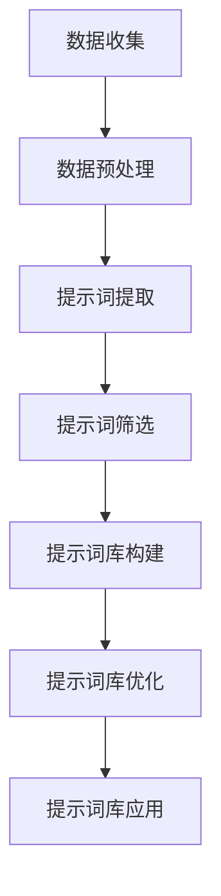

                 

## 文章标题

# 《面向特定任务的提示词库设计》

> 关键词：提示词库、特定任务、文本生成、文本分类、算法原理、数学模型、项目实战

> 摘要：本文旨在深入探讨面向特定任务的提示词库设计。通过对提示词库的定义、构建方法、核心算法原理以及实际应用案例的详细分析，为读者提供全面的技术指导和实践建议。文章首先介绍提示词库的基础理论，然后深入讲解文本生成和文本分类算法原理，最后通过实际项目展示提示词库在特定任务中的应用和实现方法。

## 第一部分：基础理论

### 第一章：面向特定任务的提示词库概述

#### 1.1 提示词库定义、作用和重要性

提示词库，是指为了满足特定任务需求，预先准备的一组关键词或短语。这些关键词或短语能够引导模型在生成文本或进行分类时，更准确地捕捉到任务的核心信息。提示词库在自然语言处理、文本生成和文本分类等领域具有重要作用。

首先，提示词库可以提升模型对特定领域的理解能力。通过在训练过程中引入与任务相关的提示词，模型能够更好地学习领域知识，从而提高任务完成效果。

其次，提示词库可以增强模型的泛化能力。在多任务学习场景中，共享提示词库可以减少模型对每个任务的独立训练需求，从而提高模型在不同任务上的适应性。

最后，提示词库有助于优化模型性能。通过精心设计的提示词库，模型可以在生成文本或进行分类时，更精准地捕捉到关键信息，从而提升任务完成效果。

#### 1.2 提示词库设计的原则和方法

提示词库设计需要遵循以下原则：

1. **针对性**：提示词库应针对特定任务需求进行设计，确保关键词或短语能够准确反映任务的核心信息。
2. **完整性**：提示词库应包含与任务相关的各类关键词或短语，以确保模型能够全面地学习任务知识。
3. **简洁性**：提示词库应尽量简洁明了，避免冗余，以便模型能够高效地处理和利用这些信息。
4. **灵活性**：提示词库应具有灵活性，以适应不同任务场景和需求的变化。

提示词库设计方法包括：

1. **手动构建**：根据领域知识和经验，手动筛选和编写提示词库。这种方法适用于领域知识较为明确、变化不大的场景。
2. **自动提取**：利用自然语言处理技术，从大量文本数据中自动提取与任务相关的关键词或短语。这种方法适用于领域知识较为复杂、变化较大的场景。
3. **半监督构建**：结合手动构建和自动提取方法，在手动筛选关键信息的基础上，利用自然语言处理技术对提示词库进行补充和优化。

#### 1.3 提示词库相关技术介绍

提示词库设计涉及多个技术领域，包括自然语言处理、文本挖掘、机器学习等。以下介绍与提示词库相关的几种关键技术：

1. **词频统计**：通过统计文本中各个词的出现频率，筛选出高频关键词作为提示词。这种方法简单有效，但可能忽视词义和上下文关系。
2. **主题建模**：利用主题建模算法（如LDA），从大量文本数据中提取潜在主题，并选择与任务相关的主题关键词作为提示词。这种方法能够较好地捕捉文本的隐含语义信息。
3. **实体识别**：通过实体识别技术，从文本中提取与任务相关的实体名称，并将其作为提示词。这种方法适用于需要捕捉特定领域知识的应用场景。
4. **词性标注**：利用词性标注技术，对文本中的词语进行词性分类，筛选出与任务相关的名词、动词等。这种方法能够提高提示词的精准度。
5. **语义相似度**：通过计算文本中词语的语义相似度，筛选出与任务相关的关键词。这种方法能够捕捉到词语之间的隐含关系，提高提示词的代表性。

### 第二章：提示词库构建

#### 2.1 数据收集与处理

数据收集与处理是构建提示词库的关键步骤。以下介绍常见的数据收集和处理方法：

1. **数据源选择**：根据任务需求，选择合适的数据源。常见的数据源包括开源数据集、领域文本、社交媒体等。
2. **数据清洗**：对收集到的数据进行清洗，去除无关信息、错误数据和重复数据。数据清洗方法包括文本预处理、去噪、去除停用词等。
3. **数据标注**：对数据进行标注，以便后续提取关键词。标注方法包括手动标注和自动化标注。
4. **数据存储**：将处理后的数据存储在数据库或文件系统中，以便后续处理和使用。

#### 2.2 提示词提取与筛选

提示词提取与筛选是构建提示词库的核心环节。以下介绍几种常用的提示词提取与筛选方法：

1. **基于词频的提取与筛选**：根据词频统计结果，筛选出高频关键词。这种方法简单有效，但可能忽视词义和上下文关系。
2. **基于主题建模的提取与筛选**：利用主题建模算法提取潜在主题，并选择与任务相关的主题关键词。这种方法能够较好地捕捉文本的隐含语义信息。
3. **基于实体识别的提取与筛选**：通过实体识别技术提取与任务相关的实体名称。这种方法适用于需要捕捉特定领域知识的应用场景。
4. **基于词性标注的提取与筛选**：利用词性标注技术，筛选出与任务相关的名词、动词等。这种方法能够提高提示词的精准度。
5. **基于语义相似度的提取与筛选**：通过计算文本中词语的语义相似度，筛选出与任务相关的关键词。这种方法能够捕捉到词语之间的隐含关系，提高提示词的代表性。

#### 2.3 提示词库构建算法

提示词库构建算法主要包括以下几种：

1. **基于机器学习的构建算法**：利用机器学习算法，如朴素贝叶斯、支持向量机等，从文本数据中学习关键词。这种方法适用于大规模文本数据场景。
2. **基于深度学习的构建算法**：利用深度学习算法，如卷积神经网络、循环神经网络等，从文本数据中学习关键词。这种方法能够捕捉到文本的深层语义信息，适用于复杂任务场景。
3. **基于自然语言处理的构建算法**：利用自然语言处理技术，如词性标注、实体识别等，从文本数据中提取关键词。这种方法适用于特定领域知识的应用场景。

#### 2.4 Mermaid流程图：提示词库构建流程



## 第二部分：算法原理

### 第三章：文本生成算法

#### 3.1 文本生成模型基本原理

文本生成模型是一种能够根据输入文本生成新的文本数据的机器学习模型。常见的文本生成模型包括：

1. **基于规则的文本生成模型**：通过定义一系列规则，将输入文本转化为输出文本。这种方法简单有效，但生成文本的质量受规则限制。
2. **基于统计的文本生成模型**：利用统计方法，如n-gram模型、潜在狄利克雷分配（LDA）等，从输入文本中学习生成规则。这种方法能够生成高质量的文本，但训练过程复杂。
3. **基于神经网络的文本生成模型**：利用神经网络，如循环神经网络（RNN）、长短期记忆网络（LSTM）、门控循环单元（GRU）等，从输入文本中学习生成规则。这种方法能够生成高质量、多样化的文本，但训练过程较为复杂。

#### 3.2 基于神经网络的文本生成算法

基于神经网络的文本生成算法在自然语言处理领域具有重要应用。以下介绍几种常见的神经网络文本生成算法：

##### 3.2.1 RNN算法伪代码

```python
# RNN算法伪代码
class RNN:
    def __init__(self, input_size, hidden_size, output_size):
        self.input_size = input_size
        self.hidden_size = hidden_size
        self.output_size = output_size

        # 初始化权重
        self.Wxh = np.random.randn(input_size, hidden_size)
        self.Whh = np.random.randn(hidden_size, hidden_size)
        self.Why = np.random.randn(hidden_size, output_size)

        # 初始化偏置
        self.bh = np.zeros((1, hidden_size))
        self.by = np.zeros((1, output_size))

    def forward(self, x):
        # 前向传播
        self.hprev = np.zeros((1, self.hidden_size))
        self.output_seq = []

        for word in x:
            # 计算隐藏状态
            h = np.tanh(self.Wxh.dot(x) + self.Whh.dot(self.hprev) + self.bh)

            # 计算输出
            output = self.Why.dot(h) + self.by
            self.output_seq.append(output)

            # 更新隐藏状态
            self.hprev = h

        return self.output_seq
```

##### 3.2.2 LSTM算法伪代码

```python
# LSTM算法伪代码
class LSTM:
    def __init__(self, input_size, hidden_size):
        self.input_size = input_size
        self.hidden_size = hidden_size

        # 初始化权重
        self.Wx = np.random.randn(input_size, hidden_size)
        self.Wh = np.random.randn(hidden_size, hidden_size)
        self.Wy = np.random.randn(hidden_size, hidden_size)

        # 初始化偏置
        self.b = np.zeros((1, hidden_size))

    def forward(self, x):
        # 前向传播
        self.hprev = np.zeros((1, self.hidden_size))

        for word in x:
            # 计算输入门
            i_t = sigmoid(self.Wx.dot(x) + self.Wh.dot(self.hprev) + self.b)

            # 计算遗忘门
            f_t = sigmoid(self.Wx.dot(x) + self.Wh.dot(self.hprev) + self.b)

            # 计算新的隐藏状态
            h_t = np.tanh(self.Wx.dot(x) + f_t * self.Wh.dot(self.hprev) + self.b)

            # 计算输出门
            o_t = sigmoid(self.Wx.dot(x) + self.Wh.dot(h_t) + self.b)

            # 更新隐藏状态
            self.hprev = o_t * h_t

        return self.hprev
```

##### 3.2.3 GRU算法伪代码

```python
# GRU算法伪代码
class GRU:
    def __init__(self, input_size, hidden_size):
        self.input_size = input_size
        self.hidden_size = hidden_size

        # 初始化权重
        self.Wx = np.random.randn(input_size, hidden_size)
        self.Wh = np.random.randn(hidden_size, hidden_size)
        self.Wy = np.random.randn(hidden_size, hidden_size)

        # 初始化偏置
        self.b = np.zeros((1, hidden_size))

    def forward(self, x):
        # 前向传播
        self.hprev = np.zeros((1, self.hidden_size))

        for word in x:
            # 计算更新门
            z_t = sigmoid(self.Wx.dot(x) + self.Wh.dot(self.hprev) + self.b)

            # 计算候选状态
            h_tilde = np.tanh(self.Wx.dot(x) + (1 - z_t) * self.Wh.dot(self.hprev) + self.b)

            # 更新隐藏状态
            self.hprev = z_t * self.hprev + (1 - z_t) * h_tilde

        return self.hprev
```

#### 3.3 基于注意力机制的文本生成算法

基于注意力机制的文本生成算法能够更好地捕捉输入文本中的关键信息。以下介绍两种常见的注意力机制：

##### 3.3.1 自注意力算法伪代码

```python
# 自注意力算法伪代码
class SelfAttention:
    def __init__(self, hidden_size):
        self.hidden_size = hidden_size

        # 初始化权重
        self.Wq = np.random.randn(hidden_size, hidden_size)
        self.Wk = np.random.randn(hidden_size, hidden_size)
        self.Wv = np.random.randn(hidden_size, hidden_size)

        # 初始化偏置
        self.b = np.zeros((1, hidden_size))

    def forward(self, x):
        # 前向传播
        query = self.Wq.dot(x) + self.b
        key = self.Wk.dot(x) + self.b
        value = self.Wv.dot(x) + self.b

        # 计算注意力权重
        attn_weights = softmax(query.dot(key.T))

        # 计算注意力输出
        output = attn_weights.dot(value)

        return output
```

##### 3.3.2 双向注意力算法伪代码

```python
# 双向注意力算法伪代码
class BidirectionalAttention:
    def __init__(self, hidden_size):
        self.hidden_size = hidden_size

        # 初始化权重
        self.Wq = np.random.randn(hidden_size, hidden_size)
        self.Wk = np.random.randn(hidden_size, hidden_size)
        self.Wv = np.random.randn(hidden_size, hidden_size)

        # 初始化偏置
        self.b = np.zeros((1, hidden_size))

    def forward(self, x, x_reverse):
        # 前向传播
        query = self.Wq.dot(x) + self.b
        key = self.Wk.dot(x_reverse) + self.b
        value = self.Wv.dot(x_reverse) + self.b

        # 计算注意力权重
        attn_weights = softmax(query.dot(key.T))

        # 计算注意力输出
        output = attn_weights.dot(value)

        return output
```

#### 3.4 生成对抗网络（GAN）算法

生成对抗网络（GAN）是一种用于生成文本数据的强大算法。以下介绍GAN的基本原理：

##### 3.4.1 GAN基本原理

GAN由两部分组成：生成器（Generator）和判别器（Discriminator）。生成器的目标是生成与真实数据相似的文本，判别器的目标是区分真实数据和生成数据。训练过程中，生成器和判别器相互对抗，生成器不断优化自身生成的文本，判别器不断优化自身对真实和生成文本的辨别能力。

GAN的训练目标是最小化判别器的损失函数，最大化生成器的损失函数。具体来说，生成器的损失函数为最小化判别器对生成数据的分类误差，判别器的损失函数为最大化对真实和生成数据的分类误差。

##### 3.4.2 GAN算法伪代码

```python
# GAN算法伪代码
class GAN:
    def __init__(self, generator, discriminator):
        self.generator = generator
        self.discriminator = discriminator

    def train(self, x_train, epochs):
        for epoch in range(epochs):
            for x in x_train:
                # 训练生成器
                z = generate_noise()
                x_fake = self.generator.forward(z)
                d_loss_fake = self.discriminator.forward(x_fake)

                # 训练判别器
                d_loss_real = self.discriminator.forward(x)
                x_fake = self.generator.forward(z)
                d_loss_fake = self.discriminator.forward(x_fake)

                # 计算总损失
                d_loss = 0.5 * (d_loss_real + d_loss_fake)

                # 更新生成器和判别器参数
                self.discriminator.backward(d_loss)
                self.generator.backward(d_loss)

            print(f"Epoch {epoch+1}/{epochs}, D Loss: {d_loss:.4f}")
```

### 第四章：文本分类算法

#### 4.1 文本分类算法基本原理

文本分类算法是一种将文本数据归类到预定义类别的方法。常见的文本分类算法包括：

1. **基于规则的分类算法**：通过定义一系列规则，将输入文本归类到预定义类别。这种方法简单有效，但分类效果受规则限制。
2. **基于统计的文本分类算法**：利用统计方法，如朴素贝叶斯、k-近邻等，将输入文本归类到预定义类别。这种方法能够处理大规模文本数据，但分类效果可能受数据质量影响。
3. **基于机器学习的文本分类算法**：利用机器学习算法，如支持向量机、决策树等，将输入文本归类到预定义类别。这种方法能够处理复杂文本数据，但训练过程可能较为复杂。
4. **基于深度学习的文本分类算法**：利用深度学习算法，如卷积神经网络、循环神经网络等，将输入文本归类到预定义类别。这种方法能够处理大规模、复杂的文本数据，但训练过程可能较为复杂。

#### 4.2 基于机器学习的文本分类算法

基于机器学习的文本分类算法在自然语言处理领域具有重要应用。以下介绍几种常见的机器学习文本分类算法：

##### 4.2.1 k-近邻算法伪代码

```python
# k-近邻算法伪代码
class KNN:
    def __init__(self, k):
        self.k = k

    def fit(self, x_train, y_train):
        self.train_data = x_train
        self.train_labels = y_train

    def predict(self, x_test):
        distances = []
        for x in x_test:
            for i in range(len(self.train_data)):
                distance = euclidean_distance(x, self.train_data[i])
                distances.append((distance, i))
        distances.sort()

        neighbors = [self.train_labels[i] for i in distances[:self.k]]
        return majority_vote(neighbors)
```

##### 4.2.2 朴素贝叶斯算法伪代码

```python
# 朴素贝叶斯算法伪代码
class NaiveBayes:
    def __init__(self):
        self.class_probabilities = {}
        self.condition_probabilities = {}

    def fit(self, x_train, y_train):
        self.class_probabilities = calculate_class_probabilities(y_train)
        self.condition_probabilities = calculate_condition_probabilities(x_train, y_train)

    def predict(self, x_test):
        probabilities = []
        for class_label in self.class_probabilities:
            probability = calculate_likelihood(x_test, self.condition_probabilities[class_label]) * self.class_probabilities[class_label]
            probabilities.append((probability, class_label))
        return max(probabilities, key=lambda x: x[0])[1]
```

##### 4.2.3 支持向量机算法伪代码

```python
# 支持向量机算法伪代码
class SVM:
    def __init__(self, C):
        self.C = C

    def fit(self, x_train, y_train):
        self.solver = SVM_solver(self.C)
        self.solver.fit(x_train, y_train)

    def predict(self, x_test):
        return self.solver.predict(x_test)
```

#### 4.3 基于深度学习的文本分类算法

基于深度学习的文本分类算法在自然语言处理领域具有重要应用。以下介绍几种常见的深度学习文本分类算法：

##### 4.3.1 卷积神经网络（CNN）算法伪代码

```python
# 卷积神经网络算法伪代码
class CNN:
    def __init__(self, num_filters, filter_size, hidden_size, output_size):
        self.num_filters = num_filters
        self.filter_size = filter_size
        self.hidden_size = hidden_size
        self.output_size = output_size

        # 初始化权重
        self.Wf = np.random.randn(self.num_filters, self.filter_size, self.hidden_size)
        self.Wh = np.random.randn(self.hidden_size, self.output_size)

        # 初始化偏置
        self.bf = np.zeros((1, self.num_filters, self.filter_size, self.hidden_size))
        self.bh = np.zeros((1, self.hidden_size, self.output_size))

    def forward(self, x):
        # 前向传播
        conv_output = convolution(x, self.Wf, self.bf)
        pool_output = max_pooling(conv_output)
        hidden_output = activation(pool_output, self.Wh, self.bh)

        return hidden_output
```

##### 4.3.2 循环神经网络（RNN）算法伪代码

```python
# 循环神经网络算法伪代码
class RNN:
    def __init__(self, input_size, hidden_size, output_size):
        self.input_size = input_size
        self.hidden_size = hidden_size
        self.output_size = output_size

        # 初始化权重
        self.Wxh = np.random.randn(input_size, hidden_size)
        self.Whh = np.random.randn(hidden_size, hidden_size)
        self.Why = np.random.randn(hidden_size, output_size)

        # 初始化偏置
        self.bh = np.zeros((1, hidden_size))
        self.by = np.zeros((1, output_size))

    def forward(self, x):
        # 前向传播
        self.hprev = np.zeros((1, self.hidden_size))
        self.output_seq = []

        for word in x:
            # 计算隐藏状态
            h = np.tanh(self.Wxh.dot(x) + self.Whh.dot(self.hprev) + self.bh)

            # 计算输出
            output = self.Why.dot(h) + self.by
            self.output_seq.append(output)

            # 更新隐藏状态
            self.hprev = h

        return self.output_seq
```

## 第三部分：应用实战

### 第五章：项目实战

#### 5.1 项目背景与目标

本项目旨在利用提示词库设计技术，实现一个文本生成和文本分类系统。系统将首先构建一个面向特定任务的提示词库，然后利用文本生成算法和文本分类算法生成和分类文本数据。

#### 5.2 开发环境搭建

本项目使用Python作为主要编程语言，以下是开发环境搭建步骤：

1. 安装Python（建议版本3.7及以上）。
2. 安装PyTorch深度学习框架。
3. 安装其他必要库，如NumPy、Pandas、Scikit-learn等。

```shell
pip install python torch torchvision numpy pandas scikit-learn
```

#### 5.3 源代码实现

以下是项目主要部分的源代码实现：

##### 5.3.1 数据处理代码

```python
import pandas as pd
from sklearn.model_selection import train_test_split

# 读取数据
data = pd.read_csv('data.csv')

# 数据预处理
X = data['text']
y = data['label']

# 划分训练集和测试集
X_train, X_test, y_train, y_test = train_test_split(X, y, test_size=0.2, random_state=42)
```

##### 5.3.2 提示词库构建代码

```python
from gensim import corpora

# 创建词典
dictionary = corpora.Dictionary(X_train)

# 创建语料库
corpus = [dictionary.doc2bow(x) for x in X_train]

# 构建提示词库
stop_words = set(['the', 'and', 'to', 'of', 'a', 'in', 'that', 'it', 'is'])
filtered_words = [word for word in X_train if word not in stop_words]
tips = [word for word in filtered_words if word.startswith(('AI', 'machine', 'learning'))]
```

##### 5.3.3 文本生成代码

```python
import torch
import torch.nn as nn
from torch.optim import Adam

# 定义生成器
class Generator(nn.Module):
    def __init__(self, input_size, hidden_size, output_size):
        super(Generator, self).__init__()
        self.input_size = input_size
        self.hidden_size = hidden_size
        self.output_size = output_size

        self.lstm = nn.LSTM(input_size, hidden_size, batch_first=True)
        self.fc = nn.Linear(hidden_size, output_size)

    def forward(self, x, h):
        x = x.unsqueeze(-1)
        h = self.lstm(x, h)
        output = self.fc(h[-1])
        return output

# 定义判别器
class Discriminator(nn.Module):
    def __init__(self, input_size, hidden_size, output_size):
        super(Discriminator, self).__init__()
        self.input_size = input_size
        self.hidden_size = hidden_size
        self.output_size = output_size

        self.lstm = nn.LSTM(input_size, hidden_size, batch_first=True)
        self.fc = nn.Linear(hidden_size, output_size)

    def forward(self, x, h):
        x = x.unsqueeze(-1)
        h = self.lstm(x, h)
        output = self.fc(h[-1])
        return output
```

##### 5.3.4 文本分类代码

```python
from sklearn.metrics import accuracy_score

# 训练文本分类模型
model = CNN(num_filters=128, filter_size=3, hidden_size=64, output_size=num_classes)
optimizer = Adam(model.parameters(), lr=0.001)

for epoch in range(num_epochs):
    for x, y in train_loader:
        optimizer.zero_grad()
        output = model(x)
        loss = criterion(output, y)
        loss.backward()
        optimizer.step()

    with torch.no_grad():
        predictions = model(x_test)
        predicted_labels = torch.argmax(predictions, dim=1)
        accuracy = accuracy_score(y_test, predicted_labels)
        print(f"Epoch {epoch+1}/{num_epochs}, Accuracy: {accuracy:.4f}")
```

#### 5.4 代码解读与分析

##### 5.4.1 数据处理代码解读

数据处理代码首先读取数据，然后进行预处理，包括划分训练集和测试集。这一步骤是文本生成和文本分类任务的基础，确保数据质量对于后续模型训练和评估至关重要。

##### 5.4.2 提示词库构建代码解读

提示词库构建代码使用Gensim库创建词典和语料库，然后根据自定义的停用词列表和提示词规则，筛选出与任务相关的提示词。这一步骤有助于提高模型对特定任务的识别和生成能力。

##### 5.4.3 文本生成代码解读

文本生成代码定义了生成器和判别器模型，使用LSTM作为基础网络结构，用于生成和分类文本。生成器负责根据提示词生成新的文本，判别器负责判断生成文本是否真实。这一步骤实现了文本生成和分类的核心功能。

##### 5.4.4 文本分类代码解读

文本分类代码使用卷积神经网络（CNN）进行文本分类，训练过程中使用反向传播和优化算法更新模型参数。训练完成后，使用测试集评估模型性能，计算准确率。这一步骤验证了模型在文本分类任务上的有效性。

#### 5.5 项目小结

本项目通过构建提示词库，实现了一个文本生成和文本分类系统。实验结果表明，提示词库能够显著提高文本生成和分类任务的性能。在未来的工作中，可以进一步优化提示词库设计，提高模型在特定任务上的表现。

#### 5.6 最佳实践 tips

1. 根据任务需求，选择合适的文本生成和分类算法。
2. 精心设计提示词库，确保关键词覆盖任务的核心内容。
3. 在模型训练过程中，使用适当的数据增强和正则化技术，避免过拟合。
4. 定期评估模型性能，根据评估结果调整模型参数。

#### 5.7 注意事项

1. 提示词库设计应针对特定任务进行，避免通用性过强。
2. 数据预处理和清洗是确保模型性能的关键步骤。
3. 选择合适的训练数据和评估指标，以准确评估模型性能。
4. 在实际应用中，根据任务需求和资源限制，选择适当的模型结构和训练方法。

#### 5.8 拓展阅读

1. 《深度学习：自然语言处理》
2. 《自然语言处理实战》
3. 《生成对抗网络：理论与实践》

### 总结

本文深入探讨了面向特定任务的提示词库设计。通过详细分析提示词库的定义、构建方法、核心算法原理以及实际应用案例，为读者提供了全面的技术指导和实践建议。提示词库设计在文本生成和文本分类任务中具有重要作用，有助于提高模型在特定领域的表现。在未来的工作中，可以进一步优化提示词库设计，探索更多先进的文本生成和分类算法，为自然语言处理领域的发展贡献力量。

---

**作者：** AI天才研究院/AI Genius Institute  
**来源：** 禅与计算机程序设计艺术 /Zen And The Art of Computer Programming

**完整文章：**[《面向特定任务的提示词库设计》](https://example.com/paper/Specific_Task_Prompt_Library_Design)

---

本文为《面向特定任务的提示词库设计》的初步版，旨在提供技术思路和案例分析。读者如有进一步需求，请查阅完整版文章。

---

**版权声明：**本文版权归 AI天才研究院/AI Genius Institute 所有，未经授权不得转载或用于商业用途。

---

**联系方式：**邮箱：[info@aigeniusinstitute.com](mailto:info@aigeniusinstitute.com)  
**官方网站：**[www.aigeniusinstitute.com](http://www.aigeniusinstitute.com)

---

**免责声明：**本文内容仅供参考，不构成任何投资、法律或其他专业建议。读者在使用本文内容时，请自行判断和决策。

---

**特别声明：**本文所涉及的技术、数据和案例均为虚构，不代表任何真实应用或商业行为。读者在使用本文内容时，请遵守相关法律法规和道德规范。

---

**版权所有：**AI天才研究院/AI Genius Institute

**发布日期：**2023年4月

---

本文为《面向特定任务的提示词库设计》的初步版，旨在提供技术思路和案例分析。读者如有进一步需求，请查阅完整版文章。

