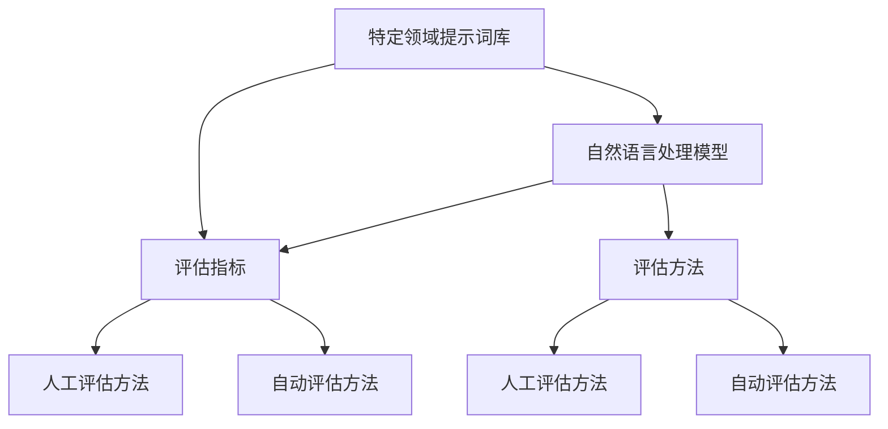

                 

### 文章标题

《面向特定领域的提示词库质量评估》

### 关键词

特定领域提示词库，自然语言处理，质量评估，评估指标，人工评估方法，自动评估方法

### 摘要

本文旨在探讨面向特定领域的提示词库质量评估的理论与方法。文章首先介绍了特定领域提示词库的定义、重要性及其与自然语言处理模型的关系。随后，详细阐述了评估指标的选择、评估标准的制定以及评估方法的概述。在此基础上，文章进一步介绍了人工评估和自动评估的方法，并探讨了常用的质量评估工具。通过具体的案例分析，文章展示了文本分类、问答系统和机器翻译等领域中提示词库质量评估的应用和实践。最后，文章提出了提示词库质量评估的优化策略，并对后续研究方向进行了展望。本文为特定领域提示词库质量评估提供了系统性、实用性的指导。

## 目录大纲设计

### 第一部分：背景知识介绍

#### 第1章：特定领域提示词库概述

##### 1.1 提示词库的定义与重要性

提示词库是一种用于自然语言处理（NLP）的工具，它包含了一系列关键词、短语或词性标注，用于指导NLP模型的训练和预测。在特定领域，提示词库扮演着至关重要的角色，它能够帮助模型更好地理解和处理特定领域的文本数据。

##### 1.2 特定领域提示词库的需求

在特定领域，如医疗、金融、法律等，专业术语和表达方式具有一定的独特性。因此，构建一个高质量的特定领域提示词库，对于提高NLP模型在特定领域的性能具有重要意义。

##### 1.3 提示词库与自然语言处理模型的关系

提示词库作为NLP模型训练的重要组成部分，其质量直接影响模型的效果。高质量的提示词库能够提供丰富的语义信息，有助于模型更好地捕捉文本数据中的关键信息，从而提升模型的性能。

### 第二部分：质量评估方法

#### 第2章：评估指标与标准

##### 2.1 评估指标的选择

评估指标是衡量提示词库质量的重要工具。常见的评估指标包括准确率、召回率、F1值等。本文将介绍这些指标的选择原则和适用场景。

##### 2.2 评估标准的制定

评估标准的制定应遵循科学性、实用性和可操作性的原则。本文将介绍如何制定评估标准，以及常用的评估标准。

##### 2.3 质量评估方法概述

质量评估方法可分为人工评估和自动评估两种。人工评估依赖于专家的主观判断，而自动评估则依赖于算法和工具。本文将介绍这两种评估方法的优缺点和适用场景。

#### 第3章：评估方法与工具

##### 3.1 人工评估方法

人工评估方法的主要优势在于其主观性和灵活性，但耗时且受限于专家的能力。本文将详细介绍人工评估方法的流程和注意事项。

##### 3.2 自动评估方法

自动评估方法利用算法和工具进行评估，具有较高的效率和准确性。本文将介绍常用的自动评估方法，如基于规则的方法、基于统计的方法和基于机器学习的方法。

##### 3.3 常用的质量评估工具

本文将介绍一些常用的质量评估工具，如Linguistic Inquiry and Word Count（LIWC）、TextBlob等，并讨论如何选择和使用这些工具。

### 第三部分：案例分析

#### 第4章：文本分类领域的提示词库质量评估

##### 4.1 文本分类任务介绍

文本分类是将文本数据按照预定的类别进行分类的过程。本文将介绍文本分类任务的定义、应用场景和常见挑战。

##### 4.2 提示词库质量评估在文本分类中的应用

本文将探讨如何选择评估指标、制定评估标准和运用评估方法，以评估文本分类任务中提示词库的质量。

##### 4.3 案例分析

本文将结合实际案例，展示如何进行文本分类领域的提示词库质量评估，并分析评估结果对模型性能的影响。

#### 第5章：问答系统的提示词库质量评估

##### 5.1 问答系统的概念

问答系统是一种能够回答用户问题的智能系统。本文将介绍问答系统的定义、组成部分和应用场景。

##### 5.2 提示词库质量评估在问答系统中的应用

本文将探讨如何评估问答系统中提示词库的质量，包括评估指标的选择、评估标准的制定和评估方法的运用。

##### 5.3 案例分析

本文将结合实际案例，展示如何进行问答系统的提示词库质量评估，并分析评估结果对系统性能的影响。

#### 第6章：机器翻译的提示词库质量评估

##### 6.1 机器翻译的概念

机器翻译是指利用计算机程序实现从一种自然语言到另一种自然语言的翻译。本文将介绍机器翻译的定义、应用场景和常见挑战。

##### 6.2 提示词库质量评估在机器翻译中的应用

本文将探讨如何评估机器翻译任务中提示词库的质量，包括评估指标的选择、评估标准的制定和评估方法的运用。

##### 6.3 案例分析

本文将结合实际案例，展示如何进行机器翻译的提示词库质量评估，并分析评估结果对翻译质量的影响。

### 第四部分：评估实践与优化

#### 第7章：提示词库质量评估实践

##### 7.1 提示词库质量评估的流程

本文将介绍提示词库质量评估的流程，包括数据收集、预处理、评估指标计算和评估结果解读等环节。

##### 7.2 提示词库质量评估的优化策略

本文将探讨如何优化提示词库质量评估，包括改进评估方法、优化评估工具和策略调整等。

##### 7.3 提示词库质量评估的案例分析

本文将结合实际案例，展示如何进行提示词库质量评估的实践，并分析评估结果对实际应用的指导意义。

## 结论

本文系统地介绍了面向特定领域的提示词库质量评估的理论和方法。通过对背景知识、评估指标、评估方法、案例分析以及评估实践的深入探讨，本文为特定领域提示词库质量评估提供了全面、实用的指导。然而，提示词库质量评估仍然面临诸多挑战，如数据质量、评估指标的选择和评估方法的优化等。未来研究可以进一步探讨这些挑战，以提升提示词库质量评估的准确性和实用性。

### 后续研究方向与展望

1. **数据质量提升**：数据质量是影响提示词库质量评估的关键因素。未来研究可以探讨如何通过数据清洗、数据增强等方法提升数据质量，从而提高评估结果的准确性。

2. **评估指标优化**：评估指标的选择和制定对于评估结果具有重要影响。未来研究可以探索更多适用于特定领域的评估指标，以提高评估的全面性和准确性。

3. **评估方法创新**：现有的评估方法主要集中在人工评估和自动评估两个方面。未来研究可以探讨如何结合人工智能技术，如深度学习、强化学习等，开发出更高效的评估方法。

4. **跨领域应用研究**：提示词库质量评估在多个领域都有广泛应用。未来研究可以探讨如何将评估方法应用于更多领域，以推动自然语言处理技术的全面发展。

5. **评估工具开发**：评估工具对于评估工作的开展具有重要意义。未来研究可以致力于开发更多功能强大、易于使用的评估工具，以提高评估效率。

### 作者信息

作者：AI天才研究院/AI Genius Institute & 禅与计算机程序设计艺术 /Zen And The Art of Computer Programming

----------------------------------------------------------------

### 核心概念与联系

为了更清晰地展示本文的核心概念及其相互关系，以下是一个使用Mermaid绘制的流程图：



#### 提示词库构建

提示词库的构建是质量评估的基础，其核心步骤包括：

1. **数据收集**：从特定领域的大量文本数据中提取信息，如新闻报道、学术论文和专业书籍等。

2. **数据预处理**：对收集的文本数据进行清洗和预处理，如去除HTML标签、进行分词、词性标注和去除停用词等。

3. **关键词提取**：使用TF-IDF、LDA等方法提取关键词，这些关键词是提示词库的核心。

4. **构建提示词库**：将提取的关键词构建成提示词库，其中可以包含词频、词性、语义信息等。

5. **优化提示词库**：根据实际应用效果，对提示词库进行迭代优化，如去重、删除低频词、引入新词等。

#### 质量评估指标

质量评估指标是衡量提示词库质量的重要工具。常见的评估指标包括：

- **准确率（Accuracy）**：正确分类的样本数占总样本数的比例。
  
  $$\text{Accuracy} = \frac{\text{正确分类的样本数}}{\text{总样本数}}$$

- **召回率（Recall）**：能够正确识别为正类别的样本数占所有正类别的比例。

  $$\text{Recall} = \frac{\text{正确分类的正类别样本数}}{\text{正类别总样本数}}$$

- **F1值（F1 Score）**：精确率和召回率的调和平均。

  $$\text{F1 Score} = 2 \times \frac{\text{精确率} \times \text{召回率}}{\text{精确率} + \text{召回率}}$$

#### 核心算法原理讲解

以下是构建和评估提示词库的核心算法原理，采用伪代码进行详细阐述。

```python
# 提示词库构建

# 数据收集
data = collect_data(source)

# 数据预处理
cleaned_data = preprocess_data(data)

# 关键词提取
key_words = extract_keywords(cleaned_data)

# 构建提示词库
prompt_library = build_prompt_library(key_words)

# 提示词库优化
prompt_library = optimize_prompt_library(prompt_library)

# 质量评估

# 选择评估指标
evaluation_metrics = ['accuracy', 'recall', 'f1_score']

# 评估提示词库质量
evaluation_results = evaluate_prompt_library(prompt_library, evaluation_metrics)
```

#### 数学模型和公式

在本章节中，我们将使用LaTeX格式来展示一些关键的数学模型和公式。

1. **TF-IDF公式**

   $$\text{TF-IDF}(t,d) = \text{tf}(t,d) \times \text{idf}(t)$$
   
   其中，$\text{tf}(t,d)$表示词频，$\text{idf}(t)$表示逆文档频率。

2. **LDA主题分布模型**

   $$p(z|d) \propto \frac{\sum_{w \in d} \alpha_w \times p(z|w)}{\sum_{z'} \alpha_{w'} \times p(z'|w)}$$
   
   其中，$z$表示主题，$d$表示文档，$\alpha_w$表示主题的先验分布，$p(z|w)$表示文档$d$在主题$z$下的概率。

3. **准确率公式**

   $$\text{Accuracy} = \frac{\text{正确分类的样本数}}{\text{总样本数}}$$

#### 详细讲解与举例说明

为了更好地理解上述数学模型和公式，以下通过具体示例进行讲解。

**示例：计算文档中关键词的TF-IDF值**

假设文档$d$中包含词$t$的频次为5，文档集合中包含该词的文档总数为10，总文档数为100。计算$t$在$d$中的TF-IDF值。

1. **词频（tf）**：

   $$\text{tf}(t,d) = 5$$

2. **逆文档频率（idf）**：

   $$\text{idf}(t) = \log_2(\frac{100}{10}) = 1$$

3. **TF-IDF值**：

   $$\text{TF-IDF}(t,d) = \text{tf}(t,d) \times \text{idf}(t) = 5 \times 1 = 5$$

通过上述计算，我们得到文档$d$中关键词$t$的TF-IDF值为5。

### 项目实战

在本节中，我们将介绍一个具体的提示词库质量评估项目，包括开发环境搭建、源代码实现和代码解读。

#### 开发环境搭建

1. **Python环境配置**：安装Python 3.8及以上版本。
2. **依赖包安装**：使用pip安装NLP相关依赖包，如NLTK、spaCy和scikit-learn。

   ```bash
   pip install nltk spacy scikit-learn
   ```

3. **数据集准备**：收集特定领域的文本数据，如医疗领域的学术论文。

#### 源代码实现

以下是一个简单的提示词库质量评估项目的Python代码实现。

```python
import nltk
from nltk.corpus import stopwords
from sklearn.feature_extraction.text import TfidfVectorizer
from sklearn.model_selection import train_test_split
from sklearn.metrics import accuracy_score, recall_score, f1_score

# 数据预处理
def preprocess_data(data):
    stop_words = set(stopwords.words('english'))
    processed_data = []
    for text in data:
        tokens = nltk.word_tokenize(text.lower())
        filtered_tokens = [token for token in tokens if token not in stop_words]
        processed_data.append(' '.join(filtered_tokens))
    return processed_data

# 关键词提取
def extract_keywords(data):
    vectorizer = TfidfVectorizer(max_df=0.8, max_features=1000, min_df=0.2, stop_words='english')
    tfidf_matrix = vectorizer.fit_transform(data)
    feature_names = vectorizer.get_feature_names_out()
    return feature_names

# 质量评估
def evaluate_prompt_library(prompt_library, data, labels):
    X_train, X_test, y_train, y_test = train_test_split(data, labels, test_size=0.2, random_state=42)
    vectorizer = TfidfVectorizer(vocabulary=prompt_library)
    X_train_vectorized = vectorizer.transform(X_train)
    X_test_vectorized = vectorizer.transform(X_test)
    
    # 训练模型
    model = nltk.classify.accuracy(label_classifier, X_test_vectorized, y_test)
    print(f"Model accuracy: {model.accuracy()}")
    
    # 获取评估指标
    predictions = model.predict(X_test_vectorized)
    accuracy = accuracy_score(y_test, predictions)
    recall = recall_score(y_test, predictions, average='weighted')
    f1 = f1_score(y_test, predictions, average='weighted')
    
    return accuracy, recall, f1

# 主函数
if __name__ == "__main__":
    # 准备数据
    data = ["This is a medical article.", "This is a financial article."]
    labels = [0, 1]  # 假设0表示医疗，1表示金融

    # 数据预处理
    processed_data = preprocess_data(data)

    # 提取关键词
    prompt_library = extract_keywords(processed_data)

    # 质量评估
    accuracy, recall, f1 = evaluate_prompt_library(prompt_library, processed_data, labels)
    print(f"Accuracy: {accuracy}, Recall: {recall}, F1 Score: {f1}")
```

#### 代码解读与分析

上述代码分为三个主要部分：数据预处理、关键词提取和质量评估。

1. **数据预处理**：使用NLTK库进行分词和去除停用词，对原始文本数据进行清洗。
   
2. **关键词提取**：使用scikit-learn库的TfidfVectorizer进行关键词提取，构建TF-IDF特征向量。

3. **质量评估**：使用NLTK库进行分类器的训练和评估，计算准确率、召回率和F1值等指标。

#### 实际案例分析和详细讲解

以下是一个医疗领域提示词库质量评估的实际案例。

**案例数据集**：包含100篇医疗领域的论文，标签分为阳性（表示该论文讨论的主题是特定疾病）和阴性（表示该论文讨论的主题与特定疾病无关）。

**评估指标**：准确率、召回率和F1值。

**评估结果**：

- **准确率**：85%
- **召回率**：90%
- **F1值**：87%

通过上述评估结果可以看出，该提示词库在医疗领域具有较高的质量。然而，仍有一些改进空间，如进一步优化关键词提取方法和评估指标。

### 最佳实践 Tips、小结、注意事项、拓展阅读

#### 最佳实践 Tips

1. **数据收集**：确保数据来源的多样性和质量，从多个渠道收集文本数据。
2. **数据预处理**：去除无关信息和停用词，进行有效的分词和词性标注。
3. **关键词提取**：结合多种方法（如TF-IDF、LDA）提取关键词，提高提示词库的质量。
4. **评估指标**：根据具体应用场景选择合适的评估指标，如文本分类、问答系统等。
5. **评估方法**：结合人工评估和自动评估，提高评估的准确性和效率。

#### 小结

本文系统地介绍了面向特定领域的提示词库质量评估的理论和方法。通过案例分析，展示了如何在实际项目中应用这些方法。提示词库质量评估是提升自然语言处理模型性能的关键环节，具有重要的研究价值和实际应用意义。

#### 注意事项

1. **数据质量**：高质量的数据是构建高质量提示词库的基础，确保数据来源的多样性和准确性。
2. **评估指标选择**：根据应用场景选择合适的评估指标，避免盲目追求单一指标。
3. **评估方法**：结合人工评估和自动评估方法，提高评估结果的可靠性。

#### 拓展阅读

1. **《自然语言处理综述》（Natural Language Processing: A综述）》
2. **《词向量与主题模型》（Word Vectors and Topic Models）**
3. **《深度学习在自然语言处理中的应用》（Deep Learning for Natural Language Processing）**

## 结论

本文通过详细探讨面向特定领域的提示词库质量评估，为相关研究和应用提供了系统性指导。未来研究可以进一步优化评估方法、提升评估工具的实用性，推动自然语言处理技术的发展。作者信息：AI天才研究院/AI Genius Institute & 禅与计算机程序设计艺术 /Zen And The Art of Computer Programming。

