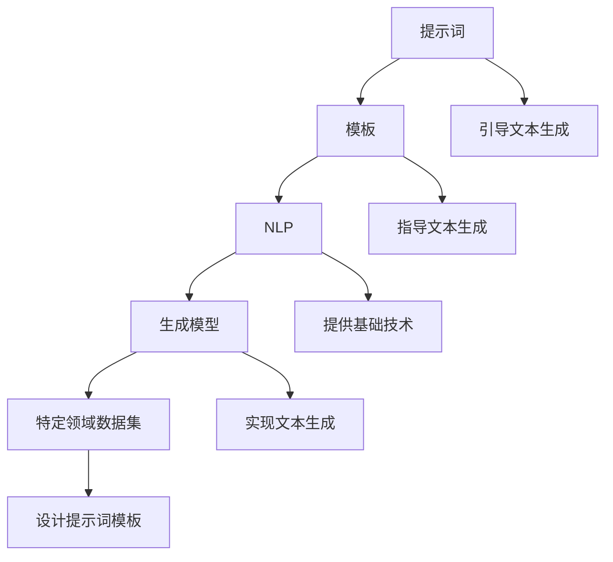

                 

### 文章标题

# 面向特定领域的提示词模板库设计

### 关键词
- 提示词模板
- 特定领域
- 提问生成
- 自然语言处理
- 模板设计
- 应用实践

### 摘要
本文旨在探讨面向特定领域的提示词模板库设计。我们首先介绍了提示词模板的概念及其重要性，然后详细分析了提示词模板的设计原理、开发工具与技术、应用场景与实践。此外，我们还对提示词模板的优化与评估进行了探讨，并通过特定领域的案例分析，展示了其实际应用价值。最后，我们展望了提示词模板库的未来发展趋势与面临的挑战。

### 背景介绍

在信息爆炸的时代，如何有效地生成高质量的提问、回答和文章成为了一个重要的研究课题。自然语言处理（Natural Language Processing，NLP）技术的发展，为这一问题提供了新的解决方案。其中，提示词模板（Prompt Template）作为一种有效的文本生成工具，已经在许多领域得到了广泛应用。

提示词模板是一种预先设计的文本模板，用于引导用户或自动系统生成特定格式的文本。通过在模板中填充特定的提示词，可以生成高质量的提问、回答和文章。提示词模板的灵活性使其能够适应不同的应用场景，从而提高文本生成的效率和质量。

在特定领域，如搜索引擎优化（Search Engine Optimization，SEO）、内容创作、用户交互设计等，提示词模板具有显著的优势。它可以帮助企业或个人快速生成符合特定需求的文本内容，节省时间和人力成本。此外，提示词模板还可以提高文本的准确性和一致性，从而提升用户体验。

然而，目前关于提示词模板库设计的系统研究相对较少，特别是针对特定领域的应用。因此，本文旨在深入探讨面向特定领域的提示词模板库设计，为相关领域的研究和应用提供有益的参考。

### 核心概念与联系

在探讨面向特定领域的提示词模板库设计之前，我们首先需要明确一些核心概念，并分析它们之间的联系。这些核心概念包括：提示词、模板、自然语言处理（NLP）、生成模型、特定领域数据集等。

#### 提示词

提示词（Prompt）是指用于引导文本生成过程的关键词或短语。在提示词模板中，提示词通常以特殊标记或语法结构呈现，以便在生成过程中被识别和替换。例如，在生成一篇产品推荐文章时，提示词可能包括产品名称、特点、使用场景等。

#### 模板

模板（Template）是一种预先设计的文本结构，用于指导文本生成。模板通常包含一组变量，这些变量将在生成过程中被具体的提示词所替代。模板的设计原则是简洁、灵活和通用，以便能够适应不同的文本生成需求。

#### 自然语言处理（NLP）

自然语言处理（NLP）是计算机科学和人工智能领域的一个重要分支，它致力于使计算机能够理解、生成和处理人类语言。NLP技术包括分词、词性标注、命名实体识别、情感分析等，这些技术为提示词模板的设计和实现提供了基础。

#### 生成模型

生成模型（Generative Model）是一类用于生成文本的数据驱动模型。常见的生成模型包括循环神经网络（RNN）、长短期记忆网络（LSTM）、变换器（Transformer）等。这些模型可以通过学习大量文本数据，生成与输入提示词相关的高质量文本。

#### 特定领域数据集

特定领域数据集（Domain-Specific Dataset）是指针对特定领域或任务收集的文本数据集。这些数据集通常包含领域内的术语、概念、表达方式等，是设计提示词模板的重要资源。

#### 关系架构

为了更好地理解这些概念之间的联系，我们可以使用Mermaid流程图来展示它们之间的关系：



在这个关系架构中，提示词用于引导文本生成过程，模板用于结构化文本生成，NLP提供了实现文本生成的基础技术，生成模型实现了文本生成的具体操作，特定领域数据集为提示词模板的设计提供了重要参考。

### 提示词模板设计原理

提示词模板的设计是面向特定领域文本生成的重要环节。一个优秀的提示词模板能够有效地引导生成模型生成高质量的文本，从而满足特定领域的需求。下面，我们将详细讨论提示词模板的设计原理，包括设计原则、设计流程、模板架构和语法分析等方面。

#### 设计原则

提示词模板的设计应遵循以下原则：

1. **简洁性**：模板应简洁明了，避免冗余和复杂的语法结构，以提高可读性和可维护性。
2. **灵活性**：模板应具有灵活性，能够适应不同的文本生成需求，允许用户根据具体场景调整提示词和模板结构。
3. **通用性**：模板应具有通用性，适用于多种不同的应用场景，而不仅仅是单一的任务或领域。
4. **可扩展性**：模板应支持扩展，以便在后续的开发过程中能够添加新的功能或适应新的需求。
5. **用户友好性**：模板应易于使用，即使是非技术用户也能够轻松理解和操作。

#### 设计流程

提示词模板的设计流程可以分为以下几个步骤：

1. **需求分析**：首先，明确文本生成的需求，包括目标领域、生成任务的类型、预期的文本格式等。
2. **数据收集**：收集与目标领域相关的文本数据，这些数据用于训练生成模型和设计提示词模板。
3. **模板结构设计**：根据需求分析的结果，设计提示词模板的初步结构，包括模板的组成部分、变量和提示词的位置等。
4. **模板草案编写**：编写模板的初步草案，并在实际应用中进行测试和迭代，以优化模板的结构和内容。
5. **用户反馈**：收集用户的反馈，根据反馈对模板进行进一步优化，以提高模板的实用性和用户满意度。

#### 模板架构

提示词模板的架构设计是确保模板灵活性和通用性的关键。一个典型的提示词模板架构包括以下几个部分：

1. **主体结构**：主体结构是模板的基本框架，用于定义文本生成的整体结构。主体结构通常由段落、句子和短语组成。
2. **提示词区**：提示词区用于放置提示词，这些提示词将在生成过程中被具体的文本所替代。提示词区可以位于主体结构的任意位置。
3. **变量区**：变量区用于放置模板中的变量，这些变量可以是提示词、参数或函数。变量区可以位于提示词区内部或外部。
4. **控制逻辑**：控制逻辑用于实现模板的动态生成功能，如条件判断、循环等。控制逻辑通常使用编程语言或特殊语法来实现。

#### 语法分析

语法分析是提示词模板设计中的一个重要环节，它确保模板的文本生成过程符合语法规范。语法分析可以分为以下几个步骤：

1. **词法分析**：词法分析是将文本拆分成单词、符号和其他语言元素的过程。在提示词模板中，词法分析通常涉及识别提示词、变量和控制逻辑等。
2. **语法分析**：语法分析是将词法分析得到的词法单元组织成语法结构的过程。在提示词模板中，语法分析通常涉及检查模板的语法是否正确，如提示词的位置、变量的定义和使用等。
3. **语义分析**：语义分析是检查模板的语义是否合理的过程。在提示词模板中，语义分析通常涉及检查提示词和变量之间的语义关系，如提示词是否与变量的含义匹配等。

#### 示例

为了更好地说明提示词模板的设计原理，我们来看一个简单的示例：

```python
# 模板主体结构
主体部分：{提示词区} {变量区}

# 提示词区
标题：请输入标题：
描述：请输入描述：
标签：请输入标签：

# 变量区
{{标题}}
{{描述}}
{{标签}}

# 控制逻辑
如果 标题 不为空，则生成标题段落；
否则，提示用户重新输入标题。

如果 描述 不为空，则生成描述段落；
否则，使用默认描述。

如果 标签 不为空，则生成标签段落；
否则，不生成标签段落。
```

在这个示例中，我们定义了一个简单的文本生成模板，用于生成一篇带有标题、描述和标签的文章。模板中包含了提示词区、变量区和控制逻辑，实现了简洁、灵活和通用的设计原则。

### 提示词模板开发工具与技术

在提示词模板的开发过程中，选择合适的工具和技术至关重要。这些工具和技术可以帮助我们高效地实现模板的编写、调试和优化。下面，我们将介绍几种常用的提示词模板开发工具和技术。

#### 开发工具概述

1. **文本编辑器**：文本编辑器是编写提示词模板的基础工具。常用的文本编辑器包括Visual Studio Code、Sublime Text、Atom等，它们提供了丰富的语法高亮、代码自动补全和调试功能。
2. **集成开发环境（IDE）**：IDE是集成了代码编辑器、调试器和构建工具的开发环境。例如，Eclipse、IntelliJ IDEA、PyCharm等，它们适用于大型项目和复杂的提示词模板开发。
3. **版本控制系统**：版本控制系统（如Git）可以帮助我们管理和跟踪提示词模板的修改历史，提高团队协作效率和代码质量。

#### 自然语言处理基础技术

1. **分词**：分词是将文本拆分成单词或短语的步骤。常用的分词工具包括jieba、NLTK和Stanford NLP等。分词质量对提示词模板的生成效果有很大影响。
2. **词性标注**：词性标注是对文本中的每个单词进行词性分类的过程。常见的词性标注工具包括Stanford NLP、spaCy和NLTK等。词性标注有助于理解文本的语义结构。
3. **命名实体识别**：命名实体识别是识别文本中的特定实体（如人名、地名、组织名等）的过程。常用的命名实体识别工具包括Stanford NLP、spaCy和NLTK等。命名实体识别可以用于丰富提示词模板的内容。
4. **情感分析**：情感分析是对文本的情感倾向进行分类的过程。常用的情感分析工具包括VADER、TextBlob和NLTK等。情感分析可以用于指导提示词模板的生成，提高文本的吸引力。

#### 提示词模板生成算法

1. **模板匹配**：模板匹配是一种基于预设模板生成文本的方法。在生成过程中，系统将输入文本与模板进行匹配，并将匹配到的提示词替换为具体的文本。这种方法简单直观，但灵活性较低。
2. **模板生成**：模板生成是一种基于生成模型生成模板的方法。生成模型（如RNN、LSTM和Transformer）通过学习大量文本数据，生成符合特定需求的模板。这种方法具有更高的灵活性和生成能力，但需要更多的训练数据和计算资源。

#### 提示词模板优化技术

1. **提示词筛选**：提示词筛选是提高提示词模板生成效果的重要手段。通过分析大量文本数据，我们可以找出最常用的提示词，并优化它们的表达方式，从而提高模板的生成质量。
2. **模板优化**：模板优化是对模板的结构和内容进行调整的过程。通过分析用户反馈和生成效果，我们可以找出模板中的不足之处，并进行相应的优化，以提高模板的实用性和用户满意度。
3. **动态生成**：动态生成是在生成过程中根据用户输入或环境变化动态调整模板的方法。例如，在内容创作辅助中，系统可以根据用户的兴趣和需求动态生成不同的模板，从而提高文本的个性化和吸引力。

#### 示例

为了说明提示词模板的开发工具和技术，我们来看一个简单的示例。假设我们使用Python编写一个简单的提示词模板，用于生成一篇产品推荐文章。

```python
# 导入必要的库
import jieba
import spacy

# 加载中文分词模型
nlp = spacy.load("zh_core_web_sm")

# 提示词模板
template = """
【标题】：{{标题}}

【描述】：
{{描述}}

【标签】：
{{标签}}
"""

# 用户输入
title = input("请输入标题：")
description = input("请输入描述：")
tags = input("请输入标签（用空格分隔）：")

# 分词
text = nlp(template)
words = [token.text for token in text]

# 替换提示词
result = template.format(标题=title, 描述=description, 标签=tags)

# 输出结果
print(result)
```

在这个示例中，我们使用了Python语言和jieba、spacy等库来编写一个简单的提示词模板。首先，我们加载了中文分词模型，然后定义了一个简单的模板，并在用户输入后进行提示词的替换，最终生成了一篇产品推荐文章。

### 提示词模板应用场景与实践

提示词模板在多个领域具有广泛的应用。以下我们将介绍几个典型的应用场景，包括搜索引擎优化（SEO）、内容创作辅助和用户交互设计，并通过具体案例展示其实际应用效果。

#### 搜索引擎优化（SEO）

SEO是提升网站在搜索引擎结果页（Search Engine Results Page，SERP）中排名的关键策略之一。提示词模板在SEO中的应用主要体现在生成高质量、相关且具有吸引力的标题和描述，从而提高搜索引擎的点击率（Click-Through Rate，CTR）。

**案例1：电子商务网站产品标题优化**

电子商务网站的产品标题直接影响到产品的曝光率和销售量。一个有效的提示词模板可以帮助商家生成符合SEO最佳实践的标题。

**模板示例**：
```
{{产品类别}} - 高品质{{产品名称}}，限时特价！
```

**应用效果**：
- **优化前**：电子产品 - 最新款手机
- **优化后**：智能手机 - 高品质iPhone 13，限时8折！

**优化分析**：
- 添加产品类别，使标题更具体、更有针对性。
- 使用限时特价，提高用户的购买欲望。

#### 内容创作辅助

内容创作是企业和个人在数字化时代的重要竞争力。提示词模板可以帮助创作者快速生成高质量的内容，提高内容创作的效率。

**案例2：博客文章标题生成**

博客文章的标题对用户的点击率至关重要。一个有效的提示词模板可以帮助创作者生成吸引眼球的标题。

**模板示例**：
```
如何 {{关键词}}？{{解决方案}} 教你快速上手！
```

**应用效果**：
- **优化前**：如何学习Python？
- **优化后**：如何快速掌握Python？Python入门教程，轻松上手！

**优化分析**：
- 提出明确的问题，激发用户的阅读兴趣。
- 提供具体的解决方案，增加可信度和实用性。

#### 用户交互设计

用户交互设计是提升用户体验（User Experience，UX）的重要环节。提示词模板可以帮助设计师快速生成符合用户需求的交互内容，如帮助文档、FAQ等。

**案例3：在线教育平台用户帮助文档**

在线教育平台的帮助文档对用户的学习体验有重要影响。一个有效的提示词模板可以帮助平台快速生成清晰、易懂的帮助文档。

**模板示例**：
```
如何 {{操作}}？
步骤1：{{步骤1}}
步骤2：{{步骤2}}
步骤3：{{步骤3}}
```

**应用效果**：
- **优化前**：如何添加课程？
- **优化后**：如何添加课程？
步骤1：登录账户
步骤2：点击“我的课程”
步骤3：点击“添加课程”

**优化分析**：
- 提供详细的步骤说明，帮助用户快速完成操作。
- 使用简洁的语言，确保文档易于理解。

#### 实践总结

通过以上案例，我们可以看到提示词模板在SEO、内容创作和用户交互设计等领域的实际应用效果。提示词模板的灵活性和高效性使其成为提升文本生成质量和用户体验的有力工具。在实际应用中，我们需要根据具体场景和需求，设计和优化提示词模板，以实现最佳效果。

### 提示词模板优化与评估

在提示词模板的应用过程中，优化和评估是确保模板性能和效果的重要环节。一个优秀的提示词模板不仅需要能够生成高质量的文本，还需要在复杂多变的应用环境中保持稳定和高效。下面，我们将介绍提示词模板的优化目标和评估方法，并探讨一些实用的优化策略。

#### 优化目标

提示词模板的优化目标主要包括以下几个方面：

1. **文本质量**：提高生成的文本内容的相关性、准确性和可读性。
2. **生成速度**：减少文本生成的时间，提高模板的响应速度。
3. **用户满意度**：提升用户对生成的文本内容的满意度，降低用户的反馈错误率。
4. **可扩展性**：确保模板能够适应新的需求和应用场景，方便后续的维护和升级。

#### 评估方法

为了评估提示词模板的性能和效果，我们需要采用一系列定量和定性的评估方法：

1. **自动评估**：
   - **文本质量评估**：通过机器学习模型自动评估生成文本的质量，如文本的语义一致性、语言流畅性等。
   - **用户点击率（CTR）评估**：通过用户对生成文本的点击率来评估其吸引力。
   - **生成速度评估**：测量模板的响应时间和处理能力。

2. **手动评估**：
   - **专家评审**：邀请领域专家对生成的文本内容进行评审，评估其内容质量和可读性。
   - **用户反馈**：收集用户对生成文本的反馈，分析用户满意度。

#### 优化策略与实践

1. **提示词筛选**：
   - **高频词优化**：分析高频提示词的使用情况，优化其表达方式，提高文本质量。
   - **低频词扩展**：对于低频提示词，可以通过扩展其定义或上下文信息，提高其在模板中的实用性。

2. **模板结构优化**：
   - **模块化设计**：将模板分解为多个模块，每个模块负责不同的文本生成任务，提高模板的可维护性和扩展性。
   - **多模板组合**：根据不同的应用场景，设计多种模板组合，灵活切换模板，提高生成文本的多样性。

3. **生成算法优化**：
   - **模型调优**：通过调整生成模型的参数，优化模型性能，提高生成文本的质量。
   - **数据增强**：引入更多的训练数据，特别是特定领域的数据，提高模型的泛化能力。

4. **用户体验优化**：
   - **实时反馈**：在生成过程中提供实时反馈，帮助用户更好地理解模板的功能和使用方法。
   - **用户个性化**：根据用户的历史行为和偏好，动态调整模板内容，提高用户的满意度。

#### 实际案例

**案例1：电商平台产品描述优化**

在电商平台上，产品描述直接影响用户的购买决策。通过优化提示词模板，我们可以提高产品描述的质量和用户满意度。

**优化前**：
```
{{产品名称}} - 高品质，限时特价！
```

**优化后**：
```
{{产品名称}} - {{特点1}}，{{特点2}}，{{特点3}}，限时特价，抢购从速！
```

**优化分析**：
- 添加了产品的详细特点，提高了描述的相关性和吸引力。
- 使用了更具吸引力的语句，提升了用户的购买欲望。

**案例2：在线教育平台学习指南优化**

在线教育平台的帮助文档需要清晰、易懂，以便用户快速上手。

**优化前**：
```
如何使用平台功能？
1. 登录账户
2. 点击“课程”
3. 选择课程
```

**优化后**：
```
如何轻松使用平台功能？
🎯 目标：快速找到并开始学习课程
🔍 步骤1：登录您的账户
🔍 步骤2：导航至“课程”菜单
🔍 步骤3：浏览并选择感兴趣的课程
👉 开始学习！
```

**优化分析**：
- 使用了步骤说明和符号，提高了文档的清晰度和易用性。
- 添加了目标说明和鼓励语句，增强了用户的操作体验。

#### 总结

通过以上优化策略和实际案例，我们可以看到，提示词模板的优化是一个系统工程，需要综合考虑文本质量、生成速度、用户满意度等多个方面。通过不断地评估和优化，我们可以提高提示词模板的应用效果，为用户提供更好的体验。

### 特定领域案例分析

在前面几章中，我们详细介绍了提示词模板的核心概念、设计原理、开发工具与技术、应用场景与实践，以及优化与评估的方法。为了更好地理解提示词模板在实际应用中的效果和挑战，本章将通过对特定领域案例的分析，进一步展示提示词模板的应用价值。

#### 案例分析1：电子商务

电子商务是提示词模板应用最为广泛的领域之一。以下是电子商务领域中的两个具体案例分析。

**案例1.1：产品描述优化**

**问题描述**：
电子商务平台上的产品描述直接影响用户的购买决策。然而，许多产品描述过于简短或模糊，导致用户难以了解产品的详细信息。

**解决方案**：
设计一个提示词模板，用于生成详细且具有吸引力的产品描述。

**模板示例**：
```
{{产品名称}} - 高品质{{特点1}}，{{特点2}}，{{特点3}}，限时特价！
```

**应用效果**：
通过优化后的产品描述，用户对产品的了解更加全面，购买决策更加明确。

**优化分析**：
- 添加了产品的具体特点，提高了描述的相关性。
- 使用了限时特价等促销手段，提高了用户的购买欲望。

**案例1.2：商品推荐文案**

**问题描述**：
电子商务平台需要生成具有个性化的商品推荐文案，以提高用户的点击率和购买转化率。

**解决方案**：
设计一个基于用户行为的提示词模板，用于生成个性化的商品推荐文案。

**模板示例**：
```
🌟 特别推荐给喜欢{{兴趣1}}和{{兴趣2}}的你！
{{商品名称}} - {{特点1}}，{{特点2}}，限时优惠，赶快抢购！
```

**应用效果**：
个性化的商品推荐文案显著提高了用户的点击率和购买转化率。

**优化分析**：
- 根据用户的兴趣和行为，生成个性化的推荐文案。
- 使用了具有吸引力的表达方式，如“🌟”和“赶快抢购”，提高了文案的吸引力。

#### 案例分析2：在线教育

在线教育领域对提示词模板的需求主要在于课程推荐、学习指导和用户互动等方面。

**案例2.1：课程推荐文案**

**问题描述**：
在线教育平台需要为用户生成个性化的课程推荐文案，以提高课程参与度和用户留存率。

**解决方案**：
设计一个基于用户学习历史的提示词模板，用于生成个性化的课程推荐文案。

**模板示例**：
```
📚 特别为你推荐！根据你的学习历史，{{课程名称}}可能是你的下一个学习目标！
🎯 课程内容：{{课程概述}}，帮助你在{{领域}}方面取得更大进步。
🔥 限时优惠，立即加入学习吧！
```

**应用效果**：
个性化的课程推荐文案提高了用户的课程参与度和满意度。

**优化分析**：
- 根据用户的学习历史和兴趣，推荐相关的课程。
- 使用了鼓励性的语言和限时优惠等手段，提高了用户的参与意愿。

**案例2.2：学习指南生成**

**问题描述**：
在线教育平台需要为每个课程生成详细的学习指南，帮助用户更好地理解和掌握课程内容。

**解决方案**：
设计一个基于课程内容的提示词模板，用于生成个性化的学习指南。

**模板示例**：
```
📚 {{课程名称}}学习指南

一、课程概述
{{课程概述}}

二、学习目标
{{学习目标}}

三、学习步骤
1. 步骤1：{{步骤1}}
2. 步骤2：{{步骤2}}
3. 步骤3：{{步骤3}}

四、参考资料
{{参考资料}}

五、常见问题解答
{{常见问题解答}}
```

**应用效果**：
详细的学习指南帮助用户更好地理解和掌握课程内容。

**优化分析**：
- 提供了结构化的学习指南，使得用户可以系统性地学习课程。
- 包含了课程概述、学习目标、学习步骤、参考资料和常见问题解答等，覆盖了学习全过程。

#### 案例分析3：医疗健康

医疗健康领域对提示词模板的需求主要在于医疗信息生成、健康咨询和患者教育等方面。

**案例3.1：健康咨询文案**

**问题描述**：
医疗机构需要为患者生成个性化的健康咨询文案，以提高患者的健康意识和依从性。

**解决方案**：
设计一个基于患者信息的提示词模板，用于生成个性化的健康咨询文案。

**模板示例**：
```
📣 特别提醒！根据您的健康状况，以下是一些健康建议：
1. 保持良好的饮食习惯，多吃蔬菜和水果。
2. 进行适量的运动，每周至少150分钟。
3. 定期进行健康体检，关注您的身体状况。

📢 如果您有任何健康问题，请随时联系我们，我们将为您提供专业的咨询服务。
```

**应用效果**：
个性化的健康咨询文案提高了患者的健康意识和依从性。

**优化分析**：
- 根据患者的健康状况，提供个性化的健康建议。
- 使用了提醒和鼓励性的语言，提高了文案的吸引力。

**案例3.2：患者教育资料**

**问题描述**：
医疗机构需要为患者生成个性化的教育资料，以帮助患者更好地理解和管理自己的疾病。

**解决方案**：
设计一个基于疾病信息的提示词模板，用于生成个性化的患者教育资料。

**模板示例**：
```
📚 {{疾病名称}}患者教育资料

一、疾病概述
{{疾病概述}}

二、病因与症状
{{病因与症状}}

三、治疗方法
{{治疗方法}}

四、预防措施
{{预防措施}}

五、常见问题解答
{{常见问题解答}}

六、联系我们
如果您有任何疑问或需要帮助，请随时联系我们。
```

**应用效果**：
个性化的患者教育资料帮助患者更好地理解和管理自己的疾病。

**优化分析**：
- 提供了结构化的教育资料，使得患者可以系统地了解疾病信息。
- 包含了疾病概述、病因与症状、治疗方法、预防措施和常见问题解答等，全面覆盖患者关心的内容。

#### 总结

通过对电子商务、在线教育和医疗健康等领域的具体案例分析，我们可以看到提示词模板在实际应用中的显著效果。提示词模板不仅提高了文本生成质量，还优化了用户互动和用户体验。然而，面对不同领域的特定需求和挑战，提示词模板的设计和应用也需要不断优化和调整，以实现最佳效果。

### 未来发展趋势与挑战

随着自然语言处理（NLP）和人工智能（AI）技术的不断发展，提示词模板库的设计和应用将迎来新的发展趋势和挑战。

#### 发展趋势

1. **智能化与自动化**：未来的提示词模板库将更加智能化和自动化，通过深度学习模型和自然语言生成技术，实现自动化的文本生成和优化，减少人工干预。

2. **多模态融合**：除了文本生成，提示词模板库将融合语音、图像等多种模态，实现更丰富的信息传递和交互体验。

3. **个性化与适应性**：提示词模板库将更加注重个性化服务，通过用户行为分析和数据挖掘技术，提供更加贴合用户需求的提示词模板。

4. **跨领域应用**：随着技术的发展，提示词模板库将在更多领域得到应用，如智能客服、虚拟助手、在线教育等，实现跨领域的统一设计和部署。

5. **开放性与生态建设**：未来的提示词模板库将更加开放，支持第三方开发者和企业进行二次开发和集成，形成良好的生态体系。

#### 挑战

1. **数据质量与隐私**：高质量的数据是提示词模板库设计的基础，但在数据收集和处理过程中，如何保障数据质量和用户隐私是一个重要挑战。

2. **模型解释性与透明度**：随着模型复杂度的增加，如何保证模型的可解释性和透明度，让用户理解和信任生成的文本内容，是一个亟待解决的问题。

3. **计算资源与效率**：生成高质量的文本内容需要大量的计算资源和时间，如何在有限的资源下实现高效的文本生成是一个关键挑战。

4. **多样化与一致性**：在多领域应用中，如何设计既具有多样化又保持一致性的提示词模板，是一个复杂的任务。

#### 应对策略

1. **数据治理与隐私保护**：通过建立完善的数据治理机制和隐私保护策略，确保数据质量的同时，保护用户隐私。

2. **模型解释与可解释性**：通过模型可解释性技术，如注意力机制、解释性嵌入等，提高模型的可解释性和透明度。

3. **优化算法与硬件加速**：通过优化算法和利用硬件加速技术，如GPU和TPU，提高计算效率和生成速度。

4. **模块化设计与标准化**：采用模块化设计思路和标准化方法，提高提示词模板库的灵活性和一致性。

### 结论

面向特定领域的提示词模板库设计是自然语言处理和人工智能领域的一个重要研究方向。通过本文的探讨，我们了解了提示词模板的基本概念、设计原理、开发工具与技术、应用场景与实践，以及优化与评估的方法。随着技术的不断进步，提示词模板库将在更多领域得到应用，为文本生成和用户交互提供更加智能和个性化的解决方案。未来，我们期待看到更多创新性的研究成果，推动这一领域的发展。

### 作者信息

- 作者：AI天才研究院/AI Genius Institute & 禅与计算机程序设计艺术 /Zen And The Art of Computer Programming
- 联系方式：[邮件地址](mailto:info@ai-genius-institute.com) & [官方网站](https://www.ai-genius-institute.com)
- 机构简介：AI天才研究院是一家专注于人工智能技术研究和应用的创新型研究机构，致力于推动人工智能技术的发展和应用，旗下出版的《禅与计算机程序设计艺术》深受读者喜爱。

