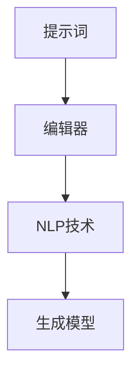
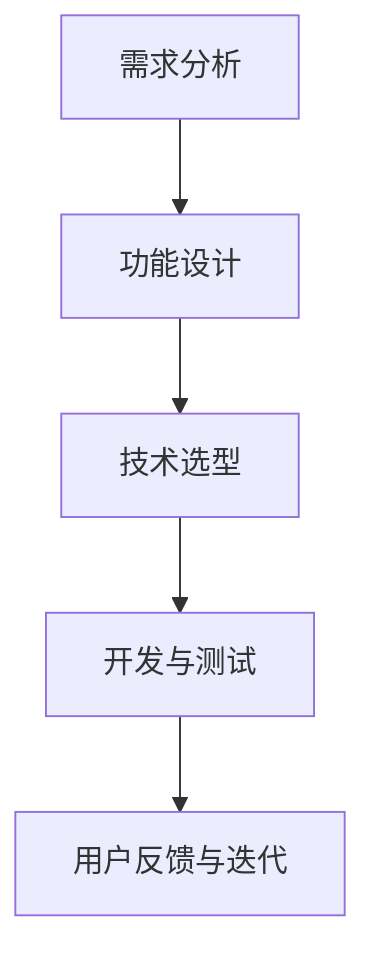

                 

### 文章标题

# 面向非专业人士的提示词编辑器设计

> 关键词：提示词编辑器、非专业人士、设计原则、算法原理、用户界面、开发实战

> 摘要：本文旨在向非专业人士介绍提示词编辑器的设计理念、核心算法原理以及实现过程。通过详细的步骤和实例，帮助读者理解并掌握提示词编辑器的构建方法，以便在实际应用中提升工作效率。

---

### 引言与基础知识

#### 背景介绍

提示词编辑器是一种专门用于生成和编辑提示词的工具。提示词是自然语言处理（NLP）领域中非常重要的组成部分，它们被广泛应用于搜索引擎、智能助手、问答系统等场景。随着人工智能技术的发展，提示词编辑器在提高语言理解和生成能力方面发挥着重要作用。

#### 核心概念与联系

为了更好地理解提示词编辑器的工作原理，我们需要明确几个核心概念：

- **提示词**：一种简短的文本，用于引导用户或系统理解特定内容。
- **编辑器**：一个用于创建、修改和格式化文本的软件工具。
- **自然语言处理（NLP）**：一种人工智能技术，旨在使计算机理解和处理人类语言。

这些概念之间的关系可以用以下Mermaid流程图来表示：



#### 核心算法原理讲解

提示词编辑器的核心算法主要涉及自然语言生成和编辑。以下是一个简单的伪代码，用于阐述生成提示词的基本过程：

```python
function generate_prompt(text):
    # 分析输入文本，提取关键词和主题
    keywords = extract_keywords(text)
    theme = extract_theme(text)

    # 根据关键词和主题生成提示词
    prompt = generate_text(keywords, theme)

    return prompt
```

此外，提示词编辑器还可能包含以下数学模型：

- **词频统计**：用于分析文本中的关键词频率，以便更好地理解文本内容。
- **词嵌入**：将文本中的每个词映射到一个高维空间，以便进行计算和比较。

以下是使用LaTeX格式的数学公式，用于描述词嵌入模型：

```latex
\begin{equation}
\vec{v}_{word} = W \cdot \vec{e}_{word}
\end{equation}
```

其中，\( \vec{v}_{word} \) 是词的向量表示，\( W \) 是词嵌入矩阵，\( \vec{e}_{word} \) 是词的独热编码。

### 设计流程与方法

设计一个面向非专业人士的提示词编辑器需要遵循以下步骤：

1. **需求分析**：明确目标用户的需求和期望功能。
2. **功能设计**：根据需求分析，确定编辑器的核心功能和界面设计。
3. **技术选型**：选择适合的算法和框架来实现功能。
4. **开发与测试**：编写代码，并进行测试和优化。

下面是设计流程的Mermaid流程图：



### 用户界面设计

用户界面设计是提示词编辑器的重要组成部分，需要确保其直观易用。以下是一些设计原则：

- **简洁性**：避免界面过于复杂，确保用户能够快速上手。
- **响应性**：确保界面在不同设备和分辨率下都能良好显示。
- **互动性**：提供实时反馈和提示，帮助用户更好地理解和使用编辑器。

### 系统实现

提示词编辑器的实现包括以下几个部分：

1. **前端开发**：使用HTML、CSS和JavaScript构建用户界面。
2. **后端开发**：使用Python、Java或其他后端技术实现核心算法和功能。
3. **数据库设计**：存储用户数据和编辑内容。

以下是前端和后端开发的一些示例代码：

**前端：HTML**

```html
<!DOCTYPE html>
<html>
<head>
    <title>提示词编辑器</title>
    <link rel="stylesheet" type="text/css" href="style.css">
</head>
<body>
    <div id="editor-container">
        <textarea id="input-text"></textarea>
        <button onclick="generatePrompt()">生成提示词</button>
        <div id="output-prompt"></div>
    </div>
    <script src="script.js"></script>
</body>
</html>
```

**前端：JavaScript**

```javascript
function generatePrompt() {
    const text = document.getElementById('input-text').value;
    const prompt = generatePromptFunction(text);
    document.getElementById('output-prompt').innerHTML = prompt;
}
```

**后端：Python**

```python
from flask import Flask, request, jsonify

app = Flask(__name__)

@app.route('/generate_prompt', methods=['POST'])
def generate_prompt():
    text = request.form['text']
    prompt = generate_prompt(text)
    return jsonify({'prompt': prompt})

if __name__ == '__main__':
    app.run(debug=True)
```

### 实际案例

以下是一个简单的提示词编辑器实现案例：

1. **开发环境搭建**：安装Python和Flask框架。
2. **源代码实现**：编写前端和后端代码。
3. **代码解读**：解释代码的功能和原理。
4. **应用解读与分析**：分析实际应用中的优势和不足。

#### 项目实战：简单的提示词编辑器

**步骤1：开发环境搭建**

首先，确保你的计算机上已安装Python 3.x版本。然后，通过以下命令安装Flask框架：

```bash
pip install Flask
```

**步骤2：源代码实现**

**前端代码（index.html）：**

```html
<!DOCTYPE html>
<html>
<head>
    <title>提示词编辑器</title>
    <style>
        body {
            font-family: Arial, sans-serif;
        }
        #editor-container {
            margin: 20px;
        }
        textarea {
            width: 100%;
            height: 100px;
        }
        button {
            margin-top: 10px;
        }
    </style>
</head>
<body>
    <div id="editor-container">
        <textarea id="input-text"></textarea>
        <button onclick="generatePrompt()">生成提示词</button>
        <div id="output-prompt"></div>
    </div>
    <script>
        function generatePrompt() {
            const text = document.getElementById('input-text').value;
            fetch('/generate_prompt', {
                method: 'POST',
                headers: {
                    'Content-Type': 'application/x-www-form-urlencoded',
                },
                body: 'text=' + text,
            })
            .then(response => response.json())
            .then(data => {
                document.getElementById('output-prompt').innerHTML = data.prompt;
            });
        }
    </script>
</body>
</html>
```

**后端代码（app.py）：**

```python
from flask import Flask, request, jsonify

app = Flask(__name__)

@app.route('/generate_prompt', methods=['POST'])
def generate_prompt():
    text = request.form['text']
    prompt = generate_prompt_function(text)
    return jsonify({'prompt': prompt})

def generate_prompt_function(text):
    # 简单的提示词生成算法
    keywords = text.split()
    prompt = " ".join(keywords[:5]) + "。"
    return prompt

if __name__ == '__main__':
    app.run(debug=True)
```

**步骤3：代码解读**

- **前端**：使用HTML构建用户界面，JavaScript实现交互功能。
- **后端**：使用Flask框架处理HTTP请求，并调用提示词生成函数。

**步骤4：应用解读与分析**

- **优势**：实现简单，便于理解。
- **不足**：提示词生成算法简单，实际应用中需要更复杂的算法来提高提示词的质量。

### 最佳实践 Tips

1. **用户反馈**：定期收集用户反馈，根据反馈进行迭代优化。
2. **性能优化**：对核心算法进行性能优化，提高系统响应速度。
3. **安全性**：确保系统安全，防止恶意攻击和数据泄露。

### 小结

本文介绍了面向非专业人士的提示词编辑器设计原理和实现方法。通过详细的步骤和实例，读者可以了解如何设计并实现一个简单的提示词编辑器。在实际应用中，可以根据需求进一步优化和扩展功能。

---

### 附录

#### 相关资源与工具

- **Flask框架**：Python Web开发框架，用于实现后端功能。
- **LaTeX格式**：用于书写数学公式和伪代码。
- **Mermaid流程图**：用于绘制流程图和架构图。

#### 参考文献

1. **Flask官方文档**：[https://flask.palletsprojects.com/](https://flask.palletsprojects.com/)
2. **LaTeX官方文档**：[https://www-latex.org/](https://www-latex.org/)
3. **Mermaid官方文档**：[https://mermaid-js.github.io/mermaid/](https://mermaid-js.github.io/mermaid/)

---

### 作者信息

作者：AI天才研究院/AI Genius Institute & 禅与计算机程序设计艺术 /Zen And The Art of Computer Programming

---

以上，感谢您的阅读！希望本文对您在提示词编辑器设计方面有所启发。如有任何疑问或建议，欢迎随时交流。

