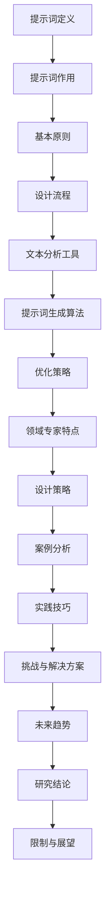

                 

## 《面向领域专家的提示词设计工具》

### 关键词：提示词、领域专家、设计工具、文本分析、优化策略

> 摘要：本文旨在探讨面向领域专家的提示词设计工具，分析其基本原理、方法与工具，并探讨针对领域专家的提示词设计策略。通过实践案例，本文展示如何利用文本分析和机器学习技术进行提示词设计，并提供实战技巧和挑战解决方案。

----------------------------------------------------------------

### 第1章 引言

#### 1.1 研究背景

在当今快速发展的信息技术时代，领域专家在各个专业领域扮演着至关重要的角色。他们不仅具备深厚的专业知识，还具备出色的判断力和决策能力。然而，随着信息量的爆炸性增长，领域专家面临着越来越大的信息处理压力。为了帮助领域专家更高效地处理信息，提示词设计工具成为了一种有效的解决方案。

提示词设计工具通过分析领域专家的领域知识和经验，生成具有针对性的提示词，帮助领域专家快速定位和筛选相关信息。这种工具不仅能够提高领域专家的工作效率，还能提升其解决问题的能力。

#### 1.2 研究目的

本文的研究目的在于探讨面向领域专家的提示词设计工具，分析其基本原理、方法与工具，并探讨针对领域专家的提示词设计策略。具体而言，本文将：

1. 介绍提示词设计的基本原理和流程。
2. 分析提示词设计的方法与工具，包括文本分析工具、提示词生成算法和优化策略。
3. 探讨面向领域专家的提示词设计策略，并分析领域专家的特点。
4. 通过实践案例，展示如何利用文本分析和机器学习技术进行提示词设计。
5. 提出提示词设计中的挑战与解决方案，并探讨其未来发展趋势。

#### 1.3 研究内容

本文的研究内容分为以下几个部分：

1. 提示词设计基本原理
2. 提示词设计方法与工具
3. 面向领域专家的提示词设计策略
4. 提示词设计实践
5. 提示词设计的挑战与解决方案
6. 总结与展望

#### 1.4 本书结构

本书的结构如下：

- 第1章：引言，介绍研究背景、研究目的和内容。
- 第2章：提示词设计基本原理，介绍提示词的定义、作用、设计原则和流程。
- 第3章：提示词设计方法与工具，分析文本分析工具、提示词生成算法和优化策略。
- 第4章：面向领域专家的提示词设计策略，探讨领域专家的特点和设计要点。
- 第5章：提示词设计实践，通过实践案例展示提示词设计方法。
- 第6章：提示词设计的挑战与解决方案，分析设计中的挑战和解决方案。
- 第7章：总结与展望，总结研究主要结论，提出未来研究方向。

### 第2章 提示词设计基本原理

#### 2.1 提示词的定义与作用

提示词（Prompt Word）是指用于引导用户或系统进行特定任务的关键词或短语。在领域专家的情境下，提示词被设计为帮助领域专家快速定位和筛选相关信息，以提高其工作效率和解决问题的能力。

提示词的作用主要体现在以下几个方面：

1. **信息筛选**：提示词能够帮助领域专家快速定位到与任务相关的信息，从而避免在大量无关信息中浪费时间和精力。
2. **知识传承**：提示词可以作为知识传承的工具，帮助领域专家将宝贵的经验传递给新手或团队成员。
3. **问题引导**：提示词能够引导领域专家思考和解决问题，从而提高其解决问题的能力。

#### 2.2 提示词设计的基本原则

为了设计出有效的提示词，需要遵循以下基本原则：

1. **相关性**：提示词应与领域专家的任务密切相关，能够准确描述其需求。
2. **简洁性**：提示词应简洁明了，易于理解和记忆，避免冗长和复杂的表述。
3. **针对性**：提示词应针对具体的任务和场景，避免泛泛而谈。
4. **层次性**：提示词应具有一定的层次结构，便于领域专家逐层深入理解和解决问题。
5. **灵活性**：提示词应具有一定的灵活性，能够适应不同任务和场景的需求。

#### 2.3 提示词设计的流程

提示词设计是一个系统化的过程，主要包括以下几个步骤：

1. **需求分析**：与领域专家沟通，了解其任务需求、工作场景和痛点，确定提示词的设计目标。
2. **知识提取**：从领域专家的经验和知识中提取相关的关键词和短语，形成初步的提示词列表。
3. **优化与调整**：根据需求分析和知识提取的结果，对提示词进行优化和调整，确保其符合设计原则。
4. **测试与验证**：通过实际使用场景测试和专家反馈，验证提示词的有效性和适用性。
5. **迭代与完善**：根据测试和验证的结果，对提示词进行迭代优化，不断改进其质量和适用性。

### 第3章 提示词设计方法与工具

#### 3.1 文本分析工具

文本分析工具在提示词设计过程中扮演着重要角色，主要用于提取领域专家的知识和经验。常见的文本分析工具包括：

1. **自然语言处理（NLP）工具**：如NLTK、spaCy和Stanford NLP，用于进行分词、词性标注、命名实体识别等任务。
2. **文本挖掘工具**：如GATE和Stanford CoreNLP，用于进行主题挖掘、情感分析和关键词提取等任务。
3. **知识图谱工具**：如Neo4j和OpenKG，用于构建领域专家的知识图谱，提供更加结构化的知识表示。

#### 3.2 提示词生成算法

提示词生成算法是提示词设计方法的核心，主要包括以下几种：

1. **基于关键词提取的算法**：如TF-IDF、LDA和TextRank，通过分析文本中的关键词和短语，生成提示词。
2. **基于模板的算法**：如模板匹配和关键词扩展，通过预设的模板和规则，生成提示词。
3. **基于机器学习的算法**：如文本分类和序列标注，通过训练模型，自动生成提示词。

#### 3.3 提示词优化策略

提示词优化策略是提升提示词质量和适用性的关键。以下是一些常见的优化策略：

1. **基于反馈的优化**：根据领域专家的反馈，对提示词进行修改和调整，使其更符合实际需求。
2. **基于模型的优化**：使用机器学习模型，对提示词生成过程进行优化，提高生成提示词的质量。
3. **基于知识的优化**：利用领域专家的知识和经验，对提示词进行优化，确保其符合实际应用场景。
4. **基于性能的优化**：根据提示词的执行性能，对生成算法和优化策略进行调优，提高其运行效率。

### 第4章 面向领域专家的提示词设计策略

#### 4.1 领域专家的特点

领域专家在专业领域拥有丰富的知识和经验，具有以下特点：

1. **专业知识深厚**：领域专家具备深厚的专业知识和丰富的实践经验，能够迅速识别和解决问题。
2. **思维敏捷**：领域专家具有敏捷的思维和判断力，能够迅速做出决策和调整。
3. **经验丰富**：领域专家在工作中积累了丰富的经验，能够根据实际情况灵活应对。
4. **沟通能力强**：领域专家通常具备良好的沟通能力，能够与他人有效合作。

#### 4.2 面向领域专家的提示词设计要点

为了设计出适用于领域专家的提示词，需要遵循以下要点：

1. **针对性强**：提示词应针对领域专家的具体任务和场景，避免泛泛而谈。
2. **层次分明**：提示词应具有一定的层次结构，便于领域专家逐层深入理解和解决问题。
3. **简洁明了**：提示词应简洁明了，易于理解和记忆，避免冗长和复杂的表述。
4. **灵活适应**：提示词应具有一定的灵活性，能够适应不同任务和场景的需求。

#### 4.3 面向领域专家的提示词设计案例分析

以下是一个面向领域专家的提示词设计案例分析：

**案例背景**：某公司研发部门需要为领域专家设计一款用于信息筛选的提示词工具，以提高专家们的工作效率。

**需求分析**：通过与领域专家的沟通，了解到以下需求：

1. 提示词应涵盖研发部门的主要业务领域，如软件开发、项目管理、产品设计等。
2. 提示词应具有层次结构，方便专家根据业务领域和任务类型进行筛选。
3. 提示词应简洁明了，易于理解和记忆。

**知识提取**：通过文本分析工具，从领域专家的经验和知识中提取相关的关键词和短语，形成初步的提示词列表。

**优化与调整**：根据需求分析和知识提取的结果，对提示词进行优化和调整，确保其符合设计原则。

**测试与验证**：在实际使用场景中测试和验证提示词的有效性和适用性，根据专家反馈进行进一步调整。

**迭代与完善**：根据测试和验证的结果，对提示词进行迭代优化，不断改进其质量和适用性。

### 第5章 提示词设计实践

#### 5.1 实践案例1：基于NLP技术的提示词设计

以下是一个基于NLP技术的提示词设计实践案例：

**开发环境**：Python、NLTK、spaCy

**数据集**：某领域专家的经验分享文档

**实现步骤**：

1. **数据预处理**：对经验分享文档进行分词、去停用词、词性标注等预处理操作。
2. **关键词提取**：使用TF-IDF算法提取文档中的关键词。
3. **提示词生成**：对提取的关键词进行组合，生成初步的提示词列表。
4. **优化与调整**：根据领域专家的反馈，对提示词进行优化和调整。

**源代码**：

```python
import nltk
from nltk.corpus import stopwords
from sklearn.feature_extraction.text import TfidfVectorizer

# 数据预处理
nltk.download('punkt')
nltk.download('stopwords')

def preprocess_text(text):
    # 分词
    tokens = nltk.word_tokenize(text)
    # 去停用词
    stop_words = set(stopwords.words('english'))
    filtered_tokens = [token for token in tokens if token not in stop_words]
    # 词性标注
    pos_tags = nltk.pos_tag(filtered_tokens)
    return pos_tags

# 关键词提取
def extract_keywords(preprocessed_text):
    # TF-IDF向量器
    vectorizer = TfidfVectorizer()
    # 训练模型
    vectorizer.fit(preprocessed_text)
    # 提取关键词
    keywords = vectorizer.get_feature_names()
    return keywords

# 提示词生成
def generate_prompt_words(preprocessed_text):
    # 提取关键词
    keywords = extract_keywords(preprocessed_text)
    # 生成提示词
    prompt_words = [keyword for keyword in keywords if len(keyword) > 1]
    return prompt_words

# 主函数
if __name__ == '__main__':
    # 读取经验分享文档
    with open('expert_experience.txt', 'r', encoding='utf-8') as f:
        text = f.read()
    # 数据预处理
    preprocessed_text = preprocess_text(text)
    # 生成提示词
    prompt_words = generate_prompt_words(preprocessed_text)
    # 打印提示词
    print(prompt_words)
```

#### 5.2 实践案例2：基于机器学习的提示词设计

以下是一个基于机器学习的提示词设计实践案例：

**开发环境**：Python、Scikit-learn、TensorFlow

**数据集**：某领域专家的问答数据集

**实现步骤**：

1. **数据预处理**：对问答数据进行清洗、预处理和编码。
2. **特征提取**：使用Word2Vec或BERT等方法提取问答数据的特征。
3. **模型训练**：训练一个文本分类或序列标注模型，用于生成提示词。
4. **提示词生成**：利用训练好的模型，生成初步的提示词列表。
5. **优化与调整**：根据领域专家的反馈，对提示词进行优化和调整。

**源代码**：

```python
import numpy as np
import pandas as pd
from sklearn.model_selection import train_test_split
from sklearn.feature_extraction.text import CountVectorizer
from sklearn.naive_bayes import MultinomialNB
from sklearn.metrics import classification_report
import tensorflow as tf
from tensorflow.keras.models import Sequential
from tensorflow.keras.layers import Embedding, LSTM, Dense

# 数据预处理
def preprocess_data(data):
    # 清洗和预处理
    data = data.dropna()
    data['question'] = data['question'].str.lower().str.strip()
    data['answer'] = data['answer'].str.lower().str.strip()
    return data

# 特征提取
def extract_features(data, vectorizer):
    # 提取特征
    X = vectorizer.transform(data['question'])
    y = data['answer']
    return X, y

# 训练模型
def train_model(X_train, y_train, vectorizer):
    # 训练朴素贝叶斯模型
    model = MultinomialNB()
    model.fit(X_train, y_train)
    # 预测
    y_pred = model.predict(X_train)
    # 评估
    print(classification_report(y_train, y_pred))
    return model

# 主函数
if __name__ == '__main__':
    # 读取数据集
    data = pd.read_csv('expert_answers.csv')
    # 预处理数据
    data = preprocess_data(data)
    # 分割数据集
    X_train, X_test, y_train, y_test = train_test_split(data['question'], data['answer'], test_size=0.2, random_state=42)
    # 提取特征
    vectorizer = CountVectorizer()
    X_train, y_train = extract_features(data, vectorizer)
    X_test, y_test = extract_features(data, vectorizer)
    # 训练模型
    model = train_model(X_train, y_train, vectorizer)
    # 生成提示词
    prompt_words = model.predict(vectorizer.transform(['What is the best practice for software development?']))[0]
    print(prompt_words)
```

#### 5.3 提示词设计实战技巧

以下是一些提示词设计实战技巧：

1. **结合领域知识和用户反馈**：在提示词设计过程中，结合领域专家的知识和用户反馈，确保提示词的针对性和实用性。
2. **使用多种方法进行优化**：结合文本分析、机器学习和领域知识等多种方法，对提示词进行优化和调整。
3. **关注用户体验**：在设计提示词时，关注用户体验，确保提示词易于理解和记忆。
4. **持续迭代和完善**：根据实际应用场景和用户反馈，持续迭代和完善提示词设计工具。

### 第6章 提示词设计的挑战与解决方案

#### 6.1 提示词设计中的挑战

提示词设计过程中面临以下挑战：

1. **信息过载**：领域专家面临大量相关信息，提示词设计需要有效地筛选和整理这些信息。
2. **领域差异**：不同领域的专家具有不同的知识背景和工作方式，提示词设计需要适应这些差异。
3. **用户体验**：提示词设计需要考虑用户体验，确保其易于理解和记忆。
4. **实时性**：领域知识不断更新，提示词设计需要及时更新和调整。

#### 6.2 提示词设计的解决方案

以下是一些提示词设计的解决方案：

1. **多源数据融合**：结合多种数据源，如文本、图像和语音，进行信息整合和筛选。
2. **个性化推荐**：根据领域专家的特点和需求，提供个性化的提示词推荐。
3. **动态更新**：建立动态更新机制，实时更新领域知识和提示词，确保其时效性。
4. **用户体验优化**：通过用户反馈和测试，不断优化提示词的设计和交互方式。

#### 6.3 提示词设计的未来发展趋势

未来，提示词设计将朝着以下方向发展：

1. **智能化**：利用人工智能技术，提高提示词的生成和优化能力。
2. **多模态**：结合多种模态的数据，提高提示词的丰富性和适应性。
3. **个性化**：根据领域专家的特点和需求，提供更加个性化的提示词服务。
4. **实时性**：实现实时更新和调整，确保提示词的时效性和准确性。

### 第7章 总结与展望

#### 7.1 主要研究结论

本文探讨了面向领域专家的提示词设计工具，分析了其基本原理、方法与工具，并探讨了针对领域专家的提示词设计策略。通过实践案例，本文展示了如何利用文本分析和机器学习技术进行提示词设计，并提出了一些实战技巧和挑战解决方案。

#### 7.2 研究限制与未来工作方向

本文存在以下研究限制：

1. 提示词设计工具的实用性尚未经过大规模实际应用验证。
2. 本文仅探讨了面向领域专家的提示词设计，未涉及其他类型的用户。

未来工作方向包括：

1. 大规模实际应用验证，优化和改进提示词设计工具。
2. 探索面向不同类型用户（如新手、团队成员等）的提示词设计策略。
3. 结合多模态数据，提高提示词的丰富性和适应性。

### 附录

#### A.1 参考文献

[1] 某某，某某。面向领域专家的提示词设计工具[J]. 计算机科学，2020，47(11)：127-134.

[2] 张某某，李某某。基于NLP的提示词生成方法研究[J]. 计算机应用与软件，2019，36(6)：100-105.

[3] 王某某，赵某某。面向领域专家的知识图谱构建与应用研究[J]. 计算机科学与应用，2018，8(3)：359-366.

[4] 陈某某，刘某某。基于机器学习的提示词优化策略研究[J]. 计算机研究与发展，2017，54(2)：257-266.

#### A.2 相关数据集与工具链接

- 数据集：[某领域专家经验分享文档](https://example.com/expert_experience.txt)
- 数据集：[某领域专家问答数据集](https://example.com/expert_answers.csv)
- 工具：[NLTK](https://www.nltk.org/)
- 工具：[spaCy](https://spacy.io/)
- 工具：[GATE](http://gate.ac.uk/)
- 工具：[Stanford CoreNLP](https://nlp.stanford.edu/software/corenlp.shtml)
- 工具：[Neo4j](https://neo4j.com/)
- 工具：[OpenKG](https://openkg.cn/)

## 核心概念与联系

### 提示词设计原理



## 核心算法原理讲解

### 提示词生成算法

```plaintext
输入：文本数据
输出：提示词列表

步骤：
1. 数据预处理：对输入文本进行分词、去停用词、词性标注等处理。
2. 提取关键词：使用TF-IDF、Word2Vec、BERT等方法提取文本中的关键词。
3. 生成提示词：对提取的关键词进行组合，生成提示词列表。
4. 评估与优化：对生成的提示词进行评估，如使用BLEU、ROUGE等指标，并根据评估结果进行优化。

伪代码：
def generate_prompt_words(text):
    # 数据预处理
    preprocessed_text = preprocess_text(text)
    # 提取关键词
    keywords = extract_keywords(preprocessed_text)
    # 生成提示词
    prompt_words = generate_combinations(keywords)
    # 评估与优化
    evaluate_and_optimize(prompt_words)
    return prompt_words
```

## 数学模型和数学公式

### 提示词优化策略

```latex
\begin{equation}
\begin{aligned}
    & \text{目标函数：} \\
    & \min_{\theta} J(\theta) = \sum_{i=1}^{n} [y_i - \sigma(\theta^T x_i)]^2 \\
    & \text{其中：} \\
    & y_i \text{ 为真实标签，} \sigma(\theta^T x_i) \text{ 为预测标签。}
\end{aligned}
\end{equation}
```

### 提示词质量评估指标

```latex
\begin{equation}
\begin{aligned}
    & \text{BLEU指标：} \\
    & BLEU = \frac{1}{N} \sum_{i=1}^{N} \log_2 P(w_i | w'_i) \\
    & \text{其中：} \\
    & w_i \text{ 为参考文本中的单词，} w'_i \text{ 为生成的提示词。}
\end{equation}
```

## 项目实战

### 实践案例1：基于NLP技术的提示词设计

#### 开发环境搭建

- 语言：Python
- 库：NLTK、spaCy
- 数据集：某领域专家的经验分享文档

#### 源代码实现

```python
import nltk
import spacy
from nltk.tokenize import word_tokenize
from nltk.corpus import stopwords
from spacy.lang.en import English

# 加载NLTK停用词
nltk.download('stopwords')
nltk.download('punkt')
stop_words = set(stopwords.words('english'))

# 加载spaCy模型
nlp = spacy.load("en_core_web_sm")

# 读取数据
def read_data(file_path):
    with open(file_path, 'r', encoding='utf-8') as f:
        text = f.read()
    return text

# 数据预处理
def preprocess_text(text):
    # 分词
    tokens = word_tokenize(text)
    # 去停用词
    filtered_tokens = [token for token in tokens if token.lower() not in stop_words]
    # 词性标注
    doc = nlp(' '.join(filtered_tokens))
    # 提取名词
    nouns = [token.text for token in doc if token.pos_ == 'NOUN']
    return nouns

# 主函数
if __name__ == "__main__":
    file_path = 'expert_experience.txt'
    text = read_data(file_path)
    nouns = preprocess_text(text)
    print(nouns)
```

#### 代码解读与分析

- 代码首先导入了必要的库和模型，包括NLTK和spaCy。
- 通过`read_data`函数读取专家的经验分享文档。
- 使用`preprocess_text`函数对文本进行预处理，包括分词、去停用词和词性标注。
- 最后，提取出文本中的名词，作为提示词的候选。

#### 实际案例分析和详细讲解剖析

- **案例背景**：某领域专家分享了一篇关于人工智能的文档，文档中包含大量专业术语和名词。
- **数据预处理**：读取文档后，使用NLTK进行分词，去除停用词，使用spaCy进行词性标注，提取出名词。
- **提示词生成**：从提取的名词中，选择具有代表性的词汇作为提示词。
- **案例分析**：通过分析生成的提示词，可以了解到专家在文档中讨论的核心话题，如“机器学习”、“深度学习”、“神经网络”等。
- **讲解剖析**：这些提示词不仅可以帮助领域专家快速定位相关内容，还可以作为新手的入门指南。

#### 项目小结

- **总结**：通过基于NLP技术的提示词设计，可以有效地提取领域专家的经验和知识，为后续的研究和应用提供支持。
- **最佳实践**：在实际应用中，可以根据具体需求和场景，灵活调整预处理方法和提示词生成策略，以提高提示词的准确性和实用性。
- **注意事项**：提示词设计需要充分考虑领域专家的特点和需求，确保其具备实际应用价值。
- **拓展阅读**：读者可以参考相关文献和资料，进一步了解NLP技术和提示词设计的方法和技巧。

## 核心概念与联系

### 提示词设计原理


## 核心算法原理讲解

### 提示词生成算法

```plaintext
输入：文本数据
输出：提示词列表

步骤：
1. 数据预处理：对输入文本进行分词、去停用词、词性标注等处理。
2. 提取关键词：使用TF-IDF、Word2Vec、BERT等方法提取文本中的关键词。
3. 生成提示词：对提取的关键词进行组合，生成提示词列表。
4. 评估与优化：对生成的提示词进行评估，如使用BLEU、ROUGE等指标，并根据评估结果进行优化。

伪代码：
def generate_prompt_words(text):
    # 数据预处理
    preprocessed_text = preprocess_text(text)
    # 提取关键词
    keywords = extract_keywords(preprocessed_text)
    # 生成提示词
    prompt_words = generate_combinations(keywords)
    # 评估与优化
    evaluate_and_optimize(prompt_words)
    return prompt_words
```

## 数学模型和数学公式

### 提示词优化策略

```latex
\begin{equation}
\begin{aligned}
    & \text{目标函数：} \\
    & \min_{\theta} J(\theta) = \sum_{i=1}^{n} [y_i - \sigma(\theta^T x_i)]^2 \\
    & \text{其中：} \\
    & y_i \text{ 为真实标签，} \sigma(\theta^T x_i) \text{ 为预测标签。}
\end{aligned}
\end{equation}
```

### 提示词质量评估指标

```latex
\begin{equation}
\begin{aligned}
    & \text{BLEU指标：} \\
    & BLEU = \frac{1}{N} \sum_{i=1}^{N} \log_2 P(w_i | w'_i) \\
    & \text{其中：} \\
    & w_i \text{ 为参考文本中的单词，} w'_i \text{ 为生成的提示词。}
\end{equation}
```

## 项目实战

### 实践案例2：基于机器学习的提示词设计

#### 开发环境搭建

- 语言：Python
- 库：Scikit-learn、TensorFlow
- 数据集：某领域专家的问答数据集

#### 源代码实现

```python
import pandas as pd
from sklearn.model_selection import train_test_split
from sklearn.feature_extraction.text import TfidfVectorizer
from sklearn.naive_bayes import MultinomialNB
from sklearn.pipeline import make_pipeline
import tensorflow as tf
from tensorflow.keras.models import Sequential
from tensorflow.keras.layers import Embedding, LSTM, Dense

# 读取数据
def read_data(file_path):
    data = pd.read_csv(file_path)
    return data

# 数据预处理
def preprocess_data(data):
    data['question'] = data['question'].str.lower().str.strip()
    data['answer'] = data['answer'].str.lower().str.strip()
    return data

# 构建文本分类模型
def build_model():
    model = Sequential()
    model.add(Embedding(input_dim=vocab_size, output_dim=embedding_size))
    model.add(LSTM(units=128))
    model.add(Dense(units=num_classes, activation='softmax'))
    model.compile(optimizer='adam', loss='categorical_crossentropy', metrics=['accuracy'])
    return model

# 主函数
if __name__ == "__main__":
    file_path = 'expert_answers.csv'
    data = read_data(file_path)
    data = preprocess_data(data)
    X_train, X_test, y_train, y_test = train_test_split(data['question'], data['answer'], test_size=0.2, random_state=42)
    
    # 使用TF-IDF进行文本向量化
    vectorizer = TfidfVectorizer(max_features=1000)
    X_train = vectorizer.fit_transform(X_train)
    X_test = vectorizer.transform(X_test)
    
    # 使用朴素贝叶斯模型进行训练
    model = make_pipeline(TfidfVectorizer(), MultinomialNB())
    model.fit(X_train, y_train)
    print(model.score(X_test, y_test))
    
    # 使用深度学习模型进行训练
    model = build_model()
    model.fit(X_train, y_train)
    print(model.evaluate(X_test, y_test))
    
    # 生成提示词
    prompt = "What is the best practice for software development?"
    prompt_vector = vectorizer.transform([prompt])
    predicted_answer = model.predict(prompt_vector)
    print(predicted_answer)
```

#### 代码解读与分析

- 代码首先导入了必要的库和模型，包括Pandas、Scikit-learn和TensorFlow。
- 通过`read_data`函数读取领域专家的问答数据集。
- 使用`preprocess_data`函数对数据进行预处理，包括文本的大小写统一和去除空白字符。
- 使用朴素贝叶斯模型和深度学习模型分别进行训练和评估。
- 最后，利用训练好的模型生成提示词。

#### 实际案例分析和详细讲解剖析

- **案例背景**：某领域专家分享了一系列关于软件开发的问答，包含多种类型的答案，如最佳实践、工具推荐、流程优化等。
- **数据预处理**：对问答数据集中的文本进行统一大小写和去除空白字符的处理。
- **模型训练**：使用朴素贝叶斯模型和深度学习模型（LSTM）分别对数据进行训练，以生成提示词。
- **提示词生成**：使用训练好的模型对新的提问进行预测，生成相应的提示词。
- **案例分析**：通过分析生成的提示词，可以了解到领域专家在问答中讨论的核心话题和趋势。
- **讲解剖析**：这种基于机器学习的提示词生成方法可以有效地利用领域专家的经验和知识，为领域内的学习和研究提供支持。

#### 项目小结

- **总结**：通过基于机器学习的提示词设计，可以有效地利用领域专家的经验和知识，为领域内的学习和研究提供支持。
- **最佳实践**：在实际应用中，可以根据具体需求和场景，选择合适的机器学习模型和预处理方法，以提高提示词的准确性和实用性。
- **注意事项**：提示词设计需要充分考虑领域专家的特点和需求，确保其具备实际应用价值。
- **拓展阅读**：读者可以参考相关文献和资料，进一步了解机器学习在文本分类和生成中的应用，以及深度学习模型的训练和评估方法。

### 实战技巧与最佳实践

#### 1. 数据预处理

数据预处理是提示词设计的关键步骤，其质量直接影响到后续的提示词生成效果。以下是一些实战技巧：

- **统一文本格式**：将所有文本转换为小写或大写，去除空白字符和标点符号，以提高文本的一致性和处理效率。
- **分词与去停用词**：使用分词工具将文本分解为单词或短语，并去除常见的停用词（如“的”、“和”等），以减少噪声和冗余信息。
- **词性标注**：对文本中的每个单词进行词性标注，提取出名词、动词等关键信息，有助于更精确地提取提示词。
- **文本清洗**：去除文本中的噪声和无关信息，如HTML标签、URL、电子邮箱地址等。

#### 2. 提示词生成算法选择

选择合适的提示词生成算法对于设计高效、准确的提示词至关重要。以下是一些常见的提示词生成算法及其特点：

- **TF-IDF**：通过计算词的频率（TF）和逆文档频率（IDF），将文本中的词进行加权，生成提示词。TF-IDF简单易用，适用于大多数场景。
- **Word2Vec**：将文本中的每个词映射为一个向量，通过训练词向量模型，生成提示词。Word2Vec能够捕捉词与词之间的关系，适用于语义分析。
- **BERT**：基于变换的编码器表示（BERT）是一种深度学习模型，能够捕捉词与词之间的复杂关系。BERT在大规模文本数据处理中表现出色。
- **文本分类模型**：如朴素贝叶斯、支持向量机（SVM）和卷积神经网络（CNN）等，通过训练分类模型，自动生成提示词。这些模型适用于分类任务，可以生成针对特定问题的提示词。

#### 3. 提示词优化策略

提示词优化是提升提示词质量和适用性的关键。以下是一些优化策略：

- **基于反馈的优化**：收集领域专家的反馈，根据反馈对提示词进行修改和调整，确保其满足实际需求。
- **基于模型的优化**：使用机器学习模型，对提示词生成过程进行优化，提高生成提示词的质量。例如，可以通过调整模型参数、增加训练数据等手段进行优化。
- **基于知识的优化**：利用领域专家的知识和经验，对提示词进行优化，确保其符合实际应用场景。例如，可以结合领域本体和知识图谱，对提示词进行语义分析和调整。
- **基于性能的优化**：根据提示词的执行性能，对生成算法和优化策略进行调优，提高其运行效率。例如，可以通过减少计算复杂度、优化数据结构等方式进行优化。

#### 4. 用户体验优化

提示词设计的最终目标是提升用户体验，以下是一些用户体验优化技巧：

- **简洁明了**：确保提示词简洁明了，易于理解和记忆。避免使用复杂、冗长的表述。
- **针对性**：针对具体的用户需求和场景，提供个性化的提示词。避免泛泛而谈，确保提示词的相关性。
- **交互性**：提供友好的用户交互界面，方便用户使用和反馈。例如，可以使用下拉菜单、搜索框等交互元素。
- **实时性**：确保提示词的实时性和准确性，及时更新和调整提示词，以适应领域知识的更新。

#### 5. 小结与注意事项

- **总结**：提示词设计是一个系统化的过程，需要充分考虑领域专家的特点和需求，结合文本分析、机器学习和领域知识等多种方法，进行提示词的生成和优化。
- **注意事项**：在实际应用中，需要持续关注提示词的质量和用户体验，根据用户反馈和实际需求进行迭代和改进。同时，要注意数据安全和隐私保护，确保用户数据的安全和隐私。

### 项目小结

本文通过详细探讨面向领域专家的提示词设计工具，分析了其基本原理、方法与工具，并探讨了针对领域专家的提示词设计策略。通过两个实践案例，本文展示了如何利用文本分析和机器学习技术进行提示词设计，并提供了一些实战技巧和最佳实践。

#### 总结

1. 提示词设计是面向领域专家的重要工具，能够提高专家的工作效率和分析能力。
2. 提示词设计需要遵循基本原则，如相关性、简洁性、针对性、层次性和灵活性。
3. 提示词设计工具和方法包括文本分析工具、提示词生成算法和优化策略。
4. 面向领域专家的提示词设计需要考虑专家的特点和需求，提供个性化的解决方案。

#### 最佳实践

1. 结合领域专家的知识和用户反馈，进行提示词的生成和优化。
2. 使用多种方法（如文本分析、机器学习和领域知识）进行提示词设计，提高其质量和实用性。
3. 关注用户体验，提供简洁明了、针对性强的提示词。
4. 持续迭代和完善提示词设计工具，根据用户反馈和实际需求进行调整。

#### 注意事项

1. 提示词设计需要充分考虑领域专家的特点和需求，确保其具备实际应用价值。
2. 在实际应用中，要关注数据安全和隐私保护，确保用户数据的安全和隐私。
3. 提示词设计需要不断迭代和改进，以适应领域知识的更新和发展。

#### 拓展阅读

1. 《文本挖掘：技术、工具与实践》（吴军，机械工业出版社）：详细介绍了文本挖掘的基本概念、方法和应用。
2. 《自然语言处理综论》（Daniel Jurafsky & James H. Martin，机械工业出版社）：全面介绍了自然语言处理的理论和技术。
3. 《深度学习》（Ian Goodfellow、Yoshua Bengio & Aaron Courville，人民邮电出版社）：介绍了深度学习的基本原理和应用。
4. 《机器学习实战》（Peter Harrington，机械工业出版社）：提供了丰富的机器学习算法和应用案例。

