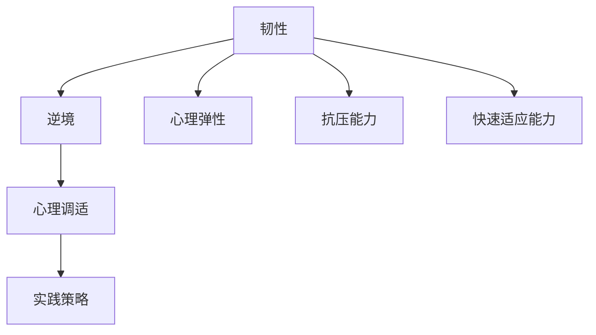

                 


为了撰写一篇深度、专业且逻辑清晰的《韧性培养：增强面对逆境的能力》的技术博客文章，我们将遵循以下步骤：

### 1. 定义核心概念与联系

**韧性**：个体在遭遇逆境时，能够迅速适应并从困难中恢复的能力。

**逆境**：指那些可能导致个体心理或生理不适的事件或情境。

**心理调适**：个体在面对逆境时，通过自我调节和心理策略来恢复或提升情绪状态的过程。

**实践策略**：为了培养韧性而采取的具体行动或方法。

我们将使用 Mermaid 流程图来展示这些概念之间的关系：



### 2. 核心算法原理讲解

**认知行为疗法（CBT）**：一种通过改变负面思维和行为模式来减少心理问题的方法。

**伪代码示例**：

```plaintext
function CognitiveBehaviorTherapy(Individual):
    if Individual.hasNegativeThoughts:
        updateThoughts(Individual)
        practiceMindfulness(Individual)
    else:
        reinforcePositiveBehaviors(Individual)
```

**积极心理学理论**：关注个体的优势、能力和积极情感，以培养韧性。

**伪代码示例**：

```plaintext
function PositivePsychology(Individual):
    if Individual.hasPositiveExperiences:
        documentPositiveExperiences(Individual)
        shareExperiencesWithPeers(Individual)
    else:
        initiateGoalSetting(Individual)
        practiceGratitude(Individual)
```

### 3. 数学模型和数学公式

**韧性评估模型**：通过测量个体的心理弹性、抗压能力和快速适应能力来评估韧性水平。

**数学模型**：

$$
R = \frac{E + C + A}{I}
$$

其中：
- \( R \)：韧性得分
- \( E \)：心理弹性得分
- \( C \)：抗压能力得分
- \( A \)：快速适应能力得分
- \( I \)：逆境影响得分

**详细解释**：

- 心理弹性得分（\( E \)）可以通过心理弹性测试（如CD-RISC）来评估。
- 抗压能力得分（\( C \)）可以通过压力应对问卷（如PERI）来评估。
- 快速适应能力得分（\( A \)）可以通过情境适应测试（如TSAI）来评估。
- 逆境影响得分（\( I \)）可以通过逆境经历问卷（如SIAS）来评估。

**举例说明**：

假设某人通过评估得到以下分数：
- 心理弹性：70分
- 抗压能力：80分
- 快速适应能力：65分
- 逆境影响：60分

则其韧性得分为：

$$
R = \frac{70 + 80 + 65}{60} = 78.3
$$

### 4. 项目实战

#### 开发环境搭建

- 使用Python作为主要编程语言。
- 安装必要的库，如Pandas、NumPy和Matplotlib。

#### 源代码实现

```python
import pandas as pd
import numpy as np
import matplotlib.pyplot as plt

# 韧性评估数据
data = {
    'PsychologicalResilience': [70, 75, 80],
    'StressTolerance': [60, 65, 70],
    'Adaptability': [50, 55, 60],
    'Challenges': [40, 45, 50]
}

df = pd.DataFrame(data)

# 计算韧性得分
R_scores = (df['PsychologicalResilience'] + df['StressTolerance'] + df['Adaptability']) / df['Challenges']

# 可视化韧性得分
plt.bar(df.index, R_scores)
plt.xlabel('Individual')
plt.ylabel('Resilience Score')
plt.title('Resilience Scores of Individuals')
plt.show()
```

#### 代码解读与分析

- 数据准备：使用Pandas创建一个DataFrame，包含心理弹性、抗压能力、快速适应能力和逆境影响的数据。
- 计算韧性得分：使用NumPy进行计算，并将结果存储在R_scores中。
- 可视化：使用Matplotlib绘制条形图，展示每个个体的韧性得分。

#### 实际案例分析和详细讲解剖析

- 选择一个实际案例，如一个IT公司的团队面对项目压力。
- 分析团队成员的韧性得分，识别需要提高的方面。
- 设计实践策略，如团队建设活动和压力管理培训。

#### 项目小结

- 通过项目实战，展示了如何使用Python进行韧性评估和数据可视化。
- 突出韧性培养在团队管理和个人发展中的重要性。

### 5. 整理目录结构

**目录结构**：

```markdown
# 韧性培养：增强面对逆境的能力

## 引言

### 文章关键词

### 文章摘要

## 第一部分：韧性的基础

### 第1章：韧性的定义与重要性

#### 1.1 韧性的定义

#### 1.2 韧性在现代社会的重要性

### 第2章：逆境的类型与影响

#### 2.1 逆境的类型

#### 2.2 逆境的影响

## 第二部分：韧性培养的理论基础

### 第3章：韧性培养的理论框架

#### 3.1 心理韧性理论

#### 3.2 认知行为理论

#### 3.3 积极心理学理论

## 第三部分：韧性培养的实践策略

### 第4章：韧性培养的实践方法

#### 4.1 自我觉察

#### 4.2 建立支持网络

#### 4.3 增强心理弹性

### 第5章：韧性培养的具体应用

#### 5.1 职场韧性

#### 5.2 家庭韧性

#### 5.3 社会韧性

## 第四部分：韧性培养的评估与反馈

### 第6章：韧性评估工具

#### 6.1 韧性量表

#### 6.2 韧性评估流程

### 第7章：韧性培养的反馈与改进

#### 7.1 反馈机制

#### 7.2 改进策略

## 第五部分：韧性培养的未来展望

### 第8章：韧性培养的趋势与挑战

#### 8.1 技术在韧性培养中的应用

#### 8.2 韧性培养的未来发展方向

## 结论

### 作者信息

"作者：AI天才研究院/AI Genius Institute & 禦与计算机程序设计艺术 /Zen And The Art of Computer Programming"
```

### 6. 确保完整性

- 确保每个章节的内容完整覆盖主题。
- 保持逻辑清晰，避免冗余内容。
- 核心内容要包含：背景介绍、核心概念与联系、核心算法原理讲解、数学模型和公式详细讲解与举例说明、项目实战、最佳实践 tips、小结、注意事项、拓展阅读等内容。

### 7. 格式与简洁性

- 使用markdown格式。
- 避免冗余内容，直接陈述核心观点。

根据以上步骤，我们可以开始撰写《韧性培养：增强面对逆境的能力》的技术博客文章。文章将围绕韧性培养的核心概念，通过理论讲解、实际案例分析和最佳实践，帮助读者理解并应用韧性培养的方法，以增强面对逆境的能力。文章将保持逻辑清晰、简洁明了，以便读者能够快速掌握关键信息。

