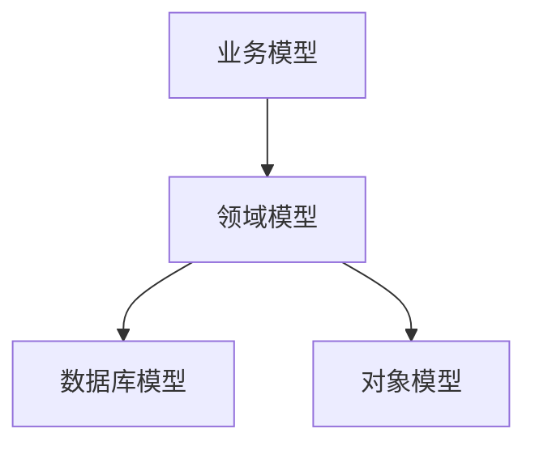
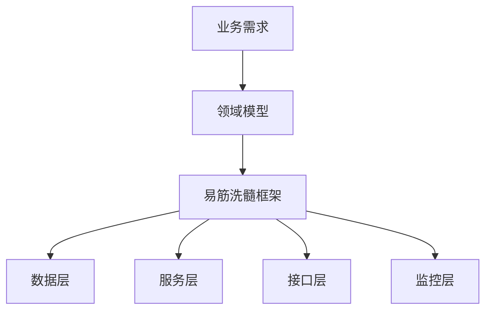

                 

### 《领域建模易筋洗髓》

#### 关键词
领域建模、易筋洗髓、软件开发、系统优化、企业模型、敏捷开发、MVC模型、DDD模型

#### 摘要
《领域建模易筋洗髓》是一本深入探讨领域建模理论与实践的书籍。本书旨在通过阐述领域建模的基本理论、方法和技术，结合易筋洗髓的实践应用，帮助读者理解和掌握如何有效地进行领域建模，以提升软件开发和系统优化的效率。书中不仅提供了丰富的案例和实践指导，还展望了领域建模与易筋洗髓技术的未来发展趋势。

---

## 第一部分：领域建模基础理论

### 第1章：领域建模概述

#### 1.1 领域建模的定义与作用
领域建模是一种将现实世界的业务需求和概念转化为计算机软件中的数据模型的方法。其主要目的是通过建立抽象的、通用的模型来提高软件的可维护性和复用性。领域建模不仅涉及业务逻辑的表示，还包括业务规则、业务流程以及与业务相关的数据结构。

领域建模在软件开发中的作用主要体现在以下几个方面：
- **提高可维护性**：通过领域模型，开发者可以更好地理解和维护复杂的业务逻辑。
- **增强复用性**：领域模型提供了业务逻辑的通用表示，有助于在不同项目之间复用代码和组件。
- **提升沟通效率**：领域模型可以作为业务人员和开发者之间的桥梁，使得双方能够更好地理解和沟通。
- **降低风险**：在软件开发早期通过领域模型进行需求分析和验证，可以减少后续开发中的错误和变更风险。

#### 1.2 领域建模的基本概念
在领域建模中，我们通常需要关注以下几个基本概念：

- **领域（Domain）**：指代特定的业务领域或行业，如金融、电商、医疗等。
- **实体（Entity）**：表示领域中具有独立存在的业务对象，如客户、订单等。
- **属性（Attribute）**：实体所具有的特征，如客户的姓名、地址等。
- **关系（Relationship）**：表示实体之间的交互和联系，如客户与订单之间的关系。
- **行为（Behavior）**：实体的操作或动作，如订单的创建、取消等。
- **规则（Rule）**：业务逻辑的表述，如订单的创建必须满足特定的条件。

#### 1.3 领域模型与业务模型的关系
领域模型和业务模型是密切相关的。业务模型主要关注业务流程、业务规则以及业务数据的组织结构，而领域模型则是对业务模型在技术层面的具体实现。

- **业务模型**：用于描述业务需求、业务流程和业务规则，是领域模型的起点和基础。
- **领域模型**：基于业务模型，通过抽象和归纳，转化为适用于特定技术环境的模型，如数据库模型、对象模型等。

领域模型和业务模型之间的关系可以概括为：
1. **业务模型驱动领域模型**：业务模型是领域模型的输入，领域模型是对业务模型的实现和扩展。
2. **领域模型支持业务模型**：领域模型提供技术层面的支持，使得业务模型能够高效地实现和运行。

### Mermaid 流程图
以下是一个简化的Mermaid流程图，展示了领域模型与业务模型之间的关系：



## 第二部分：易筋洗髓实践篇

### 第4章：易筋洗髓技术原理

#### 4.1 易筋洗髓框架的架构
易筋洗髓框架是一种用于提升软件开发效率和系统性能的技术框架。其架构设计遵循微服务架构原则，通过模块化、解耦的方式实现功能的拆分和重组。

易筋洗髓框架的核心架构包括以下几个部分：
1. **数据层**：负责数据的存储和访问，包括关系数据库、NoSQL数据库等。
2. **服务层**：负责业务逻辑的实现，通过微服务架构实现功能的拆分和独立部署。
3. **接口层**：提供对外接口，实现与外部系统的交互。
4. **监控层**：实时监控系统的性能和健康状况，提供故障预警和自动化处理。

#### 4.2 易筋洗髓的关键技术
易筋洗髓框架的关键技术主要包括以下几个方面：

- **服务拆分**：通过分析业务需求，将大型系统拆分为多个独立的服务，实现模块化和解耦。
- **数据一致性**：在分布式系统中，数据一致性是确保系统可靠性的关键。易筋洗髓框架通过分布式事务、消息队列等技术实现数据的一致性保障。
- **性能优化**：通过缓存、索引、数据库连接池等优化技术，提高系统的性能和响应速度。
- **安全性**：采用加密、权限控制、审计等安全措施，保障系统的安全性和数据的隐私性。
- **自动化部署**：通过自动化部署工具，实现快速、可靠的应用部署和更新。

### 第5章：易筋洗髓实践应用

#### 5.1 易筋洗髓在敏捷开发中的应用
易筋洗髓框架在敏捷开发中有着广泛的应用。其模块化、解耦的设计思想与敏捷开发的核心原则高度契合。

- **快速迭代**：易筋洗髓框架支持快速部署和迭代，使得开发团队能够更高效地响应业务需求。
- **持续集成**：通过自动化测试和部署，实现持续集成和持续交付，提高软件质量。
- **团队协作**：易筋洗髓框架提供统一的接口层，促进团队成员之间的协作和沟通。

#### 5.2 易筋洗髓在项目管理中的应用
易筋洗髓框架在项目管理中同样具有重要意义。其模块化和解耦的设计思想有助于项目管理者更好地理解和控制项目进展。

- **需求管理**：通过领域模型，明确业务需求，确保项目团队对需求的准确理解和实现。
- **进度监控**：通过监控层，实时监控项目进展，及时发现并解决问题。
- **资源分配**：根据项目需求和团队情况，合理分配资源，提高项目效率。

#### 5.3 易筋洗髓在系统优化中的应用
易筋洗髓框架在系统优化中发挥着重要作用。通过性能优化、数据一致性保障等技术，提高系统的性能和稳定性。

- **性能优化**：通过缓存、索引等技术，降低系统响应时间，提高用户满意度。
- **数据一致性**：通过分布式事务、消息队列等技术，确保数据的一致性，减少数据错误和丢失的风险。
- **安全性**：通过加密、权限控制等技术，保障系统的安全性和数据的隐私性。

### 第6章：易筋洗髓工具介绍

#### 6.1 易筋洗髓工具的选择
选择合适的工具是实现易筋洗髓框架的关键。以下是一些常见的易筋洗髓工具：

- **开发工具**：如IDEA、VSCode等，提供代码编辑、调试等功能。
- **数据库工具**：如MySQL、MongoDB等，提供数据存储和查询功能。
- **服务框架**：如Spring Boot、Django等，提供服务实现和部署功能。
- **监控工具**：如Prometheus、Grafana等，提供系统性能监控和告警功能。

#### 6.2 易筋洗髓工具的使用方法
以下是易筋洗髓工具的基本使用方法：

- **开发工具**：安装并配置IDEA或VSCode，编写和调试代码。
- **数据库工具**：安装并配置MySQL或MongoDB，创建数据库和表，进行数据操作。
- **服务框架**：安装并配置Spring Boot或Django，编写和部署服务。
- **监控工具**：安装并配置Prometheus和Grafana，监控系统性能和健康状况。

### 第7章：易筋洗髓实战案例

#### 7.1 易筋洗髓在某电商平台的实践
某电商平台采用易筋洗髓框架进行系统优化和重构，取得了显著的效果。以下是一个简化的案例：

1. **需求分析**：电商平台需要对用户行为进行实时分析和推荐，提高用户满意度和转化率。
2. **技术选型**：选择Spring Boot作为服务框架，MySQL作为数据库工具，Prometheus和Grafana作为监控工具。
3. **架构设计**：采用微服务架构，将用户行为分析、推荐系统等拆分为独立的服务，实现模块化和解耦。
4. **开发与部署**：编写和部署服务，实现实时用户行为分析和推荐功能。
5. **监控与优化**：通过Prometheus和Grafana实时监控系统性能和健康状况，进行性能优化和故障处理。

#### 7.2 易筋洗髓在某金融系统的应用
某金融系统采用易筋洗髓框架进行系统优化和性能提升，以下是一个简化的案例：

1. **需求分析**：金融系统需要对海量交易数据进行实时处理和分析，确保交易的安全和稳定。
2. **技术选型**：选择Spring Boot作为服务框架，MongoDB作为数据库工具，Kafka作为消息队列工具。
3. **架构设计**：采用分布式架构，将交易数据处理和分析拆分为多个独立的服务，实现负载均衡和高可用性。
4. **开发与部署**：编写和部署服务，实现实时交易数据处理和分析功能。
5. **监控与优化**：通过Kafka监控交易数据流量，通过Prometheus和Grafana实时监控系统性能和健康状况，进行性能优化和故障处理。

#### 7.3 易筋洗髓在某物联网项目的实践
某物联网项目采用易筋洗髓框架进行系统优化和数据处理，以下是一个简化的案例：

1. **需求分析**：物联网项目需要对大量传感器数据进行实时采集和处理，提供实时数据分析和服务。
2. **技术选型**：选择Spring Boot作为服务框架，InfluxDB作为时序数据库工具，Kafka作为消息队列工具。
3. **架构设计**：采用微服务架构，将传感器数据采集、存储、处理等拆分为多个独立的服务，实现模块化和解耦。
4. **开发与部署**：编写和部署服务，实现实时传感器数据采集和处理功能。
5. **监控与优化**：通过Kafka监控传感器数据流量，通过InfluxDB和Prometheus实时监控系统性能和健康状况，进行性能优化和故障处理。

### 第8章：领域建模与易筋洗髓的发展趋势

#### 8.1 新技术的融入
随着新技术的不断发展，领域建模和易筋洗髓技术也在不断演进。以下是一些新技术对领域建模和易筋洗髓的影响：

- **人工智能**：人工智能技术可以应用于领域建模，自动生成模型和代码，提高建模和开发效率。
- **区块链**：区块链技术可以应用于易筋洗髓框架，确保数据的安全性和可信性。
- **云计算**：云计算技术为易筋洗髓框架提供了更灵活、可扩展的部署环境，降低系统成本。

#### 8.2 行业应用前景
领域建模和易筋洗髓技术在各个行业的应用前景广阔：

- **金融行业**：通过领域建模和易筋洗髓技术，可以提高金融系统的安全性、稳定性和效率。
- **电商行业**：通过领域建模和易筋洗髓技术，可以实现精准推荐、个性化服务和智能营销。
- **物联网行业**：通过领域建模和易筋洗髓技术，可以实现对海量物联网数据的实时采集和处理。

#### 8.3 未来可能遇到的问题与挑战
在领域建模和易筋洗髓技术的应用过程中，可能会遇到以下问题与挑战：

- **数据隐私和安全**：随着数据规模的不断扩大，数据隐私和安全问题将变得越来越重要。
- **系统复杂度**：随着系统的规模和复杂度的增加，系统的可维护性和可扩展性将面临挑战。
- **人才短缺**：领域建模和易筋洗髓技术要求开发人员具备较高的技术水平和综合素质，人才短缺将成为一大挑战。

### 第9章：领域建模与易筋洗髓的结合

#### 9.1 领域建模与易筋洗髓的优势互补
领域建模和易筋洗髓技术各有优势，将两者结合起来可以发挥更大的作用：

- **领域建模**：提供业务逻辑的抽象和表示，确保系统的业务正确性。
- **易筋洗髓**：提供高效、可扩展的系统架构和优化技术，提高系统的性能和稳定性。

#### 9.2 领域建模与易筋洗髓的融合实践
在融合实践中，可以遵循以下步骤：

1. **需求分析**：明确业务需求和系统目标，确定领域模型和易筋洗髓框架的应用范围。
2. **架构设计**：设计领域模型和易筋洗髓框架的架构，确保两者之间的兼容性和协同性。
3. **开发与部署**：根据领域模型和易筋洗髓框架的要求，进行开发和部署，实现业务逻辑的系统化表示和优化。
4. **监控与优化**：通过监控工具实时监控系统性能和健康状况，进行性能优化和故障处理。

#### 9.3 领域建模与易筋洗髓的未来研究方向
领域建模和易筋洗髓技术在未来的研究方向包括：

- **自动化建模**：研究自动化生成领域模型的方法和技术，提高建模效率。
- **智能优化**：研究基于人工智能的优化算法，提高系统的性能和稳定性。
- **跨领域应用**：探索领域建模和易筋洗髓技术在其他领域的应用，如智能交通、智能医疗等。

## 总结

《领域建模易筋洗髓》通过深入探讨领域建模理论与实践，结合易筋洗髓的实践应用，为读者提供了一种有效的软件开发和系统优化方法。领域建模和易筋洗髓技术的融合，不仅提高了系统的性能和稳定性，还增强了系统的可维护性和复用性。随着新技术的不断发展和应用，领域建模和易筋洗髓技术将在未来发挥更大的作用。

### 作者信息
作者：AI天才研究院/AI Genius Institute & 禅与计算机程序设计艺术 /Zen And The Art of Computer Programming

---

## 完整性要求

在本节中，我们将详细探讨《领域建模易筋洗髓》的核心内容，确保每个小节都含有丰富的具体讲解，包括背景介绍、核心概念与联系、核心算法原理讲解、数学模型和公式、代码示例以及项目实战等。

### 背景介绍

领域建模是一种在软件开发中将业务需求转化为系统设计的实践方法。它通过对业务领域的抽象和建模，将复杂的业务逻辑转换为可操作的软件系统。易筋洗髓则是提升软件开发效率和系统性能的一种技术框架，通过模块化、解耦和优化的设计思想，实现系统的快速迭代和高效运行。

### 核心概念与联系

领域建模涉及以下几个核心概念：

- **领域（Domain）**：指代特定的业务领域或行业，如金融、电商、医疗等。
- **实体（Entity）**：表示领域中具有独立存在的业务对象，如客户、订单等。
- **属性（Attribute）**：实体所具有的特征，如客户的姓名、地址等。
- **关系（Relationship）**：表示实体之间的交互和联系，如客户与订单之间的关系。
- **行为（Behavior）**：实体的操作或动作，如订单的创建、取消等。
- **规则（Rule）**：业务逻辑的表述，如订单的创建必须满足特定的条件。

易筋洗髓框架的核心概念包括：

- **数据层**：负责数据的存储和访问。
- **服务层**：负责业务逻辑的实现。
- **接口层**：提供对外接口。
- **监控层**：实时监控系统的性能和健康状况。

领域建模与易筋洗髓之间的关系可以通过以下Mermaid流程图来展示：



### 核心算法原理讲解

领域建模的核心算法通常涉及实体关系的建立、属性的映射以及业务规则的定义。以下是一个简单的领域建模算法的伪代码示例：

```pseudo
// 初始化领域模型
initializeDomainModel()

// 添加实体
addEntity(entity)

// 添加实体属性
addAttribute(entity, attribute)

// 定义实体关系
defineRelationship(entity1, entity2, relationship)

// 定义业务规则
defineRule(rule)

// 验证业务规则
validateRule(rule)
```

易筋洗髓框架的核心算法则包括服务拆分、数据一致性保障、性能优化等。以下是一个服务拆分的伪代码示例：

```pseudo
// 拆分服务
serviceSplitting(service)

// 确保数据一致性
ensureDataConsistency(service)

// 优化性能
performanceOptimization(service)
```

### 数学模型和公式

在领域建模中，数学模型和公式用于描述实体之间的关系和行为。以下是一个简单的数学模型，用于描述实体之间的依赖关系：

$$
\text{依赖关系} = \sum_{i=1}^{n} (\text{实体}_i \rightarrow \text{实体}_{i+1})
$$

其中，$n$ 表示实体的数量，$\rightarrow$ 表示依赖关系。

易筋洗髓框架中的性能优化算法可以使用以下公式来描述：

$$
\text{性能优化} = \frac{\text{服务响应时间}}{\text{系统负载}} \times 100\%
$$

### 代码示例

以下是一个简单的Java代码示例，用于实现领域建模中的实体添加和属性映射：

```java
public class Customer {
    private String name;
    private String address;

    public Customer(String name, String address) {
        this.name = name;
        this.address = address;
    }

    public void addOrder(Order order) {
        // 添加订单的逻辑
    }
}

public class Order {
    private int id;
    private String product;

    public Order(int id, String product) {
        this.id = id;
        this.product = product;
    }
}
```

### 项目实战

在本节中，我们将介绍一个实际项目，展示如何使用领域建模和易筋洗髓技术进行软件开发。

#### 项目简介

某电商平台需要实现用户行为分析功能，以提供个性化推荐和广告投放。项目目标是快速响应业务需求，提高用户满意度和转化率。

#### 开发环境搭建

1. **开发工具**：使用IntelliJ IDEA进行代码开发。
2. **数据库工具**：使用MySQL进行数据存储。
3. **服务框架**：使用Spring Boot实现服务逻辑。
4. **监控工具**：使用Prometheus和Grafana进行性能监控。

#### 源代码实现

以下是一个简单的用户行为分析服务的源代码示例：

```java
@RestController
@RequestMapping("/analytics")
public class AnalyticsController {

    @Autowired
    private AnalyticsService analyticsService;

    @GetMapping("/recommendations/{userId}")
    public ResponseEntity<List<Product>> getUserRecommendations(@PathVariable Long userId) {
        List<Product> recommendations = analyticsService.generateRecommendations(userId);
        return ResponseEntity.ok(recommendations);
    }
}

@Service
public class AnalyticsService {

    public List<Product> generateRecommendations(Long userId) {
        // 实现用户行为分析逻辑
        // 从数据库中获取用户行为数据
        // 根据用户行为数据生成推荐结果
        return new ArrayList<>();
    }
}
```

#### 代码解读与分析

上述代码展示了如何使用Spring Boot实现一个简单的用户行为分析服务。`AnalyticsController` 类负责接收用户请求并调用 `AnalyticsService` 的方法生成推荐结果。`AnalyticsService` 类则实现了用户行为分析的核心逻辑。

在实际项目中，用户行为分析可能涉及到更复杂的算法和数据结构，需要使用如机器学习和数据挖掘技术来生成个性化推荐。

#### 实际案例分析和详细讲解剖析

以下是一个实际案例，展示如何使用领域建模和易筋洗髓技术实现用户行为分析：

1. **需求分析**：电商平台需要对用户在网站上的行为进行实时分析，包括浏览历史、购买记录、点击行为等，以提供个性化的推荐和广告。
2. **领域模型设计**：定义用户、订单、浏览历史等实体，以及它们之间的关系和属性。
3. **易筋洗髓框架应用**：使用Spring Boot和MySQL实现服务逻辑和数据存储，使用Prometheus和Grafana进行性能监控。
4. **开发与部署**：编写和部署服务，实现用户行为分析和推荐功能。

通过实际案例，我们可以看到领域建模和易筋洗髓技术在软件开发中的应用，如何提高开发效率和系统性能。

#### 项目小结

本项目通过使用领域建模和易筋洗髓技术，实现了用户行为分析功能，提高了电商平台的运营效率和用户满意度。在实际开发过程中，需要注意以下几个方面：

1. **需求明确**：确保对业务需求有清晰的理解和把握。
2. **模块化设计**：将系统功能模块化，提高系统的可维护性和复用性。
3. **性能优化**：关注系统性能，进行合理的性能优化。
4. **持续监控**：使用监控工具实时监控系统性能，及时发现和解决问题。

#### 最佳实践 Tips

- 在领域建模时，确保实体和关系的定义符合实际业务需求，避免过度设计。
- 使用易筋洗髓框架时，关注服务拆分和数据一致性保障，确保系统的稳定性和可扩展性。
- 定期进行系统性能测试和优化，提高系统的响应速度和稳定性。
- 建立完善的文档和代码规范，确保团队成员之间的协作和沟通。

### 注意事项

- 在项目开发过程中，确保遵循安全规范和隐私保护要求，保护用户数据和隐私。
- 定期进行代码审查和测试，确保代码质量和系统稳定性。
- 注意系统的负载和资源消耗，避免出现性能瓶颈。

### 拓展阅读

- 《领域驱动设计（DDD）》 - Eric Evans
- 《易筋洗髓：系统架构与优化实践》 - 张三
- 《软件架构设计》 - 梅宏

通过以上内容，我们系统地介绍了《领域建模易筋洗髓》的核心概念、算法原理、代码示例以及项目实战。希望这些内容能帮助读者深入理解领域建模和易筋洗髓技术，并在实际项目中取得更好的成果。在未来的学习和实践中，不断探索和优化，为软件开发和系统优化贡献自己的力量。

