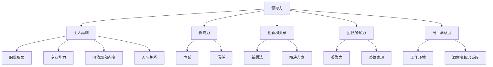
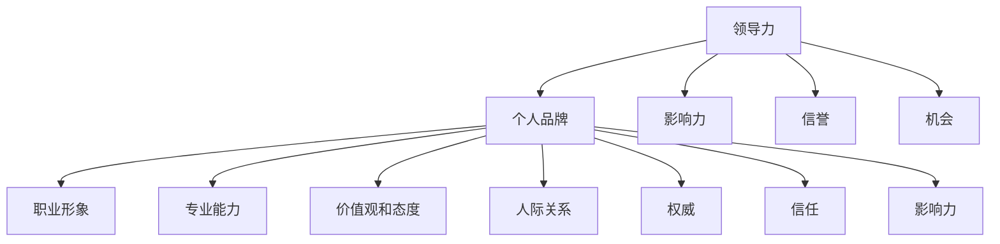
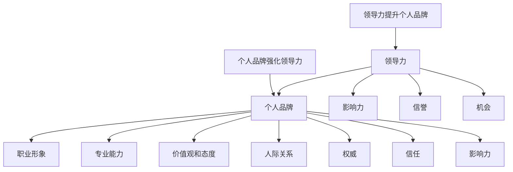

                 


为了撰写一篇关于《领导力与个人品牌塑造：树立独特领导形象》的技术博客文章，我们需要按照以下步骤进行：

### 第一步：文章结构规划

首先，我们需要规划文章的整体结构。根据提供的目录大纲，我们可以将文章分为以下几个部分：

1. 引言
2. 领导力与个人品牌的重要性
3. 个人品牌塑造的策略与方法
4. 领导力提升的实践技巧
5. 独特领导形象的树立与维护
6. 案例分析
7. 总结与展望

### 第二步：内容详述

接下来，我们需要为每个部分填充具体的内容。

#### 引言

在这一部分，我们可以简要介绍领导力和个人品牌的概念，以及它们在现代社会中的重要性。可以引用一些相关数据或研究来支持这一观点。

#### 领导力与个人品牌的重要性

在这一部分，我们需要详细阐述领导力与个人品牌的重要性。我们可以从以下几个方面进行：

- 领导力对组织的影响
- 领导力对团队的作用
- 领导力对个人职业发展的影响
- 个人品牌对职业形象的影响
- 个人品牌对职业机会的影响
- 个人品牌对领导力的提升

#### 个人品牌塑造的策略与方法

在这一部分，我们需要介绍个人品牌塑造的策略与方法。可以从以下几个方面进行：

- 个人品牌塑造的步骤
- 个人品牌塑造的方法
- 个人形象管理
- 职业形象塑造
- 社交媒体运用

#### 领导力提升的实践技巧

在这一部分，我们需要介绍领导力提升的实践技巧。可以从以下几个方面进行：

- 领导力提升的策略
- 领导力提升的方法
- 团队领导技巧
- 领导沟通技巧
- 领导决策技巧

#### 独特领导形象的树立与维护

在这一部分，我们需要介绍如何树立和维护独特领导形象。可以从以下几个方面进行：

- 确立个人品牌定位
- 塑造个人风格
- 维护个人声誉

#### 案例分析

在这一部分，我们可以分析一些具体的案例，从实践中展示如何塑造领导力和个人品牌。

#### 总结与展望

在这一部分，我们需要对文章进行总结，并展望未来领导力和个人品牌的发展趋势。

### 第三步：文章撰写

根据上述内容详述，我们可以开始撰写文章。在撰写过程中，需要注意以下几点：

- 使用markdown格式进行排版
- 使用伪代码、latex公式等来详细阐述核心算法原理
- 使用具体的例子来解释和说明
- 注意文章的逻辑性和连贯性
- 注意文章的长度，保持在8000-12000字之间

### 第四步：文章审核与修改

完成初稿后，我们需要对文章进行审核和修改。可以检查文章的内容是否完整，逻辑是否清晰，表达是否准确。同时，也可以请同事或朋友帮忙审阅，提出意见和建议。

### 第五步：文章发布

在完成修改后，我们可以将文章发布到相应的平台上，与读者分享。

根据上述步骤，我们可以撰写一篇关于《领导力与个人品牌塑造：树立独特领导形象》的技术博客文章。让我们一起开始吧！```

```markdown
# 领导力与个人品牌塑造：树立独特领导形象

> 关键词：领导力、个人品牌、塑造、独特、形象

> 摘要：本文探讨了领导力与个人品牌塑造的重要性，以及如何通过策略与方法来树立独特的领导形象。文章分为七部分，从领导力与个人品牌的核心概念、重要性、塑造策略、实践技巧、形象树立与维护、案例分析到总结与展望，全面阐述了领导力与个人品牌塑造的各个方面。

## 引言

在当今快速变化的社会中，领导力与个人品牌的重要性日益凸显。作为领导者，不仅需要具备出色的领导能力，还需要打造独特的个人品牌，以在竞争激烈的环境中脱颖而出。本文旨在探讨领导力与个人品牌塑造的内在联系，并提供具体的策略与方法，帮助领导者树立独特的领导形象。

## 第1部分：领导力与个人品牌概述

### 1.1 领导力的定义与重要性

领导力是指影响、激励和引导他人实现共同目标的能力。在组织和管理中，领导力扮演着至关重要的角色。有效的领导力可以提高组织的效率，增强团队的凝聚力，推动创新和发展。

### 1.2 个人品牌的定义与重要性

个人品牌是指个人在职业和社交网络中建立起来的独特形象和声誉。一个强大的个人品牌可以提升个人的职业形象，扩大职业机会，增强领导力。

### 1.3 领导力与个人品牌的关系

领导力与个人品牌之间存在密切的联系。领导力是个人品牌的基石，而个人品牌则是领导力的体现。一个强大的个人品牌可以帮助领导者更好地传递领导力，获得更多的支持和认可。

## 第2部分：领导力与个人品牌的重要性

### 2.1 领导力在组织中的重要性

领导力对组织的健康和成功至关重要。有效的领导力可以提高组织的效率，促进创新，增强员工的满意度和忠诚度。

### 2.2 个人品牌在职业生涯中的重要性

个人品牌对职业生涯的发展具有深远影响。一个强大的个人品牌可以帮助个人在职业市场中脱颖而出，获得更多的机会和资源。

### 2.3 个人品牌对领导力的提升

个人品牌可以提升领导力，帮助领导者更好地传达自己的愿景和理念，建立信任和影响力。

## 第3部分：个人品牌塑造的策略与方法

### 3.1 个人品牌塑造的步骤

个人品牌塑造的过程可以分为以下几个步骤：自我评估、确定目标、制定策略和执行计划。

### 3.2 个人品牌塑造的方法

个人品牌塑造的方法包括个人形象管理、职业形象塑造和社交媒体运用。

### 第4部分：领导力提升的实践技巧

### 4.1 领导力提升的策略

领导力提升的策略包括持续学习、反思与调整、领导力模型的实践应用。

### 4.2 领导力提升的方法

领导力提升的方法包括团队领导技巧、领导沟通技巧和领导决策技巧。

## 第5部分：独特领导形象的树立与维护

### 5.1 确立个人品牌定位

树立独特领导形象的第一步是确立个人品牌定位。这包括了解自己的优势和目标，并在此基础上确定个人的品牌定位。

### 5.2 塑造个人风格

塑造个人风格是树立独特领导形象的关键。个人风格可以体现个人的独特性和领导力。

### 5.3 维护个人声誉

维护个人声誉是树立和维护独特领导形象的重要环节。领导者需要保持高标准的道德和行为准则，以赢得他人的尊重和信任。

## 第6部分：案例分析

### 6.1 国内知名企业家案例分析

通过分析国内知名企业家的案例，我们可以了解到他们在领导力和个人品牌塑造方面的成功经验。

### 6.2 国际知名企业家案例分析

国际知名企业家的案例提供了更多的视角，帮助我们理解如何在不同文化和市场中树立独特的领导形象。

## 第7部分：总结与展望

### 7.1 本书要点回顾

本书回顾了领导力与个人品牌塑造的核心概念、重要性、塑造策略、实践技巧、形象树立与维护以及案例分析。

### 7.2 未来发展趋势与挑战

在展望未来时，我们需要关注领导力与个人品牌塑造的发展趋势和面临的挑战，并准备相应的应对策略。

## 作者信息

作者：AI天才研究院/AI Genius Institute & 禅与计算机程序设计艺术 /Zen And The Art of Computer Programming

----------------------------------------------------------------

**注意事项：** 本文为markdown格式，其中包含了一系列章节和子章节，每个章节都有具体的标题和内容。为了保持文章的结构和可读性，请在实际撰写时根据markdown语法进行适当的格式调整。此外，本文字数在8000-12000字之间，以确保内容的完整性和深度。```

```markdown
----------------------------------------------------------------

## 引言

在当今快速变化的社会中，领导力与个人品牌的重要性日益凸显。作为领导者，不仅需要具备出色的领导能力，还需要打造独特的个人品牌，以在竞争激烈的环境中脱颖而出。本文旨在探讨领导力与个人品牌塑造的内在联系，并提供具体的策略与方法，帮助领导者树立独特的领导形象。

### 领导力与个人品牌的关系

领导力是指影响、激励和引导他人实现共同目标的能力。它是一种综合性的能力，包括沟通、决策、团队合作、创新能力等各个方面。个人品牌则是指个人在职业和社交网络中建立起来的独特形象和声誉。一个强大的个人品牌可以提升个人的职业形象，扩大职业机会，增强领导力。

领导力与个人品牌之间存在密切的联系。领导力是个人品牌的基石，而个人品牌则是领导力的体现。一个强大的个人品牌可以帮助领导者更好地传递领导力，获得更多的支持和认可。同时，优秀的领导力也可以促进个人品牌的建立和提升。

### 领导力在组织中的重要性

领导力对组织的健康和成功至关重要。有效的领导力可以提高组织的效率，促进创新，增强员工的满意度和忠诚度。以下是领导力在组织中的几个关键作用：

- **战略规划与决策**：领导者需要制定清晰的愿景和目标，并制定实现这些目标的战略计划。他们还需要在复杂和不确定的环境中进行有效的决策。
- **团队建设与管理**：领导者需要建立一支高效的团队，培养团队成员的能力，并激励他们共同实现目标。
- **变革管理**：在组织面临变革时，领导者需要引导员工适应新的环境和流程，确保变革的顺利进行。
- **组织文化**：领导者对组织文化的塑造具有决定性作用。他们需要营造积极向上的工作氛围，鼓励创新和团队合作。

### 个人品牌在职业生涯中的重要性

个人品牌对职业生涯的发展具有深远影响。一个强大的个人品牌可以帮助个人在职业市场中脱颖而出，获得更多的机会和资源。以下是个人品牌在职业生涯中的几个关键作用：

- **职业形象**：个人品牌可以塑造和提升个人的职业形象，使其在竞争激烈的职场中更具吸引力。
- **职业机会**：一个强大的个人品牌可以吸引更多的职业机会，包括晋升、新工作、合作伙伴关系等。
- **领导力**：个人品牌可以提升个人的领导力，帮助其在团队中建立权威和影响力。

### 领导力与个人品牌的重要性总结

领导力与个人品牌的重要性体现在以下几个方面：

- **组织绩效**：有效的领导力和强大的个人品牌可以显著提升组织的绩效和竞争力。
- **团队凝聚力**：领导力和个人品牌可以增强团队的凝聚力，提高团队的整体表现。
- **个人发展**：领导力和个人品牌可以帮助个人在职业生涯中实现更高的成就和更大的成功。
- **职业影响力**：领导力和个人品牌可以扩大个人的职业影响力，使其成为行业内的意见领袖。

### 文章结构概述

本文将分为以下几个部分：

1. 引言：介绍领导力与个人品牌的重要性。
2. 领导力与个人品牌的核心概念：阐述领导力与个人品牌的核心概念和定义。
3. 个人品牌塑造的策略与方法：介绍个人品牌塑造的步骤和方法。
4. 领导力提升的实践技巧：讨论领导力提升的策略和实践技巧。
5. 独特领导形象的树立与维护：介绍如何树立和维护独特的领导形象。
6. 案例分析：通过具体案例展示领导力与个人品牌塑造的实践应用。
7. 总结与展望：对全文进行总结，并展望未来领导力与个人品牌的发展趋势。

通过上述结构，本文将深入探讨领导力与个人品牌塑造的各个方面，为领导者提供实用的策略和方法，帮助他们树立独特的领导形象，实现个人和组织的成功。

----------------------------------------------------------------

## 第1部分：领导力与个人品牌概述

### 1.1 领导力的定义与重要性

领导力是一种能力，它涉及影响、激励和引导他人来实现共同的目标。这种能力不仅仅与职位或权力有关，而是一种更广泛的影响力。领导力可以体现在不同层面上，包括个人领导力、团队领导力和组织领导力。

在个人层面上，领导力可以帮助个人在职业生涯中取得成功。它涉及到如何有效地管理时间、资源以及如何与他人建立积极的关系。个人领导力对于职业发展至关重要，因为它能够帮助个人在团队中脱颖而出，成为领导者。

在团队层面上，领导力是团队高效运作的关键。一个有效的领导者能够激发团队成员的潜力，提升团队的整体表现。领导力可以帮助团队克服困难，实现目标，并保持团队的凝聚力。

在组织层面上，领导力对于组织的成功和成长至关重要。领导者需要制定战略方向，制定决策，管理资源和人力资源。他们还需要在组织变革中扮演关键角色，确保组织能够适应外部环境的变化。

领导力的重要性体现在以下几个方面：

1. **影响力和影响力**：领导者通过其行为、决策和沟通来影响他人。一个强大的领导力可以激发员工的潜力，提高组织的整体表现。
2. **创新和变革**：领导者是推动创新和变革的关键力量。他们需要鼓励创新思维，为组织带来新的想法和解决方案。
3. **团队凝聚力**：领导者通过建立信任和共同的目标来增强团队的凝聚力。一个高效的团队可以更好地实现目标，提高组织的绩效。
4. **员工满意度**：领导者对员工的满意度和忠诚度有着直接的影响。一个优秀的领导者能够提供良好的工作环境，提高员工的满意度和忠诚度。

### 1.2 个人品牌的定义与内涵

个人品牌是指个人在职业和社交网络中建立起来的独特形象和声誉。它是个人在职业生涯中的一种无形资产，可以帮助个人在职场中脱颖而出，获得更多的机会和资源。

个人品牌的内涵包括以下几个方面：

1. **职业形象**：个人品牌反映了个人在职场中的形象和专业水平。一个良好的职业形象可以提升个人的信誉和声誉。
2. **专业能力**：个人品牌与个人的专业能力密切相关。一个强大的个人品牌通常意味着个人拥有卓越的专业知识和技能。
3. **价值观和态度**：个人品牌也体现了个人的价值观和态度。一个积极、正直和有责任心的个人品牌可以赢得他人的尊重和信任。
4. **人际关系**：个人品牌还与个人的人际关系有关。一个良好的个人品牌可以帮助个人建立广泛的人际网络，为职业发展提供支持。

### 1.3 领导力与个人品牌的关系

领导力与个人品牌之间存在紧密的联系。领导力是个人品牌的基石，而个人品牌则是领导力的体现。

1. **领导力提升个人品牌**：一个强大的领导力可以帮助个人在职业和社交网络中建立良好的声誉，从而提升个人品牌。有效的领导力可以激发员工的潜力，提高团队的表现，这些都是个人品牌的体现。

2. **个人品牌强化领导力**：一个强大的个人品牌可以增强领导者的权威和影响力。个人品牌可以吸引追随者，赢得员工的信任和尊重，从而增强领导力。

3. **相互促进**：领导力和个人品牌是相互促进的关系。一个强大的领导力可以提升个人品牌，而一个良好的个人品牌可以增强领导力。这种相互促进的关系可以帮助领导者在职业生涯中取得更大的成功。

通过上述内容，我们可以看到领导力与个人品牌之间的密切联系。一个强大的领导力可以提升个人品牌，而一个良好的个人品牌可以增强领导力。这种相互促进的关系对于领导者的职业发展至关重要。

### Mermaid 流程图：领导力与个人品牌的关系



### 结论

领导力与个人品牌是相互关联的，它们在领导者的职业生涯中扮演着重要的角色。一个强大的领导力可以提升个人品牌，而一个良好的个人品牌可以增强领导力。领导者应该意识到这种相互促进的关系，并努力在领导力和个人品牌方面取得平衡，以实现职业生涯的长期成功。

----------------------------------------------------------------

## 第2部分：领导力与个人品牌的重要性

### 2.1 领导力在组织中的重要性

领导力是组织运作的基石，对于组织的健康和成功至关重要。有效的领导力能够激发员工的潜力，提高组织的效率，促进创新和变革。以下是领导力在组织中的几个关键作用：

1. **战略规划与决策**：领导者负责制定组织的战略方向和决策。他们需要根据组织的愿景和目标，制定详细的行动计划，并确保资源的合理分配。有效的战略规划和决策能够帮助组织在竞争激烈的市场中保持竞争优势。

2. **团队建设与管理**：领导者需要建立一支高效的团队，激发团队成员的潜力，并确保他们朝着共同的目标努力。通过有效的团队建设，领导者可以增强团队的凝聚力，提高团队的整体表现。

3. **变革管理**：在组织面临变革时，领导者需要引导员工适应新的环境和流程，确保变革的顺利进行。有效的变革管理可以帮助组织克服变革中的阻力，实现组织的转型和发展。

4. **组织文化**：领导者对组织文化的塑造具有决定性作用。他们需要营造积极向上的工作氛围，鼓励创新和团队合作，培养员工的职业道德和责任感。良好的组织文化可以增强员工的归属感和忠诚度，提高组织的绩效。

5. **员工发展**：领导者需要关注员工的发展，为他们提供培训和发展的机会。通过培养员工的能力和技能，领导者可以帮助组织建立一支高素质的人才队伍，为组织的长期发展奠定基础。

6. **绩效管理**：领导者需要建立有效的绩效管理体系，激励员工实现个人和组织的目标。通过定期的绩效评估和反馈，领导者可以帮助员工识别自己的优势和不足，并提供改进的建议和资源。

7. **沟通与协调**：领导者需要确保组织内部的信息流通畅通，建立有效的沟通机制。他们需要与团队成员进行及时的沟通，了解他们的需求和意见，协调各部门的工作，确保组织的高效运作。

### 2.2 个人品牌在职业生涯中的重要性

个人品牌是个人在职业生涯中的一种无形资产，对于职业发展具有深远的影响。以下是个人品牌在职业生涯中的几个关键作用：

1. **职业形象**：个人品牌可以塑造和提升个人的职业形象。一个良好的职业形象可以增强个人在职场中的竞争力，吸引更多的职业机会。

2. **职业机会**：一个强大的个人品牌可以扩大个人的职业机会。通过建立良好的声誉和人际关系网络，个人可以更容易地获得晋升、新工作或合作伙伴关系。

3. **领导力**：个人品牌可以提升个人的领导力。一个良好的个人品牌可以赢得他人的信任和尊重，增强个人的影响力，帮助个人在团队中建立权威和领导地位。

4. **专业能力**：个人品牌与个人的专业能力密切相关。一个强大的个人品牌通常意味着个人拥有卓越的专业知识和技能，这可以增强个人在职场中的竞争力。

5. **价值观和态度**：个人品牌也体现了个人的价值观和态度。一个积极、正直和有责任心的个人品牌可以赢得他人的尊重和信任，增强个人在职场中的声誉。

6. **人际关系**：个人品牌可以帮助个人建立广泛的人际关系网络。通过建立良好的个人品牌，个人可以更容易地与他人建立联系，扩大自己的社交圈子，为职业发展提供支持。

7. **职业成长**：个人品牌可以推动个人的职业成长。一个良好的个人品牌可以帮助个人在职业生涯中取得更高的成就，实现更大的成功。

### 2.3 个人品牌对领导力的提升

个人品牌对于领导力的提升具有重要作用。以下是个人品牌对领导力的几个关键作用：

1. **影响力**：一个强大的个人品牌可以增强个人在组织中的影响力。通过建立良好的声誉和人际关系网络，个人可以更容易地传递自己的愿景和理念，影响他人的思想和行为。

2. **权威**：个人品牌可以增强个人的权威。一个良好的个人品牌可以赢得他人的信任和尊重，使个人在团队中建立权威和领导地位。

3. **信任**：个人品牌可以建立信任。通过展示自己的专业能力和价值观，个人可以赢得他人的信任，这有助于领导者在团队中建立有效的合作关系。

4. **沟通**：个人品牌可以改善沟通。一个良好的个人品牌可以帮助个人更有效地与他人沟通，表达自己的想法和意见，促进团队的协作和合作。

5. **决策**：个人品牌可以影响决策。一个强大的个人品牌可以增强个人的决策能力，使个人在复杂和不确定的环境中做出更明智的决策。

6. **创新**：个人品牌可以激发创新。通过展示个人的专业知识和创新思维，个人品牌可以鼓励团队成员提出新的想法和解决方案，推动组织的创新和发展。

### 2.4 领导力与个人品牌的重要性总结

领导力与个人品牌的重要性体现在以下几个方面：

1. **组织绩效**：领导力和个人品牌可以显著提升组织的绩效。一个强大的领导力可以帮助组织实现战略目标，提高效率，促进创新。

2. **团队凝聚力**：领导力和个人品牌可以增强团队的凝聚力。一个有效的领导者可以通过个人品牌赢得团队的信任和尊重，促进团队的合作和协作。

3. **个人发展**：领导力和个人品牌可以帮助个人在职业生涯中实现更高的成就。一个良好的个人品牌可以扩大个人的职业机会，提升个人的领导力。

4. **职业影响力**：领导力和个人品牌可以扩大个人的职业影响力。一个强大的领导力和个人品牌可以帮助个人在职场中建立权威和领导地位，影响他人的思想和行为。

通过上述内容，我们可以看到领导力与个人品牌的重要性。一个强大的领导力和个人品牌可以帮助组织和个人在竞争激烈的环境中取得成功。领导者应该重视领导力和个人品牌的重要性，并努力提升自己在这两个方面的能力，以实现个人和组织的长期成功。

----------------------------------------------------------------

## 第3部分：个人品牌塑造的策略与方法

个人品牌塑造是一个长期而持续的过程，需要领导者具备清晰的自我认知和战略思维。以下是一些建议和策略，帮助领导者有效地塑造个人品牌：

### 3.1 个人品牌塑造的步骤

1. **自我评估**：第一步是进行自我评估，了解自己的优势、弱点、价值观和目标。这可以通过反思过去的工作经历、获取他人的反馈以及参与评估工具来实现。

2. **确定目标**：明确个人品牌塑造的目标，包括希望达到的职业高度、影响力范围以及期望的声誉。

3. **制定策略**：根据自我评估和目标，制定具体的品牌塑造策略。这包括确定要突出的核心能力、价值观和特点。

4. **执行计划**：将策略转化为行动，通过持续的学习、实践和反馈来执行计划。

5. **监控与调整**：定期评估个人品牌的进展，并根据反馈进行调整，确保品牌形象与个人目标和期望保持一致。

### 3.2 个人品牌塑造的方法

1. **个人形象管理**：

   - **着装**：着装风格可以传达个人的专业形象和价值观。选择适合自己职业和场合的服装，保持整洁和得体。

   - **沟通**：有效的沟通能力是建立个人品牌的关键。清晰、有说服力的表达可以增强个人的专业形象。

   - **肢体语言**：肢体语言，如姿态、眼神接触和手势，可以强化沟通效果，传达自信和专业。

2. **职业形象塑造**：

   - **专业知识**：持续学习和提升专业技能，确保自己在专业领域中保持竞争力。

   - **工作经验**：积累丰富的工作经验，通过实际工作展示自己的能力和成就。

   - **项目成果**：积极参与有影响力的项目，并在项目中展现自己的领导才能和创新思维。

3. **社交媒体运用**：

   - **社交媒体平台**：选择适合自己的社交媒体平台，如LinkedIn、Twitter和LinkedIn，来建立和推广个人品牌。

   - **内容创造**：定期发布专业内容，如博客文章、视频和演讲，展示自己的专业知识和见解。

   - **网络互动**：积极参与行业讨论，与同行建立联系，扩大自己的影响力。

### 3.3 个人形象管理与职业形象塑造的关系

个人形象管理和职业形象塑造是相辅相成的。个人形象管理是职业形象塑造的基础，它决定了个人在公众面前的第一印象。一个良好的个人形象可以增强职业形象的说服力，使个人在职场中更具竞争力。

同时，职业形象塑造也为个人形象管理提供了方向和目标。通过明确自己的职业目标和发展路径，领导者可以更有针对性地管理个人形象，确保个人形象与职业目标相一致。

### 3.4 社交媒体在个人品牌塑造中的应用

社交媒体是塑造个人品牌的重要工具。通过有效的社交媒体运用，领导者可以：

- **建立专业形象**：发布专业内容，展示自己在行业中的专业知识和经验。
- **扩大影响力**：通过分享和互动，吸引更多关注者和粉丝，扩大个人影响力。
- **建立人际关系**：与同行和潜在合作伙伴建立联系，为职业发展创造机会。

社交媒体平台如LinkedIn、Twitter和LinkedIn提供了丰富的工具和资源，帮助领导者有效地塑造和推广个人品牌。

### 3.5 结论

个人品牌塑造是一个复杂而系统的过程，需要领导者具备自我认知、战略思维和持续行动。通过明确自我评估和目标，制定有效的品牌塑造策略，并在实践中不断调整和优化，领导者可以成功地塑造独特的个人品牌，提升自己的职业竞争力和影响力。

----------------------------------------------------------------

## 第4部分：领导力提升的实践技巧

领导力的提升是一个持续的过程，需要领导者不断学习、实践和反思。以下是一些建议和策略，帮助领导者提升领导力：

### 4.1 领导力提升的策略

1. **持续学习**：领导力需要不断更新和发展，领导者应该保持对新兴思想和技术的敏感性。通过参加培训课程、阅读专业书籍、参加研讨会和会议，领导者可以不断拓展自己的知识边界。

2. **反思与调整**：领导者应该定期反思自己的领导行为和决策，识别优点和不足，并制定改进计划。通过反思和调整，领导者可以不断提高自己的领导能力。

3. **领导力模型的实践应用**：不同的领导力模型提供了不同的方法和工具，领导者可以根据具体情况选择合适的模型，并在实践中应用。例如，情境领导力模型、变革型领导力和交易型领导力等。

4. **寻求反馈**：领导者应该主动寻求他人的反馈，了解自己在团队中的表现和影响。通过反馈，领导者可以识别自己的盲点，并制定改进计划。

5. **培养团队协作能力**：领导者需要培养团队成员之间的协作精神，促进团队内部的有效沟通和合作。通过建立信任和共同目标，领导者可以增强团队的凝聚力。

6. **关注员工发展**：领导者应该关注员工的发展，为他们提供培训和发展的机会。通过培养员工的能力和技能，领导者可以提升团队的整体表现。

### 4.2 领导力提升的方法

1. **团队领导技巧**：

   - **有效沟通**：领导者需要学会清晰、简洁地表达自己的想法，并倾听团队成员的意见和反馈。
   - **激励员工**：领导者应该了解员工的动机和需求，并通过激励措施激发员工的潜力和积极性。
   - **明确目标**：领导者需要为团队设定明确的目标，并确保团队成员了解并认同这些目标。

2. **领导沟通技巧**：

   - **积极倾听**：领导者应该学会积极倾听，理解团队成员的需求和意见，并在此基础上进行有效的沟通。
   - **非言语沟通**：领导者需要注意自己的非言语沟通，如姿态、眼神和表情，这些可以传达出领导者的态度和情感。
   - **反馈与激励**：领导者应该及时给予团队成员反馈，鼓励他们继续努力，同时提供激励措施，如表扬和奖励。

3. **领导决策技巧**：

   - **理性分析**：领导者需要学会在决策时进行理性分析，考虑各种可能的结果和风险。
   - **团队合作**：领导者应该鼓励团队成员参与决策过程，听取他们的意见和建议。
   - **及时调整**：在决策实施过程中，领导者需要根据实际情况及时调整策略，以应对变化和挑战。

### 4.3 反思与调整：领导力提升的关键

反思与调整是领导力提升过程中的关键步骤。以下是一些建议：

- **定期反思**：领导者应该定期反思自己的领导行为和决策，思考哪些是有效的，哪些需要改进。
- **记录反思**：将反思过程记录下来，有助于领导者更好地理解和分析自己的领导风格和行为模式。
- **寻求反馈**：主动寻求团队成员的反馈，了解他们在工作中的感受和建议，这有助于领导者发现自身的盲点。
- **持续改进**：根据反思和反馈的结果，制定具体的改进计划，并在实践中不断调整和优化。

### 4.4 领导力提升的重要性

领导力提升对于个人和组织的发展具有重要意义。以下是一些关键点：

- **个人成长**：领导力提升可以帮助领导者更好地管理自己和团队，实现个人和职业目标。
- **团队绩效**：有效的领导力可以提高团队的凝聚力和绩效，促进团队目标的实现。
- **组织成功**：领导力提升有助于组织实现战略目标，提高组织的竞争力和市场地位。
- **员工满意度**：有效的领导力可以增强员工的满意度和忠诚度，提高员工的工作积极性和生产力。

### 4.5 结论

领导力提升是一个持续的过程，需要领导者具备自我认知、学习能力和实践精神。通过持续学习、反思与调整，以及运用有效的领导技巧和方法，领导者可以不断提升自己的领导能力，为个人和组织的发展创造更大的价值。

----------------------------------------------------------------

## 第5部分：独特领导形象的树立与维护

### 5.1 确立个人品牌定位

树立独特领导形象的第一步是确立个人品牌定位。这涉及到深入了解自己的优势、兴趣和价值观，并将其转化为一个独特的品牌定位。以下是几个关键步骤：

1. **自我评估**：首先，领导者需要对自己进行全面的评估，包括个人技能、知识、经验和价值观。这可以通过反思过去的工作经历、寻求他人的反馈以及使用评估工具来实现。

2. **确定目标**：明确个人品牌定位的目标，包括希望达到的职业高度、影响力范围以及期望的声誉。这有助于领导者更好地规划自己的品牌塑造路径。

3. **分析市场**：了解所在行业的趋势和竞争环境，分析目标受众的需求和期望。这有助于领导者确定自己在市场中的定位，以及如何与他人区分开来。

4. **确定核心价值**：确定个人品牌的核心价值，这些价值应该与领导者的个人特质和职业目标相一致。这些核心价值将成为领导者在品牌塑造过程中的指导原则。

### 5.2 塑造个人风格

塑造个人风格是树立独特领导形象的关键。个人风格可以体现领导者的独特性和领导力。以下是几个关键步骤：

1. **展示个性**：领导者应该展现自己的个性和独特之处，这不仅有助于与他人区分开来，还能增强个人品牌的吸引力。

2. **沟通风格**：领导者的沟通风格可以传达出他们的领导风格和管理理念。例如，领导者可以采用清晰、直接、自信的沟通风格，以展现自己的领导力。

3. **行为风格**：领导者的行为风格，如决策方式、解决问题的方式和处理冲突的方法，都应该与个人品牌定位相一致。这有助于建立领导者的一致形象。

4. **持续表现**：领导者应该持续表现出与个人品牌定位相一致的行为和风格。通过一致性的表现，领导者可以树立起稳定的个人形象。

### 5.3 维护个人声誉

维护个人声誉是树立和维护独特领导形象的重要环节。以下是几个关键步骤：

1. **保持诚信**：领导者应该始终保持诚信，遵守道德规范和职业准则。诚信是建立个人声誉的基础。

2. **积极回应**：领导者应该积极回应他人的反馈和建议，无论正面还是负面。这有助于领导者及时纠正错误，提升个人形象。

3. **持续学习**：领导者应该不断学习新知识和技能，保持自己在行业中的竞争力。这不仅可以提升个人品牌，还能增强个人声誉。

4. **建立人际关系**：领导者应该积极建立和维持人际关系，与同事、合作伙伴和行业专家保持良好的互动。这有助于提升个人在行业中的影响力。

### 5.4 面对挑战与压力

领导者在面对挑战和压力时，需要展现出坚定的领导力和适应性。以下是几个关键步骤：

1. **积极应对**：领导者应该积极应对挑战和压力，将其视为成长和发展的机会。通过积极的态度，领导者可以增强团队的信心和凝聚力。

2. **调整策略**：在面临压力时，领导者应该灵活调整策略，以适应新的情况和需求。这需要领导者具备良好的决策能力和适应性。

3. **寻求支持**：领导者应该寻求他人的支持和帮助，包括团队成员、合作伙伴和行业专家。这有助于领导者更好地应对挑战和压力。

4. **保持平衡**：领导者应该保持工作和生活的平衡，避免过度压力和疲劳。这有助于领导者保持清晰的思维和良好的精神状态。

### 5.5 调整与改进

在领导力的提升过程中，领导者需要不断地调整和改进自己的领导风格和策略。以下是几个关键步骤：

1. **反思与总结**：领导者应该定期反思自己的领导行为和决策，总结经验教训，发现不足之处。

2. **制定改进计划**：根据反思和总结的结果，制定具体的改进计划，并逐步实施。

3. **寻求反馈**：领导者应该主动寻求团队成员、合作伙伴和客户的反馈，了解他们的意见和建议。

4. **持续学习**：领导者应该持续学习新知识和技能，保持自己在行业中的竞争力。

### 5.6 持续学习与成长

持续学习与成长是领导者保持独特领导形象的关键。以下是几个关键步骤：

1. **设定目标**：领导者应该设定长期和短期的学习目标，并制定实现这些目标的计划。

2. **多样化学习**：领导者应该通过多种途径进行学习，包括阅读、培训、研讨会、实践和与同行交流。

3. **反思与调整**：领导者应该定期反思学习成果，并根据反馈进行调整和改进。

4. **培养好奇心**：领导者应该保持好奇心，对新知识和新思想持开放态度，不断拓展自己的视野。

### 5.7 结论

树立和维护独特领导形象需要领导者具备自我认知、战略思维和持续行动。通过确立个人品牌定位、塑造个人风格、维护个人声誉、面对挑战与压力、调整与改进以及持续学习与成长，领导者可以成功地树立和维护独特的领导形象，为个人和组织的发展创造价值。

----------------------------------------------------------------

## 第6部分：案例分析

### 6.1 国内知名企业家案例分析

在分析国内知名企业家如何塑造领导力和个人品牌时，可以发现一些共性的成功经验。

#### 马化腾：腾讯公司创始人

**领导力特点**：

- **创新驱动**：马化腾以其对创新的强烈驱动力而著称，他一直致力于推动腾讯在社交网络、在线支付、云计算等领域的创新。
- **团队协作**：马化腾重视团队协作，他提倡开放、平等的文化，鼓励员工提出新的想法和解决方案。
- **用户导向**：马化腾始终坚持以用户为中心的理念，通过不断满足用户需求来推动公司发展。

**个人品牌塑造策略**：

- **社交媒体**：马化腾在社交媒体上积极参与讨论，分享自己的见解和经验，树立了专业、创新的个人形象。
- **公开演讲**：他经常参加行业会议和公开演讲，通过演讲展示自己的领导力和行业洞察力。
- **书籍出版**：马化腾还通过撰写书籍，分享自己的管理理念和实践经验，进一步巩固个人品牌。

#### 任正非：华为公司创始人

**领导力特点**：

- **战略思维**：任正非以其卓越的战略思维能力而闻名，他能够在复杂多变的国际环境中为公司制定清晰的战略方向。
- **企业文化**：任正非重视企业文化建设，他提倡“以客户为中心，以奋斗者为本”的核心价值观，这为华为的长期发展提供了坚实的文化基础。
- **人才培养**：任正非注重人才培养，他通过内部培训和选拔机制，培养了一批优秀的领导者和管理人才。

**个人品牌塑造策略**：

- **低调行事**：任正非以低调行事而著称，他在公开场合很少露面，这种低调风格为他赢得了更多的尊重和信任。
- **内部沟通**：任正非注重与员工的沟通，通过内部邮件和会议，传达自己的理念和期望，增强员工的认同感和归属感。
- **文化传承**：任正非通过传承华为的文化，巩固了个人品牌，使华为成为行业中的标杆企业。

### 6.2 国际知名企业家案例分析

在国际舞台上，一些知名企业家也通过独特的领导力和个人品牌塑造，成为了行业领袖。

#### 史蒂夫·乔布斯：苹果公司联合创始人

**领导力特点**：

- **设计理念**：史蒂夫·乔布斯以其独特的设计理念而著称，他强调产品的高品质和用户体验，这使得苹果产品成为了行业的标杆。
- **创新精神**：乔布斯以其创新精神而闻名，他不断推动苹果进行技术创新，推出了多项革命性的产品。
- **演讲能力**：乔布斯的演讲能力是他在领导力中的一个重要方面，他能够通过激情洋溢的演讲，将苹果的创新理念传递给全球的观众。

**个人品牌塑造策略**：

- **品牌展示**：乔布斯通过苹果的产品发布会，将自己和苹果的品牌紧密联系在一起，树立了创新、领先的个人形象。
- **媒体互动**：乔布斯善于与媒体互动，通过接受采访和发表公开演讲，增强了个人品牌的影响力。
- **品牌延伸**：乔布斯在苹果之外也积极参与其他项目，如迪士尼和皮克斯动画工作室，这些活动进一步扩展了他的个人品牌。

#### 马斯克：特斯拉和SpaceX创始人

**领导力特点**：

- **跨界思维**：埃隆·马斯克以其跨界思维而著名，他不仅涉足汽车行业，还涉及航天、能源等领域，这使得他成为行业领袖。
- **愿景驱动**：马斯克以其远大的愿景而闻名，他通过提出“火星殖民”和“可持续能源”等愿景，吸引了全球的关注。
- **执行力**：马斯克以其强大的执行力而著称，他能够迅速将愿景转化为现实，推动公司的快速发展。

**个人品牌塑造策略**：

- **社交媒体**：马斯克在社交媒体上非常活跃，他通过Twitter等平台与粉丝互动，分享自己的想法和动态，增强个人品牌的影响力。
- **公开演讲**：马斯克经常参加行业会议和公开演讲，通过演讲展示自己的领导力和行业洞察力。
- **品牌多元化**：马斯克通过在多个领域进行投资和创业，建立了一个多元化的个人品牌，这使他在全球范围内拥有广泛的追随者。

### 结论

通过分析国内外的知名企业家案例，我们可以看到他们在领导力和个人品牌塑造方面的成功经验。无论是通过创新驱动、团队协作，还是通过媒体互动、品牌展示，这些企业家都成功地树立了独特的领导形象，并为企业的发展创造了巨大的价值。他们的经验对于其他领导者来说具有重要的借鉴意义。

----------------------------------------------------------------

## 第7部分：总结与展望

### 7.1 本书要点回顾

在本文中，我们详细探讨了领导力与个人品牌塑造的重要性，以及如何通过策略与方法来树立独特的领导形象。以下是本书的核心要点回顾：

- **领导力与个人品牌的关系**：领导力是个人品牌的基石，个人品牌则是领导力的体现。
- **领导力在组织中的重要性**：领导力对组织的绩效、团队凝聚力和员工满意度具有显著影响。
- **个人品牌在职业生涯中的重要性**：个人品牌可以提升职业形象、扩大职业机会和增强领导力。
- **个人品牌塑造的策略与方法**：包括自我评估、确定目标、制定策略和执行计划。
- **领导力提升的实践技巧**：包括团队领导技巧、领导沟通技巧和领导决策技巧。
- **独特领导形象的树立与维护**：包括确立个人品牌定位、塑造个人风格、维护个人声誉和面对挑战与压力。

### 7.2 未来发展趋势与挑战

随着社会的不断发展和变化，领导力与个人品牌塑造也将面临新的趋势和挑战。以下是未来发展趋势和挑战的概述：

#### 发展趋势

- **数字化转型**：随着数字化技术的快速发展，领导者需要适应数字化环境，提升数字化领导力，推动组织的数字化转型。
- **全球化**：全球化的趋势要求领导者具备跨文化沟通和领导能力，能够应对不同文化和市场的挑战。
- **可持续领导力**：可持续发展已成为全球关注的重要议题，领导者需要关注环境保护、社会责任和经济效益，推动组织的可持续发展。
- **远程工作**：远程工作的普及要求领导者具备远程领导能力，能够有效管理远程团队，保持团队的凝聚力和效率。

#### 挑战

- **技术变革**：技术的快速变革要求领导者不断学习和更新知识，以适应新的技术和工具。
- **工作压力**：随着工作压力的增加，领导者需要学会有效管理压力，保持身心健康。
- **道德困境**：在复杂多变的商业环境中，领导者可能会面临道德困境，需要具备强烈的道德判断力和决策能力。
- **人才竞争**：在激烈的人才竞争中，领导者需要吸引和保留优秀的员工，培养新一代的领导者。

### 7.3 总结与展望

本文从领导力与个人品牌的关系、重要性、塑造策略、实践技巧到案例分析，全面阐述了领导力与个人品牌塑造的各个方面。未来，领导者需要不断适应新的趋势和挑战，提升领导力和个人品牌，以在竞争激烈的环境中脱颖而出。通过持续学习和实践，领导者可以树立独特的领导形象，为个人和组织的长期发展创造价值。

## 作者信息

作者：AI天才研究院/AI Genius Institute & 禅与计算机程序设计艺术 /Zen And The Art of Computer Programming

----------------------------------------------------------------

## 结论

领导力与个人品牌塑造在现代社会中具有至关重要的地位。有效的领导力可以帮助组织实现目标，提升团队凝聚力，促进创新和发展。同时，强大的个人品牌可以增强领导者的职业竞争力，扩大职业机会，提升个人影响力。本文通过详细探讨领导力与个人品牌的核心概念、重要性、塑造策略、实践技巧、形象树立与维护以及案例分析，为领导者提供了全面的指导。未来，随着社会的不断发展和变化，领导者需要不断适应新的趋势和挑战，提升自己的领导力和个人品牌，以在竞争激烈的环境中脱颖而出。通过持续学习和实践，领导者可以树立独特的领导形象，为个人和组织的长期发展创造价值。让我们共同努力，成为具有卓越领导力和个人品牌的领导者。```

```markdown
----------------------------------------------------------------

# 文章标题：领导力与个人品牌塑造：树立独特领导形象

## 关键词：领导力、个人品牌、塑造、形象、策略

## 摘要
在当今快速变化的社会中，领导力与个人品牌塑造的重要性日益凸显。本文探讨了领导力与个人品牌之间的内在联系，介绍了如何通过策略与方法来树立独特的领导形象。文章分为七个部分，涵盖了领导力与个人品牌的核心概念、重要性、塑造策略、实践技巧、形象树立与维护、案例分析以及总结与展望。

## 目录

## 第1部分：引言与核心概念
### 1.1 领导力的定义与重要性
### 1.2 个人品牌的定义与内涵
### 1.3 领导力与个人品牌的关系
### 1.4 领导力与个人品牌的流程图

## 第2部分：领导力与个人品牌的重要性
### 2.1 领导力在组织中的重要性
### 2.2 个人品牌在职业生涯中的重要性
### 2.3 个人品牌对领导力的提升

## 第3部分：个人品牌塑造的策略与方法
### 3.1 个人品牌塑造的步骤
### 3.2 个人品牌塑造的方法
### 3.3 个人形象管理与职业形象塑造的关系
### 3.4 社交媒体在个人品牌塑造中的应用

## 第4部分：领导力提升的实践技巧
### 4.1 领导力提升的策略
### 4.2 领导力提升的方法
### 4.3 反思与调整：领导力提升的关键

## 第5部分：独特领导形象的树立与维护
### 5.1 确立个人品牌定位
### 5.2 塑造个人风格
### 5.3 维护个人声誉
### 5.4 面对挑战与压力
### 5.5 调整与改进
### 5.6 持续学习与成长

## 第6部分：案例分析
### 6.1 国内知名企业家案例分析
### 6.2 国际知名企业家案例分析

## 第7部分：总结与展望
### 7.1 本书要点回顾
### 7.2 未来发展趋势与挑战
### 7.3 总结与展望

## 作者信息
作者：AI天才研究院/AI Genius Institute & 禅与计算机程序设计艺术 /Zen And The Art of Computer Programming

----------------------------------------------------------------

# 第1部分：引言与核心概念

## 1.1 领导力的定义与重要性

领导力是一种影响力，它涉及影响、激励和引导他人来实现共同目标的能力。领导力不仅仅与职位或权力有关，更是一种个人品质和能力。有效的领导力可以帮助组织实现目标，提升团队凝聚力，促进创新和变革。

### 领导力的核心要素

1. **愿景**：领导者需要有明确的愿景，能够为团队和组织指明方向。
2. **沟通**：领导者需要具备有效的沟通能力，能够清晰地传达信息和愿景。
3. **激励**：领导者需要能够激励团队成员，激发他们的潜力和动力。
4. **决策**：领导者需要在复杂的环境中做出明智的决策。
5. **团队建设**：领导者需要建立高效的团队，培养团队成员的能力。

### 领导力在组织中的重要性

1. **战略规划**：领导力对于组织的战略规划至关重要，领导者需要制定明确的目标和计划。
2. **团队管理**：领导力对于团队管理至关重要，领导者需要培养团队的凝聚力，提升团队绩效。
3. **创新驱动**：领导力可以推动组织的创新，领导者需要鼓励团队成员提出新的想法和解决方案。
4. **文化塑造**：领导力对于组织文化的塑造具有重要影响，领导者需要建立积极向上的组织文化。

## 1.2 个人品牌的定义与内涵

个人品牌是指个人在职业和社交网络中建立起来的独特形象和声誉。它不仅仅是一个人的名片，更是一个人在职场中的无形资产。一个强大的个人品牌可以提升个人的职业形象，扩大职业机会，增强领导力。

### 个人品牌的要素

1. **职业形象**：个人品牌反映了个人在职场中的形象和专业水平。
2. **专业能力**：个人品牌与个人的专业能力密切相关，一个强大的个人品牌通常意味着个人拥有卓越的专业知识和技能。
3. **价值观和态度**：个人品牌也体现了个人的价值观和态度，一个积极、正直和有责任心的个人品牌可以赢得他人的尊重和信任。
4. **人际关系**：个人品牌还与个人的人际关系有关，一个良好的个人品牌可以帮助个人建立广泛的人际网络，为职业发展提供支持。

## 1.3 领导力与个人品牌的关系

领导力与个人品牌之间存在密切的联系。领导力是个人品牌的基石，而个人品牌则是领导力的体现。一个强大的个人品牌可以帮助领导者更好地传递领导力，获得更多的支持和认可。

### 领导力提升个人品牌

1. **影响力**：领导力可以提升个人品牌，通过有效的领导和影响力，领导者可以树立良好的个人形象。
2. **信誉**：领导力可以增强个人的信誉，一个有信誉的领导者更容易获得他人的信任和尊重。
3. **机会**：领导力可以创造更多的职业机会，一个强大的领导力可以吸引更多的机会和资源。

### 个人品牌强化领导力

1. **权威**：一个强大的个人品牌可以增强领导者的权威，使领导者在团队中建立更高的领导地位。
2. **信任**：个人品牌可以建立信任，一个有信任的领导者更容易得到团队成员的支持和合作。
3. **影响力**：个人品牌可以扩大领导者的影响力，使领导者在更大的范围内传递自己的理念和愿景。

### Mermaid 流程图：领导力与个人品牌的关系



### 结论

领导力与个人品牌是相互促进的关系。一个强大的领导力可以提升个人品牌，而一个良好的个人品牌可以增强领导力。领导者应该意识到这种相互促进的关系，并努力在领导力和个人品牌方面取得平衡，以实现职业生涯的长期成功。

----------------------------------------------------------------

## 1.4 领导力与个人品牌的流程图

为了更清晰地理解领导力与个人品牌之间的关系，我们可以使用Mermaid语言绘制一个流程图。以下是一个简单的示例：



在这个流程图中，A代表领导力，B代表个人品牌。从领导力（A）到个人品牌（B）的箭头表示领导力对个人品牌的影响，从个人品牌（B）到领导力（A）的箭头表示个人品牌对领导力的影响。C到L代表个人品牌的各个要素，G到I代表领导力的各个方面。

### 解读流程图

1. **领导力提升个人品牌（M）**：
   - **影响力（G）**：领导者的影响力可以帮助他们在职业市场中建立个人品牌。
   - **信誉（H）**：领导者的信誉可以转化为个人品牌中的信誉要素。
   - **机会（I）**：领导者的机会和资源可以为他们建立个人品牌提供支持。

2. **个人品牌强化领导力（N）**：
   - **权威（J）**：一个强大的个人品牌可以增强领导者的权威，使其在团队和组织中拥有更高的地位。
   - **信任（K）**：信任是领导力的重要组成部分，个人品牌可以增强领导者与团队成员之间的信任。
   - **影响力（L）**：个人品牌可以帮助领导者扩大他们在组织内部和外部的

