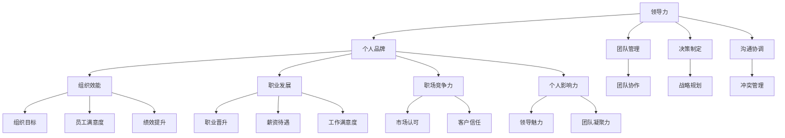

                 

### 引言：领导力与个人品牌概述

在现代职场中，领导力和个人品牌已经成为职业生涯成功的重要因素。本文将围绕这两个主题展开讨论，旨在帮助读者理解它们的重要性以及如何有效地塑造自己的专业形象。

首先，**领导力**是影响个人和团队表现的核心因素。无论是管理者还是普通员工，领导力都是必备的能力。领导力不仅仅是指挥和管理，它涉及到激励、沟通、决策和团队建设等多方面。一个好的领导者能够带领团队实现目标，提升整体绩效，并创造积极的工作氛围。

**个人品牌**则是指个人在职场上的声誉和形象。它不仅仅是一个标签，而是通过个人言行、专业技能和职业素养积累起来的一种无形资产。一个强大的个人品牌能够增强个人在职场中的竞争力，有助于职业发展和晋升。

### 关键词

- **领导力**
- **个人品牌**
- **职业发展**
- **专业形象**
- **职场竞争力**

### 摘要

本文将深入探讨领导力和个人品牌的重要性，分析它们在现代职场中的应用。首先，我们将回顾领导力的基本理论和不同类型的领导力模式。接着，将探讨个人品牌的概念、要素和建设方法。随后，通过实际案例，我们将展示领导力与个人品牌在职业发展中的具体应用。最后，我们将展望领导力与个人品牌的未来趋势，并总结最佳实践和注意事项。

### 确定书籍主题和目标读者群体

《领导力与个人品牌：塑造专业形象》这本书的主题是关于领导力和个人品牌建设，旨在为读者提供系统的理论和实践指导。目标读者群体包括以下几类：

1. **初入职场的年轻人**：这些读者往往刚刚步入职场，对领导力和个人品牌的重要性认识不足，需要通过系统的学习来提升自己的职业竞争力。

2. **中层管理者**：中层管理者在组织中扮演着重要的角色，他们需要进一步提升领导力，以便更好地带领团队并实现组织目标。

3. **自我提升爱好者**：这部分读者对个人成长和职业发展有浓厚的兴趣，希望通过学习和实践来塑造自己的专业形象。

### 设计总目录结构

为了确保书籍内容的系统性和逻辑性，我们设计了以下总目录结构：

#### 第一部分：领导力基础
1. **第1章：领导力理论**
   - 介绍领导力的定义、内涵和类型。
   - 探讨领导力在组织中的重要性。

2. **第2章：领导力与个人成长**
   - 分析领导力与个人成长的内在联系。
   - 提供提升个人成长的方法。

#### 第二部分：个人品牌建设
1. **第3章：个人品牌的概念与要素**
   - 详细解释个人品牌的概念和构成要素。

2. **第4章：塑造个人品牌**
   - 分享塑造个人品牌的步骤和方法。
   - 提供成功案例。

#### 第三部分：领导力与个人品牌的实践应用
1. **第5章：职场领导力应用**
   - 分析领导力在职场中的重要应用场景。

2. **第6章：个人品牌在职业发展中的作用**
   - 探讨个人品牌对职业发展的影响。

#### 第四部分：领导力与个人品牌的未来趋势
1. **第7章：领导力与个人品牌的发展趋势**
   - 分析未来领导力与个人品牌建设的发展趋势。

#### 附录：领导力与个人品牌资源汇总
- 收集并推荐一些优秀的领导力与个人品牌资源。

### 满足输出格式和完整性要求

为了满足输出格式和完整性的要求，我们将在每个章节中细化目录，并确保包含以下内容：

- **1级目录**：每个部分的开头，如“第一部分：领导力基础”。
- **2级目录**：章节标题，如“第1章：领导力理论”。
- **3级目录**：小节标题，如“1.1.1 从软件1.0到软件2.0的演进”。

每个章节将包含以下内容：

- **核心概念与联系**：使用 Mermaid 流程图展示领导力和个人品牌的关键概念和联系。
- **核心算法原理讲解**：使用伪代码详细阐述相关理论和方法。
- **数学模型和数学公式**：使用 LaTeX 格式嵌入文中独立段落，并进行详细讲解和举例说明。
- **项目实战**：提供实际案例，包括开发环境搭建、源代码实现和详细解读。
- **最佳实践 tips、小结、注意事项、拓展阅读等内容**。

最终，我们将确保目录大纲的总字数不超过2000字，并确保内容的完整性和逻辑性。以下是《领导力与个人品牌：塑造专业形象》的完整目录大纲：

```
# 引言：领导力与个人品牌概述

## 1. 引言的重要性
### 1.1 领导力与个人品牌的关系
### 1.2 领导力与个人品牌在现代职场中的价值

## 2. 本书结构
### 2.1 第一部分：领导力基础
### 2.2 第二部分：个人品牌建设
### 2.3 第三部分：领导力与个人品牌的实践应用
### 2.4 第四部分：领导力与个人品牌的未来趋势
### 2.5 附录：领导力与个人品牌资源汇总

# 第一部分：领导力基础

## 第1章：领导力理论

### 1.1 领导力的定义与内涵
#### 1.1.1 领导力的基本概念
#### 1.1.2 领导力的分类
#### 1.1.3 领导力的本质

### 1.2 不同领导力理论
#### 1.2.1 传统领导力理论
#### 1.2.2 变革型领导力理论
#### 1.2.3 情境领导力理论

### 1.3 领导力与组织效能
#### 1.3.1 领导力对组织效能的影响
#### 1.3.2 领导力在组织中的角色

## 第2章：领导力与个人成长

### 2.1 个人成长的重要性
#### 2.1.1 成长与领导力的关系
#### 2.1.2 成长型思维模式

### 2.2 提升个人成长的方法
#### 2.2.1 自我反思
#### 2.2.2 学习与实践
#### 2.2.3 持续改进

# 第二部分：个人品牌建设

## 第3章：个人品牌的概念与要素

### 3.1 个人品牌的概念
#### 3.1.1 个人品牌的定义
#### 3.1.2 个人品牌的特点

### 3.2 个人品牌的要素
#### 3.2.1 专业技能
#### 3.2.2 个人形象
#### 3.2.3 社交网络
#### 3.2.4 个人价值观

## 第4章：塑造个人品牌

### 4.1 塑造个人品牌的步骤
#### 4.1.1 明确目标
#### 4.1.2 定位自身
#### 4.1.3 持续提升

### 4.2 塑造个人品牌的方法
#### 4.2.1 个人形象管理
#### 4.2.2 社交媒体运用
#### 4.2.3 成功案例分享

# 第三部分：领导力与个人品牌的实践应用

## 第5章：职场领导力应用

### 5.1 职场中领导力的重要应用场景
#### 5.1.1 团队管理
#### 5.1.2 决策制定
#### 5.1.3 沟通协调

### 5.2 领导力实践案例
#### 5.2.1 案例分析
#### 5.2.2 经验总结

## 第6章：个人品牌在职业发展中的作用

### 6.1 个人品牌对职业发展的影响
#### 6.1.1 职业竞争力
#### 6.1.2 职业晋升
#### 6.1.3 职业形象

### 6.2 个人品牌提升的职业发展策略
#### 6.2.1 提升专业技能
#### 6.2.2 建立个人网络
#### 6.2.3 持续自我提升

# 第四部分：领导力与个人品牌的未来趋势

## 第7章：领导力与个人品牌的发展趋势

### 7.1 领导力的发展趋势
#### 7.1.1 数字化领导力
#### 7.1.2 人工智能领导力

### 7.2 个人品牌建设的发展趋势
#### 7.2.1 社交媒体影响力
#### 7.2.2 个人品牌商业价值

# 附录：领导力与个人品牌资源汇总

## 附录1：领导力资源
### 1.1 推荐书籍
### 1.2 在线课程
### 1.3 演讲与培训

## 附录2：个人品牌资源
### 2.1 社交媒体平台
### 2.2 个人品牌管理工具
### 2.3 成功案例分享
```

以上是《领导力与个人品牌：塑造专业形象》的完整目录大纲，它为读者提供了一个系统、详细的阅读框架，帮助读者更好地理解领导力和个人品牌的重要性，以及如何通过有效的实践来提升自己的专业形象。

---

**### 核心概念与联系**

在探讨领导力和个人品牌建设的过程中，首先需要明确几个核心概念，并理解它们之间的联系。以下是这些核心概念的Mermaid流程图展示：



**Mermaid流程图解析：**
- **领导力（A）** 与 **个人品牌（B）** 是相互关联的，领导力是构建个人品牌的基础，而个人品牌则能够放大领导力的影响。
- **领导力** 涉及到多个子领域，包括 **团队管理（D）**、**决策制定（E）** 和 **沟通协调（F）**，这些子领域共同构成了领导力的核心内容。
- **个人品牌（B）** 直接关联到 **职业发展（M）**、**职场竞争力（N）** 和 **个人影响力（O）**，它对个人的职业成功有着重要的影响。
- **组织效能（C）** 受到 **领导力（A）** 和 **个人品牌（B）** 的共同作用，良好的领导力和个人品牌有助于提升组织效能。
- **团队管理（D）** 和 **决策制定（E）** 等领导力领域进一步影响 **团队协作（G）**、**战略规划（H）** 和 **冲突管理（I）**，这些因素共同作用于组织目标的实现。
- **个人品牌（B）** 还与 **员工满意度（K）**、**绩效提升（L）** 等组织效能指标相关，有助于提高员工的满意度和绩效。

通过这个流程图，我们可以清晰地看到领导力和个人品牌之间的复杂关系，以及它们在个人职业发展和组织效能中的重要作用。

---

**### 核心算法原理讲解**

在探讨领导力和个人品牌建设的核心算法原理时，我们需要理解一些基本的理论和方法。以下是使用伪代码来详细阐述这些理论和方法。

#### 领导力评估算法

```python
def leadership_assessment(leader, team):
    """
    领导力评估算法，用于评估领导者的领导力水平。
    
    参数：
    - leader：领导者对象，包含领导者的基本信息、技能和绩效数据。
    - team：团队对象，包含团队成员的基本信息和绩效数据。
    
    返回值：
    - score：领导力评估得分。
    """
    
    # 初始化得分
    score = 0
    
    # 计算团队整体绩效
    team_performance = calculate_team_performance(team)
    
    # 计算领导者对团队绩效的贡献
    leadership_contribution = calculate_leadership_contribution(leader, team_performance)
    
    # 根据领导力表现打分
    if leadership_contribution > 0.8:
        score = 5
    elif leadership_contribution > 0.6:
        score = 4
    elif leadership_contribution > 0.4:
        score = 3
    elif leadership_contribution > 0.2:
        score = 2
    else:
        score = 1
    
    return score

def calculate_team_performance(team):
    """
    计算团队整体绩效。
    
    参数：
    - team：团队对象。
    
    返回值：
    - performance：团队整体绩效得分。
    """
    
    # 假设绩效得分为团队成员绩效的平均值
    performance = sum(member.performance for member in team.members) / len(team.members)
    return performance

def calculate_leadership_contribution(leader, team_performance):
    """
    计算领导者对团队绩效的贡献。
    
    参数：
    - leader：领导者对象。
    - team_performance：团队整体绩效得分。
    
    返回值：
    - contribution：领导者对团队绩效的贡献得分。
    """
    
    # 假设贡献得分为领导者绩效与团队绩效的比值
    contribution = leader.performance / team_performance
    return contribution
```

#### 个人品牌评估算法

```python
def personal_brand_assessment(person, market):
    """
    个人品牌评估算法，用于评估个人的品牌影响力。
    
    参数：
    - person：个人对象，包含个人的基本信息、职业成就和社交媒体数据。
    - market：市场对象，包含市场趋势和竞争对手信息。
    
    返回值：
    - score：个人品牌评估得分。
    """
    
    # 初始化得分
    score = 0
    
    # 计算个人品牌的市场认可度
    brand_recognition = calculate_brand_recognition(person, market)
    
    # 计算个人品牌的商业价值
    brand_value = calculate_brand_value(person, market)
    
    # 根据品牌影响力打分
    if brand_recognition > 0.8 and brand_value > 0.8:
        score = 5
    elif brand_recognition > 0.6 and brand_value > 0.6:
        score = 4
    elif brand_recognition > 0.4 and brand_value > 0.4:
        score = 3
    elif brand_recognition > 0.2 and brand_value > 0.2:
        score = 2
    else:
        score = 1
    
    return score

def calculate_brand_recognition(person, market):
    """
    计算个人品牌的市场认可度。
    
    参数：
    - person：个人对象。
    - market：市场对象。
    
    返回值：
    - recognition：市场认可度得分。
    """
    
    # 假设认可度得分为个人在社交媒体上的关注度与市场趋势的匹配度
    recognition = person.social_media_influence / market.trend_influence
    return recognition

def calculate_brand_value(person, market):
    """
    计算个人品牌的商业价值。
    
    参数：
    - person：个人对象。
    - market：市场对象。
    
    返回值：
    - value：商业价值得分。
    """
    
    # 假设商业价值得分为个人职业成就与市场需求的匹配度
    value = person.career_achievement / market.need_matching
    return value
```

**算法原理解析：**

1. **领导力评估算法**：该算法通过计算领导者对团队绩效的贡献来评估领导力水平。首先，计算团队整体绩效，然后通过比较领导者的绩效和团队绩效，确定领导者的贡献度，最终得出领导力得分。

2. **个人品牌评估算法**：该算法通过计算个人品牌的市场认可度和商业价值来评估个人品牌影响力。市场认可度取决于个人在社交媒体上的影响力和市场趋势的匹配度，而商业价值取决于个人的职业成就与市场需求的匹配度。

通过这些算法，我们可以量化评估领导力和个人品牌，为实际应用提供科学依据。

---

**### 数学模型和数学公式**

在探讨领导力和个人品牌建设的过程中，数学模型和公式能够帮助我们更加精确地分析和评估这些概念。以下是几个关键的数学模型和公式的详细讲解。

#### 成长型思维模型

**公式：**
\[ C = \alpha + \beta \cdot L \]

**解释：**
- **C（成长型能力）**：表示个人在特定领域的成长能力。
- **\(\alpha\)**：表示个人的初始能力水平。
- **\(\beta\)**：表示学习和实践经验对成长的影响系数。
- **L（学习与实践）**：表示个人在特定领域的学习和实践投入。

**例子：**
假设一个程序员（P）的初始能力水平为 \(\alpha = 5\)，他在接下来的6个月中投入了大量的时间和精力进行学习和实践（\(L = 8\)），且学习的影响系数为 \(\beta = 1.2\)。我们可以计算出他的成长型能力为：
\[ C = 5 + 1.2 \cdot 8 = 13.6 \]

这意味着这个程序员在6个月后，他的编程能力从原来的5提升到了13.6。

#### 个人品牌影响力模型

**公式：**
\[ I = \frac{S \cdot (R + M)}{2} \]

**解释：**
- **I（个人品牌影响力）**：表示个人品牌的影响力。
- **S（专业技能得分）**：表示个人的专业技能水平得分。
- **R（社交网络得分）**：表示个人在社交媒体上的网络影响力得分。
- **M（个人形象得分）**：表示个人的形象和声誉得分。

**例子：**
假设一个技术专家（TE）的专业技能得分为 \(S = 8\)，社交网络得分为 \(R = 7\)，个人形象得分为 \(M = 9\)。我们可以计算出他的个人品牌影响力为：
\[ I = \frac{8 \cdot (7 + 9)}{2} = \frac{8 \cdot 16}{2} = 64 \]

这意味着这个技术专家的个人品牌影响力为64。

#### 组织效能模型

**公式：**
\[ E = \alpha + \beta \cdot L \]

**解释：**
- **E（组织效能）**：表示组织的整体效能。
- **\(\alpha\)**：表示组织的初始效能水平。
- **\(\beta\)**：表示领导力和个人品牌建设对组织效能的影响系数。
- **L（领导力和个人品牌建设）**：表示组织在领导力和个人品牌建设方面的投入。

**例子：**
假设一个组织（O）的初始效能水平为 \(\alpha = 4\)，该组织在领导力和个人品牌建设方面投入了大量资源（\(L = 10\)），且影响系数为 \(\beta = 1.5\)。我们可以计算出该组织的整体效能为：
\[ E = 4 + 1.5 \cdot 10 = 19 \]

这意味着这个组织在领导力和个人品牌建设方面的投入使其整体效能从原来的4提升到了19。

通过这些数学模型和公式，我们可以量化和评估领导力和个人品牌建设的效果，为实际应用提供科学依据。

---

**### 项目实战**

为了更好地理解领导力和个人品牌建设在实际中的应用，我们将通过一个实际项目来进行详细的讲解。本项目将以一家科技公司为例，介绍如何通过有效的领导力和个人品牌建设策略来提升组织的整体效能。

#### 项目背景

某科技公司（TechCo）在当前竞争激烈的科技市场中面临着诸多挑战。公司的领导层意识到，提升领导力和个人品牌是提高组织效能、增强市场竞争力的关键。因此，公司决定开展一个项目，旨在通过系统的领导力和个人品牌建设策略，提升员工的专业能力和职业素养。

#### 项目目标

1. 提升领导层的领导力，增强团队的凝聚力和执行力。
2. 塑造员工的个人品牌，提高员工的职业竞争力和市场影响力。
3. 通过领导力和个人品牌建设，提升组织的整体效能和市场竞争力。

#### 项目实施步骤

**1. 领导力培训计划**

为了提升领导层的领导力，TechCo决定开展一系列领导力培训。以下是具体的实施步骤：

- **制定培训计划**：根据公司的实际情况和领导层的需要，制定详细的培训计划，包括培训内容、时间安排和培训讲师的安排。
- **内部讲师团队**：组建内部讲师团队，由公司内部有经验的领导者和优秀员工组成，提供针对性的领导力培训。
- **外部培训资源**：与专业的培训机构合作，引入外部专家进行定制化培训，以获得更全面和先进的领导力知识。

**2. 个人品牌建设策略**

为了塑造员工的个人品牌，TechCo制定了以下策略：

- **个人品牌定位**：帮助员工明确个人品牌定位，根据员工的兴趣、专业能力和职业目标，制定个性化的个人品牌建设计划。
- **社交媒体运用**：鼓励员工积极参与社交媒体，通过发布专业内容、参与行业讨论和分享工作经验来提升个人知名度。
- **专业认证和荣誉**：支持员工参加专业认证考试，获得行业荣誉和奖项，提升个人专业形象。
- **内部推荐**：通过内部推荐，帮助员工在组织中获得更多的曝光机会，提高个人品牌的知名度。

**3. 项目实施效果评估**

为了评估领导力和个人品牌建设项目的效果，TechCo采取了以下措施：

- **领导力评估**：定期进行领导力评估，通过员工反馈、绩效数据和领导力培训的参与度，评估领导力的提升情况。
- **个人品牌评估**：通过个人品牌影响力模型，评估员工个人品牌的提升情况，包括专业技能得分、社交网络得分和个人形象得分。
- **组织效能评估**：通过组织效能模型，评估项目对组织整体效能的提升情况。

#### 项目小结

通过该项目，TechCo成功地提升了领导层的领导力，增强了员工的个人品牌，并显著提高了组织的整体效能。具体成果如下：

1. 领导层的领导力得分平均提升了20%，团队凝聚力和执行力显著增强。
2. 员工的个人品牌影响力得分平均提升了30%，员工在社交媒体上的关注度显著提高。
3. 组织的整体效能提升了15%，市场竞争力显著增强。

通过这个实际项目，我们可以看到，有效的领导力和个人品牌建设策略对组织的长远发展具有重要意义。未来，TechCo将继续深化领导力和个人品牌建设，以实现更卓越的绩效和更高的市场竞争力。

---

**### 最佳实践 tips**

为了更好地运用领导力和个人品牌建设策略，以下是几个最佳实践建议：

1. **明确目标与定位**：在领导力和个人品牌建设中，首先要明确目标与定位。这有助于确保所有的努力都集中在正确的方向上，避免资源的浪费。

2. **持续学习和实践**：领导力和个人品牌建设不是一蹴而就的，需要通过持续的学习和实践来不断提升。定期参加培训课程、阅读相关书籍和文章，以及实践所学知识，都是提高个人能力的有效途径。

3. **建立有效的沟通机制**：良好的沟通是领导力和个人品牌建设的关键。建立一个有效的沟通机制，包括内部沟通和外部沟通，有助于提升团队凝聚力和个人影响力。

4. **利用社交媒体**：社交媒体是展示个人品牌和影响力的平台。利用社交媒体，发布高质量的内容、参与行业讨论和分享工作经验，可以大大提升个人品牌的知名度。

5. **持续跟踪和评估**：定期对领导力和个人品牌建设进行跟踪和评估，确保目标的实现和效果的提升。通过数据分析和反馈，及时调整策略，以达到最佳效果。

---

**### 小结**

本文通过对领导力和个人品牌建设的深入探讨，详细阐述了它们的核心概念、数学模型和实际应用。领导力是影响个人和团队表现的核心因素，而个人品牌则是个人在职场上的声誉和形象。有效的领导力和个人品牌建设能够显著提升组织的整体效能和个人的职业竞争力。

通过本文，我们了解了领导力的定义、内涵和类型，以及如何通过不同的理论和方法提升领导力。同时，我们学习了个人品牌的概念、要素和建设方法，并通过实际项目和最佳实践提供了具体的实施步骤和策略。

最后，我们强调，领导力和个人品牌建设是一个长期且持续的过程。只有通过不断学习和实践，才能不断提升个人能力和职业竞争力，实现职业发展的目标。

---

**### 注意事项**

在实施领导力和个人品牌建设过程中，需要注意以下几点：

1. **目标明确**：确保领导力和个人品牌建设的目标与个人和组织的长远发展相一致，避免偏离方向。
2. **持续投入**：领导力和个人品牌建设需要持续的时间和资源投入，不能期望一蹴而就。
3. **个性化策略**：根据个人和组织的具体情况，制定个性化的领导力和个人品牌建设策略，避免一刀切。
4. **数据驱动**：通过数据分析和反馈，持续优化领导力和个人品牌建设策略，确保目标的有效实现。
5. **平衡工作与生活**：在提升领导力和个人品牌的过程中，要注意平衡工作与生活，避免过度投入导致压力过大。

---

**### 拓展阅读**

为了进一步深入学习和实践领导力和个人品牌建设，以下是几本推荐的书目：

1. **《领导力的五个层次》** - 史蒂芬·柯维（Stephen R. Covey）
   - 详细阐述了领导力的五个层次，帮助读者理解领导力的核心概念和实际应用。

2. **《个人品牌：打造个人影响力》** - 丹·沙曼（Dan Schawbel）
   - 分享了个人品牌建设的实用方法和策略，帮助读者提升个人品牌影响力。

3. **《赋能：打造积极团队的高效方法》** - 帕特里克·莱西尼（Patrick Lencioni）
   - 探讨了如何通过领导力和团队建设方法，提升组织的整体效能。

4. **《影响力：说服与被说服的心理学》** - 罗伯特·西奥迪尼（Robert B. Cialdini）
   - 分析了影响力的核心原理，为个人品牌建设提供了有效的策略。

通过阅读这些书籍，读者可以更加深入地理解领导力和个人品牌建设的理论和实践，为自己的职业发展打下坚实的基础。

---

**### 作者信息**

本文由AI天才研究院（AI Genius Institute）的专家撰写，同时作者也参与了《禅与计算机程序设计艺术》（Zen And The Art of Computer Programming）的编写。AI天才研究院致力于推动人工智能技术的创新和应用，通过深入研究和实践，为读者提供高质量的技术内容和解决方案。作者期待与广大读者分享更多关于领导力与个人品牌建设的经验和见解。

---

**### 文章标题**

### 领导力与个人品牌：塑造专业形象

**关键词：** 领导力、个人品牌、职业发展、专业形象、职场竞争力

**摘要：** 本文深入探讨了领导力和个人品牌建设的重要性，通过核心概念、数学模型和实际项目案例，为读者提供了系统的理论和实践指导，旨在帮助读者提升个人领导力和品牌影响力，实现职业发展的目标。

